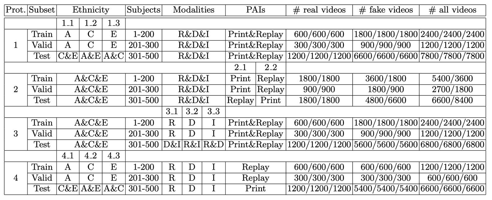
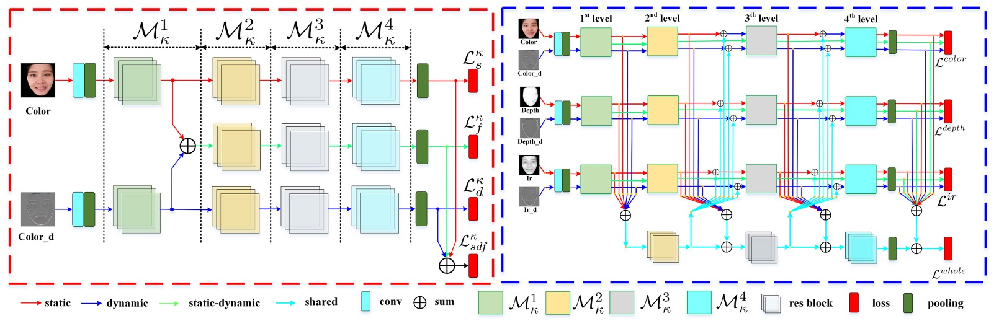
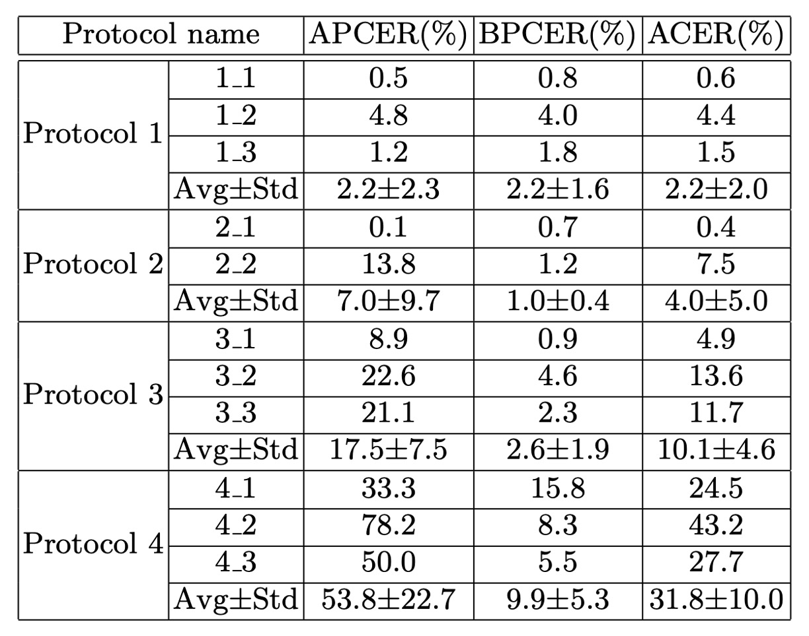

## 模型的歧視

[**CASIA-SURF CeFA: A Benchmark for Multi-modal Cross-ethnicity Face Anti-spoofing**](https://arxiv.org/abs/2003.05136)

---

論文題目中的 CASIA-SURF 指的是中國科學院自動化研究所（Chinese Academy of Sciences, Institute of Automation，簡稱 CASIA）所建立的一個臉部防偽資料集，名為：

> **CASIA-SURF: A Large-Scale Multi-Modal Benchmark for Face Anti-Spoofing**

這個資料集於 2019 年發布，是在當時針對多模態臉部防偽（multi-modal face anti-spoofing） 所建立的重要資料集之一。

這篇論文是針對種族偏差所提出的延伸版資料集，全名為 CASIA-SURF CeFA。

## 定義問題

在 FAS 這條路上，大家都在追求「更準、更快、更泛化」的模型。

但有個老問題，大家卻避而不談：**種族偏差（Ethnic Bias）**。

所以人們這是忘了？還是不敢想起來？

---

如果你做過人臉辨識，就一定對這個議題不陌生。

由於目前人臉辨識的大型公開資料集中的人臉大多來自「白人」，這導致其他種族的辨識性能較差，比較嚴重的甚至會導致系統的錯誤回應。

因此誰想要解決這個問題，都必須自己動手收集「目標族群」的資料集，這樣才能讓模型學習到穩定且正確的特徵。

這個問題在 FAS 上也一樣。

作者發現目前的 SOTA 模型一旦跨種族，表現立刻跳水，根據他們的實驗：

> **同樣 FAS 模型在中亞族群上的 ACER 至少比東亞族群高 8%**。

想想看，如果你今天部署的模型一遇到特定族群就會大量噴出：Fake！Fake！Fake！

客戶是不是會立刻會把這個系統連同你這個部署工程師一起扔到河裡？

## 解決問題

:::tip
本篇論文的重點在於資料集的內容和設計，模型架構只會簡單講一下。
:::

### CeFA 資料集

將 CeFA 與其他數據集比較如下表：

<figure style={{"width": "90%"}}>

</figure>

---

CeFA 使用 Intel RealSense 相機擷取三模態影片資料，包含 RGB（彩色）、Depth（深度）與 IR（紅外線）。每段影片解析度為 1280 × 720，幀率為 30 fps。

拍攝時，受試者被要求自然地轉動頭部，最大偏轉角度約為 30 度，模擬實際場景中人臉的自然動態。

資料的前處理流程如下：

- 人臉偵測採用 **3DFFA** 模型（取代 PRNet）
- 將對齊後的人臉區域擷取出來，並保留三模態對應樣本
- 多模態臉部樣本如下圖所示：

  

---

CeFA 資料集由兩個子集組成：**2D 攻擊子集** 與 **3D 攻擊子集**，涵蓋三個族群（非洲裔、東亞裔、中亞裔），並設計多樣的攻擊方式與光照條件。

- **2D 攻擊子集（Print & Replay）**

  - **族群人數**：
    - 每個族群 500 位受試者，共 1500 人
  - **每位受試者提供樣本**：
    - 1 筆真實樣本
    - 2 筆列印攻擊（室內、室外各一）
    - 1 筆影片回播攻擊
  - **模態資料**：
    - 每筆樣本同步擷取 RGB、Depth、IR 三模態
  - **總樣本數**：
    - 1500 人 × 4 段影片 = 6000 段 × 3 模態 = **18000 段影片**

  論文亦提供 2D 子集中受試者的年齡與性別統計資訊，有助於後續進行公平性分析。

---

- **3D 攻擊子集（3D 面具與矽膠面具）**

  此子集模擬更具擬真性的進階攻擊場景，包含兩類攻擊：

  - **3D 列印面具攻擊**

    - 受試者數量：99 人
    - 每人樣本：
      - 3 種攻擊樣式：
      - 單純面具
      - 假髮＋眼鏡
      - 假髮不戴眼鏡
      - 6 種光照條件：
      - 室外陽光、室外陰影
      - 室內側光、正面光、逆光、常規光
      - 共 18 段影片 × 3 模態

  - **總樣本數**：99 × 18 × 3 = **5346 段影片**

  - **矽膠面具攻擊**
    - 受試者數量：8 人
    - 每人樣本：
      - 2 種攻擊樣式：
      - 假髮＋眼鏡
      - 假髮不戴眼鏡
      - 4 種光照條件：
      - 室內側光、正面光、逆光、常規光
      - 共 8 段影片 × 3 模態
  - **總樣本數**：8 × 8 × 3 = **196 段影片**

  3D 子集雖在數量上相對較小，但攻擊樣式逼真、變因複雜，是檢驗模型泛化能力的重要測試組合。

## 評估協定

:::tip
這四個協定的詳細概念，在之前的論文我們已經介紹許多次了，以下我們就簡單帶過。
:::

為了系統性地評估模型在不同場景下的泛化能力，CeFA 資料集設計了四種評估協定，涵蓋跨種族、跨攻擊類型、跨模態與其組合等挑戰。

下表為每個協定的具體配置：

<figure style={{"width": "90%"}}>

</figure>

- **Protocol 1: Cross-ethnicity**

  此協定針對現有 PAD 資料集普遍缺乏種族標註與跨族群測試設定的問題，設計用以評估模型在面對未見過族群時的泛化能力。

  作法為選擇其中一個族群的受試者進行訓練與驗證，剩餘兩個族群的資料作為測試集，共構成三種不同的實驗配置。

  此設定模擬模型在特定族群上開發後，部署於其他族群環境中的真實情境。

  ***

- **Protocol 2: Cross-PAI**

  此協定針對演示攻擊工具（Presentation Attack Instrument, PAI）在攻擊形式上的多樣性與不可預測性，評估模型在面對未知攻擊樣式時的穩健性。

  訓練與驗證階段僅使用部分攻擊類型進行建模，測試階段則使用未見過的攻擊手法，觀察模型是否能辨識出不同型態的假臉行為。

  ***

- **Protocol 3: Cross-modality**

  此協定設計用以探索模型在模態變化下的泛化能力。在訓練階段僅使用一種模態（RGB、Depth 或 IR）進行學習，測試階段則使用剩下的兩種模態進行評估。

  此設定針對現實應用中感測器設備可能受限或模態資訊不完整的情況，檢驗模型是否能在缺乏跨模態特徵對齊的條件下仍維持辨識效能。

  ***

- **Protocol 4: Cross-ethnicity & Cross-PAI**

  此為最具挑戰性的協定，結合 Protocol 1 與 Protocol 2 的條件，測試集同時包含未知族群與未知攻擊類型。

  此設定模擬實際部署中最難的情境，即模型在面對從未見過的族群樣貌與攻擊手法時，是否仍具備基本的辨識能力。此協定可有效揭示模型的真實泛化能力與偏差敏感性。

## 模型架構

針對 CeFA 資料集，本文提出的模型分為兩大模組：

1. **SD-Net**：單模態的靜動態特徵提取網路，專注於單一模態下的空間與時間訊息捕捉。
2. **PSMM-Net**：部分共享的多模態網路，設計用於不同模態間的特徵融合與交互學習。

---

### SD-Net

SD-Net 處理 RGB、Depth 或 IR 單一模態輸入，設計核心在於同時擷取靜態影像與動態序列資訊。整體由三個特徵分支組成：

- **Static Branch（紅色箭頭）**：處理單張靜態影像，提取空間特徵。
- **Dynamic Branch（藍色箭頭）**：透過 Rank Pooling 對 K 幀序列進行摘要，轉換為一張動態特徵圖。
- **Static-Dynamic Branch（綠色箭頭）**：融合上述兩支特徵，強化空間與時間的交互理解。

三支分支均以 ResNet-18 為骨幹，包含五層殘差模組與一個全域平均池化（GAP）層。其中 **Static-Dynamic 分支的輸入** 是來自 Static 與 Dynamic 分支 **res1 層輸出之加總**。

每層模組表示為 $M_t^\kappa$，其中：

- $\kappa \in \{color, depth, ir\}$：模態類型；
- $t = 1 \sim 4$：表示特徵層級。

每個分支於每層產出獨立特徵向量，分別記為：

- $X_t^{s,\kappa}$（Static）
- $X_t^{d,\kappa}$（Dynamic）
- $X_t^{f,\kappa}$（Fusion）

為了確保三條分支能學習到互補資訊，作者為每條分支設計了**獨立損失函數（採用 BCE）**，並另外引入一個綜合特徵的損失：

$$
L_\kappa = L_\kappa^s + L_\kappa^d + L_\kappa^f + L_\kappa^{sdf}
$$

---

### PSMM-Net

接著來看 PSMM-Net 的部分。

PSMM-Net 的目的是捕捉模態間的共通語意與互補訊息，由兩部分構成：

1. **Modality-specific Networks**：三個 SD-Net，分別對應 RGB、Depth、IR 三模態，各自獨立提取靜動態特徵。
2. **Shared Branch**：基於 ResNet-18 架構（去除 conv 與 res1 層），用於建模模態間的共享語意。

為了實現有效的模態交互，PSMM-Net 採用了 **雙向融合策略**：

- **Forward Feeding（往 shared branch 傳）**

  將三個模態的靜態與動態特徵在各層加總後，輸入 shared branch：

  $$
  \tilde{S}_t = \sum_{\kappa} X_t^{s,\kappa} + \sum_{\kappa} X_t^{d,\kappa} + S_t
  $$

  其中 $S_t$ 是 shared branch 第 $t$ 層的輸出（$S_1 = 0$，從零開始）。

  ***

- **Backward Feeding（從 shared branch 回）**

  將 $S_t$ 回饋給各模態 SD-Net，與原始特徵加總，修正輸出特徵：

  $$
  \hat{X}_t^{s,\kappa} = X_t^{s,\kappa} + S_t,\quad \hat{X}_t^{d,\kappa} = X_t^{d,\kappa} + S_t
  $$

  這步驟只作用在 static 與 dynamic 分支，避免 fusion 分支受到模態間語意干擾。

---

整體架構透過 SD-Net 將靜態與動態特徵明確解耦，再透過 PSMM-Net 的雙向模態互動設計，強化模型在不同種族、攻擊樣式下的泛化能力。

最終損失函數為：

$$
L = L_{whole} + L_{color} + L_{depth} + L_{ir}
$$

其中 $L_{whole}$ 是所有模態與 shared branch 特徵加總後的整體損失。

## 討論

### 族群多樣性下的模型偏差分析

<figure style={{"width": "90%"}}>

</figure>

作者針對 CeFA 資料集中三個不同族群（East Asian、Central Asian、African）進行性能偏差分析，觀察當前主流模型在面對族群變異時的辨識表現差異。

實驗設計使用兩個公開資料集上訓練的 SOTA 模型，分別代表多模態與單模態的防偽方法：

- **MS-SEF**：多模態方法，於 CASIA-SURF 上訓練（主要為 East Asian 樣本）
- **FAS-BAS**：單模態 RGB 方法，於 OULU-NPU 上訓練（亦以 East Asian 為主）

訓練完成後，兩個模型皆於 CeFA 資料集的三個族群上進行測試，並以 ACER 作為主要評估指標。

結果顯示 **Central Asian 的辨識效果最差**，兩個模型都在此族群上顯著性能下降，ACER 增加約 7–10%； **East Asian 的辨識效果最佳**，可能與訓練資料集（CASIA-SURF、OULU-NPU）大多為東亞人臉有關，導致模型存在明顯的族群偏向（ethnic bias）。

此實驗凸顯現有單一族群資料集在訓練時對模型泛化能力的限制，當模型面對未見過的族群特徵時，其辨識效能顯著下降。此結果也驗證了 CeFA 設計跨族群協定（Protocol 1）的必要性，有助於進一步推動公平性與泛化能力更佳的臉部防偽研究。

### 基線模型評估結果

<figure style={{"width": "70%"}}>

</figure>

作者針對 SD-Net 與 PSMM-Net 模型，在 CeFA 所設計的四種評估協定下進行全面實驗：

- **Protocol 1：Cross-ethnicity**

  - 子協定 1-1、1-2、1-3 的 ACER 分別為 **0.6%、4.4%、1.5%**。
  - 模型在不同族群之間的表現差異顯示族群偏差確實存在。此結果支持跨族群評估協定的設計動機，也說明在訓練時納入族群多樣性的重要性。

  ***

- **Protocol 2：Cross-PAI（不同攻擊工具泛化）**

  - 子協定 2-1（訓練於 print，測試於 video-replay + 3D）之 ACER 為 **0.4%**。
  - 子協定 2-2（訓練於 video-replay，測試於 print + 3D）之 ACER 為 **7.5%**。
  - 結果顯示不同攻擊工具的物理屬性差異（如螢幕顯示與列印材質）會導致顯著性能落差，顯示現有 PAD 模型對攻擊樣式具明顯敏感性。

    ***

- **Protocol 3：Cross-modality（模態間泛化）**

  - 最佳結果為子協定 3-1，ACER 為 **4.9%**。
  - 模型具備一定程度的模態轉移能力，但表現仍受限於訓練模態與測試模態間的語意對齊程度。此協定突顯多模態資料的重要性，也驗證 PSMM-Net 融合策略的效益。

    ***

- **Protocol 4：Cross-ethnicity & Cross-PAI（雙重泛化測試）**

  - 子協定 4-1、4-2、4-3 的 ACER 分別為 **24.5%、43.2%、27.7%**。
  - 這是最困難場景，需同時面對未知族群與未知攻擊樣式。模型整體表現大幅下降，凸顯真實部署時所面臨的多重泛化挑戰，也驗證 CeFA 設計的價值與難度。

## 結論

這篇論文在當時是最大規模的多模態臉部攻擊偵測資料集，不僅涵蓋 RGB、Depth、IR 三種模態，還首度引入族群標籤，明確將「跨種族泛化」納入討論核心。

模型設計方面，PSMM-Net 的「部分共享 + 雙向融合」策略，搭配 SD-Net 的靜動態特徵解耦，是當時多模態學習中頗具系統性的嘗試之一。雖然後續已有更精簡或更強化跨模態對齊的架構出現，但 PSMM 的設計理念仍然在不少變體架構中留下痕跡。

回頭看，CeFA 提出的貢獻主要在於清楚定義了「跨模態、跨種族、跨攻擊類型」的研究難題，並給出一個合理的起點。對今天的我們來說，這不只是個資料集，而是一道仍在持續延伸的問題空間。
