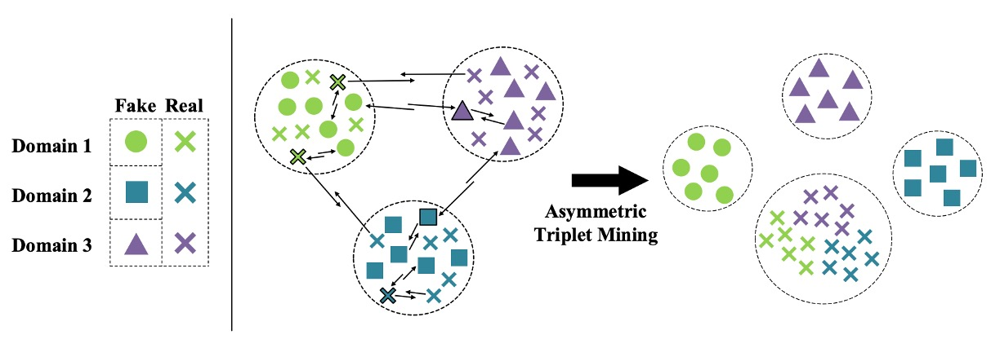
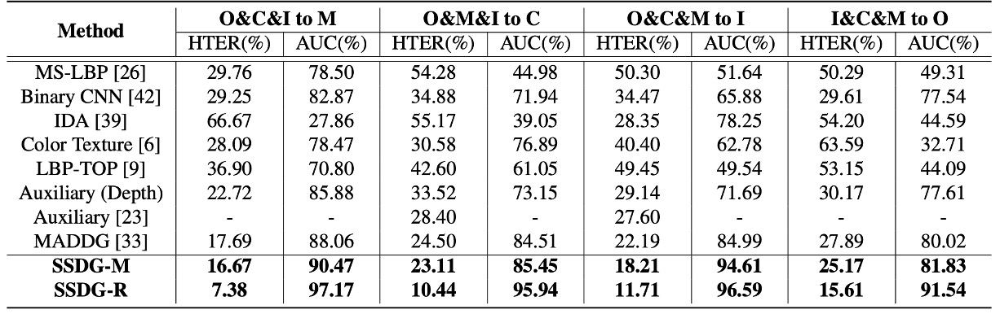
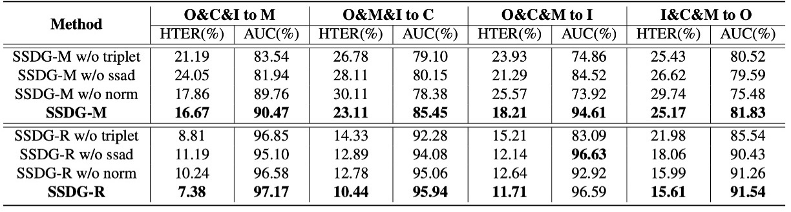

## 穩定的真實

[**Single-Side Domain Generalization for Face Anti-Spoofing**](https://arxiv.org/abs/2004.14043)

---

用來攻擊人臉辨識系統的手法花樣百出，解題的辦法也不遑多讓。

從這篇開始我們可以來看一下，基於 Domain Generalization（DG）技術的 FAS 研究。

## 定義問題

為了 FAS 的問題，研究者們發展出兩大類技術路線：

- **紋理導向**：
  透過圖像的細節差異來辨識真假臉，例如顏色失真、材質紋理異常等。方法包含手工特徵（如 LBP、HOG、SIFT）以及近年來的 CNN 特徵學習。

- **時間序列導向**：
  分析多幀影像中的變化，例如眼睛眨動、嘴部動作或 rPPG 脈搏訊號等，搭配 CNN-LSTM 或 RNN 架構來捕捉活體跡象。

這些方法在特定資料集內（intra-database）表現相當亮眼，但一旦模型被丟到另一個資料集上（cross-database），準確率便急遽下滑。

舉個例子吧：

<div align="center">
<figure style={{"width": "70%"}}>

</figure>
</div>

我們先看左邊這張圖。

以實務上的經驗來說，每個顏色可以代表「某個手機型號」：

- **綠色**：iPhone XX
- **紫色**：Samsung OO
- **藍色**：Pixel YY

然後是：

- **橘色**：某一隻攝影成像品質跟大家截然不同的手機，但沒有在訓練資料集內。

---

當我們用前三種資料集訓練了一個 FAS 模型後，這才發現「橘色」手機的通過率特別低。可是偏偏橘色手機的使用者特別多，所以我們推送這個模型後，就會收到海量的客訴。

原本我們期待的是右邊這張圖的情況，模型在訓練階段就有一定的泛化能力，能夠在不同的資料來源上都能有不錯的表現，但現實卻狠狠打了我們一巴掌。

無法有效泛化到不同的資料來源的問題會一再重複發生，其中原因有很多：

- **分佈差異**：訓練資料集與測試資料集的來源不同，例如背景、解析度、光線條件、拍攝設備與人種組成。
- **假臉的多樣性遠高於真臉**，從攻擊方式到製作流程變化極大，使得統整假臉特徵變得困難，進而導致分類邊界模糊化。

傳統方法過度依賴資料集特有特徵，導致模型學到的表示帶有明顯「資料集偏見」。

因此，本篇論文的作者認為 FAS 的命題應該是：

> **在無法使用任何目標資料的前提下，設計一個具備高泛化能力的模型。**

不然，哪怕是我們搜集再多的資料集，也還是無法應對來自不同來源、不同攻擊類型的假臉。

## 解決問題

<div align="center">
<figure style={{"width": "90%"}}>

</figure>
</div>

為了解決「假臉特徵高度異質」與「真臉相對一致」所帶來的泛化困難，作者提出了一套全新的防偽訓練策略：**Single-Side Domain Generalization（SSDG）**。

如上圖所示，這套架構的設計理念可以概括為一句話：

> **真臉的特徵愈近愈好，假臉不理他們。**

也就是說，SSDG 並不強求為真假臉建構一個共同的泛化空間，而是採取非對稱策略——針對真臉進行跨域對抗訓練，使其分佈趨於一致；對假臉則刻意保留分佈差異，甚至強化其特異性。

這種對比式的學習設計，讓分類邊界更穩固，同時能有效泛化到未見過的目標資料集。

整體模型包含以下幾個關鍵模組：

- 特徵生成器（Feature Generator, G）
- 域分類器（Domain Discriminator, D）
- 防偽分類器（Face Anti-Spoofing Classifier）
- 非對稱 Triplet Loss 訓練
- 特徵與權重正規化模組

我們依序看一下。

### 單邊對抗學習

在 DG 領域中，為了讓模型克服跨域的挑戰，常見的用法是加入對抗訓練（Adversarial Training），讓模型無法分辨樣本來自哪個域（domain），從而學到域不變（domain-invariant）的特徵。

方法很簡單，就是給模型加上一個「域分類器」，讓它學習將樣本分為「來源 A」或「來源 B」。

一般來說，我們會讓分類器隨著分類效果提升而降低其 loss，但在對抗訓練的情境下則相反：分類效果愈好，loss 愈高，迫使模型「不可以」學習到 domain-specific 的特徵。

在這篇論文中，作者提出了一個新的對抗學習方法：

- **單邊對抗學習（Single-Side Adversarial Learning）**。

建模方式如下：

設有 $N$ 個來源資料集，記為 $D = \{D_1, D_2, ..., D_N\}$，每個都包含：

- 真臉樣本 $X_r$
- 假臉樣本 $X_f$

將其餵入特徵生成器，得到特徵表示：

$$
Z_r = G_r(X_r), \quad Z_f = G_f(X_f)
$$

由於參數共用，實際上 $G_r$ 與 $G_f$ 是同一模型 $G$，這只是在概念上區分輸入來源。

接著將 $Z_r$ 輸入域分類器 $D$，判斷其屬於哪個資料集。為了讓模型學到跨域一致的真臉特徵，在這裡會讓特徵生成器 G 嘗試「欺騙」這個分類器，形成一個對抗學習過程。

整體損失函數如下：

$$
\min_D \max_G \ \mathcal{L}_{\text{Ada}}(G, D) = - \mathbb{E}_{(x,y) \sim X_r, Y_D} \sum_{n=1}^{N} \mathbf{1}[n = y] \log D(G(x))
$$

此處的 $Y_D$ 是 domain 標籤，$\mathbf{1}[n = y]$ 是指示函數，表示樣本是否屬於第 $n$ 個資料集。

在這個對抗過程中，**假臉完全不參與**，避免其高變異性污染對抗訓練的穩定性。

為了實作這種「一邊訓練、一邊互相對抗」的機制，作者採用了 **Gradient Reversal Layer（GRL）**。這是一個常見於 DG 模型的 trick，我們等一下再講。

### 非對稱三元組學習

既然這裡放棄了將假臉壓縮進共同特徵空間，那就得想辦法讓它們彼此分離、與真臉拉開距離。這就是非對稱 triplet loss 要解決的問題。

實作方式如下：

假設有三個來源資料集，我們將樣本重新劃分為四類：

- 所有真臉 → 一類（Cross）
- 三組假臉 → 各為一類（Circle / Square / Triangle）

目標是同時滿足：

1. 假臉彼此分開（inter-domain separation）
2. 真臉彼此聚合（intra-class compactness）
3. 真臉與假臉之間拉開距離（inter-class separation）

如下圖所示：

<div align="center">
<figure style={{"width": "80%"}}>

</figure>
</div>

對於每一組 anchor / positive / negative 組合 $(x_a^i, x_p^i, x_n^i)$，非對稱三元組損失定義如下：

$$
\mathcal{L}_{\text{AsTrip}}(G) = \sum_i \left( \|f(x_a^i) - f(x_p^i)\|_2^2 - \|f(x_a^i) - f(x_n^i)\|_2^2 + \alpha \right)
$$

其中 $\alpha$ 是 margin 超參數，控制分類邊界的寬度。

這樣設計可以強制模型學會在特徵空間中自然拉開真假臉的區隔，同時維持真臉的穩定集中分佈。

### 特徵與權重正規化

作者進一步引入了雙重正規化設計，以提升特徵的一致性與分類邊界穩定性：

- **Feature Normalization**：
  對所有輸出特徵進行 L2 正規化，確保它們位於單位球面，消除圖像品質（如光線、鏡頭等）帶來的 norm 差異。

- **Weight Normalization**：
  將分類器的權重向量 $W_i$ 正規化為單位長度，bias 設為 0，使得分類決策簡化為：

$$
\cos(\theta_1) - \cos(\theta_0) = 0
$$

這讓模型專注於**方向性區分**，而不是依賴特徵大小，進一步穩定判別結果。

將上述模組整合後，整個 SSDG 框架的訓練損失為：

$$
\mathcal{L}_{\text{SSDG}} = \mathcal{L}_{\text{Cls}} + \lambda_1 \mathcal{L}_{\text{Ada}} + \lambda_2 \mathcal{L}_{\text{AsTrip}}
$$

其中：

- $\mathcal{L}_{\text{Cls}}$：一般分類器的 cross-entropy 損失
- $\lambda_1, \lambda_2$：平衡係數，用來控制對抗與三元組損失的權重

與過去需先 pre-train 再 fine-tune 的做法不同，SSDG 採取 **end-to-end 訓練策略**，所有模組同步優化，簡化流程，也提高整體穩定性。

:::info
看到這邊，你應該會聯想到人臉辨識領域中的各種 margin-based loss。實作的時候都可以拿來試試看。
:::

## 延伸補充

:::tip
考慮到有些讀者可能沒接觸過 DG，或是對於 GRL 的概念還不太熟悉，我這邊補充一段簡單的技術筆記，讓大家能夠快速理解 GRL 的概念與實作方式。
:::

**什麼是 GRL？為什麼它對 DG 這麼重要？**

在 Domain Generalization（DG）與 Domain Adaptation（DA）中，一個非常經典的技巧叫做 **Gradient Reversal Layer（GRL）**，它最早來自 2015 年的 DANN 論文（Domain-Adversarial Neural Network），核心作用是讓模型在訓練過程中進行「對抗式特徵學習」。

:::info
DANN 是一篇引用數破萬的大論文，有空我們可以來聊聊它的內容。
:::

如果用一句話來解釋 GRL 的話，就是：

> **Forward 時什麼都不做，Backword 時偷偷把梯度「乘上 -1」。**

這麼一來，我們就能創造出兩個訓練目標互相拉扯的效果：**特徵提取器努力「讓資料來源無法被辨識」，而域分類器努力「辨識資料來源」**，這正是對抗學習的精神。

DG 的目標，是讓模型學會不依賴「資料來源」這個資訊，也就是讓特徵具有 **domain-invariant（跨域不變性）**。但這種特徵沒辦法直接「教」，只能透過反向信號來「逼」模型學會：

- 如果資料是來自不同 domain，那麼特徵提取器要騙過 domain classifier，讓它無法分辨
- 若 domain classifier 太強，那特徵提取器就更努力讓 domain 混淆，這種互相拉扯才會收斂出一個對所有 domain 都有效的特徵空間

而 GRL 就是實作這個拉扯機制的利器，讓整個流程可以用標準 backpropagation 自動優化。

我們可以簡單實作一下 GRL 的 forward 與 backward 過程：

```python
import torch
from torch.autograd import Function

class GradientReversalFunction(Function):

    @staticmethod
    def forward(ctx, x, lambd):
        ctx.lambd = lambd
        return x.view_as(x)

    @staticmethod
    def backward(ctx, grad_output):
        return grad_output.neg() * ctx.lambd, None

def grad_reverse(x, lambd=1.0):
    return GradientReversalFunction.apply(x, lambd)
```

使用方式就像這樣插入模型的 forward：

```python
class DomainAdversarialNetwork(torch.nn.Module):

    def __init__(self):
        super().__init__()
        self.feature_extractor = ...
        self.classifier = ...
        self.domain_discriminator = ...

    def forward(self, x, lambd=1.0):
        feat = self.feature_extractor(x)
        class_out = self.classifier(feat)
        # 插入 GRL：反傳時自動反向梯度
        reversed_feat = grad_reverse(feat, lambd)
        domain_out = self.domain_discriminator(reversed_feat)
        return class_out, domain_out
```

其中 `lambd` 是一個控制反向強度的超參數，在 SSDG 論文中使用的是時間動態調整公式：

$$
\lambda = \frac{2}{1 + \exp(-10k)} - 1
\quad \text{with} \quad k = \frac{\text{current\_iters}}{\text{total\_iters}}
$$

這樣設計可以讓模型在訓練初期專注於分類任務，隨著訓練進行，對抗學習的強度逐漸提升，最終達到平衡。

## 討論

### 資料集測試設定

:::info
這個測試的方式到現在（2025 年）都還在用，讀者不妨可以記起來。
:::

作者使用了四個公開的資料集來進行實驗，來源分別是：

- **O：OULU-NPU**
- **C：CASIA-FASD**
- **I：Replay-Attack**
- **M：MSU-MFSD**

測試方式為每次隨機挑選一組資料集作為測試資料集，其餘三組作為訓練資料。這樣的設計可以模擬實際應用中，模型面對全新資料來源的情況，總共有四組測試任務：

- **O & C & I → M**
- **O & M & I → C**
- **O & C & M → I**
- **I & C & M → O**

這樣的交叉設計，能準確模擬部署時最常見的問題：**系統要面對的資料，很可能從來沒出現在訓練集裡。**

### 和其他方法的比較

<div align="center">
<figure style={{"width": "90%"}}>

</figure>
</div>

作者彙整了目前最具代表性的 FAS 方法，在四個 cross-database 測試任務上的表現，包括：

- **CNN-based 方法（Yang et al., Atoum et al.）**
- **時序與生理信號方法（Liu et al. rPPG）**
- **傳統特徵派（LBP、SURF）**
- **MADDG 方法（現有唯一 DG 對手）**

在上面表格中，如果 SSDG 用的是 MADDG-based 架構，則稱為 SSDG-M；如果是用 ResNet18-based 則稱為 SSDG-R 。

實驗結果顯示出 SSDG 大獲全勝，在所有任務上拉開明顯差距：

- HTER 降低
- AUC 提升
- 整體結果一致穩定，沒有「運氣好贏一場」的情況

根據這個結果，作者給出幾個關鍵觀察：

- **大部分現有方法沒處理跨資料集分佈問題**：

  - 它們在 intra-database 上很好看，但一換環境就破功
  - 本質上仍然學到的是 dataset-specific 特徵，而非可泛化表示

- **MADDG 是少數例外，雖使用 DG，但策略上仍有盲點**：

  - 它依然試圖為真假臉共同建構一個 generalized 特徵空間
  - 假臉變化太大、來源太雜，這樣的對齊其實很難收斂，經常導致次優的結果

反觀 SSDG 採取的非對稱學習策略反而更務實：

- 真臉：跨域 alignment，學穩定表示
- 假臉：主動分離，不強行對齊

這個「讓該聚的聚、該散的散」策略，才是 SSDG 真正勝出的地方。

### 消融實驗

<div align="center">
<figure style={{"width": "90%"}}>

</figure>
</div>

在這張表中，作者拆解了 SSDG 的三大核心模組，來觀察單獨移除某個模組會帶來什麼樣的影響：

- **ssad**：單邊對抗學習（Single-side adversarial）
- **triplet**：非對稱三元組損失（Asymmetric triplet loss）
- **norm**：特徵與權重正規化

分析結果顯示：不論是 MADDG-based 還是 ResNet18-based 架構，只要缺了任一模組，HTER 指標就會上升、AUC 就會下降。而完整搭配三個模組的 SSDG 表現最好也最穩定。

這顯示 SSDG 的效能並不是靠某個關鍵技巧硬撐，而是整體設計互相協作、環環相扣。

## 結論

這篇論文提出的 **SSDG 框架**，不是靠更大的網路或更多的資料，而是從策略設計上回應了一個被忽視的事實：

> **真臉是一種穩定訊號，假臉是一種混亂訊號，兩者根本不該被一視同仁。**

透過這個策略，SSDG 在四個公開資料集上全面勝出，甚至在資料受限、架構精簡的情況下仍能撐住場面。這種差異化學習策略在後來成為防偽任務的標準思維模式，不再用一個統一假臉概念處理所有異常樣本。

這也讓 SSDG 成為了 FAS 領域中一個重要的里程碑，開啟了後續許多基於 DG 的研究。
