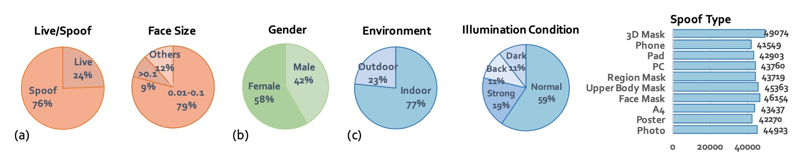
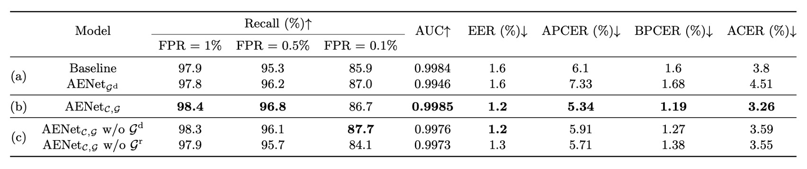

## 大規模防偽試煉

[**CelebA-Spoof: Large-Scale Face Anti-Spoofing Dataset with Rich Annotations**](https://arxiv.org/abs/2007.12342)

---

Face Anti-Spoofing 這幾年已經成為電腦視覺界的熟面孔了，從手機解鎖、門禁掃臉、到行動支付，幾乎所有人臉互動系統都無法逃避「這張臉到底是不是活的」這個靈魂拷問。

但在方法一個接一個疊上來的同時，有個關鍵問題卻悄悄浮出水面：

> **資料集不夠用了。**

---

## 定義問題

大部分現有的 FAS 資料集其實早就出現三個明顯的問題：

1. **缺乏多樣性（Lack of Diversity）**：人臉資料不夠多、場景單一、感測器數量少，常見資料集通常只有不到 2000 人、4 個拍攝情境、10 台以內的設備。這樣的資料怎麼可能支撐得起跨場景部署？
2. **標註太陽春（Lack of Annotations）**：幾乎只標註「Live」或「Spoof」，頂多再標一下 spoof 類型，但完全沒交代光照條件、背景環境，模型根本無從學起那些「非臉部但高度相關」的真實線索。
3. **效能已經天花板了（Performance Saturation）**：在某些資料集上（例如 SiW、OULU-NPU），ResNet-18 的 recall 在 FPR=0.5% 時居然已經達到 100.0% 和 99.0%。也就是說：這些資料集已經**無法再區分好壞模型**了。

目前的資料集規模，實際上已經無法支撐深度學習的架構訓練，這就像是讓大學生用小學數學題來測試一樣，無論出多少題，結果都一樣好，那還比什麼？

這篇論文的作者接下了這個問題：讓我們來吧。

## 解決問題

為了解決上述問題，這篇論文的作者提出了 **CelebA-Spoof**。

在當年可以個號稱「史上最大、標註最密、場景最多元」的臉部防偽資料集。

先來看看它的規格：

- **資料規模超大**：共收錄 10,177 個不同身份、625,537 張圖像。
- **場景與設備豐富**：來自超過 10 種不同的輸入設備（手機、平板、電腦等），拍攝自 8 個 session（包含 2 種環境 × 4 種光照條件）。
- **標註更多屬性**：每張圖像除了標 Live/Spoof，還額外標註：
  - Spoof 類型（例如印刷、螢幕播放等）
  - 光照條件（例如室內燈光、日光直射等）
  - 環境背景（例如辦公室、戶外街景等）
  - 外加 CelebA 自帶的 40 種臉部屬性（有瀏海、戴眼鏡、笑不笑等等）

總共 **43 個屬性**，不只是多而已，而是讓我們可以從各種面向來探討 FAS 問題的真正挑戰。

### CelebA-Spoof Dataset

<figure style={{"width": "90%"}}>

</figure>

CelebA-Spoof 是當年規模最大且標註最細緻的 FAS 資料集，其資料建構過程不僅講究數量，更在多樣性與語意層面下足功夫。

作者並未直接用現成資料湊數，而是從 Live 與 Spoof 的來源開始，一步步構建出符合真實應用情境的高品質資料集。

CelebA-Spoof 的 Live 圖像來源為 CelebA，這是一個原本為臉部屬性預測設計的大型人臉資料集。作者從中精挑細選出 202,599 張影像，但這並不是簡單地「照單全收」。他們還特地手動剔除了 CelebA 裡可能混入的「非真臉」圖片，例如廣告海報、漫畫風格畫像或其他非自然人臉，以避免將模糊邊界的 spoof 圖誤植為真實 live 資料。

為了建立 spoof 圖像，作者從篩選過的 live 圖中，再根據每個 subject 的臉部尺寸進行排序，最多選取前 k=20 張作為 spoof 拍攝的素材來源。這樣一來，即可在保證樣本多樣性的同時，維持 spoof 資料在不同 subject 間的均衡分布。最終共選出 87,926 張圖像作為 spoof 製作依據。

接著，作者動員了 8 位資料採集者與 2 位標註者，制定出一套嚴謹的收集流程，確保 spoof 圖在角度、形狀與拍攝裝置上具備足夠的變異性。

他們規劃了三個收集維度，如下圖所示：

- **角度**：涵蓋垂直、低頭、抬頭、正視與偏斜等五種頭部傾斜範圍（-30° ～+30°）。
- **形狀**：模擬各類實體或數位媒介的播放方式，包括一般平面呈現、內折、外折與轉角等情境。
- **裝置**：共動用 24 種不同感測器，橫跨 PC、平板、手機與攝影機等四大類別，解析度從 12MP 到 40MP 不等。

除了影像本身，CelebA-Spoof 也同時整理了每張圖片的語意資訊。

Live 圖像繼承 CelebA 原始的 40 種臉部屬性標註，如性別、髮型、有無眼鏡、是否微笑等，這些屬性雖非為防偽任務設計，卻首次被引入 FAS 領域中，提供模型額外線索理解「人臉自然性」。

對於 spoof 圖像，則加入三種語意屬性：

- **Spoof Type（攻擊媒介類型）**
- **Illumination（光照條件）**
- **Environment（拍攝環境）**。

這三個維度共同定義出 CelebA-Spoof 中的 8 組 session（illumination × environment 組合），其中尤以戶外場景為突破點，因為這是現有資料集中首度系統性收錄戶外 spoof 攻擊影像，如下示意：

最後，作者針對 CelebA-Spoof 的統計特徵也進行的規劃：

- **總圖像數**：達 625,537 張，且 live 與 spoof 比例約為 1:3。
- **臉部框尺寸**：主要集中在 0.01M 到 0.1M 像素之間，接近手機拍攝條件。
- **訓練／驗證／測試**：以 8:1:1 分割，並嚴格保證三組資料中 subject 完全不重疊，避免模型學到「這張臉在哪看過」這種作弊線索。
- **光線條件分佈**：除了正常照明外，還包括 12% 的黑暗（dark）、11% 的背光（back light）與 19% 的強光（strong）。
- **攻擊類型分布平衡**：讓模型能在各種 spoof 類型下學到一致性特徵。

下表是 CelebA-Spoof 和其他資料集的綜合比較：

### 模型架構

<figure style={{"width": "90%"}}>

</figure>

除了資料集之外，作者也提出了一個模型架構來測試這個資料集，叫做：

- **AENet（Auxiliary Information Embedding Network）**。

從上圖中可以看出，AENet 並非典型深度網路架構中常見的堆疊式設計，而是透過**主幹特徵共享 + 雙支線任務解耦**的方式，整合 CelebA-Spoof 資料集所提供的多層次標註資訊。

我們把結構拆解一下：

AENet 的主體由一個預訓練 CNN backbone 所構成，用以萃取輸入影像中的中高層語義特徵。在此基礎上，模型延伸出三個功能模塊：

1. **主分類支線（綠色）**：負責預測影像為 Live 或 Spoof，採用傳統 softmax 分類器。
2. **語意預測支線（橘色）**：由三層全連接層組成，針對以下三種語意資訊進行預測：

   - **$S_f$**：臉部屬性（face attributes，適用於 live 圖像）
   - **$S_s$**：Spoof 類型（例如列印、螢幕播放）
   - **$S_i$**：光照條件（例如暗光、背光）

   根據語意邏輯，模型應學會以下行為模式：

   - 對 spoof 圖像的 $S_f$ 預測應接近 0（這些不是人臉自然屬性）
   - 對 live 圖像的 $S_s$ 與 $S_i$ 預測應為 “No attack” 與 “No illumination”，即分類向量中的第一類

3. **幾何預測支線（藍色）**：透過兩層 $3 \times 3$ 卷積後接上採樣（Upsample），輸出尺寸為 $14 \times 14$，分別產出：

   - **$G^d$**：深度圖（Depth Map）
   - **$G^r$**：反射圖（Reflection Map）

   幾何訊號特別針對 spoof 特徵進行建模，例如：

   - 假臉通常呈平面 → 深度圖應接近全 0
   - 平面反光會產生異常 → 反射圖提供重要補充訊號

---

上述三支線設計，作者定義了兩種損失函數，分別對應語意與幾何的多任務學習情境。

- **語意學習損失（$\text{AENet}_{C,S}$）**：

  $$
  L_{c,s} = L_C + \lambda_f L_{S_f} + \lambda_s L_{S_s} + \lambda_i L_{S_i}
  $$

  - $L_C$：二元分類任務損失（softmax）
  - $L_{S_f}$：臉部屬性預測（binary cross entropy）
  - $L_{S_s}, L_{S_i}$：spoof 類型與光照條件（softmax）
  - 超參數設定為：$\lambda_f = 1$、$\lambda_s = 0.1$、$\lambda_i = 0.01$

  這裡的權重的設計體現了模型對於資訊信賴度的考量：臉部屬性資訊最穩定，因此權重最高；spoof 與光照屬性則視為補充 cue，輔助但不主導。

- **幾何學習損失（$\text{AENet}_{C,G}$）**：

  $$
  L_{c,g} = L_C + \lambda_d L_{G^d} + \lambda_r L_{G^r}
  $$

  - $L_{G^d}$, $L_{G^r}$：分別為深度與反射 supervision 的 MSE（mean squared error）
  - 權重均設為 $\lambda_d = \lambda_r = 0.1$

  在 ground truth 產製方面，作者嚴謹定義了 supervision 邏輯：

  - Live 圖像的深度圖由 PRNet 預測產出（如下補充資訊 1）
  - Spoof 圖像的反射圖來自過去文獻的方法（如下補充資訊 2）
  - 其餘不應有結構特徵的圖（如 spoof 的 depth 或 live 的 reflection）則設為全零，避免誤導 supervision

    ***

  :::tip
  **參考文獻：**

  1. [**[18.03] Joint 3D Face Reconstruction and Dense Alignment with Position Map Regression Network**](https://arxiv.org/abs/1803.07835)
  2. [**[18.06] Single Image Reflection Separation with Perceptual Losses**](https://arxiv.org/abs/1806.05376)
     :::

### 評估指標

不同論文用不同指標，讀者們看起來很雜亂。

為此作者統一使用以下評估指標：

- **APCER**：Spoof 被誤判為 Live 的比例
- **BPCER**：Live 被誤判為 Spoof 的比例
- **ACER**：APCER 與 BPCER 的平均值
- **EER**：等錯誤率（錯判比例相等時的交叉點）
- **HTER**：Half Total Error Rate（常用於跨資料集測試）
- **FPR@Recall**：在特定召回率下的錯誤率（用來觀察極端下的表現）
- **AUC**：ROC 曲線下的面積（整體分類能力指標）

作者在 **intra-dataset**（CelebA-Spoof 自身）使用前六項指標，**cross-dataset** 實驗使用 HTER。這樣一來，不同設定下都有一致比較基準。

## 討論

### 消融實驗

如上表，作者實驗比較了三種模型：

1. **Baseline**：只用 Live/Spoof 的 binary supervision
2. **$\text{AENet}_S$**：只使用語意 supervision（無分類任務）
3. **$\text{AENet}_{C,S}$**：同時學分類與語意資訊

- **問題一：語意資訊能單獨分類嗎？**

  實驗結果顯示：

  - $\text{AENet}_S$ 表現不如 baseline → 語意資訊「不能獨撐大局」
  - $\text{AENet}_{C,S}$ 明顯優於 baseline → 語意資訊作為輔助時表現顯著提升

- **問題二：哪些語意資訊最重要？**

  作者進一步分析了單一語意維度的影響：

  - 拿掉 Spoof Type（$S^s$） → **APCER 爆炸**（= spoof 判斷準確率下降）
  - 拿掉 Face Attribute（$S^f$） → **BPCER 上升**（= live 判斷準確率下降）

  **因此，$S_s$ 是 spoof 分類關鍵，而 $S_f$ 是 live 分類關鍵。這兩者其實補足了我們不容易從外觀學到的「上下文資訊」。**

---

除了語意資訊之外，作者也針對幾何資訊進行了消融實驗，分別測試了：

這個部分的結論和語意資訊一樣，幾何資訊本身不能取代分類監督，但加入幾何監督後，模型的分類表現會穩定提升。

最後，作者探討了不同的幾何資訊對分類的影響：

!

在上圖 (a) 中，可以看到 Replay spoof 在移除 depth map（$\text{w/o } G^d$）反而效果更好，代表此類攻擊更仰賴反射圖進行辨識。這也合理，螢幕容易產生反射異常，Reflection map 可以抓出這些光學特徵。

相反地，在 Print spoof 中，移除 reflection map（$\text{w/o } G^r$）反而更好，表示 depth map 能提供更關鍵的線索。畢竟平面的列印圖像缺乏立體結構，這點很容易被 depth cue 察覺。

:::tip
不同 spoof 類型偏好不同幾何訊號。不是所有假臉都能用一招破解，模型得學會根據攻擊類型「選擇性注意」。
:::

再來看上圖 (b) 的部分顯示了一個很重要的觀察：depth map 對 illumination 非常敏感。

以 A4 攻擊為例，若我們將實驗侷限在正常光源、強光與背光三種情況下，只使用 depth map（$\text{w/o } G^r$）的模型表現明顯提升。也就是說，在光線穩定的環境下，depth map 能夠正確捕捉 spoof 圖像的結構異常。

但只要進入黑暗場景，這種空間結構資訊就會失真，模型準確率也隨之下滑。

:::tip
depth map 是個高貴又脆弱的訊號，表現強但怕光暗；要部署在戶外或弱光場景時，得特別小心。
:::

整體來說，不管是語意資訊還是幾何資訊，都無法完全替代分類 supervision，但兩者的「輔助效果」在不同情境下表現出高度互補性。

## 結論

CelebA-Spoof 不僅是規模上的突破，更以「語意 + 幾何 + 情境標註」的三軸設計，首度讓 FAS 任務從「純二分類」邁向「語境理解 + 結構辨識」的多維監督任務。

時至今日，CelebA-Spoof 依然是多數 FAS 系統的 pretraining 依賴來源與 benchmark 測試基礎。在快速演進的技術洪流中，它是那塊被持續引用與實際使用的穩固地基。
