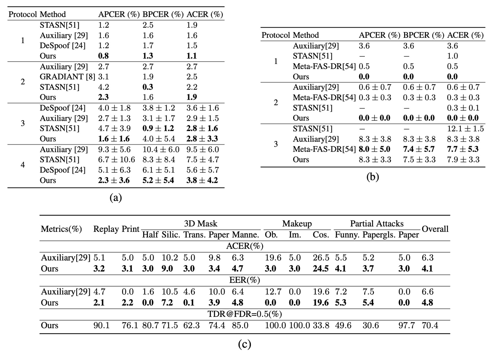
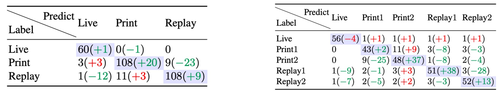
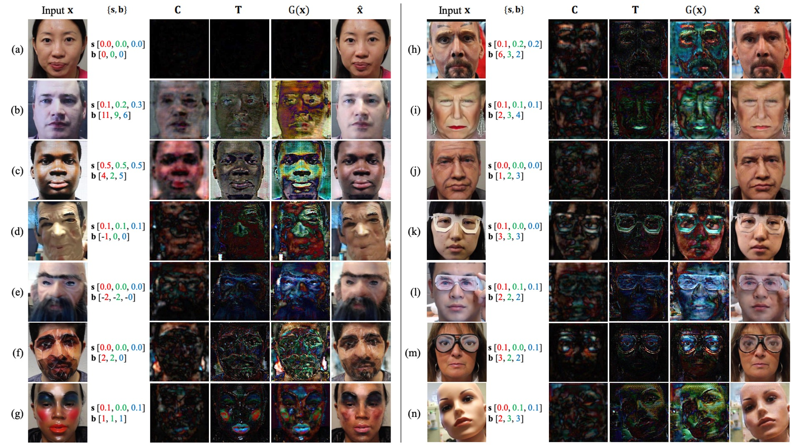
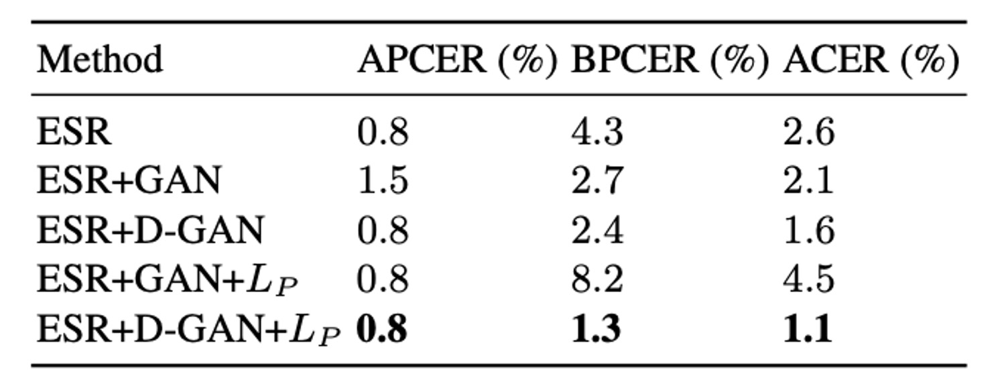

## 偽裝的痕跡

[**On Disentangling Spoof Trace for Generic Face Anti-Spoofing**](https://arxiv.org/abs/2007.09273)

---

模型告訴我們，這是假的。但是它卻說不出為什麼。

這種模型，你敢信？

## 定義問題

Face Anti-Spoofing（FAS）作為生物辨識系統的第一道防線，其研究歷史已有十餘年。

從早期的眼動偵測、頭部微動，到近年的 CNN 判別器與深度監督學習，模型的準確率看似越來越高。但在面對未知攻擊手法、不同裝置與光源條件下，泛化能力卻還是一道難以逾越的牆。

問題並不在於模型是否能「學會分辨真假」，而是它究竟學會了什麼？

它真的有看到假象本身的痕跡嗎？

還是說，它只學會了在某種資料集上區分解析度、色彩飽和度或裁切位置？

尤其當我們將不同攻擊方式（照片、螢幕、面具、化妝）一視同仁，嘗試建立通用的 FAS 系統時，我們才真正意識到：**現有方法多數依賴「黑箱判斷」：給定一張臉，輸出一個分數。**

但這樣的分數，無法說明模型是根據什麼做出的選擇。事實上，我們連讓模型說出「這是假的」的理由都做不到。

也因此，人們難以信任模型的決策，也無法推進它的訓練策略。因為我們無法觀察模型的判斷依據，我們就無法真正理解它與假象之間的邊界。

這篇論文的作者說：我們不要再問模型真假了，我們應該要問的是：

> **在這張臉上，你看到了什麼，讓你覺得它不是活的？**

## 解決問題

<figure style={{"width": "90%"}}>

</figure>

在傳統二分類任務中，模型給出的是一個「真假分數」，但它無法回答：**你到底看出了什麼？**

作者在此提出了另外一種思路，稱為 **Spoof Trace Disentanglement Network（STDN）**。

設計概念如上圖，模型先從一張輸入人臉中，抽取出潛藏的「假痕跡（spoof trace）」，再進行：

- **重建（Reconstructed Live）**：將假臉還原為活體版本。
- **合成（Synthesized Spoof）**：將假痕跡轉嫁到另一張真臉上，製造新的攻擊樣本。

這種方式使 spoof trace 不再是隱性的判斷依據，而是顯性的、可操控的可視變數，成為整個系統的中樞訊號。

:::tip
這篇論文的方法論略為複雜，包含了多個模組與步驟。讀者可能需要多點耐心，才能理解作者的設計邏輯。
:::

### Spoof Trace

設輸入影像為 $I \in \mathbb{R}^{N \times N \times 3}$，其所屬可能為 spoof 域 $\mathcal{S}$ 或 live 域 $\mathcal{L}$。

目標是找到對應於 live 域的影像 $\hat{I} \in \mathcal{L}$，並使兩者之間的差異最小：

$$
\hat{I} = \arg\min_{\hat{I} \in \mathcal{L}} \| I - \hat{I} \|_F
$$

此處 $| \cdot |_F$ 表示 Frobenius norm。

根據定義，spoof trace 可表示為：

$$
G(I) = I - \hat{I}
$$

若 $I$ 本身來自 live 域，則理論上 $G(I)$ 應該為零，而對 spoof 圖像而言，$G(I)$ 即為其視覺上的偽造殘差。

為了提升 spoof trace 的解釋力與合成能力，作者依據過去的研究文獻將其進一步拆解為以下四種層次成分：

- **Color range bias**：$s \in \mathbb{R}^{1 \times 1 \times 3}$，控制像素強度範圍的調整；
- **Color balance bias**：$b \in \mathbb{R}^{1 \times 1 \times 3}$，調整通道間顏色平衡；
- **Smooth content pattern**：$C \in \mathbb{R}^{L \times L \times 3}$，平滑紋理，需上採樣；
- **High-frequency texture**：$T \in \mathbb{R}^{N \times N \times 3}$，包含摩爾紋與邊緣輪廓等細節。

這些元素共同構成 spoof trace 的建構函數：

$$
G(I) = sI + b + \lfloor C \rceil_N + T
$$

其中 $\lfloor C \rceil$ 表示將 $C$ 上採樣（resizing）至與 $I$ 相同的空間解析度。

透過上述定義，STDN 將 spoof trace 從隱性的分類依據轉化為顯性的中介變數，使模型不僅能區分真假，還能指出「假在哪裡」。

這樣的建模帶來三個核心優勢：

1. **可視化與可解釋性**：模型輸出 spoof trace，可作為判斷依據的可視證據；
2. **合成與資料擴增能力**：trace 可套用於其他影像以生成 spoof 範例；
3. **泛化能力提升**：避免模型依賴非 spoof 本質的因素如光照、背景等。

:::tip
最主要的目的是要把 spoof trace 在於送進 GAN 模型進行合成，讓模型能夠學會如何生成 spoof 圖像。
:::

### 解耦生成

<figure style={{"width": "90%"}}>

</figure>

STDN 中的 spoof trace 解耦，是透過一組基於 Encoder–Decoder 架構的生成器所實現，其任務是從輸入影像中逐層析出 spoof trace 的各項構成分量 $\{s, b, C, T\}$。

其架構參考上圖，輸入影像 $I \in \mathbb{R}^{256 \times 256 \times 3}$ 首先進入 Encoder，經過一系列卷積層進行逐層下採樣，最終產生一個潛在表示張量：

$$
F \in \mathbb{R}^{32 \times 32 \times 96}
$$

該潛在特徵將成為 Decoder 解耦 spoof trace 的基礎。

Decoder 則透過一系列轉置卷積層（Transpose Conv）逐層上採樣，並依據不同空間解析度，逐步生成 spoof trace 的各元素：

- **顏色偏移項 $s, b$**：為全圖單一值張量，解析度最低，因此於 Decoder 最初階段即被解耦。
- **低頻紋理 $C$**：在中層解碼階段產生，解析度約為 $64 \times 64$，再經上採樣應用於合成過程。
- **高頻紋理 $T$**：於 Decoder 最末層輸出，保持與輸入影像相同解析度 $256 \times 256$。

這種 coarse-to-fine 解耦設計，配合每層 spoof 特徵的空間性質，使得整體 spoof trace 表徵具備清晰的語義分離性與生成對應性。

此外，為保留高頻細節並提升合成品質，生成器亦參考 U-Net 架構，在 Encoder 與 Decoder 對應層之間加入 skip connection，實現局部紋理資訊的直接傳遞。

### 雙域輸入策略

有別於典型的 GAN 模型僅對 source domain（如 spoof）進行生成訓練，本方法中生成器接受來自兩個 domain 的輸入影像：

- spoof domain：提供正樣本 trace；
- live domain：提供對照，並期望其 spoof trace 近似零。

這樣的設計促進模型從活體與偽造影像中學習辨別性強、語義清晰的 spoof trace，並避免 trace 本身對分類造成偏移。

然而，由於 spoof trace 的強度與型態會依 spoof 類型（如照片、面具、化妝）有所不同，trace 本身並非完美的分類依據。因此，作者額外引入一個 Early Spoof Regressor（ESR），強化生成器在潛在空間中的判別能力。

### Early Spoof Regressor

ESR 模組設計如下：

- 輸入為 bottleneck 特徵張量 $F \in \mathbb{R}^{32 \times 32 \times 96}$；
- 輸出為一張 spoof probability map $M \in \mathbb{R}^{16 \times 16}$，其值域為 {0, 1}，分別對應 live 與 spoof。

這張 spoof map 被視為對輸入影像的「空間性判斷」，使得生成器不僅生成 trace，亦能進行初步分類。

為配合此設計，整體生成器在架構上採取「重 encoder、輕 decoder」策略，即 encoder 採用更多 channel 與 deeper block，讓 ESR 得以充分利用編碼器所學之 spoof 表徵。

### 測試階段之分類策略

在測試階段，最終的 spoof 分數由兩部分組成：

1. ESR 輸出之 spoof map $M$ 的 L1 強度平均；
2. Spoof trace $G(I)$ 的整體強度平均（以 L1 範數衡量）；

其計算公式如下：

$$
\text{score} = \frac{1}{2K^2} \| M \|_1 + \frac{\alpha_0}{2N^2} \| G(I) \|_1
$$

其中：

- $K = 16$：ESR 輸出 map 的空間解析度；
- $N = 256$：輸入影像之空間解析度；
- $\alpha_0$：調節 spoof trace 對最終分數的影響程度的超參數。

這種雙指標融合的分類策略，有助於提升模型對 spoof 強弱程度的敏感性，亦能在 spoof trace 與 ESR 判斷產生差異時提供緩衝區間。

### 重建與合成

在完成 spoof trace 解耦後，STDN 不僅能用於分類判斷，亦能將這些 trace 作為結構性的訊號，導入於兩類任務：

1. **重建（Reconstruction）**：從 spoof 影像中扣除 trace，還原其對應之活體影像。
2. **合成（Synthesis）**：將某張 spoof 影像中抽離出的 trace，轉移至任意 live 臉上，產生合成的 spoof 攻擊樣本。

首先看活體影像重建任務：

給定輸入影像 $I \in \mathcal{S} \cup \mathcal{L}$，其對應 spoof trace 為 $G(I)$，STDN 可透過以下運算進行活體還原：

$$
\hat{I} = I - G(I)
$$

此處的 $\hat{I}$ 被視為輸入影像在活體域 $\mathcal{L}$ 的最小變化對應版本。

此操作不僅能作為 trace 解耦品質之視覺評估依據，更能在訓練過程中用以增強 spoof trace 的可逆性與語義一致性。

另外是偽造影像合成到部份：

為了實現資料擴充與 spoof 多樣性模擬，STDN 提供了將 spoof trace 遷移至另一張 live 臉的能力。設有兩張影像：

- $I_i$：來源 spoof 影像，其 trace 為 $G(I_i)$
- $I_j$：目標 live 影像

則其合成 spoof 影像可表達為：

$$
\tilde{I}_{i \rightarrow j} = I_j + G(I_i)
$$

:::tip
這裡讓我們想到近年在 LLM 領域中流行的 Model Merging 的技術，也是把附加上原始模型上的不同功能視為一組「向量」參數，然後進行任意的加減法，來達到擴充模型的效果。

如果我們把特定型態攻擊的 「spoof trace」 也視為一組向量參數，然後進行加減法的話，那我們或許就能透過組合這些向量，來讓模型學會應對不同的攻擊型態。
:::

但此處存在一項挑戰：spoof trace 中可能包含與原始臉部幾何結構高度相關的區域性紋理（如面具邊緣、皺褶等），直接套用於不同臉型與姿勢的影像上，會造成明顯的幾何失真與視覺不一致。

為解決此問題，作者提出一套可微分的 **即時 3D 幾何扭曲層（Online 3D Warping Layer）**，用以對 spoof trace 進行對位調整。

### 幾何扭曲層

<figure style={{"width": "90%"}}>

</figure>

該模組基於 3D Morphable Model（3DMM）建立臉部對應點集合，並透過 Delaunay triangulation 進行稀疏到密集場的幾何轉換。

**步驟如下：**

1. **spoof trace 評估**
   對來源影像 $I_i$，其 spoof trace 定義為：

   $$
   G_i = G(I_i)[p_0]
   $$

   其中 $p_0 = \{(x, y) \mid 0 \leq x, y < 256 \} \in \mathbb{R}^{256 \times 256 \times 2}$ 為原始像素座標格。

2. **計算 dense offset**
   若欲將 spoof trace 應用至 $I_j$，需計算密集場偏移量 $\Delta p_{i \rightarrow j} \in \mathbb{R}^{256 \times 256 \times 2}$，最終 warped trace 表示為：

   $$
   G_{i \rightarrow j} = G(I_i)[p_0 + \Delta p_{i \rightarrow j}]
   $$

   其中偏移量通常為非整數，故採用 bilinear interpolation 實作位置對應。

3. **由稀疏點轉換至密集場**
   擬合每張人臉之 3DMM，並擷取 $Q = 140$ 個代表性頂點的 2D 投影位置：

   $$
   s = \{ (x_0, y_0), (x_1, y_1), \dots, (x_Q, y_Q) \} \in \mathbb{R}^{Q \times 2}
   $$

   接著可計算來源與目標影像之間的稀疏偏移：

   $$
   \Delta s_{i \rightarrow j} = s_j - s_i
   $$

4. **三角形內插轉換至 dense offset**
   應用 Delaunay triangulation 插值：

   $$
   \Delta p_{i \rightarrow j} = \text{Tri}(p_0, s_i, \Delta s_{i \rightarrow j})
   $$

   該操作以每個像素所處三角形為基底，線性加權三個頂點的位移，實現 dense offset 的高效建構與可微性。整體 warping 操作可端到端併入訓練流程。

### 操控 Spoof Trace

spoof trace 的結構性使其具備可操作性。

作者藉此提出一種訓練資料強化策略：

**在合成 spoof 影像時，隨機移除 spoof trace 中的某一項元素 $s, b, C, T$，以模擬 spoof 強度較低的樣本，作為 harder example 用於訓練。**

此策略的理論基礎在於：某些 spoof 特徵可能在實務應用中極為微弱或被掩蓋，若模型僅依賴單一強特徵，則會對這類樣本失效。藉由隨機移除部分 trace 元素，可迫使模型學習更為多樣且全面的 spoof 表徵。

相較於傳統的 brightness/blur 操作或人為扭曲，本方法可直接操控語義明確的 spoof element，生成更真實、具結構意涵的合成資料，並在實驗中顯示優於傳統資料增強法的效益。

### 多尺度判別器

在 STDN 的設計中，生成器的目標不僅是產出合理的 spoof trace，更需保證由 trace 推導出的合成樣本（reconstructed live 或 synthesized spoof）在視覺品質與語義層次上皆具可信度。

為此，作者設計了**三個不同解析度下的 PatchGAN 判別器**，以涵蓋從高頻紋理到全局構型的多尺度資訊。

所使用的三個判別器分別為：

- $D_1$：接收原始解析度影像（$256 \times 256$），專注於高頻紋理特徵（對應 spoof trace 中的 $T$）。
- $D_2$：接收下採樣一半的影像（$128 \times 128$），強調中頻結構與平滑紋理（對應 spoof trace 中的 $C$）。
- $D_3$：接收下採樣四分之一的影像（$64 \times 64$），專注於低頻全域偏移與色彩平衡（對應 spoof trace 中的 $s, b$）。

這種分層辨識策略可有效提升模型對於 spoof trace 四個子成分的整體一致性與交叉校驗能力，形成解耦 → 重建 → 合成 → 判別的完整循環。

判別器架構細節如下：

每一個 $D_k$ 判別器皆採用 **PatchGAN** 結構，即純粹由卷積層堆疊而成的 FCN。該架構已被證實在圖像生成與 FAS 任務中均具備良好性能。

具體配置如下：

- 每個判別器包含：

  - **7 層卷積層**（含非線性激活與 BatchNorm）；
  - **3 層下採樣操作**（stride = 2）；

- 輸出為一張 **2-channel 的 response map**，形狀為 $H' \times W' \times 2$，每個位置對應一個判別 patch，2 個 channel 各代表對應一個 domain 的輸出信心分數。

這裡的 2-channel 輸出設計別具意義：

- **第一通道（Channel 1）**：將「重建之 live 影像（reconstructed live）」與「真實 live 影像」進行對比，驗證 spoof trace 扣除後的真實性；
- **第二通道（Channel 2）**：將「合成之 spoof 影像（synthesized spoof）」與「真實 spoof 影像」進行對比，評估 spoof trace 添加後的可信度與攻擊性。

這種雙向監督能同時驅動生成器在「還原」與「造假」兩端提升品質，並強化 spoof trace 的語義一致性與重建可逆性。

### 損失函數

STDN 的訓練採用多任務學習架構，包含 **五類損失函數** 與 **三個訓練步驟（Steps）**，以協同驅動生成器與多尺度判別器學習 spoof trace 的分離、可逆性與可視性。

- **1. ESR 損失（Early Spoof Regressor Loss）**

  對於 ESR 所輸出的 spoof map $M \in \mathbb{R}^{16 \times 16}$，期望其對於活體影像輸出全為 0，對於 spoof 影像（包括合成的 spoof）輸出全為 1。為此，採用 L1 損失定義如下：

  $$
  \mathcal{L}_{\text{ESR}} = \frac{1}{K^2} \left( \mathbb{E}_{i \sim \mathcal{L}} \left[ \| M_i \|_1 \right] + \mathbb{E}_{i \sim \mathcal{S} \cup \hat{\mathcal{S}}} \left[ \| M_i - \mathbf{1} \|_1 \right] \right)
  $$

  其中：

  - $K = 16$：spoof map 的解析度；
  - $\hat{\mathcal{S}}$：由生成器合成出的 spoof domain；
  - $\| \cdot \|_1$：L1 向量範數。

  ***

- **2. 生成器對抗損失（Generator Adversarial Loss）**

  為訓練生成器使 reconstructed live 與 synthesized spoof 分別逼近其所屬真實 domain，採用 Least Squares GAN（LSGAN）損失形式，對於三個尺度的判別器 $D_n$，其損失定義如下：

  $$
  \mathcal{L}_G = \sum_{n=1}^3 \left\{
  \mathbb{E}_{i \sim \mathcal{S}} \left[ \left( D_n^{(1)}(I_i - G_i) - 1 \right)^2 \right] +
  \mathbb{E}_{i \sim \mathcal{L}, j \sim \mathcal{S}} \left[ \left( D_n^{(2)}(I_i + G_{j \rightarrow i}) - 1 \right)^2 \right]
  \right\}
  $$

  其中：

  - $D_n^{(1)}$：第 $n$ 個判別器之 live domain 輸出通道；
  - $D_n^{(2)}$：第 $n$ 個判別器之 spoof domain 輸出通道。

  ***

- **3. 判別器對抗損失（Discriminator Adversarial Loss）**

  判別器需正確分辨真實樣本與由生成器合成之樣本，其損失函數如下：

  $$
  \mathcal{L}_D = \sum_{n=1}^3 \Big\{
  \mathbb{E}_{i \sim \mathcal{L}} \left[ \left( D_n^{(1)}(I_i) - 1 \right)^2 \right] +
  $$

  $$
  \mathbb{E}_{i \sim \mathcal{S}} \left[ \left( D_n^{(2)}(I_i) - 1 \right)^2 \right] +
  \mathbb{E}_{i \sim \mathcal{S}} \left[ \left( D_n^{(1)}(I_i - G_i) \right)^2 \right] +
  $$

  $$
  \mathbb{E}_{i \sim \mathcal{L}, j \sim \mathcal{S}} \left[ \left( D_n^{(2)}(I_i + G_{j \rightarrow i}) \right)^2 \right]
  \Big\}
  $$

- **4. Trace 正規化損失（Trace Regularizer Loss）**

  為強化 spoof trace 的語義性並抑制活體樣本中無意義的 trace 殘留，加入 L2 正規化項：

  $$
  \mathcal{L}_R = \beta \cdot \mathbb{E}_{i \sim \mathcal{L}} \left[ \| G(I_i) \|_2^2 \right] + \mathbb{E}_{i \sim \mathcal{S}} \left[ \| G(I_i) \|_2^2 \right]
  $$

  其中 $\beta > 1$ 控制活體 trace 壓縮力度。

- **5. 像素級監督損失（Supervised Pixel Loss）**

  由於合成 spoof 具有明確的 spoof trace 來源，因此可對生成器進行像素級監督學習。為避免誤導梯度，使用 stop-gradient 操作鎖定參考 trace：

  $$
  \mathcal{L}_P = \mathbb{E}_{i \sim \mathcal{L}, j \sim \mathcal{S}} \left[ \left\| G\left( I_i + \text{stop\_grad}(G_{j \rightarrow i}) \right) - \text{stop\_grad}(G_{j \rightarrow i}) \right\|_1 \right]
  $$

  該損失可迫使生成器學會正確提取 spoof trace 結構，而非重複學習輸入內容。

### 訓練流程設計

<figure style={{"width": "90%"}}>

</figure>

如上圖所示，STDN 的訓練採用多任務協同優化機制，每一個 mini-batch 包含三個互補的子步驟，分別針對生成器、判別器與 trace 解耦 supervision 進行參數更新。

以下為各階段細節說明：

- **1. Generator Step**

  在此步驟中，將活體人臉 $I_{\text{live}}$ 與 spoof 攻擊樣本 $I_{\text{spoof}}$ 輸入生成器進行 spoof trace 的解耦操作。模型分別進行兩項生成任務：

  - **重建活體影像**：使用 $G(I_{\text{spoof}})$ 還原其對應的活體版本 $\hat{I}_{\text{live}} = I_{\text{spoof}} - G(I_{\text{spoof}})$；
  - **合成 spoof 影像**：將 spoof trace $G(I_{\text{spoof}})$ 套用至另一張 live 臉 $I_{\text{live}}$ 上，得到合成 spoof 影像 $\hat{I}_{\text{spoof}} = I_{\text{live}} + G_{i \rightarrow j}$。

  生成器的更新目標由三項損失組成：

  - $\mathcal{L}_G$：對抗損失（推進合成樣本逼近真實 domain）；
  - $\mathcal{L}_{\text{ESR}}$：早期 spoof 判別監督；
  - $\mathcal{L}_R$：trace 強度正則化。

  總損失如下：

  $$
  \mathcal{L}_{\text{G-step}} = \alpha_1 \mathcal{L}_G + \alpha_2 \mathcal{L}_{\text{ESR}} + \alpha_3 \mathcal{L}_R
  $$

- **2. Discriminator Step**

  接續使用同一批次樣本，將下列影像傳入三個多尺度判別器 $D_n$，以學習區分真實與合成 domain：

  - 原始活體樣本 $I_{\text{live}}$
  - 原始 spoof 樣本 $I_{\text{spoof}}$
  - 重建樣本 $\hat{I}_{\text{live}}$
  - 合成 spoof $\hat{I}_{\text{spoof}}$

  每一個尺度的判別器都需學習：

  - 在第一通道 $D_n^{(1)}$ 中判別真實 live vs. 重建 live；
  - 在第二通道 $D_n^{(2)}$ 中判別真實 spoof vs. 合成 spoof。

  判別器之對抗損失定義為：

  $$
  \mathcal{L}_{\text{D-step}} = \mathcal{L}_D
  $$

  由於對抗訓練易產生不穩定性，此步驟的學習率會設定為其他步驟的一半，以平衡梯度強度與穩定訓練過程。

- **3. Extra Supervision Step**

  此階段引入 spoof trace 的「合成可監督性」，以強化生成器對 spoof trace 結構的正確辨識與解耦能力。

  輸入資料為：

  - 原始 live 臉 $I_{\text{live}}$
  - 對應 spoof trace 合成影像 $\hat{I}_{\text{spoof}}$
  - 由來源 spoof trace 得到的「ground-truth trace」$G_{j \rightarrow i}$

  此步驟僅更新生成器參數，目標損失如下：

  - $\mathcal{L}_{\text{ESR}}$：進一步監督 spoof 判別準確度；
  - $\mathcal{L}_P$：像素級 spoof trace 解耦誤差（使用 stop-gradient 固定目標 trace）。

  綜合損失表示為：

  $$
  \mathcal{L}_{\text{sup-step}} = \alpha_4 \mathcal{L}_{\text{ESR}} + \alpha_5 \mathcal{L}_P
  $$

  :::tip
  為維持 Batch Normalization 的統計穩定性，此步驟會將 $I_{\text{live}}$ 與 $\hat{I}_{\text{spoof}}$ 成對輸入，以維持 batch 資料分布的均衡性。
  :::

## 討論

由於方法論已經佔據的大量的篇幅，我們最後挑幾個重點來進行討論。

### 已知攻擊偵測

從上表 (a)(b)(c) 可觀察到，STDN 在 OULU-NPU 與 SiW 的多項協定（protocol）中，均展現了與現有方法相當或更優的偵測能力，特別是在 OULU-NPU 協定 1、4 中，ACER 降幅達 30% 與 32%（相較最優先前方法）。

在多種印刷與重播攻擊下，STDN 的活體重建及 spoof trace 提取機制提供了穩定的判斷依據。對於 SiW-M 的 13 種攻擊類型，實驗也顯示在大多數 spoof 類型上，STDN 皆優於先前工作，證實在多樣化攻擊場景下的泛用性。

### 未知攻擊（Unknown Spoof）偵測

如上表所示，STDN 在未知攻擊之整體 EER 與 ACER 上，分別較原本最佳模型取得更好的表現。

雖然某些攻擊（如透明面具、紙質面具等）仍具挑戰性，但當取得少量樣本後，STDN 能藉由顯式解耦出的 spoof trace，快速鎖定關鍵區域並提升辨識效能。

這顯示透過 trace 建模，系統能在未知攻擊場景中依然保持一定的適應性。

### Spoof Trace 的可視化與評估

1. **Spoof Medium Classification**

   

   將解耦出的 spoof trace 單獨用於偵測不同假臉媒材時，辨識精度高於直接使用原始影像，代表 trace 中確實蘊含了足以區分各種偽造材質的關鍵紋理或色彩線索。

2. **視覺化分解**

   

   從上圖可以觀察到，不同攻擊類型（印刷、化妝、3D 面具、紙製攻擊等）在 $s, b, C, T$ 四層元素上呈現不同程度的扭曲或紋理殘留；模型也能將該殘留移植至其他臉上並生成可信的合成假臉，佐證 3D 幾何扭曲層的有效性與 trace 可遷移性。

### 模組貢獻與消融實驗

<figure style={{"width": "70%"}}>

</figure>

根據實驗結果顯示，整合多尺度判別器與 ESR（Early Spoof Regressor）的設計，能同時優化重建品質與對抗性，使 ACER 由 2.6% 進一步下降至 1.6%。

在所謂 ESR + D-GAN + $L_P$ 的最終配置下，合成樣本能提供強監督訊號，並避免不良 spoof 生成導致的誤差累積，使最終 ACER 可穩定到 1.1%。

## 結論

與其問真假，不如先問：**假象從哪裡滲出？**

STDN 將活體偵測從「黑盒分類」轉寫為「痕跡拆解 — 重建 — 合成」的循環，延伸了早期 _de-spoofing_ 與顯著圖方法，使可視化證據真正成為模型的一級產物。

這不只是網路結構的調整，更是思考角度的遷移：先理解假象，再談辨識真假。

當然，STDN 還是有其弱項：

- 假痕定義鎖定在影像域，高擬真 3D 面具或跨模態攻擊尚待驗證；
- 合成樣本的幾何與質感一致性，受限於生成器能力與監督訊號；
- trace 對其他感測維度（聲波、深度、血流訊號）的延伸機制，仍屬空白。

儘管如此，STDN 提供了一條可追蹤的未來路線：

> **假象若能被顯式標示，就能被合成；能被合成，就有機會對抗。**

在真假難辨的技術洪流中，真正有價值的，從不是單純判分，而是拆解假象的語法與結構。

這條路確實比分類曲折，但 STDN 作為多攻擊「痕跡解耦」框架的早期關鍵里程碑之一，已為後續工作奠定了基礎。
