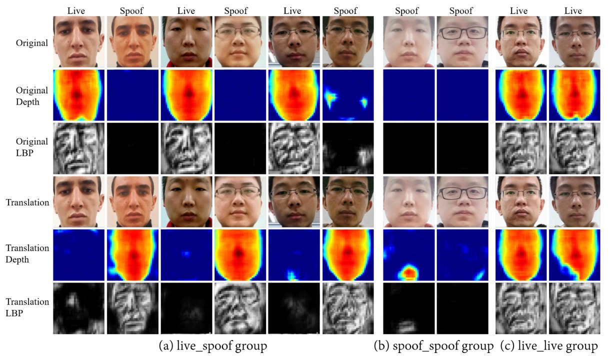
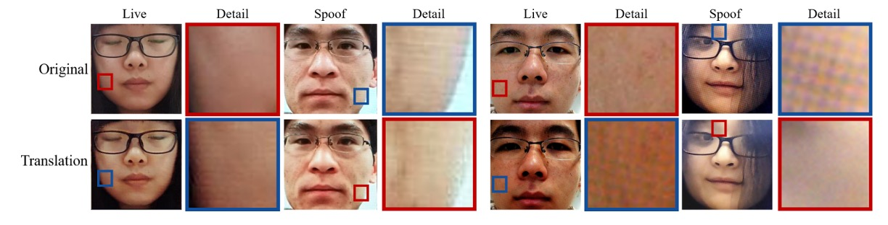
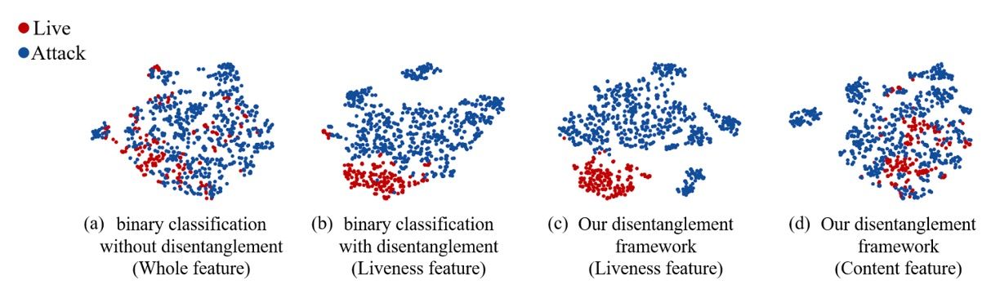

## 斷開魂結

[**Face Anti-Spoofing via Disentangled Representation Learning**](https://arxiv.org/abs/2008.08250)

---

這篇論文沒有幫自己取個好聽的名字。

所以我們就直接取用論文標題，稱它為：**Disentangle-FAS**。

## 定義問題

Face Anti-Spoofing（FAS）一直站在辨識系統的前線。

從手機解鎖、門禁系統、金融身份驗證，到各種 eKYC 場景，我們仰賴這個任務幫我們分辨這張臉是真的人，還是某種偽裝？

隨著演算法精進、資料集擴充、模型精度一路攀升，我們以為問題正在被解決。

但事實上，我們只是在用更多樣的假象，逼迫模型記住更多答案。

仔細一看，整個領域其實卡在幾個老問題裡：

- **真假分類的黑盒模型，無法說明判斷依據**；
- **泛化能力極差，一換資料集就崩潰**；
- **資料永遠不夠，攻擊樣式永遠變化更快**。

更嚴重的是：我們甚至無法明確描述「活體的特徵」究竟是什麼。

這不是某個模型結構沒選好，也不是資料量不夠的問題。

> **而是我們對於臉的理解，本身就過於混沌。**

臉上同時存在太多語意：身份、姿勢、光照、背景、設備特性、膚色紋理等，而我們卻讓模型在這片混合語法裡，一次性做出「真或假」的判斷。

這種方式是不是打從一開始就錯了？我們有沒有可能：

> **讓模型先試著從雜訊與語意的糾纏中，抽出一條獨立的、屬於「活體」的線索？**

## 解決問題

<figure style={{"width": "90%"}}>

</figure>

為了解開「臉上語意混雜」的難題，作者提出了**兩大核心部件**：

1. 進行活體與內容分離的 **Disentanglement Process**。
2. 透過多種 **Auxiliary Supervision**（如 LBP、Depth、鑑別器）來強化拆解效果。

### Disentanglement Process

首先，作者設計了一條「交換並重組」的流程，把人臉影像的潛在特徵向量，拆成兩塊：

- **Liveness Features** ( $L$ )：代表「這張臉是真還是假」的關鍵因子
- **Content Features** ( $C$ )：代表臉的身份、背景、光照、姿勢… 這些與真假無關的屬性

完整流程可以參考上圖：

1. 一張真臉 $A$ 和一張假臉 $B$ 分別進入編碼器 (Encoder)，被拆解為 $(L_A, C_A)$ 與 $(L_B, C_B)$。
2. 接著，**交換活體特徵** 以合成新的影像 $\hat{A}_b$ 和 $\hat{B}_a$，分別代表：

   - 用「假臉的活體特徵」+「真臉的內容特徵」重組出來的影像 $\hat{A}_b$
   - 用「真臉的活體特徵」+「假臉的內容特徵」重組出來的影像 $\hat{B}_a$

這樣一來，如果把真臉的 $L$ 與假臉的 $C$ 重新拼接，理論上就能生成一張「看起來像 A 的人，但卻帶有 B 的假臉屬性」的新圖；反之亦然。

這種交換行為，正是為了強迫模型必須把「真假」和「臉部內容」徹底拆開，不然交換後的合成圖就會失真或帶有錯誤痕跡。

### 重建損失：Image & Latent

**Encoder + Decoder** 的組合在整個流程裡，需要保證「能把影像再度重建回來」。

作者透過兩種重建損失做約束：

1. **影像重建損失 (Image Reconstruction)**

   希望 $\mathrm{D(E}(x_i))$ 能夠近似 $x_i$ 本身，公式如下：

   $$
   \mathcal{L}_{rec}^{x_i} \;=\; \mathbb{E}_{x_i \sim p(x_i)} \Bigl\|\,D\bigl(E(x_i)\bigr) \;-\; x_i\Bigr\|_1
   $$

   其中 $E$ 表示編碼器、$D$ 表示解碼器，$p(x_i)$ 為真實影像的分佈。

2. **潛變量重建損失 (Latent Reconstruction)**

   希望交換後，能夠再把 $\hat{z}_i$ 解碼-編碼回來，重建出原始的 $z_i$，公式如下：

   $$
   \mathcal{L}_{rec}^{z_i} \;=\; \mathbb{E}_{z_i \sim q(z_i)} \Bigl\|\,
   E\bigl(D(z_i)\bigr) \;-\; z_i
   \Bigr\|_1
   $$

   如此一來，可確保活體特徵和內容特徵**確實分離**，並能互相重建，避免學習過程中又把兩者混回去。

### Auxiliary Supervision

為了進一步「鎖定」活體特徵，作者在拆解流程中，額外加入三個輔助監督：

1. **LBP Map**
2. **Depth Map**
3. **Discriminative Supervision**（鑑別器）

下表示作者使用各種輔助網路的結構細節：

<figure style={{"width": "80%"}}>

</figure>

每個網路都由一連串卷積層、BN、ReLU 所組成，用不同層級特徵去校正或判別。

- **LBP Map**

  考量到「假臉」常在紋理上出現破綻（如印刷墨點、螢幕摩爾紋），作者讓**活體特徵**接受 LBP（Local Binary Pattern） 監督：

  - **真臉**：希望能靠 LBP Net 輸出跟真實的 LBP 相近；
  - **假臉**：則對應到一張「全零圖」，意味著「紋理應該偏向無效或假紋理」。

  數學式如下：

  $$
  \mathcal{L}_{lbp}
  =\;
  \mathbb{E}_{l_i \sim P(l_i),\, x_i \sim P(x_i)} \Bigl\|\,
  LBP(l_i) - lbp_{x_i}
  \Bigr\|_1
  \;+\;
  \mathbb{E}_{l_i \sim N(l_i),\, x_i \sim N(x_i)} \Bigl\|\,
  LBP(l_i) - 0
  \Bigr\|_1
  $$

  其中 $P(\cdot)$ 表示真臉分佈，$N(\cdot)$ 表示假臉分佈，$lbp_{x_i}$ 為真臉的 LBP 影像，$\,0$ 則是全零圖。

- **Depth Map**

  對於真臉的 3D 幾何資訊，作者也引入**深度監督**。

  - 真臉對應「偽深度圖」，由 3D 對齊算法生成；
  - 假臉對應全零圖。

  數學式如下：

  $$
  \mathcal{L}_{dep}
  =\;
  \mathbb{E}_{x_i \sim N(x_i)} \Bigl\|\,
  Dep(x_i) - 0
  \Bigr\|_1
  \;+\;
  \mathbb{E}_{x_i \sim P(x_i)} \Bigl\|\,
  Dep(x_i) - dep_{x_i}
  \Bigr\|_1
  $$

  這裡的 $Dep(\cdot)$ 表示深度網路的輸出。

  真臉重建與假臉重建，都必須輸出對應的深度或零圖，以此強化活體資訊全被壓在 $L$ 這個分支上。

- **Discriminative Supervision**

  最後，作者設計了多尺度的**鑑別器 (Discriminator)**，幫忙判斷「生成的影像」到底像不像真實影像。

  本質類似 GAN 的對抗訓練：

  - **判別器損失 ( $L_{Dis}^D$ )**：在固定生成器之後，更新鑑別器，讓它學會分辨真實 (R) 與生成 (G)；
  - **生成器損失 ( $L_{Gen}^D$ )**：在固定鑑別器之後，反向更新整個 Disentanglement Net，逼它產生更擬真的影像。

  數學式如下：

  $$
  \mathcal{L}_{Gen}^{D}
  = - \;
  \mathbb{E}_{I \in G}\,\log\bigl(D_1(I)\bigr)
  \;-\;
  \mathbb{E}_{I \in G}\,\log\bigl(D_2(I)\bigr).
  $$

  其中 $D_1$ 與 $D_2$ 為不同尺度的鑑別器，用來捕捉局部細節與整體結構。

### 最終目標函數

作者把上述所有損失加總，形成最終訓練目標：

$$
\mathcal{L}
=\;
\mathcal{L}_{Gen}^{D}
\;+\;
\lambda_1\,\mathcal{L}_{rec}^{x_i}
\;+\;
\lambda_2\,\mathcal{L}_{rec}^{z_i}
\;+\;
\lambda_3\,\mathcal{L}_{dep}
\;+\;
\lambda_4\,\mathcal{L}_{lbp}
$$

其中 $\lambda_1, \lambda_2, \lambda_3, \lambda_4$ 是平衡各種損失的重要超參數。

整個訓練過程，採用典型的「**對抗式迭代**」：先優化鑑別器，再優化整個拆解網路。

一來一往，最終希望達到：

- 交換後的影像**足夠擬真**，
- 活體與內容**確實被拆開**且能重建，
- **LBP 與深度監督**也鞏固了「活體特徵一定帶有真假資訊」。

如此一來，模型在推論階段，只需要看「$L$ 這塊向量」即可判斷真偽，擺脫了各種資料域轉移、裝置差異、光照變動等干擾。

## 討論

論文作者在四個常見 FAS 資料庫上進行測試：

- Oulu-NPU、SiW（用於 **intra-testing**）
- CASIA-MFSD 與 Replay-Attack（用於 **cross-testing**）

並透過常見的 **APCER / BPCER / ACER / HTER** 指標來量化。

### Intra-testing: Oulu-NPU

<figure style={{"width": "60%"}}>

</figure>

基於 **Oulu-NPU** 的實驗數據如上表所示，Disentangle-FAS 在 4 個測試協定裡，除 p2 略差，其他都比前作更優，特別是在 p4（所有變化全含）下的表現最佳，展現了**更強的泛化力**。單一資料庫的情境裡，**透過拆解活體特徵**，模型能夠更精準地抓到「真假」線索。

:::tip
SiW 的實驗結果請讀者自行參閱論文。
:::

### Cross-testing: CASIA-MFSD ↔ Replay-Attack

<figure style={{"width": "60%"}}>

</figure>

實驗設計用 CASIA 訓練、Replay 測試；或是 Replay 訓練、CASIA 測試，都是 FAS 的標準「跨域」實驗。

結果如上表，Disentangle-FAS 在 (CASIA → Replay) 能將 HTER 再降低 1.2 個百分點，比前作更進一步，也在 (Replay → CASIA) 維持相當水準。

這意味著，把「活體特徵」獨立出來之後，當測試影像在燈光、ID、攝影裝置等因素上有所改變，模型依舊能準確區分真偽，不至於完全崩盤。

### 翻譯結果與可視化

<figure style={{"width": "80%"}}>

</figure>

作者在論文展示了三組翻譯結果：「真臉 ↔ 假臉」、「真臉 ↔ 真臉」、「假臉 ↔ 假臉」。

- 在「真臉 ↔ 假臉」交換時，對應的深度圖也會同步切換，證明活體特徵帶走了核心真假資訊；
- 而在「真臉 ↔ 真臉」或「假臉 ↔ 假臉」內部交換時，深度幾乎不動。
- 這代表 ID、光照、背景都留在 content features 裡，不會被活體特徵帶走。

接著，作者進一步聚焦局部區域（如印刷紋理、螢幕摩爾紋），展示交換後的結果真能呈現各種「假」細節的紋理特徵，如下圖：

<figure style={{"width": "80%"}}>

</figure>

也就是說，活體子空間不只區分真假，還能內含「不同種類假臉的各自特徵」。

### Ablation Study

作者也測了許多 ablation 組合，核心結論如下：

- **有無 Disentanglement**：用 t-SNE 可見，當有活體/內容分離時，真臉與假臉在特徵空間裡分得更乾淨；若不拆解，特徵分佈仍較混雜。

   

   <figure style={{"width": "80%"}}>
   
   </figure>
   

- **LBP + Depth 監督**：同時利用低階紋理（LBP）和高階幾何（Depth）做輔助，效果優於單一監督或單純二元分類。
- **Score Fusion**：將 LBP 與 Depth 分數平均融合可得最佳表現，雙者互補。

   

   <figure style={{"width": "50%"}}>
   
   </figure>
   

本方法在多組實驗中，都展現了更好的泛化能力與可視化可解釋度：活體特徵空間不僅能判斷真或假，還能根據不同假臉形態帶出相應紋理，讓我們真正「看見」模型學到的攻擊差異。

## 結論

Disentangle-FAS 並沒有試圖再做一個更複雜的分類器。它選擇把任務重寫，將「臉」的潛在語法切割成兩個世界：

**一個是活體，一個是內容。**

在這個框架下，真假不再是輸出分數，而是一種可以交換、生成、可視化的語意空間。

模型不只學會分辨，還學會了解構，甚至學會了說明：**哪裡是假的，以及為什麼是假的。**

透過活體特徵的視覺翻譯、深度與紋理的輔助監督，以及跨域評測的實驗結果，這篇論文告訴我們：

> **比起「判斷真假」，我們更應該教模型學會「看見假象從何而來」。**

在未來混沌多變的攻擊世界裡，這條路或許不容易，但它讓我們有機會**把防禦這件事變得有語法、可推理還有能解釋。**

這正是從黑盒中抽身，走向一種更有意識的視覺辨識方式。
