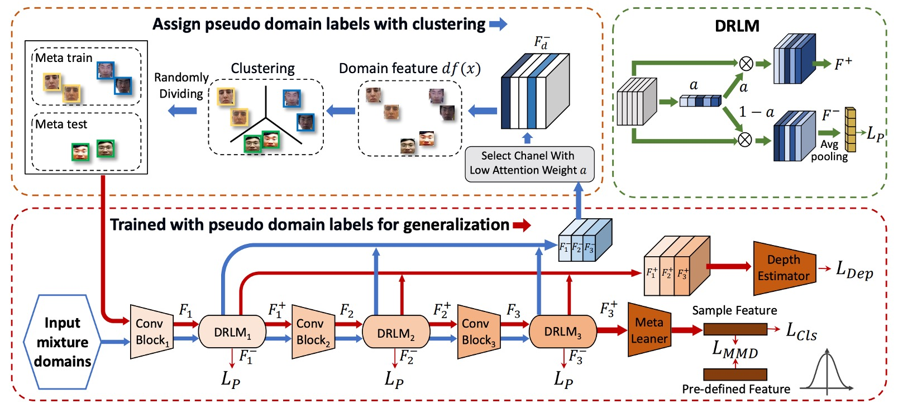
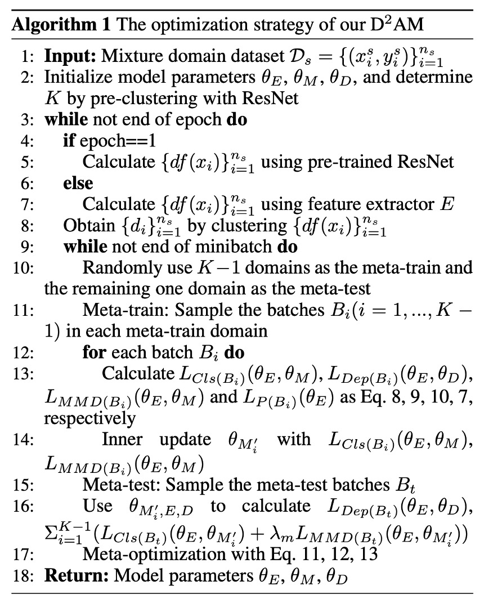
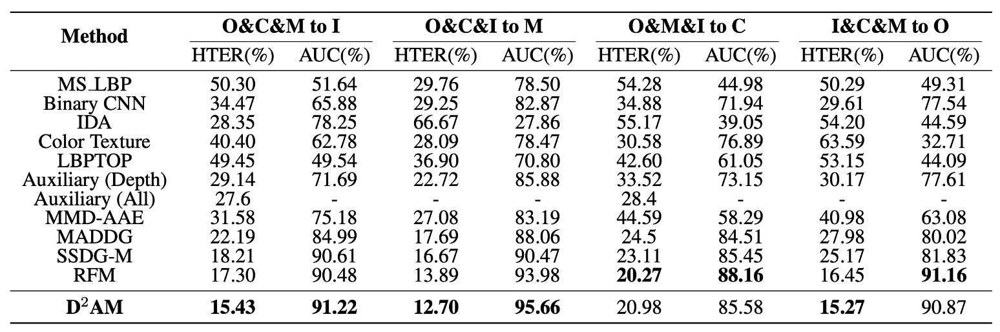
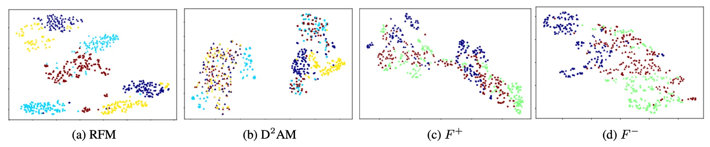
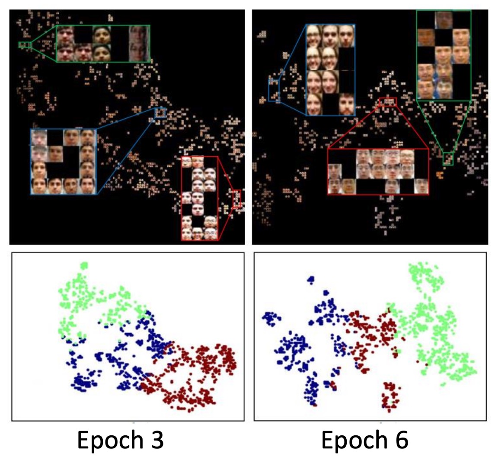

## 千域鍛魂術

[**Generalizable Representation Learning for Mixture Domain Face Anti-Spoofing**](https://arxiv.org/abs/2105.02453)

---

稍早我們看完了 SSDG，它使用單邊域泛化的技術來處理 FAS 的問題。

這次，曾經風靡一時的 Meta Learning 也加入了戰場。

## 定義問題

針對 DG 技術在 FAS 上取得初步的成功，這篇論文的作者緊接著就提出了下一個質疑：

> **所謂的「domain」到底是什麼？**

是不同的拍攝場景嗎？還是不同的攻擊方式？還是你乾脆拿資料集的名字來當 domain label？

這些做法過去在 DG 任務中其實都被默默採用了，問題是這些「domain」的劃分方法，其實並不科學。

作者指出三個問題：

1. **手動標記 domain label 太花時間。**

   > 如果一張圖還要叫人來說「這屬於光線偏黃的領域」，標準化的問題就來了。

2. **domain 本身是複雜因素構成，無法單一維度劃分。**

   > 有的 domain 是因為鏡頭太爛，有的則是模特兒太假，誰能說這兩張應該同一類？

3. **就算你照資料集來劃，也只是 sub-optimal。**
   > A 資料集跟 B 資料集，其實中間有不少交集，模型可能早就把他們搞混了。

---

面對這個困境，作者提出一個方案：

> **我們能不能讓模型自己學著分群？**

讓模型自己產生 pseudo-domain，然後再從這些 pseudo-domain 中訓練泛化能力。

這就是 D2AM 的核心想法。

## 解決問題

<figure style={{"width": "90%"}}>

</figure>

作者提供的模型架構圖看起來非常複雜，容易讓人心生畏懼。

所以我們需要搭配論文中的另外一個區塊來理解這個架構，請參考以下演算法邏輯：

<figure style={{"width": "50%"}}>

</figure>

### 第一階段：分群

這階段的任務很明確：

> **「我不知道這些圖片來自哪個 domain，沒關係，我自己幫自己分群。」**

方法大致上是：

1. **抽出 CNN 的 style 統計量（mean, std）**
2. **經過 DRLM 模組，把特徵拆成 $F^+$ 和 $F^-$**
3. **丟掉任務訊息，用 entropy loss 把 $F^-$ 清乾淨**
4. **對 $F^-$ 做 K-means，產出 pseudo domain label**

我們來看詳細步驟：

- **Step 1：前處理**

  參考 Algo1：第 2–5 行，初始時，作者先用一個 ResNet-50（ImageNet 上 pretrain）來跑過一遍所有圖片。

  這不是為了分類，而是為了抽出 style feature，組成這樣的向量：

  $$
  df(x) = \{\mu(F_1), \sigma(F_1), ..., \mu(F_M), \sigma(F_M)\}
  $$

  這種來自預訓練模型的特徵可以**避開太多任務資訊污染 domain 分類**。然後做完第一輪之後，就會改成用 D2AM 自己的特徵抽出器 $E$ 來做這件事（Algo1：第 6–7 行）。

  ***

- **Step 2：用 DRLM 強化 domain 特徵**

  DRLM 是一個像 SE block 的小模組，會對 CNN feature 加上 channel attention：

  $$
  a = \sigma(W_2 \cdot ReLU(W_1 \cdot pool(F)))
  $$

  接著，把原始特徵分成兩份：

  - $F^+ = a \cdot F$：這是跟任務相關的特徵。
  - $F^- = (1 - a) \cdot F$：這是我們關心的 domain 特徵。

  ***

- **Step 3：丟掉多餘任務訊息，靠 Entropy loss 清洗**

  作者加上一個「反 entropy」正則化：

  $$
  \mathcal{L}_p = P(F^-) \log P(F^-)
  $$

  其中 $P(F^-) = \text{Sigmoid}(W_p \cdot pool(F^-))$

  它的作用是讓模型對正/負樣本的 task label **產生極度困惑**（也就是逼它不要學到 task-related info），專心當一個 domain 特徵。

  ***

- **Step 4：K-means 分群，產生 pseudo-domain label（Algo1：第 8 行）**

  把所有 sample 的 $F^-$ 特徵都抓出來，做 K-means clustering。**正樣本跟負樣本要分開聚類**（因為任務資訊還是殘留）。再配對合併，正負樣本組成同一個 pseudo domain。

  為了避免 cluster 跳來跳去，作者用了 **Kuhn-Munkres（匈牙利算法）** 做 epoch 對齊配對。

### 第二階段：Meta-learning

有了分好的 pseudo domain，接下來模型要進入「模擬實戰訓練」。

這階段的精神跟 meta-learning 一樣：

> **我把資料自己分成不同小國家（domain），然後不斷模擬『我在 A 國學到的東西，能不能在 B 國用？』**

所以每個 epoch 都會經歷：

- **Meta-train：在 K−1 個 domain 上訓練**
- **Meta-test：在剩下那個 domain 上驗證泛化**
- **Meta-optimize：根據訓練與測試結果更新參數**

---

這部分跟每次訓練都要做兩件事：Meta-train 和 Meta-test。

- **Step 5：隨機選 K−1 個 pseudo-domain 做 Meta-train（Algo1：第 10–12 行）**

  在每個 domain $D_i$ 中取出 batch $B_i$，接著做三件事：

  1. 分類 loss：

  $$
  \mathcal{L}_{Cls}(B_i) = \sum_{(x,y) \in B_i} y \log M(E(x)) + (1 - y) \log(1 - M(E(x)))
  $$

  2. MMD 正則：

  $$
  \mathcal{L}_{MMD}(B_i) = \left\| \frac{1}{b} \sum \phi(h^s) - \frac{1}{b} \sum \phi(h^t) \right\|^2_{\mathcal{H}}
  $$

  它的目的是：減少 outlier 對整體分佈的扭曲，穩定 feature space。

  3. Depth regression（使用 PRNet 預估真臉深度）：

  $$
  \mathcal{L}_{Dep}(B_i) = \| D(E(x)) - I \|^2
  $$

  ***

- **Step 6：做 Meta-test（Algo1：第 15–16 行）**

  這邊選出一個 domain 作為 unseen test domain，取 batch $B_t$，讓每一個 inner-updated 的 meta learner 去跑一次：

  $$
  \mathcal{L}_{Cls}(B_t, \theta_{M_i}'), \quad \mathcal{L}_{MMD}(B_t, \theta_{M_i}')
  $$

  最後同樣也會加入 depth loss。

  ***

- **Step 7：Meta-Optimization（Algo1：第 17 行）**

  這裡三個模組參數一起更新，分別對應 Eq.11–13：

  - **$θ_E$**：feature extractor
  - **$θ_M$**：meta learner
  - **$θ_D$**：depth estimator

  每次更新時還會包含來自 DRLM 的 entropy loss：

  $$
  \sum_{j=1}^3 \lambda_p \mathcal{L}_p^j
  $$

  讓整個網路更專注學出「泛化用的 domain 分群能力」。

---

最後，我們總結一下這段流水線怎麼跑的：

1. CNN feature → DRLM：分出 $F^+$ 和 $F^-$
2. 抽 $F^-$ → 聚類產生 pseudo domain label
3. 用這些 label 當 meta learning 的訓練基礎
4. 訓練完，再回去重新抽特徵 → 再聚類 → 再訓練
5. 重複這整個過程，直到模型泛化到爆

整體來說，這就是一套「自己分類、自己訓練、自己對自己更嚴格」的自律型演算法。

## 討論

### 和其他方法的比較

<figure style={{"width": "90%"}}>

</figure>

說了這麼多，D2AM 到底有沒有真的比較強？

作者在上表中列出一系列實驗結果，拿四個主流 FAS 資料集輪流當作「未知測試集」，讓模型在只有三個來源 domain 的情況下，挑戰泛化能力。

實驗結果顯示，在所有實驗設定中，D2AM 幾乎全面超越其他方法。不只是傳統 FAS 模型，連帶 domain label 的 DG 方法都輸了。

尤其在 OULU、CASIA、REPLAYATTACK 上，D2AM 不只 AUC 高、HTER 低，穩定性也更好。最重要的是：它做到這一切，不需要人工 domain label，完全靠自己猜出來的 domain。

### t-SNE 可視化

作者還貼心地用了 t-SNE 畫了一堆圖來幫助理解：

- **$F^+$（任務特徵）**：分布比較散，分類清楚
- **$F^-$（domain 特徵）**：分群明確但不干擾分類

也就是說，$F^-$ 是幫忙把「來自哪個世界」弄清楚，而 $F^+$ 負責「你是真的還是假的」。

這也驗證了 DRLM 模組 + entropy loss 的設計目的沒白費。

### 聚類可視化

<figure style={{"width": "70%"}}>

</figure>

作者進一步觀察 pseudo-domain 的行為，做出一些很有趣的發現：

- 隨著 epoch 推進，D2AM 分群的依據會變：

  - Epoch 3 聚焦在光線
  - Epoch 6 聚焦在背景

- 每次 clustering 結果都會變（NMI 約 0.6~0.8），這表示它不是只會死記第一輪分法，而是會根據模型的適應狀況來調整 domain 劃分。

最讓人驚訝的是 **D2AM 分出來的 pseudo-domain，跟真實 domain 的重疊率只有 60% ~ 70% 之間。**

我們以前以為 domain label 是標準的起手式，但其實它也可能不是最好的切法。

## 結論

D2AM 在 DG 這條路上，提出了一條截然不同的路線。

> **不需要你幫我標 domain，我自己分群、自己訓練、自己變強。**

它的核心觀念很簡單：**「泛化能力，不該建立在你事先知道每個 domain 是什麼。」**

透過 DRLM 模組 + Entropy Loss + MMD 正則化，D2AM 能在沒有 domain label 的情況下，學出「更有挑戰性」的 domain 劃分方式，進一步訓練出真正穩定的 FAS 模型。

這不只是一個 FAS 案例，也是一種更通用的機器學習思維。對於那些資料來源混雜、domain 不明的場景來說，D2AM 給出了一個極具啟發性的起點。
