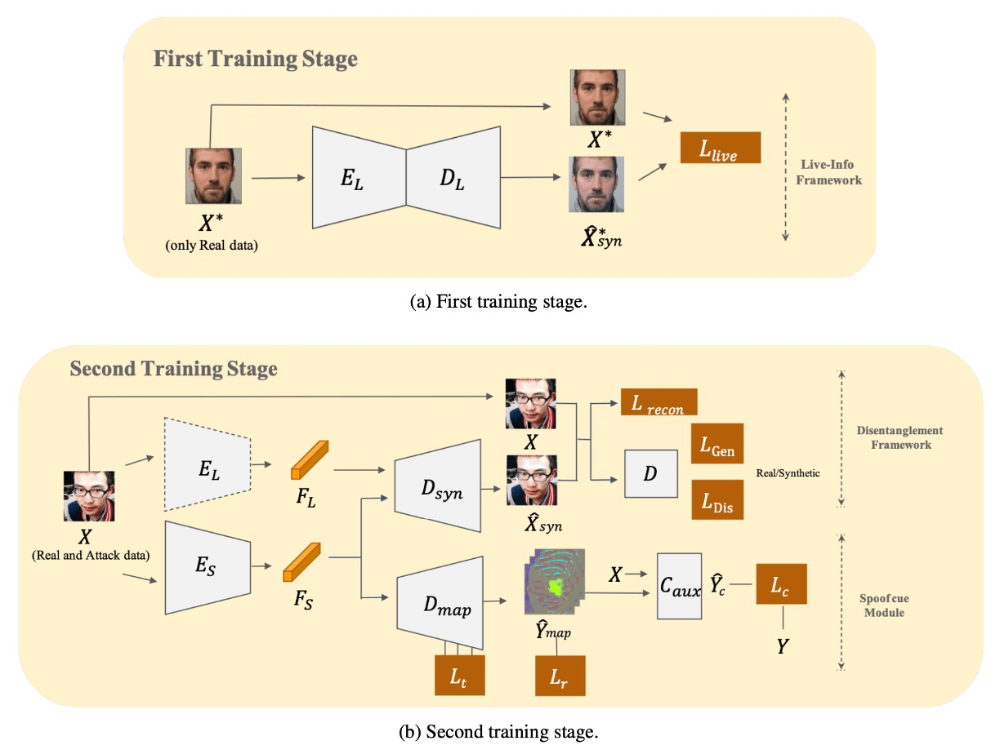
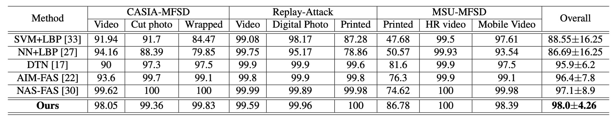
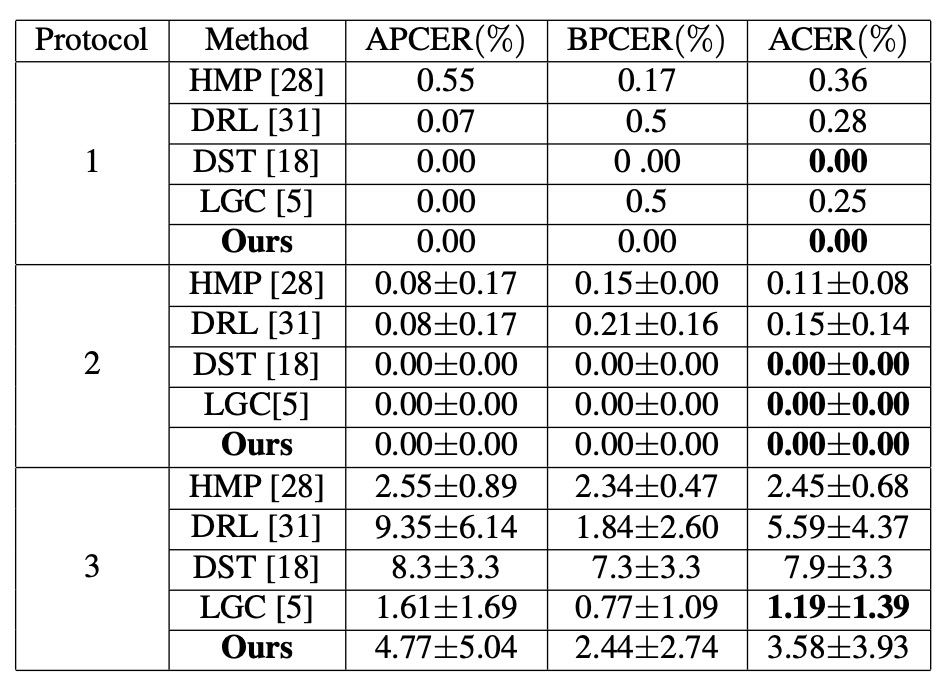
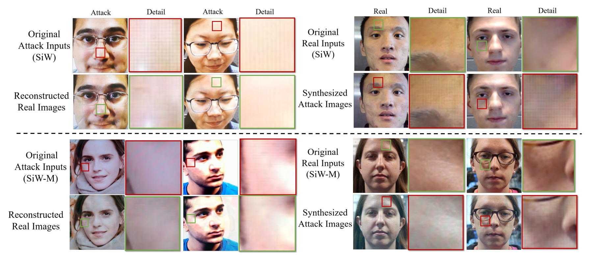
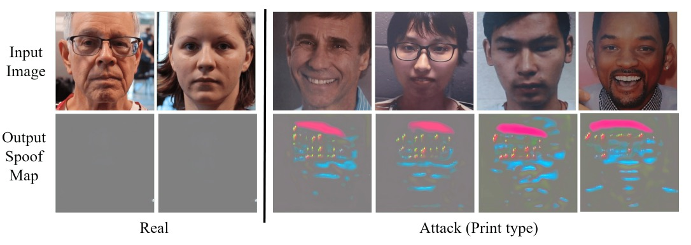
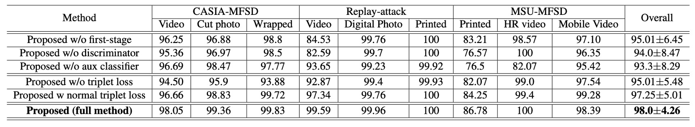

## 複解耦之術

[**Disentangled Representation with Dual-stage Feature Learning for Face Anti-spoofing**](https://arxiv.org/abs/2110.09157)

---

表徵解耦（disentanglement）是愈來愈多人探討的話題。

解耦本身大家還算有所共識，就是要把仿冒特徵抽出來。

那，除了仿冒特徵之外呢，其他的部分呢？

## 定義問題

在多數人臉活體辨識系統中，模型試圖從一張影像中讀出一件事：這是真人，還是偽裝？

但這個判斷，其實是從一團交纏的訊號中推測而來的：**臉的材質、光的殘留或壓縮的痕跡。**

可以說，幾乎所有能混進來的資訊，通通都混進來了。

這正是表徵解耦要處理的核心：

> **不只回答對錯，而是搞清楚你究竟看見了什麼。**

過去幾年，已有不少研究提出各種解耦策略，我們也陸續看了幾篇相關論文。

有些人將潛在空間拆成兩塊，活體特徵與內容特徵各自為政；也有研究試圖把 spoof trace 拆成多尺度殘差，模擬出仿冒殘影。但幾乎所有作法，都建立在一個假設之上：

> **我們能在單一階段裡，同時完成切割與重建**。

而這個假設並不合理，因為事情並不總是如此清楚：

- 一旦解耦與分類目標交疊過深，模型往往傾向走捷徑。
- 對抗式訓練雖能驅動潛在空間的分離，卻容易引發梯度震盪，使整體學習極度不穩。
- 即使引入了輔助監督（如深度圖、rPPG），也難保這些訊號能對所有攻擊形式都奏效。

換言之，我們逼著模型分辨仿冒，卻沒有給它一套穩定學會仿冒語法的方式。

它看得見真假，但看不見真假之間的語法差異；它能分對大多數樣本，但無法理解下一次攻擊會怎麼變形。**表徵解耦的理念，在實踐上仍困於架構不穩定、訊號依賴與未知攻擊的不可測。**

而這篇論文作者認為：

> **不如我們分階段來學吧！**

慢慢來，比較快。

## 解決問題

<figure style={{"width": "90%"}}>

</figure>

在面對未知攻擊時，單純的二元分類遠遠不夠。

作者在這裡選擇以「先分，後拆」的方式，讓模型先找出「活體原型」的所有共通特徵，再逐步剝離出專屬於仿冒的特徵。

如上圖所示，整個模型需要分兩階段才能完成訓練，我們來看一下詳細操作的方法。

### 先學活體資訊

作者先構建一個 **Live-info Network** 來做自編碼學習。

- 輸入：僅有真臉樣本 $x^* \in P_X$
- 編碼器 $E_L$：提取活體特徵 $F_L$
- 解碼器 $D_L$：嘗試重建輸入，輸出 $\hat{x}^*_{syn}$

為了確保模型捕捉到「真臉」的本質，作者以下列損失函數最小化重建誤差：

$$
\mathcal{L}_{Live}
= \mathbb{E}_{x^* \sim P_X} \Big[\big\|x^* - \hat{x}^*_{syn}\big\|_2^2\Big]
$$

在這個階段，模型不會接觸任何攻擊臉，因此 $E_L$ 所萃取的活體特徵相對「純粹」，它能夠描述所有真臉間的共同變異，卻不會受仿冒訊號干擾。

這個編碼器後續將作為**固定權重**的活體訊息萃取器，被引入下一個階段。

### 雙線並行重建

第二階段把仿冒樣本也加入訓練，形成一個「雙線並行重建」的解耦模組：

1. **Live-encoder $E_L$**

   - 直接載入第一階段完成的權重，抽取活體特徵 $F_L$。
   - 此時保持權重凍結，不再更新，確保活體特徵表示不被「污染」。

2. **Spoof-encoder $E_S$**

   - 專門負責提取仿冒特徵 $F_S$，亦即那些在真臉裡不存在或不明顯的攻擊訊號。

3. **重建器 $D$**

   - 根據 $F_L$ 與 $F_S$ 融合後的表徵，嘗試還原輸入影像 $\hat{x}_{syn}$。

為了確保 $D$ 能夠學到完整的重建，同時強迫 $E_S$ 聚焦在「仿冒差異」，作者使用了**重建損失**與**對抗損失**：

- **重建損失**

  $$
  \mathcal{L}_{recon}
  = \mathbb{E}_{x \sim P_X} \Big[\big\|x - \hat{x}_{syn}\big\|_2^2\Big]
  $$

- **生成器損失**

  $$
  \mathcal{L}_{Gen}
  = \mathbb{E}_{x \sim P_X} \Big[(D(\hat{x}_{syn}) - 1)^2\Big]
  $$

- **判別器損失**

  $$
  \mathcal{L}_{Dis}
  = \mathbb{E}_{x \sim P_X} \Big[(D(x) - 1)^2 + (D(\hat{x}_{syn}))^2\Big]
  $$

其中 $D(\cdot)$ 是判別器，負責區分 $\hat{x}_{syn}$ 是否為真實樣本。

透過這樣的對抗機制，模型能同時學習如何在**真臉特徵 $F_L$** 與 **仿冒特徵 $F_S$** 之間進行適切的拆分與拼合。

### 抽取仿冒的線索

作者將 $F_S$ 結合一個類似 U-Net 結構的解碼器 $D_{map}$，試圖將仿冒特徵變成一張 **spoof map**。為了讓這張圖能最大限度區分「真臉 vs. 假臉」，引入了三重損失設計：

1. **Triplet Loss**

   目標是拉近真臉內部距離，拉開真臉與假臉距離。

   以真臉作為 anchor $f_i^a$，找出正樣本（真臉）$f_i^p$ 與負樣本（假臉）$f_i^n$，計算正常三元組損失 $\mathcal{L}_t^{normal}$ 與困難三元組損失 $\mathcal{L}_t^{hard}$，最終相加得 $\mathcal{L}_t$。

2. **最小化真臉殘影損失 ($\mathcal{L}_r$)**

   對真臉來說，理論上不該生成顯著的仿冒圖案，故希望其 spoof map 趨近於零。

   $$
   \mathcal{L}_r
   = \mathbb{E}_{x \sim P_{live}} \Big[\big\|\hat{y}_{map}\big\|_1\Big]
   $$

3. **分類器輔助損失 ($\mathcal{L}_c$)**

   為了強化 spoof map 的可判別性，作者疊合 $\hat{y}_{map}$ 與原圖 $x$ 一同餵給輔助分類器 $C_{aux}$，讓此分類器判斷真假臉。

   $$
   \mathcal{L}_c
   = \mathbb{E}_{(x,y)} \Big[ -y \cdot \log(\hat{y}_c) + (1-y)\cdot \log(1-\hat{y}_c) \Big]
   $$

最終，整體損失函數匯總為：

$$
\mathcal{L}
= \lambda_1 \mathcal{L}_{recon}
+ \lambda_2 \mathcal{L}_{Gen}
+ \lambda_3 \mathcal{L}_t
+ \lambda_4 \mathcal{L}_r
+ \lambda_5 \mathcal{L}_c
$$

其中，論文中設定 $\lambda_1=4,\ \lambda_2=1,\ \lambda_3=3,\ \lambda_4=5,\ \lambda_5=5$。

### 訓練與推論

1. **訓練流程**

   第一階段：只用真臉樣本訓練 $E_L$ 與 $D_L$。

   第二階段：將 $E_L$ 凍結，與新加入的 $E_S$、$D$、$D_{map}$ 一同訓練；對抗損失、重建損失及多重監督對仿冒特徵進行解耦細化。

2. **推論階段**

   僅需使用 $E_S$ 與 $D_{map}$ 生成 spoof map，取其平均值做為 spoof 分數。當分數高於閾值者，即判定為攻擊臉。

   在 GeForce GTX 1080 環境下，作者報告可達 **121.48±1.4 FPS** 的推論速度。

根據以上設計，作者直接把訓練過程分割成「學習活體」與「分離仿冒」兩個部分，在不依賴任何外在輔助訊號（如深度圖、rPPG）的情況下，依然可以在未知攻擊場景中依然維持穩定的判斷力。

## 討論

### 跨類型實驗表現

上表是在 SiW-M 上的實驗結果，其中包含了各種不同的攻擊類型。本論文的方法在平均 ACER 與 EER 顯著優於同類研究，不只平均值低，也展現了**小標準差**的穩定性。

接著是在 **MSU-MFSD, CASIA-MFSD, Replay-Attack** 等多資料集測試下的數據，可以看到本方法同樣達到 **98.0% AUC** 的整體最佳成績，尤其在「印刷攻擊」這類過去容易失誤的情境，提升尤為明顯。

由此可以看出雙階段解耦策略，對於各種不同材料與成像手段的假臉，都能保持均衡的辨識效果。

### 同類型實驗表現

<figure style={{"width": "70%"}}>

</figure>

針對臉部表情、光照、攝影裝置等因素的改變，作者使用了 SiW 中的 3 個子協定進行測試：

1. **Protocol 1、2**：DualStage 表現優異，能順利處理一般姿態與光線差異。
2. **Protocol 3**：由於訓練資料只含一種攻擊類型，模型無法充分探索多樣仿冒特徵，ACER 稍高在 3.58%，但仍保持在可競爭範圍。

實驗結果顯示在同類型（已知攻擊手法）場景下，DualStage 不僅能學到穩定的「活體表示」，也能應付基本環境變化。

### Disentangled Features 視覺化

為了展示解耦後的特徵，作者做了「換臉實驗」。

方法是將真臉的 live feature 與假臉的 spoof feature 互換，生成對應的攻擊臉或真臉。

結果顯示，在交換特徵之後，真臉圖案上會浮現「條紋或灰階失衡」等仿冒紋理；而原本的攻擊臉則會部分恢復自然膚色。

由此可見，**spoof feature** 在此框架中確實承擔了「仿冒殘影」的角色，是驅動攻擊圖案生成的關鍵因子。

### Spoof Map 分析

最後，為了看看解耦後的 spoof feature 究竟長什麼樣子，作者將解耦後的 **spoof feature** 再透過 U-Net 風格的解碼器 $D_{map}$ 生成偵測圖。

在真臉樣本中，spoof map 幾近零值；在假臉樣本中，則會於局部出現明顯高亮區域（例如螢幕邊緣、口鼻細節）。

這表示 DualStage 不只進行了「抽象特徵」的解耦，同時能在影像空間給出可視化線索，幫助觀察與分析。

### 消融實驗

由於 DualStage 使用非常多的損失函數，作者在實驗中也針對這些損失的影響進行了消融實驗，並將結果與其他方法進行比較。

首先取消第一階段 (w/o first stage) 或移除對抗損失時，模型在某些攻擊上失效嚴重。接著移除三元組（triplet）相關損失，則會使 spoof map 區分真攻樣本的能力大幅削弱。

由此可見，**「先以一類真臉學習 + 對抗生成 + 多重 triplet」** 的組合，是本模型重要的設計。

## 結論

DualStage 提出了一種不太華麗的設計：

**將表徵解耦拆成兩段進行，先穩定地學會活體特徵，再從中剝離出仿冒訊號。**

不需要額外的深度圖、不倚賴 rPPG，僅透過影像本身，模型便能生成具判斷力的 spoof map，並在多個公開資料集上展現強韌的跨類型泛化能力。這讓它在沒有多模態支撐的條件下，仍能站穩一席。

當然，它仍然有缺點：在攻擊樣式極度稀疏的場景中（如 SiW 協定三），表現並不出色。未來若要再推進，或許得進一步處理那些被視為「不相干」卻實則干擾判斷的特徵碎片。

但作為方法論上的提案，它留下了一個還不算過時的訊號：

> **解耦這件事，不用急著一次完成。**

模型可以慢慢學，只要你給它對的順序。
