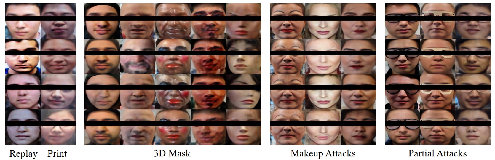
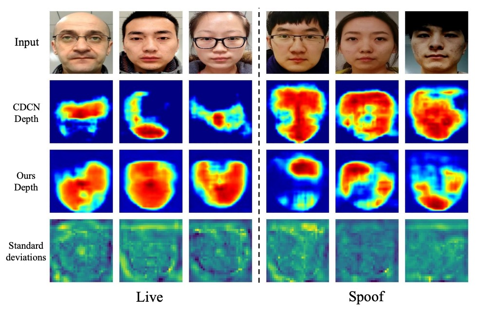

## 假象重組的前夜

[**Dual Spoof Disentanglement Generation for Face Anti-spoofing with Depth Uncertainty Learning**](https://arxiv.org/abs/2112.00568)

---

有些假象，不是難以識破，而是你從未看過它出現的樣子。

## 定義問題

當人臉辨識系統開始承擔真實世界的驗證責任，辨識準確率不再只是 leaderboard 上的一個數字，而是一道風險的邊界。FAS（Face Anti-Spoofing）作為這條邊界的守門人，近年已從二分類任務逐步演化為一場針對多樣變異的泛化博弈。

然而，大多數現有方法仍困於一個未曾徹底解決的前提：

> **資料的侷限性，導致模型對未知身份與攻擊樣式普遍缺乏辨識能力**。

我們所使用的訓練資料集，多半來自封閉環境、固定設備、少量身份與有限攻擊形式。

例如，OULU-NPU 僅有 20 位受試者，SiW 為 90 人；這樣的數據分布，無法支撐模型在實際部署中面對多源設備、多國人種、複雜光照與攻擊技巧的挑戰。所導致的結果就是模型過擬合於訓練樣本，對未見條件下的攻擊無法有效辨識。

尋找更多，更多，更多的資料，成為理所當然的解法。

如果說要考慮圖像轉換方法，大多僅能「換臉不換人」，產生的樣本仍綁定於原始身份；而基於外部資料蒐集的合成流程，則面臨版權、標註、人力與延遲等實務性成本。

進一步來看，當我們試圖引入生成模型解決資料瓶頸時，也不可避免地遭遇另一個問題：

> **合成樣本的品質參差，可能干擾監督訊號的穩定性**。

尤其在以深度圖作為監督訊號的框架中，模糊與扭曲影像會直接影響深度預測準確性，進而讓整體訓練過程失去收斂性與可解釋性。

這是一個雙重問題結構：

- 如何生成同時具備新身份與既有攻擊樣態的合成影像，提升資料的內在變異性？
- 同時確保這些生成樣本不會反向污染深度監督訓練，使主網路學到錯誤的視覺線索？

這篇論文的作者直面這個問題，從合成資料的生成邏輯與訓練流程兩個面向，提出了對應的解決方案。

在繼續下一章節之前，我們可以先將焦點放回最初的問題：

> **一個真正有用的 FAS 系統，需要看過多少假象，才有能力說出「這不是真的」？**

## 解決問題

為了解決「資料匱乏」及「影像失真」兩大問題，作者整合「生成式資料增強」與「不確定性學習」兩條思路，建立了雙模組架構，分別為：

- **DSDG**（Dual Spoof Disentanglement Generation）
- **DUL**（Depth Uncertainty Learning）

### Dual Spoof Disentanglement Generation (DSDG)

<figure style={{"width": "90%"}}>

</figure>

DSDG 的核心目標是**在無外部資料前提下，自動合成多樣化且具成對結構的活體/攻擊樣本**。

作者透過一個雙編碼器的 VAE（Variational Autoencoder），將人臉影像拆解為「身份特徵」與「攻擊特徵」，然後再把它們重組至解碼器，產生新的成對影像。

這種方式可同時擴增身份與攻擊模式的覆蓋範圍。

如上圖 (a) 所示，整體結構包含兩個編碼器與一個解碼器，外加用於區分 spoof 與 identity 特徵的解耦模組。具體步驟如下：

1. **雙編碼器輸出特徵**

   - **$\text{Enc}_s$** 則輸入攻擊影像 $I_{\text{spoof}}$，同時分離出「攻擊樣式特徵」$z^t_s$ 與「身份特徵」$z^i_s$。
   - **$\text{Enc}_l$** 負責將活體影像 $I_{\text{live}}$ 映射到身份特徵 $z^i_l$；

   其中，透過 reparameterization trick，每個編碼器實際輸出平均值 $\mu$ 和標準差 $\sigma$，再以

   $$
   z = \mu + \epsilon \sigma,\quad \epsilon \sim \mathcal{N}(0, I)
   $$

   的方式取得對應特徵。

   :::tip
   **Reparameterization trick** 來自 [**Auto-Encoding Variational Bayes**](https://arxiv.org/abs/1312.6114) 這篇論文。

   簡單來說，它讓變分自編碼器中的隨機抽樣可以被梯度倒傳遞參與。這個技巧使 VAE 訓練更穩定、收斂更快。
   :::

2. **重建與解耦**

   解碼器 $\text{Dec}$ 接收三個特徵 $(z^t_s, z^i_s, z^i_l)$ 後，分別生成重建後的 $\hat{I}_{\text{spoof}}$ 與 $\hat{I}_{\text{live}}$。

   為使攻擊特徵能被正確抽離，作者在 $z^t_s$ 上附加一個 spoof classifier，並利用交叉熵損失 ($L_{\text{cls}}$) 使其預測正確攻擊類型。

   同時，作者也在攻擊特徵 $(z^t_s)$ 與身份特徵 $(z^i_s)$ 之間引入「角度正交」約束 ($L_{\text{ort}}$)，鼓勵兩者在向量空間彼此垂直，不致混淆。

3. **分佈對齊與重建損失**

   為實現 VAE 對特徵分佈的學習，作者使用 Kullback-Leibler (KL) 散度 ($L_{\text{kl}}$) 讓編碼後的分佈貼近標準高斯。

   透過 L1 或 L2 距離 ($L_{\text{rec}}$)，確保重建影像能夠逼近輸入原影像。

   此外，透過 MMD ($L_{\text{mmd}}$) 與身份特徵映射 ($L_{\text{pair}}$)，達成對身份空間的分佈對齊，保證同一張臉在 live 與 spoof 兩種形態下的身份一致性。

作者將上述所有損失合併成下列總目標函數：

$$
\mathcal{L} \;=\; L_{\text{kl}} + L_{\text{rec}} \;+\; \lambda_1 L_{\text{mmd}} \;+\; \lambda_2 L_{\text{pair}} \;+\; \lambda_3 L_{\text{ort}} \;+\; \lambda_4 L_{\text{cls}}
$$

經過上述 VAE-like 訓練完成後，即可如上圖 (b) 所示，使用標準高斯雜訊產生多組 $(\hat{z}^t_s, \hat{z}^i_s)$，複製 $\hat{z}^i_s$ 作為 $\hat{z}^i_l$（確保「成對」身份一致），再交由解碼器生成新樣本 $(\hat{I}_{\text{spoof}}, \hat{I}_{\text{live}})$。

此過程不需額外標註或外部資料，即可「無中生有」地大量擴增具新身份、原始攻擊模式的合成影像。然而，由於 VAE 天生可能產生影像模糊或局部失真，這些雜訊樣本若直接納入訓練，恐混淆深度監督。

為此，作者提出了 **Depth Uncertainty Learning** 來因應。

### Depth Uncertainty Learning (DUL)

<figure style={{"width": "70%"}}>

</figure>

除了合成樣本本身的多樣性，作者進一步針對深度監督的干擾問題，引入一種不確定性表示機制，透過高斯分佈來量化並抑制生成雜訊的負面影響。

傳統的深度監督方法，對每個影像區塊只產生一個固定深度值。然而，當合成影像帶有局部失真時，深度標註往往不夠可信。

作者將深度值視為「高斯分佈」$\mathcal{N}(\mu_{i,j},\,\sigma_{i,j}^2)$，其中 $\mu_{i,j}$ 為可學習的深度平均值，$\sigma_{i,j}$ 表示不確定度。

在訓練時，真正參與損失計算的是一個採樣值 $d_{i,j} = \mu_{i,j} + \epsilon \sigma_{i,j}$，而 $\epsilon \sim \mathcal{N}(0, I)$。

使用這種「重參數化」的方式使得不確定性可通過反向傳播進行學習。

在這個框架中，Depth Uncertainty Module (DUM) 對深度特徵圖做兩路卷積運算：一路輸出 $\mu_{i,j}$，另一路輸出 $\sigma_{i,j}$。

接著透過 KL 散度，將 $\mathcal{N}(\mu_{i,j}, \sigma_{i,j}^2)$ 對齊到由真實深度值構建的高斯分佈 $\mathcal{N}(\hat{\mu}_{i,j}, I)$，確保學習過程能逐漸聚焦於可靠深度。

實務上，只需替換或加掛 DUM 至任何原有深度預測主網路（如 ResNet 或 CDCN），即可在像素級別輸出「均值＋不確定度」。

作者在此同樣利用均方誤差 ($L_{\text{MSE}}$) 作為主要的深度監督，並在總目標函數中增添一個 $\lambda_{\text{kl}} L_{\text{kl}}$ 權重項，以控制不確定度正則化的強度。

綜合來看，整體損失可表示為：

$$
L_{\text{overall}} \;=\; L_{\text{MSE}} \;+\; \lambda_{\text{kl}} \, L_{\text{kl}} \;+\; \lambda_g \Bigl(L_{\text{MSE}}' + \lambda_{\text{kl}} L_{\text{kl}}'\Bigr),
$$

其中 $\lambda_g$ 為控制「合成資料」佔比的超參數，讓訓練可同時兼顧真實與生成樣本的貢獻。

透過上述兩個核心模組，作者成功地將 FAS 的訓練過程轉化為一個「資料增強」與「不確定性學習」的雙重結構。

## 討論

作者在本章節中針對多面向實驗與可視化進行了系統性討論，說明了 DSDG 透過 VAE 生成高變異度資料、DUM 透過不確定度抑制雜訊，最終在多場景、多攻擊型態與跨資料集的實驗下證實了有效性。

### 消融實驗

作者針對關鍵超參數與模組配置進行消融實驗，重點包括身份數量對性能的影響、生成影像佔比 ($r$ 值) 調整，以及各子損失（如 $L_{\text{mmd}}, L_{\text{pair}}, L_{\text{ort}}$）對於身份解耦的貢獻。

1. **身份數量與泛化性能**

    

    <figure style={{"width": "60%"}}>
    
    </figure>
    

   以 OULU-NPU Protocol 1 (P1) 為例，上表顯示：隨著身份數量由 5 至 20 遞增，模型在 ACER 指標上有明顯下降。證明當基礎資料庫中能涵蓋更多人臉變異度，DSDG 強化所帶來的效果更為穩定。

2. **生成影像佔比 $r$**

    

    <figure style={{"width": "70%"}}>
    
    </figure>
    

   作者分析了訓練批次中「原始樣本 : 生成樣本」的比例，發現當 $r$ 為 0.75 時，ACER 表現最佳。

    

    <figure style={{"width": "70%"}}>
    
    </figure>
    

   進一步增減生成影像數量（由 10k 到 30k），結果顯示在 20k 左右的規模最為平衡，有利於減少雜訊干擾。

3. **身份解耦損失的重要性**

    

    <figure style={{"width": "80%"}}>
    
    </figure>
    

   在對照實驗中，一旦拿掉 $L_{\text{mmd}}$ 或 $L_{\text{pair}}$ 或 $L_{\text{ort}}$ 任一項，最終 ACER 皆顯著上升。

   表明作者設計的三重身份約束，對確保攻擊模式與人臉身份正確分離的重要性。

4. **超參數 $\lambda_{\text{kl}}$ 與 $\lambda_{g}$**

    

    <figure style={{"width": "70%"}}>
    
    </figure>
    

   作者對 KL 權重 ($\lambda_{\text{kl}}$) 及生成資料佔比 ($\lambda_{g}$) 的靈敏度測試。結果顯示，在較寬鬆範圍內皆可獲得比 baseline 更優的 ACER，表示方法對超參數不敏感，也保有應用彈性。

### Intra Testing

:::info
論文表格過於巨大，直接放在這裡會影響可讀性，請直接參考原始論文。
:::

為檢驗模型在相同資料集內的辨識能力，作者選擇 OULU-NPU 與 SiW。

- **OULU-NPU (見論文中的 Table X)**：在四大協定中，DSDG + DUM 均拿下最佳成績，特別是在 Protocol 4（跨光照、攻擊形式、攝影機等多重未知）的難度場景。
- **SiW (見論文中的 Table XI)**：於三個協定下，同樣在前兩條協定達到最低 ACER；在 Protocol 3 中成績略低於最頂尖方法，但仍優於原始 CDCN。

此部分驗證了無外部資料狀態下，融合生成增強與深度不確定度的優勢，確保系統在大部分常見攻擊類型與環境變動下具備相當穩定度。

### 模型分析與可視化

作者藉由多種視覺化手段，展示生成影像的樣態、攻擊特徵解耦與深度不確定性分布，幫助讀者理解 DSDG 與 DUM 的內部運作原理。

1. **生成影像**

    

    <figure style={{"width": "90%"}}>
    
    </figure>
    

   上圖為不同身份、同種攻擊／同一身份、多樣攻擊樣式等對照圖，顯示 DSDG 確實能同時擴增身份與保留原攻擊痕跡。

    

    <figure style={{"width": "90%"}}>
    
    </figure>
    

   在 SiW-M 這種攻擊多元的資料下，作者也展示了 3D Mask、Makeup、Partial Attacks 等生成結果，驗證了 VAE 部分失真的可控範圍。

2. **攻擊模式解耦**

    

    <figure style={{"width": "90%"}}>
    
    </figure>
    

   將同一身份下替換不同 spoof-type 特徵所得到的影像放在同圖，可見 live 與 spoof 生成結果有清晰區分。使用 t-SNE 投影後，若不使用分類器與正交損失 ($L_{\text{ort}}$)，各類攻擊分布容易重疊；啟用後則形成明顯聚類。

3. **深度不確定性**

    

    <figure style={{"width": "90%"}}>
    
    </figure>
    

   在失真區域，標準差顯著提高（紅色區域），顯示模型確實能對「難以判斷」的像素自動降低權重。與 CDCN 的對比實例顯示，DUM 幫助系統更精準定位真實邊緣與反射區，進而提升對一些邊界模糊樣本的判別能力。

## 結論

DSDG 回答了一個樸素卻長存的問題：在沒有額外標註與外部數據時，如何同時擴增身份與攻擊多樣性，並抑制生成雜訊對深度監督的侵蝕？

它不是網路結構的突破，而是一種資料語法與學習穩定性的修補。

這邊論文發表的時候，正處於處於 deepfake 泛濫尚未全面爆發、Diffusion 模型尚未主流應用的前夜。但作者已經意識到「資料問題不能只靠資料解決」，也試圖用生成與不確定性兩個模組化策略，推進當時泛化能力的邊界。

當然，它仍有它的侷限：

- 使用 VAE 作為生成骨架，在解析度與細節穩定性上受到限制；
- 對深度的依賴設計，讓整體方法難以延伸至非深度監督的場景；
- 對 spoof type 的依賴仍未徹底鬆綁，在更純粹無標註設定下仍有衝擊。

但這些都不妨礙它在技術鏈中的定位，DSDG 提醒我們：

> **資料多樣性、監督可信度、模型容錯性，三者必須同步考慮，否則強化只是堆疊雜訊。**

模型會進化，攻擊會變異，演算法會被遺忘。

但那些曾經試圖拆解問題結構、而非只追求分數的人，會留下影子，成為後來者前進的節點。
