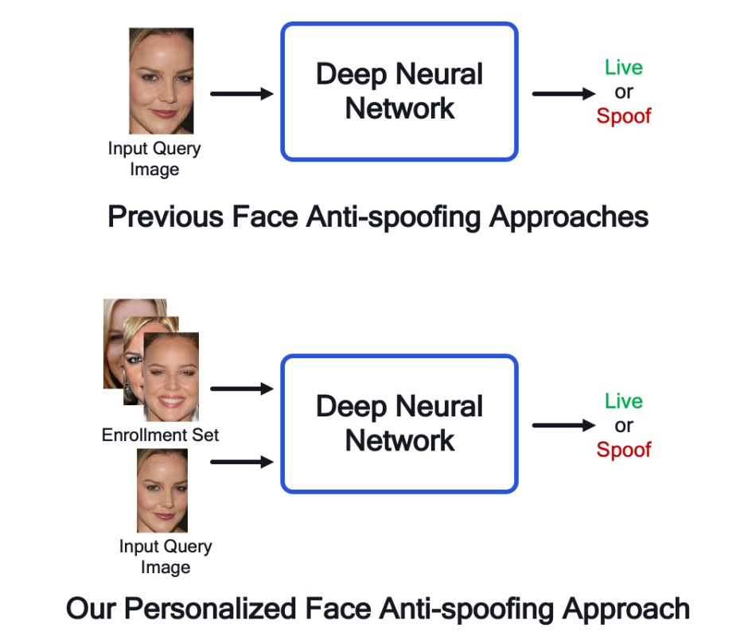

## 個人化的嘗試

[**A Personalized Benchmark for Face Anti-spoofing**](https://openaccess.thecvf.com/content/WACV2022W/MAP-A/papers/Belli_A_Personalized_Benchmark_for_Face_Anti-Spoofing_WACVW_2022_paper.pdf)

---

這篇論文偏向應用層面，引用數量不多。

但是它針對現有的 FAS 模型提出了個人化的 benchmark，概念上有契合到目前社會上對於隱私的重視，我們來看一下。

## 定義問題

<figure style={{"width": "60%"}}>

</figure>

我們也陸續看了幾篇 FAS 的論文。

其中的工作模式就是把一張新的圖片，送進已經訓練好的 FAS 模型，然後模型會告訴你這張圖片是 live 還是 spoof。這個過程中，模型會根據圖片的特徵來進行判斷。

而這篇論文的作者則是把主意打到了「使用者註冊影像」上面。

目前的人臉辨識模型都是基於「度量學習」的架構。在實際的應用中，使用者會在註冊的時候拍攝一張（或多張）照片存入系統中，後續的驗證過程會基於這些註冊的照片來進行比對。

那為什麼不把這些註冊的照片也拿來當作 FAS 模型的參考呢？

這篇論文的作者就提出了這樣的想法，並且在實驗中證明了這個方法的有效性。

## 解決問題

### 模型架構

<figure style={{"width": "90%"}}>

</figure>

本研究提出一套簡潔但可擴充的個人化 FAS 架構，其核心理念為：將來自使用者註冊階段的影像（Enrollment Set）視為「個人活體參照」，並藉由特徵聚合機制與當前查詢影像（Query）進行比較，以強化活體辨識的可靠性。整體流程如上圖所示，可分為以下三個階段：

1. **雙路徑特徵擷取模組**：

   模型使用兩組彼此獨立的 CNN encoder，分別針對 query 圖像與 enrollment 圖像進行編碼。這項設計有助於避免兩者間資訊的干擾，也因應實務中不同影像來源（查詢拍攝 vs 註冊影像）在品質、環境與設備上的差異。

   - 查詢圖像 $I_q$ 透過 encoder $\phi_q$ 提取為特徵向量 $f_q \in \mathbb{R}^D$
   - Enrollment 圖像 $\{I^i_e\}_{i=1}^N$ 則由另一 encoder $\phi_e$ 分別編碼為 $\{f^i_e\}_{i=1}^N$

2. **Enrollment 特徵聚合模組**：

   模型需將多張 enrollment 圖像的特徵整合為單一潛在向量 $f^{agg}_e$，作為該使用者的個人化代表。這裡作者探索了多種聚合策略，包括：

   - **非參數方法**

     - **Concatenation**

       - 將 $N$ 個 enrollment 特徵串接成 $N \cdot D$ 長度向量
       - 保留完整資訊，但順序敏感，無 permutation-invariance

     - **Mean**

       - 對 $N$ 個特徵取平均
         $$
         f^{agg}_e = \frac{1}{N} \sum_{i=1}^N f^i_e
         $$
       - 高度壓縮為單一向量，具順序不變性
       - 搭配 MLP 建模 query 與 enrollment 之間的對應關係

       ***

   - **序列建模（GRU）**

     - Enrollment 特徵視為時間序列（特別適用於 SiW 影片 frame）
     - 使用 GRU 演算法遞迴聚合：
       $$
       h_l^i = \text{GRU}(f_l^i, h_l^{i-1})
       $$
     - 最後一層的 hidden state 作為聚合特徵 $f^{agg}_e = h_L^N$

     這個方式適合建模 enrollment 特徵中的 **時間與變化關係**，可捕捉姿勢轉換、表情變化等連續資訊。

     ***

   - **賦權式學習（Attention）**

     對 query 和 enrollment 特徵使用 key-query-value attention：

     $$
     f^{agg}_e = \text{Softmax} \left( \frac{QK^T}{\sqrt{M}} \right)V
     $$

     具體作法為：

     - $Q = A_Q(f_q)$
     - $K_i = A_K(f^i_e)$, $V_i = A_V(f^i_e)$
     - $A_Q, A_K, A_V$ 均為 linear layer

     這個方式適合建模 query 與 enrollment 特徵間的 **相似性**，可強化 query 與 enrollment 的對應關係。

     ***

   - **圖神經網路（GNN）**

     將 query + enrollment 特徵視為圖中節點

     - $N + 1$ 個節點：query + N 個 enrollment

     每層 GNN 執行：

     1. 計算鄰接矩陣 $A_l$：基於節點特徵間的距離函數 $\psi_l(f^i_l, f^j_l)$
     2. 圖卷積更新節點特徵：
        $$
        f^{i}_{l+1} = \rho \left( \sum_{A_l \in \mathcal{A}_l} A_l f^i_l W_l \right)
        $$

     最終使用 query 節點的特徵作為分類輸入。

     這個方式適合建模 enrollment 特徵間的 **相對關係**，可捕捉不同 enrollment 圖像間的相似性與差異性。

     ***

   在實驗中，最簡單的平均法（mean operator）反而展現出穩定且優異的表現，顯示即使在不改變模型主體架構的前提下，透過簡潔的聚合策略也能有效導入個人化概念。

3. **特徵融合與分類模組**：

   最後，將 query 特徵 $f_q$ 與聚合後的 enrollment 特徵 $f^{agg}_e$ 進行串接，並輸入 MLP 進行分類。模型透過端到端訓練學習兩者之間的對應關係，並預測該 query 圖像的 spoof 機率。

此架構的最大亮點在於其**高度可擴充性與部署友善性**。

由於 enrollment 特徵可預先於註冊階段計算並儲存為嵌入向量，後續的查詢流程僅需一次前向傳遞，既降低計算負擔，也能配合安全加密的設計保障使用者隱私。未來即便擴充至多模態輸入（如 RGB + Depth + IR）或其他 backbone，亦可無痛整合，展現出極高的實務潛力。

### 建置資料集

為驗證所提模型架構的效益，作者將現有的公開 FAS 資料集進行改造，打造出首批具備「使用者 enrollment 對應關係」的個人化版本，分別為：

- **CASp-Enroll**（由 CelebA-Spoof 改造）
- **SiW-Enroll**（由 SiW 改造）。

這套資料集轉換流程具備通用性，適用於任何含有 subject metadata 的反欺騙資料集，其核心邏輯如下：

- 原始資料集中，每筆資料為一張 query 圖像及其 spoof 標籤
  $$
  d_i = (I_q^{(i)}, t_q^{(i)})
  $$
- 個人化資料集則新增對應的 enrollment set，包含同一使用者的 N 張 live 圖像：
  $$
  d_i = (I_q^{(i)}, t_q^{(i)}, \mathbf{e}^{(i)}), \quad \text{其中 } \mathbf{e}^{(i)} = (I^1_e, ..., I^N_e)
  $$
- 為每位使用者建立唯一對應的 enrollment，並將其套用於所有該使用者的 query 樣本

### CelebA-Spoof-Enroll（CASp-EnrollN）

CelebA-Spoof 為當前最大規模之一的活體辨識資料集，涵蓋超過 10,000 名使用者與 60 萬張圖像。為建立 CASp-Enroll，作者制定以下策略：

- 設定固定 enrollment 數量 N（如 N=5），確保每位使用者都能建立統一維度的參照集
- 對每位使用者進行篩選：若其 live 樣本數未達 N，則排除
- 將前 N 張 live 圖像指定為 enrollment，剩餘 live + spoof 為 query
- Enrollment 選取採檔名排序，避免隨機因素引入偏差

透過這樣的資料切分邏輯，不僅維持資料標準化，也貼合實務上「事先註冊 → 後續驗證」的應用流程。

### SiW-Enroll（SiW-EnrollN）

SiW 是一個以高品質影片為基礎的反欺騙資料集，原始資料來自 165 位受試者所拍攝的 4,478 支短片。為將其個人化轉換：

- 先按 Protocol 1 切分 train/test，再以每 10 幀抽樣，避免過度樣本重複
- 對每位使用者 × 設備組合，選取一支代表影片，並從中平均抽取 N 張 frame 作為 enrollment
- 為模擬實際設備操作場景，影片需符合：
  - 無光源變化
  - 有姿勢變化（以提升 enrollment 表徵多樣性）
- 該影片所有 frame 均排除於 query，避免資訊洩漏

此設計模擬現實中「多設備登入」、「不同拍攝品質」的場景，展現出更具挑戰性與真實性的測試條件。

## 討論

### 個人化真的好嗎？

實驗結果如上表，我們可以清楚看到，在兩組個人化資料集（**CASp-Enroll5** 與 **SiW-Enroll5**）上，導入 enrollment 資訊後的模型，**在所有 backbone 組合中皆優於 baseline**，展現出個人化機制的明顯效益。

- 在 **CASp-Enroll5** 上，個人化版本帶來最高 **+2.2% 的 AUC10 提升**，尤其是對 VGG16 與 ResNet18 等傳統架構而言，增幅最為顯著。
- **FeatherNet** 雖為專為 FAS 設計的輕量模型，但加入個人化後依然有穩定進步，顯示這個方法不只對大模型有用，對資源敏感的部署架構也同樣有效。

相較之下，**SiW-Enroll5** 的提升幅度較小，推測與其 enrollment 組成較為單一、變異性較低有關，導致個人化參照資訊的辨識力不如 CASp-Enroll5 豐富。

這項結果直接回應了我們的第一個研究問題：

> **加入個人化參照資料，是否能真正改善 FAS 的判斷效能？**

答案是肯定的。

即便不調整模型架構、不更改 loss function，只要提供來自同一使用者的 enrollment set，模型就能學習到更具鑑別力的匹配準則。

:::tip
這代表即使是現有的 FAS 系統，只要擴充一組註冊流程並維護少量 live 資料，就能獲得額外的防偽保障，不需大規模重新訓練。對部署在行動裝置的系統尤其有吸引力。
:::

### 最簡單的方法最好？

<figure style={{"width": "70%"}}>

</figure>

作者評估了五種不同的 enrollment 特徵聚合方法。

從圖中實驗結果可見：

> **表現最穩定、效能最高的，竟是最簡單的平均（Mean）方法。**

我們具體觀察：

- 在 **CASp-Enroll5** 上，Mean 聚合取得最高 AUC 與 AUC10（98.6 / 94.1），同時也讓 EER 降至全場最低（5.9），展現出極高的綜合性能。
- 在 **SiW-Enroll5** 中，Mean 雖然不是最高，但也接近最佳值，並穩定維持在前三名，表現一致。
- 相較之下，**Attention** 的結果令人意外地落後，不僅未優於 baseline，在 SiW 中甚至略為退步（EER 提升至 7.1）。
- GNN 雖展現一定表達能力，但在 CASp 中反而落後於非參數方法，表示其複雜度未能帶來對等的效益。

這些結果再次呼應了在模型設計中的一項常見現象：**越複雜的機制，並不一定越有效。** 特別是在 enrollment 資料品質與規模有限的前提下，簡單的方法反而更容易學習穩定的匹配邏輯。

:::tip
若目標是在既有 FAS 架構中快速引入個人化能力，**優先選用 Mean 聚合策略**，可保有較佳的效能與極低的計算成本。
:::

### 不可共用 encoder？

<figure style={{"width": "70%"}}>

</figure>

這項消融實驗嘗試回答一個關鍵問題：**query 圖像與 enrollment 圖像，是否可以共用同一組 feature extractor？**

從直覺上來看，兩者皆為人臉影像，輸入型態相同，理應可以由同一組 CNN encoder 處理；然而，實驗結果卻給出一個明確且意外的結論：

> **共用 encoder 不僅沒有幫助，反而顯著傷害模型效能。**

實驗結果如上表，當我們將 query 與 enrollment 圖像交由同一個 encoder 進行特徵提取時：

- **在 CASp-Enroll5 上**，AUC10 明顯下降（由 94.1 降至 90.8），EER 急升至 13.7%，甚至低於無個人化的 baseline。
- **在 SiW-Enroll5 上**，更是重創效能，EER 高達 20.6%，代表模型在判斷 live/spoof 上幾近失效。

相對之下，採用獨立的 encoder 設計則維持原有高效表現。

:::tip
Enrollment 與 Query 的任務角色雖然相似，但資訊性質不同，應保留獨立學習路徑。
:::

## 結論

這項研究提出了個人化 FAS 的全新思路，透過引入使用者的註冊影像作為參照，讓模型在辨識過程中得以結合個體特徵，有效提升 spoof 攻擊的辨識能力。從建立 benchmark、轉換流程，到評估聚合策略與模型設計，整體工作清晰而具啟發性，為未來針對使用者差異化的 FAS 系統提供了起點。

:::tip
我們從安全性與攻擊面的解度來看：

- **註冊資料的真實性與完整性無法保證**：若有心人士於 enrollment 階段上傳偽造或模糊影像，可能反而讓系統學習到「錯誤的活體參照」，形成全新類型的攻擊面。
- **資料偏差與公平性問題尚未探討**：目前實驗集中於演員與受控拍攝資料，是否能適用於一般使用者、不同族群與場景，仍有待進一步驗證。

在落實應用前，我們仍需在攻擊風險評估、系統防範設計與個資法規對應等方面進行更完整的驗證與設計。
:::
