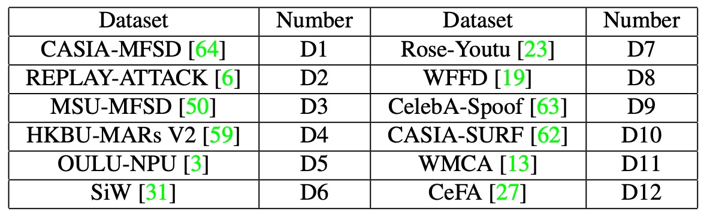

## 風格的殘影

[**Domain Generalization via Shuffled Style Assembly for Face Anti-Spoofing**](https://arxiv.org/abs/2203.05340)

---

這次來看一篇有名的論文。

這篇論文引入了「風格」的概念，搭配對比學習強調活體相關線索，是 style-aware DG 設計的重要突破。

## 定義問題

活體辨識（Face Anti-Spoofing, FAS）始終處於一場看不見的戰爭之中。

傳統 FAS 方法仰賴手工特徵，如 LBP 與 SIFT，擷取圖像中紋理細節；深度學習時代後，開始以 CNN 為基礎，訓練出活體與攻擊的二元分類器，並導入各種輔助資訊：深度圖、反射圖、血流訊號（rPPG）等，以豐富輸入的辨識線索。

然而，即使表現穩定，這類方法多半只在「實驗室條件」下奏效。

一旦踏出原始訓練資料的邊界，效能就會明顯下滑，尤其是在面對不同設備、不同光線、不同攻擊手法的情境下，模型判斷開始搖擺不定，甚至出現嚴重錯判。

此現象被歸結為 **跨域泛化困境（Cross-Domain Generalization）**，其根源主要來自以下三點：

- **資料偏態**：訓練資料覆蓋範圍狹窄，無法囊括所有潛在變異；
- **特徵過擬合**：模型學到的是某一類域的表面樣貌，而非活體本質；
- **模型泛化結構設計不足**：大多數模型仍延續傳統 CNN 流程，忽略了樣本間細緻差異。

為了改善泛化能力，研究者們投入大量精力於 **Domain Adaptation (DA)** 與 **Domain Generalization (DG)**：

- DA 方法如 MMD 最小化、對抗式對齊、多判別器學習等，致力於在不同資料分布間找到共同嵌入空間；
- DG 則嘗試在無目標資料參與下，學得可泛用的表徵，例如利用特徵解耦（Disentangled Representation）、元學習（Meta-Learning）等策略。

這些方法在某些設定下確實提升了模型穩定性，但也揭露出一個更深層的問題：

> **我們對「何為關鍵特徵」的理解仍不完整**。

活體辨識並非圖像分類任務，它不依賴整體語意，而依賴細節：如皮膚紋理的連續性、反光區域的擴散程度、微弱脈動的節奏感。而這些，恰恰是風格與統計資訊所攜帶的訊號。

此處，**正規化層（Normalization Layers）** 成為關鍵觀察點：

- **Batch Normalization (BN)** 側重於跨樣本的整體統計，能強化語意一致性；
- **Instance Normalization (IN)** 則聚焦於單張樣本，捕捉獨特樣態與風格表徵。

兩者對模型行為的導向南轅北轍，前者追求穩定，後者擷取變異。而在 FAS 任務中，這種微妙平衡經常被忽略。

目前對於風格轉換（Style Transfer）的嘗試，多半停留在訓練前的資料增強階段，無法直接納入模型學習過程中，更不容易規模化部署於真實環境。

換句話說，在缺乏統一視角、缺乏多域驗證、缺乏語意區分的當下，我們對於「如何讓模型學會忽略不重要的風格，專注活體本質」仍處於摸索的階段。

這篇論文的作者試著切入這個核心缺口：

> **我們早已知道風格能誤導模型，那麼，是否有可能反過來，讓風格成為揭露假面的鑰匙？**

跨域的問題還沒結束，風格剖析的問題卻已經快速襲來。

一波未平一波又起。

## 解決問題

<figure style={{"width": "90%"}}>

</figure>

要讓模型在無標註的未知場景下穩定辨識活體，不僅需要對抗風格差異，更需要**主動重構風格空間的結構性**。

本篇論文提出的 Shuffled Style Assembly Network（SSAN），便是從這個思路出發，設計了一套 **風格可操控、語意可對齊、學習可對比** 的跨域 FAS 框架。

其核心架構如上圖所示，我們可以將整體流程拆為三個階段：

1. **特徵拆解：將圖像分解為內容與風格**
2. **風格重組：透過 AdaIN 進行自組與洗牌組合**
3. **對比學習：對照風格語意與活體標籤，調整空間結構**

### 內容與風格的雙流拆解

輸入圖像首先進入 Feature Generator，此模組負責抽取低階語意與紋理資訊，並餵給兩條分支進行進一步處理：

- **內容分支（Content Stream）** 使用 Batch Normalization（BN）提取全域語意，並透過 Gradient Reversal Layer（GRL）進行對抗學習，迫使模型學得對不同 domain 不敏感的表示。

  對抗學習的目標函數為：

  $$
  \min_D \max_G \mathcal{L}_{adv}(G, D) = -\mathbb{E}_{(x, y) \sim (X, Y_D)} \sum_{i=1}^{M} \mathbf{1}_{[i = y]} \log D(G(x))
  $$

  - $G$：內容特徵生成器
  - $D$：domain 判別器
  - $Y_D$：資料的 domain 標籤集合
  - 使用 GRL 將梯度反向，使 $G$ 學會跨域共享語意表示

- **風格分支（Style Stream）** 則以 Instance Normalization（IN）為基礎，從多層級的特徵圖中擷取粗到細的風格統計資訊。這些包含亮度、材質、紋理等風格因素，將在後續組裝中扮演關鍵角色。

### 風格重組與洗牌

一旦取得內容特徵 $f_c$ 與風格特徵 $f_s$，模型透過 **Style Assembly Layer（SAL）** 進行風格重組。

SAL 的核心來自於 Adaptive Instance Normalization（AdaIN）：

$$
\text{AdaIN}(x, \gamma, \beta) = \gamma \cdot \frac{x - \mu(x)}{\sigma(x)} + \beta
$$

其中，$\mu(x)$ 與 $\sigma(x)$ 為通道統計量，而 $\gamma, \beta$ 則來自風格輸入 $f_s$ 經由 MLP 生成的參數。

整體 SAL 運作如下：

$$
\begin{align*}
\gamma, \beta &= \text{MLP}[\text{GAP}(f_s)] \\
z &= \text{ReLU}[\text{AdaIN}(K_1 \otimes f_c, \gamma, \beta)] \\
\text{SAL}(f_c, f_s) &= \text{AdaIN}(K_2 \otimes z, \gamma, \beta) + f_c
\end{align*}
$$

這裡的 $K_1, K_2$ 是 3×3 的卷積核，而最終輸出會與原內容殘差相加，保留語意主幹的同時引入風格調性。

為了引入變異性，SSAN 設計了兩種組合策略：

- **自組合（Self-Assembly）**：

  $$
  S(x_i, x_i) = \text{SAL}(f_c(x_i), f_s(x_i))
  $$

  用自身的內容與風格結合，建立 anchor 特徵

- **洗牌組合（Shuffle-Assembly）**：

  $$
  S(x_i, x_i^*) = \text{SAL}(f_c(x_i), f_s(x_i^*)), \quad x_i^* \in \text{random}(1,\dots,N)
  $$

  使用其他樣本的風格與自身內容組合，增加跨域風格干擾，創造難以辨識的混合表徵

### 風格中的對比學習

<figure style={{"width": "70%"}}>

</figure>

如上圖所示，SSAN 透過設計對比學習機制，讓模型在風格空間中學會辨別：

- 哪些風格變異與活體無關（應該被忽略）
- 哪些風格差異帶有攻擊特徵（應該被強化）

具體而言：

- 將 **自組合特徵** $a = S(x_i, x_i)$ 設為 anchor，使用 stop-gradient 固定其在特徵空間中的位置；
- 將 **洗牌特徵** $b = S(x_i, x_i^*)$ 作為對比樣本，依據標籤相同與否，計算餘弦相似度損失：

$$
\text{Sim}(a, b) = -\frac{a}{\|a\|_2} \cdot \frac{b}{\|b\|_2}
$$

再進一步定義對比損失：

$$
\mathcal{L}_{contra} = \sum_{i=1}^N \text{Eq}(x_i, x_i^*) \cdot \text{Sim}(\text{stopgrad}(a), b)
$$

其中：

$$
\text{Eq}(x_i, x_i^*) =
\begin{cases}
+1, & \text{label}(x_i) == \text{label}(x_i^*) \\
-1, & \text{otherwise}
\end{cases}
$$

這讓模型在風格空間中學會一種語意幾何：相似的活體特徵應靠近，不同類別的風格應遠離，無論他們來自哪個 domain。

### 整體損失

SSAN 的最終訓練損失整合如下：

$$
\mathcal{L}_{overall} = \mathcal{L}_{cls} + \lambda_1 \cdot \mathcal{L}_{adv} + \lambda_2 \cdot \mathcal{L}_{contra}
$$

其中三項損失分別對應：

- **分類判斷準確度**
- **內容語意對抗對齊**
- **風格空間語意分離**

透過這三重張力的拉扯，模型在語意穩定與風格多變的邊界間取得平衡。

從圖像中拆解出風格，從風格中拆解出語意，從語意中辨識出真假，在這裡 SSAN 走的不是去風格化的道路，而是一種**受控風格學習**的策略。

## 討論

### 和其他方法的比較

<figure style={{"width": "90%"}}>

</figure>

照慣例，這篇論文也使用了 OCIM 測試來驗證模型的跨域泛化能力。

該測試採用 OULU-NPU (O)、CASIA-MFSD (C)、Replay-Attack (I) 與 MSU-MFSD (M) 四個資料集，進行 Leave-One-Out 的交叉測試。具體策略是每次挑選三個資料集作為訓練集，剩下一個作為測試集，進行四輪測試。

根據圖中的結果，可以觀察到：

- SSAN 在所有四組測試中皆維持在相對前段的表現水準；
- 在部分協議中明顯優於過去的方法，如 SSDG 與 CDCN；
- 不同於有些方法在單一或雙資料集評測中表現亮眼，但在 OCIM 測試中明顯退化，SSAN 的泛化能力較不受資料組合影響。

此外，作者亦指出 SSAN-R（使用 ResNet-18 為 backbone）在相同測試設定下表現甚至超越了 SSDG-R，顯示出風格操控與對比學習的設計，不僅能結合語意與風格資訊，也能有效提升輕量架構的實用性。

### 大規模測試

作者將 **十二個公開資料集合併使用**，構成訓練與測試資料，藉此建立大規模學習與推論情境。所使用的資料集具備格式多樣（圖片與影片），同時涵蓋多種攻擊類型，詳細配置如下表：

<figure style={{"width": "60%"}}>

</figure>

這套 benchmark 定義了兩組測試情境：

- **Protocol 1：Intra-Dataset 評估**

  - 所有 12 個資料集同時用於訓練與測試；
  - 主要用於模擬資料量充足時的模型學習能力。

- **Protocol 2：Cross-Dataset 評估**

  - 將資料集分為兩組：
    - P1：\{D3, D4, D5, D10, D11, D12\}
    - P2：\{D1, D2, D6, D7, D8, D9\}
  - 子協議如下：
    - Protocol 2-1：以 P1 訓練、P2 測試
    - Protocol 2-2：以 P2 訓練、P1 測試

  相較於 Protocol 1，此設定包含更多未見攻擊與場景，因此更具挑戰性，也更貼近實際應用風險。

---

基於以上設定，實驗結果如下：

<figure style={{"width": "60%"}}>

</figure>

所有方法均使用其原始論文中的預設訓練流程與設定進行實驗。

從結果中可以觀察到：

- **SSAN 在整體表現上優於其他方法**，不論是在架構輕量性或泛化能力方面；
- 某些過去在學術 benchmark 中表現良好的方法，在本次大規模、多資料來源的測試下出現明顯退化；
- 這顯示出傳統測試協議與真實部署環境之間，依然存在不小的落差。

作者認為一個在學術場景表現優異的 FAS 模型，不代表它在真實世界同樣可靠。

本章的實驗設計與比較，正是為了回應這一點，並驗證 SSAN 在跨域、多變異、資料量不平衡條件下，仍具備穩定的辨識能力。

### 特徵視覺化

為了深入觀察 SSAN 所學到的特徵空間結構，作者使用 t-SNE 對三種特徵類型進行可視化，分別對應上圖中的三張投影圖：

- **Content Features：跨域語意的一致性**

  雖然來自不同資料集、包含不同的活體與攻擊樣本，內容特徵在投影空間中的分布依然**緊湊且混合**。這說明經過 BN 與對抗學習調整後，模型已能將來自多 domain 的語意壓縮到統一的嵌入空間。

  換句話說，**語意不再被資料來源所左右**，這為後續風格操作奠定穩定基底。

---

- **Style Features：風格資訊的語意邊界**

  儘管沒有直接監督，風格特徵在 t-SNE 空間中呈現出一條粗略的邊界，**能區分活體與攻擊**。這條邊界並不依賴語意內容，而是來自於樣本風格的統計差異，例如材質、光照、反光等。

  此結果驗證了對比學習的關鍵作用：**引導模型在風格空間中強化與活體相關的訊號，同時壓制與 domain 相關的干擾**。

---

- **Stylized Features：融合語意與風格的分類空間**

  當內容與風格特徵被組合後，最終的 stylized features 呈現出清楚的分類邊界。即便測試樣本來自未知的資料集，**投影結果仍呈現出分群效果明顯、且活體與攻擊樣本分佈穩定**。

  這說明 SSAN 在風格空間中的學習策略不僅有效，還具有高度的泛化能力，**能將風格差異轉化為可解釋的分類依據**。

---

這組視覺化讓我們看見 SSAN 並不是單純透過資料量或架構深度堆砌效果，而是從特徵層級建立出一個風格與語意分離、監督與組裝結合的嵌入空間。它在多域環境下仍能保持邏輯一致，這就是泛化能力最真實的樣貌。

## 結論

SSAN 提出的並不僅是一個架構名稱，而是一種清晰的設計觀念：將「風格」視為可操控、可學習、甚至可轉化的資訊來源。

這在當時的 FAS 論文中並不常見。許多模型設計仍著重於如何「對齊 domain」、「抹平變異」，而非「提煉風格中對活體有利的訊號」。

而 SSAN 所做的，是反其道而行：

- 明確區分了 content 與 style 的概念，並以實作架構支持這種拆解；
- 以 IN（Instance Normalization） 為風格提取基礎，對照 BN 的語意穩定性，形成一組結構對比；
- 設計出風格重組與對比學習的訓練流程，將風格差異轉化為語意調節的槓桿；
- 並透過 stop-gradient anchor 機制控制學習路徑，使風格變動不影響整體空間穩定性。

這些設計看似技巧堆疊，實則有著一致的內在邏輯：不消除風格，而是選擇性地馴服風格。

雖然近年來有許多更複雜的風格控制策略與資料分佈調適技術已經被提出，但這篇論文所留下的設計哲學，仍然值得被重新閱讀。
