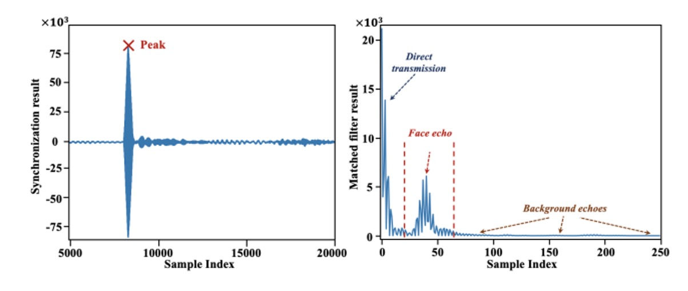
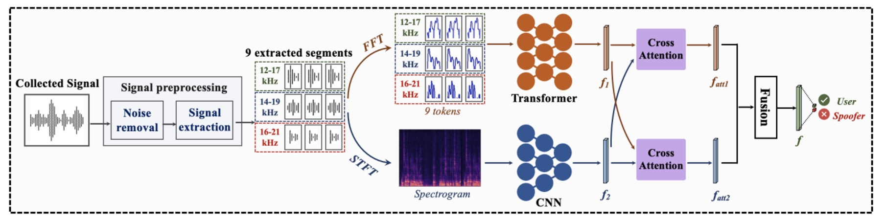
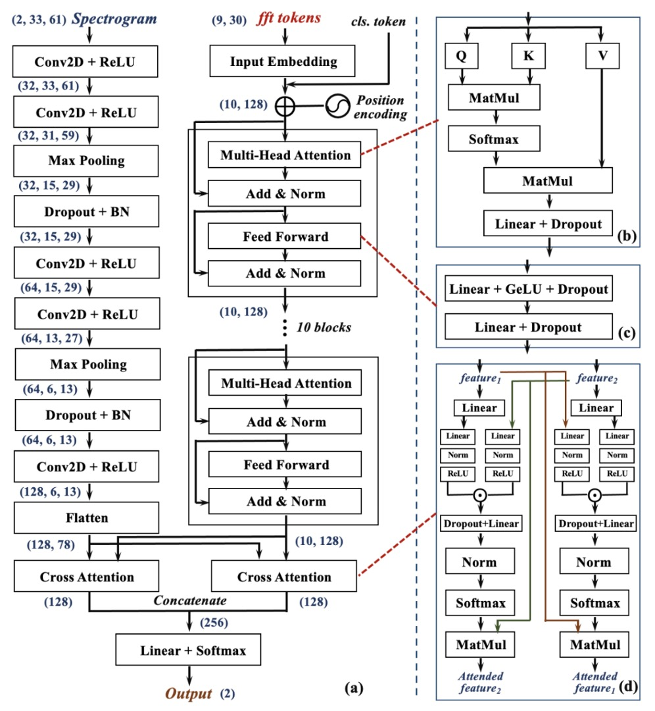
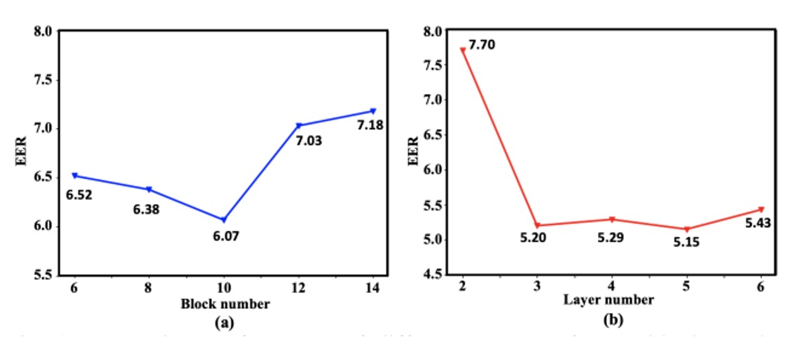
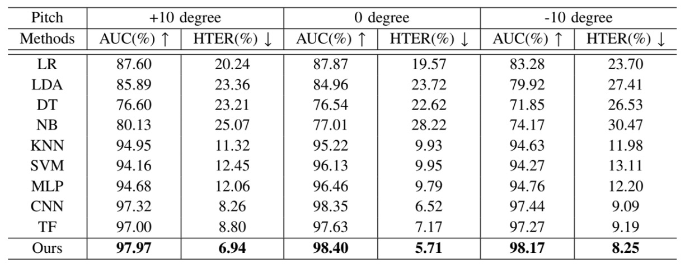
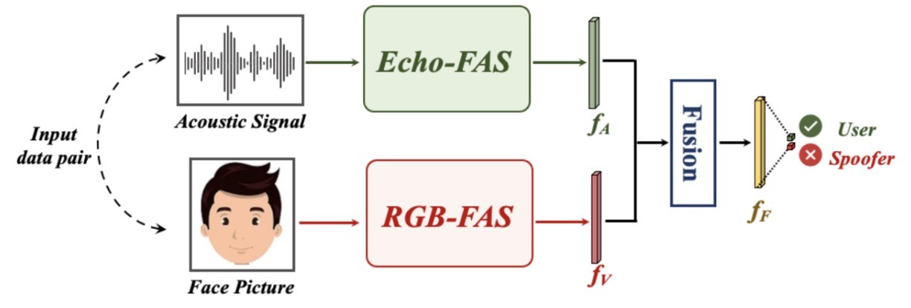
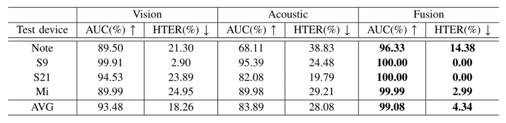

## 仿冒的回音

[**Beyond the Pixel World: A Novel Acoustic-Based Face Anti-Spoofing System for Smartphones**](https://drive.google.com/file/d/1ggyRAQgWdSSS-tVMJvxPE7QwNUXSBLqf/view)

---

聲波技術在 Face Anti-Spoofing（FAS）領域的應用不算很多篇。

大概也就是一年可以找到一兩篇有引用次數比較多的相關工作。

## 定義問題

FAS 的技術演進史，像是一場不斷向深處鑿掘的辨識工程。

我們讀過 LBP 的疊影、HOG 的梯度、CNN 特徵圖上的高頻閃爍，也嘗試從 rPPG 的心跳訊號中找尋生命的韻律。每一次偽造手段的提升，都逼迫我們重新定義「活體」的證據。

但有件事始終沒變：

- **無論我們如何強化特徵、補充模態、混合損失函數，這些方法仍過度依賴「看」。**

看得多、看得細、看得準。

而現實呢？

鏡頭可能沾有指紋，光源可能逆差過曝，使用者的臉也不總是對準演算法所渴望的角度。

此外，幾乎所有基於 RGB 的辨識系統都繞不開幾個經典難題：

- 新手機與舊模型之間的 domain gap；
- 室內光源與戶外陽光間的光譜落差；
- 資料分布與推論條件之間的落地斷裂。

為了解決這些問題，有人轉向硬體強化，像是紅外線、深度模組，甚至毫米波雷達。

但這些方案貴啊！

造價高昂、部署複雜，終究只將辨識門檻從演算法轉嫁至成本與規格，並沒有真正回應通用性的需求。

因此，作者提出了一個不同的看法：

> **如果看不準，那不妨，聽一聽？**

喇叭與麥克風，在智慧型手機中無所不在，不需要額外安裝，也不需技術普及。

而聲音，不只是訊息的載體，它同時也可以成為探測器。我們可以從一段折返的聲波路徑中，辨識出臉部幾何的資訊：

- 一張紙，它的回音是乾澀而輕薄的；
- 一段螢幕重播，它的反射是扭曲與不穩的；

唯有真實的肉身，才能留下密度對應的聲波紋理。

只是，這真的有用嗎？

## 解決問題

在進入系統設計之前，作者先打造了一個全新的聲波資料庫：**Echo-Spoof**。

它跟傳統的 FAS 資料庫完全不同，那些過去資料庫除了影像之外還是影像。而 Echo-Spoof 則收集來自「聲波」的反射訊號。

如果我們預期只需要智慧型手機原生的喇叭與麥克風就能進行防偽，那麼我們肯定要確保這套聲波偵測機制，在真實世界裡依舊有效。

作者為此定下了三大核心需求：

1. **基於聲波（Acoustic-based）**：

   過去的 FAS 資料庫都是收集臉部照片或影片，但 Echo-Spoof 只收集聲波反射訊號。從臉部的弧度、輪廓和材質裡萃取幾何資訊，不用 RGB，也不外洩用戶隱私。

2. **大規模（Large-scale）**：

   這個資料庫來自 30 位志願者（男女各半），總共蒐集超過 25 萬筆聲波訊號片段。只有夠大的規模，才能涵蓋多種真實場景裡不可控的變量。

3. **高多樣性（High-diversity）**：

   真實世界裡，變化來自四面八方：不同手機、不同距離、不同噪音程度、不同仰角等。

   作者將這些條件明確規格化，模擬用戶實際使用手機時常見的情境，像是「人跟手機之間相距 25 到 45 公分」、「環境音量在 40 dB、60 dB、70 dB 之間波動」、或是「臉部俯仰在 -10°、0°、+10°」等。

   這些細節都寫進了資料庫的收集手冊，確保 Echo-Spoof 不只是個理想化的小數據集。

資料蒐集過程如下圖：

<figure style={{"width": "70%"}}>

</figure>

作者透過智慧型手機的耳機揚聲器發出設計好的聲波，並用頂部麥克風錄回反射訊號，如果是真臉，那波形裡蘊藏的就是真實的臉部幾何；如果是紙或螢幕重播，則是另一種扭曲形態。

如此獲得的大量聲波樣本，經過倫理審核（human ethics application）才得以正式蒐集，確保了實驗安全及隱私合規。

### 變因考量

- **Device**：
  作者挑選了四款 Android 智慧型手機（Samsung s9, Samsung s21, Samsung edge note, Xiaomi Redmi7）進行資料蒐集，因為不同手機在揚聲器與麥克風的製程上都有微妙差異，容易帶來額外的雜訊分布，能更好地檢驗模型的跨設備穩定度。

- **Distance**：
  使用者日常使用手機時，臉通常距離螢幕約 25 ～ 45 公分。於是作者分別在 25 cm、35 cm、45 cm 收集聲波，觀察距離對信號雜訊比（SNR）的影響。

- **Ambient Noise**：
  現實生活裡，安靜的辦公室與喧囂的咖啡廳是兩個世界。作者把環境噪音控管在 40 dB（安靜）、60 dB（稍微吵雜）、70 dB（相當吵）這三個檔位，並用噪音偵測 App 監控是否達標。

- **Pitch**：
  即使是手持角度，也可能影響臉部與手機之間的相對位置：-10°、0°、+10° 這幾個俯仰角度都列入考量。因為顏面偵測在現實裡不可能永遠保持垂直，少量角度變化反而更貼近使用者習慣。

經過這樣的精細設計，Echo-Spoof 在「規模」與「多樣化」層面都有相當水準。這讓日後在測試階段，能更有效衡量聲波偵測在不同情境下的穩定度與抗干擾能力。

### 訊號設計

為了使 Echo-FAS 能在日常場景下順利運行，作者提出以下關鍵考量：

1. **提升辨識品質**：
   透過線性調變頻率（FMCW, Frequency-Modulated Continuous Wave）來捕捉臉部各區域的多重回音，藉此萃取臉部幾何資訊。

2. **降低環境干擾**：
   善用較高的頻率範圍（12–21 kHz），與常見噪音頻率（小於 8 kHz）區隔，並加入 pilot tone 做同步，排除設備間的時序差。

3. **使用者感受**：
   盡量避免刺耳的聲響，同時維持足夠能量做偵測。作者用 Hamming window 函數來抑制不必要的頻譜成分，再經由適度控制音量，將「被人耳聽到」的機率降至最低。

最終的設計如下圖所示：

<figure style={{"width": "70%"}}>

</figure>

整段訊號全⻑約 0.8 秒，取樣率 44.1 kHz（大多數 Android 裝置支援的典型值）。

為了方便描述，作者在訊號中加入一個 **11.025 kHz 的 pilot**，再將之與九組 chirp（線性掃頻）組合成最終輸出。整條訊號頻率涵蓋 12–21 kHz，其中又細分成三段掃頻範圍（12–17 kHz、14–19 kHz、16–21 kHz），並各自重複三次。

每個 chirp 的實際樣本數為 60，兩個 chirp 之間間隔 3000 個樣本，藉此避免時域重疊。

### 訊號分析

Echo-FAS 採用了 **FMCW**（Frequency-Modulated Continuous Wave） 技術，這是一種常見於雷達的掃頻方法，原本用來進行精準的距離量測。在這裡，它被轉化為辨識臉部幾何的聲學掃描器。

原理並不難理解：人臉的不同部位（如鼻樑、嘴唇、額頭）與手機揚聲器之間的距離各異，因此聲波在遇到這些結構後，會以不同的時間延遲與相位變化反射回來。這些微妙的差異，若能在特定頻寬內被精確地解析，就能形成一組足以辨識的臉部輪廓特徵。

為了說明這項能力的理論基礎，作者引用了 FMCW 架構下的解析度計算公式：

$$
R_d
= \frac{v \cdot \delta T}{2}
= \frac{v \cdot \delta f}{2k}
= \frac{v}{2 \cdot BW}
= \frac{343 \text{m/s}}{2 \times 5000 \text{Hz}}
= 3.43 \text{cm}
$$

其中，$v$ 是音速（約 343 m/s），$BW$ 為掃頻訊號的頻寬，$k$ 則代表頻率變化的斜率。

這個公式告訴我們：只要臉部任兩點的深度差距超過 3.43 公分，就能在回音中留下可分辨的時間延遲。而這樣的解析度，已經足夠區分鼻尖與下巴、額頭與臉頰等主要幾何結構。

基於這樣的辨識需求，作者選定了 12 到 21 kHz 的頻率範圍。

這段頻率帶具有多重優勢：它高於大多數環境噪音的主頻（通常落在 8 kHz 以下），同時又接近成人可聽頻率的上限（約 15 ～ 17 kHz），能有效降低用戶感知度。

不過，過高的頻率也會遇上手機揚聲器輸出不足的限制，特別是在超過 21 kHz 時訊號會明顯衰減，反而削弱了後續特徵提取的效果。因此，這個區間是在「可聽性、抗雜訊性、硬體能力」三者之間取得的平衡點。

為了確保訊號在錄音中能被精準識別，整段聲波的開頭加入了一段 11.025 kHz 的 pilot tone，這是一種持續穩定的純音波，在頻譜上與其他 chirp 訊號和環境噪音有清楚區隔。

透過與錄音內容的交叉相關運算，模型便能準確定位訊號起始點，並自動校正不同手機裝置間的時序延遲，這在真實部署中是一個關鍵的穩定因子。

而在掃頻訊號的設計上，作者將每個 chirp 的長度設定為 60 個取樣點（約 1.4 毫秒），並在其間加入 3000 個取樣點的間隔。

這個配置同時考慮了物理和工程上的的限制：

若 chirp 太長，雖能提高訊雜比，但也可能與臉部回音產生時間重疊；以距離 30 公分為例，聲波來回需時約 1.7 毫秒，換算為取樣點數則為 77，若 chirp 長度超過此值，回音與直傳訊號將難以區分。

反過來說，若兩個 chirp 的間隔太短，前一個 chirp 從遠端物體（如牆壁）反射的回音就可能落入下一個 chirp 的臉部回音範圍，形成混疊與干擾。

實驗結果顯示，3000 點（約 68 毫秒）的間隔可有效避免這些問題，同時又不會讓整體偵測時間拉得過長，全段訊號在 0.8 秒內結束，仍屬於使用者可接受的感知閾值。

當然，即便頻率設計上已盡可能避開人耳可感知區間，但部分訊號仍落在 17 kHz 以下，對特定使用者可能產生聽覺干擾。

為此，作者在訊號設計上額外引入 Hamming window，讓 chirp 的起始與結束具備柔順的包絡形狀，進一步降低聲音尖銳度。此外，他們也針對各型號手機進行音量優化測試，確保輸出音量在「不失真但足夠響亮」之間取得平衡。

根據調查，超過 90% 的參與者表示「幾乎未感受到噪音」，為這項設計在實務應用中的可行性提供了良好佐證。

### 訊號處理

如果說設計一段聲音是一種語言，那訊號處理就是學會辨認其中的語意。

在 Echo-FAS 中，錄製下來的聲音不只是一段回音，而是一種混合物：它同時包含來自喇叭的**直傳訊號**、來自臉部的**主體回音**，以及環境中其他物體的**背景反射**。

訊號處理的目的，是從這團聲波裡把真正代表人臉幾何輪廓抽取出來，成為後續辨識模型的輸入。

整個處理流程分成三個階段：

- **訊號切分（segmentation）**
- **直傳訊號消除（direct transmission removal）**
- **目標回音萃取（target reflection extraction）**

如下圖所示：

<figure style={{"width": "90%"}}>

</figure>

首先是**訊號切分**。

錄音起始點並不穩定，喇叭與麥克風在手機上無法完全同步，因此作者設計了一段 11.025 kHz 的 pilot tone 作為同步標記。透過與錄音內容進行 cross-correlation，系統能精準找出訊號真正的起點。

確定起點後，整段錄音會被切分為九段，對應於前述所設計的九組 chirp。每一段中都混合了直傳訊號與各式回音，這是粗略定位的第一步。

接著是**直傳訊號的消除**。

這段訊號是由喇叭發出、未經反射、直接被麥克風收到的部分，因為傳遞距離最短、能量衰減極少，往往主導整段錄音中的最高峰。為了將其剔除，作者使用與原始 chirp 的匹配濾波，辨認出此段訊號的起始位置，並將這段前後的樣本直接捨去，只保留其後可能包含臉部或背景回音的部分。

最後，進入關鍵的**臉部回音萃取**階段。

在移除直傳訊號後，剩下的訊號仍可能包含來自牆壁、桌面等遠距物體的回音，但它們出現得較晚，且相對分散。而臉部回音通常距離最短，會在各段訊號中「最早、也最集中」地出現，如下圖所示：

<figure style={{"width": "80%"}}>

</figure>

因此作者提出了一套**適應式定位演算法**：對每段錄音進行 matched filter 運算，找出能量最高的波峰，再將九段的峰值位置進行平均，找出在時間上「最一致、最有可能」代表臉部回音的位置。演算法會迭代尋找標準差最小的平均點，確保定位穩定，並將每段在該點後截取 60 個樣本，作為最終輸出的臉部聲學特徵。

這樣一來，每次檢測都會從原始錄音中萃取出九段、各為 60 點的聲波區塊，作為後續模型判斷真偽的依據。過程中不需額外硬體、不需多通道設計，只靠一顆麥克風與一段規劃良好的聲音，就能完成了一次聲音結構的捕捉。

### 模型架構

在解決聲音的問題後，接下來就是我們熟悉的模型架構了。

下圖是這整段辨識流程，共分為三個階段：

- **前處理（Preprocessing）**
- **雙分支特徵提取（Two-Branch Feature Extraction）**
- **交叉融合決策（Cross-Attention Fusion）**

對我們的讀者來說，這一段應該相對簡單，我們依序來看一下。

### 前處理

輸入的是一段來自麥克風錄製的原始聲音訊號。

透過剛才介紹的訊號處理步驟，系統會先進行同步、直傳訊號移除，並從整段錄音中擷取出九段回音片段。

### 雙分支架構

<figure style={{"width": "70%"}}>

</figure>

這九段回波，會分別送入兩條平行而互補的神經網路分支中，進行兩種頻率特徵的解讀：

- **Global Frequency Branch（右側，Transformer 分支）**：

  對每段訊號進行 Fast Fourier Transform（FFT），轉為頻域表示，作為九個 token 輸入 Transformer 結構。

  這個分支專注於捕捉訊號在整體頻率上的分佈關係與長距離依賴特徵。Transformer 能從這些頻譜中學習出與臉部結構相關的「頻率習慣」，建構出一組全域視角的特徵圖。

- **Local Frequency Branch（左側，CNN 分支）**：

  另一邊則將每段訊號經過 Short-Time Fourier Transform（STFT），轉換為時間–頻率圖（spectrogram）。

  這些圖像保留了聲波在時間中變頻的過程，也就是掃描臉部時所捕捉到的動態特徵。這些圖像隨後被送入 CNN 網路，擅長擷取局部區域中的模式與細節變化，學習從聲波反射圖中提取「幾何細節紋理」。

---

這兩條路徑，分別擁有不同的建模優勢：Transformer 聚焦整體頻譜結構，CNN 聚焦局部響應紋理。在 Echo-FAS 中，它們被設計為互補，不是對立。

兩條分支各自輸出一組特徵表示：全域特徵 $f_1$，局部特徵 $f_2$。

為了讓這兩個視角真正對齊，Echo-FAS 設計了**雙向交叉注意力模組（Dual Cross-Attention Module）**。如上圖 (d) 所示，Cross-Attention 模組讓 $f_1$ 去關注 $f_2$，也讓 $f_2$ 去關注 $f_1$，兩者彼此互視、互融，最終將兩組特徵拼接後交由分類層進行最終判斷。

### 深度選擇

<figure style={{"width": "70%"}}>

</figure>

為了確認這套架構設計的合理性，作者進行了一系列消融實驗。

如上圖所示，隨著 Transformer block 數（右圖）與 CNN 層數（左圖）增加，系統的辨識效果逐漸上升，直到某個深度後達到性能平衡。最終，作者選擇以 10 層 Transformer 與 5 層 CNN 作為雙分支的 backbone，兼顧效能與資源消耗。

## 討論

### 跨身份辨識能力

<figure style={{"width": "70%"}}>

</figure>

在真實場景中，FAS 系統無法預先認識所有使用者。它必須在面對「未曾看過的臉」時，也能做出正確判斷。因此，第一組實驗聚焦於最核心的泛化挑戰：**跨身份活體偵測**。

在上表中，作者將 Echo-FAS 訓練於 25 位使用者，並測試於另外 5 位從未出現在訓練資料中的受試者。

結果顯示，Echo-FAS 在這樣的設定下仍達成 **98.79% AUC 與 95.18% ACC**，表現穩定且出色。不只如此，表中同時列出其他分類模型的結果，包括 MLP、CNN 與 Transformer 等常見架構，它們雖然也能達到一定辨識水準，但整體而言仍明顯落後於 Echo-FAS。

這不僅再次驗證了聲波訊號本身具有豐富的可區辨性，也強化了 Echo-FAS 架構在「訊號建模」與「資訊對齊」上的優勢。

簡單來說，Echo-FAS 在沒有看過你的臉的情況下，**依然能聽出你是真的**。

這是對聲學活體辨識能力的一次高效展示，也為後續的跨裝置與跨攻擊測試奠定了泛化性能的信心基礎。

### 使用者習慣下的穩定性

<figure style={{"width": "85%"}}>

</figure>

不是所有人都會把手機拿得端端正正。

有人低頭滑手機，有人側臉解鎖，有人習慣將手機稍微仰角操作。這些日常習慣，在過去的 FAS 系統中，往往被視為「非理想姿態」，但在真實世界裡，它們卻是預設的常態。

為了驗證 Echo-FAS 在這些操作落差中的穩定性，作者設計了一項「使用者仰角容忍度測試」：

- **將臉部與手機之間的角度（pitch）分為 -10°、0°、+10° 三種設定，分別對應於仰拍、正對與俯拍等三種最常見的使用情境，並針對每種角度進行模型測試。**

結果顯示，Echo-FAS 不論在任一角度下，皆能維持穩定且高準確的辨識效能，並在所有 baseline 模型中表現最佳。這證明 Echo-FAS 並不仰賴固定拍攝姿態，其聲波訊號的幾何特徵捕捉能力，足以涵蓋真實使用過程中的姿勢變異。

這是一項使用者友善的保證：**你不需要調整角度來配合模型，模型會調整自己來理解你。**

Echo-FAS 所強調的「聲波幾何」，不只是技術架構的語言，也是在真實互動情境中追求穩定性的實踐方式。這讓它不只是能在 benchmark 上得分，更能走進使用者的日常之中。

### 多模態融合

在許多真實應用場景中，我們往往無法預期使用者會用哪一支手機、在哪種光源下完成身分辨識。這也讓以 RGB 為主的 FAS 模型在部署時容易因設備異質性產生 domain gap，導致效能顯著下滑。

Echo-FAS 的聲學模態，則提供了一種相對穩定的訊號來源，因為它讀的是臉的結構，而非影像的外觀，受光線與影像編碼差異的影響更小。

為了驗證聲音與影像的互補性，作者設計了一套多模態融合實驗，如下圖：

<figure style={{"width": "85%"}}>

</figure>

每一筆樣本由兩種訊號構成：一段聲波（Echo-FAS 提供的幾何特徵）與一張臉部圖像（RGB 模態的外觀特徵）。

聲音訊號交由 Echo-FAS backbone 提取特徵 $f_A$，影像則交由經 ImageNet 預訓練的 ResNet18 提取視覺特徵 $f_V$，兩者經過融合模組後共同做出判斷。

實驗共使用四台手機（Samsung S9、S21、Edge Note 以及 Redmi7）進行資料收集，每次訓練使用三台裝置，將剩下一台作為測試場域，以模擬實際部署時遇到的跨裝置泛化挑戰。

實驗結果如下表：

<figure style={{"width": "85%"}}>

</figure>

融合後的模型在所有測試情境中皆顯著優於僅使用 RGB 的模型，證明聲音模態成功補足了 RGB 模型的不足。

在攝影設備變動、影像品質不穩時，Echo-FAS 提供的是一種結構性訊號，能將幾何特徵拉回決策邏輯之中，降低模型對外觀細節的過度依賴。

## 結論

Echo-FAS 提供了一種極具實用性的 FAS 解法。

它不需要額外硬體，訊號輕巧、推論快速，能在日常裝置中即插即用，並展現出強韌的辨識穩定性。它的優勢在於使用者無需改變什麼：不必學習新習慣，不必依賴特殊角度與光源，也不必忍受冗長延遲。

基本上，只要手機還有一顆麥克風，它就能運作。

然而，這樣的系統還是有其限制。

首先，它無法應對立體假臉（3D mask）的複雜材質與深度層次，那是平面聲波所難以解析的維度。其次，它仍難以完全擺脫硬體間的頻率響應差異，裝置之間的聲學指紋仍會在模型泛化上留下微妙的痕跡。即便已做過濾與適應性設計，聲音仍會受限於它所依附的機器。

因此，Echo-FAS 的定位不是取代現有方法的革新，而是提供一種低依賴、高補償、輕量化的辨識模態。在環境不可控、影像不可信的情境中，它給出了另一種可能：

仿冒的線索不是只有來自影像，也可以是一段回音。
