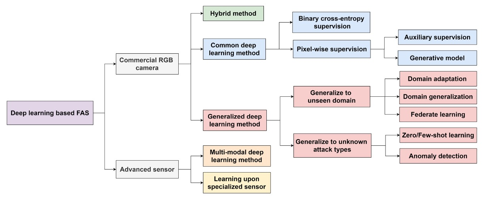
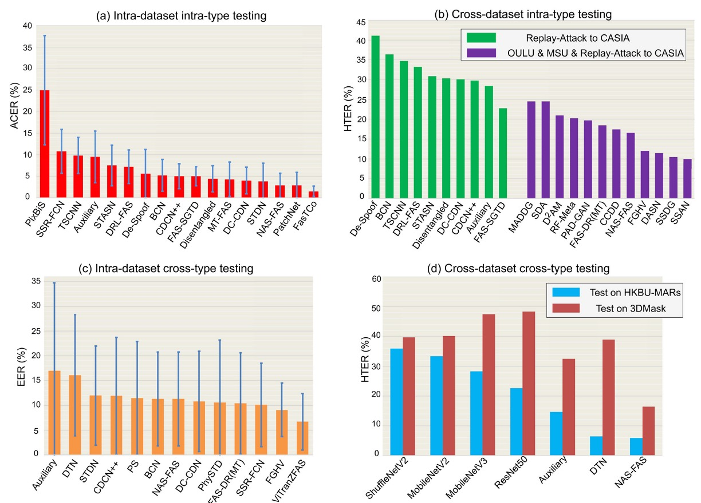
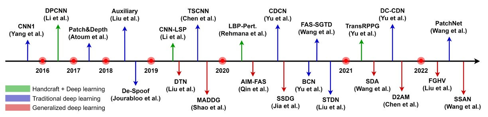
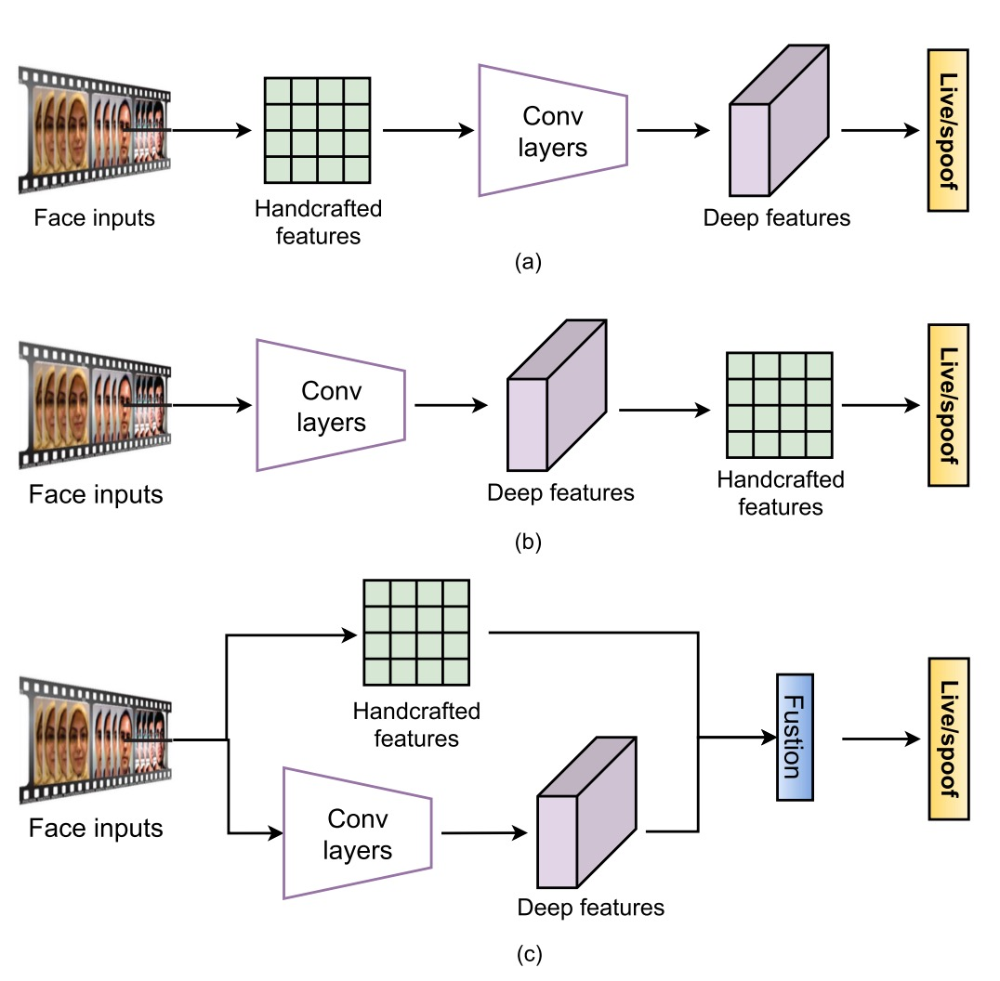
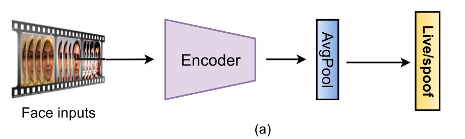
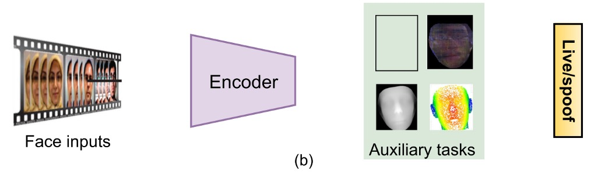
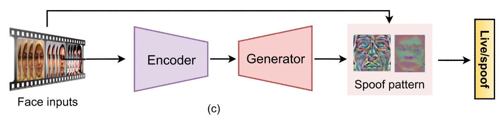
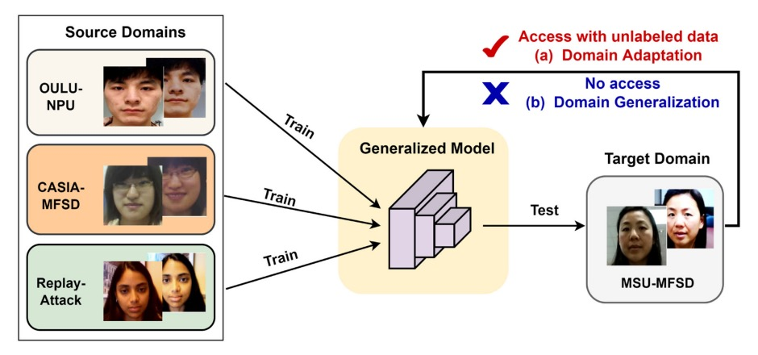

## 攻與防的編年史

[**Deep Learning for Face Anti-Spoofing: A Survey**](https://ieeexplore.ieee.org/abstract/document/9925105)

---

看了過去幾篇論文之後，我們也大概知道了 FAS 的研究背景與發展脈絡。

現在，我們直接來回顧一下過去十幾年內的各種方法。

:::tip
這篇綜述性的論文有大約兩百篇的參考文獻，有興趣的讀者可以去翻出來讀一讀。
:::

## FAS 架構

所有攻擊的第一步，都是欺騙感測器。

因此，我們大致可將攻擊分為兩類：

- **數位攻擊（Digital Manipulation）**：如深度偽造（deepfake）或圖像處理，直接在虛擬領域進行改造。
- **實體展示攻擊（Physical Presentation Attacks）**：也是本篇重點，意圖在真實世界中透過物理媒介騙過攝影鏡頭。

常見的攻擊型態和 FAS 系統的建構方式如下圖所示：

<figure style={{"width": "90%"}}>

</figure>

從實體展示攻擊中，進一步根據意圖區分為：

- **模仿（Impersonation）**：模仿他人，例如持照片或配戴 3D 面具，讓系統認為你是某個特定人。
- **遮蔽（Obfuscation）**：遮掩自己，例如化妝、墨鏡、假髮，讓系統無法辨識你是誰。

根據幾何結構，又可區分為：

- **2D 攻擊**：例如平面照片、螢幕重播影片、挖洞照片等。
- **3D 攻擊**：包含各種材質製成的立體面具，如紙質、石膏、矽膠或樹脂。這類攻擊往往更擬真，也更具挑戰性。

有趣的是，除了整臉的「正攻」，也出現了不少「側擊」的**局部攻擊**，例如眼部戴上搞笑眼鏡、臉頰貼紙等，只針對局部區域進行欺騙，增添了防禦難度。

隨著深度學習方法的發展，數據集的規模與複雜度也逐步提升。

在本論文中歸納了三大趨勢：

1. **大規模化**：例如 CelebA-Spoof、HiFiMask 等，影像與影片數量均達數十萬等級，具備訓練資料飽和度。
2. **多樣性強化**：新的數據集不再只包含常見的列印與重播攻擊，開始引入細分類型的 3D 攻擊、變化光照、跨場景錄製等情境，例如 SiW-M 中涵蓋多達 13 種攻擊類型。
3. **感測器升級**：從單一 RGB 攝影機，拓展至深度（Depth）、近紅外（NIR）、熱感（Thermal）、短波紅外（SWIR）等模態，甚至使用光場相機進行紀錄。

### 深度學習方法總覽

<figure style={{"width": "90%"}}>
  
</figure>

上圖中展示的是一張 **FAS 方法分類樹狀結構圖**，從感測器出發，逐層延伸至不同模型設計與泛化策略。

從感測器層級的劃分開始：

- **Commercial RGB Camera**：目前最常見的設備類型，多數手機或筆電皆屬此類。針對此類裝置開發的 FAS 方法，強調在可見光單一模態下進行偽造偵測。
- **Advanced Sensor**：例如 NIR、Depth、Thermal、SWIR、光場相機等，提供更豐富的影像特徵。應用於這類裝置的模型，能結合跨模態資訊提升辨識力，但也提高了開發與佈署成本。

---

由於多數情境下，都只有 RGB 攝影機可用，因此我們將重點放在這個模態下的 FAS 方法。

- **Common Deep Learning Method**

  使用最傳統的二元分類監督學習（如 Binary Cross-Entropy），或進一步進行像素級 supervision（Pixel-wise Supervision），強調模型對局部 spoof cue 的學習能力。

  常見輔助設計如：

  - **Auxiliary Supervision**：引入中間特徵監督或深層特徵輔助判斷。
  - **Generative Model**：採用 GAN 或重建方式提升對異常樣本的辨識力。

- **Hybrid Method**

  將不同 supervision 結構進行融合（例如 BCE + reconstruction loss），同時兼顧分類與區域重建能力，提升模型對偽造線索的捕捉。

- **Generalized Deep Learning Method**

  此路線的核心目標為「**跨域泛化（Domain Generalization）**」，不僅在訓練場景中表現良好，更能應對未知資料分布。
  主要技術分支如下：

  - **Domain Adaptation**：有少量目標資料時，對模型進行微調。
  - **Domain Generalization**：完全無目標資料，仍需保持泛化能力。
  - **Federated Learning**：將多端設備學習整合，提升隱私下的泛化效能。

:::tip
這個年代還不流行的 Vision Language Model（VLM）方法，相關方法我們之後再談。
:::

### 評估指標

FAS 任務的評估，聚焦於兩個核心面向：

- **FAR（False Acceptance Rate）**：誤將攻擊樣本判為真實使用者的比率。
- **FRR（False Rejection Rate）**：誤將真實使用者判為攻擊樣本的比率。

為兼顧這兩者的平衡表現，常見綜合指標包含：

- **HTER（Half Total Error Rate）**：FAR 與 FRR 的平均值

  $$
  \text{HTER} = \frac{\text{FAR} + \text{FRR}}{2}
  $$

- **EER（Equal Error Rate）**：當 FAR 與 FRR 相等時的錯誤率（即 HTER 在平衡點的值），常作為模型性能的綜合評估指標。
- **AUC（Area Under Curve）**：計算 ROC 曲線下的面積，反映模型將 bonafide 與 spoof 攻擊區分開的能力，越接近 1 越好。

此外，依據 **ISO/IEC 30107-3** 標準，也逐漸引入更細化的三項錯誤指標：

- **APCER（Attack Presentation Classification Error Rate）**：攻擊樣本被誤判為 bonafide 的比率。
- **BPCER（Bonafide Presentation Classification Error Rate）**：真實樣本被誤判為攻擊的比率。
- **ACER（Average Classification Error Rate）**：APCER 與 BPCER 的平均值

  $$
  \text{ACER} = \frac{\text{APCER} + \text{BPCER}}{2}
  $$

這些指標提供了模型在不同誤分類情境下的具體量化依據，特別適用於真實部署環境中，針對誤判風險進行細緻評估。

:::tip
HTER 與 ACER 是一樣的東西，只是命名的機構不同而已。
:::

### 評估協議

<figure style={{"width": "90%"}}>
  
</figure>
<figcaption>四種主流測試協議下，深度學習 FAS 方法的表現比較。</figcaption>

---

不同的協議設定，反映著模型在面對**實際部署場景時的挑戰程度**。我們可將這些設定視為模型從「熟悉」邁向「未知」的成長階梯，依序可分為四種常見測試協議：

1. **Intra-Dataset Intra-Type**

   同一數據集、同類型攻擊。此為最基礎的評估方式，模型於訓練與測試階段皆使用來自相同分布的資料。

   常見於如 OULU-NPU、SiW 等數據集預設子協議中。該情境下 domain gap 極小，因此為深度模型最容易獲得高準確率的設定。

   如上圖 (a) 所示，多數方法在 OULU-NPU 的 Protocol-4 測試中表現出色，ACER 通常可低於 5%。

   ***

2. **Cross-Dataset Intra-Type**

   訓練與測試資料來自**不同數據集**，但攻擊類型相同，主要測試模型的領域泛化能力。

   模擬實務上「開發環境」與「真實應用場景」不一致的挑戰。上圖 (b) 呈現了在 Replay-Attack 訓練、CASIA-MFSD 測試的結果，僅訓練單一資料集時（綠色柱）HTER 普遍偏高。若結合多個資料集（紫色柱）進行訓練，透過跨域學習方法（如 SSDG, SSAN）可明顯改善泛化表現。

   ***

3. **Intra-Dataset Cross-Type**

   採用 leave-one-type-out 設定，即某一攻擊類型**只在測試階段出現**，訓練資料中不包含。

   此協議專為驗證模型面對「未知攻擊類型」時的應變能力。如上圖 (c) 展示 SiW-M 的測試結果，其中包含多達 13 類攻擊類型，各類型間的難度落差大，導致模型平均 EER 雖不高（~10%），但標準差較大。

   透過預訓練與轉移學習，如 ViTranZFAS 即可將 EER 降至 6.7%。

   ***

4. **Cross-Dataset Cross-Type**

   為目前最具挑戰的設定，**同時更換資料來源與攻擊類型**。

   訓練時僅使用 OULU-NPU 與 SiW（主要為 2D 攻擊），測試時則使用 HKBU-MARs 或 CASIA-SURF 3DMask 等 3D 面具資料集。上圖 (d) 顯示，目前方法如 NAS-FAS、DTN 僅能偵測某些低擬真 3D 面具，對高擬真材質仍難以區分。

   此協議最貼近現實部署中會遇到的未知場景與複合攻擊挑戰，是未來研究的重要方向。

---

每一種協議的設計，都是對模型能力的逐步拉升：
從最理想的「封閉訓練測試」到真實世界的「開放未知情境」，FAS 系統該如何成長、學會辨別從未見過的攻擊，是這場防偽對抗的核心課題。

## 基於 RGB 的 FAS

上圖整理了基於 RGB 相機的 FAS 技術演進脈絡。

從早期倚賴手工特徵的時代開始，一路走向強調多模態融合與泛化能力的深度模型設計。

由於 RGB 相機幾乎是所有裝置的標配，因此針對這類裝置所開發的防偽系統，也就成了 FAS 技術落地的主戰場。

## 混合式方法

<figure style={{"width": "70%"}}>

</figure>

雖然深度學習已經在分類與偵測任務中橫掃千軍，但 FAS 任務的實際情況比較現實：

> **資料量普遍不大、樣本分布還經常失衡，導致模型訓練容易陷入過擬合。**

這時候，一些研究便轉向結合傳統手工特徵與深度模型，希望透過這種「補短板」的方式，彌補模型對非紋理線索的感知盲點，像是光影變化、心跳節奏、動作異常等等。

這類方法大致可以分成三種套路。

第一種是「**特徵前融合**」，也就是先用傳統方法抽取靜態或動態特徵，再送進深度模型進行分類。常見的作法包括用 multi-scale LBP 或 Weber descriptors 抓出細節紋理，或是結合 LBP 與 CNN 來保留邊緣與強度等低階資訊。

如果目標是抓動態線索，那就會看到 dense optical flow 用來分析動作軌跡、rPPG 被轉成時序圖餵給 Vision Transformer，甚至有研究直接抓亮度變化的直方圖，對重播攻擊進行反制。

> **這類方法的核心邏輯是：模型你負責學，我先幫你把該看的線索準備好。**

---

第二種是「**特徵後融合**」，這邊的流程剛好相反：先讓深度模型抽特徵，接著再加上一些手工設計的描述子作為補強。像是有人用 PCA 先從 VGG-face 清理掉多餘資訊，也有人直接從卷積層擷取彩色 LBP，試圖補強統計訊號，還有在時序特徵上疊加 LBP-TOP 或 optical flow，增加時間動態的解析度。

> **這類方法最大的麻煩在於，CNN 特徵本身會隨著層數產生語義變化，怎麼選擇合適的融合層級，常常需要靠經驗＋實驗，沒有標準答案。**

---

第三種則是「**雙流融合**」，也就是讓手工特徵與深度模型各自跑各自的路，最後在特徵層或分數層整合起來。

這裡的範例就更多了：有直接把 LBP 與 VGG16 的預測分數加在一起的，也有用 HOG、LBP 這類特徵圖來引導 CNN 的底層學習方向，甚至還有人把 1D CNN 擷取的亮度與模糊線索融合起來，專門對付重播類型的攻擊。

> **這類方法就是把不同的模型放在一起，讓它們各自發揮專長，最後再把結果綜合起來。**

---

整體來說，Hybrid 方法最大的好處是：可以補上純深度模型不擅長的部分，尤其是那些微弱但有意義的非紋理特徵，像是臉部微光反射、心跳週期、鏡頭動態模糊等等。在資料量不夠、場景差異又大的情況下，這種方式確實能提供額外的穩定性與彈性。

不過它也有明顯限制，像是手工特徵不可學習、需要專家調參，泛化能力有限；再加上手工與深度特徵之間的語義不一致，融合時一不小心就會出現資訊打架、模型迷路的情況。

## 傳統深度學習方法

Hybrid 方法之所以存在，是因為當時深度模型還在發育期，資料也不夠多，只好用手工特徵先撐場面。

但隨著 CNN 架構愈來愈成熟、大型防偽資料集陸續釋出，FAS 社群也開始擁抱「資料給多一點、網路堆厚一點、監督用狠一點」的全端學習路線。

這波方法強調從影像中**直接學出活體與偽造之間的差異特徵**，捨棄所有不可學的外掛，從 input 到 output 一條龍學習，成為目前商用 RGB FAS 的主流路線。

雖然形式五花八門，但這類方法大致可分成兩類：

- 是把 FAS 當成二分類問題處理。
- 透過像素級監督加上生成式設計，讓模型學會更細膩的 spoof 模式。

### 二分類監督

<figure style={{"width": "85%"}}>
  
</figure>

最直觀的做法，就是把 FAS 當成 Bonafide vs Spoof 的二分類問題，採用 BCE Loss 作為損失函數，從輸入影像直接預測標籤。

早期常見的網路如 8-layer CNN、VGG16、ResNet18，後來也出現了 MobileNet 為基礎的輕量化架構，甚至有研究結合 CNN 與 LSTM，讓模型可以看「多幀」的細微動作，比如眨眼、頭微動，試圖把時間訊號也納進判斷依據。

為了讓模型更不容易被誤導，損失函數也持續進化：

- **改成多分類**：有人加入攻擊類型標籤（multi-class CE），讓模型學會區分重播、列印、3D 面具等不同 spoof 手法，把二分類問題轉成多分類問題。
- **對比學習**：也有人使用 Triplet 或 Contrastive Loss，讓類內特徵緊密、類間分離，強化表示能力

甚至連 Focal Loss 和非對稱 Softmax 這些設計也被搬進來，解決樣本不平衡與 spoof 分布偏態的問題。

這種設計的好處在於實作容易、收斂快，但也不是沒有地雷。最大的風險是：

> **模型太容易學到一些不該學的東西**。

像是螢幕邊框、畫面黑邊或光線異常等「提示」，雖然短期內看起來正確率很高，實際上卻是把資料集記熟了，泛化效果堪憂，稍有不慎就變成一堆電子垃圾。

### 像素級監督

為了解決模型太愛偷看提示這件事，部分研究開始導入像素級的監督訊號，讓模型更專注於臉部本身的物理與材質特徵，而不是背景或設備產生的雜訊。

---

- **(a) 輔助任務監督（Auxiliary Task Supervision）**

    

    <figure style={{"width": "85%"}}>
    
    </figure>
    

  這類方法會搭配一或多個輔助標籤，舉幾個例子，例如：

  - pseudo depth map 用來區分平面攻擊與真實臉部
  - binary mask 表示 spoof 區域範圍，或是更進階的 ternary map、rPPG、光反射圖等

  讓模型同時學會辨識與解釋。（輸出的圖就可以作為解釋結果）

  像 DepthNet、CDCN 是最早用深度圖當監督的架構；FAS-SGTD 還加入了短期與長期的動作估計，試圖建立一種「你假裝得再像，也會露出破綻」的節奏感。

  遮罩類方法則由 George & Marcel 開始推動，後來有研究加上 attention 模組，解決模型注意力偏移的問題，也有人引入 ternary mask，把背景訊號排除，讓模型更聚焦在關鍵區域。

  這類方法的優點很明顯：

  > **可解釋性強、有空間語意、支援多任務學習，但同時也很依賴資料品質。**

  大多數 pixel label 都是用外部模型或人工建構，品質一差反而會變成誤導。

---

- **(b) 生成式監督（Generative Supervision）**

    

    <figure style={{"width": "85%"}}>
    
    </figure>
    

  除了直接貼標，還有一派研究選擇從「讓模型自己發現異常」的角度出發。

  這類方法多半採用 autoencoder 或 encoder-decoder 結構，讓模型嘗試重建 bonafide 影像，再透過重建誤差判斷 spoof 程度。

  也有研究定義 spoof 是一種「添加了噪聲的輸入」，試圖從 noise estimation 中挖出破綻。更進一步的像是 meta-teacher 概念，讓教師模型自動產生像素級 supervision，學生模型負責學 spoof 特徵，搞得像一套內建 QA 系統。

  這些方法的好處是：

  > **視覺化強、具解釋力，也特別適合資料驅動的泛化學習。**

  但壞處也不小：訓練容易不穩、收斂慢，有時還會學到感測器特有的噪聲，反而增加過擬合風險。

  :::tip
  例如模型學到 iphone 的成像特性，然後把其他品牌的手機上傳的影像全部判斷為 spoof。
  :::

---

從這一波傳統深度學習方法可以看出，FAS 社群不再滿足於單純的分類準確率，而是開始關注模型的可解釋性、泛化能力與場景適應性。

## 泛化導向的深度學習方法

如果說傳統深度學習方法的挑戰是資料不夠、模型太信任錯誤提示，那麼泛化導向的挑戰就更現實：

> **模型只在它「看過」的場景下表現良好，但一換相機、一換光源，甚至只換個人臉，它就瞬間崩潰。**

這種「訓練很會、實戰不靈」的問題，在 FAS 領域尤其嚴重。

:::tip
之前我們在辦公室測得很準，結果拿去部署到超商門口，模型直接去世。

這種情況在門禁、支付、遠端驗證等應用中顯然無法接受，因此愈來愈多研究開始關注 FAS 模型的「**泛化能力**」。
:::

泛化挑戰大致可以拆成兩種：

- 一種是來自環境的變異（unseen domains），例如光照、感測器、背景雜訊等；
- 另一種則來自攻擊類型的未知性（unknown attacks），例如你根本沒看過的 3D 面具、變形遮蔽物。

這兩種問題本質不同，因此處理方式也不一樣，以下我們分別來看看：

### 面對未知環境

<figure style={{"width": "85%"}}>
  
</figure>

當資料分布因環境變異而產生偏移，原本訓練得再好的模型也無法保證穩定輸出。

這類場景下，泛化策略主要分為兩種路線：

- **Domain Adaptation**
- **Domain Generalization**

這兩者的差別在於「你有沒有辦法取得目標環境的資料」。

---

- **Domain Adaptation：我知道你會去哪，就幫你調整一下**

  這類方法假設你已經知道模型將被部署在哪個環境中，甚至可能手上有一些（不管有沒有標註的）目標資料。既然知道目的地，自然可以提前校正方向。

  有些方法會進行無監督對齊，像是 Li 等人用 MMD（最大平均差異）最小化 source 和 target 的特徵分布差異，或是用 adversarial learning 讓模型難以分辨來源 domain，藉此逼它學出通用特徵。

  半監督方法則進一步假設有少量 target domain 的樣本（例如每類各 3 筆），就能顯著提升模型表現。但這招也有代價：如果你只有 bonafide 沒有 spoof 樣本，那模型可能就會偏心了。

  進階一點的設計，像是 multi-layer MMD、domain-specific normalization，或是知識蒸餾，都試圖在網路架構本身做調整。某些研究還進行 filter pruning，邊遷移邊瘦身，一舉兩得。

  > **缺點也很明顯：你在現實場景中根本不知道 spoof 樣本會是什麼樣子，難以取得有效的資料。**

  ***

- **Domain Generalization：我不知道你去哪，但我希望你去哪都行**

  相對地，Domain Generalization 的假設比較硬核：完全沒有 target domain 的資料，那就只能靠多個 source domains 訓練出一個能「應對所有未來」的模型。這聽起來像 AI 裡的冒險者訓練營，也難怪成為近年來研究熱點。

  方法大致可以歸為幾類：最基本的是 adversarial learning，設計 domain discriminator 強迫特徵不攜帶來源資訊；也有透過 feature disentanglement，把 identity、camera noise 等干擾因素剝離，留下真正能跨場景生存的 spoof 表徵。

  元學習方法則更具「角色扮演」精神：將不同 source domain 當作不同任務訓練模型，讓它具備快速適應新環境的能力。甚至有研究連 domain label 都不需要，直接用 clustering 動態生成 pseudo domain，算是把泛化練成一種內功。

  另外，還有一些簡單但有效的設計來自 normalization，例如 Liu 提出 BIAN（Batch + Instance Adaptive Normalization），結合多種正規化策略去除 domain bias，效果意外地好。

  > **缺點就是難 Train，而且容易受到邊緣樣本影響，進而降低整體表現。**

### 面對未知攻擊

另一種挑戰，來自攻擊手法的多樣化：

> **你可以事前準備不同的 spoof 類型，但無法保證攻擊者不會發明一種你沒看過的方式。**

這時候，「只學已知攻擊」的模型就會出現 blind spot，進而判錯。

因此，對抗未知攻擊的方法，也逐漸從 closed-set 思維轉向 open-set，主要出現了兩大方向：

1. **Zero / Few-Shot Learning**
2. **Anomaly Detection**

---

- **Zero / Few-Shot Learning：我沒看過，但我有預感**

  Zero-shot 方法的概念是：從已知的 spoof 類型中學抽象特徵，當遇到一種沒看過的攻擊時，也能「用語意猜出來」。例如 Liu 等人提出 Deep Tree Network（DTN），把 spoof 分門別類建立樹狀語意結構，再用這套結構判斷未知類型的攻擊。

  Few-shot 方法則更實際一點，允許模型看到極少數新型樣本（例如五筆），用 meta-learning 快速更新模型參數，實現快速適應。像 Qin 的方法就是結合 zero- 與 few-shot 的優點，加入動態學習率機制；而 Perez-Cabo 則設計了 continual few-shot 學習機制，模型可以隨資料成長進行更新，避免舊任務遺忘。

  這類方法的共同優勢是反應快、可擴展，但當樣本極少甚至為零時，仍可能出現混淆。尤其當 spoof 手法幾可亂真時，模型要分辨就沒那麼簡單了。

  ***

- **異常偵測（Anomaly Detection）：我不認識你，所以我不信你**

  Anomaly Detection 思維比較簡單粗暴：我只學 bonafide，任何長得不像 bonafide 的東西，我一律視為可疑。

  這類方法通常採 one-class 訓練策略，例如用 GMM、One-Class SVM、Autoencoder 重建誤差等手段界定「正常區域」。

  更進一步，有些設計會將特徵空間內的 bonafide 收斂成一個 hypersphere，只要落在球外的點，就可能是 spoof。還有像 George 提出的 One-Class Contrastive Loss（OCCL），結合對比學習與後驗評分，強化模型對異常點的區辨力。

  這類方法的優點是 open-world 友善、無需攻擊樣本；但缺點也很明顯：

  > **只要 spoof 樣本長得太像 bonafide，就容易混淆，分類邊界也難以明確定義。**

## 多感測器的深度學習方法

:::info
這篇論文中還有一段是討論使用進階感測器的相關研究方法，例如近紅外線、熱成像、3D 深度感測器等，這些方法的優勢在於能夠捕捉到更多的生物特徵與環境變化，進而提高模型的準確率與穩定性。

但是我們在實際生活中還是以 RGB 相機為主流，因此我們就省略這部分的內容了。

有興趣的讀者可以參考原始論文中的相關章節。
:::

## 討論

受益於深度學習技術的快速進展，FAS 模型在過去幾年確實取得了長足進步。

根據多數 benchmark 測試（如 OULU、SiW、CASIA-SURF 等），現有模型在主要協議下已能穩定達到 ACER < 5%、EER < 10%、HTER < 15% 的水準。特別是在設計精緻的架構（如 NAS-FAS、FAS-SGTD）與細緻像素級監督（pseudo depth、reflection map 等）加持下，對於 2D 與部分 3D 攻擊的辨識效果已有不錯表現。

然而，這些數據只是紙上談兵的一環。當模型走出實驗室、走進真實世界，才會發現它們還有很多過不去的關卡：

- 光線一變就崩潰。
- 攻擊一換就當機。
- 資料一少就自信滿滿地猜錯。

即便是泛化導向設計（如 SSDG、SSAN、FGHV）展現了跨域潛力，但整體來看，FAS 依然是一個尚未解決的任務。

本篇論文的作者從以下五個面向總結當前挑戰與未來可能的研究突破口。

### 架構設計與模型可解釋性

目前主流方法仍大量依賴經典 CNN 架構（如 ResNet、MobileNet）與手工設計的監督訊號（如 depth map、mask），這類設定雖然穩，但對於資料多樣性高的實務場景往往吃力不討好。

未來可考慮引入自動化機制，例如：

- 利用 **AutoML** 搜尋不同模態與時間條件下的最佳模型結構；
- 針對 RGB、Depth、NIR 等多模態輸入，自動設計合理融合策略，取代人為堆疊；
- 搭配輕量模型設計，讓 FAS 不再是伺服器獨享，也能下放到手機與 IoT；
- 強化解釋性：從 Grad-CAM 到 spoof map、甚至自然語言生成預測解釋，讓模型的判斷過程不再是黑盒。

讓模型說得出它為什麼認定某張臉是假的，會是未來可信 FAS 系統的關鍵一步。

### 表示學習

FAS 的本質，其實是表徵學習的高階應用。問題不在於有沒有抓到「差異」，而是抓到的到底是不是 spoof 相關的差異。

未來可聚焦在幾個方向：

- 導入 **遷移學習** 與大型預訓模型（如 ViT、SAM）轉移通用視覺知識；
- 做好 **特徵解耦**：從 identity、光照、畫質中分離出 spoof 專屬訊號；
- 結合 **度量學習**（Triplet, Hypersphere Loss），拉開 bonafide / spoof 的特徵分布；
- 用 **自監督學習** 從 unlabeled patch 中學習區域對比，建立細節辨識力；
- 更進階的對抗式資料增強，像是合成反光、微動失真、極端材質，讓模型面對不熟悉攻擊時也能有判斷依據。

說白了，就是讓模型學會：「我不只知道你長得不像活體，我知道你哪裡不像。」

### 真實開放場景測試

目前的 FAS 測試協議幾乎都偏向「小規模、單因子、封閉型」，例如只測光源變異、只測單一 spoof 類型。然而現實場景永遠不只一種變數在變，甚至是連攻擊者本身都會變。

因此，**建立真實可用的 open-set 測試框架**，將是評估新一代模型的必要條件。

未來可朝以下方向發展：

- GrandTest 或 cross-protocol 測試：讓模型面對從沒看過的 domain + spoof；
- 多模態訓練：訓練只用 RGB，推論遇到 RGB + Depth，能不能泛化？能不能預測 pseudo modality？
- 多樣混合協議：例如 RGB-NIR-D 的隨機搭配，模擬感測器不一致的場景。

如果說過去的測試是在讓模型過關，那未來的測試應該是讓模型出事，因為只有在它出錯的地方，我們才能真正知道它學到了什麼。

### 整合式攻擊偵測

隨著 Deepfake、morphing、GAN 生成等數位偽造攻擊的興起，FAS 的守備範圍也逐漸擴張。未來的防偽任務，將不再只是人臉真不真，而是：

> **這張影像的來源、完整性與真實性是否可信？**

這意味著 FAS 模型要開始具備：

- **多任務學習能力**，從文件、商品、臉部等多領域中學出共通的 spoof 模式；
- **跨領域知識整合**，將實體 spoof（眼鏡、化妝）與數位 spoof（StyleGAN、FaceSwap）一併建模；
- **對抗式攻擊防禦**，包括物理對抗眼鏡、貼紙、特殊圖紋等擾動手法的辨識與抵抗。

通用 PAD（Presentation Attack Detection）將成為下一個關鍵轉捩點，也是開啟 FAS 商業化應用的最後一哩路。

### 隱私保護下的訓練方式

GDPR 等隱私法規上路後，「把資料集中起來再訓練」這件事越來越困難。面對資料無法共享、無法標記的現實，模型訓練必須轉向「資料不動，模型動」的策略。

目前較被看好的方向包括：

- **聯邦學習（Federated Learning）**：每個 client 端各自訓練，再將模型參數彙整，兼顧隱私與學習效能；
- **Source-Free Learning**：模型公開但資料封存，部署後靠 pseudo-label 自行持續學習；
- **私有資料學習中的風險控制**：如何避免模型記住使用者特徵本身、如何做可信的去識別化，是未來結合 FAS 與 AI 安全的新戰場。

能不能「在不知道你是誰的前提下，判斷你是不是真的」，是 FAS 在隱私時代的全新命題。

## 結論

過去的 FAS 是為了擋下紙片與手機；現在的 FAS，是在對抗伺服器端生成、跨域攻擊與偽裝式干擾。在這條進化路上，我們已經從分類模型走到生成模型，從封閉集走到 open-set，從單一監督走向多任務學習與自監督優化。

但還不夠。

FAS 是面對攻擊者的第一道防線，卻也是 AI 系統最脆弱的環節。未來的 FAS，需要的是能夠跨模態理解、跨資料學習、跨場景生存的整合式系統。它應該能自己判斷可信度、自己調整策略、自己辨識什麼是風險，並且在面對未知攻擊時，能夠自我調整與適應。

這個領域的探索仍在進行中，之後的路還很漫長。
