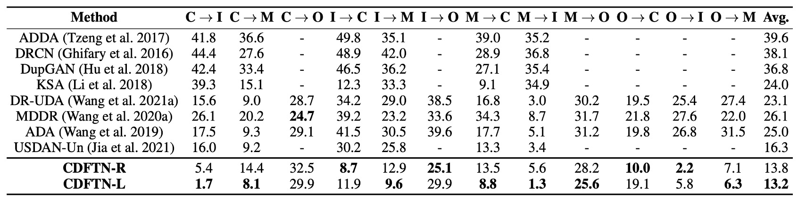
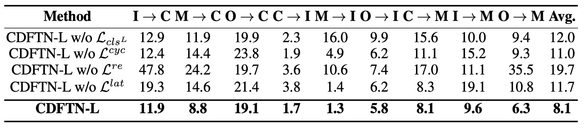

## 風格的糾纏

[**Cyclically Disentangled Feature Translation for Face Anti-spoofing**](https://arxiv.org/abs/2212.03651)

---

從 SSAN 把「風格」的想法引入 FAS 領域後，許多研究者都開始關注這個問題。

後續帶起不少研究，我們接著繼續看這篇。

## 定義問題

Face Anti-Spoofing（FAS）從來不是一個單純的分類問題，而是活體辨識技術的生死門檻。

一邊是真人臉孔，帶著血肉與呼吸；另一邊，是一張高解析的相片、一段重播的影片、一副矽膠製的假面具。

早期的方法靠手工特徵，像是 LBP、HOG、SIFT 這些名字曾經一度熠熠生輝；後來換成 CNN 接手，從 ImageNet 預訓練的 VGG、ResNet 開始，一路往更深和更寬的架構堆疊。有些方法開始用 LSTM 把時間性拉進來，也有人開始把材料學的視角引進來看。

但不論方法怎麼變，有個問題始終沒解決：

> **換了資料集，模型就廢了。**

換了拍攝裝置、環境光源、文化地區，活體模型就像被打亂的羅盤，無法指向正確方向。

於是 Domain Generalization 應運而生。我們希望模型學會抽象的「活體語意」，而不是記住某個資料集的樣貌。但 DG 的方法往往建構在複數標記域上，而這類資源，在真實場景中並不常見。

另一種更符合部署場景的設定是 Unsupervised Domain Adaptation（UDA），意思是擁有標記的 source，與未標記的 target。

UDA 的方法不外乎三類：

1. 特徵對齊，最小化 source / target 之間的分佈差距；
2. 對抗訓練，用 discriminator 把來源模糊掉；
3. 圖像轉換，直接把 source 長得像 target。

都有效，但也都有一個問題：

> **他們沒有「真正解開語意與風格的糾纏」。**

這些方法通常是硬對齊或硬生成，不論如何，總會在某個環節犧牲了語意的完整性。

那麼，如果我們承認活體與非活體的差異來自「語意」，而 domain 的差異來自「風格與背景」，是否就能設計出一個真正能翻轉 domain 框架的模型？

## 解決問題

<figure style={{"width": "90%"}}>

</figure>

這篇論文提出一個名為 **Cyclically Disentangled Feature Translation Network**（以下簡稱 **CDFTN**）的架構。

讀者應該可以從上圖可以感受到滿滿的壓迫感，它看起來很複雜，實際上也是。

作者的目的並不是直接做真假臉分類，而是先「拆解」出一張臉在不同面向上的潛在特徵，再把它們「重組」成一種能跨越不同域（domain）差異的表示方式。

整個流程可以分成兩個階段：

1. **第一階段：特徵解耦、跨域轉換、生成新影像**
2. **第二階段：利用第一階段生成的影像，訓練最終的分類器**

這個方法的核心概念在於，將每張臉分解到兩個子空間：

- **活體空間（Liveness Space）**：對應活體 vs. 偽裝的語意特徵（希望具備跨域穩定性）。
- **內容空間（Content Space）**：包含裝置、光線、背景等域相關資訊（domain-specific），可被視為干擾或噪聲。

接著你會需要有一點對抗式學習的背景，我們假設你已經是 GAN 大師，所以我們直接看下去吧。

## 第一階段

### 特徵解耦與對抗學習

首先是 Encoder 和 Discriminator 的對抗，在每個 domain（source / target）都會有兩個 encoder：

- $E_L$：用來抽取活體特徵
- $E_C$：用來抽取內容風格

為了讓 $E_L$ 專注在與活體判斷有關的資訊，同時隱藏「來自哪個 domain」的差異，作者透過 **對抗式學習** 的方式來逼迫 $E_L$ 產生「看不出來是 source 還是 target」的潛在向量 $z^L$。其損失函式可以寫成：

$$
\min_{E_L} \max_{D_L} \mathcal{L}_{D_L} =
\mathbb{E}_{x^s \sim P_S}[\log D_L(E_L(x^s))] +
\mathbb{E}_{x^t \sim P_T}[\log(1 - D_L(E_L(x^t)))]
$$

這邊 $D_L$ 是個判別器，負責判斷輸入的 $z^L$ 是來自 source 還是 target；$E_L$ 則會想辦法「騙」$D_L$，讓兩域抽取到的活體特徵難以區分。

### 保留活體訊息的分類器

由於要保證 $E_L$ 提取的活體特徵能正確判斷真假臉，作者在 source domain 上加裝了一個分類器 $C$，並用標準的 cross-entropy loss 進行訓練：

$$
\mathcal{L}_{cls} = -\mathbb{E}_{(x^s, y^s)} [y^s \log C(E_L(x^s))]
$$

藉此確保從 source 抽取的活體向量 $z^L$ 不只隱藏了域資訊，也仍保有能辨識「真臉/假臉」的重要要素。

### 跨域生成與風格重組

這一段就是 **CDFTN** 的賣點。

在第一階段裡，模型不只要抽取活體特徵，還要能透過「交換不同域的活體特徵與內容特徵」來產生新的「偽標記影像」。

之所以要這麼做，是因為在真實應用中，source 與 target 往往有顯著差異（例如攝影機品牌、拍攝環境、光源等），若只依賴 source 上的資料來訓練，往往無法泛化到 target。

透過這種跨域重組的方式，模型能更好地「看到」各種風格的潛在變化，進一步擴增可用的訓練資料，讓最終學到的活體判斷具備跨域穩定性。

首先，我們在 source 與 target 上分別取得：

$$
(z^L_s, z^C_s) = (E_L(x^s), E_C(x^s)), \quad
(z^L_t, z^C_t) = (E_L(x^t), E_C(x^t)).
$$

這裡的 $z^L$ 代表「活體空間」中與真假臉判斷最相關的特徵；而 $z^C$ 則代表在各自 domain 中較為獨特的風格資訊（例如裝置影響、背景、光線特性等）。

接著，將上述兩域的潛在向量分別交換，產生以下「偽標記影像」：

$$
\hat{x}^t = G_t(z^L_s, z^C_t), \quad
\hat{x}^s = G_s(z^L_t, z^C_s),
$$

其中 $G$ 是對應的 decoder。它會將活體特徵 $z^L$ 與內容特徵 $z^C$ 結合起來，還原成像素空間。換句話說，$\hat{x}^t$ 是「來自 source 的活體特徵」與「目標域的內容風格」所合成的新影像；$\hat{x}^s$ 則相反。

這麼做的意義在於：若我們能保留原有的真假臉語意（由 $z^L$ 帶來），又同時在風格上貼近 target 域（由 $z^C$ 決定），就能得到「看起來跟 target 很像、但仍保有真實或假臉語意」的額外訓練影像。這些影像在之後就能提供給分類器，用來學習在 target 域中做更好的辨識。

為了確保 $\hat{x}^s,\hat{x}^t$ 的品質（例如畫面逼真度、與對應域風格的一致性），作者在像素層也加入了影像判別器 $D$。此判別器類似於一般 GAN 中的做法，要能區分「真實的影像」和「透過交換特徵後生成的影像」。其對應的 adversarial loss 為：

$$
\mathcal{L}_{adv} =
\mathbb{E}_{x}[\log D(x)] +
\mathbb{E}_{\hat{x}}[\log(1 - D(\hat{x}))].
$$

若判別器能夠辨識出生成影像是「假的」，表示生成品質仍有不足；因此 generator $G$ 會試圖提升生成樣本的逼真程度，以便「騙過」判別器 $D$。透過這個過程，$\hat{x}^s,\hat{x}^t$ 可以在外觀上更趨近真實影像，並更符合各自 domain 的風格。

### 一致性損失

為了避免在風格轉換的過程中，**活體特徵** 或 **原圖內容** 出現混淆或流失，作者另外加入三種一致性損失來加強約束，讓交換後的影像不會失去對應的「真 / 假」語意，也不會產生過多不必要的風格扭曲。

1. **重建損失 $\mathcal{L}_{re}$**

   若我們不做跨域交換（也就是把同一張圖像的 $z^L$ 和 $z^C$ 送回同一個 decoder），就應該能重建出原始影像。若重建誤差過高，就代表 encoder 或 decoder 未能正確提取或還原該張圖像，因而需要在訓練中被懲罰。

2. **週期損失 $\mathcal{L}_{cyc}$**

   參考 CycleGAN 的概念，假設我們已產生了 $\hat{x}$（交換後的影像），那就可以再把它餵回對應的 encoder 去抽取 $(z^L, z^C)$ 後，再轉回原域，要求最終重建出「跟原圖盡可能一致」的結果。這種「來回循環」的機制，能避免跨域過程中出現不可逆的資訊丟失。

3. **潛在空間損失 $\mathcal{L}_{lat}$**

   主要用來確保經過跨域交換後，活體特徵 $z^L$ 不會出現重大變形。例如，若原本是「真臉」，跨域後又經歷多重轉換，理論上還是要保持「真臉」的語意，不能被風格交換或噪聲操作破壞。此損失能約束模型別隨意改變活體特徵，維持交換前後的語意一致性。

綜合以上步驟，就形成了一個閉環的特徵翻譯流程：**從拆解到交換，再透過對抗學習及一致性損失來校正**，最終得到「真實感足夠，又能有效保留真假臉語意」的偽標記影像。這些影像會在第二階段進一步派上用場。

## 第二階段

完成第一階段後，作者 **固定** 整個生成架構，使用前面產生的「偽標記影像」$\hat{x}^t$ 來訓練最終的分類器 $M$。
文中比較了兩種設計：

- **LGSC（Feng et al., 2020）**：是個多任務設計（含分類 + regression + triplet）。
- **ResNet-18**：只做二元分類。

若使用 LGSC，最終損失可寫為：

$$
\mathcal{L}_{stage2} = \alpha_1 \mathcal{L}_a + \alpha_2 \mathcal{L}_r + \alpha_3 \mathcal{L}_{tri},
$$

而若用 ResNet-18，則僅保留二元分類的部分。

---

這應該是我們最近讀到比較複雜的一篇論文，整體而言，CDFTN 的核心思路在於：

1. **先把活體語意與域相關內容解耦**，利用對抗式學習保證活體特徵的跨域一致性。
2. **接著交換兩域的特徵**，透過跨域生成來創造更多「偽標記影像」。
3. **最後再用這些偽影像當作補充數據**，進行更穩健的最終分類器訓練。

從方法論看來，這個架構確實複雜，但它的出發點很直接：同一張臉的「真 / 假」判斷應該不會被攝影機品牌或光線條件等差異所左右，因此先把「活體」的語意抽離出來，再將域差異歸於內容空間，才有辦法在跨域場景下進行更泛化、更準確的活體偵測。

## 討論

本論文在跨域臉部活體偵測的情境下，分別透過 **單一目標域轉換（SS2ST）** 與 **多目標域轉換（SS2MT）** 來驗證 **CDFTN** 的成效。

作者採用了四個常見的跨域 FAS 資料集：

- **CASIA-MFSD** (C)
- **Replay-Attack** (I)
- **MSU-MFSD** (M)
- **Oulu-NPU** (O)

在 **單一目標域** 的設定下，一次選擇一個 source（含全部資料）和一個 target（含其訓練集）進行實驗。

因此，會有 12 種測試場景：

- C → I, C → M, C → O
- I → C, I → M, I → O
- M → C, M → I, M → O
- O → C, O → I, O → M

在 **多目標域** 的設定下，從 C, I, M, O 四個資料集中擇一作為 source，另外三個則皆為 unlabeled target。

整體則有 4 種場景：

- C → I & M & O
- I → C & M & O
- M → C & I & O
- O → C & I & M

最後，評估指標的部分，作者採用了下列兩個常用的量化指標：

1. **HTER (Half Total Error Rate)**：

   $$
   \mathrm{HTER} = \frac{ \mathrm{FRR} + \mathrm{FAR} }{2},
   $$

   其中 $\mathrm{FRR}$ 與 $\mathrm{FAR}$ 分別是錯拒率與錯接受率。

2. **AUC (Area Under the Curve)**：越高表示分類器區分真臉與假臉的能力越好。

### 與其他方法的比較

作者先將 **CDFTN** 與其他跨域學習方法做比較，結果顯示如上表：

- 整體而言，CDFTN 在大多數跨域測試場景中，都能 **顯著降低 HTER、並提升 AUC**。
- 唯一在 **CASIA → Oulu** 的場景中，效能提升較不顯著。作者推測主因是 **Oulu** 資料集有更多攻擊手法（2 種印表機與 2 種螢幕設備）、且原始影像解析度極高（1920×1080），經過縮放後產生較嚴重的模糊。

可見，單純地做 domain adaptation 無法帶來如此明顯的效果，原因在於 CDFTN 透過 **特徵翻譯** 有效萃取目標域特徵，能夠學到更通用且穩定的活體表示。

### 多目標域特徵轉換

<figure style={{"width": "70%"}}>

</figure>

作者比較了三個不同設定：

1. **SS2ST**：單一目標域；
2. **SS2BT**：將多個 target 域直接合併成「混合」一個域做 SS2ST；
3. **SS2MT**：對每個 target 域各自訓練一組對應的子網路，再把目標域轉換與生成影像綜合運用。

結果顯示 **SS2MT** 不僅明顯優於 **SS2BT**，也比 **SS2ST** 的平均表現更好。

這代表當面對多個子域時，若只用單一個 encoder（視所有 target 為一個整體），會因目標域內部差異過大而影響表現。

SS2MT 透過針對每個子域分別學習，能較全面地汲取各個子域中的活體特徵，進而在總體上得到更穩定的結果。此外，使用 SS2MT 時，只需 **一次訓練流程** 就可同時應對多個 target 域，整體效率更高。

### 消融實驗

<figure style={{"width": "90%"}}>

</figure>

作者進一步針對四個主要設計逐一移除，並分別測試兩種分類器（LGSC 與 ResNet-18）。

從結果可看出：

1. 移除 **$L_{cls}^L$**（活體分類器在 source 上的 cross-entropy loss）會使表現下降，代表若不強制 $z^L_s$ 保留活體區分度，模型較難萃取到真正鑑別性的活體特徵。
2. 移除 **$L_{cyc}$**（週期一致性）後，模型失去閉環翻譯的約束，導致跨域時易產生語意漂移。
3. 移除 **$L_{re}$**（自重建損失）則使模型喪失了對原圖進行精準復原的能力，失去對 encoder / decoder 的基礎限制；實驗顯示這對效能影響也相當顯著。
4. 移除 **$L_{lat}$**（潛在空間一致性）後，活體特徵在重組過程中易變形或流失，同樣導致結果惡化。

整體而言，這些損失對完整架構都不可或缺。其中，**$L_{re}$** 對最終效果影響最大，**$L_{lat}$** 次之。

### 視覺化分析

<figure style={{"width": "70%"}}>

</figure>

上圖為作者針對 **CDFTN** 的視覺化分析，使用 t-SNE 將特徵空間降維至 2D，並將不同域的樣本用不同顏色標示。

其中分別展示了特徵翻譯前（左）與特徵翻譯後（右）的分布情形。可以明顯看出，不同域的樣本在翻譯後更重疊且決策邊界更清晰，表示跨域特徵的差異已被有效縮小。

## 結論

在 FAS 的研究歷程中，「風格」這個詞的重量是逐漸變重的。

從最初被視為一種干擾因素，到後來成為辨識泛化失效的關鍵解釋，再進一步被納入建模的顯性維度，風格（style）與語意（semantics）之間的關係，構成了這幾年許多方法論的核心。

而 CDFTN，正是這條路線上的一個關鍵節點。

它不只是解耦了語意與風格，更重要的是它把這種解耦轉化為生成機制的一部分，並用跨域的伪標記樣本訓練出分類器，試圖建立一種語意驅動的風格重構流程。

相比於「如何對抗 domain shift」的研究方向來說，如何尊重風格的存在，並讓模型學會與之共處也是一個重要的課題。
