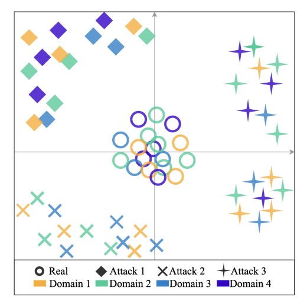
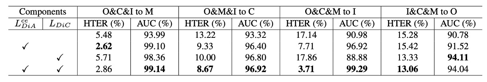

## 全明星錦標賽

[**Domain Invariant Vision Transformer Learning for Face Anti-spoofing**](https://openaccess.thecvf.com/content/WACV2023/papers/Liao_Domain_Invariant_Vision_Transformer_Learning_for_Face_Anti-Spoofing_WACV_2023_paper.pdf)

---

難得看到一篇論文的作者群可以把臺灣前幾所大學都掛上號。

台大、成大、清華、高師大......恩？還有玉山銀行。

## 定義問題

我們在上一個章節講了大量關於 Domain Generalization 的內容，這篇論文作為銜接的橋樑，把 DG 的概念從 CNN 架構上延伸到了 Transformer。

新時代的架構會繼承前人的意志，繼續走下去。

回顧現有的 DG-FAS 解法，大致可以整理成兩個方向。

**第一種，嘗試讓「真臉」彼此靠近。**

不管來自哪個 domain，真臉都應該共享某種內在的活體樣態。在 feature space 中，這些來自不同世界的真實樣本，被集中到同一個語意團塊。這種作法的關鍵，是建立一種跨場景的穩定錨點。

**第二種，針對「攻擊類型」進行拆分。**

不同攻擊方式有不同的偽裝策略，也會帶來不同的視覺特徵。這些特徵在學習過程中被推開、分離，避免模型混淆、誤判。

於是整個特徵空間呈現出這樣的形狀：

- 真臉集中在中心，作為對齊的核心。
- 各種假臉則分散在邊界，彼此區隔。

實作上，這些方法多半還是建構在 CNN 架構上，例如 SSDG 用單邊對抗學習讓真臉特徵更穩定，ANRL 修改 normalization 邏輯以抗 domain shift，SSAN 則拆出風格與內容，進行跨域對比學習。也有像 FGHV 這樣的生成式方法，用高斯分布假設來逼近真實樣貌。

設計精巧，成效可觀，但背後總帶著複雜的學習機制與高昂的資源成本。

而所有這些努力的前提，是一個共同假設：

> 模型從未見過目標 domain 的任何資料。

這樣的條件雖然苛刻，卻也更接近實際應用。現實世界不會等你蒐集完所有變數，它只會直接丟出一個從未出現過的例外情況，讓你的模型立即給出答案。

這正是為什麼有人開始將目光轉向 Transformer。

相比 CNN，Transformer 擁有更大的感受野、更靈活的關聯建模能力，在跨域學習這種充滿長距離語意變異的場景裡，理論上更具優勢。

可是目前用於 FAS 的 Transformer 嘗試仍然有限，有的直接套用 ViT，有的只拿來當教師模型，學生端還是回到 CNN。多數設計也沒有針對 domain generalization 做出專門調整。

那麼，如果我們想要設計一個真的能跨域泛化的 Transformer，該從哪裡開始？

## 解決問題

這篇論文的核心主張其實很簡單：

用一個輕量但足夠聰明的 Transformer 架構，把「真實」拉在一起，把「攻擊」分開。

### 模型架構

<figure style={{"width": "90%"}}>

</figure>

整體方法建立在 MobileViT 之上，這是一種結合 CNN 與 Transformer 的混合型架構。

:::tip
不知道 MobileViT？你可以參考我們之前讀過的筆記：

- [**[21.10] MobileViT: 變更設計卷積核**](../../lightweight/2110-mobilevit/index.md)
  :::

MobileNet-v2 負責初步的下採樣與特徵抽取，MobileViT block 則以局部卷積與全域注意力串接，讓模型能同時捕捉臉部細節與全局結構。這種設計同時兼顧效率與表示力，適合部署在資源受限的場景中。

跨域泛化的第一步，是讓模型在「不同場景的真臉」之間取得共識。

假設我們有來自 $K$ 個 domain 的資料集 $D_1, D_2, \ldots, D_K$，每個資料集中都有真臉與若干種類的攻擊樣本。

作者把所有真臉合併為：

$$
D_R = \bigcup_{k=1}^K D^\text{real}_k
$$

接著，透過 Transformer backbone 將這些樣本映射到特徵空間，得到一組嵌入向量：

$$
E_R = \pi(D_R)
$$

作者的做法，是直接把原點 $[0]^d$ 當作真臉的中心，設計一個簡單的 $\ell_1$-norm 損失，將這些特徵盡量拉向原點：

$$
\mathcal{L}_\text{DiC} = \frac{1}{N} \sum_{i=1}^N \mathbb{1}[x_i \in D_R] \cdot \|\pi(x_i)\|_1
$$

這個想法來自於 Center Loss，但不同的是，我們不需要動態更新中心點，也不需要為每一類別分配一個 center。因為在這個設定下，真臉只有一類，攻擊則不預設數量或類型。

概念上可以參考下圖，不同 domain 的真臉被集中在空間中心，而非沿著某一個 domain 軸線分散，其餘的攻擊樣本則不予理會。

<figure style={{"width": "60%"}}>

</figure>

拉近真臉之後，下一步是推開假臉。

針對每一種攻擊類型，我們將來自不同 domain 的資料合併成一個類別：

$$
D^c = \bigcup_{k=1}^K D^c_k, \quad c \in \{1, \ldots, C\}
$$

然後加上一個分類頭，對輸入樣本進行 $C+1$ 類分類（真臉 + 各種攻擊）。

這裡的 cross-entropy loss 為：

$$
\mathcal{L}_\text{DiA} = -\frac{1}{N} \sum_{i=1}^N \sum_{c=0}^{C} \hat{y}^c_i \log y^c_i
$$

其中 $\hat{y}^c_i$ 是 one-hot 標籤（c=0 表示真臉），而 $y^c_i$ 是模型對每類別輸出的 softmax 結果。

這層分類器的任務不只是為了「辨識」攻擊類型，更重要的是在 latent space 中進一步撕開真偽樣本的空間配置。這樣做的好處是讓攻擊樣本彼此分散，同時與真臉保有距離，強化跨 domain 的解耦能力。

最終的損失函數為兩者加權組合：

$$
\mathcal{L}_\text{total} = \mathcal{L}_\text{DiA} + \lambda \mathcal{L}_\text{DiC}
$$

推論階段僅使用分類頭中對真臉的預測機率作為輸出，不需額外模組。

整體方法不引入對抗學習，也不倚賴風格拆分或特徵生成，只靠兩個直觀的目標函數與一個可輕量化的架構，就能實現穩定而有效的泛化效果。

## 討論

作者使用了四個常見的 FAS 公開資料集進行測試：CASIA-FASD、MSU-MFSD、Replay-Attack 與 OULU-NPU。

這些資料集各自來自不同拍攝裝置、攻擊手法與照明條件，具備明顯的 domain 差異，對於評估泛化能力來說，是一組具有代表性的測試場景。

根據 DG-FAS 的慣例，Replay-Attack 與 OULU-NPU 的訓練與測試集會分開使用，不用驗證集；其他資料集則全數納入實驗。

這些資料集中包含的真實與攻擊影像數量彙整於下表，建議讀者先掃過這張表，理解資料比例與數據密度的差異，這將有助於後續對比各模型的表現。

<figure style={{"width": "50%"}}>

</figure>

評估指標採用兩個常見指標：

- **HTER（Half Total Error Rate）**：越低越好，表示模型在不同類型錯誤間達到良好平衡。
- **AUC（Area Under the Curve）**：曲線下面積，越高越穩定。

### 實作細節

所有影像都經過 MTCNN 對齊與裁切，統一調整至 $256 \times 256$。

模型選用 **MobileViT-S** 版本作為 backbone，搭配 ImageNet-1K 預訓練，優化器使用 Adam，學習率 $10^{-4}$，weight decay 設為 $10^{-6}$。
兩項損失函數的平衡係數 λ 設為 0.2。

### Leave-One-Out 測試結果

<figure style={{"width": "90%"}}>

</figure>

在上表中，展示了 leave-one-out 設定下的表現。這種設定會將四個資料集中的三個作為訓練來源，剩下那一個資料集作為測試集，模擬模型遇到全新 domain 的狀況。

大多數方法都為 frame-based，這篇論文的方法也是如此；唯一的例外是 **NAS-FAS**，它是基於影片訊號，理論上具有額外的 temporal cue。

在這個嚴苛的測試中，**DiVT 在所有設定下的 HTER 均優於現有 SOTA 方法**，其中有兩個測試組合甚至改善超過 3%。

唯一一次未能奪冠的是 AUC 指標中的 I&C&M to O，此處 NAS-FAS 略勝一籌。但該方法為影片級，與純影像級的方法相比，屬於不同層級的比較。

### 小樣本設定

<figure style={{"width": "70%"}}>

</figure>

除了常規 leave-one-out 外，作者也測試了 **有限訓練資料設定**，僅使用 MSU-MFSD 與 Replay-Attack 作為訓練來源，其餘作為測試集。

這類設定更接近實際部署時的資料困境。

對比 SSDG-R 與 SSAN-R 等強化版 baseline，上表顯示 DiVT 在大多數情境中仍保有優勢，尤其在 AUC 指標上表現一致穩定。即使在某些 HTER 指標中略為落後，整體仍展現優越的抗 domain 偏移能力。

## 消融實驗

接下來的分析，聚焦在三個問題上：

1. 不同 Transformer 架構的表現差異有多大？
2. 我們設計的兩個損失函數到底幫了多少忙？
3. 如果換成別種分類邏輯，結果會更好還是更差？

### 不同架構的對照結果

<figure style={{"width": "90%"}}>

</figure>

結果如上表，上半部是各個架構在僅使用 binary cross-entropy loss 下的表現，下半部則是搭配我們設計的 loss 後的結果。

我們可以看到幾個關鍵差異：

- Transformer 架構（DiVT-V/S/M）普遍優於 CNN（ResNet-18），顯示在跨域任務中，全局注意力與長距離依賴特徵比局部卷積更具優勢。
- 在所有 Transformer 中，**MobileViT（DiVT-M）表現最佳**。它既能保留局部特徵，又能整合全域關係，而且模型小、學得快，非常適合現實場景。
- ViT-Base 表現最差。作者推論，這可能是因為 ViT 缺乏對 local pattern 的建模能力，而且參數量太大，不適合資料規模有限的任務。
- 當架構換成 ViT-Tiny，結果就好多了，這進一步證實了「模型大小需與資料規模匹配」這件事。

MobileViT 的成功也再次印證一件事：**卷積不是沒用，而是應該在對的地方出現**。

### Loss 組合的效益

<figure style={{"width": "90%"}}>

</figure>

接著作者測試了我們方法中兩個核心損失函數的搭配組合（DiC loss 與 DiA loss），分別比較單獨使用、都不使用、與同時使用的效果。

觀察發現：

- **DiA（分類損失）是主要貢獻者**，平均提升 AUC 約 3.7%。
- **DiC（拉近真臉）也帶來穩定提升**，約 1.3% AUC 增益。
- **兩者搭配時效果最佳**，證實「空間集中」與「語意分離」的策略能互補協同。

### 改變分類邏輯會更好嗎？

<figure style={{"width": "90%"}}>

</figure>

作者也探討了分類任務本身的設計是否影響結果。除了二元分類（real vs fake）之外，另外測試了：

- 按 domain 分類（real + 各 domain 的 spoof）
- 按 attack type 分類（real + 各種攻擊類型）
- domain 與攻擊的組合分類

結論很明顯：**attack type 分類效果最好**，其他則容易導致過擬合或模糊化。

這驗證了 DiVT 方法中「統一真臉、拆分假臉」的空間策略比傳統 domain-label based 設計來得更穩定。

### 如果加上 adversarial loss？

有些人可能會問，那為什麼不加上 SSDG 或 SSAN 的 adversarial loss？

實驗發現，加上 adversarial loss 並沒有帶來顯著效益，有時反而略差。推測原因可能是：

- DiVT 的特徵空間已經足夠穩定，無需額外競爭
- Transformer 在 adversarial learning 上的最佳實踐仍未成熟

### 計算資源比較

<figure style={{"width": "70%"}}>

</figure>

最後，作者比較了各模型的參數量與 FLOPs。結果如預期 DiVT-M 在效能與效率之間取得最佳平衡。

雖然 ViT-Tiny FLOPs 較少，但參數量多，效果也不如 MobileViT。這顯示：**真正適合 DG-FAS 的架構不只是輕，更要會抓住空間規律**

## 結論

這類主打 domain generalization 的方法，早已不只是「模型表現」的問題，而是「方法論」的選擇。

這篇論文沒有走進對抗式訓練的複雜棋局，也沒有倚賴合成資料來補強視覺線索。相反地，它選擇把空間拉直、把角色明確地擺進特徵座標系裡，形成一種近乎幾何式的抽象處理。

在技術層面之外，這種設計思路也透露出一種對於現實部署的敏感度：

> **不是堆砌多模態，也不是訴諸重架構。而是找到剛好足夠、又能保持節奏的那個臨界點。**

未來的挑戰會更像是邊界問題的排列組合，domain 與 attack 之間的交叉維度只會更加複雜。而這類簡約清晰的表示策略，或許會是我們重新整理問題空間的起點。
