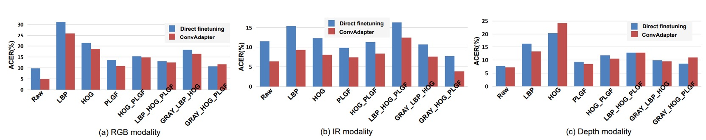

## 舉一反三

[**Rethinking Vision Transformer and Masked Autoencoder in Multimodal Face Anti-Spoofing**](https://arxiv.org/abs/2302.05744)

---

我們一路看論文，大概也知道人臉辨識就是個常常被攻破的系統。

雖然準確率高、用起來方便，但人臉辨識的核心問題始終沒變：你永遠不知道畫面裡那張臉，是人，還是張照片。

## 定義問題

過去十年，從 LBP 到 CNN，從單模態 RGB 到多模態融合（像是 RGB、IR、Depth），我們已經建構出一整套偵測假臉的系統。然而，不管是手工特徵還是深度學習模型，它們在面對「新型攻擊」或「未見場景」時，仍然會栽在泛化能力這一關。

為了處理這個問題，多模態成為解方之一。

畢竟在高風險場景（像是人臉支付或保險庫門禁）中，單靠一個 RGB 畫面說話太單薄了。IR、深度資訊、甚至熱成像，都能補上不同維度的活體線索。

但問題又來了。

隨著 Vision Transformer（ViT）橫空出世，大家都想把它用在 FAS 上，原因很簡單：

- **ViT 的長距離建模能力、跨模態擴展性，看起來剛好補上 CNN 的盲點。**

於是有人直接拿來微調，有人額外加模組強化跨模態能力，看起來效果不錯。

只是，我們真的理解它的本質嗎？

- **ViT 是否真的適合這樣的多模態任務？**
- **為什麼原本在 ImageNet 上表現驚人的預訓練，到了這裡就有點水土不服？**
- **如果我們不用 ImageNet，而是自己訓練個 ViT，該怎麼做才不會 overfit？**
- **那些模態間的細節差異，ViT 有抓到嗎？**

作者的問題不只是一個模型訓練策略的優化，而是回到原點問了一個更基本的問題：

> **我們真的知道怎麼用 ViT 解決 FAS 嗎？**

## 解決問題

在搞懂問題本質之後，作者針對 ViT 在多模態 FAS 的三個關鍵面向提出了對應的設計：**輸入資料的形式、微調策略，以及預訓練方法**。

我們就依序來看看。

### 輸入資料

ViT 雖然擅長全局建模，但缺乏局部細節的敏感度。

在 FAS 任務中，那些能讓人辨識真假臉的關鍵，常常藏在微妙的邊緣紋理或高頻細節裡。這時候，CNN 那種擅長抓「小地方」的特性就顯得特別重要。

於是作者回頭翻出了三種經典的局部特徵描述子來補足 ViT 的盲點：

- **LBP (Local Binary Pattern)**

  用像素間的強度差計算出二值編碼，對光照變化不敏感，擅長抓紋理細節。

  其公式如下：

  $$
  \text{LBP} = \sum_{i=1}^{p} F(I_i - I_c) \cdot 2^{i-1}, \quad F(I) = \begin{cases}
  1 & I \ge 0 \\
  0 & \text{otherwise}
  \end{cases}
  $$

- **HOG (Histogram of Oriented Gradients)**

  抓的是邊緣方向分布，透過區塊化的梯度統計向量來表達圖像結構，對幾何和光照變化有一定容錯能力。

- **PLGF (Pattern of Local Gravitational Force)**

  這個比較冷門，靈感來自萬有引力定律，透過局部引力分佈來強化邊緣與輪廓資訊，特別適合對抗噪聲與光照變化。公式如下：

  $$
  \text{PLGF} = \arctan\left( \sqrt{ \left(\frac{I \times M_x}{I} \right)^2 + \left(\frac{I \times M_y}{I} \right)^2 } \right)
  $$

  其中 $M_x$、$M_y$ 是根據位置設計的方向遮罩，模仿物理引力的分佈。

具體樣式如下圖所示：

<figure style={{"width": "80%"}}>

</figure>

我們可以看到這三種特徵的視覺化效果：從 LBP 的點陣紋理、HOG 的方向分佈、到 PLGF 的輪廓重構，每一種都提供了不同的視角去補強原始模態資料。

作者還試著把這些特徵做組合（例如：GRAY + HOG + PLGF），並當作 ViT 的三通道輸入。這種手工與深度特徵混搭的設計，在多模態 FAS 中顯得特別有效。

### 模型架構

<figure style={{"width": "90%"}}>

</figure>

我們來細看這篇論文的核心模型架構。

主幹是一個 **預訓練的 ViT**，整體結構被有意設計為 **高凍結、低微調**：

- 只有最後的分類頭 $E_{\text{head}}$ 和額外插入的模組 **AMA（Adaptive Multimodal Adapter）** 參與訓練，其餘的 ViT 結構完全保留原貌。

AMA 的角色就是個 Adapter，讓原本只會處理單一模態的 ViT，變得可以理解多模態輸入（如 RGB、IR、Depth）。

:::tip
如果你對 Adapter 的概念不熟悉，可以參考我們其他論文筆記：

- [**[19.02] Adapter: 參數節省九成六**](../../model-tuning/1902-adapter/index.md)

:::

它的結構設計可以分為四個階段，如上圖中的 AMA 模組內部：

1. **通道壓縮 $\Theta↓$**

   每個模態的輸入 token，會先經過一層 1×1 卷積，將原始通道維度 $D$ 壓縮為隱藏維度 $D_0$。這個動作的目的是將資訊濃縮，為後續模態間的融合準備統一格式。

2. **局部模態融合 $\Theta_{2D}$**

   接著，將三個模態壓縮後的特徵圖重新拼接為三維空間（batch, channel, height, width），透過一個 3×3 的 2D 卷積做空間融合。這步驟充分利用模態間的空間對齊特性，在保持原位關係的前提下進行特徵交互。

3. **動態模態權重 $\Theta_{\text{Ada}} + \sigma$**

   為了讓不同模態的貢獻可以隨場景自動調整，AMA 使用 global average pooling（GAP）來萃取每個模態的全域資訊，再透過 1×1 卷積和 Sigmoid 函數輸出模態權重 $(w_{RGB}, w_{IR}, w_{Depth})$。這些權重會對應地調節每個模態在融合輸出中的影響力。

4. **通道回復 $\Theta↑$**

   最後，透過另一個 1×1 卷積把通道維度從 $D_0$ 擴回 $D$，並將這些融合後的模態特徵與經處理的 class token 組合起來，作為最終送入分類頭的 token 向量序列。

這樣的設計有幾個優點：

- **參數效率高**：只微調少量參數，降低 overfitting 風險
- **模態融合精細**：不像傳統直接 concat，多了一層動態加權與卷積融合
- **支援彈性模態組合**：AMA 可在任意模態組合下運作（例如只有 RGB+IR）

換句話說，AMA 是一個**低侵入性、高擴展性**的模態融合模組，專為 ViT 的結構特色量身打造。它讓 frozen ViT 在不重訓底層的情況下，也能吃進高維度、多模態的 spoof 線索。

### 預訓練方法

<figure style={{"width": "80%"}}>

</figure>

最後，作者針對 ViT 的預訓練流程也提出一個新的框架：**Modality-Asymmetric Masked AutoEncoder**，也就是本文的標題 M²A²E。

傳統的 MAE 會將整張圖切成 patch，隨機遮一部分，然後讓模型學著重建。但在多模態情境中，這樣的設計會有幾個問題：

- 遮的是全部模態的 patch，模型容易對某一模態過度依賴
- 模型的目標只是還原影像，並不一定有助於活體判斷這種「跨模態語意」的任務

於是 M²A²E 改變了 masking 與重建的邏輯：

- 每次只隨機選一個模態做輸入
- 對該模態的 token 做遮蔽
- 同時要求模型重建：
  - 該模態被遮住的 patch（這是傳統 MAE 的部份）
  - 其他模態的完整圖像（這是關鍵創新）

這個設計逼著模型學會「用一個模態去預測其他模態的樣貌」，也就是所謂的 cross-modality reconstruction。具備兩大優點：

- 對模態間的語意關聯建模能力更強
- 能捕捉到如「色彩失真」、「深度缺失」這類 spoof 線索

## 討論

### 實驗結果

<figure style={{"width": "90%"}}>

</figure>

在 WMCA 的實驗中，作者設計了兩個情境：

- 一是模型已經看過攻擊類型（**seen protocol**）
- 另一是完全沒見過的新型攻擊（**unseen protocol**）。

上表正是測試這兩種情境下，**AMA 與 M²A²E 所帶來的效益**，可以從三個面向來解讀這張表：

1. **AMA 的角色是「增強器」**

   相較於 baseline 的 ViT，**加上 AMA 之後的模型，在所有模態設定下 ACER 都有明顯下降**。即使在原始 ViT 只能處理 global 的 patch-level 注意力時，AMA 補上了局部與模態交互的不足，讓整體辨識能力更穩。

2. **M²A²E 的角色是「泛化器」**

   在 unseen 攻擊的測試情境中，**使用 M²A²E 預訓練的模型能比 ImageNet 預訓練的版本更穩定**地面對未知的 spoof 攻擊，尤其在 IR 與 Depth 模態上效果特別顯著。這顯示它成功學到了一種可遷移的 spoof 特徵表徵方式。

3. **RGB+IR+Depth 是全模態最強組合**

   最後一欄的三模態組合，AMA+M²A²E 所得到的 ACER，**甚至優於使用四模態的 MCCNN 模型**。這代表只要模態選得好、模組設計合理，就能用更少的感測器達到更好的效果。

:::tip
更多實驗結果，請讀者參考原始論文。
:::

### Local Descriptors 是否有用？

這裡作者針對 IR 模態，測試了多組輸入特徵，包括：

- 單一描述子：**LBP**, **HOG**, **PLGF**
- 組合輸入：**HOG+PLGF**, **LBP+HOG+PLGF**, **GRAY+HOG+PLGF**

結果有幾個重點：

- **LBP 最弱**：不論哪一模態，LBP 的表現都落後其他特徵，可能是因為它太過簡單，不足以支撐 ViT 的高維建模需求。
- **PLGF 穩定發揮**：在 IR 模態中，即使單用 PLGF，就已經能打平甚至超越原始輸入。
- **組合最強，特別是 GRAY+HOG+PLGF**：這組輸入在 IR 模態下表現最佳，**不管是直接微調還是配上 ConvAdapter**，都明顯勝出。

實驗結果表示 IR 模態本身對光線變化敏感，需要局部紋理與光照不變性的補強，而這些經典的 hand-crafted 特徵組合，確實能為 ViT 提供有用的細節。

### AMA 是不是只是參數多？

<figure style={{"width": "90%"}}>

</figure>

作者測試了五種 adapter 結構，看看哪一種設計最適合 ViT-FAS：

1. **vanilla adapter**：全連接層（FC）為主
2. **ConvAdapter（單模態）**：用 2D 卷積取代 FC
3. **Multimodal ConvAdapter（壓縮版）**：融合不同模態的特徵，再做 2D 卷積
4. **Multimodal ConvAdapter（全維度）**：輸出維度保留所有模態乘積（D₀ × K）
5. **Adaptive Multimodal Adapter（AMA）**

重點觀察如下：

- **從 FC 換成 Conv 的提升非常明顯**，顯示局部感受野對 ViT 是補強而非干擾。
- **簡化的 Multimodal ConvAdapter** 優於 單模態版，代表模態融合在 ViT 裡是可行的。
- **全維度版本反而 overfit**，說明高維融合不見得越高越好。
- **AMA 是這些方法中最平衡的**，既保留模態差異，又能有效加權不同特徵來源。

因此，結論是 ViT 的模態融合要靠卷積，但不能無腦疊維度。而 AMA 的加權融合方式，是目前設計中的最佳解。

## 結論

我們經常在論文中看到 Transformer 被應用到新的任務上，但這篇文章的可貴之處在於，它並沒有急著往上疊架構，而是回頭問了一個更基本的問題：

> **「如果 ViT 是要用來做 Multimodal FAS，它該具備哪些特質？」**

作者將這個問題拆成三個面向來看：輸入的細節設計、預訓練的邏輯、以及微調的方式。這種做法對於資料量有限、攻擊樣態多變的 FAS 任務來說，顯得特別有價值。
