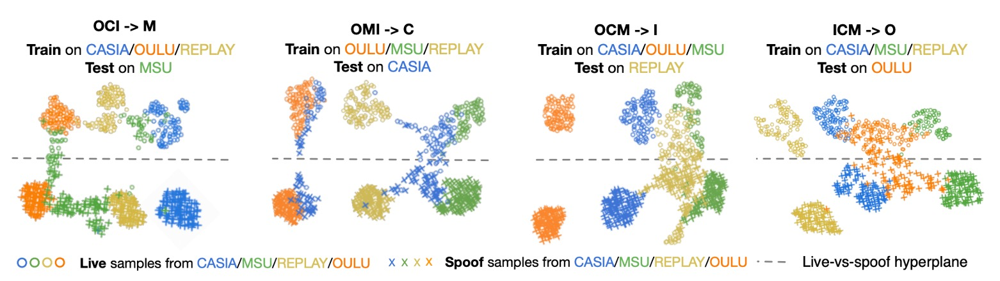

## 超平面的律令

[**Rethinking Domain Generalization for Face Anti-spoofing: Separability and Alignment**](https://arxiv.org/abs/2303.13662)

---

對於 FAS 這個題目，我們先是看過了基於 Domain Generalization（DG）的解決方案 SSDG，然後又是自適應 DG 的解決方案 D²AM。

那麼 DG 到底是不是一個正確的方向呢？

:::tip
沒看過之前論文的讀者，可以參考我們之前的筆記：

- [**[20.04] SSDG: 穩定的真實**](../2004-ssdg/index.md)
- [**[21.05] D²AM: 千域鍛魂術**](../2105-d2am/index.md)
  :::

## 定義問題

DG 用起來確實不錯，但還是有其侷限性。

首先，過去這些方法大多數都建構在一個理想化的前提上：

> **我們可以學到一個「不受 domain 影響」的特徵空間。**

這聽起來很美，但實際上往往撐不起來。

因為訓練資料的 domain 數量有限、變化範圍也受限，模型很容易就在訓練的分佈上發生過擬合。一旦來到真實測試情境，像是不同設備、解析度或光源，模型就會開始出現幻覺。

還有更糟的情況是：
當來自不同 domain 的資料被硬壓進同一個特徵空間裡，live 跟 spoof 本來好好的分開，結果被搞得混在一起。

這時候模型會怎樣判斷？
很簡單，它會學到一些無關痛癢的「錯誤相關性」，例如：

> **「低解析度的是攻擊，高解析度的是真人。」**

但一換 domain，這種關聯性根本就不存在，結果就是大災難。

既然 domain-invariant 這條路不太通，那我們不如換個方向想：

> **與其把 domain 訊號抹掉，不如好好地「保留下來」，然後重新設計特徵空間。**

## 解決問題

SA-FAS 的出發點其實很單純：

我們不再試圖消除 domain 的影響，而是**正視並善用這些差異**，重新設計特徵空間。

這個空間要具備兩個核心特性：

1. **可分性（Separability）**：live / spoof 之間要分得清楚，不同 domain 也能保有結構
2. **對齊性（Alignment）**：每個 domain 的 spoof transition 應該朝同樣的方向變化

這聽起來像是矛盾：又要分開，又要一致？

但事實上，這兩者是互補的：**分開**讓我們不被 domain 混淆，**一致**讓我們可以用同一條邊界來分類。

### 可分性

為了讓同一類別、同一 domain 的資料能夠「聚在一起」，SA-FAS 採用了 **Supervised Contrastive Learning（SupCon）**。

這段 loss 是這樣定義的：

$$
\mathcal{L}_{\text{sep}} = \sum_{i=1}^{2b} -\frac{1}{|S(i)|} \sum_{j \in S(i)} \log \frac{\exp(z_i \cdot z_j / \tau)}{\sum_{t=1, t \ne i}^{2b} \exp(z_i \cdot z_t / \tau)}
$$

簡單說，就是：

- 找出和 anchor $z_i$ 有相同 label 和相同 domain 的樣本集合 $S(i)$
- 讓這些 positive 越靠近越好，其他 negative 越遠越好
- 使用溫度係數 $\tau$ 來控制對比程度

如果你有讀過對比學習的筆記，會覺得這很眼熟：沒錯，這其實就是 **InfoNCE 的 Supervised 版本**，也稱作 **Multi-positive InfoNCE**。

:::tip
SupCon loss 的詳細定義可參考：

- [**[20.04] Supervised Contrastive Learning**](https://arxiv.org/abs/2004.11362)
  :::

來看個圖感受一下這三種方法對特徵空間的影響差異：

- **(a) ERM**：資料混雜，分不出 live / spoof，分類器靠誤判活著
- **(b) ERM + SupCon**：資料有群聚了，但每個 domain 的邊界方向還是亂的
- **(c) SA-FAS**：不只分得開，而且轉變方向一致，分類穩定

### 對齊性

有了分群還不夠，如果每個 domain 都有自己的一套邊界方向，那根本沒辦法泛化。

為了解決這問題，SA-FAS 引入了 **Invariant Risk Minimization（IRM）** 的概念。

IRM 的理想是這樣的：

> **存在一個 classifier $\beta^*$，對所有 domain 都有效。**

公式長這樣：

$$
\min_{\phi, \beta^*} \frac{1}{|E|} \sum_{e \in E} \mathcal{R}_e(\phi, \beta^*) \tag{IRM}
$$

$$
\text{s.t. } \beta^* \in \arg\min_{\beta} \mathcal{R}_e(\phi, \beta), \quad \forall e \in E
$$

但這個目標太過理想化，很多時候根本找不到同時適合所有 domain 的分類器，導致 IRM 難以收斂。

### Projected Gradient IRM（PG-IRM）

因此作者提出了一個改良版：**PG-IRM**。

核心邏輯是：

> **每個 domain 自己先找一條最適合它的邊界 $\beta_e$，再逐步把大家往同一個方向拉。**

這樣問題就變成：

$$
\min_{\phi, \{\beta_e\}} \frac{1}{|E|} \sum_{e \in E} \mathcal{R}_e(\phi, \beta_e) \tag{PG-IRM}
$$

並加上一個「鄰近條件」來限制每個 $\beta_e$ 不能離其他 domain 太遠：

$$
\forall e, \ \beta_e \in \Omega_e(\phi) \cap \Upsilon_\alpha(\beta_e)
$$

其中：

- $\Omega_e(\phi)$ 是該 domain 的最小 loss 解集合
- $\Upsilon_\alpha(\beta_e)$ 是一個 α-鄰近集合，約束超平面不能彼此距離太遠：

$$
\Upsilon_\alpha(\beta_e) = \left\{ \upsilon \mid \max_{e' \ne e} \min_{\beta_{e'} \in \Omega_{e'}(\phi)} \|\upsilon - \beta_{e'}\|_2 \le \alpha \cdot \max_{e' \ne e} \min_{\beta_{e'} \in \Omega_{e'}(\phi)} \|\beta_e - \beta_{e'}\|_2 \right\}
$$

---

整個對齊的過程可以想像成這樣：

- **(a)** 原始 IRM 嘗試直接找到 $\beta^*$，但可能無解
- **(b)** PG-IRM 讓每個 domain 各自找出最佳的 $\beta_e$
- **(c)** 每個步驟將 $\beta_e$ 向「離自己最遠的那位」靠近
- **(d)** 最後全部超平面方向一致，達成 alignment

### α-adjacency 是關鍵

為什麼 PG-IRM 可行，而 IRM 卻常常解不了？

因為 PG-IRM 不是要求「所有 domain 一定要一模一樣」，而是只要「大家夠接近」即可。

這個「接近」的概念就是 α-adjacency，如下圖：

<figure style={{"width": "70%"}}>

</figure>

每個 domain 的超平面 $\beta_e$ 只要落在其他超平面的 α 距離內，就算對齊成功。

這樣的設計保證了：

- 每一步的更新都是合法的（集合非空）
- 可以透過簡單的線性插值來完成投影，不會卡死

---

最後，我們把這兩個 loss 結合起來，形成 SA-FAS 的總 loss：

$$
\mathcal{L}_{\text{all}} = \mathcal{L}_{\text{align}} + \lambda \mathcal{L}_{\text{sep}}
$$

推論時，我們會把所有 domain 的分類器平均，做出最後決策：

$$
f(x) = \mathbb{E}_{e \in E}[\beta_e^T \phi(x)]
$$

根據實驗，這樣訓練出來的模型具有極佳的泛化能力，各 domain 的分類器也幾乎重合，代表對齊成功。

## 討論

這裡採用的是最常見的 cross-domain 評估設定：
從四個資料集（CASIA、Idiap Replay、MSU、Oulu）中擇三做訓練，留下那一個沒看過的作為測試目標。像是：

- **OCI → M**：訓練在 Oulu、CASIA、Idiap，測在 MSU
- **OMI → C**：訓練在 Oulu、MSU、Idiap，測在 CASIA
- 以此類推，共有四個方向

這其實是一個 FAS 考古題，看誰能在測試集從來沒出現過的條件下還不會翻車。

### 和其他方法比較

<figure style={{"width": "90%"}}>

</figure>

這裡作者把 SA-FAS 和其他方法的結果放在一起，看看誰的表現最好。

實驗結果顯示，SA-FAS 在所有四個 cross-domain 設定裡都表現得相當優異，特別是在 OCM→I 這個設定，HTER 直接比 SOTA 好了 2.3%，相對誤差減少超過 25%。

如果你想挑戰 cross-domain FAS，這張表大概就是你目前能找到最硬的分數線。

:::info
通常模型在這裡報的是「最佳 snapshot」，也就是訓練過程中找到最低 test error 那一刻的 model，可能在第 16 個 epoch、也可能在第 77 個 epoch。

這種設定確實「對 model 友善」，但也藏著風險：

- 沒有 test set 就選不出 best snapshot（現實應用常常遇到）
- 某些 model 會在訓練後期快速 overfit，數字好看但泛化很差

作者為此在附錄 B 又補了一組實驗，改用「訓練後 10 個 epoch 的平均」作為結果，發現：

> **大多方法數字都掉下來不少，代表泛化還是個硬傷。**

但 SA-FAS 的表現不只仍在第一，而且標準差最小，顯示它不只是強，還比較穩。
:::

### 評估指標分析

<figure style={{"width": "90%"}}>

</figure>

作者定義了兩個自創指標：

- **$S_{sep}$**：live / spoof 在特徵空間中的中心向量分離程度（越遠越好）
- **$S_{align}$**：分類器方向與 spoof → live 過渡方向的一致性（越對齊越好）

每個點是一個 training snapshot，X 軸是指標，Y 軸是 AUC 分數。

根據上圖結果顯示：**兩者都跟 AUC 高度正相關。**

- 有 PG-IRM → $S_{align}$ ↑ → AUC ↑
- 有 SupCon → $S_{sep}$ ↑ → AUC ↑

這告訴我們 SA-FAS 是有數據支持的幾何設計。

### 特徵分布

在 OMI → C 的設定下，作者畫出了最後一層特徵的 UMAP 分佈：

- 每個點是 live / spoof 的樣本
- 顏色代表 domain，虛線是分類器邊界

觀察發現：

- 邊界能在 unseen domain（CASIA）上準確切開 live/spoof
- 不同解析度的 domain 會表現出不同分布，但分類方向一致

這是一種「看得見的泛化」，不需要壓平 domain，而是讓各 domain 可以自然地沿著相同方向分散。

### DANN 和 SSDG 的比較

<figure style={{"width": "90%"}}>

</figure>

DANN 嘗試做 domain-invariant feature，結果訓練集看起來不錯，但是一到 unseen domain，整個 live/spoof 分布就崩了。

SSDG 雖然比 DANN 好一點，做到 spoof 類別的 degradation direction 對齊，但 live 資料還是很亂，而且還有嚴重的 domain gap 無法處理。

## 結論

過去我們總想著要消除 domain 的影響，像是在對抗某種雜訊。

但 SA-FAS 給了一個更務實的方向：

> **與其假裝 domain 不存在，不如設計一個特徵空間，讓它合理存在。**

從泛化能力、穩定性、到可解釋性，SA-FAS 都給出了強而有力的答卷。
