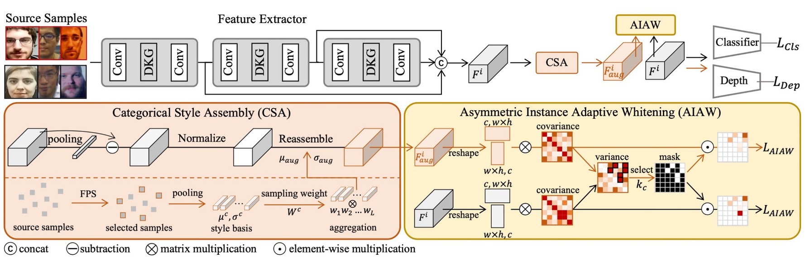
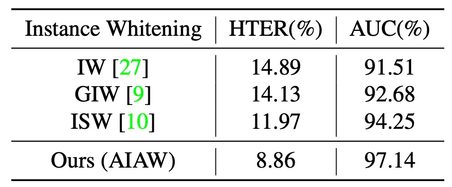

## 風格的獨白

[**Instance-Aware Domain Generalization for Face Anti-Spoofing**](https://arxiv.org/abs/2304.05640)

---

在過去的十年裡，研究者用盡各種方法來畫出真與假的邊界：

- 用 LBP、SIFT、HOG 等手工特徵辨識質感與紋理；
- 探索 YCrCb 色域與傅立葉頻譜中的異常模式；
- 分析時間序列中的微妙差異，試圖從眨眼、微動與血流中找出真人的證據；

接著，整個領域交棒給 CNN，用分類器、深度圖、反射圖與 rPPG 等輔助監督。

但這些方法往往只要換個場景、換個裝置、換個攻擊方式就效果驟降，難以部署。

## 定義問題

為了讓模型適應未知場域，研究者引入了 **Domain Adaptation（DA）** 與 **Domain Generalization（DG）** 的概念。

尤其在 DG 裡，對抗學習與元學習成為主流選擇，目的是學出一種「不管你來自哪裡，我都能識破你」的表徵方式。

但這條路走著走著，也開始暴露出侷限：

- 幾乎所有方法都依賴明確的 domain label；
- 而這些 label，往往只是資料集的名稱、拍攝裝置的型號

甚至是人為指定的某種分類準則，粗糙地讓人發笑。

你說「這是 Replay」，但 Replay 裡面有多種光線、多種背景；你說「這是 Oulu」，卻沒人能標出它到底包含了幾種風格子群。

即使有標籤，這些方法也只能做到 **在分布層級對齊特徵**，卻無法控制某些特徵通道仍偷偷保留了風格痕跡。這些看似無害的訊號，在面對新的樣本時，往往成為模型失效的盲點。

如果，我們不能在依賴 domain label，那麼我們還能怎麼判斷「異類」？

真與假之間，是否還有其他的邊界？

## 解決問題

<figure style={{"width": "90%"}}>

</figure>

為了解決問題，作者提出了一個新的架構，稱為：

- **Instance-Aware Domain Generalization (IADG)**。

目的是希望在不依賴 domain label 的情況下，讓模型能夠學習到「實例層級」的特徵，並且能夠在未知的場域中保持穩定的表現。

它主要包含三個核心組件：

- **非對稱實例自適應白化 (AIAW)**
- **分類樣式組裝 (CSA)**
- **動態核心產生器 (DKG)**

我們按照順序，來仔細看看每個模組的設計。

### Dynamic Kernel Generator

<figure style={{"width": "70%"}}>

</figure>

由於多個來源域中的樣本往往具有高度多樣性，單一靜態濾波器難以兼顧所有實例的特徵需求。為此，作者設計了 **DKG** 來自動生成「實例自適應」的動態濾波器，與靜態濾波器協同運作，取得更全面的個體感知特徵，協助之後的跨域泛化。

DKG 的結構包含「靜態卷積分支」與「動態卷積分支」兩部分：

- 靜態分支（static convolution branch）擁有固定參數；
- 動態分支（dynamic kernel branch）則依據每個樣本的特徵動態產生卷積核參數。

如上圖所示，令 $X_i$ 與 $F_i$ 分別代表第 $i$ 筆樣本在 DKG 的輸入與輸出特徵。

訓練時，兩條分支會同步學習，具體流程如下：

1. 將輸入特徵 $X_i$ 在通道維度一分為二，分別記為 $\hat{X}_i$ 與 $\tilde{X}_i$；
2. **靜態卷積分支**：$\tilde{X}_i$ 經由靜態卷積濾波器 $f_{\theta_s}$ 得到 $\tilde{Z}_i$；
3. **動態卷積分支**：$\hat{X}_i$ 先通過全域平均池化與一個卷積區塊 $f_{\theta_1}$，生成與此實例相關的動態卷積核 $W_i$，再用此動態參數去卷積 $\hat{X}_i$，得到 $\hat{Z}_i$。

如此便可讓模型在靜態與動態濾波器的共同作用下，針對每個實例萃取更具彈性的特徵表示。

### Categorical Style Assembly

<figure style={{"width": "70%"}}>

</figure>

為了在更廣的特徵空間中模擬「實例層級」的風格變動，作者提出 **CSA** 來產生風格更豐富的樣本。之前我們看過的 AdaIN 也是用來進行風格轉換，但它的風格來源往往是「隨機」的，並且沒有考量到不同類別樣本的風格分布差異。

:::tip
暫停一下，可能有讀者不知道什麼是 AdaIN，我們簡單講講：

**Adaptive Instance Normalization（AdaIN）** 是一種風格轉換中常用的特徵對齊方法，最早應用於影像風格轉換任務中。其核心思想是：

> **將內容特徵的均值與標準差，調整為目標風格的統計量**，達成風格的注入與轉換。

具體來說，對於內容特徵 $x$ 與風格特徵 $y$，AdaIN 的計算公式為：

$$
\text{AdaIN}(x, y) = \sigma(y) \cdot \left( \frac{x - \mu(x)}{\sigma(x)} \right) + \mu(y)
$$

其中：

- $\mu(x), \sigma(x)$ 是內容特徵的均值與標準差；
- $\mu(y), \sigma(y)$ 則是風格特徵的統計量。

這個操作將原本的內容特徵歸一化後，再套上風格特徵的統計屬性，進而調整特徵表現，**在不改變語意結構的情況下，重塑其風格表徵**。

AdaIN 因為其簡潔且高效的特性，在風格轉換與跨域泛化任務中被廣泛採用，尤其適合用於需要進行風格對齊或去風格化的應用場景。
:::

針對 AdaIN 的不足，CSA 則做出了兩點改良：

1. **多樣性考量**：以 Farthest Point Sampling（FPS）從所有來源樣本的風格中，迭代篩選出 $L$ 個差異度最高的「基底風格」，確保涵蓋了主要分布，也包含距主流樣式較遠的罕見風格。並且在每個 epoch 動態更新，以因應風格空間隨著訓練而改變。

2. **真 / 假分開處理**：考量到真臉（real）與假臉（spoof）有不同標籤，若任意混合可能導致錯誤標籤的情況。為避免衍生負面效應，CSA 僅在「同一類別」的情況下進行風格組合，確保增強後的樣本不會發生真變假、假變真的混亂。

我們搭配上圖來看，具體流程就是，首先對真臉與假臉各自選出 $L$ 個基底風格，並將其均值 $\mu$ 與變異 $\sigma^2$ 存入記憶體（memory bank）中，記為 $\mu^r_\mathrm{base}, \sigma^r_\mathrm{base}$ 與 $\mu^s_\mathrm{base}, \sigma^s_\mathrm{base}$。

接著，對同一類別的原始特徵進行「風格線性組合」，在分佈抽樣的權重下取得新的均值 $\mu_{\mathrm{aug}}$ 與標準差 $\sigma_{\mathrm{aug}}$，再生成最終的風格重組特徵：

$$
F_{\mathrm{aug}}
= \sigma_{\mathrm{aug}}
\Bigl(
\frac{F_{\mathrm{org}} - \mu(F_{\mathrm{org}})}{\sigma(F_{\mathrm{org}})}
\Bigr)
+ \mu_{\mathrm{aug}}
$$

藉此，我們能在不改變樣本原本類別的前提下，有效地擴張風格多樣性，進而協助後續的白化流程。

### Asymmetric Instance Adaptive Whitening

<figure style={{"width": "70%"}}>

</figure>

為了將每個樣本的特徵都「細緻對齊」，作者進一步關注特徵通道之間的相關性。

過去研究指出，特徵的協方差矩陣往往蘊含著資料的風格訊息；若能對其進行白化，即可削弱部分 domain-specific 風格。

但如果只是簡單套用既有的 **instance whitening** 方法，可能會「連同有用的辨識特徵」一起被移除，導致 FAS 效果受損。

因此，作者在實例白化中引入了「非對稱」的概念：真臉與假臉的特徵分佈需求並不相同，對真臉應該更緊密，對假臉則可以更鬆散。

:::tip
**Whitening（白化處理）** 是一種將資料特徵去相關化（decorrelation）並標準化（normalization）的方法，常用於統計學與深度學習中的特徵預處理步驟。其目標是將輸入特徵 $x \in \mathbb{R}^d$ 經過轉換後，得到一組滿足以下性質的向量 $\hat{x}$：

- 均值為零：$\mathbb{E}[\hat{x}] = 0$
- 協方差為單位矩陣：$\text{Cov}(\hat{x}) = I$

常見的白化公式如下：

$$
\hat{x} = W (x - \mu)
$$

其中 $\mu$ 是特徵的均值，$W$ 是白化矩陣，通常可由特徵協方差矩陣 $\Sigma$ 的奇異值分解或主成分分析（PCA）計算得到：

$$
W = \Sigma^{-\frac{1}{2}} = U \Lambda^{-\frac{1}{2}} U^\top
$$

這樣的轉換不僅消除各維度間的相關性，也讓各特徵維度具有相同的尺度，有助於模型學習穩定性與泛化能力。

在影像風格轉換與跨域學習中，Whitening 相對於 AdaIN 的統計量替換，可提供更強的去風格化能力與語意保留效果。

:::

### 總體訓練與優化

為了在未知域中達到穩定表現，分類器必須能夠在各式「風格擾動」下仍然正確分辨真偽。

因此，對於同一個輸入樣本 $X_i$，作者同時使用原特徵 $F_{\mathrm{org}}^i$ 與增強特徵 $F_{\mathrm{aug}}^i$ 進行二元分類損失 $\mathcal{L}_{\mathrm{Cls}}$ 的監督：

$$
\mathcal{L}_{\mathrm{Cls}}
= - \sum_{D}
Y_{\mathrm{cls}}^i
\Bigl[
\log\bigl(\mathrm{Cls}(F_{\mathrm{org}}^i)\bigr)
+ \log\bigl(\mathrm{Cls}(F_{\mathrm{aug}}^i)\bigr)
\Bigr]
$$

其中 $Y_{\mathrm{cls}}^i$ 為第 $i$ 筆樣本在資料集 $D$ 上的二元標籤。

另外，作者也參考先前研究文獻，使用深度估計器來進行附加監督：對真臉輸出深度圖，對假臉輸出全零圖。

深度損失函數 $\mathcal{L}_{\mathrm{Dep}}$ 為：

$$
\mathcal{L}_{\mathrm{Dep}}
= \sum_{D}
\Bigl\|
\mathrm{Dep}(F_{\mathrm{org}}^i) - Y_{\mathrm{dep}}^i
\Bigr\|_2^2
+
\Bigl\|
\mathrm{Dep}(F_{\mathrm{aug}}^i) - Y_{\mathrm{dep}}^i
\Bigr\|_2^2,
$$

其中 $Y_{\mathrm{dep}}^i$ 為深度標籤（真臉為真實深度，假臉為零）。

綜合上述，最終的總損失函數 $\mathcal{L}_{\mathrm{total}}$ 為：

$$
\mathcal{L}_{\mathrm{total}}
= \mathcal{L}_{\mathrm{Cls}}
+ \lambda \mathcal{L}_{\mathrm{Dep}}
+ \mathcal{L}_{\mathrm{AIAW}}.
$$

在推論階段，只需要原特徵分支，不需要再執行任何增強操作；而 AIAW 損失僅在訓練時生效。

有了這三大模組（DKG、CSA、AIAW）的結合，IADG 能夠在「實例層級」削弱風格干擾，無須倚賴粗糙的 domain label，即可在未知領域維持穩定表現。

## 討論

照慣例，這裡也是遵循前人慣用的 **Leave-One-Out（LOO）** 實驗設置，最後再進行消融實驗來剖析各模組的貢獻。

### 與現有方法的比較

<figure style={{"width": "90%"}}>

</figure>

實驗結果如上表，相較於傳統 FAS 方法在跨域任務上表現不穩定，幾乎所有 **DG FAS** 方法也仍依賴 domain label 來對齊粗糙的分佈，導致泛化表現仍有瓶頸。

而 **IADG** 則不需依賴這種粗糙標籤，透過實例層級的風格壓制，於四種跨數據集情境下皆取得較佳 HTER 與 AUC，突顯本方法在無標籤對齊情境下的優勢。

### 消融實驗

<figure style={{"width": "70%"}}>

</figure>

上表為消融實驗結果，針對不同模組的貢獻進行分析：

- 只使用骨幹（baseline）可達 19.75% HTER 與 87.46% AUC
- 加入 **DKG** 改進至 16.94% / 90.14%
- 再疊加 **CSA** 後進一步推進至 12.50% / 93.62%
- 最終引入 **AIAW** 使表現達 8.86% / 97.14%。

可見三大模組彼此互補，同時整合能帶來最大幅度提升。

接著再看一下不同 Instance Whitening 的比較：

<figure style={{"width": "70%"}}>

</figure>

從實驗結果可以看出 IW、GIW 等方法對所有協方差元素一視同仁，易誤傷關鍵判別特徵；ISW 雖稍有改進，仍忽略了真臉與假臉在分佈特性的差異。

而 **AIAW** 針對真臉與假臉採取非對稱性（asymmetric）壓制，且同時約束原特徵與增強後特徵，強化了對風格擾動的抵抗力；尤其在壓制比例 $k_r : k_s = 1 : 0.2$ 時能取得最優表現。

### 視覺化分析

<figure style={{"width": "90%"}}>

</figure>

最後，為了更直觀地理解 IADG 如何對特徵進行對齊，我們來看一下 t-SNE 投影。

如上圖所示，傳統 domain-aware alignment 方法雖可在 source 資料集中區分真假樣本，然而在 decision boundary 附近對目標域（target）樣本仍出現混淆。相對地，使用 IADG 的方法後，模型建立了更鮮明的真假分界，即使是未見過的目標域樣本也較易被區分。

在 instance-aware 的泛化下，真臉特徵更集中，而採用 domain-level alignment 的方法則顯得鬆散不穩。其原因在於作者並未局限在「整個資料集」的分佈對齊，而是針對每筆實例的風格進行弱化，促進了跨域泛化的統計一致性。

## 結論

Face Anti-Spoofing 的挑戰從來不在「辨識」，而在於「對抗變異」。

而這種變異，不只來自攻擊方式的翻新，更來自資料本身的碎片化：

> **不同的光源、裝置、背景、文化、拍攝時機，每一筆資料都可能是它自己的 domain。**

我們原以為可以靠 domain label 統御一切，但事實證明，愈來愈多的差異正潛伏於那些無法被歸類的細節中。與其追求統一的標籤，不如從每一張臉的風格噪聲中，抽出不變的訊號。

從對齊整體，到理解個體；從分類樣本，到拆解風格；或許我們還無法完全理解風格的本質是什麼，但 IADG 至少給了我們一種「與風格共處」的方法。
