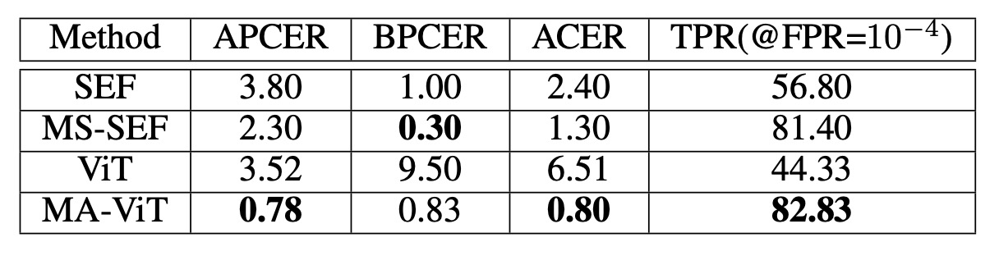
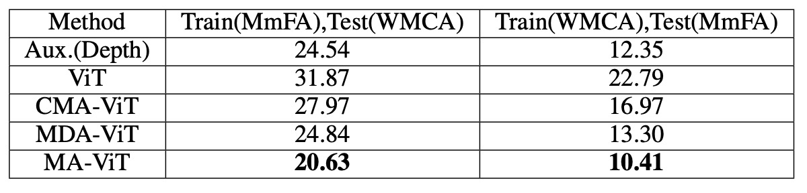
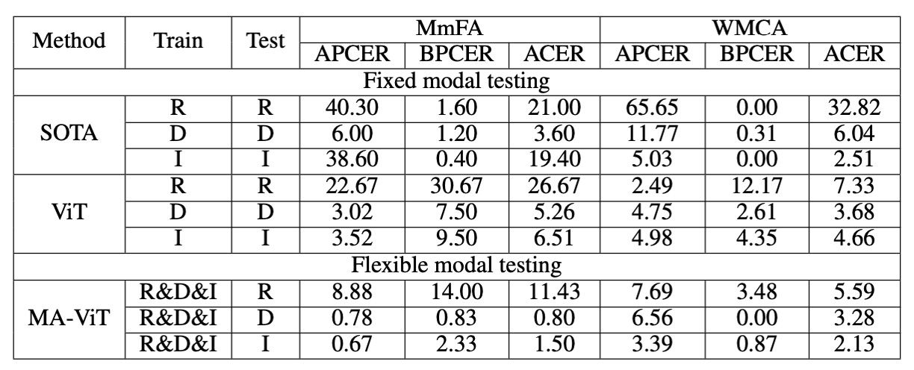

## 凡所有相，皆是虛妄

[**MA-ViT: Modality-Agnostic Vision Transformers for Face Anti-Spoofing**](https://arxiv.org/abs/2304.07549)

---

Face Anti-Spoofing（FAS）技術的初衷，是為了防堵那些以照片、影片或立體面具欺騙臉部辨識系統的攻擊手法。

這些攻擊被稱為 Presentation Attacks（PAs），隨著臉部辨識在金融支付、手機解鎖、自助通關等應用中普及，其安全性也成為現代生物辨識系統繞不開的考驗。

## 定義問題

最早的 FAS 方法，大多僅依賴 RGB 視覺資訊來偵測異常。

然而攻防博弈從未停歇，攻擊手段越來越真實，感測設備也日益多樣。我們開始引入紅外、深度、熱感等模態，企圖拼湊出一個「多光譜的真相」。

而模型架構也隨之演化：從 halfway fusion 的中層特徵拼接，到 late fusion 的決策階段融合，每種策略都試圖更穩固地重建「真假之界」。

問題卻也悄然浮現。

Halfway fusion 雖能強化不同模態特徵的交互學習，但其模型設計往往假設訓練與測試階段擁有一致的輸入模態，一旦某個感測器缺席，整體預測就可能崩潰。

Late fusion 雖保留各模態的獨立通道，使得在模態缺失時仍可執行推論，但其代價是參數倍增與推論延遲，不利於移動端或邊緣設備的部署。

更根本的瓶頸是：這些多模態方法，其實從未解決一個關鍵命題：

> **我們是否真的理解「什麼是跨模態共通的活體特徵」？**

或者說，模型是否真的在學習「臉的真偽」，而非僅僅記住了「模態的差異」？

於是，一個更激進的問題浮現：如果我們可以在訓練時使用多模態的知識，卻在測試時只需要任一模態的輸入，是否能打造出一個真正具備「模態無關性」的 FAS 系統？而這樣的系統，是否能在保持輕量、快速與靈活性的同時，仍保有對偽裝攻擊的敏銳判斷力？

這篇論文的作者對此提出了思考，並嘗試解決這些問題。

這次不是再一次將模態接上，而是先將它們拆開。

## 解決問題

由於傳統的 halfway 與 late fusion 方法不僅容易被模態缺失打斷，還引入過多運算負擔與模型複雜性。因此，作者希望在這裡可以設計出一種「模態不可知」的模型：

- 在訓練階段吸收多模態知識
- 在測試階段僅憑任一模態也能獨立完成預測

### 模型架構

<figure style={{"width": "90%"}}>

</figure>

整體架構如上圖所示，MA-ViT 是建立在單一 ViT 主幹的設計之上，包含三個關鍵模組：

1. **Multi-Modal Tokenization Module**（圖中左側）
2. **Transformer Encoder**（中央黃色與黑色箭頭所示）
3. **Modal Shared Classification Heads**（右側分類器）

不同於傳統多分支融合設計，MA-ViT 的關鍵創新在於將所有模態資料共用同一組 ViT 結構，透過一系列標準 Transformer Block（論文中簡稱 STB）和新增的「模態不可知」的 Transformer Block（Modality-Agnostic Transformer Block, MATB）交錯堆疊，共同提煉模態不可知的表徵。

上圖中黃色箭頭表示各模態獨立通過 STB 的路徑，黑灰色箭頭為其後續進入 MATB（MDA）的處理流程。

---

在 MA-ViT 的輸入端，無論是 RGB 或 Depth 的影像，都會先經過 **Multi-Modal Tokenization Module**。

如圖中左側所示，輸入影像被劃分為 patch，再轉換為向量 token（$x_\text{pat}$）。這些 patch token 會與兩個特殊 token 結合：

- **$x_\text{cls}$**：分類 token，最終承載真假預測任務。
- **$x_\text{mod}$**：模態 token，用來引導模型理解輸入的光譜性質。

整體序列經由位置嵌入（$x_\text{pos}$）與光譜嵌入（$x^i_\text{spe}$）加權後，組成初始輸入向量：

$$
z^i_0 = [x_\text{cls} \| x^i_\text{mod} \| x^i_\text{pat}] + (x_\text{pos} + x^i_\text{spe})
$$

這些 token 將進入後續的 Transformer Encoder 流程。

---

Transformer Encoder 每層由兩部分構成：

1.  **STB（Standard Transformer Block）**
    各模態獨立處理，如圖中黃色與黑灰箭頭所示，處理單一模態內部的局部特徵與上下文。

2.  **MATB（Modality-Agnostic Transformer Block）**
    接續 STB，每層 MATB 又細分為兩個注意力模組，具體實作細節可參考下圖：

    

     <figure style={{"width": "70%"}}>
     
     </figure>
     

    - **MDA：為了從模態中逃脫**

      **Modal-Disentangle Attention（MDA）** 的任務，是讓模型學會忽略那些過度依賴模態特徵的 patch，只專注於模態無關、但與真假辨識強相關的線索。

      如上圖左側所示，MDA 首先透過模態 token（MOD）與每個 patch token 的 dot product 計算模態關聯度：

      $$
      \text{map}_\text{mod} = \frac{q_\text{mod} (k^\text{pat}_\text{mod})^T}{\sqrt{D/h}}
      $$

      接著透過門檻函數 $\Gamma_\lambda(\cdot)$ 產生一個遮罩矩陣 $M$，標記出模態相關性過強的 token。接下來，在 CLS token 的注意力運算中，將這些 token 的關聯值設為極小，達到「斷開聯繫」的效果：

      $$
      \text{map}_\text{cls}' = \Gamma^0_M\left(\frac{q_\text{cls} (k^\text{pat}_\text{cls})^T}{\sqrt{D/h}}\right)
      $$

      最終的注意力結果僅關注模態無關的 patch：

      $$
      \text{MDA}(z^i) = \text{softmax}(\text{map}_\text{cls}') \cdot v^\text{pat}_\text{cls}
      $$

      這是一個「選擇性遺忘」的過程，不是讓模型記得一切，而是只記得它應該記住的部分。

      ***

    - **CMA：為了讓模態之間彼此照亮**

      **Cross-Modal Attention（CMA）** 的任務，則是反其道而行，透過不同模態間的交叉注意力，讓其中一種模態能從另一種模態中補充資訊。

      如上圖右側所示，以 RGB（$z^r$）與 Depth（$z^d$）為例，CMA 讓 $z^r$ 的查詢向量（$q_r$）對應 $z^d$ 的鍵值對進行注意力操作：

      $$
      A_{rd} = \text{softmax}\left( \frac{q_r k_d^T}{\sqrt{D/h}} \right), \quad \text{CMA}(z_r) = A_{rd} \cdot v_d
      $$

      反向也同理。這個步驟讓每個模態都能「借視角看世界」，讓看不見的特徵，透過另一模態的上下文被補上。

### 損失設計

為了實現「測試時僅用任一模態也能判斷」的設計，MA-ViT 採用模態共享的分類器，CLS token 預測真假，MOD token 預測模態，兩者損失共同優化：

$$
\begin{aligned}
L^i_\text{cls} &= \text{BCE}(\text{MLP}_\text{cls}(\text{LN}(z^i_{K, \text{cls}})), y_\text{cls}) \\
L^i_\text{mod} &= \text{BCE}(\text{MLP}_\text{mod}(\text{LN}(z^i_{K, \text{mod}})), y_\text{mod}) \\
L^i_\text{total} &= L^i_\text{cls} + L^{rd}_\text{cls} + L^i_\text{mod}
\end{aligned}
$$

這樣設計的分類器，可以在模態缺席的情境下，依然維持穩定判斷，避免因某一模態損壞而導致整體系統失效。

## 討論

為了驗證 MA-ViT 框架的有效性，作者設計了兩類評估場景：

1. **固定模態測試**：測試模態與訓練模態一致。
2. **彈性模態測試**：任一模態都可獨立推論。

此外，還包含跨資料集測試與消融實驗，逐步檢驗 MA-ViT 對模態資訊的拆解與轉譯能力。

### 固定模態場景

在傳統設定中，模型需在固定模態條件下完成推論，這也是過去方法的主要比較場景。

以 MmFA 為例，對比 baseline（無 MATB 的 ViT）與 SEF/MS-SEF 等多模態方法：

<figure style={{"width": "70%"}}>

</figure>

- ViT（無融合）表現不如傳統方法 SEF，顯示 Transformer 在無模態引導下難以判斷真偽。
- 引入 MATB 後，TPR 由 44.33% 提升至 82.83%，ACER 由 6.51% 降至 0.80%，全面超越 MS-SEF。

這表示 Transformer 做不好的原因是因為少了對模態的解構機制。

接著從 CeFA Protocol 的實驗來看：

<figure style={{"width": "70%"}}>

</figure>

在 Protocol 1、2 和 4 的實驗中，MA-ViT 分別將 ACER 降至 1.10%、0.10%、1.64%，全面勝過競爭對手 Hulking、Super、BOBO。

CeFA 的困難在於模態與族群變異同時存在，MA-ViT 在此情境下仍能穩定泛化，說明其具備高維特徵的共享能力。

最後檢視 WMCA 的表現：

在 WMCA 中，MA-ViT 不僅擊敗先前的最佳方法 CMFL（seen: 1.70%, unseen: 7.60%），更在「眼鏡」與「遮罩」這類 3D 特徵混雜攻擊下表現顯著優勢。這類攻擊難以單靠 RGB 或 Depth 捕捉異常，但 MA-ViT 能利用跨模態特徵補償，抓住局部 spoofing 痕跡。

### 跨資料集泛化能力

<figure style={{"width": "70%"}}>

</figure>

在 WMCA 測試集上，**MA-ViT 的 HTER 為 20.63%，優於 SOTA 方法的 24.54%**。當將 ViT 的 CMA 換成 MDA，誤差從 27.97% 降到 24.84%，顯示 **MDA 對泛化更具貢獻。**

這一點也呼應了模型設計初衷：**與其追求模態融合，不如先處理模態偏見。**

### 彈性模態場景

<figure style={{"width": "80%"}}>

</figure>

這是 MA-ViT 最具實用價值的部分。

在不重新訓練模型的前提下，MA-ViT 對每一模態的推論結果如下：

- **RGB**：11.43%（相較 MS-SEF 降低 9.57%）
- **Depth**：0.80%（相較 MS-SEF 降低 2.80%）
- **IR**：1.50%（相較 MS-SEF 降低 17.90%）

這說明 MATB 成功讓模型從訓練過程中獲得跨模態的表徵感知力，即使只看到單一模態，仍能借助「隱含在權重中」的多模態知識進行推論。

## 結論

本研究提出的 MA-ViT，是一個純 Transformer 架構的臉部防偽辨識系統。它不僅能處理任一模態的輸入，更能在模態不完整的條件下，依然穩定推論真假。

這項能力的關鍵，在於我們重新定義了模態的角色，透過 MATB 模組中兩個核心注意力機制：

- **MDA**：排除模態偏見，保留具鑑別性的活體特徵；
- **CMA**：跨模態互補，強化局部弱特徵的判斷力。

它的貢獻，不只是一個模型架構的改良，更是一種設計理念的轉向：

> **「與其記住模態，不如看見本質。」**

真正的模型，不應該依賴你給它什麼，而應該具備在「給什麼都能看懂什麼」的能力。
