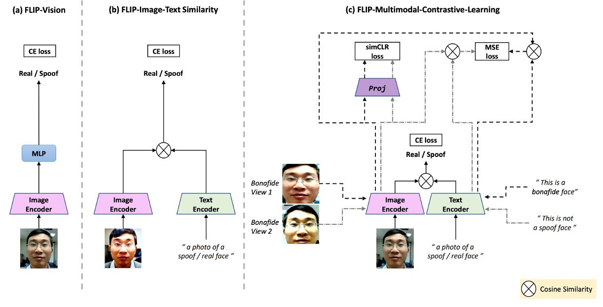
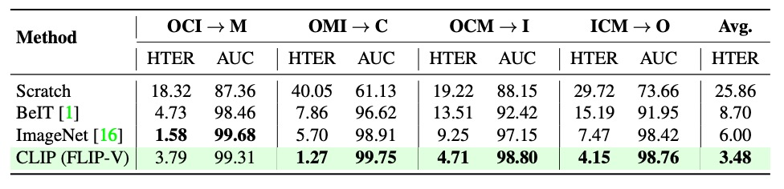

## 防禦咒

[**FLIP: Cross-domain Face Anti-spoofing with Language Guidance**](https://arxiv.org/abs/2309.16649)

---

「這是真的！」

吾以自然語言作為崇高的見證，模型如是說。

## 定義問題

在機場、手機、門禁與各種驗證節點中，臉早已成為最習以為常的辨識符號。

然而，這些系統仰賴的防偽模型（FAS），往往在跨裝置、跨攻擊形式、跨環境條件的測試下，顯現出意料之外的脆弱：

- 模型在熟悉的資料分布下表現良好，一旦離開訓練場景便大幅退化；
- 相機解析度、光照條件、甚至是攻擊方式的微調，都可能讓模型誤判虛構為真實；

最後，許多方法假設可取得目標域的樣本，但在實際應用中，這往往是一種奢求。畢竟誰也不知道下一次的攻擊會從何而來，用什麼方式。

同樣的話，我們已經聽了十幾年，卻依然無法解決這個問題。

這讓我們不得不重新思考一個根本性的提問：

> **在缺乏標註、未知類型的跨域場景中，模型能否依然保有對「活體」的感知？**

過去的嘗試，多半圍繞在三種策略中尋求解答：

- **無監督領域適應（UDA）**：倚賴未標記的目標資料協助決策邊界泛化；
- **少樣本學習（Few-shot Learning）**：以少量目標標註樣本快速調整表徵；
- **領域泛化（Domain Generalization）**：試圖從多源域中學出攻擊無關的辨識特徵。

然而，這些方法多半假設模型可以接觸到目標域，或者仰賴非平凡的輔助資訊，例如攻擊類型、風格標籤、甚至特殊模組的加入。這使得「零樣本遷移」始終是個既理想、又棘手的命題。

這篇論文的作者，則提出了一個更為激進的思考：

- 如果我們把預訓練的 ViT 換成來自 CLIP 這類多模態模型，會不會天然就更能跨域？
- 如果語言本身能成為一種「風格中立」的描述輔助，那麼它是否能引導模型學出語義層次的防偽直覺？
- 若圖像與文字不只是配對，而是在學習過程中共同編碼其「真實性」，那麼模型對於真實是否會有更深的理解？

這些問題所隱含的，不僅是資料的結構問題，更是表徵的語義深度問題。模型所要學習的，不只是特徵，而是如何從「描述」中認出一張臉的組成是否真實。

而這一切，都從一句話開始：

> **_“This is not a spoof face.”_**

---

## 解決問題

等等，你說你還不知道什麼是 CLIP？

那我們先簡單介紹一下：

假設我們有一組圖像-文字對，其中一對可能是一張狗的圖片和文字「一隻可愛的小狗」。

在一個訓練批次中，CLIP 會接收到多個這樣的對。圖像編碼器可能透過 ResNet 或 ViT 來處理圖像，獲取圖像特徵，而文本編碼器可能透過 Transformer 來處理文本，獲取文字特徵。

然後，模型會比較這些特徵，以確保正確配對的圖像和文字（例如：狗的圖像和「一隻可愛的小狗」的文字）之間的餘弦相似度最大，而錯誤配對的圖像和文字（ 例如：狗的圖像和「一個蘋果」的文字）之間的餘弦相似度最小。

最後，使用 4 億組圖像文本對，進行訓練。

非常簡單的概念，效果也非常好，而這個架構的成功也開啟了一個新世代的潮流。

:::tip
更詳細節介紹，可以參考我們之前讀過的文章：

- [**[21.03] CLIP: 打碎次元的屏障**](../../multimodality/2103-clip/index.md)
  :::

### 模型架構

<figure style={{"width": "90%"}}>

</figure>

上圖是本篇論文的研究架構，對應如下：

- **(a) FLIP-Vision**：單純使用 CLIP 的 vision encoder + MLP，為 baseline 架構。
- **(b) FLIP-IT**：導入文字描述作為類別對應，使用 cosine 相似度作為分類基準。
- **(c) FLIP-MCL**：多模態正則化下的進化版本，讓模型從更多視角、自我驗證中學習一致的跨域表徵。

這是個基於 CLIP 的多模態對比學習架構，我們來看一下到底該怎麼把 CLIP 的知識轉移到我們希望解決的問題上。

### FLIP-Vision

剛才提到，由於 CLIP 在大規模網路圖文資料上預訓練，因此能在許多自然影像任務（例如分類、物件偵測、影像分割等）展現良好的即時遷移效果。

但是，由於 FAS 任務需要辨別「非常微小」的差異（如紙張反光、螢幕螢幕紋理、翻拍失真等），因此 CLIP 特徵沒辦法直接套用。

因此，作者提出 FLIP-Vision（FLIP-V）作為 baseline 模型，採取一個極簡的轉換策略：

- 保留 CLIP 的 **影像編碼器（image encoder）**；
- 捨棄文字編碼器，僅使用 CLIP 的 ViT 結構做特徵抽取；
- 將最後一層 Transformer block 的 **class token** 輸出，接上一個 **多層感知器（MLP）** 頭部進行二分類；
- 使用標準的 Cross Entropy Loss 進行訓練，區分真臉與假臉。

這樣的設計可以視為一種「語言蒸餾後的視覺微調」，它承襲了 CLIP 在多模態世界中學得的強大表徵，但刻意去除語言干擾，專注調整視覺編碼器在細節級別的感知能力。

訓練時，作者使用來自多個來源域的平衡影像資料，讓模型在不同風格、攻擊樣態與拍攝條件中學習判斷依據。

而這個過程中，仍是一個純監督式的訓練流程，沒有引入任何語言提示或語義線索。

因此，FLIP-V 實際上只是證明了一件事情：

> **即使不靠語言，CLIP 的視覺 backbone 也比傳統 ViT 更具有泛化潛力。**

### FLIP-Image-Text

FLIP-Vision 的基礎版本，雖然已經證明 CLIP 的視覺編碼器在 FAS 任務上具有一定遷移潛力，但其本質仍是「視覺單模態」的分類器。

這樣的設計，依舊侷限在「辨識特徵」的框架內，並未發揮 CLIP 最初的設計精神，也就是讓語言成為視覺的引導與判別基準。

於是，作者接著引入 FLIP-IT 的概念。

這一版本的核心想法，是以自然語言句子作為「語義錨點」，讓模型在學習過程中，直接比較影像特徵與語言描述之間的對齊程度，而不是僅透過圖像間的分類邊界進行學習。

這裡的設計不再使用傳統的 MLP 頭部來判別圖像真偽，而是讓每一張圖像去「選擇一段更相似的描述」。

這麼做的核心邏輯，是把每一個類別（real / spoof）以一句自然語言句子來代表，然後使用 CLIP 的文字編碼器（text encoder）來轉換這些句子為向量表示 $\vec{z}_r$ 和 $\vec{z}_s$，接著與圖像向量 $\vec{x}$ 計算餘弦相似度，作為模型的預測依據。

也就是說模型不是判斷圖像屬於哪一類，而是判斷圖像「比較像哪一段文字」。

由於語言空間比標籤空間要「寬廣」得多，它允許一個類別被多種語意敘述所表示，並且透過語言層級的抽象，對跨域變異展現更強的容忍力。

作者在實驗中設計了多組語句來描述真實與攻擊類別，總共六組，如下表所示：

| Prompt No. | Real Prompts                       | Spoof Prompts                        |
| ---------- | ---------------------------------- | ------------------------------------ |
| P1         | This is an example of a real face  | This is an example of a spoof face   |
| P2         | This is a bonafide face            | This is an example of an attack face |
| P3         | This is a real face                | This is not a real face              |
| P4         | This is how a real face looks like | This is how a spoof face looks like  |
| P5         | A photo of a real face             | A photo of a spoof face              |
| P6         | This is not a spoof face           | A printout shown to be a spoof face  |

這些句子代表了不同層次的語言策略：

- 有些強調正面描述（如 P2：「This is a bonafide face」）；
- 有些採用否定結構（如 P3：「This is not a real face」）；
- 有些更像圖像標題（如 P5：「A photo of a real face」）；
- 也有些接近語意反諷（如 P6：「This is not a spoof face」）。

這些描述組成一組「語言上下文提示集（context prompts）」，作者使用多組提示（P=6）進行平均嵌入，以取得更穩定、更具概括性的語言表示 $\bar{z}$，來與圖像特徵進行對齊學習。

這個機制，實質上讓語言的多樣性變成模型訓練的一種資料擴增手段，語言的多樣化能幫助模型學會更穩健的決策邊界。

### FLIP-Multimodal-Contrastive-Learning

前面我們已經看見了語言如何從「標註」轉化為「分類器」，FLIP-IT 的架構讓模型直接對齊語意描述，從而學會辨識真偽。但這樣的對齊，仍舊建立在單一配對關係上，缺乏對於變異與不確定性的韌性。

最後，作者提出了 FLIP-MCL（FLIP-Multimodal Contrastive Learning）。

FLIP-MCL 的核心精神是將對比學習（Contrastive Learning）引入多模態架構之中，讓模型不只看見對應，更看見「不變」的部分。

作者將整體訓練目標拓展為三個部分：

1. **分類損失 $L_{ce}$**：延續前節 FLIP-IT 的餘弦相似度和交叉熵損失；
2. **圖像間的對比損失 $L_{simCLR}$**：強化模型在不同視角下對圖像內容的一致認知；
3. **圖像與語言對的相似度一致性 $L_{mse}$**：進一步促進圖文語境的語義穩定。

---

先來看看 simCLR 的部分。

在圖像特徵的學習上，作者借用了經典的 simCLR 對比學習框架。對於每一張輸入圖像 $I$，隨機生成兩個轉換視角（如不同光照、遮罩、裁切等），分別記為 $I^{v_1}$ 與 $I^{v_2}$。

接著經由 CLIP 的影像編碼器 $V$ 抽取特徵：

$$
\vec{x}^{v_1} = \mathcal{V}(I^{v_1}), \quad \vec{x}^{v_2} = \mathcal{V}(I^{v_2})
$$

再透過一個非線性的投影頭 $\mathcal{H}$ 轉換至對比空間：

$$
\vec{h}_1 = \mathcal{H}(\vec{x}^{v_1}), \quad \vec{h}_2 = \mathcal{H}(\vec{x}^{v_2})
$$

最後施加 simCLR 對比損失 $L_{simCLR}$，鼓勵模型在不同視角下抽出的特徵能靠近彼此，達成內容一致性的學習效果。

---

接著是 MSE 的部分。

在語言層面，FLIP-MCL 更進一步從「語句多樣性」中抽取一致訊號。每一類別都有多組自然語言提示，因此可以從中隨機抽出兩句描述 $\vec{z}^{v_1}$ 與 $\vec{z}^{v_2}$，然後與圖像的兩個視角形成配對。

此時，對於 $(\vec{x}^{v_1}, \vec{z}^{v_1})$ 和 $(\vec{x}^{v_2}, \vec{z}^{v_2})$，我們計算它們之間的餘弦相似度，並用 MSE 損失讓這兩個相似度接近：

$$
L_{mse} = \left(\text{sim}(\vec{x}^{v_1}, \vec{z}^{v_1}) - \text{sim}(\vec{x}^{v_2}, \vec{z}^{v_2})\right)^2
$$

這就像是在告訴模型：

> **無論你看的是哪個角度、聽的是哪句話，你應該感覺到「它就是那個真臉」。**

---

最終，作者將三個目標函數整合為總損失：

$$
L_{mcl} = L_{ce} + L_{simCLR} + L_{mse}
$$

而在推論階段，模型仍使用與 FLIP-IT 相同的餘弦相似度的方法，選擇最相符的自然語言描述作為預測依據，實現無需修改的語言驅動分類流程。

## 討論

本研究採用三種跨域測試協定進行評估：

- **Protocol 1** 採用 MSU-MFSD、CASIA-MFSD、Idiap Replay Attack 與 OULU-NPU 四個經典資料集，依據 leave-one-domain-out 的設定，每次留一個資料集作為目標域，其餘作為訓練來源。
- **Protocol 2** 使用三個大規模臉部防偽資料集：WMCA、CASIA-CeFA、CASIA-SURF，同樣採用 leave-one-out 策略，以驗證方法在跨裝置與複雜環境變化下的泛化能力。
- **Protocol 3** 則為單源訓練至單一目標域的情境，選自上述 MCIO 四個資料集進行 12 組配對測試，主要用於模擬實務中資料來源受限的場景。

模型效能評估指標包含：

- Half-Total Error Rate（HTER，越低越好）
- Receiver Operating Characteristic 曲線下面積（AUC，越高越好）
- 在 FPR = 1% 條件下的 True Positive Rate（TPR，越高越好）。

所有實驗皆重複執行 5 次，並回報平均結果以提升統計穩定性。

### Protocol 1：MCIO 四域

從上表中可以觀察到三個主要趨勢：

首先，**FLIP-V（視覺微調）** 已在多數測試域（特別是 C 與 O）超越傳統 ViT 架構，證明多模態預訓練模型即使在單一模態微調時仍具有良好的結構泛化能力。這與先前文獻中指出「完整微調會削弱 ViT 的跨域性能」的看法形成對比。

其次，**FLIP-IT（語言監督）** 進一步提升了模型在目標域 C、I、O 上的表現，特別是在 TPR@FPR=1% 指標上呈現大幅提升，顯示語言提示在資料量受限時可有效強化語義層級的判斷依據。

最後，**FLIP-MCL（多模態對比學習）** 展現最穩定且全面的優勢，不僅在三個目標域皆取得最低 HTER，同時於 AUC 與 TPR 指標上明顯優於先前所有 zero-shot 方法，甚至在 C 與 O 域超越 ViTAF 所呈現的 five-shot 成績。

唯一例外為 M 域略微退步，推測主因來自資料中部分真實樣本被誤判為攻擊，導致假陰性比例上升。

整體而言，Protocol 1 的結果強化了本文架構的主要論點：透過語言描述與對比學習引導的多模態特徵表示，能顯著提升模型在未知域上的辨識能力，並有效緩解 domain shift 與資料稀疏問題。

### Protocol 2：WCS 三域

Protocol 2 進一步將實驗擴展至三個規模更大、環境條件更複雜的資料集：WMCA（W）、CASIA-CeFA（C）與 CASIA-SURF（S）。這些資料集涵蓋超過千位不同受試者，並包含多樣化的攻擊類型與感測器配置，因此更貼近真實部署情境。

從上表可見，**FLIP-V** 在此協定中已展現不錯的 zero-shot 遷移能力，相較基線 ViT 明顯下降 HTER，平均提升幅度介於 +1.5 至 +3.5 個百分點之間，顯示 CLIP-ViT 的視覺特徵具有一定的跨設備與跨攻擊模式的泛化穩定性。

**FLIP-IT** 在 W 與 C 兩個目標域進一步提升 TPR\@FPR=1%，分別達到 +10.25 與 +11.41 的增幅。但在 CW → S 的情境下，其性能略低於 FLIP-V，可能原因在於該目標域攻擊類型或影像質地與語言提示之語義預期存在偏差，導致圖文對齊效果減弱。

最顯著的改進仍來自 **FLIP-MCL**：透過引入 simCLR 與圖文一致性學習，FLIP-MCL 在三個目標域皆取得最優 HTER 與 TPR 表現，AUC 同樣維持高水準，證明其在高變異資料分布下仍能學得具備語義穩定性的區辨特徵。

相較於 Protocol 1，這一組協定中的 domain gap 主要來自「感測裝置」與「人臉條件」的自然多樣性，而非拍攝流程或語言標註，因此結果亦顯示：**語言監督與對比學習不僅能應對風格轉移，也能處理受試者與裝置層級的分布偏移**。

### Protocol 3：單源 → 單目標

Protocol 3 模擬一個極端但常見的實務情境：在資源受限的情況下，訓練資料僅來自單一來源域（source domain），並需直接推論另一個未見過的目標域（target domain）。

以 MSU-MFSD（M）、CASIA-MFSD（C）、Idiap Replay（I）與 OULU-NPU（O）四個資料集為基礎，總共設計了 12 組跨域配對任務，強調模型在資料不足與 domain shift 雙重壓力下的泛化能力。

實驗結果顯示：

首先，**FLIP-V** 雖為最基礎變體，仍普遍優於先前所有 zero-shot 方法，平均 HTER 下降 3 ～ 6 個百分點，顯示多模態預訓練所學到的視覺表徵具備相當穩健性。

然而，**FLIP-MCL** 在此協定中的表現尤為突出，平均 HTER 改進幅度高達 **+8.36**，在多組高難度任務上展現壓倒性優勢。例如：

- 以 I 作為來源，目標為 O 時，HTER 降幅高達 **26%**；
- C → O 與 M → C 組合亦分別取得 **+25.7%** 與 **+11.2%** 的顯著提升；
- 少數場景（如 O → M）表現略低於 SOTA，但整體仍維持最佳平均表現。

此結果進一步驗證多模態對比學習策略（FLIP-MCL）對於樣本數不足、語境失配與樣態漂移等問題具備強健的調適能力。simCLR 提供圖像層級的特徵穩定性，語句平均化與 MSE 損失則從語義層次維持圖文對齊一致性，使模型即便面對單一來源訓練，亦能建立穩定的跨域判斷邏輯。

整體而言，Protocol 3 的結果凸顯了 FLIP 架構在極低資源情境中的實用價值，特別是在缺乏目標域樣本的預部署階段，仍能維持高度可靠的防偽性能。

### 預訓練策略

<figure style={{"width": "90%"}}>

</figure>

為釐清初始化策略對跨域防偽泛化能力的影響，作者比較了多種 ViT 初始化方式。包括從頭訓練（無預訓練）、以自監督方法（如 BeIT）進行預訓練、使用 ImageNet 分類任務的預訓練模型，以及來自 CLIP 的多模態預訓練權重。

從上表可觀察到，**CLIP 初始化在所有跨域任務中皆呈現最佳表現**，其優勢並非來自於單一模態的強化，而是來自於圖文共同對齊的語義結構能力，使其成為 FLIP 全系列方法的最優起點。

### 語句提示設計

<figure style={{"width": "90%"}}>

</figure>

在語言監督架構（如 FLIP-IT、FLIP-MCL）中，文本提示的撰寫對分類性能具有明顯影響。

上表展示了不同語句設計在多組跨域場景中的表現差異，顯示「不存在單一通用最優提示句」，各場景對語義敘述的依賴存在風格差。

此外，作者比較了單句與多句平均策略的差異，發現**使用多組語句的嵌入平均（prompt ensemble）能有效穩定模型決策，減少單句語義偏差帶來的影響**。

這也驗證了語言 supervision 不應被簡化為靜態標籤，而應視為可調節的語義空間參數。

### 多損失組合的權重分析

<figure style={{"width": "70%"}}>

</figure>

FLIP-MCL 採用三重損失函數聯合訓練，分別為監督式的 Cross Entropy，以及自監督的 simCLR 和圖文相似度一致性（MSE）。為驗證各損失項的貢獻，作者調整其加權組合，結果如上表所示。

可以發現，**完全排除任一自監督損失（將 simCLR 或 MSE 權重設為 0）皆會導致性能下降**，證明這兩者在學習穩定特徵與跨域對齊上具有實質貢獻。然而，若過度放大自監督項（例如權重比為 1:5:5），反而會稀釋分類目標本身，導致準確率下滑。

這說明三損合一設計的關鍵，不在於強化個別模組，而在於**以適當比例整合自監督與監督學習，共同促進語義與視覺的一致性學習。**

## 結論

在過去多數方法仍困於視覺特徵的堆疊與資料集的輪替時，作者選擇嘗試一條新的路：

> **從 CLIP 這類多模態基礎模型出發，導入語言作為判斷的語義錨點。**

並在此基礎上疊加視覺與語言間的對比學習框架，建立起一套以語義對齊為核心的防偽策略。

這個選擇帶來了幾個重要啟示：

1. **多模態預訓模型所學得的表示，具有極強的跨域潛力**。

   即便只微調其中的影像編碼器，亦能顯著提升泛化性能，顯示這些模型所內嵌的語義空間結構遠比傳統 ImageNet 模型來得更具遷移性。

2. **語言不再只是輔助的註解，而是一種可學習的分類基準**。

   透過語句所定義的類別語境，模型能學會「這是什麼樣的真實」，而不只是從像素判斷「這看起來真不真」。

3. **多模態對比學習提供一種更通用的正則化策略**。

   在缺乏標註與樣本多樣性的場景中，它能幫助模型對齊多種視覺語境與語義解釋，提升模型在極端 domain shift 下的穩定性。

儘管 FLIP-MCL 架構在訓練階段需引入額外的語言編碼器，增加了部分計算負擔，但實驗結果證明，這樣的成本換來的是顯著的效能提升與跨場景適應能力。

在未來面對更多複合型、多源資料的任務中，語言有可能成為深度模型泛化的關鍵媒介。
