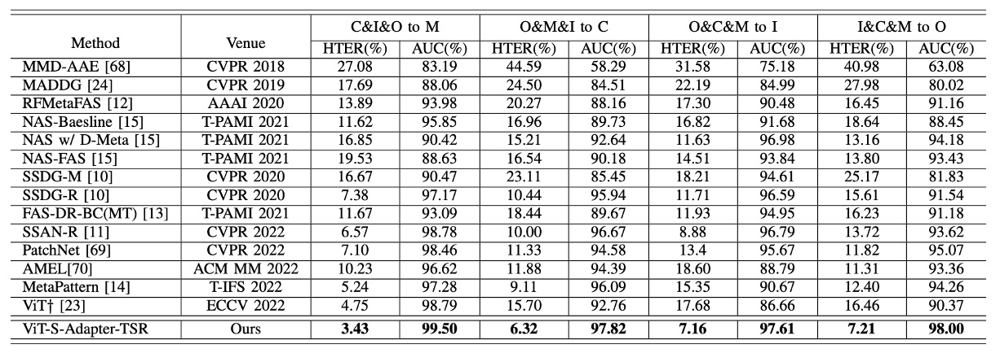
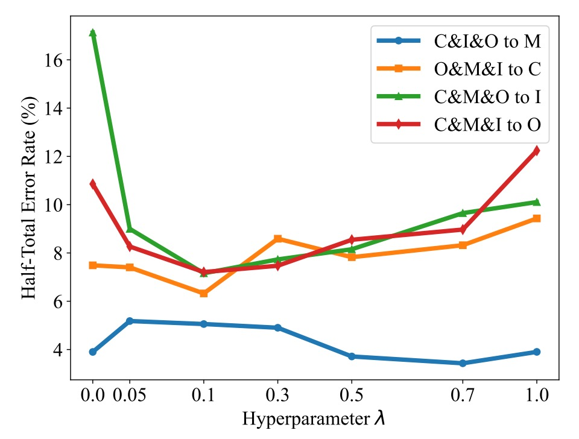

## 真實筆記本

[**S-Adapter: Generalizing Vision Transformer for Face Anti-Spoofing with Statistical Tokens**](https://arxiv.org/abs/2309.04038)

---

Adapter 是一種輕量級的模型調整方法，通常在預訓練的 Transformer 模型上加上一些額外的參數，這些參數可以在特定任務上進行微調，而不需要重新訓練整個模型。

如果 Transformer 是近年的視覺主角，那麼 adapter 就是它穿插於任務間的角色調整器。

:::tip
如果你不熟悉這個概念，可以參考我們之前論文筆記：

- [**[19.02] Adapter: 參數節省九成六**](../../model-tuning/1902-adapter/index.md)
  :::

## 定義問題

我們一路看下來，大概也知道 FAS 的模型有多難搞。

不只是要判斷「這張臉是真的還是假的」，還得判斷得夠穩定。至少不能因為換了個燈光、換了台鏡頭、換了種攻擊方式，就徑直倒在地上。

模型故障的原因，通常不是因為模型不夠強，而是因為每次訓練時，它習慣的那個世界太小了。就好比說你在室內拍了幾千張真臉照片，結果部署之後，使用者在大太陽底下拿著手機刷臉，模型瞬間炸開。這時候不管你再怎麼 fine-tune、再怎麼疊模型，**domain shift** 這件事還是會讓泛化能力破功。

於是我們看見了各種解法：有人用對抗學習做風格轉換，有人用 meta-learning 模擬未知場景，有人試著把真臉壓得更近，把假臉拉得更開。但這些方法的泛化能力，始終差一點火候，尤其是在 **zero-shot** 測試上，問題特別明顯。

後來出現了 ViT，大家都很期待。

畢竟，Transformer 的注意力機制能處理遠距離資訊、架構又靈活，似乎天生就適合做這種跨環境變動強烈的任務。

但問題又來了。

雖然我們可以拿 ImageNet 的 ViT 預訓練模型來微調，也的確比 CNN 效果好一點，但也就真的只是「一點」。而且，有時候在少樣本（few-shot）甚至零樣本（zero-shot）的條件下，ViT 的泛化表現反而不如一些 CNN-based 的 baseline。

這背後可能是個更根本的問題：

- **Transformer 看得夠遠，但它看得夠細嗎？**
- **它能不能辨識那些肉眼難辨的小紋理、局部瑕疵、與攻擊介質留下的破綻？**

還是說，我們其實太快就假設它能理解這些「風格以外的東西」？

## 解決問題

讓 ViT 去做 FAS，第一步通常是：拿一個 ImageNet 預訓練模型來微調。

但你手邊沒有八張高階 GPU，還真拿 ViT 沒辦法。這時就有人想到，用 Adapter 的方式來插入小模組，只訓練那幾個 task-specific 的層，其他全部凍結。

這種方式叫 Efficient Parameter Transfer Learning（EPTL），例如 Adapter、LoRA、Prompt-tuning 都屬於這個範疇。

在 ViT 裡，我們可以把每一個 block 簡化寫成這樣的推論過程（略去 LayerNorm 和跳接）：

$$
Y = W_i^{\text{MLP}}(W_i^{\text{MSA}}(X))
$$

這邊的 $X$ 和 $Y$ 是 transformer block 的輸入輸出 token，MSA 表示多頭自注意力層，MLP 是多層感知機。如果我們使用 Adapter，在每個 block 加上小模組，結構會變成：

$$
Y = A_i^{\text{MLP}}(W_i^{\text{MLP}}(A_i^{\text{MSA}}(W_i^{\text{MSA}}(X))))
$$

這裡的 $A_i^{\text{MSA}}$ 和 $A_i^{\text{MLP}}$ 就是插入的 Adapter。原本的 ViT 權重 $W$ 全部凍結，只訓練 Adapter 的參數，達成「省資源、小改動」的目標。

但是這樣的 Adapter 架構，在自然語言任務裡表現不錯，在 FAS 上卻顯得力不從心。

原因也不難理解：一般的 Adapter 用的是 linear 層，**沒有空間結構的 inductive bias**；

但 FAS 任務正好相反，它非常吃「**局部細節**」，像是畫質破綻、邊緣模糊、重建噪點這些都不是 global token 看得出來的。

## 模型架構

<figure style={{"width": "90%"}}>

</figure>

為了解決 Transformer 無法有效捕捉局部紋理特徵的問題，作者提出了 **S-Adapter**。

靈感來自傳統的紋理分析方法 Local Binary Pattern（LBP），如上圖 (a) 所示。

LBP 的流程並不是直接拿畫素值來分類，而是先提取局部紋理，然後統計直方圖。這種統計特徵對於光照變化、材質差異具有較高的穩健性，在早期的人臉偵測、活體辨識任務中被廣泛使用。

S-Adapter 的設計，就是把這個邏輯重新翻譯進 Transformer 世界：

> **讓 ViT 的 token 也能學會統計，從局部紋理萃取空間分佈特徵。**

整體結構如下：

<figure style={{"width": "90%"}}>

</figure>

整個模組分為兩個階段：**Token Map Extraction** 與 **Token Histogram Extraction**。

### Token Map Extraction

在 FAS 場景中，判斷攻擊與否的關鍵，往往藏在局部細節上。

這些細節可能是重新拍攝時產生的模糊、邊緣破綻、細小紋理異常，而這些特徵，很難靠 Transformer 原生的全域注意力捕捉到。

然而，ViT 在做自注意力之前，輸入的 token 已經被攤平成一維序列，失去了空間結構。

因此，**第一步**，作者設計了一個過程來還原 token 的空間性質：

- 給定輸入 token $X \in \mathbb{R}^{N_P \times C}$，其中 $N_P$ 是 patch token 數量（class token 忽略），$C$ 是嵌入維度；
- 重塑（reshape）成 $X_R \in \mathbb{R}^{H \times W \times C}$，使得 $H \times W = N_P$；
- 再將維度置換（permute）成 $X_M \in \mathbb{R}^{C \times H \times W}$，類似一張 $C$-通道的影像。

接下來，透過 2D 卷積層 $W_\text{Conv}$，進行局部特徵提取：

$$
Z = W_{\text{Conv}}(X_M)
$$

這一步重新引入了空間歸納偏置，補足 Transformer 缺少局部建模能力的弱點。

為了讓模型更加敏感於局部變化，作者引入了中心差分（Center Difference, CD）操作：

- 對每個 token $Z_n$，計算其與周圍鄰居 $P_n$ 的差分；
- 以卷積核權重 $\omega(p)$ 加權總和：

$$
Z^g_n = \sum_{p \in P_n} \omega(p) \cdot (Z_p - Z_n)
$$

這樣得到的 $Z^g$ 捕捉到了細緻的局部梯度特徵，特別是針對那些微妙的紋理改變。

最終，原始特徵 $Z$ 與梯度特徵 $Z^g$ 融合，形成新的 token map：

$$
Z^* = (1 - \theta) Z + \theta Z^g
$$

其中 $\theta$ 控制兩者融合的比例。這樣即使是在 ViT 中，也能導入類似 CNN 的局部特徵敏感性。

### Token Histogram Extraction

即使加了局部特徵，domain shift（跨裝置、跨光照）仍然會讓模型表現不穩。

原因在於：局部畫素值本身，仍然容易受到環境因素干擾。

因此，第二步，作者決定進一步將這些局部特徵統計化，對每個小區域計算 differentiable histogram。

直觀來說就是：

- 對每個 patch 內的 feature 分佈做 soft binning；
- 取得一個統計向量，而不是單一畫素值；
- 讓模型學到局部區域的整體結構分佈，而非單點數值，提升跨域穩定性。

計算過程如下：

首先，定義 bin center $\mu$ 與 bin width $\gamma$，那麼 soft-binned histogram 為：

$$
Z_{\text{Hist}}^{c,h,w}
= \frac{1}{JK} \sum_{j=1}^{J} \sum_{k=1}^{K} \exp \Bigl( -\gamma_c^2 (Z^*_{c,h+j,w+k} - \mu_c)^2 \Bigr)
$$

其中：

- $J = K = 3$，即 3x3 卷積視窗；
- stride = 1，padding = 1，確保尺寸不變。

這裡的 soft binning，讓靠近 bin center 的值貢獻大，離得遠的貢獻小，實現可微分。

進一步拆解為：

$$
Z_{\text{Hist}}^{c,h,w}
= \frac{1}{JK} \sum_{j=1}^{J} \sum_{k=1}^{K} \exp (-U_c^2)
$$

$$
U_c = \gamma_c (Z^*_{c,h+j,w+k} - \mu_c)
$$

其中 $U_c$ 可以用兩層 pixel-wise 1x1 卷積來實現：

- 第一層 $W_{\text{Conv1}}$：權重固定為 1，bias 可學（對應 $-\mu$）；
- 第二層 $W_{\text{Conv2}}$：bias 固定為 0，權重可學（對應 $\gamma$）。

如此設計，可以讓 bin center 與 bin width 都通過訓練自動調整。

最後，histogram 結果 $Z_\text{Hist}$ 被 reshape 成 $N_P \times 8$ 的 token，並投影回 $N_P \times 768$，與原始 token 對齊融合。

### Gram Matrix

在深度學習的語境中，我們可以把影像特徵粗略區分成兩類：

- **Content**：跟任務有關的本質資訊，像是紋理破綻、模糊邊緣、重組痕跡等；
- **Style**：跟影像拍攝環境有關的風格特徵，例如光照、飽和度、色彩偏移、雜訊分佈等。

過去也有很多方法試圖用 adversarial learning 來做 feature disentanglement，把這兩種資訊拆開。但那類方法常常不穩定、難以收斂，尤其在 cross-domain 任務上，收斂速度與穩定性都是挑戰。

這篇論文採取了一種更直觀的做法：**既然我們知道 style 可以用 Gram matrix 表示，那就直接對 Gram matrix 做正則化。**

首先，作者定義了 token map $Z \in \mathbb{R}^{C \times H \times W}$ 的 Gram matrix，如下：

$$
G(Z)_{k,k'} = \frac{1}{CHW} \sum_{h=1}^H \sum_{w=1}^W Z_{k,h,w} \cdot Z_{k',h,w}
$$

這裡 $Z_{k,h,w}$ 是第 $k$ 個 channel、在空間位置 $(h,w)$ 的值；而 $G(Z)$ 表示每一對 channel 特徵之間的共變結構，代表這張圖的「風格」。

在作者的設計中，不是要求所有影像風格一致，而是只針對 **bonafide（真實）樣本之間的風格一致性**做正則化。

這樣的設計有兩個好處：

1. 不會干涉攻擊樣本的風格表徵，避免模糊正負樣本的界線；
2. 符合現實假設：**bonafide 是「來自真實世界」的統一分佈，而攻擊可以來自任何地方。**

給定來自兩個 domain 的 bonafide token maps，分別為 $Z_{D1}$ 與 $Z_{D2}$，風格正則化損失定義為：

$$
\mathcal{L}_{\text{TSR}} = \left\| G(Z_{D1}) - G(Z_{D2}) \right\|_F^2
$$

這代表兩個 bonafide 樣本的 Gram matrix 差異越小，風格越一致，模型越能專注在內容特徵上學習。

下圖是這個設計邏輯：

<figure style={{"width": "90%"}}>

</figure>

將不同 domain 的 bonafide 樣本對齊其風格，但不對 spoof 攻擊樣本做額外約束，保留其辨識性。

除了 TSR，模型最終還是要能分辨真與假，因此作者使用了常見的 BCE：

$$
\mathcal{L}_{\text{BCE}} = - \left[ y \cdot \log(\hat{y}) + (1 - y) \cdot \log(1 - \hat{y}) \right]
$$

在多個 domain 的情況下，會將所有 bonafide domain 組合進行平均：

$$
\mathcal{L}_{\text{TSR}}^{\text{avg}} = \frac{1}{N} \sum_{(D_i, D_j)} \left\| G(Z_{D_i}) - G(Z_{D_j}) \right\|_F^2
$$

最後總損失：

$$
\mathcal{L}_{\text{total}} = \mathcal{L}_{\text{BCE}} + \lambda \cdot \mathcal{L}_{\text{TSR}}^{\text{avg}}
$$

其中 $\lambda$ 是一個超參數，控制風格正則化對整體訓練的影響程度。

## 討論

這一節，我們來看看 S-Adapter 在各種實驗設定下的表現。

作者進行了四種不同類型的評估：

- Intra-Domain 測試（單資料集內訓練測試）
- Cross-Domain 測試（跨資料集）
- Few-Shot Cross-Domain 測試（少量目標資料）
- Unseen Attack 測試（未見過攻擊類型）

搭配使用的資料集包括 CASIA-FASD、Replay Attack、MSU MFSD、OULU-NPU 和 SiW-M。
評估指標則涵蓋 HTER、ACER、EER、AUC，以及在 FPR = 1% 時的 TPR。

### Intra-Domain 測試

作者在 OULU-NPU 的四個標準協定上，對比現有方法的表現，如下表：

<figure style={{"width": "60%"}}>

</figure>

從表可以看到，在 ACER 這個指標上，S-Adapter 在大部分協定中都達成了最佳或近最佳成績。這意味著，即使只是單資料集內的訓練與測試，**引入統計特徵與局部感知** 的設計，也能有效提升分類器對真臉與假臉細節的敏感度。

不過，單看 Intra-Domain 並不足以證明泛化能力。

### Cross-Domain 測試

Cross-Domain 測試採用的是經典的 MICO 協定（CASIA-FASD、Replay-Attack、MSU-MFSD、OULU-NPU 四個資料集互留一測）。

結果如下表：

<figure style={{"width": "90%"}}>

</figure>

可以看到，無論是以 HTER（半總錯誤率）還是 AUC（ROC 曲線下的面積）來看，**S-Adapter 都在四種 leave-one-out 測試中全面勝過 ViT† baseline**，也壓過多個近年 SoTA 方法，如 SSAN-R、MettaPattern 等。

這再次呼應了前面設計的核心精神：**不只是微調 ViT，而是針對 FAS 任務特性，增強了局部辨識與風格抗干擾能力。**

### Limited Source Domains 測試

在現實中，蒐集跨域資料集不是件容易的事。

因此，作者進一步測試在「只用兩個來源資料集」（例如 MSU + Replay）訓練時，模型是否還能維持跨域表現。

結果列在下表：

<figure style={{"width": "90%"}}>

</figure>

即使只用兩個來源，S-Adapter 仍然在 "M&I to C" 等場景中，**明顯超越其他方法（如 AMEL）**，證明了在資料量受限的情況下也有很好的穩健性。

## 消融實驗

最後，作者透過消融實驗，具體檢驗 S-Adapter 和 TSR 各自的貢獻。

### S-Adapter 組件的效益

首先，作者檢驗了不同版本的 S-Adapter：

- **S-Adapter**（完整版本）
- **S-Adapter w/o hist**（移除直方圖層）
- **S-Adapter w/o hist(θ=0)**（同時移除直方圖與梯度提取）

實驗結果如下圖：

<figure style={{"width": "60%"}}>

</figure>

從實驗結果可以看到：

- 完整版 S-Adapter 在四個跨域場景中 HTER 表現最好；
- 去掉直方圖後（w/o hist），性能明顯下滑；
- 連梯度也去掉後（θ=0），表現最差。

這證明了**統計特徵（histogram）與局部梯度確實對跨域辨識有實質貢獻。**

不過在 `C&I&M to O` 這組特殊情境中，加入梯度反而讓 HTER 微幅上升。

作者推測是因為 OULU-NPU 資料集解析度較高，I、C、M 來源解析度較低，導致梯度特徵跨解析度不一致。而直方圖統計層則能平滑這種落差，因此最終仍維持穩定表現。

### Histogram 對 Vanilla Adapter 的增強效果

為了驗證 histogram 是否具有普適性，作者也在標準版 vanilla adapter 上，外掛加了 CDC 層與 Histogram 層。

結果如下：

<figure style={{"width": "70%"}}>

</figure>

可以看到：

- 加了 CDC 後 HTER 有下降；（HTER 愈低愈好）
- 再加上 Histogram 後，下降幅度更明顯。

這意味著「直方圖特徵」這個設計本身就具備跨域穩定性的普遍增益，不僅限於 S-Adapter 架構。

### TSR 模組與 λ 超參數

接著，來看 Token Style Regularization（TSR）的消融。

作者設定不同的 λ 值，從 0 到 1，觀察對 HTER 的影響，如下圖：

<figure style={{"width": "60%"}}>

</figure>

可以發現：

- 當 λ > 0，HTER 普遍下降，證明 TSR 有效；
- λ 選太大（例如 >0.5）反而會過度強化風格對齊，影響分類性能；
- 一般建議設定 λ = 0.1 左右，兼顧風格正則化與分類效果。

## 結論

這篇論文沒有跟風追求更深的 ViT backbone，也沒有試圖用複雜對抗學習去扭轉 domain shift，而是選擇了一條相對樸素但有效的路線：

> **重新理解局部紋理與統計特徵，讓 Vision Transformer 學會感知差異。**

S-Adapter 的每個設計都直指 FAS 任務中最根本的兩個問題：

- 局部細節的辨識
- 跨環境風格差異的抗干擾

真正穩定的泛化能力，不來自堆疊更複雜的網路，而是來自於對任務本質的理解與提煉。透過完整的跨域測試，作者也證明了自己的選擇不是偶然奏效，而是具有廣泛適用性的設計。
