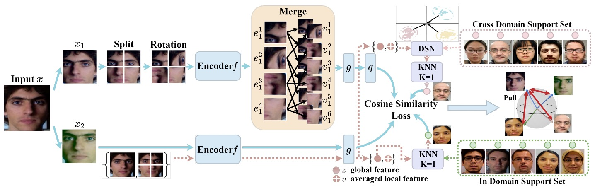
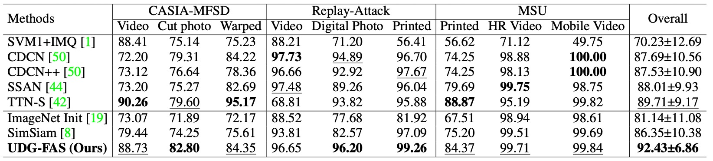
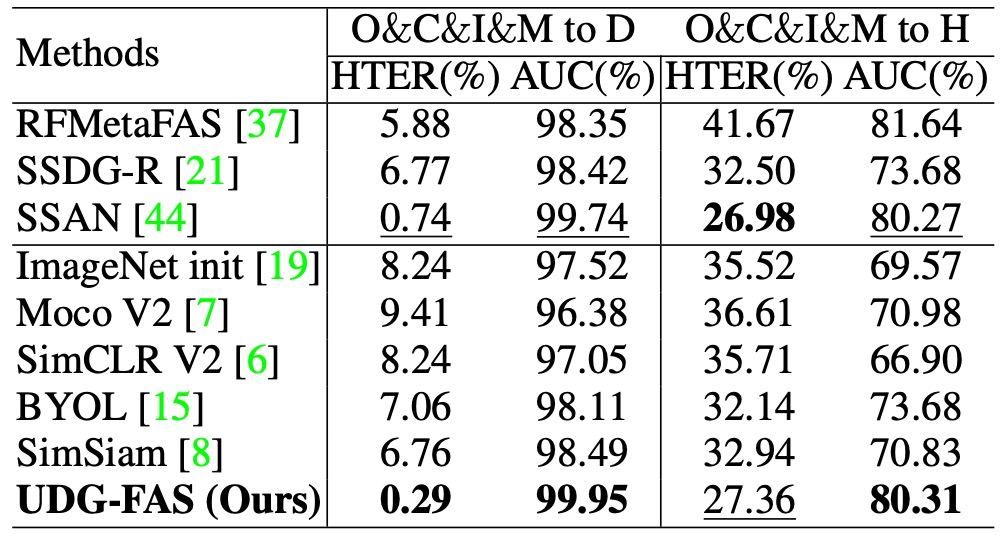

## 風格的碎片

[**Towards Unsupervised Domain Generalization for Face Anti-Spoofing**](https://openaccess.thecvf.com/content/ICCV2023/papers/Liu_Towards_Unsupervised_Domain_Generalization_for_Face_Anti-Spoofing_ICCV_2023_paper.pdf)

---

如果你覺得 FAS 的模型已經夠難訓練，那麼試著不給它任何標註資料，只讓它自己看圖說故事，情況就會從糟糕變成難以理解。

這就是我們現在面對的場景。

## 定義問題

臉部活體辨識（Face Anti-Spoofing）一直被視為人臉辨識系統的核心防線，卻有兩個致命傷：

- 資料收集與標註成本高昂；
- 模型只要換個場景就容易報廢；

這個部分如果你隨著我們看了數十篇論文，大概也能朗朗上口。

為了撐起跨域（cross-dataset）的穩定度，過去也有人提出各種 Domain Generalization 方法，但這些方法有個前提：你得有充足的標註資料。

現實中，你可能可以獲得大量的資料，但是沒有人力或資源去標註。

所以開始有人轉向「無監督學習」，希望解決「沒標註」的問題。

:::tip
說到無監督學習，你應該也不陌生，因為我們之前也拉著讀者看過不下十篇的對比學習論文。如果你不熟悉這個領域的話，從左側側邊欄的「Contrastive Learning」分類中可以找到相關的論文筆記。
:::

對比學習有兩大門派：MoCo 和 SimCLR。

這類對比學習的方法雖然在一般影像任務上取得優異的成績，但把它套用到 FAS 上，卻會發現它們的表現不如預期。只要變成「Real / Fake」兩類的 FAS，負樣本不好定義，結果模型常常搞不清自己在排擠哪一邊。

同樣地，BYOL、SimSiam 雖然試圖去掉負樣本的依賴，但在 FAS 資料上還是撐不住，因為臉部蘊含的 identity bias、domain bias 遠比自然影像豐富：你以為它學會了辨識假臉，其實它只是記住了哪個資料集拍誰的臉。

更麻煩的是，大多數人都假設你有一個 ImageNet 預訓練的 backbone 可用。然而 ImageNet 不會告訴你「假臉」與「真臉」的差別，只會幫你區分「貓」或「狗」。於是模型在 FAS 上的零樣本或少樣本條件下，始終差那麼一口氣。

所以，問題回到最初的原點：

- **如果沒有標註，也沒有合適的預訓練資料，那模型要靠什麼學習？**
- **如果 identity 與 domain 的雜訊都強過 spoof 本身，那我們又該怎麼讓模型看到「它該看的東西」？**

這篇論文的答案是：先把臉打散吧！

## 解決問題

UDG-FAS 的整體設計圍繞著一個核心目標：在無需標註的前提下，逐步消除來自身份與場景的偏差，讓模型專注於活體與否的本質線索。

這項目標被分解為三個策略模組：

1. 透過 **Split-Rotation-Merge (SRM)** 消除單張影像中的身份偏差；
2. 透過 **同域鄰居搜尋（In-domain NN）** 鬆動跨身份的表示差異；
3. 透過 **跨域鄰居搜尋（Cross-domain NN）** 處理資料來源間的風格偏移。

情況一如以往的複雜，我們依序來看看。

### SRM 模組

**Split-Rotation-Merge（SRM）** 是本研究用來消除身份偏差的關鍵模組，其設計目標在於保留活體辨識所需的局部 spoof 線索，同時弱化模型對於臉部結構與個體差異的依賴。

整體流程如下：

首先，輸入影像 $x_1$ 經過非破壞式資料增強（如亮度調整、鏡像翻轉等），接著被切分為 $m \times m$ 個局部區塊。每個區塊 $x^p_1$ 進一步接受隨機旋轉，藉此打破原始臉部結構所帶來的對稱性與空間排列偏好，降低模型對身份相關訊號的敏感度。

接下來，這些局部區塊會分別通過 encoder $f$ 產生對應的特徵向量：

$$
e^p_1 = f(x^p_1)
$$

作者並未直接使用這些局部向量進行對比學習，而是從中隨機挑選 $n$ 個區塊，計算其特徵的平均值，得到一組合併後的 identity-agnostic 表徵 $v_1$：

$$
v_1 = \frac{1}{n} \sum_{p \in s} e^p_1
$$

其中 $s$ 表示所選擇的 patch index 子集合。此設計背後的考量在於：spoof 線索多數分布於多個區塊之中（如紋理、反光、印刷雜訊），而身份特徵則在不同臉部區域變化極大，透過平均操作可進一步抹除區塊間的非穩定變異。

生成的局部表徵 $v_1$ 接續經過 projector $g$ 與 predictor $q$，產出對比用向量 $p_1$。

與此對應，另一張影像 view $x_2$ 則不經切割與旋轉，直接通過 encoder $f$ 與 projector $g$，得到全域特徵向量 $z_2$。

在損失設計上，作者採用 SimSiam 的 cosine similarity loss，並搭配 stop-gradient 機制，避免 collapse 並穩定訓練：

$$
\mathcal{L}_{\text{SRM}}^i = \frac{1}{2} \cdot \text{dist}(p_1^i, \texttt{stopgrad}(z_2)) + \frac{1}{2} \cdot \text{dist}(p_2^i, \texttt{stopgrad}(z_1))
$$

其中 $\text{dist}(\cdot)$ 為餘弦距離。為確保對稱性，訓練過程會交換 $x_1$ 與 $x_2$ 的角色，進行雙向學習。

整體而言，SRM 模組所實現的並非單純的 augmentation，而是一套以結構解耦為目的的特徵轉換流程。它允許模型在未喪失 spoof 資訊的情況下，有效屏蔽 identity 結構，建立出一組更具泛化潛力的局部表徵基底。

### In-domain Nearest Neighbors

處理完單張影像中的身份偏差後，UDG-FAS 接下來要面對的挑戰是：如何在多樣本的資料集上，進一步消除跨身份的特徵擴散問題。

儘管 SRM 模組能有效抑制單張影像中來自臉部結構的身份訊號，但實務上，FAS 任務所面對的是大量跨身份樣本所組成的資料分布。即便樣本來自同一個 domain，模型學得的特徵仍可能因身份差異而碎裂、拉遠，導致語意一致的樣本無法被視為正樣本。

為了進一步處理這類「跨身份但同類別」的特徵擴散問題，作者設計了 **In-domain Nearest Neighbor（IDNN）** 模組，作為補充性對比機制。

其核心思路是：在不依賴標註的前提下，利用 embedding 空間的幾何鄰近性，推測出可能具有相同語意的樣本對，並將它們納入對比學習以提升類內一致性。

舉例來說，對於任一樣本的全域表示 $z$，我們在同一資料集內的支援集合 $Q^{\text{in}}$ 中，搜尋最接近的鄰居作為正樣本：

$$
z_{\text{NN}} = \underset{k}{\arg\min} \, \| z - z_k^{q_{\text{in}}} \|_2
$$

注意，這裡的搜尋僅限於 in-domain，也就是保留場景一致性以降低搜尋誤差，而不混入跨 domain 所可能引入的分布偏移。

接著，將搜尋所得的鄰居 $z_{\text{NN}}$ 納入對比損失中，並與來自 SRM 模組的預測向量 $p^i$ 進行匹配：

$$
\mathcal{L}_{\text{IDNN}}^i = \frac{1}{2} \cdot \text{dist}(p_1^i, \texttt{stopgrad}(z_{\text{NN}})) + \frac{1}{2} \cdot \text{dist}(p_2^i, \texttt{stopgrad}(z_{\text{NN}}))
$$

這裡同樣採用 SimSiam 式 stop-gradient 設計，維持對稱結構並防止 collapse。

IDNN 模組的貢獻不在於強化表徵區隔，而是反向操作：它試圖「降低同一類別在 embedding 空間中的離散度」，讓原本因身份變異而彼此拉遠的正樣本能重新聚集，提升 spoof 類的語意稠密性。

同時，因為搜尋操作是在同一資料來源中進行，除了身份差異外，其餘環境因素（如解析度、攝影條件、材質反射等）仍具一致性，這使得 IDNN 在整體架構中兼具穩定性與泛化價值。

它既能補足 SRM 所未解決的跨樣本破碎性，也能保留 domain 本身的影像細節作為訓練線索。

### Cross-domain Nearest Neighbors

在單一 domain 內的鄰近搜尋，已能協助模型對齊不同身份下的活體語意。

然而，真實應用情境中，FAS 系統往往部署於多種裝置與場景，其輸入資料呈現強烈的 domain gap，包含影像解析度、拍攝設備、光照條件與背景樣式等差異。

這些跨域因素使得模型學得的特徵分布具有高度異質性，若直接以原始 embedding 進行跨資料集鄰居搜尋，容易導致語意錯配，甚至將來自不同 spoof 類型的樣本錯誤拉近。

因此，作者最後引入了 Cross-domain Nearest Neighbor（CDNN） 模組，作為對比學習中的第三條正樣本路徑。

為解決異質分布問題，作者首先對每個 domain 的特徵進行標準化處理，將其轉換至具有零均值與單位變異的參考高斯分布中。對於任一來自 domain $d$ 的樣本，其全域特徵 $z$ 與合併後的局部特徵 $v$ 被轉換為：

$$
\hat{z} = \frac{z - \mu_d}{\sqrt{\sigma_d^2 + \epsilon}}, \quad \hat{v} = \frac{v - \mu_d}{\sqrt{\sigma_d^2 + \epsilon}}
$$

其中 $\mu_d, \sigma_d^2$ 分別為該 domain 的特徵均值與變異數，$\epsilon$ 為避免除以零所加的微小常數。

正規化完成後，對樣本間的相似度計算不再僅依賴全域表示，而是將 $\hat{z}$ 與 $\hat{v}$ 的距離結合：

$$
\text{dist} = \| \hat{z}_i - \hat{z}_j \|_2 + \| \hat{v}_i - \hat{v}_j \|_2
$$

此設計同時考慮 spoof 資訊的全局與局部一致性，有效降低 identity 與風格在單一尺度下可能造成的誤導效應。

透過上述搜尋流程，模型可於跨 domain 的 support set 中尋得語意上相近的樣本 $z_{\text{NN}}$，並納入 SimSiam 類型的對比訓練：

$$
\mathcal{L}_{\text{CDNN}}^i = \frac{1}{2} \cdot \text{dist}(p_1^i, \texttt{stopgrad}(z_{\text{NN}})) + \frac{1}{2} \cdot \text{dist}(p_2^i, \texttt{stopgrad}(z_{\text{NN}}))
$$

CDNN 模組的設計目標，並非僅在於資料擴增或多樣性補充，而是可以解決跨場景部署下模型語意崩解的現象。

### 訓練目標整合

上述三種損失項被合併為最終目標函數：

$$
\mathcal{L} = \mathcal{L}_{\text{SRM}} + \lambda_1 \cdot \mathcal{L}_{\text{IDNN}} + \lambda_2 \cdot \mathcal{L}_{\text{CDNN}}
$$

為避免初期鄰居匹配誤差造成訓練不穩，$\lambda_1$ 與 $\lambda_2$ 採時間遞進策略，前 $T_1$ 輪訓練時設為 0，後續逐步啟用，以保留 early stage 的 representation 自發塑形過程。

UDG-FAS 的設計並未倚賴標註資料，也不追求 backbone 架構創新，而是將注意力集中於「訊號過濾」與「表徵對齊」兩項核心議題上。這不是對比學習的再包裝，而是針對 FAS 任務中固有的資料偏差，所提出的有針對性的無監督解法。

## 討論

為全面評估所提出方法在不同應用情境下的泛化能力，UDG-FAS 論文設計了六組實驗協議。

### Protocol-1：低標註量下的跨域泛化能力

<figure style={{"width": "90%"}}>

</figure>

此協議針對常見的半監督應用情境進行設計，假設模型能預先取得多個資料來源的未標註影像，僅能使用部分標註資料進行微調。具體操作為：模型在三個 domain 上以無標註資料進行預訓練，之後以不同比例的標註樣本（5% 至 100%）於目標 domain 上進行微調，最後在未見 domain 上測試。

實驗結果顯示，UDG-FAS 可作為一個更具語意結構的初始化方案，明顯優於 ImageNet 預訓練或其他無監督基線。即使在極低標註情況下，預訓練所學特徵仍具備良好的可適應性，能有效支撐下游分類任務，並進一步減緩 identity 與 domain 偏差所造成的語意錯置。

此外，將 UDG-FAS 與現有 DG 方法（如 SSDG-R）結合後，亦可進一步提升整體表現，顯示其具備良好的模組化整合性與泛化潛力。

### Protocol 2：完全無標註條件下的語意品質檢驗

<figure style={{"width": "70%"}}>

</figure>

本協議旨在檢驗預訓模型本身所學得的特徵品質，移除任何微調或標註資料的干擾因素，直接以 kNN 分類器評估其在目標 domain 上的辨識能力。這樣的設定等價於測試特徵的語意結構是否足夠清晰，能讓模型在未知 domain 上進行零參數預測。

實驗結果顯示，UDG-FAS 所學得的表徵不僅優於其他無監督方法，甚至在完全無 supervision 的情況下，其預訓練特徵所支撐的分類能力，也能超過某些 baseline 在全量標註下的微調結果。

這代表，透過設計良好的預訓學習機制，即便不依賴任何標註訊號，模型也能內建一套對 spoof 現象具辨識能力的語意空間。

### Protocol 3：大規模無標註資料下的預訓表現擴展性

<figure style={{"width": "70%"}}>

</figure>

此協議旨在驗證：當可用的 unlabeled 資料規模顯著增加時，模型是否能有效擴展其預訓特徵空間。實驗中，作者額外引入大規模的 CelebA-Spoof 未標註資料，以及一批由網路擷取的真實人臉樣本，作為無監督預訓的補充來源。

實驗結果顯示，UDG-FAS 可穩定地從更多樣的資料中獲得效能增益，且其增長趨勢隨資料量提升而持續。相較其他方法，UDG-FAS 更能從這類開放式來源中學得可用訊號，表現出良好的資料延展性與抗雜訊能力。

對於無標註學習而言，資料本身的多樣性與結構品質，比精細標註更能有效提升模型表徵的泛化能力。

### Protocol 4：資料來源受限下的泛化能力檢驗

<figure style={{"width": "70%"}}>

</figure>

本協議設定於更為嚴苛的條件下，僅使用兩個資料集作為無標註預訓來源，測試模型在資料來源有限的情況下，是否仍具備穩定的泛化能力。測試資料則來自另一組未見 domain，形成跨組轉移的學習情境。

實驗結果顯示，即使來源受限，UDG-FAS 仍可穩定優於現有無監督與弱監督方法，表現出良好的**資料效率**與**語意延展性**。此外，在處理身份與風格雙重偏差時，其特徵空間的穩定性亦更為明顯，特別是在測試資料集與訓練來源差異較大時，仍能維持語意一致。

### Protocol 5：跨資料來源與攻擊型態的雙重泛化挑戰

<figure style={{"width": "90%"}}>

</figure>

此協議進一步加深測試難度，結合了 **跨 domain** 與 **跨攻擊類型** 兩種分布轉移。訓練階段僅使用特定資料集與部分已知攻擊類型進行預訓與微調，測試時則面對另一組 domain 中 **未見過的 spoof 類型**。

在此設定下，模型不僅無法仰賴已知的視覺風格，連 spoof 線索本身的樣態也存在語意跳躍。實驗結果顯示，UDG-FAS 仍能穩定學得具區辨力的表徵空間，並超越現有多數 SoTA 方法，包含同樣針對 attack generalization 所設計的強化式方法。

此結果顯示：即使在訓練階段未曾接觸過特定攻擊形式，UDG-FAS 仍能藉由無監督預訓過程中對身份與風格偏差的抑制，**內化 spoof 的語意特徵本質**，而非僅是記憶具體攻擊型態。

### Protocol 6：未見 3D 攻擊與大規模資料下的泛化測試

<figure style={{"width": "70%"}}>

</figure>

本協議聚焦於最具挑戰性的情境之一：**模型從未見過 3D mask 攻擊樣本的情況下，是否仍能泛化至該攻擊類型**。訓練階段所使用的資料不包含 3D spoof，測試階段則於 3DMAD 與 HKBU-MARs 等資料集上進行評估，並額外於大規模的 CelebA-Spoof (CA) 資料集上驗證模型於混合 spoof 條件下的穩定性。

結果顯示，UDG-FAS 在完全未見的模態條件下，仍能維持穩定的辨識性能，並優於多項現有強基線與泛化導向方法。這代表，模型並未仰賴特定 spoof 表面訊號進行記憶，而是學得一組能跨模態轉移的表徵結構。

此外，在 CA 的大規模評估中，UDG-FAS 同樣展現出超越現有方法的泛化能力，進一步確認其無監督預訓策略在實務部署中具備規模擴展性與應對未知攻擊的彈性。

## 結論

UDG-FAS 並不是在模型架構或訓練流程上尋求突破，而是在一個更根本的層面上提出提問：

> **如果我們不再依賴標註，那還能剩下什麼？**

這篇論文的回答，是回到 representation 本身。

它沒有提出新的 backbone，也沒有設計複雜的損失項，而是透過一連串的安排，讓模型在無監督的條件下，逐步建立起一個可以穿越身份與風格雜訊的語意空間。

這篇工作的貢獻不單純只是一組好結果，而是提供了一個新的視角：

> **當監督資訊不可得，我們對特徵的設計責任就不能再推給分類器或正則化策略。**

我們得在學習的最初，就做出取捨與限制，把模型帶向對的方向，而不是等資料告訴它什麼是對的。

從更長遠的角度來看，這類方法也許會逐步取代傳統 FAS 訓練流程中對「攻擊樣本」的依賴。

畢竟，活體與否的語意邊界，從來就不該只是某一類攻擊的表面紋理，而是一種跨身份、跨模態、跨資料來源的語意共振。

而這，也許才是無監督學習真正的開端。
