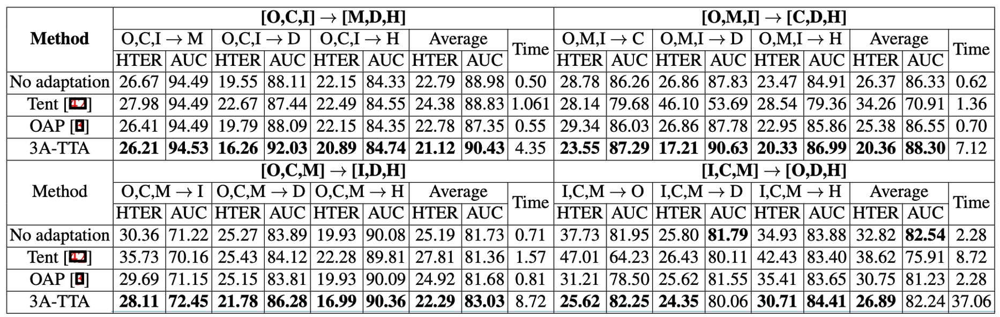

## 荒野求生

[**Test-Time Adaptation for Robust Face Anti-Spoofing**](https://papers.bmvc2023.org/0379.pdf)

---

你應該不會記得自己是怎麼學會分辨一張照片和一張臉的。

也許是光線，也許是反光，也許是某種說不出的違和感。

但對一個模型來說，這件事從來不簡單。尤其當它要在沒人教的情況下，它得自己做決定。

## 定義問題

Face Anti-Spoofing（FAS）是一道看似簡單、實則刁鑽的問題。

我們只需要它判斷這張臉是真人還是偽造，但這個判斷會在無數環境變化、攻擊類型、裝置差異中崩解。

為了解決跨環境的問題，研究者提出了很多看似強壯的學習策略。

- Domain Generalization（DG）說：**我們讓模型學得更穩。**
- Domain Adaptation（DA）說：**我們讓模型先見見新資料再學。**
- 甚至 Source-Free DA（SFDA）也說：**沒關係，我們不用舊資料，也能微調。**

只要你知道未來的應用場景，這些方法都能讓模型在訓練階段，學會適應未來的變化。

但這個世界從不照劇本走。

當模型已經部署，而攻擊者開始用你沒見過的手法入侵，當環境開始產生你從未適應過的變數，那個我們以為訓練完畢的模型，是否還有第二次學習的機會？

這篇論文的出發點，就來自這樣的場景：

> **當學習的機會只剩下推論那一刻，模型該如何反應？**

這並不只是個技術問題，而是一場遲來的記憶對抗。

我們無法預知攻擊者的下一步，但我們可以試著在最後一刻，讓模型重新學會看見。

## 解決問題

<div align="center">
<figure style={{"width": "90%"}}>

</figure>
</div>

作者提出了 **3A-TTA** 這個三合一解法，讓模型能在「真正推論」時候，直接依賴尚未標註的目標資料，進行最後一刻的自適應調整。

整個架構分為三個主要組件：

1. **Activation-based Pseudo-Labeling**：

   測試資料沒有標註，模型該憑什麼學？如果用分數（score-based）產生假標籤，很容易因活體與偽體外觀相似而混淆。

   這個部分就是透過 CAM （類別激活圖）萃取更細緻的特徵位置資訊，輔以餘弦相似度比對，產生可信度更高的「偽標籤」。

   ***

2. **Anti-Forgetting Feature Learning**：

   如果新來的批次裡都是新型態攻擊，模型可能將它們記下來，但也很可能「忘掉」舊知識。

   因此這裡對高可信度樣本進行「篩選」後，將其特徵保存於記憶庫（Memory Bank），在每次更新時一併考慮，減少模型遺忘風險。

   ***

3. **Asymmetric Prototype Contrastive Learning**：

   新攻擊類型可能與舊攻擊或真人臉在特徵空間中有部分重疊，如何在「不見過該攻擊」的情況下，仍能區分出偽體與活體？

   作者使用對比學習，且針對「偽體」採取局部聚合（找出與攻擊樣本相近的 K 個 spoof 特徵）、對「活體」採用全域聚合（所有 live 特徵合成一個原型），以此同時保留攻擊之間的局部相似，並明顯區隔活體與偽體。

   ***

在作者的設定裡，每當模型收到一批（batch）新的「未標註」目標資料時，就會立刻在該批次裡執行：

(1) 偽標籤生成 → (2) 篩選可靠樣本 → (3) 對比學習更新。

這個流程在推論階段發生，沒有額外的標註可依賴，也無需反覆調用舊資料。

3A-TTA 可以在每次見到這些新型攻擊後，藉偽標籤和對比學習即時修正自身參數，讓後續批次的判斷越來越準確。

如果你只是想知道概念的話，那這篇論文到這邊就看完了。

接下來，我們仔細看下每個組件的運作原理，如果你不感興趣的話，可以直接跳到最後的結論。

### Activation-based Pseudo-Labeling


上圖為這個機制的運作示意圖，這一步解決「沒標註怎麼學」的問題。

考慮某張未標註影像 $\mathbf{x}_j$，若僅憑分數預測去猜它是活體還是偽體，很可能因光線或表面特徵相似而誤判。

為此，作者參考過去文獻中使用 Class Activation Map (CAM)，在特徵空間中找出活體與偽體最具代表性的激活區域。

接著，作者定義了餘弦相似度 $\text{sim}(\mathbf{f}, \mathbf{A})$：

$$
\text{sim}(\mathbf{f}, \mathbf{A}) = \frac{\mathbf{f} \cdot \mathbf{A}}{\|\mathbf{f}\|\|\mathbf{A}\|}.
$$

並用比較活體和偽體激活圖之相似度的方式決定偽標籤 $\bar{y}$：

$$
\bar{y} =
\begin{cases}
1, & \text{if } \text{sim}(\mathbf{f}, \mathbf{A}_l) \ge \text{sim}(\mathbf{f}, \mathbf{A}_s), \\
0, & \text{otherwise}.
\end{cases}
$$

如此便能替各影像產生更具可行性的假標籤。

最後用 **liveness loss**，讓模型在測試階段持續更新：

```math
L_{l} = -\sum \Big[\bar{y}\log(CF(\mathbf{f})) + (1-\bar{y})\log\big(1 - CF(\mathbf{f})\big)\Big].
```

### Anti-Forgetting Feature Learning

光有偽標籤還不夠，因為有些批次可能「全部是 live 或全部是 spoof」，還可能混有「未知的新攻擊」。若我們單純用這批資料更新，就會發生「只記得新的假臉樣本，忘掉舊有的知識」的問題。

為了避免這種情況，作者在每次批次更新時，透過門檻機制選出最可信賴的特徵，並把它們存到一個 Memory Bank (MB) 裡。

每次新的批次到來，就會一併考慮 MB 裡的特徵，計算 Anti-Forgetting Liveness Loss $L_{afl}$，確保模型不會一股腦地向新資料偏移，而能在每次微調裡兼顧舊知識。

具體做法是：對於每個樣本 $\mathbf{f}$，其偽標籤為 $\bar{y}$，定義以下門檻判定是否可信：

$$
\gamma =
\begin{cases}
1, & \text{if } (CF(\mathbf{f}) > \alpha \,\wedge\, m_{\text{sim}} \ge \beta)\;\text{or}\;(CF(\mathbf{f}) < 1-\alpha \,\wedge\, m_{\text{sim}} \le -\beta), \\
0, & \text{otherwise},
\end{cases}
$$

其中，$\alpha = 0.8,;\beta = 0.2，m_{\text{sim}} = \text{sim}(\mathbf{f}, \mathbf{A}_l) - \text{sim}(\mathbf{f}, \mathbf{A}_s)$

若 $\gamma=1$，則將此特徵寫入 $MB$（以 FIFO 更新）。

如此產生的樣本特徵集，將在後續 mini-batch 更新中同時被考量，並透過下式定義 **Anti-Forgetting Liveness Loss** $L_{afl}$：

```math
L_{afl} = -\sum \Big[\hat{y}\log\big(CF(\hat{\mathbf{f}})\big) + (1-\hat{y})\log\big(1 - CF(\hat{\mathbf{f}})\big)\Big].
```

此舉能使模型同時學習新批次與過往知識，維持決策穩定度。

### Asymmetric Prototype Contrastive Learning

然而，當攻擊模式越來越多，連「記憶庫」也未必能全然捕捉到所有變形手法。

因此這個階段要做的就是在同一特徵空間裡同時「拉開活體與偽體間的距離」，又「適度地聚合各種偽體之間的共同點」。

- **局部聚合（Local Spoof Prototype）**

  假設某個偽體樣本 $\mathbf{f}_{s}^{a}$ 是全新攻擊類型。

  但在記憶庫裡，很可能有某些「舊攻擊」特徵與它部分相似（例如都出現高亮反光）。將這些最相近的 K 個偽體樣本聚合成 局部 spoof 原型，能帶動模型對這個新攻擊的判別能力，因為它能「舊知帶新知」。

- **全域聚合（Global Live Prototype）**

  另一邊，真人臉其實在跨 domain 下不會相差太大（五官位置都類似，膚色差異也屬於較小變動），因此作者直接把所有 live 特徵聚合為一個「全域」的 live 原型，強調活體之間的一致性。

這樣形成的「非對稱對比學習」可使模型在偽體與活體間拉開差距，同時又不致完全忽視不同偽體之間仍可能的細微相似度，保有更廣的「攻擊適應」彈性。

即使有了偽標籤學習和防遺忘策略，面對**未知攻擊**時，模型可能仍缺乏足夠的判別線索。將正負樣本集合納入後，作者定義了 **Asymmetric Prototype Contrastive Loss** $L_{apc}$：

$$
L_{apc} =
-\log \frac{\exp\bigl(\text{sim}(\mathbf{f}_{s}^{a},\;\hat{\mathbf{f}}_{s}^{p})\bigr)}
{\sum_{j= \{\hat{\mathbf{f}}_{s}^{p}\cup \mathbf{N}_s\}}\exp\bigl(\text{sim}(\mathbf{f}_{s}^{a},\;\hat{\mathbf{f}}_{j})\bigr)}
-\log \frac{\exp\bigl(\text{sim}(\mathbf{f}_{l}^{a},\;\hat{\mathbf{f}}_{l}^{p})\bigr)}
{\sum_{i= \{\hat{\mathbf{f}}_{l}^{p}\cup \mathbf{N}_l\}}\exp\bigl(\text{sim}(\mathbf{f}_{l}^{a},\;\hat{\mathbf{f}}_{i})\bigr)}.
$$

其中，$\mathbf{N}_s$ 與 $\mathbf{N}_l$ 分別為 spoof 與 live anchor 的負樣本集合。

在這種對比學習下，活體與偽體得以在特徵空間中拉開距離，同時也能留住各偽體之間的微妙相似點，達到更強的未知攻擊適應性。

### 總損失函式

最後，作者將上述三部分損失彙整為

$$
L_{T} = L_{l} + \lambda_{1}L_{afl} + \lambda_{2}L_{apc},
$$

並在實驗中設定 $\lambda_{1} = 0.5$、$\lambda_{2} = 1.5$。

藉由整合 **偽標籤學習 (Liveness Loss)**、**防遺忘 (Anti-Forgetting)** 和 **對比區分 (Prototype Contrast)**，模型不再只是被動地接收輸入，而能在最後一刻進行迅速調整，從而在真實世界的未知環境中依舊保持高穩定度與高適應力。

## 討論

### 與其他方法之比較



作者將 3A-TTA 與其他常見 Test-Time Adaptation 方法（如 Tent、OAP 等）做了整體性能比較；

實驗結果如上表：

- **Tent** 等非 FAS 專用 TTA 技術，面對真實攻擊情境時，反而比「No adaptation」更糟。這表示通用式 TTA 方案不一定能直接遷移到 FAS。
- **OAP** 只用分數-based 的偽標籤，在多數情況下提升有限。
- **3A-TTA** 在各種評測上取得最優結果，如在平均 HTER 上比 OAP 高出約 12.54% 的改善幅度，同時在 AUC 上也有約 2.11% 的提升。

### 消融實驗


作者拆解了三大核心模組（偽標籤學習、Anti-Forgetting、Asymmetric Prototype Contrast），對比各種損失組合的成效。

主要發現如下：

- **假標籤機制**：

  - 分數導向（Score-based）或 Prototype-based 的方法，相較於**Activation-based**（即本篇論文之方法），在偽標籤準確度上都有明顯落差。
  - Activations 不僅提供了區域性更細膩的判斷，也顯示對於攻擊邏輯能捕捉到更關鍵的區塊。

- **Anti-Forgetting Feature Learning**：

  - 不論是只有 $L_l$ 或再加上 $L_{afl}$，都能看到明顯的性能提升。
  - 當只要有可行的記憶庫機制輔助，模型就能兼顧新舊知識，而不致於只偏重當下批次。

- **Prototype Contrast vs. General Contrast**：

  - 若使用一般的對比學習 ($L_c$)，會將所有攻擊都視為「同質 spoof 類別」，導致新攻擊與舊攻擊之間的重要差異被忽略。
  - **Asymmetric Prototype Contrast ($L_{apc}$)** 能更有效凸顯攻擊細微差異，因此在面對未見過的攻擊時，有顯著的優勢。

### 視覺化分析


最後，作者將 3A-TTA 的結果與其他方法進行視覺化分析，並與未經適應的模型進行比較。

1. **t-SNE 特徵分佈**：

   - 上圖 (a) 顯示，未經任何適應的模型在碰到新域或新攻擊時，Live 與 Spoof 特徵明顯產生重疊。
   - 上圖 (b) 則證實了 3A-TTA 的好處：Live 與 Spoof 特徵有更清楚的分離，模型對未知攻擊的區分力顯著提升。

2. **Activation Maps**：

   - 相較於無適應時（上圖中的 ① 與 ③），3A-TTA 所帶來的激活圖 ② 與 ④）較能聚焦在真實臉部區域；
   - 對於偽體，模型的活體激活幾乎沒有明顯反應，顯示其已能排除假臉干擾，專注於真人細節。

## 結論

Face Anti-Spoofing 早就不再是單純的分類任務。

面對生成式攻擊不斷進化、資料來源更加分散的環境，FAS 模型要生存，就得具備一種能力：

> **能夠在未曾預見的場景中，自我修正判斷依據**。

這篇論文提出的 3A-TTA，某種程度上正是這種「自我修正」的嘗試。

從結果來看，這套方法在 TTA-FAS 基準上優於過往的方法，也證明 Test-Time Adaptation 的確能為 FAS 任務注入新的應變路徑。

傳統模型的生命終點是訓練完畢、上線推論；而 TTA 模型的生命才剛開始於推論時刻。這樣的思維，也讓我們重新審視一個問題：

> **若現場就是戰場，那模型該如何在現場中學會反擊？**

也許，未來的 AI 模型不應該只會交卷，更應該學會在交卷之後，動筆修改答案。
