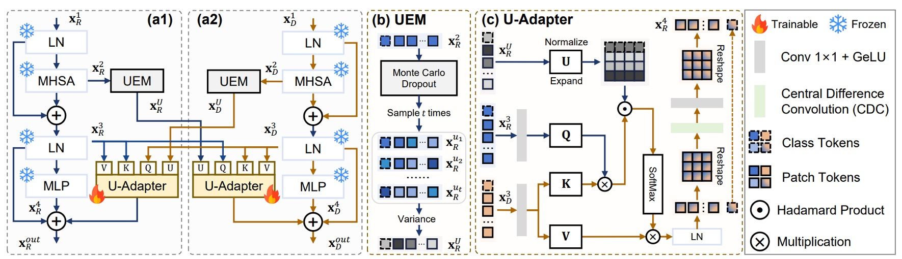
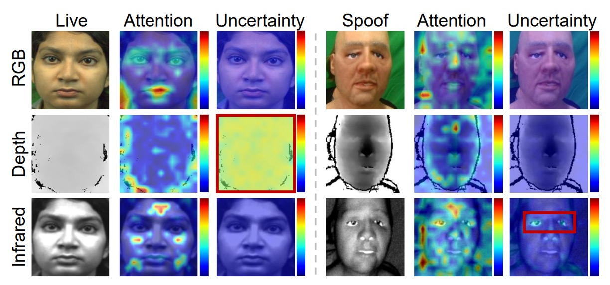

## 信任管理學

[**Suppress and Rebalance: Towards Generalized Multi-Modal Face Anti-Spoofing**](https://arxiv.org/abs/2402.19298)

---

在這篇論文發表的當下，電腦視覺領域已經是多模態架構的天下。

但 FAS 的問題依然存在，跨域泛化始終都是個難題。

## 定義問題

RGB 模型跑得快，資料集建構相對容易。其他模態的資訊也不是不好，像是深度圖可以看到立體結構，紅外線能感測溫度或材質反光，對於判斷「這張臉是真是假」其實非常有幫助。

但為什麼多模態幾乎沒人用呢？或是用了之後，反而泛化更差，幾乎找不到可以落地機會？

作者點出了兩個關鍵：

- **Modality Unreliability（模態不可靠）**

  感測器一換、光源一變、domain 就整個跑掉。尤其是 IR 跟 depth，原本該補強的資訊，反而成了誤導的來源。

  你用 cross-modal fusion 把所有模態的資訊湊在一起，結果好壞參半，還會彼此拖累。

- **Modality Imbalance（模態失衡）**

  模型訓練時會自動挑「學起來最快的模態」，通常是 RGB。

  其他模態的資訊學不進去，只是表面上有用、實際上沒被學好。一旦到了 target domain，RGB 不管用了，其他慢模態也還沒練成，只能一起陪葬。

所以你看，多模態 FAS 的難，不只是在「多」，而是這些模態根本就不平等，也不可信任。

因此，這篇論文的作者認為：

> **我們得同時處理「不可靠的訊號來源」，還要訓練一個「不偏心的模型」。**

這就是這篇論文的問題定義核心。

## 解決問題

<figure style={{"width": "60%"}}>

</figure>

為了解決多模態 FAS 的問題，作者提出 **MMDG**（Multi-Modal Dynamic Gradient）架構，主打兩個功能：

- **Suppress**（抑制不可靠模態）：在跨模態融合時，對不可靠的模態進行懲罰，讓它們的影響力變小。
- **Rebalance**（平衡模態學習速度）：在訓練時，對模態間的梯度進行調整，讓每個模態都能夠有效學習。

從上架構圖來看，每個模態（RGB、深度、紅外線）各自有 ViT backbone，再接上自己專屬的 U-Adapter 負責跨模態融合。

訓練時，只有 U-Adapter 會被 fine-tune。最後透過 ReGrad 模組對梯度做動態調整，確保每個模態都能有效學習，不會誰拖累誰、誰搶進度。

### U-Adapter

如上圖所示，U-Adapter 是這篇方法的核心模組，被嵌入在每個 ViT block 之後，僅對 Adapter 進行微調。它的任務是：

1. 偵測每個模態中「不可靠」的 token（透過不確定性估計模組 UEM）；
2. 在做跨模態融合時，對這些不可靠 token 降低影響力，避免其資訊污染其他模態。

:::tip
如果你對 Adapter 的概念不熟悉，可以參考我們之前的筆記：

- [**[19.02] Adapter: 參數節省九成六**](../../model-tuning/1902-adapter/index.md)
  :::

### 不確定性估計模組

參考上圖的 (b)，為了找出不可靠的區域，作者引入了不確定性估計模組：

- **Uncertainty Estimation Module（UEM）**。

這個模組使用 Monte Carlo Dropout（MCD）技巧，在每個 Multi-Head Self-Attention 後進行多次隨機採樣，估算每個 token 的不確定性。

設 $T = \{x^{u1}_R, x^{u2}_R, ..., x^{ut}_R\}$ 為 MCD 採樣結果，不確定性估計為：

$$
x^U_R = \text{Var}(T) \in \mathbb{R}^{B \times L \times 1}
$$

### 跨模態融合機制

參考上圖 (c)，U-Adapter 不只是做融合，而是 **有選擇地融合**。

它會壓制來自其他模態的「可疑 token」，避免擴散誤導。

以深度模態為例，其 U-Adapter 的融合過程如下：

- Query 來自另一模態（例如 RGB）的 $x^3_R$
- Key 與 Value 來自自己的 $x^3_D$
- 融合過程會根據 RGB 模態的不確定性 $x^U_R$ 進行調整

其公式如下：

$$
A(x^U_R, x^3_R, x^3_D) =
\text{CDC} \left(
\text{Softmax} \left(
\frac{Q(x^3_R)K(x^3_D)^\top \odot U(x^U_R)}{\sqrt{n_k}}
\right) V(x^3_D)
\right)
$$

其中：

- $Q(\cdot)$、$K(\cdot)$、$V(\cdot)$ 為 query、key、value 線性投影
- $U(x^U_R) = \exp(-r_e \cdot x^U_R \cdot \mathbf{I})$ 是不確定性懲罰權重，越不確定的 token，影響力越低
- $\odot$ 表示 Hadamard product（逐元素乘法）
- $\text{CDC}(\cdot)$ 是 Central Difference Convolution，用來增強 token 間的 local difference，彌補 ViT 缺乏鄰域敏感性的問題

三個模態的最終輸出 $x^{\text{out}}_m$ 結合了兩次跨模態融合，以及 ViT block 自身的殘差連接：

$$
\begin{aligned}
x^{\text{out}}_R &= A(x^U_D, x^3_D, x^3_R) + A(x^U_I, x^3_I, x^3_R) + x^3_R + x^4_R \\
x^{\text{out}}_D &= A(x^U_R, x^3_R, x^3_D) + x^3_D + x^4_D \\
x^{\text{out}}_I &= A(x^U_R, x^3_R, x^3_I) + x^3_I + x^4_I
\end{aligned}
$$

其中：

- $x^3_m$：ViT block 中的 LN 輸出
- $x^4_m$：ViT block 中的 MLP 輸出
- $x^U_m$：模態 $m$ 對應的不確定性估計

:::info
為避免模態間「彼此誤導」，作者「不允許 depth 與 IR 互相融合」，僅允許它們各自接收來自 RGB 的資訊。
:::

### ReGrad

ReGrad 的目標很簡單：**讓慢的模態學得更多，快的模態學得少一點**。

但實際上，每個模態的梯度方向不一定一致，甚至會彼此打架。

所以作者做了這件事：

> **根據模態的快慢程度與梯度是否衝突，決定要保留哪一部分的梯度、壓抑哪一部分，並且加上不確定性懲罰來控制影響力。**

以下是四種情況的處理方式，對應圖四中的 (b1)、(b2)、(c1)、(c2)：

$$
\text{ReGrad}_2(\mathbf{g}_i, \mathbf{g}_j) =
\begin{cases}
\mathbf{g}_i + \dfrac{\mathbf{g}_i \cdot \mathbf{g}_j}{\|\mathbf{g}_i\|^2} \mathbf{g}_i \cdot U(u_j), & \text{(b1) non-conflict, } j \text{ is faster} \\
\mathbf{g}_i + \left( \mathbf{g}_j - \dfrac{\mathbf{g}_i \cdot \mathbf{g}_j}{\|\mathbf{g}_i\|^2} \mathbf{g}_i \right) \cdot U(u_j), & \text{(b2) conflict, } j \text{ is faster} \\
\dfrac{\mathbf{g}_i \cdot \mathbf{g}_j}{\|\mathbf{g}_j\|^2} \mathbf{g}_j \cdot U(u_i) + \mathbf{g}_j, & \text{(c1) non-conflict, } i \text{ is faster} \\
\left( \mathbf{g}_i - \dfrac{\mathbf{g}_i \cdot \mathbf{g}_j}{\|\mathbf{g}_j\|^2} \mathbf{g}_j \right) \cdot U(u_i) + \mathbf{g}_j, & \text{(c2) conflict, } i \text{ is faster}
\end{cases}
$$

其中：

- $\mathbf{g}_i$、$\mathbf{g}_j$：模態 $i$ 和 $j$ 的反向傳播梯度向量
- $u_i$、$u_j$：各模態的不確定性（batch-level）
- $U(u)$：不確定性懲罰函數，定義為 $U(u) = \exp(-r \cdot u)$，會壓制不穩定模態的梯度影響力

---

上面的式子看起來雖然猙獰，但其實不難理解：

- 如果你是慢的那一方（$i$），就會拿到額外幫助，來自 $j$ 的梯度
- 如果你是快的那一方（$j$），不僅不會得到幫助，甚至還會被壓制
- 如果兩人學習方向不同（conflict），就會先做**向量投影**，只留下對彼此無害的部分
- 最後，乘上 $U(u)$ 這個不確定性懲罰因子，來壓制那些「學很快但其實不穩定」的模態

### SSP Loss

除了梯度調節，MMDG 還加上了一個對模態內聚有幫助的 loss：

- **Single-Side Prototypical Loss（SSP）**。

首先，對每個模態 $m$，每個 domain $d$ 的原型向量定義為：

$$
\mathbf{p}_d^m = \frac{1}{N_d} \sum_{\mathbf{c}_m \in d} \mathbf{c}_m
$$

接著，SSP Loss 定義如下：

$$
L_{\text{ssp}}^m(\mathbf{c}_m, \mathbf{p}_{\text{dgt}}^m) =
- \log \frac{
\exp\left( -\text{ED}(\mathbf{c}_m, \mathbf{p}_{\text{dgt}}^m) \right)
}{
\sum_{d \in D} \exp\left( -\text{ED}(\mathbf{c}_m, \mathbf{p}_d^m) \right)
}
$$

這個 loss 會讓每個樣本往所屬 domain 的 prototype 聚集，強化模態內部的判別性。

綜合來看，整體 loss function 為：

$$
L_{\text{final}} = L_{\text{ce}} + \sum_{m \in \{R, D, I\}} \lambda \cdot L_{\text{ssp}}^m
$$

其中 $L_{\text{ce}}$ 是分類任務的交叉熵損失，$\lambda$ 用來調整 SSP 的影響比例。

## 討論

### 和其他方法的比較

表格橫軸是測試資料集（被當作 unseen domain），縱軸則是不同的方法，包含：

- 傳統的 Domain Generalized 方法（SSDG、SSAN、IADG...）
- 多模態方法（CMFL、MM-CDCN）
- 可彈性處理缺模態的 Flexible-modal 方法（ViT+AMA、VP-FAS）

測試方法是將三個資料集做訓練，一個拿來測試，每次輪流 leave-one-out。

實驗結果顯示：MMDG 的成績在所有組合中都是 **最好的**，不只超越了多模態的 baseline，也拉開了和 SOTA 的 Flexible-modal 方法 VP-FAS 至少 **6% HTER / AUC** 的差距。

這是一個蠻明確的訊號：

> **多模態並不是越多越好，只有「知道哪些資訊該信、哪些該關掉」的融合策略，才能讓模型在看不見的新世界裡活下去。**

### 消融實驗

<figure style={{"width": "80%"}}>

</figure>

為了展示每個設計元件的貢獻，作者做了許多消融實驗。

實驗結果顯示，不管你是用什麼方法（DG 或多模態），只要把 backbone 換成 ViT + U-Adapter，都能提升表現：

- **原本用 ViT 的 baseline 模型（像 SSDG、IADG）**，一旦插入 U-Adapter，表現立刻跳升。
- **甚至不加任何 fancy 方法，只用 ViT + U-Adapter + Cross Entropy**，也能打贏一票老派 DG 方法。

如果再加上 ReGrad，那整體表現直接達到 SOTA 水準，這說明了：

1. **U-Adapter 本身就有「泛用性」**，能套用在任意 ViT 架構上，不挑體質。
2. **它不只是做融合，更會選擇性忽略不可靠資訊**，讓特徵空間變得更乾淨、更穩定。

最後作者也實測了 ReGrad 的兩個變體（衝突和非衝突情況），結果都不如全情境啟動的版本，說明：

- 該讓的時候不讓，學習會失衡；不該干預的時候又多手，反而干擾學習進程。
- 真正泛化的關鍵，不是硬平衡，而是動態判斷整體學習進度。

### 不確定性機制的效果

<figure style={{"width": "70%"}}>

</figure>

作者直接拆開兩個模組（U-Adapter、ReGrad）裡的 uncertainty，用來驗證：

- **這個估計不確定性的機制到底有沒有幫助？**

結果很明顯：

- 如果拿掉 U-Adapter 裡的 uncertainty 控制，性能會下降
- 如果拿掉 ReGrad 裡的 uncertainty 權重，同樣會掉分
- **兩個都用的時候，HTER 與 AUC 最好，甚至提升超過 3%**

也就是說，不確定性估計確實可以幫助模型挑出不穩定資訊來源，並阻止它們污染其他模態，還能壓制不穩定模態的影響力。

如下圖所示，MMDG 會主動聚焦在 IR、Depth 模態中不確定的區域上，這些區域雖然有誤判風險，但因為被模型「估出來」並壓制掉，才不會誤導整體判斷流程。

<figure style={{"width": "90%"}}>

</figure>

## 結論

人們可能會認為多模態系統的未來會是那種「我全都要」的強化版模型。

RGB 不夠？加 IR；IR 不夠？加 Depth；I 最後再來個 CLIP 式融合！彷彿模態愈多愈安全。

但這篇告訴我們：當 domain shift 發生時，模型能不能正確地判斷「哪些資訊是可信的、哪些該懷疑」，反而才是決定能不能泛化的關鍵。

MMDG 的價值在於它把這個「不確定性」的概念，變成了模型內部的一部份，並進一步用梯度、用融合機制去設計一套「該信誰、該壓誰」的判斷與行動流程。
