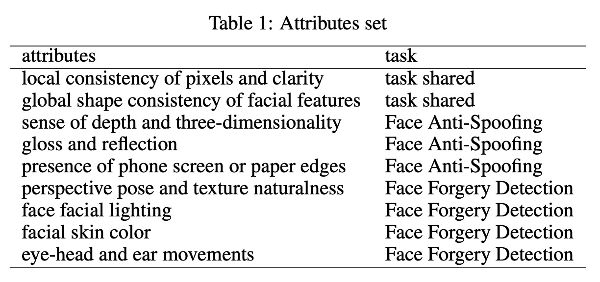
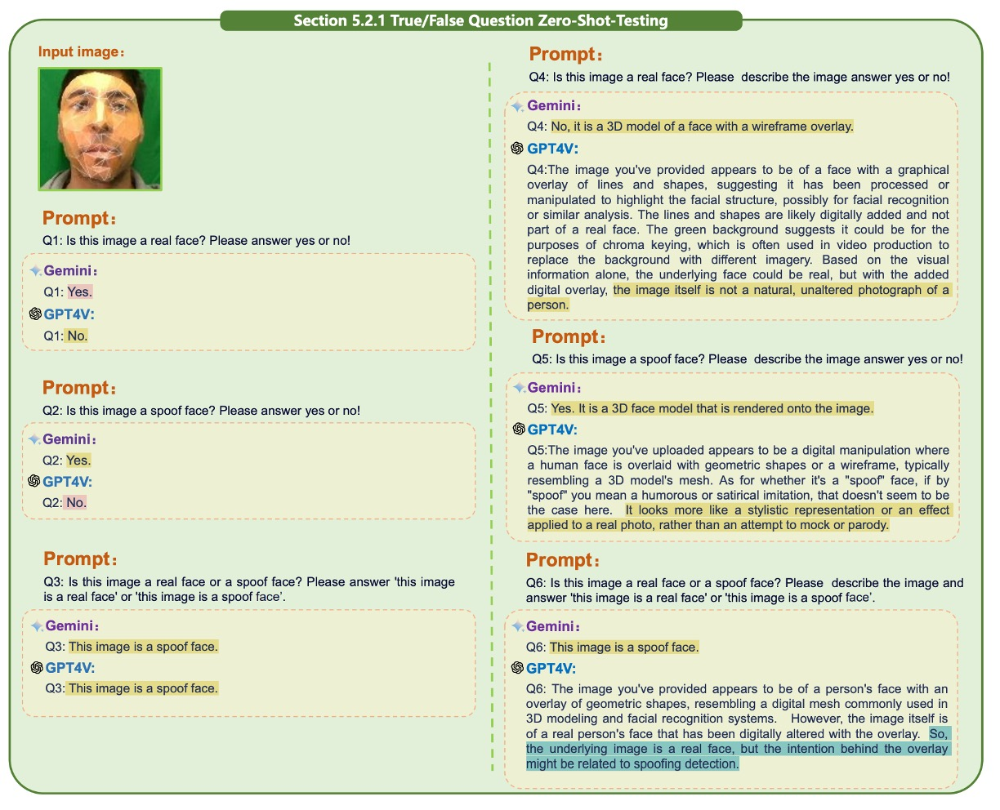

## 告訴我，為什麼？

[**SHIELD : An Evaluation Benchmark for Face Spoofing and Forgery Detection with Multimodal Large Language Models**](https://arxiv.org/abs/2402.04178)

---

打開這篇論文，發現有 100 頁，手不小心抖了一下。

仔細一看，發現大部分都是在描述資料集的內容......噢，那沒事了。

## 定義問題

Face Anti-Spoofing（FAS）與 Face Forgery Detection（FFD）這兩個任務，說白了就是在問：

> 「你眼前的這張臉，是個人，還是個陷阱？」

前者關心你是不是拿照片、影片、3D 面具混進系統（實體攻擊）；
後者在意你是不是用 GAN、Diffusion 合成了一張假人臉（數位攻擊）。

---

FAS 早期是用手工特徵來判斷真假臉，後來深度學習興起後，CNN 加上大資料集成為主流（如 meta-learning、few-shot 解法）。

接著 Vision Transformers（ViTs）開始處理空間 patch 和時間序列，加入生理訊號（眨眼、週期）提升辨識。

FFD 的部分，則是多數研究把它當作二分類任務來解，用 CNN 抽特徵再分類。看起來很準，但其實只對 in-domain 資料集準，一換資料集就崩。

為了更細緻地抓偽造痕跡，有人開始用頻域分析、雜訊特徵、局部空間學習等方式來補強。

但現實世界的偽造手法更新速度遠超想像，單靠固定特徵根本跟不上節奏。

終究還是到了多模態大模型（MLLM）的時代，那 MLLM 能不能救場？

有名的架構像是 GPT-4V、Gemini、BLIP-2 等，最近被廣泛應用於圖文對齊、敘述生成、推理問答……但：

- 它們能不能「看懂」一張臉的真假？
- 能不能指出圖像中不自然的地方，並解釋為什麼？
- 能不能不靠訓練就判斷從未看過的 forgery？

目前，**完全沒有人系統性地驗證這件事。**

這顯然是個問題！

於是這篇論文的作者決定來做這件事，並且設計了一個新的 benchmark 來評測 MLLM 在 FAS 與 FFD 任務上的表現。

在這個任務中，我們不再只是問「這張臉真不真？」而是進一步問：

> **「這張臉看起來真嗎？告訴我，為什麼？」**

## 解決問題

這篇論文要測的事情很單純，卻也是目前沒人做過的：

- **把多模態大模型（MLLM）像 GPT-4V 和 Gemini 拉進來，問它們能不能看出臉有沒有被偽造，還能不能講出「為什麼它這樣判斷」。**

但要真的測得準，不只是丟張圖問你臉是不是真的就結束。

作者設計了一整套完整的測試框架，從資料挑選、任務設計、問題提問方式，到引導模型怎麼思考，全都講究。這不是 prompt engineering，那太狹隘了，更像是一種任務規範語言（task-level protocol）。

資料方面如下圖所示，共有三種測試圖像的類型：

<figure style={{"width": "90%"}}>

</figure>

- Row 1 是 FAS 任務中常見的實體攻擊樣本，例如印表紙、螢幕重播、剛性與紙面具，這些都有對應的 RGB、深度與紅外線模態。
- Row 2 則是 Face Forgery Detection 任務中用到的經典偽造樣式，如 Deepfakes、Face2Face、FaceSwap 和 Nulltextures。
- Row 3 則是來自 AIGC 系統，如 Stable Diffusion 與 InsightFace 所產生的高擬真合成圖。

這類圖像沒有所謂的原始人臉，因為整張圖都是直接生成出來的，沒有一對一的對應關係，這也讓它們更難判。

為了讓模型有系統地表現它的理解能力，作者把判斷任務設計成兩種格式：是非題與多選題。

任務架構見下圖：

<figure style={{"width": "90%"}}>

</figure>

以是非題為例，模型只會被問「這是不是一張真人臉？」而多選題則是從四張圖中挑一張最有可能是真人。這些問題可以搭配不同的上下文條件進行測試，包括 zero-shot、few-shot，還有是否使用 Chain-of-Thought（COT）讓模型在回答前先解釋理由。

這樣的設計本身已經比傳統模型評估來得細緻，但作者還往前多走了一步。他們提出 MA-COT（Multi-Attribute Chain of Thought）這個推理機制，試圖讓模型不要只是「自由發揮地描述圖像」，而是根據一組事先定義好的屬性來進行分析。

具體來說，模型不只要判斷「這是什麼」，還要針對例如「臉部輪廓是否對稱」、「是否有紙邊」、「光影是否自然」、「眼耳頭動作是否連貫」等等屬性一一說明，最後再根據這些中介描述下結論。

這些屬性依任務類型有所差異，完整分類如下表：

<figure style={{"width": "70%"}}>

</figure>

以下是推理流程更直觀的示意圖：

<figure style={{"width": "90%"}}>

</figure>

它的運作方式是：先將圖像中的視覺訊號轉成一組屬性描述，這些描述與任務問題一起被餵進 MLLM 裡，由模型自行組合出它的判斷流程。你可以把這件事想成是讓模型「有東西可想」，而不是單靠記憶去做模式匹配。

為什麼要這樣繞一圈？

因為作者不是要訓練模型去學這些，而是要測它「能不能理解」。

當資料是新的、風格是不同的、攻擊是未見過的，這些模型還能不能在沒有 fine-tuning 的情況下根據描述做出判斷，這才是真正的挑戰。

所以作者並不是拿一堆圖片來比較誰準度高，而是在問模型到底看不看得懂什麼叫作「這張臉有點不對勁」，而且能不能把它說出來。這不只是 benchmark，而是一種測試 MLLM 理解能力的「語言化任務規範」實驗。

## 討論

為了檢驗 SHIELD 的整體評測流程是否能有效刻畫模型的理解能力，作者挑選了兩個目前公開可用、具代表性的多模態大型語言模型：**GPT-4V** 與 **Gemini**，並透過 API 呼叫方式進行測試。這兩個模型都具備視覺輸入能力，也都被設計來處理通用的圖文任務，因此也是目前這類研究中最具代表性的對比組合。

實驗設計上，作者依照前述任務設計（是非題與選擇題）、測試條件（zero-shot、few-shot）與提示策略（標準回應與 COT）組合出完整的測試矩陣，系統性地觀察兩個模型在不同情境下的表現差異。這樣的測試方式不僅能確認模型是否能「答對」，更能看出它們在推理過程中的穩定性、錯誤傾向與回應結構的差異。

在結果標示方面，為了讓不同類型的模型反應更容易比較，作者對回應結果進行視覺化標註：

- **正確答案使用黃色標示**
- **錯誤回答標示為紅色**
- **拒答或回應內容特別值得注意的情況則以藍色標示**

這種標註方式讓讀者能一眼辨識哪些題目對模型構成挑戰，哪些情境下模型傾向拒絕作答，或在推理過程中出現與人類直覺不同的邏輯走向。

### FAS 測試結果

Face Anti-Spoofing（FAS）任務是 SHIELD 中第一個進行實驗的測項。這一部分主要針對 RGB 為主的單模態資料，以及由 RGB、IR 與深度圖所組成的多模態資料進行測試，觀察 GPT-4V 與 Gemini 在辨識實體攻擊方面的表現。

在正式進入模型測試前，作者先針對 prompt 設計進行了一輪探索。這部分的觀察結果如下圖：

<figure style={{"width": "90%"}}>

</figure>

實驗發現，不同的提問語句對模型判斷結果有明顯影響。

例如：

- 「Is this image a real face?」 這會讓模型回答 Yes 或 No，是不好的問法。

反之，應該要讓模型直接輸出 「this image is a real face」 或 「this image is a spoof face」 這類完整的句子，這樣才能讓模型更清楚地理解問題。

此外，單獨問真或假不如將問題合併為二選一來得準確。這點看似微小，實際上卻反映出目前 MLLM 對語境細節的高度敏感性，也說明 prompt crafting 並非細節，而是模型能否發揮效能的前提條件。

接著來看單模態下的測試：

- **是非題**

  :::tip
  以下章節在論文中有大量的圖片輔助說明，我們只挑個幾張示意圖，其他請讀者自行翻閱原始論文。
  :::

  單模態測試的第一項為是非題，測的是模型對單張人臉圖的真假判斷能力。

  GPT-4V 與 Gemini 均在 zero-shot 情境下展現基本辨識能力，能正確辨識部分真實人臉樣本，但在紙面具或剛性面具場景中也開始出現明顯差異，如下圖：

    

    <figure style={{"width": "90%"}}>
    
    </figure>
    

  引入 Chain-of-Thought（COT）後，GPT-4V 對圖像進行簡單描述再作出判斷的方式。相較之下，Gemini 的表現波動較小，但也相對較少主動進行推理。

  Replay 與 Print 攻擊仍是兩個主要的失效點。這類攻擊由於具備高畫質與自然紋理，容易混淆模型，使其錯判為真臉。這類問題在引入 few-shot 前後皆存在。

  在 one-shot 條件下，加入一張已知真臉作為上下文提示有明顯提升作用。先驗知識確實能幫助模型更準確理解任務空間。不過，單一樣本作為提示仍存在限制，尤其當測試樣本與參考圖高度相似但非同一類型時，容易造成誤導。

  另外，COT 的效果在兩個模型上也出現分歧，GPT-4V 的回答在引導下變得更完整，Gemini 則無論是否引入 COT，其回應長度與內容變化都不大，顯示其對推理指令的順從程度較低。

- **選擇題**

  接下來是多圖輸入的選擇題。這部分的任務是要從四到五張圖中選出哪一張是真人，或判斷其中的攻擊類型。這類問題對模型的整體比較與特徵分析能力要求更高。

  在 zero-shot 情境中，GPT-4V 雖能辨認部分 spoof 特徵，但對於 replay 與 print 圖依然存在混淆，甚至有時會將偽圖誤判為更真實的樣本，如下圖：

    

    <figure style={{"width": "90%"}}>
    
    </figure>
    

Gemini 在簡單問答情境下表現尚可，但一旦導入 COT，引導它進行細節描述反而造成判斷混亂。而進一步分析指出，GPT-4V 雖能察覺 spoof 特徵，但由於缺乏上下文提示，無法準確連結這些特徵與特定攻擊類型，因此最終判斷常會偏差。

引入 one-shot 後，可以看出 replay 與 print 攻擊的辨識明顯改善。GPT-4V 具備更好的類比能力，能將先前的特徵與樣本攻擊對應起來，做出邏輯合理的選擇；Gemini 的回答仍顯得零碎，推理過程不連貫。

再來是多模態測試（RGB + Depth + IR）。

多模態測試部分，在 zero-shot 情境下，加入多模態資訊能使兩個模型更容易辨識真臉。不過，GPT-4V 在這類輸入下也更頻繁觸發安全機制，選擇拒絕回答。這可能與輸入資料複雜度上升有關，也凸顯 MLLM 在處理較高維資訊時的安全策略尚未完全成熟。

選擇題的部分，在多圖多模態輸入下，兩個模型的整體表現雖有提升，GPT-4V 在 COT 引導下的回應也更貼近人類預期，但一旦樣本過多、訊號過密，Gemini 容易出現邏輯錯亂，甚至在某些情況下輸出與任務無關的回答。

這些測試顯示，只要提示方式設計得當，MLLM 是有能力處理這類結構化判斷的，只是目前還不夠穩定。

### FFD 測試結果

如果說 FAS 側重於辨識照片、螢幕或面具這類實體攻擊，那麼 face forgery detection（FFD）處理的就是另一種完全不同的挑戰。

這種攻擊形式近年隨 AIGC 的進步越來越難辨，尤其當偽造臉不再僅僅是貼張臉皮，而是整張圖像都以合成方式重新構建時，對模型判別能力的要求也隨之提升。

這一部分的測試邏輯與前面的 FAS 類似，但針對的是更細緻的數位偽造。模型被要求分別回答這些圖像是否為真臉，使用 yes/no 的格式，並觀察其對不同生成技術的反應差異。

從結果中可明顯看出幾種 forgery 手法仍留有視覺痕跡，像是局部模糊、對稱不自然或光線反射異常，大多數情況下模型能正確判斷。然而當生成樣本極度擬真，模型判斷明顯困難，甚至在某些情況下出現拒答，顯示任務複雜性已超過其安全性閾值。

:::tip
論文中還有單模態與多模態，搭配是非題和選擇題的測試，這裡就不贅述了。
:::

## Unified Task 測試結果

前兩節分別驗證了 GPT-4V 與 Gemini 在 FAS 與 Face Forgery Detection 任務上的表現。這一節進一步將這兩類任務合併，構成一個更接近實際應用場景的 unified detection 任務：

> **模型不再被告知這是「哪種類型」的攻擊，而是需要在同一組輸入中，同時辨識出實體攻擊（如照片或面具）與數位偽造（如 GAN 或 Diffusion 合成圖）所產生的人臉異常。**

整體而言，GPT-4V 與 Gemini 在這組綜合任務中的差距明顯拉大。GPT-4V 能在多數情境下給出合理且完整的回應，無論是在簡單問答或加入 Chain-of-Thought（COT）推理後，都具備穩定的判斷流程。

相對而言，Gemini 的回答普遍較短，也缺乏細節描述，對於題目要求回應的方式與語意脈絡掌握不足。在某些情況下，Gemini 僅能給出單一句子型的回應，幾乎沒有任何推理軌跡可循。

為處理多張圖像同時輸入的情境，作者將多張圖片拼接成單一影像，以繞過 Gemini 的輸入限制。但這樣的做法也暴露出模型對影像結構的理解困難：Gemini 難以辨識圖像邊界，無法正確區分不同子圖所屬的上下文，導致實體攻擊與合成攻擊樣本混在一起無法區分，更難挑出真臉樣本。

最後，Diffusion 生成的人臉圖像仍是最具挑戰性的類型。無論是 Gemini 或 GPT-4V，在處理此類樣本時都有明顯混淆，特別是當假臉擁有近乎完美的皮膚紋理與自然光線分佈時，模型很難單靠影像表面做出區分。這說明目前 MLLM 雖然在語意判斷與推理上具備一定能力，但面對高擬真的視覺樣本時，仍缺乏足夠的細節辨識解釋能力。

不過 GPT-4V 在部分樣本上仍展現出良好的理解彈性。在沒有任何上下文輔助的情況下，GPT-4V 能準確指出真臉樣本，且搭配 COT 時的描述也較為合理，說明其在模糊資訊下仍能整理出較可信的判斷線索。對於某些難以二元分類的樣本，GPT-4V 雖無法明確指出正解，但能列出多個可能選項並提出推論依據，展現出「模糊判斷」與「候選排序」的能力。

## MA-COT 實驗結果

在前面幾節，我們已經看到 GPT-4V 和 Gemini 在各類臉部攻擊偵測任務下的基本表現。

作者在這裡主張的核心設計是 MA-COT（Multi-Attribute Chain of Thought），這是一種針對多模態任務進行細節推理的框架，目的是讓模型的判斷不再是「整圖描述」的黑盒模式，而是透過逐屬性拆解的方式，讓每一步推理都可解釋、可觀察。

從實驗結果來看，MA-COT 對 GPT-4V 的幫助是明顯的。

許多先前在 zero-shot 或標準 COT 下判斷失敗的樣本，當以屬性拆解的方式引導後，GPT-4V 能根據如紋理清晰度、邊緣一致性、光澤反射等指標做出更具邏輯性的推理，最終成功找出正確答案。這點不僅提升準確率，也改善了回答的可解釋性。

相較之下，Gemini 在引入 MA-COT 後並沒有顯著進步。其回答依然偏向簡短、形式不穩，許多屬性分析無法支撐最終判斷，推測可能與其缺乏階段性推理能力有關。

## 結論

這篇論文嘗試解決的是一個簡單卻關鍵的問題：

> **現有的多模態大型語言模型，能不能理解「這張臉到底有沒有問題」？**

SHIELD 提出的方法不只是一份 benchmark，更像是一種讓模型「說出為什麼」的測試語言框架。它的貢獻，不在於找到最準的模型，而是提供了一套讓我們開始理解模型「怎麼想」的方法。未來如果我們真要把 MLLM 用在臉部安全任務上，這可能是最重要的起點。
