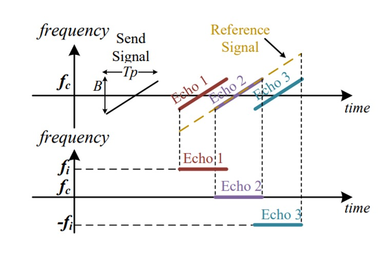
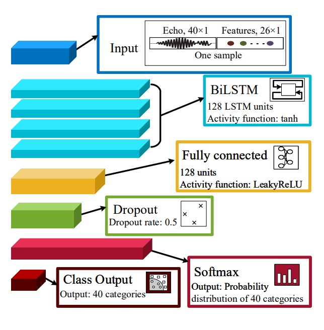
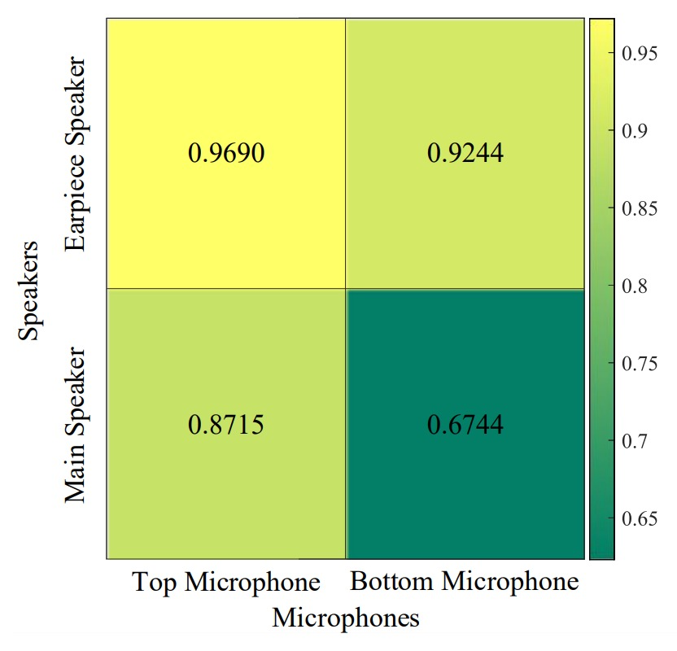
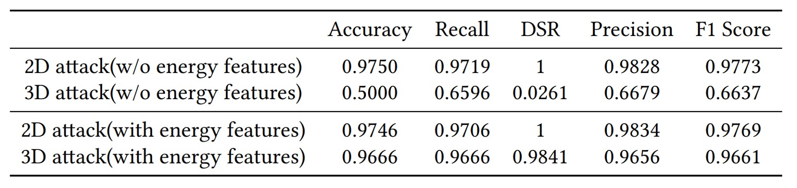

## 波動的邊界

[**AFace: Range-flexible Anti-spoofing Face Authentication via Smartphone Acoustic Sensing**](https://www.researchgate.net/profile/Chao-Liu-80/publication/378372686_AFace_Range-flexible_Anti-spoofing_Face_Authentication_via_Smartphone_Acoustic_Sensing/links/65d6faf2adc608480adf3229/AFace-Range-flexible-Anti-spoofing-Face-Authentication-via-Smartphone-Acoustic-Sensing.pdf)

---

翻開這篇論文，發現有 33 頁！

讓我們不禁頭痛了起來。

## 定義問題

智慧型手機的身份驗證系統，在過去十年經歷了從 PIN、指紋、虹膜到臉部辨識的演進。

這些方法彼此遞進，從記憶轉向生物特徵，從接觸感測轉向非接觸感測，每一步都訴求更高的便利與安全性。

但這段技術演化的路線，似乎也在某處碰到了邊界。

- **PIN 密碼** 容易遺忘，也容易被偷窺；
- **指紋辨識** 雖具唯一性，卻能被複製成矽膠模型；
- **虹膜辨識** 準確但成本高昂，難以普及；
- **臉部辨識** 雖已廣泛部署，卻脆弱於最基本的照片與影片攻擊。

即便進一步導入 3D 感測模組，例如 dot projector、紅外結構光，仍然存在以下三個風險：

1. **成本與體積限制**：這類硬體元件往往使得手機 BOM 增加 5% 以上，難以普及；
2. **資源與延遲瓶頸**：高效能模型往往伴隨超過 4 秒的推論時間，難以接受；
3. **偽造與隱私風險**：視覺資訊不僅可被複製、也易於外洩，難以防範。

不只如此，主流的防偽研究雖持續演進，從紋理特徵到深度學習，卻始終難以擺脫一項核心挑戰：

> **當攻擊者手上握有 3D 列印模型，現有視覺系統仍無從辨識其材料本質**。

於是，有人開始從訊號入手。

聲波、WiFi、RFID、RF 訊號開始出現在身份驗證的文獻中。這些非視覺的方法，試圖穿透形貌，讀取使用者的步態、呼吸、心跳與反射特徵。然而，這些方法仍面臨自身的限制：

- 步態特徵受衣著、姿勢影響過大；
- WiFi 與 RFID 雖準確，卻仰賴額外裝置與標籤；
- 耳道辨識則需要配戴不舒適的入耳式設備。

即使是近期已能以手機麥克風／喇叭實現的聲波臉部辨識，也大多著眼於形狀重建，仍難逃 3D 假臉模型的模仿攻擊。因為一旦形狀一致，回音就雷同，辨識就失敗了。

於是問題來了：

> **如果連回音都能被模仿，還有沒有一種特徵，是攻擊者無法偽造的？**

## 解決問題

<figure style={{"width": "90%"}}>

</figure>

AFace 是以聲波為主的驗證系統。

它依靠一對手機既有的發聲與收音組件，喇叭與麥克風來進行臉部辨識。

整體流程包含四個步驟：

1. **聲波投射**：使用者在兩個不同距離下，讓手機主動發出聲波並接收反射回音，藉此建立「能量－距離」的對應關係。
2. **訊號前處理**：回音訊號經過背景反射消除與匹配濾波（match filtering）處理，以過濾掉直接波與非臉部物體的干擾，並提取與距離維度相關的資訊。
3. **補償模型**：為了因應使用者與手機距離的浮動，系統將建立一個範圍自適應（RA: Range Adaptive）模型，並利用前述雙距離資料計算出一個能量補償函數（ECF: Energy Compensation Function），使得往後所有測量都能被標準化回相同參考基準上。
4. **特徵抽取與模型訓練**：在訊號經過補償後，系統會提取其關鍵特徵，並以深度學習模型進行分類訓練，作為後續比對的基礎。

### 聲波投射

聲音既要被發射，也要能被辨識；既要能量集中，也不能打擾使用者。

為了讓這條訊號兼具「可解性」與「可行性」，作者採用幾個設計：

1. **訊號設計**：AFace 採用 **FMCW（Frequency Modulated Continuous Wave）** 作為訊號基底，其優點如下：

   1. **頻率區隔性高**：10–22 kHz 的設計避開了大多數背景聲（< 8kHz），能透過高通濾波移除環境干擾；
   2. **解析度夠細**：12 kHz 頻寬對應 1.4 cm 的距離解析度，可辨識臉部區域的細微差異；
   3. **可在手機端運作**：多數手機支援 24 kHz 以下頻率；考量訊號衰減，22 kHz 是合理上限；
   4. **聲音不擾人**：10 ms 的訊號長度 + 40 ms 間隔，讓使用者「幾乎無感」；
   5. **能量控制得宜**：應用 Hanning window 聚焦能量在 16 kHz，避免頻譜外洩。

   這段訊號的數學形式如下：

   $$
   s(t, \hat{t}_m) = \text{rect}\left( \frac{\hat{t}}{T_p} \right) \cdot e^{j 2\pi \left( f_c t + \frac{1}{2} k \hat{t}^2 \right)}
   $$

   看不懂沒關係，讀者大概理解一下就好，其中每個部分的意義如下：

   - $\text{rect}(\cdot)$：定義訊號只存在於 10 ms 內（$T_p = 10$ ms）；
   - $f_c$：載波頻率（centered at 16 kHz）；
   - $k$：掃頻率（chirp rate）；
   - $\hat{t} = t - t_m$：為 fast time，用來標定每段訊號的時間窗格；
   - $t_m = mT$：為 slow time，代表每個 chirp 發送的時間點（$m = 0, 1, 2, ...$）。

   透過這樣的設計，訊號在物理世界中展開、反射、收斂為一組可供比對的數位特徵。

2. **等深模型（Iso-depth Model）**：當聲波傳出後，手機麥克風接收到的其實是一組混亂的訊號。為了解析這些訊號，作者將其分類為四類來源：

   1. **環境聲音雜訊**；
   2. **直達路徑訊號**（從喇叭直接到麥克風）；
   3. **來自人臉的反射**（作者想要的）；
   4. **來自其他物體的反射**（作者想移除的）。

   為此，AFace 建立如下的多路徑接收模型：

   $$
   s_r(t, \hat{t}_m) = \sum_i \text{rect}\left( \frac{\hat{t} - \tau_i}{T_p} \right) \cdot e^{j 2\pi \left( f_c (t - \tau_i) + \frac{1}{2} k (\hat{t} - \tau_i)^2 \right)}
   $$

   其中：

   - $\tau_i$：代表第 $i$ 條路徑的延時；
   - 可視為將第 $i$ 條反射訊號建模為類似發射訊號的延遲版本。

   為了簡化訊號處理，作者將整體訊號進一步拆成：

   $$
   s_r(t, \hat{t}_m) = \sum_i s_i + \sum_j s_j
   $$

   - $s_i$：為目標反射（人臉）；
   - $s_j$：為其他非人臉反射（之後將要移除）。

---

為了讓聲波能對應到「一張臉」，AFace 採用的核心技術是 match filtering（匹配濾波），將接收到的回音訊號與參考訊號 $s_{\text{ref}}$ 作卷積，找出其在時間軸上的重疊區域，形成一個能量峰值：

$$
E = \sum_i s_i \odot s_{\text{ref}}
$$

- $\odot$：為卷積運算；
- 能量峰值代表回波與參考訊號「對齊」的位置，亦即反射距離的分布。

由於不同區域若距離相近，峰值會重疊並能量疊加，這樣的「疊加現象」成為臉部各區的反射辨識依據。

為了讓模型具備「臉部意識」，AFace 將臉部分成六個等深區塊，如下圖所示：

<figure style={{"width": "90%"}}>

</figure>

- **最接近：鼻尖（反射面積小、能量低）**；
- **前環區：眼窩、額頭、嘴唇（反射面積大、正對手機，能量最高）**；
- **側頰區：斜角反射、能量有限**；
- **最遠區：耳朵（距離遠、結構複雜、能量最低）**。

這些物理條件，轉化為能量分佈的模型峰值，如上圖 (b) 所示。作者甚至在後續實驗中以遮擋區域的方式驗證模型準確性，證明聲波反射能真實對應臉部材質與形狀。

### 訊號前處理

所有訊號都是故事，但我們得先讓雜音閉嘴。

訊號設計固然重要，但真正進入接收端之後，我們面對的是一段扭曲、延遲、充滿雜訊的聲波。我們無法假設手機送出的訊號就是我們收到的訊號，因為硬體的非理想性與環境的不可控，讓「回聲」這個訊號，成為一份等待被清洗與校正的原始檔。

AFace 的前處理模組分為以下四步驟：

1. **擷取真實參考訊號**

   首先，手機喇叭與麥克風對不同頻段的增益不同，導致實際發射與接收訊號並不理想。

   為此，作者提出一個實用的「去硬體化」方法：

   - 在無人環境中收集一次背景訊號；
   - 第二次放置一塊 $1 \text{ cm} \times 1 \text{ cm}$ 紙板於 15 cm 處，收集一次單一反射；
   - 取兩者差值，可近似取得單純來自該紙板的單一回聲，作為後續的參考訊號 $s_{\text{ref}}$。

   這個動作的意義在於：我們不再假設知道發射訊號，而是透過量測來回推真實的聲音。

---

2. **對齊訊號起始點**

   

   <figure style={{"width": "70%"}}>
   
   </figure>
   

   手機的喇叭與麥克風無法同時運作，因此接收到的訊號無法直接標定「真正的發射時間」。

   為解決這個問題，作者利用了手機內部「喇叭到麥克風的固體傳播」：

   - 聲音在手機內部（喇叭 → 麥克風）距離僅數公分，傳播延遲僅約 0.04 ms；
   - 固體傳播耗損低，訊號強度高；
   - 透過 cross-correlation，可精確抓出直達訊號的到達點，作為時間基準。

   這個動作會帶來約 1–2 個 sample 的誤差（約 0.7 cm），但不會影響臉部相對距離（差值仍準確），且可由後續 RA 演算法消除。

---

3. **雜訊消除**

   雜訊分為兩種：

   - **環境噪聲**：多為 10 kHz 以下，可直接用高通濾波器去除；
   - **訊號雜訊**：例如直達訊號干擾或多重反射雜訊，則需用參考訊號進行對應減除。

   不過，直接相減無法完全去除雜訊，因為回波強度會依反射物距離而衰減，波形相似但振幅不同。

   為此，作者引入縮放係數 $\varepsilon$，以最小化下式的差值誤差：

   $$
   \min_\varepsilon \left\| S_r - \varepsilon \cdot S_c \right\|^2
   $$

   - $S_r$：接收訊號；
   - $S_c$：先前記錄的乾淨參考訊號；
   - $\varepsilon$：透過最小平方法求得。

   實驗顯示，在 200 帧的連續訊號中，$\varepsilon$ 的變動可穩定補償反射衰減。

---

4. **匹配濾波**

   

   <figure style={{"width": "70%"}}>
   
   </figure>
   

   一旦對齊並去除雜訊，我們已得到近似人臉的回音訊號 $s_i$。

   接下來進行匹配濾波（match filtering），也就是與參考訊號做卷積：

   $$
   y_t = s_i \odot s_{\text{ref}} = \frac{\sin(\pi k T_p t)}{\pi k t} \cdot \text{rect}\left(\frac{t}{2T_p}\right) \cdot e^{j2\pi f_c t}
   $$

   這是一個類似 sinc 函數的結果，代表：

   - 不同距離的反射，會在不同時間點產生能量峰值；
   - 每個峰值對應臉部不同區域的「深度回聲」；
   - 若用傅立葉分析，可得每段回波對應的頻率：

   $$
   f_i = -k \cdot \frac{2\Delta R}{c}
   $$

   其中 $\Delta R$ 為與參考訊號之間的距離差，$c$ 為聲速。

   換句話說，這裡是透過匹配濾波與傅立葉轉換，把一段模糊的聲波訊號，還原成一份有解析度的「距離圖譜」，也就是臉部結構的深度輪廓。

### RA 補償演算法

接著我們需要把變動的距離轉換成穩定的特徵，作為後續的臉部辨識依據。

聲音的回聲是距離的函數。

但在真實使用場景中，使用者不可能總是在 15 公分或 20 公分的位置舉起手機；每一次認證，臉與手機的距離都在些微浮動。這樣的距離差異會導致訊號相位偏移、能量改變，進而影響模型辨識的穩定性。

AFace 為此設計了 **RA（Range Adaptive）補償機制**，將每一次變動的輸入，重新映射回一個穩定的距離與能量基準。

這個機制包含兩個子模組：

1. **Range Compensation**：補償回聲訊號的相位變化；
2. **Energy Compensation**：校正反射能量與距離之間的對應關係。

AFace 在註冊階段，要求使用者於兩個不同距離（例如 $D_0$、$D_1$）下進行註冊，並記錄其最近回聲點（距離 $d_0$、$d_1$）與對應最大能量（$e_0$、$e_1$），作為後續補償的基準。

當進入認證階段，若臉部距離為 $d_i$，其回聲訊號的相位為：

$$
\varphi_1 = 2\pi f_c \left(t - \frac{2d_i}{c}\right) + \pi k \left(t - \frac{2d_i}{c}\right)^2
$$

相對應的理想相位 $\varphi_0$（以 $d_0$ 為參考）為：

$$
\varphi_0 = 2\pi f_c \left(t - \frac{2d_0}{c}\right) + \pi k \left(t - \frac{2d_0}{c}\right)^2
$$

兩者相差為：

$$
\Delta \varphi = -\frac{4\pi f_c}{c}(d_i - d_0) - \frac{4\pi k t}{c}(d_i - d_0) + \frac{4\pi k}{c^2}(d_i^2 - d_0^2)
$$

這樣的相位差不只是時間差異，還會導致傅立葉變換後的峰值偏移，進而影響距離估計與特徵提取。

為了對齊訊號，AFace 對所有訊號執行如下補償操作：

$$
s' = \frac{e^{-j\varphi_1}}{e^{-j\Delta \varphi}} = e^{-j(\varphi_1 - \Delta \varphi)}
$$

也就是讓訊號的相位重回「標準距離」的位置，彷彿所有臉都在同樣的位置上進行比對。

除了相位偏移，回聲的能量也隨距離與材質而變。

AFace 發現這不只是誤差來源，反而可以轉化為有力的辨識特徵。

於是作者進行實驗設計：

- 將不同材質（紙板、木板、鐵板）以固定速度向手機靠近；
- 每次播放 10 秒訊號並記錄不同距離下的峰值能量；
- 過濾雜訊與背景反射、執行匹配濾波，得到不同距離下的反射強度；
- 擷取各距離之最大能量，繪製能量變化圖；
- 線性迴歸擬合能量與距離，得到極高相關係數（$R^2 = 0.9536$，RMSE = 0.03198）。

實際操作的方式如下圖：

<figure style={{"width": "90%"}}>

</figure>

由於能量與距離呈高度線性相關，且不同材質會呈現不同能量曲線。

AFace 建立一條能量補償函數（ECF）如下：

$$
\text{ECF}(d_i) = \frac{e_1 - e_0}{d_1 - d_0}(d_i - d_0) + e_0
$$

這代表在距離 $d_i$ 時，理論上應該出現的能量。實際上收到的能量 $e_i$ 則會被補償為：

$$
e'_i = e_i \cdot \frac{e_0}{\text{ECF}(d_i)}
$$

此補償不會強行將 $e_i$ 拉回 $e_0$，而是保留其特徵性，也就是說：

> **若攻擊者使用 3D 假臉，其材質與能量分佈不同，即使距離相同，補償後的能量也會與真實用戶明顯不同。**

這是一種「差異保留型補償」，既校正了距離影響，又放大了材質差異，讓聲波的能量成為一種不可偽造的「臉的證明」。

### 特徵擷取

當訊號被對齊、補償、過濾之後，AFace 需要從這些回聲中，提取能分辨一個人與另一個人的資訊。

作者將這些特徵設計分為兩大類：

- 距離特徵（Distance Features）
- 能量特徵（Energy Features）

首先是距離特徵：

延續 Iso-depth 分區模型，AFace 將臉部分成六個主要區域，並選擇其中五個作為深度分析目標：

- 鼻尖（nose tip）
- 鼻根（nose root）
- 嘴唇與眼窩（lips & eye socket）
- 臉頰與額頭（cheek to forehead）
- 側臉（side of face）
- 耳朵作為最遠端，深度基準設為 0

根據這些分區，特徵設計如下：

1. **五個絕對距離值**：以匹配濾波後的峰值位置估計；
2. **十組相對距離差**：任意兩區之間的深度差值，例如鼻尖與鼻根的距離代表「鼻梁高度」；
3. **五組面積近似資訊**：當多區深度接近，匹配濾波後會產生 **重疊峰**，寬度反映反射區域大小；

   - 具體以 50% 能量處的峰寬為基準（類似 FWHM 概念）；
   - 特別針對鼻根與嘴唇–眼窩區，計算兩個近距區的峰寬。

---

接著是能量特徵：

材料不同，聲波反射也不同。為此，作者設計了幾個遮罩實驗如下圖：

<figure style={{"width": "90%"}}>

</figure>

根據覆蓋不同區域的實驗，來觀察能量變化。實驗中也發現材質（皮膚 vs 模型）對能量的吸收率、反射率造成顯著影響。

也就是說：即使 3D 模型在形狀上成功騙過我們，它的能量表現依然會出現偏差。

最後，作者選定擷取的能量特徵如下：

1. **最大能量**（max energy）：整體反射強度，反映皮膚與面積資訊；
2. **平均峰值能量**（avg peak energy）：整體臉部的反射平均；
3. **變異數**（variance）：反映臉部深度分佈是否集中還是分散；
4. **尖峰因子**（peak factor）：高反射點的強弱程度；
5. **平均頻率**（average frequency）：回聲主頻分佈；
6. **能量密度**（energy density）：能量在區域內的集中程度。

這些特徵綜合反映材質特性，補足了形狀無法區辨的部分。

AFace 總共選用了 26 維特徵，融合形狀、材質、反射行為於一體，成為 AFace 後端分類模型的核心輸入。

### 分類器架構

<figure style={{"width": "60%"}}>

</figure>

完成特徵設計和截取後，AFace 需要一個分類器來將這些特徵轉化為「我認識你」的結果。

作者將其分為兩個部分：

1. 使用 BiLSTM 捕捉訊號中的時序邏輯與分區特徵；
2. 使用 iCaRL 解決使用者更新與類別擴增時的「遺忘問題」。

在 AFace 中，輸入特徵不只是表格化資訊，而是包含「訊號切片」、「距離關係」與「能量輪廓」的複合特徵。為了處理這樣的資料結構，AFace 採用了「四層 BiLSTM 結構」：

- **40 維訊號切片（時間序列）**：

  - 取自去雜訊與距離補償後的 echo 殘響；
  - 對齊鼻尖為起點，截取 40 sample ≈ 14 cm 範圍；

- **20 維距離特徵**：

  - 5 個絕對深度（鼻尖、鼻根、唇眼、頰額、側臉）；
  - 10 個相對深度差；
  - 5 個匹配濾波後的峰寬（反映區域重疊與形狀）；

- **6 維能量特徵**：

  - 反映材質性質、分佈與反射強度（見前章）。

BiLSTM 的參數配置如下：

- **Layer**：共四層；
- **啟動函數**：`tanh`（隱狀態值在 $[-1, 1]$ 間波動）；
- **閘控函數**：`sigmoid`，表示訊息是否保留；
- **權重初始化**：Xavier initialization（針對 `tanh` 最佳化）；
- **遺忘閘**：初始化為接近 1（unit-forget-gate），強化長序列學習能力。

全連接層與分類器的部分則是：

- **Dense Layer（128 units）**，啟用函數為 `LeakyReLU`；
- **Dropout 層（rate = 0.5）**，防止過擬合；
- **Softmax 層（40 類別）**，將最後輸出轉換為身份機率分佈；
- **Classifier**：將 Softmax 機率對應至身份類別。

---

另一個部分是 iCaRL 增量學習策略。

AFace 為了解決「使用者增加」與「臉部變化」這兩類長期問題，採用了 iCaRL（Incremental Classifier and Representation Learning）策略，將神經網路變成一個可動態更新、不遺忘舊知識的結構。

增量學習分成類別增量與資料增量兩種情境：

- **類別增量學習（Class Increment）：**

  - 新使用者註冊時，從其回聲資料擷取特徵，產生新的訓練樣本；
  - 模型結構上增加一層新的全連接分類節點，以支援新類別；
  - 凍結既有 BiLSTM 與 FC 層，保留已學知識、不再重訓；
  - 僅微調新層，加快訓練、穩定輸出。

- **資料增量學習（Data Increment）：**

  - 當使用者多次通過輔助驗證（例如輸入 PIN），系統認定其臉部可能發生長期變化；
  - 每發生一次「聲波驗證失敗但備援成功」，會將新樣本暫存；
  - 當累積樣本數 ≥ 5，即觸發「資料增量學習」流程；
  - 保持模型架構不變，僅以低學習率進行微調，實現長期適應與記憶更新。

這種增量學習方式避免了傳統模型在新資料出現時的「毀滅性遺忘（catastrophic forgetting）」，也避免了重新訓練整個網路所需的高計算成本。

這樣設計的目的在於，作者希望 AFace 能夠持續觀察使用者而逐步修正記憶，概念上不只是一個分類器，而是一種「適應關係」。

## 討論

論文中的實驗表格非常多，我們不一一列舉，有興趣的讀者可以參考原始論文。

以下我們挑幾個方向來檢視這個方法的表現。

### 不同喇叭與麥克風組合

<figure style={{"width": "60%"}}>

</figure>

實驗結果顯示：最佳組合為「頂部喇叭 + 頂部麥克風」。

若使用底部喇叭或麥克風，回聲多半來自使用者的胸口區域，受衣物材質影響大；小小變動（如換件外套）便會造成系統辨識表現顯著下降。

這裡建議硬體設計上，建議優先選擇頂部組合，以減少無關反射且更專注於臉部訊號。

### 2D 與 3D 攻擊

<figure style={{"width": "90%"}}>

</figure>

實驗結果顯示：無論是 2D 攻擊還是 3D 攻擊，AFace 都能有效防禦。其根本原因在於「聲波驗證包含深度與材質」，平面影像無法提供任何真實回聲。

如果不納入能量特徵，AFace 對 3D 假臉的防禦成功率僅有 5%；但一旦加入能量特徵，成功率提升至 98% 以上。因為 3D 模型即使形狀一致，材質吸收與反射率依舊和人臉不同，而 AFace 能夠「聽出」這些差異。

### RA 演算法的重要性

<figure style={{"width": "90%"}}>

</figure>

為了驗證 RA 演算法的有效性，作者進行了以下實驗：讓使用者在 25 cm 與 50 cm 註冊後，再於 25、30、35、40、45、50 cm 進行單一用戶模式的多次測試。

實驗結果顯示在沒有 RA 的情況下，僅有註冊距離（25、50 cm）準確率較高（>96%），其餘距離約 90%；而啟用 RA 後，各距離準確率均高於 95%，平均 96.7%。可見 RA 有效校正相位與能量偏移，讓「距離」不再是使用者體驗的最大障礙。

### 長期使用與臉部變化

<figure style={{"width": "90%"}}>

</figure>

再來是要驗證 iCaRL 的增量學習效果。

AFace 進行了長達兩個月的實驗，觀察使用者的臉部變化與系統準確率：使用者分為兩組，一組使用 iCaRL 增量學習，另一組則不使用。經過連續兩個月的資料收集，觀察「老化」、「髮型變化」、「配戴眼鏡」對系統的影響。

實驗結果顯示：在無增量學習的情況下，隨著時間拉長，準確率明顯下滑；而啟用 iCaRL 後，系統可自動更新模型，長期穩定度保持高水準，約 95~98% 間波動。

## 結論

從 2019 開始，聲波逐漸被引入 FAS 領域，帶來一條不同於影像的辨識路徑。

但這些方法普遍有許多限制，最重要的：

> **聲波無法解決 3D 面具的問題！**

在聲波下的面具和真實臉部幾乎沒有區別。

在 AFace 這篇工作中，把材質的概念引入，讓聲波的回聲成為「距離 + 材質」的複合函數，才終於讓聲波成為一個可行的 FAS 方法。

AFace 不只改善了 3D 抵禦力，更透過距離補償（RA）與能量建模（ECF），拓展了聲波驗證在真實世界中的操作彈性與使用情境。它也是少數同時在商用手機完成實作，並加入增量學習以處理長期變異的聲波驗證系統之一。

這不代表這個問題已被完整解決，但至少我們知道：

**聲波已經可以成為獨當一面的辨識線索。**
