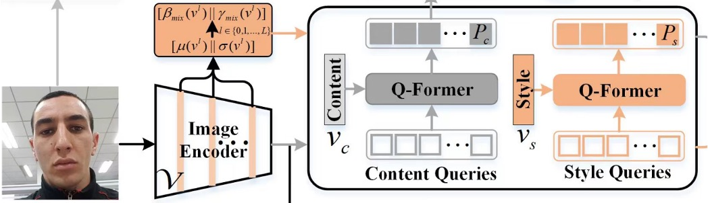
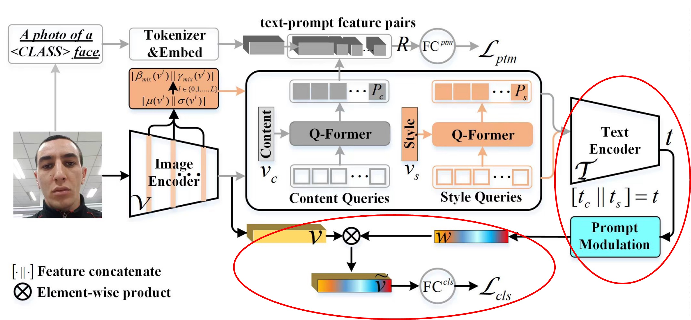
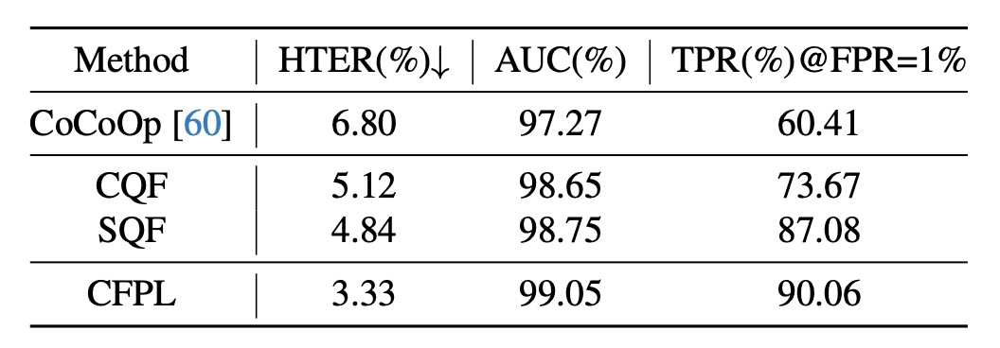

# [24.03] CFPL-FAS

## 無類別提示學習

[**CFPL-FAS: Class Free Prompt Learning for Generalizable Face Anti-spoofing**](https://arxiv.org/abs/2403.14333)

---

這篇文章到架構有點複雜，但是我們可以從標題中找到幾個很明顯的關鍵字：

- 第一個是 Class Free
- 第二個是 Prompt Learning。
- 最後應用的場景在於 Face Anti-spoofing。

抓住這三個重點，閱讀這篇論文就會變得比較輕鬆。

FAS 的本質是人臉辨識系統的防禦措施，目的是為了防止假冒者使用照片、影片等方式進行攻擊。既然作者把目標選定在 Face Anti-spoofing，那麼我們就先來看看過去這個領域的一些解題思路。

## 定義問題

在比較早期的研究中，研究者們主要是通過設計一些特徵來區分真實人臉和假冒人臉。這些特徵包括了紋理、光譜、運動等等，但是這些特徵都是有限的，因此研究者們開始轉向深度學習，透過卷積網路等架構來找出偽造人臉的特徵。

正所謂道高一尺，魔高一丈。攻擊者為了應對深度學習的 FAS 系統，開始使用高品質的照片、影片等方式進行入侵。

為了防禦未知的攻擊，近幾年主要流行的方式是領域泛化（Domain Generalization），這種方式的核心思想是壓抑模型對於訓練數據的過度擬合，使得模型在未知的數據上也能夠有較好的表現。

又接著到了 LLM 的時代，多模態的訓練方式也被廣泛應用在 FAS 領域，透過不同模態的訓練資料來提高模型被攻破的難度。

---

到這邊，我們先從 Prompt Learning 來切入這個問題。

因為一般人根本 Train 不動 LLM，後來衍生出使用 Prompt 的方式輸入給 LLM 得到文字特徵，然後再透過這些文字特徵來進行引導我們自己的模型訓練。

這雖然不是一個很新的概念，大概從 CLIP 之後比較廣為人知，後續研究 BLIP 則是把這個概念應用在圖像和語言的訓練上。

- [**[22.01] BLIP: Bootstrapping Language-Image Pre-training for Unified Vision-Language Understanding and Generation**](https://arxiv.org/abs/2201.12086)

回到這篇論文。

作者希望 FAS 領域也能夠使用 Prompt Learning 的方式，但是 FAS 這裡的類別數量太少，此外那些預訓練的模型也不是針對 FAS 領域進行訓練的，就算用了 Prompt learning 也無法取得有價值的特徵，更別說進行泛化了。

因此問題的定義已經很明顯了，作者希望能夠在 FAS 領域進行 Prompt Learning，但是不使用任何類別提示，並且能夠達到泛化的效果。

接著我們就來看看具體的解決方案。

## 解決問題

### 模型架構

上圖是整個模型的架構，但直接看這張圖顯然不符合人體工學。

因此我們需要拆解這個模型。

### Prompts Generation

FAS 的特徵是隱性的藏在圖像中的。

:::tip
如果你是第一次看到這個題目的讀者，我們簡單介紹一下：

常見的 FAS 攻擊像是 Replay Attack，攻擊者會使用一張真實人臉的照片或者影片來進行攻擊，假冒身份。這個類型的攻擊，模型可能需要找到螢幕的特徵，例如異常反光或摩爾紋等等。

另外一種攻擊是 Print Attack，攻擊者會使用一張印刷的人臉照片來進行攻擊。這個類型的攻擊，模型可能需要找到印刷的特徵，例如紙張的紋理等等。

你可以發現，人臉的特徵是很強的，我們一眼就能看到，反觀 FAS 這些特徵都是隱性的，不容易被人類直接感知到。
:::

為了找到這些隱性的特徵，作者設計了兩組特徵：

1. **Content Q-Former:** 這是一個 Transformer Decoder 模組，用來查詢 FAS 圖像的「文字」特徵。
2. **Style Q-Former:** 這是另外一個 Transformer Decoder 模組，用來查詢 FAS 圖像的「風格」特徵。

這裡對應的模型架構是這一塊：

查詢的 Token 是隨機初始化的，每一組有 16 個 Token，這個部分作者做了一些實驗，發現 16 個就夠用了。

查詢的對象來自於 FAS 圖像，經過 CLIP 的 Image Encoder 得到圖像的特徵，但不是單純的輸出特徵，而是取出 Image Encoder 「每一層」 的輸出結果，計算平均值和標準差，就會得到「每一層」的風格特徵。最後把所有層的風格特徵取平均，就得到了整張圖像的風格特徵 $\boldsymbol{v}_{s}$。

數學公式如下：

$$
\boldsymbol{v}_{s} = \frac{\sum_{l=1}^{L}\boldsymbol{v}^{l}_{s}}{L}, \quad \boldsymbol{v}^{l}_{s} = \left[\mu(\boldsymbol{v}^{l}) \,||\, \sigma(\boldsymbol{v}^{l})\right], \quad \boldsymbol{v}_{s} \in \mathbb{R}^{1 \times 2d}
$$

其中，$L$ 是圖像編碼器的總層數，$\left[\cdot || \cdot\right]$ 表示在嵌入維度上串聯特徵。

另外，直接取得 Image Encoder 的原始輸出，並進行標準化，就會得到圖像的內容特徵 $\boldsymbol{v}_{c}$。

$$
\boldsymbol{v}_{c} = \frac{\boldsymbol{v}^{L} - \mu(\boldsymbol{v}^{L})}{\sigma(\boldsymbol{v}^{L})}, \quad \boldsymbol{v}_{c} \in \mathbb{R}^{n \times d}
$$

得到查詢目標之後，Content Q-Former 會去查詢 $\boldsymbol{v}_{c}$，而 Style Q-Former 則會去查詢 $\boldsymbol{v}_{s}$，這樣就得到了兩組特徵。

:::tip
**等等，為什麼從 Image Encoder 的輸出，會變成「文字內容」特徵？**

你忘記 CLIP 本來就是在做圖像和文字的對齊模型了嗎？所以從圖像分支進來的特徵，或是從文字分支進來的特徵，都可以被視為「文字」和「圖像」特徵的疊加態。
:::

### Prompt Optimization

這一章節討論的是上圖中藍色和綠色圈起來的部分。

從上一步驟中產出的 Prompt 特徵，是不能直接用的，因為 CLIP 缺乏對 FAS 領域的知識。

作者透過一個二元分類的任務來引導 Content Q-Former（之後簡稱為 CQF）在更高層次上理解 FAS 的類別，這裡給的是一個「匹配」任務，要求模型預測提示文字對（feature pair）是否匹配。

首先透過一段文字敘述 `a photo of a [CLASS] face`，這裡的 `[CLASS]` 是只有兩種可能，分別是 `real` 和 `fake`。接著拿出 CLIP 模型的 Text tokenizer 和 Text embedding 層將這段文字轉換成 CLIP 的文字特徵。

到這邊，前置工作準備完成，現在要來製作正負樣本對。

作者在這裡引入 ALBEF 的設計理念，透過一個 Bank 來儲存一定數量的 Prompt 特徵，這樣就可以在訓練過程中，隨機抽樣出正負樣本對，並且搭配「Hard Negative Mining」的方式，來提高訓練的效率。

- [**[21.07] ALBEF: 追尋純粹的路**](../../multimodality/2107-albef/index.md)

組合正負樣本對之後，透過一個全連接層，得到一個 logit，再透過 Cross Entropy Loss 來進行優化，整個流程的數學式如下：

$$
\boldsymbol{S} = \texttt{Embed}(\texttt{Tokenizer}(\boldsymbol{T})), \quad \boldsymbol{S} \in \mathbb{R}^{B \times 77 \times d}
$$

$$
\boldsymbol{S} = \texttt{Mean\&Expand}(\boldsymbol{S}), \quad \boldsymbol{S} \in \mathbb{R}^{B \times N \times d}
$$

$$
\boldsymbol{R}_{p} = \left[\boldsymbol{P} \,||\, \boldsymbol{S}\right]_{\texttt{2}}, \quad \boldsymbol{R}_{p} \in \mathbb{R}^{B \times N \times 2d}
$$

$$
\boldsymbol{R} = \left[\boldsymbol{R}_{p} \,||\, \boldsymbol{R}^{prompt}_{n} \,||\, \boldsymbol{R}^{text}_{n}\right]_{\texttt{0}}, \quad \boldsymbol{R} \in \mathbb{R}^{3B \times N \times 2d}
$$

最後，文本監督的優化可通過對聯合特徵 $\boldsymbol{R}$ 預測匹配與不匹配的概率來實現：

$$
\mathcal{L}_{ptm} = \sum_{i=1}^{3B} \mathcal{H}\left(\boldsymbol{y}^{ptm}_{i}, \texttt{Mean}(\texttt{FC}^{ptm}(\boldsymbol{R}_{i}))\right)
$$

其中，將每個查詢嵌入輸入到一個二類線性分類器中，得到一個 logit，並將所有查詢的 logits 取平均（Mean）作為輸出匹配分數。$\mathcal{H}(., .)$ 是交叉熵損失，$\texttt{FC}^{ptm}$ 是一個帶有 softmax 的全連接層，而 $\boldsymbol{y}^{ptm} \in \{0, 1\}$ 是一個表示真實標籤的二維 one-hot 向量。

---

在論文中計算 $L_{ptm}$ 的時候，出現了三個不同的 $\boldsymbol{R}$，分別是 $\boldsymbol{R}_{p}$、$\boldsymbol{R}^{prompt}_{n}$ 和 $\boldsymbol{R}^{text}_{n}$。

這裡的正樣本對是 $\boldsymbol{R}_{p}$，負樣本對是 $\boldsymbol{R}^{prompt}_{n}$ 和 $\boldsymbol{R}^{text}_{n}$。

畫個圖來表示一下，像是這樣：

### Class Free Prompt

最後就是 Class Free Prompt 的部分了。

到這裡反而變得比較簡單了，因為我們已經有了 Prompt 特徵，也有了 Prompt 的優化方式。

在其他論文的常見設計中，我們會將特徵拿去做分類，可能會分成 `Real`、`Print`、`Replay`、`Deepfake` 等等類別。在這裡作者認為這個設計是不夠泛化的，因為這樣的設計只能在這些類別上有較好的表現，但是在其他類別上可能就會表現不佳。

因此作者改成了一個二元分類的設計，只有 `Real` 和 `Fake` 兩個類別，除了 `Real` 之外，其他的都歸為 `Fake`。那至於是哪一種 `Fake`？那不重要，讓模型自己去內部歸納就好。

最大幅度的降低人工的先驗知識干預，讓模型自己去學習。

---

紅色框起來的部分就是 Class Free Prompt 的部分。

將 CQF 和 SQF 的特徵分別輸入 CLIP 的 Text Encoder，得到文字特徵後，把兩個特徵串接起來，再透過一個簡單的全連接層，得到一組特徵。最後與 CLIP 的 Image Encoder 的特徵進行點積運算，得到最終的預測 logit，這個 logit 會透過 Cross Entropy Loss 進行優化。

在論文中的 `Prompt Modulation` 模組設計如下：

$$
\boldsymbol{w} = \delta (\texttt{g}_{e}(\boldsymbol{t}, \mathbf{W})) = \delta (\mathbf{W}_{2}\sigma_{\textrm{relu}}(\mathbf{W}_{1}\boldsymbol{t})),
$$

$$
\boldsymbol{\tilde{v}} = \left[\boldsymbol{\tilde{v}}^{1}, \boldsymbol{\tilde{v}}^{2}, \dots, \boldsymbol{\tilde{v}}^{d} \right], \quad \boldsymbol{\tilde{v}}^{c} = \boldsymbol{w}^{c} \cdot \boldsymbol{v}^{c},
$$

$$
\mathcal{L}_{cls} = \sum_{i=1}^{B} \mathcal{H}(\boldsymbol{y}^{cls}_{i}, \texttt{FC}^{cls}(\boldsymbol{\tilde{v}}_{i})), \quad \boldsymbol{\tilde{v}} \in \mathbb{R}^{B \times d}
$$

其中，$\sigma_{\textrm{relu}}$ 是 ReLU 函數，$\mathbf{W}_1 \in \mathbb{R}^{\frac{d}{r} \times 2d}$ 和 $\mathbf{W}_2 \in \mathbb{R}^{d \times \frac{d}{r}}$ 是兩個全連接層中的可訓練參數，$r$ 是一個縮減比例，此處設定為 16。最後，通過將通道特徵 $\boldsymbol{v}^{c}$ 與標量 $\boldsymbol{w}^{c}$ 相乘，得到適配的視覺特徵 $\boldsymbol{\tilde{v}} \in \mathbb{R}^{B \times d}$，並將這些特徵傳遞到全連接層（$\texttt{FC}^{cls}$）進行二類（即真實或假冒）概率的預測。$\boldsymbol{y}^{cls} \in \{0, 1\}$ 是對應於真實或假冒人臉的標籤。

### 資料集、協議與評估指標

依據先前的研究，本文採用兩種協議來評估模型的泛化能力。

- **協議 1**：使用四個常用的基準資料集，包括 MSU-MFSD (M)、CASIA-FASD (C)、Idiap Replay-Attack (I)和 OULU-NPU (O)。
- **協議 2**：使用 CASIA-SURF (S) 、CASIA-SURF CeFA (C) 和 WMCA (W) 的 RGB 樣本，這些資料集擁有更多的受試者、多樣的攻擊類型以及豐富的採集環境。

在每個協議中，將每個資料集視為一個領域，並應用留一法測試泛化能力。本文採用三個指標來評估模型性能：

1. **HTER** (Half Total Error Rate)：計算 FRR 和 FAR 的平均值。
2. **AUC** (Area Under Curve)：評估模型的理論性能。
3. **TPR at FPR=1%**：在固定的誤報率 (FPR=1%) 下，計算真陽性率，用以選擇適合的閾值來應用於實際場景。

### 實作細節

- **查詢設定**：樣式與內容查詢長度設為 16，每個查詢的維度為 512；CQF 與 SQF 的深度設為 1。
- **樣式提示多樣化**：在訓練階段以 50% 的機率啟動，但在測試階段不啟動。
- **訓練配置**：批次大小為 12，使用 Adam 優化器，權重衰減設為 0.05，第二階段的最小學習率為 1e-6。圖像大小調整為 224×224，並進行隨機裁剪和水平翻轉的增強，總訓練迭代次數為 500 輪。

## 討論

### 實驗結果

**協議 1**：與其他最新方法相比，本文提出的方法在所有測試資料集上皆達到最佳性能。

本文提出的 CFPL 在 HTER 指標上，對所有目標領域均有較低的錯誤率，如 M (3.09% vs. 5.41%)、C (2.56% vs. 8.70%)、I (5.43% vs. 10.62%) 和 O (3.33% vs. 8.86%)。

整體平均 HTER 為 3.60%，顯著優於先前的最佳結果 7.82%。在引入 CelebA-Spoof 資料集後，CFPL* 表現優於 FLIP-MCL* ，其 HTER 為 2.98% vs. 3.01%。但與 ViTAF*-5-shot 比較時，CFPL* 在平均 HTER 上略遜一籌 (2.98% vs. 2.83%)。

---

**協議 2**：CFPL 在 W 和 C 領域上顯著超越多個基準方法。

在 S 資料集上，CFPL 在 HTER (8.77% vs. 8.32%)、AUC (96.83% vs. 97.23%) 和 TPR@FPR=1% (53.34% vs. 57.28%) 指標上略低於 CLIP-V。這可能是因為 CASIA-SURF 資料集中明顯的假冒痕跡，使得單靠視覺特徵已能具有較好的泛化能力。

與協議 1 類似，在引入 CelebA-Spoof 資料集後，CFPL* 表現優於 ViT* 和 FLIP-MCL\* ，例如在 HTER 指標上的最佳平均值為 7.01%。

### 消融實驗

1. **各元件的有效性**

   

   - **Baseline**：去除了 CFPL 的所有元件。相較於 CoOp 的自由學習向量，Baseline 引入兩個輕量級的 transformer（CQF 和 SQF），以學習影像編碼器條件下的內容和樣式提示，並顯著提升了泛化性能（HTER -0.67%，AUC +1.32%，TPR@FPR=1% +7.88%）。
   - 加入文本監督後，三個指標進一步優化：HTER 7.50%，AUC 96.39%，TPR@FPR=1% 54.78%。這說明內容提示中攜帶的類別屬性對泛化性能有顯著幫助。
   - 在樣式提示中引入樣式多樣化後，性能再次提升：HTER -0.42%，AUC +0.4%，TPR@FPR=1% +2.83%。
   - 如果移除設計的門控函數，泛化性能明顯下降，HTER 從 6.72% 增加到 7.08%，AUC 從 97.09% 降到 96.79%，TPR@FPR=1% 從 60.35% 降至 57.61%。

2. **CQF 和 SQF 結構的影響**

   

   - 在 ICM→O 實驗中，簡單的雙層瓶頸結構無法有效緩解有明顯域差異的 FAS 任務，而當引入 CQF 和 SQF 後，性能顯著提升，HTER 減少了 1.68% 和 1.96%，AUC 提升了 1.38% 和 1.48%，TPR@FPR=1% 分別增加了 13.26% 和 26.67%。
   - 最終，結合 CQF 和 SQF 的 CFPL 在所有指標上達到最佳結果，HTER 3.33%、AUC 99.05%、TPR@FPR=1% 90.06%，顯示出 CQF 和 SQF 的協同效果顯著。

3. **查詢長度與 Q-Former 深度的影響**

   

   - 查詢數量與 CQF 和 SQF 的深度也會影響性能。在 ICM→O 實驗中，進行了查詢長度（[8, 16, 32, 64]）和 Q-Former 深度（[1, 4, 8, 12]）的搜尋實驗。
   - 根據上表，有兩點結論：

     1. 查詢長度設為 16 時達到最佳性能，增加查詢數量對性能提升有限，甚至出現退化趨勢；
     2. Q-Former 的深度對性能影響較小，各深度的性能波動不大。

     因此，建議將查詢數量設為 16，Q-Former 深度設為 1。

### 可視化分析

透過使用注意力模型可解釋性工具，作者從視覺注意力圖上驗證了提出的 CFPL 方法相較於 Baseline 的優越性。Baseline 是移除了 CFPL 所有貢獻的版本，其結果顯示在上圖中，Baseline 的注意力圖對應的是被錯誤分類的樣本，而 CFPL 則能正確分類這些樣本。

在協議 1 的 OCM→I 實驗中，Baseline 將真人臉錯誤分類，因為它過度關注背景部分。而 CFPL 則透過將焦點修正至臉部與背景之間的邊界，成功地正確分類。此外，對於 Replay 攻擊，Baseline 沒有關注到偽造線索，例如電子螢幕上的反光點，而 CFPL 方法則顯示出受照亮的特徵圖區域。在其他子協議中的結果也得出了類似的結論。

## 結論

我們看完這篇論文後，可以發現作者的設計思路是非常獨特的。

在這個模型架構中 CLIP 的部分都不會參與訓練，但我們又希望可以享受到 CLIP 的優勢。

因此整個設計裡面從 CLIP 的 Image Encoder 出發，目的是希望可以透過 Image Encoder 產出可以分類 FAS 的特徵。

但 CLIP 不認識 FAS 啊？怎麼辦呢？

於是作者引入了 CQF 和 SQF 設計，我們覺得這個部分可以理解為用來儲存 FAS 的特徵的「外掛程式」，這個外掛的功能就是把 FAS 的特徵「投影到」 CLIP 的 Text Encoder 的特徵空間中。

CLIP 的 Text Encoder 是已經 Train 好的，所以我們可以做的就是「組合」。我們可以假設 CLIP 的 Text Encoder 已經學會了很多的知識，其中 "Monior"，"Face"，"OOO"，"XXX" 等 N 種 Token 可以聚合出 FAS 的 "Replay" 的特徵。或是 "Paper"，"Texture"，"OOO"，"XXX" 等 M 種 Token 可以聚合出 FAS 的 "Print" 的特徵。

具體用了 Token 是什麼，這個不重要，重要的是讓模型自己找出這一群 Token 可以幫助我們的 FAS 的特徵，這樣就夠了。

找到特徵之後，再將這組特徵和 CLIP 的 Image Encoder 的特徵進行點積運算，這樣算是把 FAS 的特徵附加到 CLIP 的特徵上，這樣就可以進行分類了。

很有趣對吧！
