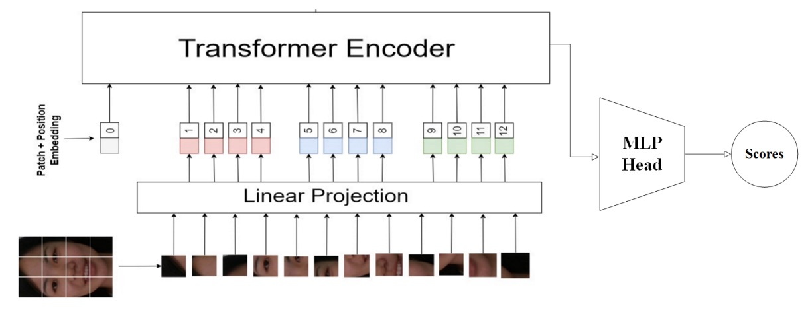

## 兵器譜

[**Unified Physical-Digital Attack Detection Challenge**](https://arxiv.org/abs/2404.06211)

---

這是 CVPR2024 舉辦的 FAS 比賽，全名為：

[**5th Chalearn Face Anti-spoofing Workshop and Challenge@CVPR2024**](https://sites.google.com/view/face-anti-spoofing-challenge/welcome/challengecvpr2024)

非常熱鬧，在 FAS 領域的工作者都可以來逛逛。

## 定義問題

Face Anti-Spoofing（FAS）的任務本質，是從影像中挖掘出「活體」的語法。

然而在現實中，攻擊手段卻以兩種形式發展成平行的技術分支：

- **物理攻擊（Physical Attacks）**：模仿者以實體介質展示臉部，如紙張、螢幕或矽膠面具。其干擾多發生於感測器層，與真實世界有直接交互。
- **數位攻擊（Digital Attacks）**：如 Deepfake、face swapping 或對抗樣本，則從資料生成源頭或特徵層進行操控，畫面逼真但本質虛構。

傳統方法多半針對其中一類進行建模，於是模型表現便侷限於其訓練分佈，無法廣泛遷移。

雖然物理與數位攻擊在最終分類中皆屬於「fake」，但其圖像統計特徵與變異方向存在高度異質性，使得偽類內的特徵距離遠大於預期，導致泛化瓶頸。

目前之所以難以建構「統一模型」，核心原因有二：

1. **缺乏大規模統一資料集**：過往常以單獨蒐集的 PA 與 DA 資料集拼接而成，未涵蓋同一 ID 的完整攻擊樣態。
2. **欠缺公共評估基準**：物理與數位攻擊使用不同的指標與協定，導致無法對跨領域演算法進行一致比較。

這正是 **Unified Physical-Digital Attack Detection Challenge** 發起的背景。透過新資料集、標準協定與公開競賽，嘗試定義一個新的問題設定：

> **能否以一套模型，同時應對兩種異質假象，並在未知領域中仍保有鑑別能力？**

## 統一資料集：UniAttackData

<figure style={{"width": "70%"}}>

</figure>

**UniAttackData** 是目前規模最大、設計最完整的統一攻擊資料集，涵蓋了 1,800 位受試者、共計 28,706 段臉部影片，構成以下三類樣本：

- **Live**：1,800 段真實影像
- **Physical Attacks（PA）**：5,400 段，包括列印、螢幕、3D 面具等
- **Digital Attacks（DA）**：21,506 段，包括 Deepfake、Face Swap、對抗樣本等

資料集的最大特點在於：**每位 ID 均擁有完整的攻擊對應樣本**，讓模型學習過程不會因攻擊類型分佈不均而偏斜。這樣的設計避免模型過度依賴與身份、種族、光照等無關的次要特徵，讓訓練重心回到偵測「假象」本身。

為避免模型提前洞悉資料規則，研究團隊也進行了精緻的預處理：人臉區域經裁切與命名隱寫處理，確保每張圖像在像素層面上無多餘線索可尋。

### 評估協定與泛化設計

本次挑戰包含兩大協定（Protocol），模擬不同真實世界場景下的模型部署需求：

- **Protocol 1：Unified Attack Detection**
  模擬模型需同時辨識 PA 與 DA 的場景，測試模型對於混合樣態的整合與分類能力。

- **Protocol 2：Generalization to Unseen Attacks**
  針對「未曾見過的攻擊類型」進行 zero-shot 測試，進一步分為：

  - **Protocol 2.1：Unseen Digital Attacks**
  - **Protocol 2.2：Unseen Physical Attacks**

此協定採用 leave-one-type-out 的策略，意即模型訓練時完全看不到某類攻擊，迫使其學習更具語義泛化性的辨識邏輯。

---

### 賽程流程與規則設計

整體競賽流程分為兩個階段，皆於 CodaLab 平台進行：

- **Development Phase（2/1–2/22）**
  提供已標記訓練資料與未標記開發集，開放反覆提交預測結果至排行榜，幫助選手逐步調整模型。

- **Final Phase（2/23–3/3）**
  公開開發集標籤、釋出未標記測試集，參賽隊伍須在無法接觸真實測試標籤的情況下，提交最終模型預測。 最後一次提交視為正式成績，並須公開程式碼與技術說明表（fact sheet）方具備獲獎資格。

---

### 評估指標

挑戰採用 ISO/IEC 30107-3 國際標準指標，以量化模型對假象的辨識能力，具體包括：

- **APCER**（Attack Presentation Classification Error Rate）
- **BPCER**（Bona Fide Presentation Classification Error Rate）
- **ACER**（Average Classification Error Rate）
- **AUC**（Area Under the ROC Curve）

主排序以 ACER 為準，AUC 作為輔助指標。為維持評估一致性，最終 ACER 由開發集上的 Equal Error Rate（EER）標定閾值計算得出。

---

## 兵器譜

<figure style={{"width": "70%"}}>

</figure>

接著是前 13 名參賽隊伍的技術概覽，我們依序來看看他們到底做了些什麼。

### 1. MTFace

<figure style={{"width": "90%"}}>

</figure>

在這場橫跨數位與實體的攻擊挑戰中，**MTFace** 團隊提出了最終奪冠的解法。

MTFace 提出的架構可簡稱為：

> **Optimized Data Augmentation for Comprehensive Face Attack Detection Across Physical and Digital Domains**

聽來冗長，卻切中問題本質：如何讓模型在訓練時看過「足夠多樣、足夠逼真」的假樣貌。

MTFace 架構的核心，在於資料增強與損失平衡的共同設計。

其資料前處理步驟如下：

1. **人臉偵測與裁切**：對所有影像進行人臉偵測，並額外擴張 20 pixels，保留周邊特徵。
2. **臉部遮罩提取**：將 live data 的臉部遮罩預先萃取，供後續增強使用。

接著，針對不同 Protocol 所需的泛化能力，設計出兩種「語義對應的增強策略」：

- **Moire 擬真增強**（用於 Protocol 1 與 2.1）
  螢幕重播常造成摩爾紋（moire pattern），這種紋理成為辨識攻擊的重要視覺線索。
  MTFace 仿造這類干擾，將摩爾紋注入原始影像，使模型能預習此一物理現象的潛在影響。

- **自體融合增強**（用於 Protocol 1 與 2.2）
  受到過去文獻啟發，MTFace 使用 live data 為基底，注入數位攻擊的表面特徵，
  透過顏色扭曲、空間變形與遮罩摺疊等方式，創造出「數位假象的混種樣本」，提升模型對 Deepfake 類攻擊的分辨力。

不同協定下，真實樣本與攻擊樣本的比例差異極大。

若無調整，模型將偏向樣本數量較多的一方，失去辨別稀有樣態的能力。

為此，MTFace 在每條協定中調整 cross-entropy 的權重配置：

- **Protocol 1：live : fake = 1 : 1**
  保持損失平衡，確保學習不偏不倚。
- **Protocol 2.1（Unseen DA）：live : fake = 5 : 1**
  強化對 live 特徵的學習，提升數位攻擊下的防禦力。
- **Protocol 2.2（Unseen PA）：live : fake = 2 : 1**
  控制物理攻擊樣本的佔比，避免學習過度依賴摩爾紋與遮罩輪廓。

這樣的細緻調整，讓模型在不同協定中都能精準聚焦於關鍵特徵，並保有泛化的韌性。

MTFace 最終以 **ResNet-50 作為骨幹網路**，並載入 **ImageNet 預訓練權重**。

沒有 ViT，也沒有自訂大模型，僅以策略與數據，斬獲本次比賽的第一名。

### 2. SeaRecluse

**SeaRecluse** 選擇在數據邊界與比例配置中築起防線。

他們的方案名為：

> **Cross-domain Face Anti-spoofing in Unified Physical-Digital Attack Dataset**

這個架構不強調極端變形，也不假借風格轉換，而是從**資料使用比例與裁切策略**出發，試圖以更接近真實部署條件的方式，優化模型於跨域任務下的穩定性與泛化。

SeaRecluse 使用 **SCRFD** 對訓練集中的 uncropped 圖像進行人臉偵測與裁切。

但與其他隊伍不同的是，他們對裁切版本進行了鬆裁（loose crop）與緊裁（tight crop）的區分與補充，作為資料擴增的方式之一。

此外，針對不同任務協定，**資料切分比例與增強策略也完全不同**：

- **Protocol 1：不進行額外增強**
  模擬最基本的條件下辨識效能，使用 80% 訓練資料與驗證集混合訓練。

- **Protocol 2.1（Unseen DA）**
  針對 live data 實施 downsample 與邊緣補齊，將 real face 數據擴增為原始的 **3 倍**，平衡真假樣本比例。

- **Protocol 2.2（Unseen PA）**
  為強化模型對假樣本的感知能力，對 fake face 實施 **4x 及 8x** 下採樣，總計擴增為原始的 **7 倍**數量。

此外，團隊也對部分長寬比異常的圖像進行修正，恢復為合理的原始比例，避免模型在視覺失真下學得錯誤偏好。

在圖像增強層面，所有任務皆實施標準操作（如翻轉、隨機裁切等），而 P2.1 額外採用了 **Gaussian Blur**，以模擬攝影模糊與遠距視角的模糊失焦狀態。

訓練主幹網路為 **ConvNeXt V2**，考量到資源效率與挑戰要求，選擇此架構作為 backbone，是性能與運算成本間的折衷。

此外，為強化泛化能力，團隊採用兩項訓練技巧：

- **Image CutMix**：混合兩張圖像與標籤，增強視覺邊界與空間變異的適應性。
- **Label Smoothing**：將 hard label 轉為 soft label，降低過度擬合的風險。

這些技巧不僅有助於模型聚焦在語義層級特徵，也能緩解資料不均造成的過度記憶。

SeaRecluse 採取的不是大刀闊斧，而是像築牆一般，他們從每個任務的比例細節與裁切尺度出發，將假象圍堵於視野之內。

這是一種耐心的解法，也是一種現實部署導向的思維。

### 3. duileduile

<figure style={{"width": "90%"}}>

</figure>

**duileduile** 團隊設計了一套模組化的雙階段學習流程，以抽象視覺表徵的方式，對抗真實與假象的流動邊界。其架構核心為：

> **Swin Transformer + Masked Image Modeling + 實體與數位攻擊對應增強**

模型骨幹選用 **Swin-Large Transformer**，萃取出 1536 維的特徵向量，具備良好的區域感知與層次抽象能力。

在 **預訓練階段**，duileduile 採用 **simMIM（Simple Masked Image Modeling）** 策略，
將圖像切分為非重疊區塊，隨機遮蔽其中部分，迫使模型學會「由殘缺重建整體」。

這種自監督方法，能有效提升模型在特徵缺失或遮蔽攻擊情境下的辨識韌性，
對於 Protocol 2 中「未見攻擊類型」的測試尤具幫助。

完成視覺語法的訓練之後，進入 **微調階段（Fine-tuning）**。此時的策略不再是大量資料堆疊，而是針對不同攻擊類型進行精準的樣態擬合，分別設計對應的增強流程：

- **Gaussian Noise**：模擬數位攻擊帶來的像素級雜訊與壓縮痕跡
- **ColorJitter + Moire Pattern + Gamma Correction**：重建實體攻擊的光影變異與顯示偏差

這些增強不強加於所有資料，而是根據不同訓練樣本與 Protocol 任務進行機率性施加，讓模型在每一次學習中都暴露於不同的干擾與假象之中。

相較於前兩名團隊聚焦於資料比例與語義擴充，duileduile 的方法更接近於平台化的防偽策略，在不同協定下皆能套用相同設定，具備高度的遷移潛力與結構一致性。

### 4. BSP-Idiap

<figure style={{"width": "90%"}}>

</figure>

**BSP-Idiap** 團隊則選擇走一條不太一樣的路：**回到訊號本身的紋理節奏**，將攻擊的訊號從頻率維度還原出來。

這套方法名為： **DBPixBiS（Dual-Branch Pixel-wise Binary Supervision）**

延續其團隊前作的設計理念，並在原有基礎上擴展為雙分支架構。

**DBPixBiS** 採用一個雙分支的神經網路架構：

1. **RGB 分支**：使用 **Central Difference Convolution（CDC）** 替代傳統卷積，強調局部紋理變化，強化模型對異常邊緣與微變動區域的感知。
2. **Fourier 分支**：對輸入影像進行傅立葉轉換，送入另一套特徵路徑，捕捉頻域上的偽裝紋理，例如重複性、干擾性、壓縮殘留等訊號。

這樣的設計讓模型同時具備對「畫面上的像」與「訊號內的假」的雙重感知能力。

為了減緩過擬合與視覺對抗樣本的隱蔽性，BSP-Idiap 採用了極具針對性的訓練設計：

- **Pixel-wise Binary Supervision**：針對每個像素在 feature map 上進行二分類監督，而非整張圖像，提升區域偽裝的辨識能力。
- **Attentional Angular Margin Loss**：在訓練時加入角度邊界懲罰項（Angular Margin），引導模型更明確地將 live 與 spoof 特徵向量推離，強化分類邊界的區隔穩定性。

在測試階段，模型會對 feature map 進行全圖平均，取其 **mean activation** 作為最終的 spoof 概率分數。

### 5. VAI-Face

<figure style={{"width": "90%"}}>

</figure>

在這場統一辨識的戰局中，有些隊伍構建機制、有些隊伍還原語法，而 **VAI-Face** 團隊選擇了第三條路：**製造異常，強化辨識。**

他們的方案核心建構於 **Dinov2 Vision Transformer（ViT-Large）** 架構之上，目標就是**讓變形的臉，在視覺注意力下顯出破綻。**

VAI-Face 在資料增強上的最大策略特點，在於**刻意破壞 live 與 fake 的對稱性處理**。

他們將兩者視為語義異質的來源資料，因而採取截然不同的增強管道：

- **Live 圖像**：只進行 **RandomResizedCrop** 與 **HorizontalFlip**，保持其影像的自然分佈與幾何穩定性。
- **Fake 圖像**：則施加大量非對稱擾動，包括模糊（Blur）、畸變（Distortion）、客製遮擋（Custom Cutout）等，模擬各種假象中常見的非自然痕跡與結構性破碎。

這套策略目標在於讓 ViT 模型學會辨識異常的幾何與紋理。

除了資料策略，VAI-Face 在訓練配置上也展現出極高的工程敏銳度：

- **OneCycleLR**：精細控制學習率上升與下降的節奏，提高模型收斂效率與泛化能力。
- **Label Smoothing**：避免模型對特定樣態過度自信，緩解過擬合。
- **Mixup Augmentation**：融合兩張圖像與標籤，提升模型在樣本空間邊界的泛化穩定性。
- **Optimizer**：選用 ADAN，這是一種結合 adaptive gradient 與動量的新型優化器，在這場挑戰中提供更穩定的梯度動能。

ViT-Large 本身具備出色的區域關聯建模能力，在處理 spoof 圖像時，能以全域注意力機制捕捉出微細不協調處，進一步放大假象中難以掩飾的扭曲。此外，他們也沒有加入額外 branch 或生成模組，而是選擇最大化主幹視覺模型的辨識潛力，以精調的資料擾動與學習曲線，在簡單架構中榨出泛化的可能性。

### 6. L&L&W

當大多數模型選擇整體輸入、全圖判別，**L&L&W** 團隊反其道而行，他們選擇從局部出發，從細節出手：將一張臉切成無數碎片，從中拼湊真偽的蛛絲馬跡。

他們的核心策略圍繞在：

> **Patch-based Feature Learning + 頻率導向取樣 + 局部注意力導引**

整個流程由圖像切片（patch extraction）開始，將每張輸入影像拆解為多個小區域，再進行獨立特徵學習。在此基礎上，他們導入名為 **Centre Difference Attention（CDA）** 的機制。

CDA 是一種強化細節紋理差異的注意力方法，專注於「原本應該一致卻出現微變異」的區塊，例如：邊緣暈影、錯位重組、低頻融合失敗等。

除了空間細節，L&L&W 也不放過頻率訊號的潛藏線索。他們設計了名為 **High-Frequency Wavelet Sampler（HFWS）** 的模組，聚焦於圖像中的高頻波段，用以辨識偽造過程中留下的壓縮殘跡、融合失真與非自然紋理跳變。

這種雙域融合式特徵策略，將空間注意力與頻率強度共同納入辨識流程，讓模型不僅看見「哪裡怪」，也聽見「它怪在哪個頻率上」。

為了提升預測穩定性與多角度覆蓋率，團隊在測試階段對每張圖像產出 **36 個不同裁切版本**，每個 patch 獨立經過模型判斷，再將結果平均，作為最終分數。

### 7. SARM

**SARM** 團隊的設計不在於複雜結構或資料變形，而是一套反覆「訓練訓練者」的過程。

他們的方法名為：

> **Multi-Attention Training（MAT） + Label Flip Augmentation**

這是一種「階段式視覺調整方法」，簡單來說，先訓練一個理解任務的模型，再由此模型細緻調整，應用到不同的攻擊類型上。

SARM 將整體流程拆為兩階段：

1. **階段一**：針對每個協定（P1, P2.1, P2.2）訓練專屬的預訓偵測器，使用 **Supervised Contrastive Learning**，讓 live 與 fake 之間的表徵盡可能拉開語義距離。

2. **階段二**：以第一階段產出的表徵作為初始權重，進行細部微調，完成真正的防偽模型建構。

這樣的設計強化了每條任務的「預期對象理解」，降低直接 end-to-end 訓練可能出現的誤導現象，
尤其對於跨域泛化任務（P2.1 與 P2.2）特別有效。

在資料增強方面，SARM 的創新重點在於：**將真臉，轉為假臉，並標記為 fake。**

這並非一般的合成假臉，而是一種使用 **OpenCV 樣式轉換（style transformation）** 進行的弱假象模擬。

針對 P2.1 和 P2.2 的訓練資料，他們套用以下風格變化，包含色調偏移、光照變異、gamma 調整和偽裝濾鏡。

然後將這些處理過的 live 影像標記為 **spoof**，形成 **label-flip augmentation** 訓練集，以製造更多樣、分佈更接近目標域的「弱攻擊樣本」，進而縮小 domain gap。

優化器選用 **Adam**，搭配交叉熵與 contrastive loss 的組合，保有穩定訓練曲線。Protocol P1 使用標準策略即可穩定收斂，僅在 P2.1 / P2.2 引入強化增強流程。

這套方法主要是靠「任務意圖的前置理解」來驅動模型收斂。

### 8. M2-Purdue

<figure style={{"width": "90%"}}>

</figure>

**M2-Purdue** 團隊帶來不一樣策略。

他們放棄設計複雜架構與強化資料增強，而選擇用 CLIP 的語義表徵，搭配「極值風險導向」的損失設計，其方法名為：

> **Robust Face Attack Detection with CLIP + MLP + CVAR–AUC Loss Fusion**

流程從標準影像前處理開始，將所有輸入調整為 **224×224**，確保尺度一致性。

接著使用 **CLIP 的 image encoder** 抽取語義特徵，將視覺資訊轉化為深層嵌入表示。

這裡的關鍵不在於創造新特徵，而在於「借用已經看過大量資料的模型」，讓 CLIP 輸出具有泛化能力的語意特徵。後續接上一個三層 **MLP 分類器**，擔任任務特化的決策模組，這是整體架構中唯一需要微調的部分，極簡卻精準，符合現代輕部署需求。

最具特色的是其雙損失設計，整合兩種監督訊號：

- **CVAR（Conditional Value at Risk）損失**：常見於金融風控，關注 tail risk，也就是最容易誤判、風險最大的樣本區段。
- **AUC（Area Under Curve）損失**：強調整體判別能力，優化模型對於「排序正確性」的整體感知。

整體損失定義如下：

$$
\mathcal{L} = \lambda \cdot \mathcal{L}_{\mathrm{CVAR}} + (1 - \lambda) \cdot \mathcal{L}_{\mathrm{AUC}}
$$

其中參數 $\lambda$ 可調節模型在「極值風險感知」與「整體泛化能力」間的權衡。

這種設計背後的核心邏輯是：不求全面正確，但求在「最容易錯的地方」，錯得更少。

整體訓練使用 **Adam** 進行參數更新，並無過度複雜調參策略，以 CLIP 特徵為基礎、以風險區間為導向，在精簡架構下實現高穩定收斂性與一定程度的跨域辨識能力。

### 9. Cloud Recesses

<figure style={{"width": "90%"}}>

</figure>

若說防偽辨識的本質是從臉上尋找破綻，那麼 **Cloud Recesses** 團隊的策略，則給了一個很有創意的方法：**遮住那些最容易辨認的地方，逼迫模型從更隱微的訊號中理解真假。**

他們的方法名為：

> **Random Masking for Face Anti-Spoofing Detection**

這是一種資料層級的對抗訓練方式，也就是直接把影像中的關鍵部位遮蔽，**讓模型在看不清楚眼睛與嘴巴時，也得學會辨認活體。**

整體流程可拆解為三步驟：

1. **人臉偵測**：使用 **RetinaFace** 將人臉從原圖中裁切，統一為 256×256 尺寸。
2. **關鍵點標註**：以 **dlib** 偵測 68 個臉部關鍵點，精準描繪眼睛、鼻尖、嘴唇等區域。
3. **隨機遮蔽**：於每張訓練樣本上，**隨機遮擋三個到五個關鍵區域**，使模型失去依賴五官辨識的捷徑。

這樣的設計刻意打亂模型可能過度依賴的辨識特徵（如眼白紋理、嘴型邊緣），轉而強迫模型學習更抽象、更穩定的活體線索，例如皮膚顆粒感、臉部輪廓連續性、局部動態模糊等。

模型主幹選用 **EfficientNet**，平衡精度與效能，適用於遮蔽圖像下的輕量級辨識。

整體訓練無過多複雜調參，而是將遮蔽策略視為資料層的核心正則項，以遮蓋構成「視覺壓力」，使模型學會以不完整資訊推理潛在真偽。

Cloud Recesses 的方案沒有額外模組、沒有雙分支、沒有融合特徵，他們就只是拆掉那張臉的關鍵視覺線索，看看模型能否在黑暗中辨認真假。

### 10. Image Lab

<figure style={{"width": "90%"}}>

</figure>

在防偽偵測的任務中，我們習慣讓模型「看清楚」，但 **Image Lab** 團隊選擇讓模型「看很多次」。他們提出的架構名為：

> **Multiattention-Net：由多層注意力組成的深層視覺辨識網絡**

這是一種將多階段空間資訊與多重注意力整合的架構設計，系統化地從圖像的不同維度汲取可能的異常徵兆。

整體網路從一層 **7×7 卷積層** 開始，負責捕捉局部區域內的細節紋理，接著串接十層 **變形殘差塊（modified squeezed residual blocks）**，每層皆搭配 **max pooling**，讓輸入資訊在逐層下採樣中，被抽象為越來越宏觀的空間語義。

在這過程中，模型會持續在每層提取空間資訊，最終接上一個 **雙重注意力模組（Dual Attention Block）**，強化關鍵部位的辨識權重。這讓模型能同時從細節與結構中發掘偽裝痕跡。

最後透過 **Global Average Pooling（GAP）** 縮減維度，並將所有層級輸出拼接，進入全連接層進行分類。

在訓練方面，Image Lab 採用了 **Binary Focal Cross Entropy Loss**，這種損失函數特別針對**少數類別**與**高置信錯誤**進行額外懲罰，具體形式如下：

$$
\mathcal{L}(y, \hat{y}) = -\alpha \cdot (1 - \hat{y})^\gamma \cdot \log(\hat{y}) - (1 - \alpha) \cdot \hat{y}^\gamma \cdot \log(1 - \hat{y})
$$

其中：

- $\hat{y}$ 是模型預測機率，$y$ 是真實標籤；
- $\alpha = 0.25$（處理資料不平衡）；
- $\gamma = 3$（強化錯誤樣本懲罰）。

雖然 Multiattention-Net 結構相較於其他參賽模型更深，但其模組化設計與殘差穩定性使得訓練過程平穩，配合細緻的 loss 調權設計，展現出不錯的泛化能力與收斂效率。

### 11. BOVIFOCR-UFPR

<figure style={{"width": "90%"}}>

</figure>

在這場專注於「辨識假象」的賽局中，**BOVIFOCR-UFPR** 是少數選擇將視角拉出二維平面的隊伍。他們不再僅僅分析影像的色彩與紋理，而是試圖**重構整張臉的三維真實性**，藉此辨認那些偽裝無法還原的空間錯誤。

其方案核心為：

> **3D Reconstruction + ArcFace + Chamfer Loss**

整體架構靈感來自 **3DPC-Net**，以 **Encoder-Decoder 架構**為主體：

1. **預處理階段**：使用高品質對齊與裁切策略，確保所有影像尺度一致，臉部區域統一。
2. **Encoder**：採用 **ResNet-50** 作為 backbone，萃取高層特徵。
3. **Decoder**：將特徵轉換為對應的 **3D 點雲表示（Point Cloud）**，
   模擬出臉部在空間中的幾何形貌，作為後續判別依據。

透過這樣的結構，模型學到的就不只是「像不像」，而是「合不合理」，是否能在空間座標中站得住腳。

訓練階段中，團隊同時結合兩種特徵導向的損失函數：

- **ArcFace Loss**：強化類別區隔，保證不同身份間特徵向量具角度可分性。
- **Chamfer Distance Loss**：度量輸出點雲與真實 3D 點雲間的空間距離，用以約束幾何結構逼近程度。

模型不僅要學會分類 live/fake，還必須產出與真實結構一致的 3D 幾何形狀。

此方法為目前唯一使用「3D 點雲重建」的隊伍，也展現出幾何驗證導向的防偽策略潛力。

這是一種跨維度的辨識方式，不靠像素細節，而靠幾何合理性建立防線。

### 12. Inria-CENATAV-Tec

<figure style={{"width": "90%"}}>

</figure>

**Inria-CENATAV-Tec** 團隊選擇回到一個經典問題：

> **能否在計算資源受限的場景下，依然達成穩定的防偽效果？**

他們的答案是：**MobileNetV3-spoof with hyperparameter tuning**

這是一場在模型複雜度與辨識精度之間進行的動態平衡實驗。

流程開端即體現其系統性與保守策略：

1. **臉部標定**：使用 **ResNet-50** 執行 landmark 偵測。
2. **對齊與退階處理**：若可偵測出關鍵點，則使用 **InsightFace template** 進行臉部對齊；若無，則保留原圖，僅進行大小重設。

這樣的流程兼顧了嚴謹（有 landmark 時精準對齊）與容錯（無 landmark 時亦不排除資料），
展現出對真實世界應用場景的務實理解。

選擇 **MobileNetV3-large1.25** 作為特徵提取骨幹，是本方案的關鍵設計。

此架構本身即為針對 edge AI 與低功耗設備所優化，在保持卷積效率的前提下，導入 **SE attention block** 與 **h-swish 非線性激活函數**，能在參數數量與辨識能力間取得合理折衷。

搭配 **SGD optimizer + Multi-step Learning Rate 調度策略**，讓模型能逐階段穩定收斂，而非一次性全域下降。

除了基本的增強（如裁切、翻轉等），團隊也針對不同 Protocol 資料集的均值與標準差進行歸一化處理，避免因來源異質導致特徵偏移。

這種針對每條協定進行預處理調整的設計，雖屬工程層級，但實際影響泛化穩定性甚鉅，也是該方案雖使用輕量模型，仍能在多任務場景維持辨識能力的重要原因之一。

### 13. Vicognit

<figure style={{"width": "90%"}}>

</figure>

在所有參賽隊伍中，**Vicognit** 是少數明確將注意力焦點放在 ViT 上的團隊。

他們提出的方案名為：

> **FASTormer：Leveraging Vision Transformers for Face Anti-Spoofing**

這是一種意圖純粹、策略明確的設計，不靠資料編排、不引入額外模組，也不強調多分支路徑，他們選擇完全依賴 Transformer 架構那能夠編碼關聯、捕捉序列結構的能力，讓模型自行從空間資訊中建立臉部真偽的語法規則。

Vicognit 的方案核心在於：直接以原始解析度輸入 ViT 模型，不經多餘降維與壓縮，保留空間結構細節，讓 self-attention 在全圖關係上發揮其自然優勢。

這樣的策略並不新穎，但在 face anti-spoofing 任務中卻極具挑戰。

由於假臉與真臉間的差異往往不在幾何，而在紋理、材質與微幅干擾；ViT 所提供的全域關聯建模能力，正好適合學習這些細微且不規律的語意裂縫。

在訓練策略上，他們採用以下方式：

- 精調 **Learning Rate** 與 **Weight Decay**，使模型參數能穩定、精準地收斂；
- 採用適應性訓練策略，避免 Transformer 架構常見的 early overfitting 現象；
- 不設額外增強管道，保持架構簡潔，讓模型的學習壓力回歸到序列模式建構本身。

這樣的策略讓 FASTormer 在不需額外資訊導引的情況下，也能有效捕捉語義關鍵點，同時具有良好的泛化能力，對未知樣態保持辨識彈性。

Vicognit 的貢獻在於提出一種純 Transformer 架構下的 FAS 可行性實證。

## 討論

<figure style={{"width": "90%"}}>

</figure>

根據官方最終統計，排名前五的隊伍呈現出三個關鍵特徵：

1. **前三名在 ACER 指標上明顯領先其他隊伍**，泛化能力具高穩定性。
2. **第一名隊伍在 ACER、AUC、BPCER 全數拔得頭籌**，但最佳 APCER 則由第五名隊伍奪下，顯示不同模型對不同錯誤類型具選擇性優勢。
3. **前五名皆來自業界團隊**，反映實務應用導向的設計策略對 UAD 成效的實質影響。
4. **整體隊伍在 ACER 表現上落差甚大**，顯示 UAD 仍處於技術探索初期，尚未出現穩定共識或絕對架構。

這場挑戰最終呈現的，不只是誰贏得比賽，而是「哪一種模型設計哲學能站得住腳」。

從總體觀察來看，若要提煉出當前 UAD 任務中的泛化設計祕訣，可總結為三條路徑：

- **路徑一：以大模型建構全域感知（如 ViT 與 CLIP）**
- **路徑二：以資料擾動建構泛化韌性（如遮蔽、樣式轉換、自融合等增強）**
- **路徑三：以語義對齊作為特徵壓力源（如 supervised contrastive learning、arcface、dual-branch alignment）**

而幾乎所有有效解法，都在某種形式上融合了以上邏輯的子集。

## 結論

根據本次競賽觀察與主辦單位的整理，未來 UAD 發展仍有三個主要方向需要突破：

1. **更完整的資料集建構**：

   儘管 UniAttackData 已為跨攻擊類型的資料統一立下基礎，但在攻擊類型豐富性、受試者多樣性與畫質品質上仍有改進空間。尤其是在對抗式攻擊、風格轉換式假臉等新型態下，現有資料樣本數仍難以支撐系統性泛化驗證。

2. **視覺語言模型（VLM）引導的泛化策略**：

   如 CLIP、DINOv2 等 VLM 模型的引入，提供一種語義層級的泛化壓力設計機制。未來若能更有效將這些多模態預訓知識引導 UAD 任務，或許能減少對 labeled spoof data 的高度依賴。

3. **任務協定與標準重構**：

   現有協定雖具代表性，但難以涵蓋混合式攻擊、多模態場景與行動端部署等新應用情境。發展更高層次的任務定義與分層評估機制（例如將誤判區分為高風險 vs 可容忍錯誤），將是提升真實應用可信度的必要之路。

當前，我們仍行走在辨識假象的迷霧中。

不同隊伍在演算法的多樣路徑上點亮了火光，有的透過注意力看穿異常，有的以遮蔽訓練出堅韌，有的從三維空間抽離形體真偽。

但最終問題仍然未變：

> **我們是否真的知道，一張假臉是如何構成的？**

或許答案還未成形，但在這場技術的公開比試之後，我們離它，已再近一步。
