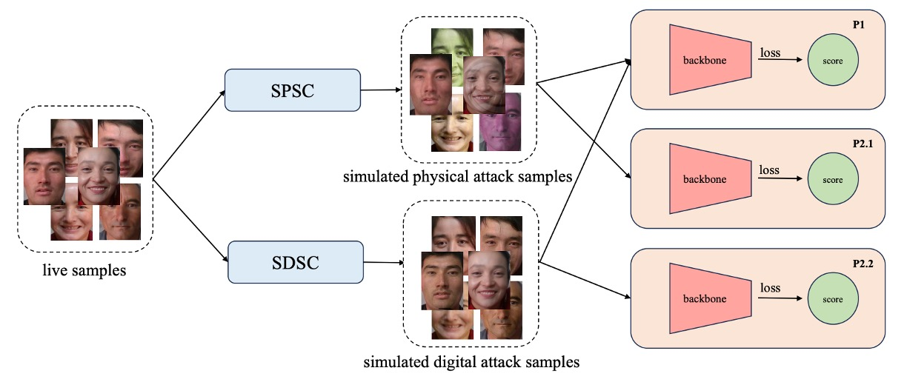
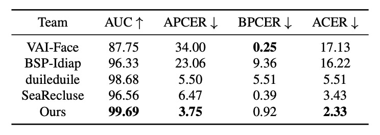
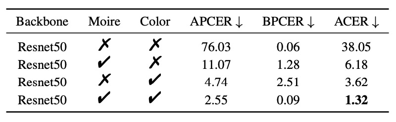
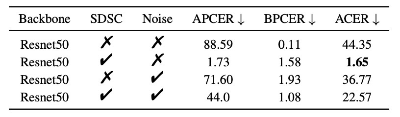

## 幻象的演武場

[**Joint Physical-Digital Facial Attack Detection Via Simulating Spoofing Clues**](https://arxiv.org/abs/2404.08450)

---

這篇論文的作者沒有幫自己的架構取名字，我們截取最精彩的 Physical-Digital 的部分，暫時稱之為 PD-FAS。

如果之後有作者給出名字，我們再更新。

## 定義問題

活體辨識（Face Anti-Spoofing, FAS）防禦的目標，是一場愈來愈深的變形。

我們習慣將對手劃分為兩種：

- **物理攻擊（Physical Attacks）**： 實體存在，表象可觸。照片、螢幕、3D 面具等，這些肉眼可見的偽裝，擁有真實的光影、材質與角度偏差。
- **數位攻擊（Digital Attacks）**： 純粹生成，例如 DeepFake、face swapping、adversarial perturbations，它們可能像極了我們，卻從未真正存在過。

如果你想理解為物理攻擊和魔法攻擊也未嘗不可。

這兩類攻擊，在形式與跡象上都截然不同，甚至可說擁有兩種「世界觀」。前者來自光學不協調、螢幕刷新率、邊緣鋸齒；後者則更像是語意空間的重組，是來自於對抗訓練的幻影。

這導致防禦端的發展也逐漸分裂：物理攻擊專注於低階紋理檢測，數位攻擊則朝向語意與頻域的建模。兩種模型、兩種邏輯、兩套訓練流程。像極了兩位各守一地的守門人，各自解著不同形式的欺騙。

但世界哪有這麼簡單？

如果今天我們把一段數位生成的 DeepFake 影片，輸出到手機螢幕上，再用手機拍攝進行活體辨識，這算是數位攻擊嗎？還是物理攻擊？

又或者，假設我們有一副 3D 列印的面具，內部裝有可變電阻，能模擬人臉的脈搏，這是仿生體嗎？還是演算法的延伸？

模糊開始出現，界線開始崩解。模型的邊界，反而成為漏洞的入口。

這篇論文對這個問題提出了新的思考：

> **「如何讓一個模型，理解並抵抗兩種世界的欺騙？」**

---

## 解決問題

<figure style={{"width": "90%"}}>

</figure>

PD-FAS 並未選擇在架構層面引入全新模組，也沒有企圖以一套大一統的判別機制包辦兩類攻擊。而是採用一種更巧妙的策略：**模擬攻擊的線索（Simulated Spoofing Clues）**。

這是一種資料驅動的介入方式：與其讓模型去適應所有世界的變形，不如**主動製造幻象**。

PD-FAS 提出兩種資料增強策略：

- **SPSC（Simulated Physical Spoofing Clues）**：針對真實影像進行模擬物理攻擊的變形處理，例如反光、高頻紋理、邊緣模糊等。
- **SDSC（Simulated Digital Spoofing Clues）**：則針對真實樣本模擬數位攻擊的干擾，例如視覺語意錯位、風格錯置、頻域異常等。

這些處理，像是給原本的「真實」影像穿上一層「假象」，而非直接用現成的攻擊樣本。目的是在於讓模型學習如何辨認出那些**真實樣本被污染後的扭曲跡象**。

訓練流程上，這些 augmented 樣本會與原始的資料一併輸入主網路中，透過交叉熵損失來強化對 spoof 線索的辨識能力。這種方式有幾個好處：

1. **無需真實攻擊資料**：尤其是某些難以蒐集的數位攻擊類型，可由 SDSC 自行模擬。
2. **不增加推論成本**：在訓練過程中產生幻象，推論階段仍是標準流程。
3. **容易整合至現有架構**：SPSC 與 SDSC 可作為 augmentation module 插入任何現有的 FAS 模型訓練流程中。

實驗設計上，針對不同的協定（protocol）採用對應的模擬策略：

- **Protocol 1**：同時啟用 SPSC 與 SDSC，用於提升模型整體辨識能力；
- **Protocol 2.1**：僅啟用 SPSC，對抗未見過的實體攻擊類型；
- **Protocol 2.2**：僅啟用 SDSC，應對未見過的數位攻擊模態。

### Simulated Physical Spoofing Clues

<figure style={{"width": "90%"}}>

</figure>

先來看 SPSC 的部分。

所謂實體攻擊，多半是將某個臉部影像轉化為有形的載體，例如紙張、螢幕、甚至 3D 面具等，再重新進入攝影機的視野。這種過程會在畫面中留下諸多可觀察的「物理痕跡」，例如色偏、摩爾紋、邊緣模糊與反光失真。

PD-FAS 的第一項資料增強策略，就是從這些實體世界的影像中汲取靈感，試圖在 live 樣本中人造出類似的視覺線索，讓模型在尚未見過真正攻擊樣本前，就能開始習得辨識邏輯。

SPSC 整合了兩項增強方式：

- **ColorJitter 增強**：模擬紙本列印所導致的色彩失真（針對 Print Attack）；
- **摩爾紋生成**：重建螢幕播放與相機擷取產生的干涉紋（針對 Replay Attack）。

首先看一下 ColorJitter 增強。

由於實體列印常會造成影像的顏色不穩、對比過強或飽和度失衡。這些色彩偏差就是判別攻擊樣本的重要依據之一。

PD-FAS 透過設定統一的增強參數，模擬這些異常狀態：

- Brightness = 0.4
- Contrast = 0.4
- Saturation = 0.4
- Hue = 0.4

這些設定並不誇張，但足以讓原本「乾淨」的 live 樣本染上一絲可疑的視覺差異，就像一張不太成功的假證件，乍看無異，細看總有些不對勁。

接著是摩爾紋的生成。

摩爾紋是螢幕播放再透過攝影機拍攝時常見的干涉現象，也是一種常出現在 Replay Attack 裡的偽裝破綻。

為了模擬這樣的效果，PD-FAS 特別設計了一套摩爾紋產生演算法，其步驟如下：

1. **取得影像尺寸與中心點座標**
2. **從區間 $U(0.0005, 0.01)$** 隨機生成干擾強度
3. **建立像素座標網格 (x, y)** 並轉換為 (X, Y) 網格
4. **計算偏移量與極座標角度 $(\theta, \rho)$**
5. **依角度與半徑調整，產生新的座標 $(X_{\text{new}}, Y_{\text{new}})$**
6. **將結果映射回原圖，產生摩爾紋扭曲**

透過這個過程，原本的影像會被扭曲成一種模擬的摩爾紋效果，這樣的處理能讓模型學習到如何辨識出這些物理攻擊的特徵。

:::tip
**這樣的扭曲會不會太人為？**

這不好說，必須要透過實驗來驗證。

我們很常會對影像套用各種增強手法，有時候會發現在驗證集上的表現不如預期，這可能是因為增強的方向和實際的攻擊樣本不符。這種時候可能需要調整增強的參數，或者選擇更符合實際攻擊特徵的模擬方式。
:::

### Simulated Digital Spoofing Clues

<figure style={{"width": "90%"}}>

</figure>

接下來是 SDSC 的部分。

相較於物理攻擊的光影與質感，數位偽造的欺騙手法則潛藏在語意與像素細節中。不論是 DeepFake、face swapping，還是人臉生成，這些攻擊類型多半會在臉部區域留下可感知卻難以量化的「人工痕跡」。可能是邊界錯位、語意漂移或局部扭曲等。

為了讓模型能辨識這些模糊又詭異的特徵，作者參考 Self-Blending 技術，設計出一套三階段的擬造程序，從顏色扭曲、空間錯位與遮罩混合三個層面進行模擬。

- **步驟一：雙影像生成（Color & Spatial 變換）**

  首先，對原始圖片 $I$ 複製出兩份副本：$I_1$ 與 $I_2$，這兩張將分別扮演「偽造來源」與「偽造目標」。

  - $I_1$：經過色彩扭曲（Color Transform），例如 Hue、Brightness 調整與 Downscale，生成版本 $O_1$，模擬生成式人臉常見的色彩異常。
  - $I_2$：則透過 Resize、平移等空間扭曲操作（Spatial Transform），產出版本 $O_2$，引入人臉位置與幾何變形錯誤。

  此時 $O_1$ 與 $O_2$ 看似來自同一張圖，但邊界與語意已經錯位，就像是某種錯誤對齊的人臉交換嘗試。

- **步驟二：臉部遮罩生成與變形**

  接著，我們使用人臉解析模型（Face Parsing）將原始影像 $I$ 的臉部區域擷取出來，產生一張 **臉部遮罩（mask）**。

  但事情還沒完，這張遮罩會經過兩層加工：

  1. **仿射轉換（Affine Transform）**：模擬臉部的空間變形；
  2. **遮罩變形（Mask Deformation）**：加入彈性拉伸（Elastic）、模糊處理（Blur）等噪聲，使邊界更具「合成感」。

  最終我們得到一張錯位、變形、模糊的臉部遮罩。

- **步驟三：混合生成偽造圖像**

  最後，將 $O_1$、$O_2$ 與最終變形遮罩 $\text{mask}$ 進行混合，公式如下：

  $$
  O_{\text{forgery}} = O_1 \odot \text{mask} + O_2 \odot (1 - \text{mask})
  $$

  這段公式的意義是：**一部分由偽造來源構成，另一部分由扭曲目標支撐**。

  兩者交融出一張「自帶破綻」的臉部樣本，也是 SDSC 打算重現的線索。

透過這三步驟，SDSC 為模型訓練提供了一套「數位攻擊前的預演腳本」，讓模型學會從模糊不清的混合臉中，找出那些來自虛構世界的特徵。

### 資料集設定：UniAttackData

為了驗證本論文的方法在「雙模態防偽」這個全新問題中的可行性，作者選擇了目前為止最全面的跨型態攻擊資料集：**UniAttackData**。

這套資料集不僅涵蓋多種攻擊類型，也在協定設計上精準對應我們真正想解的問題：**一個模型，是否能同時辨識物理與數位的假象？**

UniAttackData 是在 CASIA-SURF 基礎上擴充而來，總共包含：

- **1800 名受試者**，橫跨三大族群（非洲裔、東亞裔、中亞裔）
- **兩類物理攻擊**：Print（列印）、Replay（重播）
- **六類數位偽造**：涵蓋多種 DeepFake 風格
- **六類對抗樣本**：模擬極限偽裝

它針對兩種現實問題設計了兩大測試協定：

| 協定         | 測試目的               | 測試資料          |
| ------------ | ---------------------- | ----------------- |
| Protocol 1   | 同時辨識數位與物理攻擊 | 全類別皆包含      |
| Protocol 2.1 | 泛化至**未知物理攻擊** | 未見過的實體假樣  |
| Protocol 2.2 | 泛化至**未知數位攻擊** | 未見過的 DeepFake |

### 評估指標：APCER / BPCER / ACER

模型表現評估採用活體辨識領域的經典三指標：

- **APCER**（Attack Presentation Classification Error Rate）：攻擊被誤判為真臉的比例
- **BPCER**（Bona Fide Presentation Classification Error Rate）：真人被誤判為攻擊的比例
- **ACER**（Average Classification Error Rate）：綜合誤判率

在 CVPR 2024 第五屆 Face Anti-Spoofing Challenge 中，**最終排名以 ACER 為準**，代表它不僅衡量單一攻擊樣態，更關注雙向判斷的總體穩定性。

### 實驗設置與訓練細節

- **影像處理流程**：

  - 若原圖尺寸超過 700px，進行 face detection 並外擴 20px 作為 crop 區域。
  - 無法偵測人臉者，則進行中央裁切為 500×500。
  - SDSC 中使用 face parsing 取得人臉遮罩，用於後續合成。

- **網路架構**：

  - 採用 **ResNet-50** 為 backbone，雖然作者聲稱「本研究方法可搭配任意架構」，但因資料量有限，選擇一個足夠穩定的中階模型作為基礎。

- **訓練策略**：

  - Optimizer：AdamW，學習率 $10^{-3}$，weight decay 設為 $5 \times 10^{-4}$。
  - Learning rate 調整策略：Cosine Annealing
  - 輸入尺寸統一為 $224 \times 224$
  - 常規資料增強：`RandomResizedCrop` 與 `HorizontalFlip`
  - Loss function：Cross Entropy，並對 live / attack 進行加權平衡

- **三種協定對應三組模型**，分別獨立訓練，設定如下：

  - 整體訓練於單張 A100（80G）上完成，**每個模型只需 1 小時即可訓練完畢**。

| 協定         | 訓練資料涵蓋 | 模型訓練時間 | 測試時間  |
| ------------ | ------------ | ------------ | --------- |
| Protocol 1   | 全部樣本     | 200 epochs   | 約 1 分鐘 |
| Protocol 2.1 | 未見物理攻擊 | 200 epochs   | 約 1 分鐘 |
| Protocol 2.2 | 未見數位攻擊 | 200 epochs   | 約 1 分鐘 |

## 討論

PD-FAS 不主張增加模型複雜度，而是從資料層面重構「什麼是攻擊」。

為了驗證這種設計的有效性，作者針對多項指標與設定進行全面實驗，涵蓋與 SOTA 方法的比較、協定下的泛化能力、模組效果拆解、主幹網路的適應性與視覺化分析。

### SoTA 方法比較

<figure style={{"width": "70%"}}>

</figure>

在 UniAttackData 資料集上，PD-FAS 與現有代表性方法（如 VAI-Face 等）進行四項指標的對照比較。其中，VAI-Face 在 BPCER 上表現最佳（0.25%），但 PD-FAS 於其餘三項指標全面領先，達成：

- AUC：**99.69%**
- APCER：**3.75%**
- ACER：**2.33%**

這顯示 PD-FAS 對於實戰中的不確定攻擊型態，具有更穩健的辨識能力。尤其是最低的 APCER 值，意味著其對假樣本的辨識更為敏銳，有效防堵偽造行為滲透。

### 三種協定場景

<figure style={{"width": "70%"}}>

</figure>

為了模擬真實部署中的泛化挑戰，實驗設計分為三種協定：

- **Protocol 1**：標準訓練與測試
- **Protocol 2.1**：未見過的實體攻擊（only SPSC）
- **Protocol 2.2**：未見過的數位攻擊（only SDSC）

結果顯示：

- 在 Protocol 1 中，PD-FAS 稍優於 baseline。
- Protocol 2.1：**ACER 由 38.05% 降至 1.32%**
- Protocol 2.2：**ACER 由 44.35% 降至 1.65%**
- 平均 ACER 減少 **26.48 個百分點**，從 27.54% 大幅下降至 1.06%

這組數據幾乎已能當成結論來看，**在跨域測試條件下，PD-FAS 的模擬式資料增強，遠比靜態的原始訓練集更有效。**

### 模組貢獻拆解

- **SPSC 模組**：

    

    <figure style={{"width": "70%"}}>
    
    </figure>
    

  - ColorJitter：ACER 降至 3.62%
  - Moire pattern：ACER 降至 6.18%
  - 雙重增強（完整 SPSC）：**ACER = 1.32%**

  這證明模擬色偏與螢幕干擾在 Replay 與 Print 攻擊中，具有高度代表性。

- **SDSC 模組**：

    

    <figure style={{"width": "70%"}}>
    
    </figure>
    

  - 單獨使用 SDSC：**ACER = 1.65%**
  - 對照 Gaussian Noise 模擬對抗擾動：僅降至 36.77%
  - SDSC + GaussNoise：ACER 回升至 22.57%（干擾過強反而有害）

結論很清楚：**針對性線索比泛用性噪聲更有效**，模擬的細節比模糊的泛化來得真實。

### 主幹網路測試

<figure style={{"width": "70%"}}>

</figure>

PD-FAS 的一項特性是「架構不可知性」，作者測試了五種主幹網路：

- ResNet18 / ResNet34 / ResNet50
- Swin-Tiny / Swin-Base

雖然 UniAttackData 本身規模不大，導致各模型間有些許波動，但：

- **所有架構皆可整合 PD-FAS，無需修改主體結構**
- **ResNet50 表現最佳，ACER = 1.06%**

這種「可外掛」的特性，顯示出其部署價值。

### 視覺化分析

<figure style={{"width": "70%"}}>

</figure>

使用 Grad-CAM 進行視覺化分析：

- **Protocol 2.1（物理攻擊）**：注意力集中於色彩扭曲與摩爾紋區域。
- **Protocol 2.2（數位攻擊）**：關注邊緣斷裂與臉部形變位置。

## 結論

透過 **SPSC** 與 **SDSC** 這兩種針對性增強手法，作者讓模型在訓練階段就能看到辨識模糊地帶。

透過大量實驗驗證，本方法不僅顯著提升模型對於「未見攻擊類型」的辨識能力，亦展現出優異的架構無關性與擴充性。最終，這套方法不僅在 CVPR 2024 的第五屆 FAS 挑戰中奪得第一名，也展現出以下幾點值得後續關注的方向：

- **資料增強的再定義**：引導模型學會思辨什麼是「假」的邏輯。
- **跨攻擊模態的橋接設計**：從對立的辨識方式中找到共同訓練的空間。
- **訓練資料的可組合性**：不綁定架構、低侵入性，讓這種策略具備實用推廣潛力。

這篇論文也促使我們重新思考那個經典的提問：

**泛化能力，是否真的只能靠更大的資料與更深的模型堆出來？**

或許未必。
