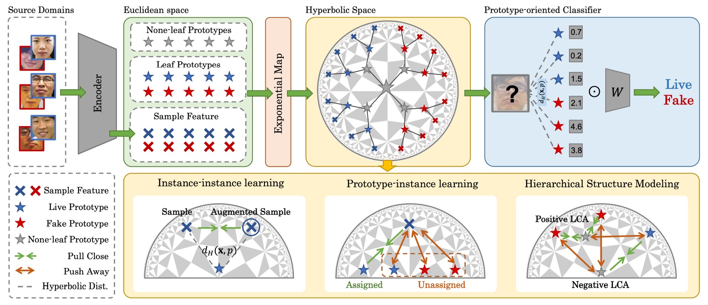

## 雙曲的世界樹

[**Rethinking Generalizable Face Anti-spoofing via Hierarchical Prototype-guided Distribution Refinement in Hyperbolic Space**](https://openaccess.thecvf.com//content/CVPR2024/papers/Hu_Rethinking_Generalizable_Face_Anti-spoofing_via_Hierarchical_Prototype-guided_Distribution_Refinement_in_CVPR_2024_paper.pdf)

---

我們來看一篇 CVPR 的論文。

作者用一個非常新穎的角度，來試著切入 FAS 的問題。

## 定義問題

人臉辨識系統的防護網，建構在 FAS 之上。

隨著深度學習的成熟，研究的進展有目共睹：從早年的手工特徵，到後來的深度二分類架構，再到近年的跨域學習技術，FAS 正一步步學會如何從混亂中認識風險。

但是，一但資料集換了或場景變了，模型的能力就會急劇降低，屢試不爽。

後來研究者試著教模型「學會泛化」，引入對抗、解耦、對比、元學習等各種訓練策略，試圖讓特徵在不同場景中達到一致。

但在這個過程中，有一件事在不知不覺中被犧牲：**語意的結構性**。

所謂結構性，並不是網路結構本身，而是樣本之間的「語意距離」與「階層脈絡」：

- 一張彩色印表機印出的照片，與一段手機錄影重播的影片，或許在像素分布上接近，但它們背後所代表的攻擊類型與行為機制卻天差地遠。
- 一場攻擊的生成條件，包含光線、背景或材質等，本質上是對樣本語意屬性的切分，而不是雜訊。

可是現有方法大多將所有樣本強行嵌入同一個「歐幾里得」特徵空間中，並以最小化 domain gap 為優先目標，導致**過度對齊（over-alignment）**。

我們將本該分離的特徵捏在一起，把模型原本可能理解的結構，壓縮成一塊沒有層次的平面。

這也太奇怪了吧？

因此，這篇論文的作者認為：

> **既然泛化的困難來自語意的失衡，那麼，我們能否換一個空間，讓階層自己說話？**

---

## 解決問題

:::warning
數學警告，這篇論文的方法論略為艱澀，請讀者斟酌服用。
:::

為了修補語意結構被壓縮的斷層，這篇論文提出了一種嶄新的方法論：

- **Hierarchical Prototype-guided Distribution Refinement（HPDR）**。

整體來說，HPDR 建構在三個核心之上：

1. 在**雙曲空間中嵌入特徵**，捕捉其內在的階層結構；
2. 以原型學習（Prototype Learning）作為語意座標系，讓樣本與語意聚點形成關聯；
3. 透過**多層對齊與優化策略**，逐步逼近一個可泛化的語意分布。

首先，我們從這個空間本身開始看起。

---

### 雙曲空間

若語意有樹狀結構，那麼雙曲空間就是幾何上的精準選擇。

我們可以想像一棵語意之樹，從「攻擊」與「真實」分出主幹，再根據材質、呈現方式、來源設備不斷分枝展葉。如果我們硬是將這棵樹壓進一張平坦的歐幾里得地圖上，會發現它的枝節被扭曲、重疊、無法展開；但在雙曲空間裡，它反而能自然延伸，彼此避讓，甚至在邊界上無限繁生。

HPDR 採用的正是這樣一個空間模型：**Poincaré Ball Model**。

Poincaré Ball 是個概念上的空間：

$$
\mathbb{D}^n = \left\{ \mathbf{x} \in \mathbb{R}^n \mid \|\mathbf{x}\| < 1 \right\}
$$

這表示，所有點都被包裹在一個半徑為 1 的開球體中。

乍看之下像是個封閉的結界，但這個球體的邊界其實不是盡頭，而是無窮遠。

**這表示我們可以逼近邊界，卻永遠無法觸及。**

這樣的設計有一個關鍵特性：愈靠近邊界的點，彼此之間的距離會呈**非線性膨脹**，也就是說距離本身就帶有語意層級的張力。

為了讓這個空間具有計算能力，我們不能再使用傳統的歐幾里得度量，而是引入一組由曲率控制的**黎曼度量張量（Riemannian metric）**：

$$
g_{\mathbb{D}} = \lambda_c^2 \cdot g_E, \quad \lambda_c = \frac{2}{1 - c\|\mathbf{x}\|^2}
$$

- $g_E$：這是我們熟悉的平面尺規。
- $\lambda_c$：這是一個隨位置變動的縮放因子（conformal factor）。

當你靠近中心，$\lambda_c$ 接近常數，整體幾何行為近似平面；但當你靠近邊界，$\|\mathbf{x}\| \to 1$，$\lambda_c$ 發散，整個空間突然變得「張力極大」，使得距離稍有偏移就被極度放大。

這正是雙曲空間的本質：**讓層級擴張得以自然展開**。

要在這種幾何裡移動，我們不能再使用線性加法，而必須轉向 **Möbius 加法**：

$$
\mathbf{u} \oplus_c \mathbf{v}
= \frac{(1 + 2c\langle \mathbf{u}, \mathbf{v} \rangle + c\|\mathbf{v}\|^2)\mathbf{u} + (1 - c\|\mathbf{u}\|^2)\mathbf{v}}{1 + 2c\langle \mathbf{u}, \mathbf{v} \rangle + c^2\|\mathbf{u}\|^2\|\mathbf{v}\|^2}
$$

這種加法並不是我們熟悉的向量疊加，而是**沿著彎曲空間的邊界推進**。任何移動，都會根據目前所在位置的曲率，改變意義與方向。

而點與點之間的距離，則由雙曲距離給出：

$$
d_H(\mathbf{u}, \mathbf{v}) = \frac{2}{\sqrt{c}} \cdot \text{arctanh}\left( \sqrt{c} \cdot \| -\mathbf{u} \oplus_c \mathbf{v} \| \right)
$$

這條距離公式，是對「語意分歧」的幾何化詮釋，關心的是向量之間是彎了多少、分了多深，而不是傳統意義上的「距離多遠」。

有了雙曲空間之後，下一個問題就是：

- **我們該如何把神經網路的輸出進行映射？**

由於神經網路輸出的特徵仍然是歐幾里得向量，我們必須找到一個合理的方式，將它們映射進雙曲空間。

這一步由指數映射（Exponential Map）完成：

$$
\exp_0^c(\mathbf{v}) = \tanh\left(\sqrt{c} \frac{\|\mathbf{v}\|}{2}\right) \cdot \frac{\mathbf{v}}{\sqrt{c}\|\mathbf{v}\|}
$$

這個操作有兩個效果：

- 長度短的向量：被壓在球心附近，表示高層次的語意
- 長度長的向量：被推出球邊緣，表示細分的語意葉節點

由於語意本來就不是線性的，因此這個過程可能更適合語意的真實分布樣貌。

### 語意錨點

雙曲空間準備好了，接下來，語意要在哪裡長出來？

在 HPDR 中，作者不是讓模型直接對所有樣本進行「端到端」的特徵分類，而是先給它一個穩定、可控的語意架構，這就是所謂的「原型」（Prototype）設計。

原型不只是點，而是一種**語意聚集的承載單位**。

- 它的座標位置，會決定樣本怎麼被歸類；
- 它之間的距離，會形塑整個語意空間的分布。

首先定義最基本的一組原型，稱作 **葉節點原型**（Leaf Prototypes），它們是直接對應樣本的語意聚點，具有明確的標籤資訊。

在數學上，定義如下：

$$
\mathcal{P}_{\text{leaf}} = \{ p_{ij} \mid i \in \{0,1\}, j \in \{0, \dots, K-1\} \}
$$

- $i$：類別索引，0 表示 fake，1 表示 live；
- $j$：該類別中第 $j$ 個原型，共 $K$ 個；
- 所以總共有 $2K$ 個 leaf prototypes，分別對應兩類樣本的語意子群。

這個設計隱含了對一件事的假設：**同一類別中的樣本，其實可以被劃分為多個語意亞型（sub-type）**，而這些亞型，就是由不同的 leaf prototype 來對應。

理論上，我們希望這些原型初始化在雙曲空間中，但實務上直接在 $\mathbb{D}^n$ 上初始化容易導致梯度爆炸或優化不穩。因此，作者在這裡的實際操作是：

1. 在歐幾里得空間 $\mathbb{R}^n$ 隨機初始化原型向量 $\mathbf{p}_{\text{Euc}}$
2. 再透過前述的指數映射，將其送進雙曲空間：

$$
\mathbf{p} = \exp_0^c(\mathbf{p}_{\text{Euc}}) \quad \text{with} \quad \mathbf{p}_{\text{Euc}} \in \mathbb{R}^n
$$

這個設計可以讓初始化更穩定，訓練初期也能避免過度分散或塌縮的現象。

接下來是整體結構設計中最有意思的部分：**None-leaf Prototypes**。

這些原型並不對應任何單一樣本，而是存在於 leaf prototypes 之間，作為它們的共同祖先與語意連結節點。

定義如下：

$$
\mathcal{P}_{\text{none-leaf}} = \{ p_k \mid k \in \{0, \dots, K'-1\} \}
$$

- 這些原型也嵌入在 $\mathbb{D}^n$ 中，但不帶任何標籤資訊；
- 它們的存在是為了建構**語意之樹**的內部節點，模擬語意層級之間的過渡與收斂。

也就是說：

- **Leaf Prototypes 負責聚合樣本 → 建立語意對應**；
- **None-leaf Prototypes 負責聚合原型 → 建立層級結構**。

這套設計的美感在於：**它將無監督的語意層級建模，嵌入進了分類架構之中。**

我們不用顯式標註哪個子群屬於誰，只需讓模型自己去發現，哪些原型彼此接近、哪些原型有共同祖先，哪些祖先其實應該更靠近邊界、哪些應該停留在中心。

### 語意的三層對齊

有了雙曲空間和原型，接下來就是要建構一個可學習的系統。

這部分的設計稱為 **Hyperbolic Prototype Learning（HPL）**，是一組針對語意三層關係設計的學習架構：

- **Prototype ↔ Instance**：點對點的語意對齊
- **Instance ↔ Instance**：樣本間的內部一致性
- **Prototype ↔ Prototype**：語意結構的層級建構

下面我們逐一來看一下：

1. **Prototype-based Feature Alignment**

   先從最基本的一步開始，**讓樣本找到自己的語意錨點**。

   對於每個樣本的特徵向量 $\mathbf{z}$，我們根據其標籤 $y$，在該類別下的 leaf prototypes 中找出與其距離最近者：

   $$
   p(\mathbf{z}) = \arg\min_{p_{yj} \in \mathcal{P}_{\text{leaf}}} d_H(\mathbf{z}, p_{yj})
   $$

   這樣，就可以為每個樣本建立「正對應的原型」。

   接下來，我們希望模型學到的特徵能夠自動靠近這些原型，同時遠離非對應原型，這就是對比式學習在雙曲空間中的運用：

   $$
   \mathcal{L}_{PI} = -\sum_{n=1}^N \log \frac{e^{-d_H(\mathbf{z}_n, p_{c_k})}}{\sum_{i,j} e^{-d_H(\mathbf{z}_n, p_{ij})}}
   $$

   這個損失讓模型在語意空間裡自行判斷哪些樣本應該靠近，哪些樣本應該遠離。

   此外，為避免所有樣本都指派給同一個原型而產生 collapse，訓練中會控制每個 mini-batch，讓每個原型都要被平均指派樣本，讓空間保持多樣性與分佈張力。

---

2. **Instance-based Consistency**

   由於現實中的樣本並非靜態存在，它們會因光線、角度、遮蔽等外部條件而出現不同的擾動。我們希望模型能學到這些樣本中與語意真正有關的訊號。為此，HPL 引入了樣本一致性學習：

   給定一對樣本 $(x, x_{\text{aug}})$，我們分別取其特徵為 $\mathbf{z}, \mathbf{z}_{\text{aug}}$，要求它們在語意空間中保持一致，在特徵層級，兩者的距離應盡量縮小：

   $$
   \mathcal{L}_{II\text{-feat}} = d_H(\text{detach}(\mathbf{z}), \mathbf{z}_{\text{aug}})
   $$

   其中 $\text{detach}(\cdot)$ 表示阻斷梯度，確保只調整 $\mathbf{z}_{\text{aug}}$，穩定 anchor 特徵。

   在語意分布層級，它們對所有原型的距離分布應盡可能一致：

   $$
   \mathcal{L}_{II\text{-dist}} = \left\| d_H(\text{detach}(\mathbf{z}), \mathcal{P}_{\text{leaf}}) - d_H(\mathbf{z}_{\text{aug}}, \mathcal{P}_{\text{leaf}}) \right\|_2
   $$

   最終總損失為：

   $$
   \mathcal{L}_{II} = \mathcal{L}_{II\text{-feat}} + \mathcal{L}_{II\text{-dist}}
   $$

   即使樣本樣貌改變，這組設計也會使其在語意結構中的定位不會漂移。

---

3. **Hierarchical Structure Modeling**

   原型之間的關係，不能只是「平均分布」，它們應該彼此有遠近、有高下、有祖孫關係。

   這就是 HPDR 中最具象徵性的一步：**語意樹的自我生長**。

   為了學出這種結構，作者借用了來自層級分群中的 **Dasgupta cost** 概念：

   $$
   \mathcal{C} = \sum_{i,j} w_{ij} \cdot |\text{leaves}(p_i \vee p_j)|
   $$

   其中 $p_i \vee p_j$ 表示 $p_i, p_j$ 的最低共同祖先（LCA），而 $|\text{leaves}(\cdot)|$ 表示該子樹的葉節點數。這個 cost 本質上就是在問：**語意相近的原型，能否在更低層級就收斂？**

   但由於 Dasgupta cost 無法直接優化，作者退而採用 triplet-based 優化策略，建構三元組：

   1. 正樣本：$p_i, p_j$ 為互為 KNN；
   2. 負樣本：$p_k$ 為與兩者皆不相近的原型。

   接著，對每組 $(p_i, p_j, p_k)$，尋找使 $\rho_{ij}$ 成為 $p_i, p_j$ 的 LCA 的 none-leaf prototype：

   $$
   \pi_{ij}(\rho) = \exp\left( - \max(d_H(p_i, \rho), d_H(p_j, \rho)) \right)
   $$

   $$
   \rho_{ij} = \arg\max_{\rho} \left( \pi_{ij}(\rho) + g_{ij} \right)
   $$

   其中 $g_{ij}$ 是 Gumbel noise，用於近似 argmax 的可微操作。

   然後，令 $\rho_{ijk}$ 為 $\rho_{ij}$ 與 $p_k$ 的共同祖先，並設計以下 triplet 損失：

   $$
   \begin{aligned}
   \mathcal{L}_{PP\text{-LCA}} = &\left[d_H(p_i, \rho_{ij}) - d_H(p_i, \rho_{ijk}) + \delta\right] \\
   + &\left[d_H(p_j, \rho_{ij}) - d_H(p_j, \rho_{ijk}) + \delta\right] \\
   + &\left[d_H(p_k, \rho_{ijk}) - d_H(p_k, \rho_{ij}) + \delta\right]
   \end{aligned}
   $$

   此外，還需對 leaf prototypes 的分布做兩項結構性約束：

   - **鼓勵所有原型遠離原點**（避免塌縮）：

   $$
   \mathcal{L}_{P\text{-Origin}} = -\log \frac{1}{1 + \sum_{p_i \in \mathcal{P}_{\text{leaf}}} \exp(-d_H(p_i, \mathbf{O}))}
   $$

   - **鼓勵不同原型彼此分散**：

   $$
   \mathcal{L}_{PP\text{-leaf}} = -\log \frac{1}{1 + \sum_{p_i, p_j \in \mathcal{P}_{\text{leaf}}} \exp(-d_H(p_i, p_j))}
   $$

   最終，語意結構建模的總損失為：

   $$
   \mathcal{L}_{PP} = \mathcal{L}_{PP\text{-LCA}} + \mathcal{L}_{P\text{-Origin}} + \mathcal{L}_{PP\text{-leaf}}
   $$

   ***

語意的對齊，真正困難的地方在於讓點之間的關係也跟著長出樹來。

HPDR 的 Hyperbolic Prototype Learning，在一個非線性的空間中，讓分類變得像是語法解析，而非單純給予標籤。

### 訓練流程

訓練流程分為三個步驟：

- **Step 1：Prototype Initialization**

  首先在雙曲空間中隨機初始化：

  - 所有 **Leaf Prototypes**（用於對齊樣本）
  - 所有 **None-leaf Prototypes**（用於建構階層）

  原型在空間中彼此分散，尚未帶有結構性，也未與樣本建立明確的對應關係。它們在這個階段中只是靜靜地存在，等待被樣本認領，等待從距離中長出語意。

---

- **Step 2：Prototype Assignment**

  樣本在這個階段被送進雙曲空間，開始尋找自己的語意錨點。

  作者會根據樣本的標籤 $y$，將其特徵 $\mathbf{z}$ 指派給同一類別下、與之最接近的 Leaf Prototype。

---

- **Step 3：Prototype Optimization**

  一旦樣本與原型之間的關係確立，接下來便是整個系統的協同調整與語意對齊。

  最終透過以下總損失進行優化：

  $$
  \mathcal{L}_{\text{all}} = \mathcal{L}_{\text{pred}} + \mathcal{L}_{PI} + \mathcal{L}_{II} + \mathcal{L}_{PP}
  $$

  這四項損失分別對應：

  - **語意決策的穩定性**（$\mathcal{L}_{\text{pred}}$）
  - **樣本與原型的對齊程度**（$\mathcal{L}_{PI}$）
  - **樣本自身在增強下的一致性**（$\mathcal{L}_{II}$）
  - **原型之間的層級與結構關係**（$\mathcal{L}_{PP}$）

  這一輪優化完成後，空間中的樣本與原型都發生了變化，原型位置微調，樣本嵌入收束，語意張力重新分配。

  然後整個流程回到 Step 2，**再次進行 Assignment，進入下一輪收斂循環**。

### 實驗設計

為了驗證 HPDR 的泛化能力，作者使用常見的 OCIM 驗證基準。

為了讓整體架構具備可學性與可重現性，以下是模型實作的重要設定：

- **影像輸入尺寸**：256×256（彩色人臉區域裁切）
- **leaf 原型數量 $K = 20$**：每類別各 20 個語意錨點
- **none-leaf 原型 $K' = 256$**：建構語意層級的骨幹節點
- **特徵維度**：256 維雙曲特徵空間
- **曲率參數 $c = 0.01$**：對應雙曲幾何的空間彎曲程度
- **樣本配置**：每個 domain 取 5 筆 / 類別，總 batch size 為 30
- **三元組中的正對應原型對**：KNN 選擇前三名為正樣本
- **損失函數中的結構邊界 $\delta = 0.1$**

訓練使用 Pytorch 框架與 DepthNet 作為 backbone，並在 NVIDIA 4090 上進行，優化器採用 Adam，學習率為 0.001。

## 討論

### OCIM Benchmark

<figure style={{"width": "90%"}}>

</figure>

這幾乎是近年每篇論文的標配，任選三個資料集作為訓練來源，留下一個從未見過的 domain 作為測試集。

實驗目的是為了要模擬實際場景中「新設備、新光線、新環境」的挑戰。

實驗結果如上表：

- 所有 DG 方法表現皆優於傳統方法，說明 DG 策略確實有助於跨場景泛化；
- HPDR 明顯優於其他 DG-based 方法，甚至在未見過的測試集上仍保持低錯誤率；

特別值得注意的是：**即使對手也使用 prototype 或 hyperbolic embedding，HPDR 依然勝出**，因為 HPDR 不只是對齊樣本，而是建立了**一棵有層次的語意之樹**。

這裡的優勢來自於模型所內建的語法結構。
其他方法對齊的是點與點的關係，HPDR 對齊的是語意與語意之間的**位置與層級**。

---

### Limited Source Domain

<figure style={{"width": "60%"}}>

</figure>

在這組測試中，作者限制僅使用兩個資料集（MSU 與 Replay）作為訓練來源，再在 OULU 與 CASIA 上進行測試。這更貼近實務中常見的情境，也就是樣本稀疏、domain 分布受限。

實驗結果如上表：相較於 AEML 等方法，HPDR 在 M\&I→C 的設定中 AUC 提升 **3.42%**、HTER 減少 **2.30%**；同樣地，在 hyperbolic 與 prototype 方法中，HPDR 依然領先。

這證明**即使樣本來自少數 domain，只要語意結構清晰，模型仍可對未知場景做出合理判斷。**

HPDR 在這裡的角色像是一名視野清晰的地圖閱讀者，不依賴眼前的路線，而是靠內建的地形知識理解方向。

---

### Cross-Attack

最後，作者在 HQ-WMCA 資料集進行 cross-attack 測試。

這個任務困難在於：訓練時排除某一攻擊形式，測試時僅用該攻擊類型做驗證，考驗的是**語意轉移的穩健性**。

實驗結果顯示 HPDR 在所有攻擊類型中皆維持較低 ACER，相比於其他方法，HPDR 在「新攻擊」出現時依然表現穩定。其原因在於：**這個方法並非僅學會判斷某一類型的攻擊，而是學會如何在語意空間中辨別「這是不是一個熟悉的分布」。**

換言之，模型不是學會了辨識「這張臉有沒有化妝」，而是學會了判斷「這張臉的整體語意，是否合理地存在於已知的語意結構中」。

### 誰是語意空間的關鍵？

<figure style={{"width": "60%"}}>

</figure>

根據實驗結果，我們可以得到幾個觀察：

- **完全不加損失時**，模型表現最差（HTER 明顯升高）：代表光是進入雙曲空間並不足以提升性能，空間需要**結構性的監督訊號**。
- **單獨加入 $\mathcal{L}_{PI}$**（Prototype-instance 對齊）後，性能大幅提升：顯示樣本與語意原型之間的對應，是形成穩定嵌入空間的第一要素。
- **加入 $\mathcal{L}_{PP}$** 後再次進步：證明 prototype 間的層級建構，讓空間不只穩定、也更有層次性。
- **全損失開啟時效果最佳**：印證了 HPDR 的設計邏輯是協同的，不是線性堆疊，而是語意語法的立體拼圖。

結論是空間本身不能保證結構，結構需要一套多層次的關係來維繫，從對齊、到一致性、到層級邏輯，缺一不可。

### 語意之樹該長出幾根？

<figure style={{"width": "60%"}}>

</figure>

作者測試不同的分支數量，原型數量從 4 增加到 20，性能穩定提升。但超過 20 後反而出現**過擴張效應**：空間過度稀疏，語意分布反而不穩。

同時，原型過多也會造成 mini-batch 資源分配不均，導致 trivial assignment，因此在本實驗設定下，**每類 20 個原型**是「最小冗餘、最大表達力」的最佳配置。

---

### 語意空間該多彎？

<figure style={{"width": "60%"}}>

</figure>

實驗結果如上表，我們可以看到幾個關鍵：

- **歐幾里得空間（$c=0$）效果最差**：語意層級難以展開；
- 曲率 **由小增加至 0.01 時性能提升**：代表語意層級開始清晰；
- 當 $c$ 過大，性能反而下降：因為 exponential map 以 $x=0$ 為 base point，當空間扭曲過劇，近似失真，語意也就失衡。

因此，雙曲空間不是越彎越好，而是要剛剛好，必須讓語意之枝能自由生長、又不至於迷失方向。

### 可視化結果

最後，作者以 **Leave-One-Out** 與 **Cross-Attack** 任務為背景，將 HPDR 所學出的語意空間進行可視化。

上圖中展示了不同測試設定下的特徵分布圖，每張圖中：

- **樣本顏色表示其類別或來源 domain**；
- **位置則對應於雙曲空間下的嵌入結果**；
- **leaf prototypes 與 none-leaf prototypes 則標註為特定點位或階層節點**。

從圖中可以觀察到幾個重點：

1. 語意分布不是雜亂擴散，而是層級式地展開，樣本自動圍繞各自語意原型聚集，並依語意近似程度構成樹狀結構；
2. none-leaf prototypes 的引入，是語意收束的關鍵，它們成為多個語意子群的收斂點，使空間不會因過多原型而碎裂；
3. 跨 domain 或跨 attack 的樣本能自然嵌入原有結構中，說明模型學會的不是某個 domain 的表面分布，而是整體語意的邏輯拓撲。

在上圖 (b) 中，作者將每個 leaf prototype 對應的樣本分別可視化，並用圖像群組呈現，可以發現：

- 不論來源 domain，同一個原型下的樣本極度相似；
- 共享 LCA 越低的原型，其樣本間的語意一致性越高，這說明層級是語意一致性的幾何反映，而非分類結果的附加說明。

這個視覺化結果表明：即便我們從未告訴模型要學結構，它仍自然學會了語意的層級分化。

## 結論

本研究的核心思想不在於記住更多樣本，而在於構築一個能容納語意層級的空間邏輯。

作者透過大量實驗與可視化分析驗證了 HPDR 的有效性。無論是面對未知場景、有限來源、還是新型攻擊，皆展現出優異的泛化能力，並證明結構性建模能顯著提升跨場景辨識的穩定性。

近年流行將自然語言的能力融入 FAS 架構，如果未來我們將將語意樹概念和自然語言相結合，或許能看到另外一種截然不同的語意之樹也說不定。
