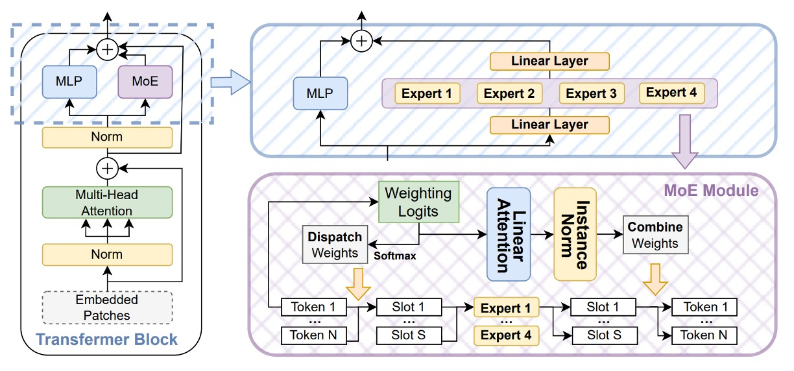
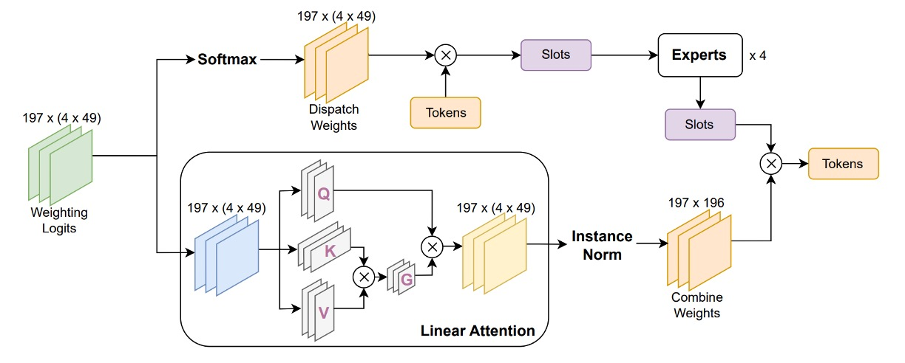
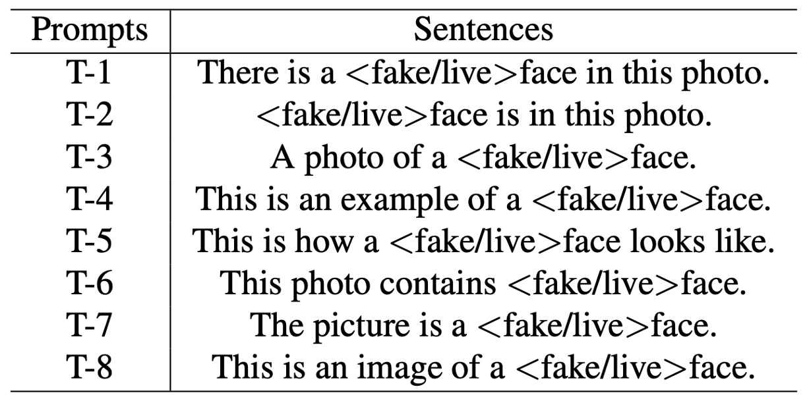
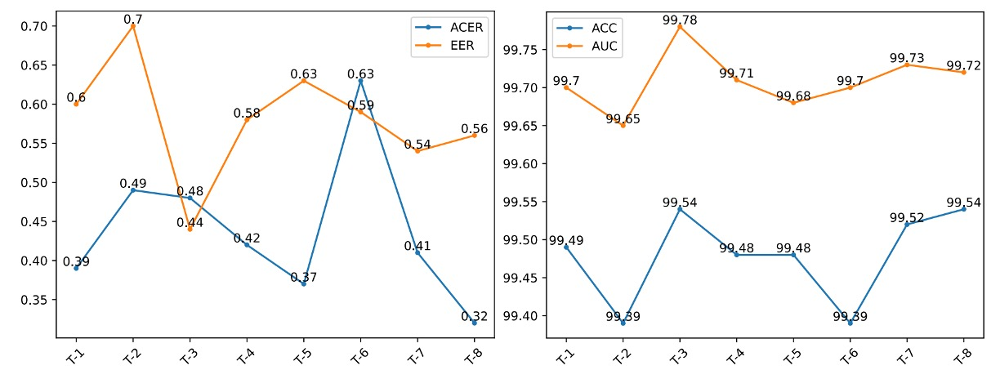

## 稀疏的裂縫

[**La-SoftMoE CLIP for Unified Physical-Digital Face Attack Detection**](https://arxiv.org/abs/2408.12793)

---

實體攻擊從印表機吐出來的彩色照片，到擬真面具下的深邃眼窩。

數位攻擊從演算法生成的幻影，到直接竄改影像本身的紀錄。

臉部辨識系統的邊界，從未如此模糊過。

## 定義問題

在過去的研究中，這兩者被視為不同的任務處理：

- **PAD（Physical Attack Detection）**：

  側重多模態感測與生理特徵擷取，強調實體世界的可測量性；

- **DAD（Digital Attack Detection）**：

  著重在特徵層的細節解析、頻域異常與視覺欺騙模式。

儘管各自取得進展，卻也導致模型部署的重複建置與難以跨任務遷移的困境。

在實務場景中，沒有系統能夠選擇只遭遇一種攻擊類型，也因此，使得 **Unified Attack Detection (UAD)** 成為迫切而自然的研究方向。

但是統一並不等於融合。

從 UniAttackData 所展現的特徵分佈來看，兩類攻擊在嵌入空間中的分佈極不相同，尤其在包含 ID consistency 的設定下，即便來自同一臉孔的攻擊樣本，亦展現出彼此孤立的聚類傾向。

這種「**稀疏又分裂的特徵空間**」，正是現有方法的盲區。

雖然有學者試圖透過多分支設計（如 CA-MoEiT）、多任務學習、或引入生理資訊來對應兩種攻擊型態，但這些方法往往引發新的困境：

- 架構複雜度提高，導致運算資源消耗與部署延遲
- 缺乏 ID-consistency 的資料集，使模型學會的是背景與非語意線索
- 面對大規模通用模型（如 CLIP）時，特徵維度間的稀疏性進一步削弱分類邏輯的穩定性

在這樣的情境下，即便是 CLIP 這類視覺語言模型，也難以於稀疏特徵空間中辨認「假臉」的統一語法。

人們開始意識到：**這可能不是單純的資料不足，而是語意特徵分佈過於分裂**。真正的問題可能不在模型的容量，而在於它該沒有明確的方法來使用自己的能力。

也許，是時候讓模型學會自我調度、自我協作。

這正是 Mixture-of-Experts（MoE）設計邏輯誕生的地方。

:::tip
對 MoE 的概念不熟悉的讀者，可以參考我們之前讀過的另外一篇論文：

- [**[21.01] Switch Transformer: 讓專家說話**](../../transformers/2101-switch-transformer/index.md)
  :::

## 解決問題

針對上述問題，作者提出一套結合 Mixture-of-Experts（MoE）設計理念與線性注意力機制的架構，命名為 **La-SoftMoE CLIP**。

該方法基於原始 CLIP 架構進行改造，並具體強化其在稀疏語義分佈下的分類能力。

### SoftMoE 模組設計

<figure style={{"width": "90%"}}>

</figure>

為強化 CLIP 在稀疏語義空間中的辨識能力，作者導入 **Soft Mixture-of-Experts（SoftMoE）** 模組，並嵌入至每層 ViT 的殘差區塊中，如上圖所示。

SoftMoE 相較於傳統 MoE 架構，具備以下幾項優勢：

- **柔性派遣（Soft Dispatch）**：使用 Softmax 權重將所有輸入 tokens 映射至 slot，避免 top-k hard assignment 所導致的 token-dropping 與負載不均問題。
- **可微分設計**：整體運作流程為完全可微，能穩定與主幹網路聯合訓練。
- **高擴展性**：不需排序與選擇專家，可輕量地擴展至上千個 expert slot。

具體計算流程如下：

1. **Dispatch Weights**

   在 Soft-MoE 中，傳統的 top-$k$ 分派策略被棄用，而是改為：

   - **柔性派遣機制（soft dispatch）**

   此機制的核心在於引入一組中介表示，稱為 **slots**，用以承接輸入 tokens 的語義加權平均。這裡的每個 slot 並不對應單一 token，而是以「token 加權總和」的方式生成，因此 slot 可被視為一種 **語義子空間的聚合向量**。

   每個 expert 將會處理數個 slot，使模型能根據資料特性做出差異化專家運算。

   派遣過程如下：令輸入 token 矩陣為 $X$ ，我們使用一組可學參數 $\Phi$ 將 $X$ 投影成派遣 logits，並對每個 slot（共 $m = e \cdot s$ 個）執行 column-wise softmax：

   $$
   D_{ij}= \frac{\exp\bigl[(X\Phi)_{ij}\bigr]}
           {\sum_{i'=1}^{n}\exp\bigl[(X\Phi)_{i'j}\bigr]}
   ,\qquad
   \tilde X = D^{\!\top}X
   $$

   - $D \in \mathbb{R}^{n \times m}$ 為派遣權重矩陣，表示第 $i$ 個 token 對第 $j$ 個 slot 的貢獻程度。
   - $\tilde X$ 是所有 slot 的輸入表徵矩陣，其中第 $j$ 列表示第 $j$ 個 slot 所接收到的加權語義向量。

   透過這樣的設計，每個 slot 都整合來自所有 tokens 的資訊，但以不同的注意力強度加權。此外，模型得以從 token-level 的離散特徵，轉換為更高階、可共享的 slot-level 表徵。

   另外也避免了傳統 MoE 中的 token-dropping、expert 不均衡等問題，為後續 expert 處理與組合權重（combine weights）鋪墊一致且可微分的特徵基底。

---

2. **Expert 處理與 Combine Weights**

   將 $\tilde X$ 按 slot 分組送入 $e$ 個 Experts（每個 expert 處理 $s$ 個 slots） 得 **slot 輸出** $\tilde Y$。

   接著計算 **Combine Weights** $\mathbf C$，這一次對 **每一個 token** 做 row-wise softmax，決定「如何從各 slot 回收資訊」：

   $$
   C_{ij}= \frac{\exp\bigl[(X\Phi)_{ij}\bigr]}
               {\displaystyle \sum_{j'=1}^{e, s}\exp\bigl[(X\Phi)_{ij'}\bigr]}
   ,\qquad
   Y = C\,\tilde Y\;
   $$

   - $Y$ 即 Soft-MoE 的輸出 token 列表，可與 ViT 之後的 MLP、Attention 並聯或串聯。

### La-SoftMoE

雖然 Soft-MoE 具備可微分的派遣與重組機制，但其組合階段仍存在一項潛在限制：

原始設計中，每個輸出 token 對所有 slot 的加權，是透過 row-wise softmax 實作，表示模型對所有 slot 採取了相同的權重選擇機制。這種處理方式在應對「特徵分佈高度異質」的情境時，可能導致資訊整合過於平均化，難以針對來自不同類型攻擊（如 3D 面具 vs. 深偽影像）的 slot 給予差異化權重。

為了解決這個問題，作者提出改良版本：**La-SoftMoE**，具體進行兩項關鍵修正：

<figure style={{"width": "90%"}}>

</figure>

1. **將 row-wise softmax 替換為 Linear Attention 機制**

   原本的 softmax 對所有 slot 加權方式相同，無法針對特定 slot 特徵強度進行調整。Linear Attention 則能透過可學的特徵映射函數 $\phi(\cdot)$ 對 slot 權重進行動態計算，不僅提供更彈性的語義選擇機制，同時具有線性計算成本，適合大規模模型部署。

2. **在權重計算中加入 Instance Normalization**

   為進一步穩定注意力權重的分佈，防止特徵量級擴張或梯度不穩，La-SoftMoE 在計算 Combine Weights 前於 logits 上施加 Instance Normalization。這樣可以確保所有 slot 的加權值保持在可控範圍內，提升訓練穩定性與泛化效果。

### 實作細節

- **嵌入位置**：La-SoftMoE 模組嵌入於 ViT 的 12 個 residual blocks 中，與原本的 Feed-Forward MLP 子模組採並聯架構（parallel composition）。
- **專家配置**：每層配置 $e = 4$ 個 experts，每個 expert 對應 $s = 49$ 個 slots，總共 $m = 196$ 個 slot；此設定可根據 GPU 記憶體進行線性擴展，具良好彈性。
- **開銷評估**：相較於原始 ViT 架構，引入 La-SoftMoE 僅使推論延遲增加不到 6%，但在 UniAttackData 上，UAD 任務的 F1-score 提升達 5 至 8 個百分點，顯示優異的效能。
- **實作要點**：所有矩陣操作可使用 `einsum` 或 `torch.einsum` 表示，利於 GPU 高效批次計算；Instance Normalization 採 slot-wise 1D 設計，確保參數極少且數值穩定。

---

透過上述架構調整與模組整合，La-SoftMoE CLIP 在幾乎不增加模型參數與計算成本的前提下，實現了針對 PAs 與 DAs 的分工式特徵建模與層級子空間對齊。

該方法有效彌補了原始 CLIP 架構於稀疏攻擊特徵空間中的表現劣勢，並為後續跨域泛化任務提供可擴展的實作基礎。

## 討論

實驗主要基於 **UniAttackData**，該資料集為首個具有 ID consistency 的 Unified Attack Detection 基準，包含：

- 1800 位受試者，涵蓋 2 種實體攻擊（PAs）與 12 種數位攻擊（DAs）
- 第一套評估協定使用完整 live/fake 對應樣本進行訓練與測試

補充實驗使用 **JFSFDB**，整合 9 個 FAS 資料子集，包含傳統 PAD 與深偽 DAD 範例。

主要使用 Joint Training 協定以檢視跨資料泛化能力。

模型 backbone 為 ViT-B/16，嵌入 La-SoftMoE（每層 4 個 expert，49 個 slots），訓練以 Adam 優化器與 $10^{-6}$ 學習率在 A100 GPU 上進行。

### 實驗結果分析（UniAttackData）

<figure style={{"width": "70%"}}>

</figure>

上表顯示 La-SoftMoE CLIP 與現有方法的比較結果，模型於主評估指標中皆取得 SOTA 表現：

- **ACER：0.32%**（前一最佳為 0.52%）
- **ACC：99.54%**（前一最佳為 99.45%）
- AUC 與 EER 略遜於最佳模型，但仍保持高水準（99.72% / 0.56%）

這代表 La-SoftMoE 能有效分離真實與偽造人臉樣本，並在特徵空間內建立更緊湊的分類邏輯。

### 跨資料集泛化測試（JFSFDB）

<figure style={{"width": "70%"}}>

</figure>

為驗證模型在複雜場景下的穩定性，作者亦於 JFSFDB 資料集進行測試，並比較不同子集的泛化能力。雖整體指標略低於 UniAttackData，但 La-SoftMoE CLIP 仍達成：

- **ACER：4.21%**
- **ACC：95.85%**
- **AUC：99.11%**
- **EER：4.19%**

作者亦使用 t-SNE 對兩資料集進行分佈可視化如下圖：

<figure style={{"width": "90%"}}>

</figure>

顯示 UniAttackData 在特徵空間上有更明顯的聚類與連結性，而 JFSFDB 分佈較為分散、不具 ID consistency，這可能為跨資料性能差異的主因。

### Prompt Robustness 測試

由於 CLIP 類模型對語言提示具有敏感性，作者設計 8 組語意等價但結構不同的提示句（T-1 ~ T-8，見下表），評估 La-SoftMoE CLIP 的穩定性與語義適應能力。

<figure style={{"width": "70%"}}>

</figure>

結果顯示：

- **T-8（This is an image of a \<fake/live> face）** 在 ACER 與 ACC 指標上表現最佳
- **T-3（A photo of a \<fake/live> face）** 在 AUC 與 EER 上最優

下圖作者比較了不同 prompt 的性能差異：

<figure style={{"width": "90%"}}>

</figure>

可見各提示皆具穩定表現，證明 La-SoftMoE 對語義變異具高度穩健性。

### 消融實驗

<figure style={{"width": "90%"}}>

</figure>

在表六中，作者依序比較：

- **Vanilla CLIP**
- **CLIP + SoftMoE**
- **CLIP + La-SoftMoE**

結果可見 SoftMoE 大幅改善 CLIP 在稀疏分佈下的分類能力，而 La-SoftMoE 進一步透過線性注意力設計，提升權重選擇機制，使模型泛化與準確性同步提升。

最後，作者展示了四種模型的特徵分佈：

<figure style={{"width": "90%"}}>

</figure>

- ResNet-50（左上）
- CLIP（右上）
- CLIP + SoftMoE（左下）
- CLIP + La-SoftMoE（右下）

從中我們可以看出來，CLIP 雖可分離真假樣本，但邊界模糊；加入 SoftMoE 後邊界清晰但不規則；La-SoftMoE 在分佈形狀與決策邊界方面最為穩定且集中。

這些實驗結果與視覺化分析共同驗證了 La-SoftMoE 在統一攻擊辨識任務中的多層效益：**特徵層次更有結構、語義擴散更受控、泛化能力更強，且成本可控。**

## 結論

在這篇論文中，作者將 Soft Mixture-of-Experts（SoftMoE）引入 CLIP 的影像編碼器中，並進一步改良其權重計算策略，透過線性注意力與正規化機制，使模型能在不增加大量計算成本的情況下，靈活對應實體與數位攻擊的異質特徵。

這項研究給我們的啟發在於：**當語義分佈本質上具有斷裂性時，與其強行統一，不如讓模型學會如何調配專家、共享責任，從結構層次上重新組織特徵空間。**

未來可進一步探索語義驅動的 routing 機制、prompt 條件生成、以及具跨模態泛化能力的 token-slot alignment 方法，持續拓展這類結構化設計於多模態辨識任務中的應用潛力。
