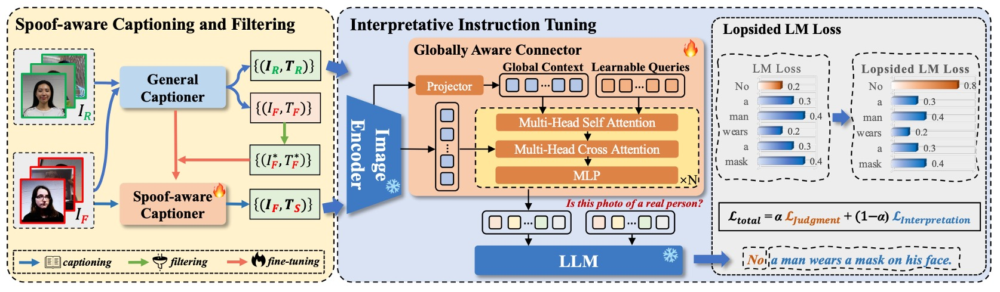
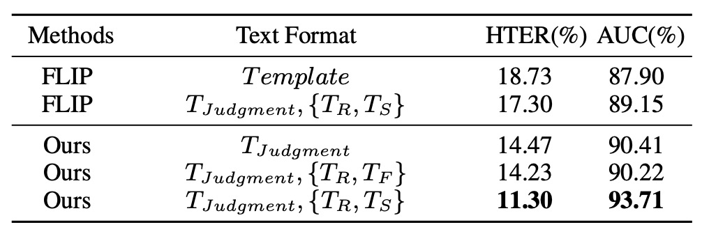
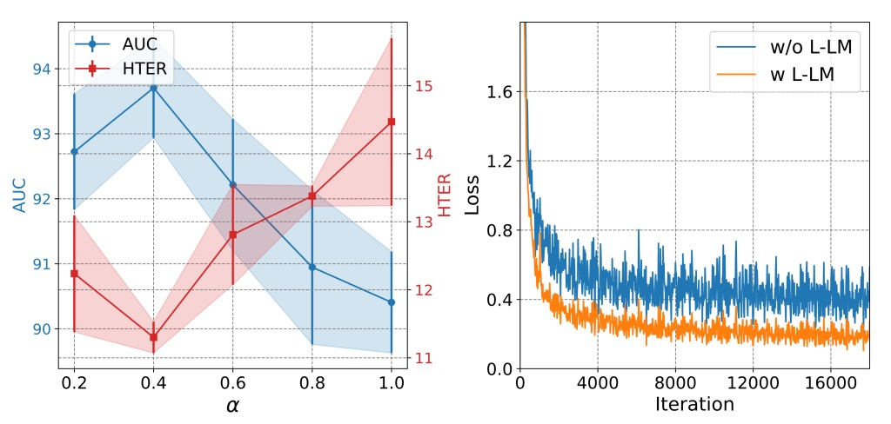
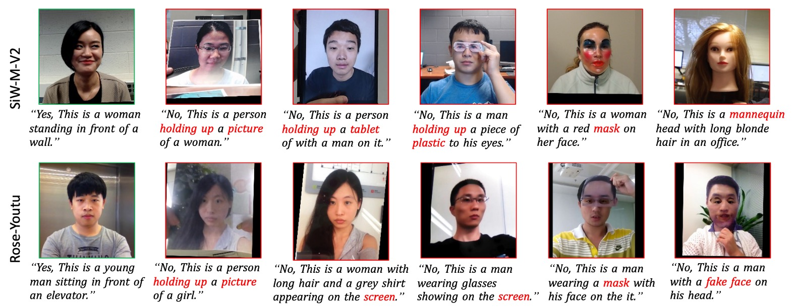

## 分類的終章

[**Interpretable Face Anti-Spoofing: Enhancing Generalization with Multimodal Large Language Models**](https://arxiv.org/abs/2501.01720)

---

活體辨識的常態是一個二分類任務：Real 或 Spoof。

但如果我們問一句「為什麼？」，大多數模型是無法回答的。

甚至，它們連「為什麼」都不允許你問。

## 定義問題

現有的臉部防偽模型，大多訓練於單一目標，也就是將輸入影像分為真實與偽造。

這套邏輯行之有年，但在以下情境中頻頻失效：

- 測試場景與訓練資料風格落差過大
- 假臉製作手法翻新（如高清重播、3D 面具）
- 使用者群體出現文化、設備、地理分佈的差異

研究者試圖透過各種方法強化泛化能力，例如：

1. **Domain Adaptation（DA）**：讓模型接觸目標域資料、進行特徵對齊
2. **Domain Generalization（DG）**：從多個來源域中學習穩定特徵分佈
3. **Incremental Learning（IL）**：在維持舊知識的同時，引入新資料環境

但無論是哪種方法，本質上仍是從影像中提取「活體特徵」，而這些特徵，大多仍是模型自己解釋不出來的。

這就是問題的核心：

> **我們訓練出一個能判斷，但無法表達的系統。**

它可以告訴你「這是假的」，卻無法說明「哪裡是假的」、「為什麼是假的」。

我們讓模型看到圖像，但卻沒教它如何說出一個合理的故事。

偏偏人類的辨識，恰恰是建立在故事之上。

## 解決問題

「這是真的嗎？」

對於活體辨識模型而言，這個問題不該只有答案，還應該有解釋。

I-FAS 框架正是基於這樣的信念，將 FAS 任務轉譯為一場「圖像問答」。

而要讓模型回答得像人一樣，需要從三個層面出發：**語言建構、特徵對齊、訓練策略**。

## Spoof-aware Captioning and Filtering（SCF）

多數通用敘述模型（captioner）只會注意臉部表情、服裝或背景，卻忽略關鍵的假臉線索。

如下圖所示：

<figure style={{"width": "80%"}}>

</figure>

傳統 captioner 產出是 $T_F$，經過作者微調後 的 spoof-aware captioner 是 $T_S$。

如上圖所示，傳統 captioner 產出的描述過於模糊，而微調後的 spoof-aware captioner 則能明確指出攻擊媒介（如 _screen_, _paper_, _mannequin_），並內嵌於句中，形成具說服力的語意依據。

SCF 策略的流程如下：

- 將 12 個公開資料集彙整為 $D$，標註為真假樣本 $(I_i, Y_i)$。
- 建立一組 spoof keyword 字典 $K$，依攻擊型態分類。
- 使用通用 captioner $C_G$ 對所有 fake 圖像生成初始敘述 $T_F$。
- 過濾 caption 中**未包含對應關鍵字**的樣本，留下能夠明確反映攻擊特徵的 subset，記為 $D_S$。
- 使用 $D_S$ 微調 $C_G$ 得到 spoof-aware captioner $C_S$。
- 最後對所有 real 圖像也產生 caption，組成具語意差異的訓練資料。

此策略讓每筆資料除了 label，還**附帶語意說明**，提升模型學習對比性與可解釋性。

## Multimodal Instruction Tuning with GAC

完成訓練資料的製作後，就可以進入模型訓練的章節。

整體模型架構如上圖所示，I-FAS 由以下三個主要組件構成：

- **視覺編碼器 $E_V$**：提取輸入圖像 $I \in \mathbb{R}^{H \times W \times 3}$ 對應的特徵 $X_V \in \mathbb{R}^{N \times D}$。
- **跨模態連結器 $P_{V \to T}$**：將 $X_V$ 映射至語言模型的 token 空間。
- **語言模型 $\Phi_T$**：在視覺特徵與文字提示下，自動回應問題，生成自然語言敘述。

### Globally Aware Connector（GAC）

為使視覺語意更全面細緻，作者提出 GAC 模組，目標是將多層次的 global features 傳遞給語言模型。詳細過程如下：

- 從每層視覺編碼器提取 $g_i$（即 cls token），構成 $G_V = {g_1, ..., g_L}$。
- 將其線性投影為 $Q_V$，與可學習查詢向量 $Q_P$ 組合： $Q = \text{Concat}(Q_P, Q_V)$，其中 $Q_P$ 的設計就是我們常見的 Prefix tuning 的技巧。

- 接著經歷多頭自注意力（MSA）與交叉注意力（MCA）與區域特徵 $X_V$ 結合：

  $$
  \begin{aligned}
  Q' &= Q + \text{MSA}(\text{LN}(Q)) \\
  Q'' &= Q' + \text{MCA}(\text{LN}(Q'), \text{LN}(X_V)) \\
  X_T &= Q'' + \text{MLP}(\text{LN}(Q''))
  \end{aligned}
  $$

  意思就是以 $Q$ 為主體，向影像特徵進行查詢，找出專屬於活體的特徵。

一般來說，淺層特徵有助於捕捉紋理細節（如摩爾紋、模糊），深層特徵則傾向抽象語意；GAC 正是為了將這些視角整合進語言輸出。如此一來，輸入語言模型的不是單一特徵，而是**融合了視覺層次深淺、空間與語義的跨模態表示**。

## Lopsided Language Model Loss（L-LM Loss）

當模型學會說話之後，接下來的問題是：

> **它究竟應該先說出「結果」，還是先說出「理由」？**

作者將 FAS 任務重新表述為單輪問答格式，訓練資料由三部分組成：$(I, T_Q, T_A)$

其中：

- $T_Q$ 為固定指令句：「Is this photo of a real person?」
- $T_A$ 為雙段答案格式：

  $$
  T_A = [T_{\text{Judgment}},\ T_{\text{Interpretation}}]
  $$

其中，$T_{\text{Judgment}}$ 是模型的真偽判斷（“Yes” 或 “No”），$T_{\text{Interpretation}}$ 則是由 captioner（$C_G$ 或 $C_S$）產出的語意敘述，用以說明判斷依據。

若套用傳統 LM Loss，模型會將整個 $T_A$ 當作一段連續文本進行自回歸學習。

這將導致兩個問題：

1. **語意重心不明確**：模型可能過度模仿句尾 caption 的風格，卻忽略關鍵判斷字詞。
2. **雜訊干擾收斂**：解釋敘述常包含細節與雜訊，對 FAS 任務判斷本身幫助有限，反而拖慢模型對主任務的收斂速度。

為了讓模型能先學會「正確判斷」，再進一步學會「合理解釋」，作者採用一種非對稱權重設計的語言模型損失函數，稱為 **Lopsided LM Loss（L-LM Loss）**：

$$
L_{\text{total}} = \alpha L_{\text{Judgment}} + (1 - \alpha)L_{\text{Interpretation}}
$$

其中：

- $L_{\text{Judgment}}$ 是判斷部分（Yes/No）的 token-level loss
- $L_{\text{Interpretation}}$ 是敘述部分的 loss
- $\alpha \in [0, 1]$ 是控制焦點的超參數

藉由提高 $\alpha$，模型訓練初期可專注於主判斷任務，減少 caption 雜訊干擾；而語意敘述仍作為輔助監督訊號，在判斷穩定後逐步學習如何解釋其結果。

這項設計的效果不只體現在準確率上，也反映在模型訓練過程的**收斂速度與穩定性**上。

## 討論

### 跨域能力驗證

<figure style={{"width": "90%"}}>

</figure>

首先是 **Protocol 1**，採用四個經典資料集進行 leave-one-domain-out 測試。

從上表可見，I-FAS 相較於先前 SOTA 方法在每一組別皆達成優勢，平均 HTER 降至 **1.33%**，顯示結合自然語言監督後，模型對於資料分佈變動具備更高的容錯彈性。相較之下，僅使用分類 token 的單模態方法在不同環境下容易失準。

**Protocol 2** 進一步將實驗推向極端：只使用 CelebA-Spoof 作為單一訓練來源，測試資料則涵蓋 11 個未知資料集，攻擊手法與感測裝置皆有差異。

實驗效果如下：

<figure style={{"width": "90%"}}>

</figure>

在此設定下，I-FAS 的平均 AUC 超越 FLIP 和 ViTAF 超過 **7 個百分點**，而且在 **3D 面具（SURF-3DMask）**、**妝容干擾（HKBU-MARs）**、**新材質攻擊（SIW-M-V2）** 等情境下仍保持穩定，證明此架構能處理高度異質的攻擊變異。

### 模組貢獻

<figure style={{"width": "70%"}}>

</figure>

為驗證各模組的實質貢獻，作者對三個核心元件進行依序移除實驗，觀察其對泛化能力的影響，實驗結果如上表：

- **SCF 拿掉後**，模型回到僅輸出 Yes/No 的回應格式，導致 HTER 明顯上升（+3.17%），AUC 下滑（−3.30%）。這顯示 caption 本身並非附加文字，而是有效監督信號。
- **移除 GAC** 則使模型失去來自 encoder 各層的全域語意整合，造成近似程度的性能退化，顯示不同層特徵對於 spoof 線索的感知層次確實存在分工。
- **將 L-LM Loss 改為標準 LM Loss** 雖然退化幅度不大，但收斂速度與穩定性下降，在高 variance 測試集中更容易出現過擬合。

### Caption 類型分析

<figure style={{"width": "70%"}}>

</figure>

文字多樣性，是否就代表了泛化能力？

作者對此提出相關的實驗，上表對比各種文字監督格式，說明 caption 的語義內容才是關鍵：

- 單純使用判斷字詞（Yes/No）或多樣 template 敘述皆無法明顯提升表現。
- 當 caption 明確指出攻擊線索（如 “tablet screen”, “mask texture”）時，AUC 明顯提高至 **93.71%**，優於所有 baseline。
- 將 spoof-aware caption 替換為一般 caption（$T_F$）時，模型性能反而下降，說明資訊的針對性遠比語料的多樣性來得重要。

### L-LM Loss 超參數探討

<figure style={{"width": "70%"}}>

</figure>

從上圖分析可見，L-LM Loss 中控制判斷與解釋權重的超參數 $\alpha$ 需維持在中間值（約 0.7）才能兼顧準確度與學習穩定：

- 若 $\alpha$ 過高，模型幾乎只關注 Yes/No 判斷，導致語意部分失效，間接削弱泛化能力。
- 若 $\alpha$ 過低，caption 噪聲開始主導 loss，反而阻礙收斂。

此 loss 設計讓模型在微調階段能快速對齊關鍵敘述，形成一種具語法結構的分類過程，而非純粹的 token matching。

### 解釋能力可視化

一開始我們已經看了 spoof-aware caption 與通用 caption 的對比，前者能產出如 “wrinkles on paper” 或 “glare from glossy screen” 的線索，提供模型額外感知錨點。這些詞彙不僅有語言作用，也等同於模擬人類目光聚焦的引導。

最後，再來看一張可視化結果，下圖顯示測試樣本在解釋性問答設定下的預測結果。儘管模型只接收單一域訓練，其在多數未知資料集上仍能提供結構合理的回答，包含判斷與敘述兩個部分，展現出強烈的語意歸納能力。

## 結論

當模型只能學會回答「是」或「不是」，我們也就只能期待它輸出一個信心分數，卻無法得知它為什麼這麼判斷、又依據什麼線索做出決策。

這種分類想像雖然有利於系統開發與評估，卻也讓模型長期困於黑盒架構之中，難以面對跨域泛化、攻擊類型更新與場景條件變動等實際部署需求。

本研究試圖重新定義這種任務的輸出型態，透過引入自然語言問答格式與 caption 輔助監督，讓模型在「回答真假」的同時，也能說出「判斷依據」。

這也是近年來在各大電腦視覺領域中，監督語法上的轉向：

> **從單一標籤走向具結構的語意敘述。**

實驗結果顯示，這樣的語意引導確實帶來了實質效益。無論在 Protocol 1 的多源泛化測試，或 Protocol 2 的單源極端設定中，I-FAS 在 OCIM 指標上皆取得目前為止最優異的表現。

這證實語言不僅可以輔助學習，更能穩定地提升模型對異常樣本的感知與理解能力。這場來自語言的改寫，不只是模型學會說話的過程，更是我們重新思考 FAS 任務邊界的契機。

當模型開口說話的那一刻，也許不只是 FAS 任務被重新定義 ——

> **所有的分類任務，都終將迎向另一種結局。**
