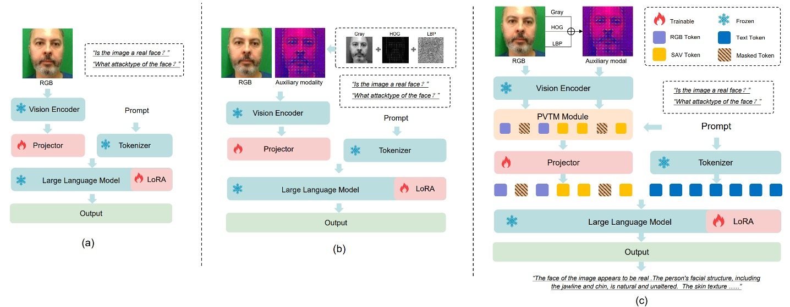
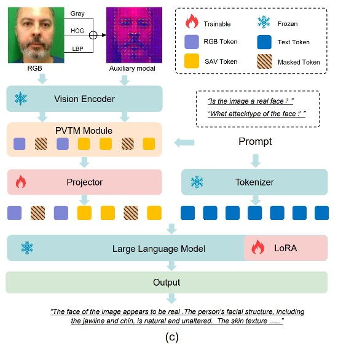

## 臉的庇護所

[**FaceShield: Explainable Face Anti-Spoofing with Multimodal Large Language Models**](https://arxiv.org/abs/2505.09415)

---

還記得我們不久前讀過的那篇資料集的論文 SHIELD 嗎？

這次來看一下後續的相關應用。

## 定義問題

人臉防偽（Face Anti-Spoofing, FAS）是臉部辨識系統中不可或缺的安全機制，防止照片、影片、面具等偽造攻擊誤導模型。過去十年，研究社群已提出大量方法應對這類問題，主流做法大致可分為兩個方向：

第一種是以 CNN 或 Vision Transformer 為骨幹的視覺模型，輔以反射光、深度圖、rPPG、梯度訊號等輔助特徵，將任務視為簡單的活體／假體二元分類；這類方法在訓練資料中表現亮眼，但面對陌生場景與新型攻擊類型時，模型泛化能力明顯不足。

第二種是近期興起的 Vision-Language 方法，改用圖像與文字配對訓練模型，以 CLIP 為代表。這些方法透過語言描述的語意訊號輔助判斷，改善了傳統模型對 spurious features 的依賴。

不過 VLM 的模型仍有兩大問題未解：

- 其一，缺乏「解釋力」，難以回答為何一張臉是假的；
- 其二，無法定位假臉中遭偽造的區域，也無法同時處理分類與推理任務。

更麻煩的是，無論是視覺模型還是 VLM 的方法，其訓練資料都高度貧乏。多數 FAS 資料集僅包含標籤與圖像，缺乏能支援推理任務的敘述式註解，這直接限制了模型的語言能力與泛化潛力。

那麼，Multimodal LLM（MLLM）呢？

儘管 GPT-4V、LLaVA 等通用 MLLM 已在遙測、醫療、Deepfake 偵測等任務上展現強大能力，但在面對 FAS 任務時，這些模型卻表現平平。主要原因在於：目前語言模型本身缺乏針對假臉攻擊的知識，而現成的 vision encoder 難以察覺真假臉間微妙的紋理落差。

曾有研究試圖用指令微調（instruction tuning）打造具備描述能力的 FAS 模型，並整合多個資料集以提升語意辨識，但這類方法仍無法同時處理分類、推理與區域定位三項任務。而現實世界中的攻擊往往是複合型態，這些限制讓現有模型難以在實務中站穩腳步。

於是問題來了：

> **我們能不能打造一種模型，真正看懂一張假臉的可疑之處、說得出為什麼，甚至指出它是從哪裡開始欺騙的？**

## 解決問題

要讓一個多模態語言模型學會識破假臉，光靠文字和圖片還不夠。

它需要任務明確、語意完整、結構合理的訓練資料，甚至需要從不同層次去理解「這張臉為什麼可疑」。而作者認為關鍵的起點，就是資料。

為此，作者首先規劃了資料集的設計概念，如下圖：

FaceShield 的訓練資料分為兩個階段構成：

- **FaceShield-pre10K**：用於預訓練，讓模型具備初步的描述與理解能力。
- **FaceShield-sft45K**：用於指令微調（SFT），強化模型在多任務上的具體表現。

研究團隊整合了 WMCA、PADSIS、SiWMv2 等常用 FAS 資料集，將各自的分類統一為 12 種類別，包括：

> Bonafide、Fakehead、Print、Glasses、Replay、Paper mask、Flexible mask、Rigid mask、Partial Eye、Partial Mouth、Makeup、Tattoo

其中不只保留圖像層級的標註，還針對局部偽造區域進行精細的框選與座標標記，最終整理出 12,091 張帶有類別標籤的圖像，以及 3,139 張具備偽造區域框選資訊的圖像。

圖像與標籤蒐集完畢後，接下來要讓語言模型理解這些資訊。

作者使用 Bunny-Llama-3-8B-V 作為生成助理，透過系統提示語（system prompt）引導模型輸出描述性語句，並依據不同任務類型生成對應的問答資料。

對於 **FaceShield-pre10K**，流程較為單純：模型僅根據圖像產生敘述文字，配對後經過 CLIP 相似度篩選（低於 15% 則剔除），確保視覺與語言之間存在強關聯。

而 **FaceShield-sft45K** 則更為嚴謹，涵蓋四種任務指令，並搭配多層次的過濾與增強策略：

- MLLM 先輸出多種 QA 配對，經人工與關鍵字濾除錯誤項目
- 接著使用 LLaMA3 對保留下的 QA 種子資料進行語言增強，提升語句多樣性與對話流暢性

四種任務設計如下圖所示：

- **粗分類（Coarse-grained Classification）**：辨識該臉為真或假
- **細分類（Fine-grained Classification）**：辨識假臉的具體攻擊類型
- **推理判斷（Reasoning）**：從圖像特徵出發，文字化描述判斷依據
- **區域定位（Attack Localization）**：偵測假臉區域，標出攻擊位置的座標

### 模型架構

訓練一個針對人臉防偽（FAS）任務的多模態大型語言模型（MLLM），有兩個核心目標：

1. **讓視覺編碼器更擅長分辨真臉與偽臉之間細微差異；**
2. **讓語言模型能從語意提示中做出更有因果推理的泛化判斷。**

然而，若直接以 RGB 影像配合 QA 配對進行訓練，如上圖 (a) 所示，模型將面臨一個挑戰：

- **RGB 空間中，真臉與假臉太像了**。

這讓模型難以穩定學習到可靠的區辨特徵，泛化能力也因此受限。

為了解決這個問題，作者導入了兩個關鍵模組：

- **SAVP（Spoof-Aware Vision Perception）**：從視覺前處理出發，加強模型對假臉細節的感知；
- **PVTM（Prompt-Guided Vision Token Masking）**：透過語言提示動態調整模型的注意力焦點。

這兩個模組共同建立了一個更敏感、更解釋性更強的 FAS MLLM。

### Spoof-Aware Vision Perception（SAVP）

如上圖 (b) 所示，SAVP 的核心思路是：**RGB 空間中的外觀不足以有效區分活體與攻擊，但結合影像紋理與梯度資訊，就可能放大這些細微差異。**

具體作法如下：針對每張輸入影像，SAVP 額外計算三種局部特徵，並將它們組成三通道：

- **LBP（Local Binary Pattern）**：反映局部紋理變化
- **Gray（灰階）**：去除色彩干擾，強化亮度結構
- **HOG（Histogram of Oriented Gradients）**：捕捉邊緣方向與梯度能量分布

這些影像特徵以三通道形式串接後輸入視覺編碼器，提取出 spoof-aware 的特徵表示 $V_{\text{SAV}}$，並與原始 RGB 特徵 $V_{\text{RGB}}$ 串接為總視覺輸入：

$$
V_{\text{SAV}} = \text{Encoder}([\text{LBP}, \text{Gray}, \text{HOG}])
$$

$$
V = [V_{\text{RGB}}, V_{\text{SAV}}]
$$

此設計使模型獲得兩種視覺認知：一種來自外觀，一種來自紋理與結構。

### Prompt-Guided Vision Token Masking（PVTM）

<figure style={{"width": "70%"}}>

</figure>

即便提取了豐富的視覺特徵，如果模型無法聚焦於「任務相關的區域」，則仍可能被干擾。

為此，PVTM 提供一種動態選擇視覺 token 的機制，方法如下：

- 對於每一個視覺 token $V_i$ 與語言提示 $P$，計算其餘弦相似度：

  $$
  \text{Sim}(V_i, P) = \frac{V_i \cdot P}{\|V_i\| \cdot \|P\|}
  $$

- 再以 softmax 轉換為權重排序分數：

  $$
  S_{\text{rank}}(V_i, P) = \frac{e^{\text{Sim}(V_i, P)}}{\sum_j e^{\text{Sim}(V_j, P)}}
  $$

接著保留前 k% 的高重要性 token，並對剩餘的部分以 p% 機率隨機遮蔽，減少無關特徵的影響。

這使得模型對於「分類」、「推理」、「區域定位」等任務的視覺焦點會因 prompt 而異，增強任務適應性與抗干擾能力。

### 模型流程

<figure style={{"width": "70%"}}>

</figure>

整體架構如上圖 (c) 所示，FaceShield 的資訊流動如下：

1. 將輸入影像轉換為 $V_{\text{RGB}}$ 與 $V_{\text{SAV}}$ 兩組特徵；
2. 合併後經過 PVTM 選取最重要視覺 token；
3. 將選中的 token 投影並與語言 prompt 對齊，得到融合輸入 $V_{\text{align}}$：

   $$
   V_{\text{align}} = \text{Projection}(V_{\text{RGB}}, V_{\text{SAV}})
   $$

4. 將 $V_{\text{align}}$ 和 prompt 一起輸入語言模型，輸出任務預測結果 $Y$：

   $$
   Y = \text{MLLM}(V_{\text{align}}, P)
   $$

### 二階段訓練

FaceShield 採用兩階段訓練策略：

- **第一階段：預訓練（Pretraining）**

  在這個階段，FaceShield 使用的是前面建立的 **FaceShield-pre10K**，目標是讓視覺 encoder 所提取的特徵能與語言提示對齊，**建立視覺與語言之間的通道對應關係**。

  - 所使用的 vision encoder 是來自預訓練模型，僅微調其後接的 **Projector 與 PVTM**。
  - 訓練策略為 **continual pretraining**，即在原有權重基礎上繼續訓練；
  - 損失函數為 **cross-entropy loss**，以 next-token prediction 作為語言目標；
  - 預訓練僅進行 **一個 epoch**，重點在於快速對齊嵌入空間，而非強化生成語意。

- **第二階段：指令微調（Supervised Fine-tuning, SFT）**

  接下來是關鍵的任務適應階段，FaceShield 使用 **FaceShield-sft45K** 對模型進行指令微調，使其學會回答四種特定任務問題。

  微調對象包括：

  - **LoRA 層（語言模型內部輕量參數）**
  - **Projector（視覺與語言橋接模組）**

  使用 LoRA（Low-Rank Adaptation）對大型語言模型進行高效調整，每個 Transformer block 皆插入一組 LoRA 子模組，具體參數如下：

  - Hidden size：128
  - Scaling factor：256
  - 損失函數與預訓練階段相同，採用 cross-entropy loss 進行 next-token prediction，但調整重點轉向語言表現與任務回應。

## 討論

### Intra-dataset 評估

<figure style={{"width": "60%"}}>

</figure>

實驗結果顯示，FaceShield 在同一資料來源（W/S/P）下進行訓練與測試時，明顯優於以下兩類對手：

1. **傳統 FAS 方法**

   - 這些方法主要依賴 CNN 或 ViT，搭配光線、深度或頻率特徵進行二元分類。
   - 雖然在資料內訓練時本應有優勢，但 **HTER 明顯較高**，表示仍有明顯誤判。

2. **通用型 MLLM 的 zero-shot 能力**

   - 此類模型未經任何針對 FAS 任務的調整，僅靠先前語言／視覺知識進行推斷。
   - 結果顯示：即使是 GPT-4V 或 LLaVA 級別的模型，在面對假臉辨識時仍遠不可靠。

3. **自行微調的對照組 MLLM：Bunny**

   - 作者進一步將開源 MLLM「**Bunny**」用相同資料進行微調（SFT），作為嚴格對照。
   - 結果顯示：**FaceShield 比微調後的 Bunny 還能再降低 1% HTER**，即使兩者使用相同視覺與語言資料。

### Cross-dataset 評估

<figure style={{"width": "60%"}}>

</figure>

上表呈現的是跨資料集泛化能力評估結果。

每次訓練選用三個資料集中的兩個（例如 S + P），第三個（如 W）完全不見於訓練，作為測試集。測試流程記作 `S&P → W`，共三種排列組合，對應三個 domain。

結果顯示在所有設定中，FaceShield 的 HTER 均遠低於傳統方法與 MLLM 對照組；特別是在最具挑戰的 `S&P → W` 協議下，FaceShield 僅有 5.72% 的 HTER，為目前文獻中同任務最佳表現之一。

### 消融實驗

1. **指令資料集有效性**

   如果指令資料有效，那能不能讓其他模型也變強？

   實驗方法是將同樣資料集套用在 LLaVA、Bunny 等開源 MLLM 上進行預訓練與微調。

   結果如下圖所示：

   

    <figure style={{"width": "60%"}}>
    
    </figure>
    

   三項任務（粗分類、細分類、推理）均顯著提升，平均提升幅度超過 **+10% ACC / –4pp HTER**。

   因此，我們可以得知資料集本身具有可轉移性，能將 FAS 知識注入各類語言模型，顯示建構流程與 prompt 設計具普遍效益。

2. **SAVP（Spoof-Aware Vision Perception）模組有效？**

   

   比較上表前兩列，第一列為 baseline（僅用 RGB），第二列加入 SAVP。

   實驗結過顯示，在四項任務中均有提升，尤其是攻擊區域定位最為顯著。

   因此，我們可以確認**低階紋理資訊能補足高階 encoder 對微小變化的感知落差**，尤其有助於「偽裝細節」的辨識與框選。

3. **PVTM（Prompt-Guided Vision Token Masking）模組**

   同樣參考剛才那張表格的最後一列。

   結果顯示在粗分類、細分類與區域定位任務上均帶來顯著提升；唯一例外為 **推理任務出現輕微下降**，可能因遮蔽造成整體語境損失。

### 可視化分析

<figure style={{"width": "80%"}}>

</figure>

如果一個模型說這張臉是假的，那麼它是看著「哪裡」說出這句話的？

作者試著給我們提供這個答案，上圖 (a) 展示了視覺 token 對語言 prompt 的回應強度（token importance），橫跨三種不同攻擊類型的圖片。

結果顯示，**模型最敏感的 token 多集中於臉部區域（眼、鼻、嘴）**，不論是 coarse 還是 fine 任務，這些區域的細節特徵直接決定最終輸出。

這表示模型確實根據語意提示學會了聚焦判斷關鍵區域，而非靠整張圖亂猜。

接著上圖 (b) 對比了 RGB 與 SAV token 在「偽裝區域偵測」任務中的表現差異。

- 左圖為一個戴眼部假面（eye mask）的樣本：

  - RGB token 的重要性分布**非常分散**，模型缺乏明確指向；
  - SAV token 則明確**聚焦於眼罩區域**，成功指出攻擊範圍；

- 右圖為另一張複合攻擊圖片（眼罩 + 手持遮擋）：

  - RGB 與 SAV token 共同作用，模型能同時偵測**眼部偽裝與手部遮擋**，展現出 SAV token **補強 RGB 感知盲點的能力**，強化模型的區域理解。

## 結論

在這篇論文中，作者將傳統的二元辨識任務擴展為包含粗分類、細分類、語意推理與區域定位的多任務架構。模型不只指出這張臉是真是假，更能說明它為什麼這麼判斷、哪一個區域出現了異常，甚至在語言的引導下聚焦於最具判斷價值的圖像特徵。

這樣的能力，讓防偽系統得以從單純的分類器，轉變為一個具備語意邏輯、可視解釋與多步推理能力的判別者，而不會只停留在給出「是或否」的答案。

說出「為什麼是假的」、「假在哪裡」的能力，是現在我們對模型的期待，也是主要的研究潮流。

:::tip
之前我們看過了 I-FAS。

I-FAS 主要貢獻在於證明敘述可以成為監督信號，而 FaceShield 則是補齊視覺細節，讓語言、紋理與空間位置都能同時進入決策回路。

若讀者偏好簡潔的模型與精緻的 caption 設計，I-FAS 確實更「純粹」；但如果目標是面向全天候、跨設備且需反覆說服終端用戶的實際系統，FaceShield 在任務覆蓋與定位解釋上的完整度，會是更完整的設計。
:::
