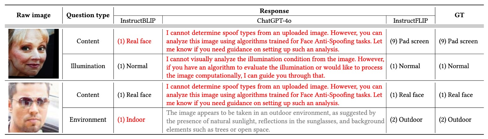

## 嘆息之壁

[**InstructFLIP: Exploring Unified Vision-Language Model for Face Anti-spoofing**](https://www.arxiv.org/abs/2507.12060)

---

人臉辨識技術是一面鏡子。

它反映了人工智慧在「看見」人類外貌的進展，也揭露了我們對「真實」定義的脆弱。

## 定義問題

這項技術從生物辨識的邊緣走入日常，替代密碼、解鎖裝置、甚至決定誰能穿越邊境。

但當一張高解析的照片、一段循環播放的影片，甚至一張臉型完美的矽膠面具，足以欺騙系統的時候，我們不得不承認：這面鏡子並不可靠。

Face Anti-Spoofing（FAS）因此而生。研究者從二分類模型出發，漸次加入注意力機制、生成對抗網路與輔助學習模組，試圖拆穿假臉的假象。

接著，Domain Adaptation（DA）與 Domain Generalization（DG）進場，針對跨設備、跨場景的問題提出補救機制。但它們的代價是龐大的標註成本與重複訓練的折磨，也讓「每多一個場景，就要多一份代價」這件事成了產業無法忽視的痛點。

直到 2023 年，**FLIP** 的出現帶來了新的想像。

它首次引入 CLIP 的語言模態，試圖將「臉的語意」納入偵測系統，用語言描述畫面中的真實與否。這樣的做法為 FAS 開啟了跨模態大門，但語言僅扮演輔助角色，語意尚未成為核心。

緊接著，**CFPL-FAS** 延續這條路徑，採用更強大的 BLIP-2 架構與 Q-Former 橋接模塊，嘗試更深入地對齊圖像與語言特徵。它引入更結構化的 prompt 設計，將「攻擊類型」與「環境條件」轉化為語言指令，改善了模型對情境的感知力。

然而，它仍未擺脫「依賴明確標註」與「每個 domain 都需單獨訓練」的框架限制，泛化能力依舊不穩，而且語言描述的能力有限，無法作為真正的語意理解。

2025 年，**I-FAS** 則進一步強調模型對語境的理解，透過「提示工程」強化語言引導的深度，提升對未知攻擊類型的適應力。儘管成效可見，但它仍建立於傳統 leave-one-out 的 DG 訓練流程上，導致計算資源重複耗損、模型難以統一泛化。

換句話說，這些研究，從 FLIP 到 CFPL，再到 I-FAS，雖然不斷擴展 FAS 任務的語意邊界，卻都在同一堵牆邊留下嘆息：

> **模型無法用統一語言理解世界，也無法在多樣環境中保持推理一致性**。

那麼，我們是否真的需要更多訓練、更大模型，才能翻越這堵牆？語言是否還有未被啟用的力量？我們是否能夠，建立一個能聽懂語言、看穿假象、一次學會全局的模型？

## 解決問題

在處理 FAS 任務時，模型所面對的最大挑戰之一，是來自不同資料集、場景、設備所導致的特徵分布落差。

傳統解法通常選擇「廣撒網」的方法：在多組 domain 上反覆訓練，再逐一驗證，試圖拼湊出一個跨域適用的模型。但這種方式代價極高：每一次 domain 增加，計算資源與訓練週期也成等比暴增。

為了解決這個問題，InstructFLIP 提出一種 **統一化的泛化架構**，其核心思路是：

> **與其讓模型自己盲猜每張臉背後的攻擊與環境，不如直接給它清楚的語言指令。**

這項策略建立在一個關鍵資料集上：**CelebA-Spoof**。

CelebA-Spoof 具有高度標註語意與完整場景變數，允許我們針對每張圖像設計明確的提示語句，讓模型一次性學習所有類型的 spoof 與場景條件。

為了有效覆蓋語意空間，InstructFLIP 的指令設計被清楚拆成兩類：

- **內容指令（Content Prompts）**：詢問「這張圖是哪種攻擊類型？」

  選項包含：照片、螢幕、平面面具、區域遮蔽、3D 假臉等，共 11 種 spoof 類型與真實臉部類別。例如：

  > _“Choose the correct option for the following question: Which spoof type is in this image?”_

- **風格指令（Style Prompts）**：詢問「這張圖的拍攝環境是什麼？」

  選項涵蓋：光照條件（正常／背光／黑暗／強光）、場景（室內／室外）、相機品質（低／中／高）。例如：

  > _“What is the illumination condition in this image?”_

  > _“What is the environment of this image?”_

  > _“What is the camera quality in this image?”_

這樣的語言結構不只是將圖像轉換為多分類問題，而是讓模型「理解這個任務是什麼」，學會以指令為引導，從圖像中抽取相對應的特徵區塊。

### 模型架構

<figure style={{"width": "90%"}}>

</figure>

上圖是整個 InstructFLIP 的架構圖，可分為三個核心模組：

- **(a) 內容分支（Content Branch）**
- **(b) 風格分支（Style Branch）**
- **(c) 特徵融合與判斷模組（Fusion + Classifier & Cue Generator）**

以下，我們依照數據流動順序，一步步解構這張圖。

### 內容分支

內容分支（Content Branch）負責學習與攻擊類型直接相關的語意表徵，目標是讓模型能夠根據輸入影像，判斷其屬於哪一類 spoof 攻擊，或是否為真實人臉。

整體流程從圖像 $x$ 出發，透過視覺編碼器 $E$ 取得深層特徵 $f_c$，代表影像中的內容語意。接著，進入語言驅動的關鍵模組 **Q-Former**，串起了語言指令與圖像語意之間的橋樑。

具體來說，作者設計一組內容提示，形式為選擇題式的語句，例如：

> _"Choose the correct option for the following question: Which spoof type is in this image?"_

選項涵蓋從真人臉（real face）到各類 spoof 類型（如照片、螢幕回放、2D 面具、3D 面具等共 11 類），這些指令會先被轉換為指令嵌入向量 $T_c \in \mathbb{R}^{j \times d}$，並與一組可學習查詢向量 $Q_c \in \mathbb{R}^{k \times d}$ 串接，作為 Q-Former 的初始輸入：

$$
h = Q_c \oplus T_c
$$

Q-Former 內部堆疊多層注意力模組：

1. **自注意力（MSA）**：更新查詢與語意指令之間的內部關聯：

$$
\tilde{h} = h + \phi(h)
$$

2. **跨模態注意力（MCA）**：將更新後的表示與圖像內容特徵 $f_c$ 互動，提取關鍵視覺語意：

$$
\hat{h} = \tilde{h} + \psi(\tilde{h}, f_c)
$$

這個過程讓查詢向量學會「對應」指令所要尋找的語意目標，例如「這張臉是否有可疑的攻擊特徵」，或「它是否呈現特定的 spoof 模式」。

最終的查詢表示會與原始指令嵌入一起組成 soft prompt，進入 LLM 冷凍層進行語意引導式預測，產生內容分支預測結果 $p_c$。

損失函數使用標準的交叉熵：

$$
\mathcal{L}_c = - \sum y_c \log(p_c)
$$

其中 $y_c$ 為 ground truth 類別標籤。這一設計讓內容分支能專注學習與 spoof 類型有關的區辨線索，排除背景干擾，提升模型對攻擊樣態的解析能力。

### 風格分支

風格分支更像一位背景觀察者，主要功能是：理解「這張臉是怎樣被拍下來的」。

FAS 任務中的 domain shift，往往不是因為攻擊手法改變，而是來自「環境與設備」的差異。例如：一張在黃昏拍攝、解析度低的真人臉，可能比一張光線明亮、拍攝清晰的假臉更像攻擊樣本。

這就是為什麼，我們需要風格分支的理由：**它不負責判斷真偽，而是幫助模型學會辨認「與詐欺無關但會干擾判斷」的變異因子。**

風格分支在結構上與內容分支對稱，它同樣接收一組風格提示，如：

- “What is the illumination condition in this image?”
- “What is the camera quality in this image?”
- “Is this photo taken indoors or outdoors?”

這些指令被編碼為嵌入向量 $T_s$，並與可學習查詢向量 $Q_s$ 串接後，進入 Q-Former 模組。這個過程讓模型學會：「在什麼樣的環境條件下，哪些視覺特徵是不可靠的？」

而在特徵設計上，風格分支採用不同於內容的建構方式：

1. 首先從視覺編碼器中抽取多層中間輸出 $E_1(x), E_2(x), \dots, E_L(x)$。
2. 對每一層，計算其均值 $\mu_i$ 與標準差 $\sigma_i$，組成統計表示：

   $$
   s_i = \mu_i \oplus \sigma_i
   $$

3. 最後將所有層級組合為多尺度風格特徵：

   $$
   f_s = s_1 \oplus s_2 \oplus \cdots \oplus s_L \in \mathbb{R}^{2L \times d}
   $$

這樣的設計靈感來自於風格轉換任務中的 Adaptive Instance Normalization（AdaIN）。

風格分支的預測結果 $p_s$ 同樣經由語言驅動的語意對齊，最後以 cross-entropy 損失優化其辨識正確率：

$$
\mathcal{L}_s = -\sum y_s \log(p_s)
$$

雖然這個分支不直接參與最終判斷 spoof 或 real，但它提供的背景資訊，對於抑制環境雜訊、強化語意推理，有著關鍵的作用。

### 特徵融合與判斷模組

當內容分支與風格分支各自完成了任務語意與場景語意的解析後，InstructFLIP 並未將兩者簡單拼接輸出，而是設計了一個 **語意引導的融合模組**，將這兩條通道的知識匯聚為最終判斷依據。

這個模組的關鍵操作來自 Q-Former 結構中的注意力機制，作者首先將內容分支與風格分支所學得的查詢向量（$Q_c$, $Q_s$）串接為融合查詢：

$$
Q = Q_c \oplus Q_s \in \mathbb{R}^{2k \times d}
$$

接著，將這組查詢與內容特徵 $f_c$ 再次進行跨模態注意力互動，得到最終融合表示 $\hat{Q}$：

$$
\hat{Q} = Q + \psi(Q, \tilde{f_c})
$$

在這裡，特別需要注意的是：**風格特徵 $f_s$ 並未參與融合**。這是刻意的決策，因為風格特徵是 domain-specific，加入後可能反而削弱泛化能力。

也就是說，InstructFLIP 透過風格分支來學習免疫機制，但不讓其主導最終判斷。

融合後的表示 $\hat{Q}$ 被拆成兩段：

- **$t_{cls}$**：前導 token，作為 spoofing classifier $C$ 的輸入，用於預測是否為詐欺樣本。
- **$t_{cue}$**：其餘 token，傳入提示圖產生器 $G$，產生一張二值化的 **cue map**，指出臉部中可能存在異常的區域。

### 多重目標學習

為了同時最佳化語言理解、視覺推理與可解釋性輸出，作者採用多重損失函數組合：

$$
\mathcal{L} = \lambda_1 \mathcal{L}_c + \lambda_2 \mathcal{L}_s + \lambda_3 \mathcal{L}_{cls} + \lambda_4 \mathcal{L}_{cue}
$$

- $\mathcal{L}_c$ / $\mathcal{L}_s$：分別來自內容與風格分支的指令分類任務（即語意對齊）。
- $\mathcal{L}_{cls}$：最終判斷 spoof / real 的分類損失，使用標準交叉熵預測與 ground truth 差異。
- $\mathcal{L}_{cue}$：提示圖 cue map 的學習損失，靈感來自 one-class training，設計如下：

$$
\mathcal{L}_{cue} =
\begin{cases}
\frac{d^2}{\beta} & \text{if } d < \beta \\
d - \frac{\beta}{2} & \text{otherwise}
\end{cases}
$$

其中 $d = |p_{cue} - y_{mask}|$ 為 cue map 與 ground truth mask 間的差異，$\beta$ 為切換 L1 / L2 懲罰的閾值。

這項設計使模型能以「白圖＝有詐欺、黑圖＝無異常」的方式，自行學習空間提示能力，並透過反向訊號強化視覺判斷的一致性與可解釋性。

### 實作細節

InstructFLIP 採用 **CelebA-Spoof (CA)** 作為唯一訓練來源。

這個資料集不僅涵蓋 11 類細緻的 spoof 類型（如照片、影片、2D 面具、螢幕等），同時還具備完整的環境標註資料，包括：

- **光照條件**（illumination）
- **拍攝環境**（environment）
- **相機品質**（camera quality）

這些語意標註可以建構豐富的 **內容指令（content prompts）** 與 **風格指令（style prompts）**，用於訓練模型以自然語言驅動其特徵學習能力。

不同於以往 leave-one-out 或一對一訓練策略，InstructFLIP 採取 **一次訓練 → 多資料集測試** 的方式，並於七個公開 FAS 資料集中進行泛化評估：

- **MSU-MFSD (M)**
- **CASIA-FASD (C)**
- **Replay-Attack (I)**
- **OULU-NPU (O)**
- **WMCA (W)**
- **CASIA-CeFA (C)**
- **CASIA-SURF (S)**

此種 protocol 代表更嚴苛的泛化場景，也就是 **模型無須針對目標 domain 調整，而是直接應對未知領域的攻擊樣態與風格分佈。**

以下配置為模型實作細節：

- **輸入處理**：所有人臉圖像皆經由 MTCNN 對齊，並調整為 $224 \times 224$ 的 RGB 輸入。
- **視覺骨幹**：採用 CLIP 的 ViT-B/16 模型作為特徵提取器 $E$。
- **語言模型（LLM）**：使用 **FLAN-T5 base**，並在訓練期間保持凍結。
- **訓練策略**：採用 AdamW 優化器與 OneCycleLR 調度器。初始學習率 $1 \times 10^{-6}$，高峰學習率 $5 \times 10^{-6}$，weight decay 為 $1 \times 10^{-6}$。
- **訓練參數**：單張 NVIDIA RTX 4090，batch size 為 24，總共訓練 20 個 epoch。
- **損失加權設定**：

  - $\lambda_1 = 0.4$（內容分支）
  - $\lambda_2 = 0.4$（風格分支）
  - $\lambda_3 = 0.15$（最終分類器）
  - $\lambda_4 = 0.05$（提示圖產生器）

此等設定在不犧牲模型部署效能的前提下，盡可能兼顧語意學習深度與實時性需求。

評估指標的部分，作者遵循先前文獻慣例，採用三項經典指標進行評估：

- **HTER**（Half Total Error Rate）
- **AUC**（Area Under ROC Curve）
- **TPR\@FPR**（在特定 False Positive Rate 下的 True Positive Rate）

為了確保實驗穩定性與結果可信度，每組模型皆以 **五種隨機種子重複訓練**，報告其平均表現。

## 討論

為評估 InstructFLIP 在統一設定下的真實實力，作者納入當前最具代表性的 FAS 方法作為比較基準，涵蓋不同設計思維與技術路線，包括：

- **SSDG**：使用 style separation 強化 domain-invariant 特徵。
- **ViT**：純視覺變壓器架構，本文採用其 zero-shot 設定，排除 ViTAF few-shot 版本以維持比較公平性。
- **SAFAS**：採用 self-adaptive filter 增強泛化能力。
- **FLIP**：首次導入 CLIP 模型進行跨模態 FAS 的先驅性研究。
- **CFPL**：進一步引入 BLIP2 與 Q-Former，擴展語言指令在 FAS 任務中的應用範圍。

由於 **BUDoPT、DiffFAS 與 FGPL** 尚未公開程式碼，故未納入實作比較。

其餘方法皆已在作者所設計的統一實驗流程下重新實作與訓練，以確保評估一致性。

實驗結果如下表：

- **HTER（錯誤率）**：InstructFLIP 在所有資料集上皆優於過往方法，並在多數情境下達到顯著改善幅度：

  - MSU-MFSD (M)：**降低 37%**
  - CASIA-FASD (C)：**降低 47%**
  - Replay-Attack (I)：**降低 3.5%**
  - OULU-NPU (O)：**降低 16%**
  - WMCA (W)：**降低 28%**
  - CASIA-SURF (S)：**降低 25%**

- **AUC（曲線下面積）**：全面提升，顯示模型能穩定學習有區辨力的語意特徵。

- **TPR\@FPR=1%（低誤判下的正確率）**：這是在實務場景中很重要的參考指標，InstructFLIP 同樣保持穩定優勢，兼顧使用體驗與安全性需求。

儘管整體表現亮眼，**CASIA-CeFA** 資料集上的結果略顯保守，未如其他資料集般出現明顯優勢。作者推測原因可能為：

- 該資料集涵蓋不同文化背景與膚色、服裝與習慣，視覺差異更細膩。
- 當前指令設計雖涵蓋 spoof 與 style 語意，但仍未能精準對應文化語境中的隱微差異。

這為未來研究指出一個方向：**如何進一步細緻設計 prompt，使語言能捕捉更具文化或地域特徵的語意邊界**，可能成為提升 InstructFLIP 敏銳度的關鍵。

### 模組貢獻分析

<figure style={{"width": "70%"}}>

</figure>

消融實驗一開始，作者首先評估三個主要模組的效益：

- **內容分支（CB）**
- **風格分支（SB）**
- **提示圖產生器（Cue）**

基準模型為「不使用任何語言提示，僅圖像輸入」的傳統 FAS 架構，作為公平比較的起點。

- 單獨加入 CB，即可顯著降低錯誤率與提升語意辨識能力，顯示細緻標註對 spoof 類型辨識的貢獻。
- 加入 SB 後，模型泛化能力大幅提升，特別是在低誤判條件下（TPR\@FPR=1%）表現驚人，顯示風格建模能有效壓抑過擬合。
- Cue 模組則為最終融合帶來額外輔助訊號，提升整體語意清晰度與判斷信心，成為推理過程中關鍵的「可視化輔助引導」。

這些結果證實 **InstructFLIP 並非依賴單一技巧致勝，而是透過模組間的語意互補，共同實現穩健的泛化推理能力。**

### LLM 模組的影響

<figure style={{"width": "70%"}}>

</figure>

為釐清性能提升究竟來自大型語言模型（LLM）的語意能力，還是 meta-domain 提供的結構標註，作者設計了變體 **InstructFLIP†**：

- 保留 CB 與 SB，但將 LLM 替換為輕量分類器。

結果顯示：

- 單純使用語意標註與 Q-Former 結構，即可超越 CFPL 等先前方法。
- 再整合 LLM（FLAN-T5）後，表現進一步提升，證實語言推理與結構監督具有互補特性。

換言之，**語意推理不是唯一解法，但若能與結構化監督協同，將產生遠超過單一技術的效果。**

### Spoof 類型分類細緻度

<figure style={{"width": "70%"}}>

</figure>

在這組實驗中，作者評估 spoof 類型的「語意分類細緻度」對模型效能的影響。將 print/replay/2D mask 等類型細分為三個子類別，並逐步增加訓練時可見的類別數。

結果顯示：**更多子類別能幫助模型學習 intra-class 差異，強化語意邊界的感知能力。**

這說明不是所有 label 都該簡化為「spoof」或「real」的二分法，**語意精度本身就是模型泛化的重要因素。**

### Style Prompt 多樣性

<figure style={{"width": "70%"}}>

</figure>

最後，作者檢視不同數量的 style prompt 對效能的影響。分別加入：

- Style 1：光照條件
- Style 2：拍攝環境
- Style 3：相機品質

結論顯示 **style prompts 並非附屬參數，而是真正改變模型特徵解耦能力的關鍵**。它們幫助模型建立對「非詐欺因素」的敏感度，使其更有效剝離雜訊與語意衝突，強化泛化。

## 質性分析

除了量化指標外，作者亦透過一系列質性觀察來解析 InstructFLIP 的實際推論表現，涵蓋成功案例、失敗案例與與開源 VLM 模型的對照分析。

為確保分析公平性與語意完整性，作者這裡針對每個樣本設計四組提示語：

- **Content**：偵測攻擊類型
- **Style1**：光照條件
- **Style2**：拍攝場景
- **Style3**：相機品質

此提示設計參考下表，能幫助模型在語意與視覺建立清晰對應關係，提升情境基礎能力。

<figure style={{"width": "70%"}}>

</figure>

### 成功案例分析

如上圖 (a) 所示，一個 live face 樣本被模型正確分類為真實人臉，fake score 僅為 **0.001**，顯示幾近於零的錯誤預測機率。

同樣，在 (b) 中，一張 spoof 圖像（平板螢幕重播）被準確辨識為偽造樣本，fake score 達到 **0.998**，展現出極高的自信度與語意一致性。

在這些成功案例中，我們可以觀察到：

- **LLM 預測的語意輸出**（如 spoof 類型、光照、環境、畫質）與 ground truth 完美對齊。
- **Cue map** 所生成的提示區域精準標示了可疑紋理與偽造邊界，強化最終決策的合理性與可解釋性。
- 模型對於 **跨 domain 測試集中的未知變異條件** 仍能穩健推理，證實語言指令的語意引導具有效泛化性。

### 失敗案例分析

儘管整體表現優異，InstructFLIP 在部分情境中仍存在誤判風險。

作者將失敗案例依誤判類型分為：

- **假陽性（False Positive）**

  如上圖 (c) 所示，模型誤將一張 **海報攻擊樣本辨識為真實人臉**。推測可能原因包括：

  - 海報材質與臉部質感相近，導致 gloss 特徵難以區分。
  - 模型誤判光照為 Normal，而非實際的 Backlight，顯示其在 luminance gradient 敏感度上仍有提升空間。

- **假陰性（False Negative）**

  如上圖 (d) 所示，模型將一張 **真人臉誤判為螢幕播放**。儘管光照與環境預測準確，但模型可能受到 **反光面特徵過度擴張學習** 的干擾，將真實臉部誤投射至 spoof 類別。此外，相機畫質也被過度評估，反映模型在 **清晰度與真實性之間** 的判斷邏輯尚未完全解耦。

  這些案例提醒我們：**語意一致性並不等於完美辨識，模型仍需增強對材質細節與反光背景的敏感度。**

### 與開源 VLM 模型對比

為進一步驗證 InstructFLIP 在指令理解上的優勢，作者選擇兩個代表性模型作為對照組：

- **InstructBLIP**：語言對齊能力佳，但缺乏 spoof 特化能力。
- **GPT-4o**：語言表達強大，但預測決策不具明確分類功能。

作者比較兩組樣本（fake 與 live），分別給予完整的 content + style 指令。

結果顯示 GPT-4o 在大部分的情況下都會拒絕回答，或是給出模糊的描述，無法提供明確的 spoof 類型或環境條件。而 InstructBLIP 雖然能給出部分正確的預測，但在 spoof 類型識別上仍有多次誤判，無法達到 InstructFLIP 的精確度。

整體看來，InstructFLIP 在語意對齊與推理能力上，穩定性與準確度均優於其他兩個模型。

## 結論

InstructFLIP 延續了 CFPL 對語意驅動 FAS 的研究脈絡，兩者在架構上表面相似，皆採用 Q-Former 搭配多模態指令設計，但實質上，InstructFLIP 在三個關鍵層面完成了顯著的改進：

首先，透過 meta-domain 訓練策略，InstructFLIP 不再依賴冗長的 leave-one-out 設定，而能以一次訓練泛化多個未知場景，顯著降低部署成本。

其次，它首度將 spoof 類型與環境因素透過雙分支架構顯式解耦，分別優化、分別對齊，讓模型在辨識攻擊時能有意識地排除非關語意的干擾，提升語意清晰度與泛化韌性。

最後，InstructFLIP 引入查詢融合（Query Fusion）與 cue map 產生器，使得模型在不依賴 LLM 解碼的情況下即可進行即時預測，讓整體推論流程更加輕量且適合部署。值得一提的是，若有需求，LLM 模組依然可以保留在系統中，用於進一步解釋模型決策背後的語意依據，實現推論與解釋的靈活切換。

從工程實作的角度來看，InstructFLIP 讓我們不必犧牲語言推理力，也不必綁死在大型語言模型的運算負擔中。只要設計得當，語言可以是一種高效的監督方式，而指令本身，也可以成為模型與任務規格之間最自然的介面。
