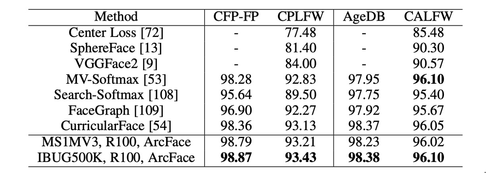
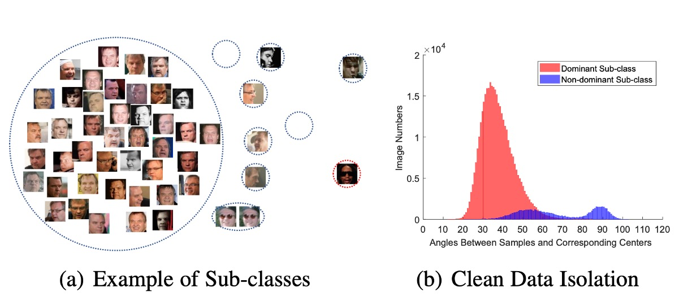

# [18.01] ArcFace

## 反餘弦損失

[**ArcFace: Additive Angular Margin Loss for Deep Face Recognition**](https://arxiv.org/abs/1801.07698)

---

這是個人臉辨識的熱鬧年。

度量學習的概念在這個階段被引入，從 A-Softmax 到 CosFace，再到這篇 ArcFace，這一系列的損失函數都是為了解決人臉辨識中的邊際問題。

## 定義問題

我們不囉唆，直接從 Softmax 開始講起吧。

$$
L_{\text{Softmax}} = \frac{1}{N}\sum_{i=1}^{N}-\log\left(\frac{e^{f_{y_i}}}{\sum_{j=1}^{C}e^{f_j}}\right)
$$

這裡的 $f$ 是特徵向量，$y_i$ 是第 $i$ 張圖片的類別，$C$ 是類別的數量，$N$ 是批次大小。

其中 $f_j$ 通常是一個全連接層的激活函數，可以用 $f_j = W_j^Tx+B_j$ 來表示，這裡 $W_j$ 是全連接層的權重，$B_j$ 是偏差項。

當我們設定 $B_j = 0$，所以 $f_j = W_j^Tx$，然後我們寫成向量內積的形式：

$$
f_j = \|W_j\|\|x\|\cos\theta_j
$$

這裡 $\theta_j$ 是 $W_j$ 和 $x$ 之間的夾角。

到這裡，我們沒有改變任何事情，就是描述一次 Softmax 損失函數的計算過程。

### 回顧 CosFace

- [**[18.01] CosFace: 大餘弦損失**](../1801-cosface/index.md)

接著，我們將 $\|W_j\|$ 和 $\|x\|$ 使用 L2 正規化，固定為 1。這樣一來 $f_j = \cos\theta_j$。

在 CosFace 的論文中，將原本的 $f_j$ 改成 $f_j= \cos\theta_j -m $。

減去一個常數 m 相當於在分類邊界上引入了一個「餘量」，從而要求模型在分類時必須更加自信。這可以有效增加類別間距，並提升模型對不同類別樣本的判別能力。換句話說，模型需要更高的置信度（更大的餘弦相似度）才能正確分類一個樣本，這有助於減少類別間的重疊。

但既然我們的目標是增加類別間的邊際，為什麼要把 $m$ 作用在 $\cos\theta$ 上呢？

### 為什麼不直接作用在 $\theta$ 上呢？

這就是作者在這篇文章中要解決的問題：

**既然我們的目標是增加類別間的邊際，那我們就應該要直接作用在 $\theta$ 上！**

## 解決問題

### 模型架構


上圖是 ArcFace 的模型架構。

但我們猜你不喜歡這張圖，所以我們來看看實作細節:

```python
# Implementation from ArcFace by InsightFace

class ArcFace(torch.nn.Module):

    def __init__(self, s=64.0, margin=0.5):
        super(ArcFace, self).__init__()
        self.s = s
        self.margin = margin
        self.cos_m = math.cos(margin)
        self.sin_m = math.sin(margin)
        self.theta = math.cos(math.pi - margin)
        self.sinmm = math.sin(math.pi - margin) * margin
        self.easy_margin = False


    def forward(self, logits: torch.Tensor, labels: torch.Tensor):
        index = torch.where(labels != -1)[0]
        target_logit = logits[index, labels[index].view(-1)]

        with torch.no_grad():
            target_logit.arccos_()
            logits.arccos_()
            final_target_logit = target_logit + self.margin
            logits[index, labels[index].view(-1)] = final_target_logit
            logits.cos_()
        logits = logits * self.s
        return logits
```

仔細看這一段：

```python
with torch.no_grad():
    target_logit.arccos_()
    logits.arccos_()
    final_target_logit = target_logit + self.margin
    logits[index, labels[index].view(-1)] = final_target_logit
    logits.cos_()
```

這一段的意思是，先把 logit 轉回弧度，然後加上 margin，再轉回 cos 值。預設的 margin 是 0.5 弧度，對應角度大約是 28.6 度。也就是說，假設模型原本預測的角度是 60 度，加上 margin 之後就變成 88.6 度，這跟 CosFace 的概念一樣，增加模型的預測難度，進而提升模型的分類能力。

### 差別在哪？

作者在論文中有比較不同的 margin 對分類的影響：


上圖中橫軸和縱軸是兩個類別對應的 $\theta_1$ 和 $\theta_2$，最左邊是經過 L2 正規化 Softmax 的結果，兩個類別之間有個明確的邊界。假設兩個角度分別是 60 度和 120 度，那麼這兩個類別之間的邊界就是 90 度。不存在重疊的區域，但靠近邊界的地方特徵鑑別度不高。

第二張圖是 SphereFace 的結果，這個是乘法角裕度，也就是 $f_j = \cos(m\theta_j)$，這個方法的基本假設是每個類別位於不同的超球面上，但缺點是對於所有的 $\theta$ 不一致，隨著角度減少，裕度也會減少，當 $\theta$ 接近 0 時，邊界會完全消失。

而 CosFace 的 margin 是作用在餘弦值上，所以投影回角度空間後，分類邊界是曲線，最後是 ArcFace，由於 margin 是直接作用在角度上，所以分類邊界是直線。

### 拓展公式

既然都有了 CosFace 的「加法餘弦裕度（ additive cosine margin）」，有了 ArcFace 的「加法角裕度（additive angular
margin ）」，還有之前論文 SphereFace 提出的「乘法角裕度（multiplicative angular margin）」，那我們可以把這三種裕度統一起來，形成一個更加通用的公式：

$$
f_j =
\begin{cases}
\cos(m_1\theta_{y_i} + m_2) - m_3 & \text{if } j = y_i, \\
\cos\theta_j & \text{if } j \neq y_i.
\end{cases}
$$

於是損失函數可以寫成：

$$
L_{\text{ArcFace}} = -\frac{1}{N}\sum_{i=1}^{N}\log\left(\frac{e^{s(f_{y_i})}}{e^{s(f_{y_i})} + \sum_{j\neq y_i}e^{s(f_j)}}\right)
$$

基於上述公式，我們重新看一次不同的損失函數：

- 在 CosFace 中，$m_1 = 1$，$m_2 = 0$，$m_3 = 0.35$；
- 在 ArcFace 中，$m_1 = 1$，$m_2 = 0.5$，$m_3 = 0$；
- 在 SphereFace 中，$m_1 = 1.35$，$m_2 = 0$，$m_3 = 0$。

:::tip
讀懂這一段之後，你也可以提出自己的損失函數，例如設定 $m_1 = 1.35$，$m_2 = 0.25$，$m_3 = 0.15$，這樣就是一個新的損失函數了。
:::

### 訓練與驗證資料集


1. **訓練數據集**:

   - **CASIA**
   - **VGG2**
   - **MS1MV0**

     - 資料集為寬鬆裁剪版本。
     - 原始數據中的雜訊比例估計約為 47.1% ∼ 54.4%。
     - 以半自動方法清理成為 **MS1MV3**。

   - **Celeb500K**

     - 收集方式與 **MS1MV0** 相同。
     - 使用名人名單從 Google 搜尋身份並下載排名靠前的人臉圖像。
     - 收集了 50 萬個身份的 2500 萬張影像。
     - 使用 RetinaFace 偵測大於 50×50 的人臉。

   - **IBUG-500K 資料集**

     - 通過 ID 字串去除重疊身份（約 50K）後，結合自動清理的 MS1MV0 和 Celeb500K。
     - 最終得到包括 493K 身份的 1196 萬張影像，命名為 **IBUG-500K**。
     - 下圖顯示了該資料集的性別、種族、姿勢、年齡和圖像數量分佈。

       

2. **驗證數據集**:

   - **LFW & CFP-FP & AgeDB**

     - 快速檢查模型的收斂狀態。

   - **CPLFW & CALFW**

     - 具有較大姿勢和年齡變化的最新資料集。

   - **MegaFace & IJB-B & IJB-C**

     - 大規模影像資料集。

   - **LFR2019**
     - 收集了來自各種節目、電影和電視劇的 10,000 個身份，共計 200,000 個影片。每個影片的長度從 1 秒到 30 秒不等。

### 訓練配置

1. **面部標準化裁剪：**

   - 使用 RetinaFace 預測的五個面部點來生成標準化面部裁剪，尺寸為 112×112。

2. **網絡架構：**

   - 使用 ResNet50 和 ResNet100 CNN 架構作為嵌入網絡，這些架構不含瓶頸結構。
   - 在最後一個卷積層後使用 BN-Dropout-FC-BN 結構來獲取最終的 512-D 嵌入特徵。

3. **訓練設定：**

   - 特徵尺度 `s` 設定為 64，ArcFace 的角邊距 `m` 設定為 0.5。
   - 使用 MXNet 實現所有辨識實驗。
   - Batch size 設定為 512，並在 8 個 NVIDIA Tesla P40 (24GB) GPU 上訓練模型。
   - 動量設定為 0.9，權重衰減設定為 5e−4。

## 討論

### 不同 Loss 的比較


1. **角度邊距設定：**

   - 在 CASIA 資料集上使用 ResNet50 觀察到最佳邊距為 0.5。
   - SphereFace 和 CosFace 的最佳邊距分別為 1.35 和 0.35。

2. **模型性能：**

   - 在 SphereFace 和 CosFace 的實現中，這些設定均達到出色性能，並且沒有收斂困難。ArcFace 在所有三個測試集上實現了最高的驗證精度。

3. **組合裕度框架：**

   - 使用組合裕度框架進行實驗，觀察到 CM1 (1, 0.3, 0.2) 和 CM2 (0.9, 0.4, 0.15) 的最佳性能。組合裕度框架比單獨的 SphereFace 和 CosFace 表現更好，但性能上限受 ArcFace 限制。

4. **Norm-Softmax 和三元組損失：**

   - 將 Norm-Softmax 與類內損失結合後，CFP-FP 和 AgeDB 的性能有所提升。
   - 將 Norm-Softmax 與類間損耗結合後，準確性僅略微提高。
   - 在三元組樣本中使用邊距懲罰不如在 ArcFace 中有效，顯示出 Triplet 損失的局部比較不如 ArcFace 的全局比較有效。

將 Intra-loss、Inter-loss 和 Triplet-loss 合併到 ArcFace 中後，未觀察到明顯改進。因此，作者認為 ArcFace 已經有效地加強了類內緊湊性、類間差異和分類邊際。

### 驗證數據集的性能


使用 ResNet100 在 MS1MV3 和 IBUG-500K 上訓練的 ArcFace 模型在 LFW 和 YTF 資料集上超越了基線模型（例如 SphereFace 和 CosFace），表明附加的角度邊距懲罰顯著增強了深度學習特徵的判別力，展示了 ArcFace 的有效性。

基於邊際的 softmax 損失在最近的方法中廣泛使用，導致 LFW 和 YTF 上的性能分別在 99.8% 和 98.0% 左右達到飽和。然而，ArcFace 仍然是最具競爭力的人臉辨識方法之一。

---



除了 LFW 和 YTF 資料集外，ArcFace 也在 CFP-FP、CPLFW、AgeDB 和 CALFW 上報告了效能。這些資料集展示了更大的姿勢和年齡變化，ArcFace 在這些資料集上同樣展現了優異的表現。

---


ArcFace 在 IJB-B 和 IJB-C 資料集上顯著提高了 TPR（@FPR=1e-4），與基於 softmax 的方法相比提升了約 3∼5%。使用 IBUG-500K 資料集和 ResNet100 訓練的 ArcFace 模型，將 IJB-B 和 IJB-C 上的 TPR（@FPR=1e-4）分別提高到 96.02% 和 97.27%。

:::info

- **IJB-B 資料集**

  包含 1,845 名受試者，21.8K 靜態影像和 55K 幀，來自 7,011 個影片。

- **IJB-C 資料集**

  IJB-B 的擴展版，包含 3,531 個主題，31.3K 靜態影像和 117.5K 幀，來自 11,779 個影片。

- IJB-B 和 IJB-C 上有兩種評估協議：1:1 驗證和 1:N 辨識。
  :::

## 結論

ArcFace 的核心思想是透過在特徵空間中引入角度邊緣，來強化類內緊湊性與類間差異，從而在多個人臉辨識基準上顯示出卓越的性能。

:::tip
在實際使用上，由於 ArcFace 假設訓練資料是乾淨的，因此髒亂的資料集會顯著影響模型的性能。但公開資料集哪個不是充滿雜訊呢？

針對這一點作者在論文中有提出了另外一種觀點：**Sub-center ArcFace**，簡單來說就是配給每個類別多個聚類中心，讓雜訊可以被分散到不同的聚類中心：



這是一個對 ArcFace 的改進，可以有效地處理髒亂的資料集。但是這樣會影響演算法聚合特徵的能力，當你在使用時請務必注意這一點。
:::
