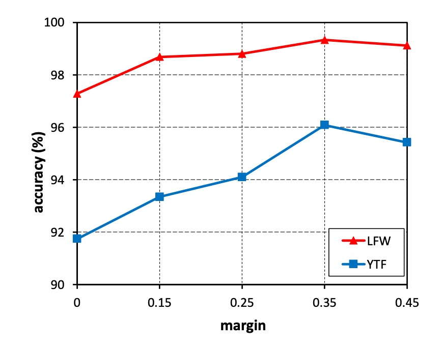
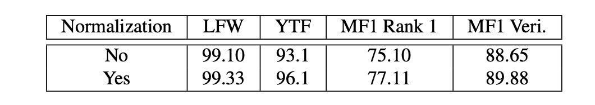

# [18.01] CosFace

## 大餘弦損失

[**CosFace: Large Margin Cosine Loss for Deep Face Recognition**](https://arxiv.org/abs/1801.09414)

---

:::info
以下內容由 ChatGPT-4 彙整，並經過人工校對編輯與補充說明。
:::

---

人臉辨識的任務早在深度學習開始流行之前，就已經引起了研究人員的興趣。因為這是少數可以在生活中找到大量應用的領域之一，所以該領域一直都是近十幾年來的熱門話題。

## 定義問題

人臉辨識的問題跟一般分類的問題有所不同：

- **因為人臉實在太像了！**

有別於過去在 ImageNet 等資料集上的分類問題，人臉辨識的問題在於，即使是同一個人的照片，不同的光線、角度、表情、甚至是攝影機的不同，都會導致照片的差異。

一般來說，我們在這個領域中，會討論人臉的兩個特性：

1. **類內差異大**：同一個人的照片之間的差異通常很大，因為光線、角度、表情、年齡等因素都會影響照片的表現。
2. **類間差異小**：人臉的基本結構是相似的，都是兩眼、一鼻、一口，所以不同人的照片之間的差異通常很小。

:::tip
**可是我覺得人臉差異很大啊？**

- 因為你的大腦已經習慣了區分人臉，所以覺得人臉之間的差異很大。但如果換個種族，例如貓？在只看「臉」的前提下，你能匹配十個以上的「貓臉」嗎？
  :::

### 人臉辨識系統


在一般的人臉辨識系統中，分為幾個部分：

1. **特徵提取器**：通常是一個卷積神經網絡，用來將人臉圖片轉換成一個固定長度的特徵向量。
2. **度量學習器**：用來計算兩個特徵向量之間的距離，在部署階段會捨棄。

---

在「**特徵提取器**」的部分比較不用討論，因為這裡會跟著最新的主幹網絡向前推進。

經過特徵提取器後，我們會得到一個特徵向量 $f$，目前最常見的維度為 512 維，在過去的研究中，512 維的長度理論上足夠表達全世界所有的人臉。

這個向量通常就是在人臉辨識領域中所要討論的「重點」。在過去的研究中，使用 Softmax 損失函數訓練的模型能力有限，對於邊際情況的區分能力不足。

而這正是本論文要解決這個問題。

## 解決問題

### 損失函數

在這裡，我們跟著作者一步一步來看看原始的 Softmax 損失函數是怎麼被改進的。

1.  **Softmax 損失函數**：

    $$
    L_{\text{Softmax}} = \frac{1}{N}\sum_{i=1}^{N}-\log\left(\frac{e^{f_{y_i}}}{\sum_{j=1}^{C}e^{f_j}}\right)
    $$

    這裡的 $f$ 是特徵向量，$y_i$ 是第 $i$ 張圖片的類別，$C$ 是類別的數量，$N$ 是批次大小。

    其中 $f_j$ 通常是一個全連接層的激活函數，可以用 $f_j = W_j^Tx+B_j$ 來表示，這裡 $W_j$ 是全連接層的權重，$B_j$ 是偏差項。

    這裡作者設 $B_j = 0$，所以 $f_j = W_j^Tx$，然後我們寫成向量內積的形式：

    $$
    f_j = \|W_j\|\|x\|\cos\theta_j
    $$

    這裡 $\theta_j$ 是 $W_j$ 和 $x$ 之間的夾角。

    到這裡，我們沒有改變任何事情，就是描述一次 Softmax 損失函數的計算過程。

2.  **Normalized Softmax Loss (NSL)**：

    接著，作者提出了一種稱為 Normalized Softmax Loss (NSL) 的改進方法。

    將 $\|W_j\|$ 使用 L2 正規化，固定為 1；將 $\|x\|$ 固定長度為 $s$，這樣 $f_j = s\cos\theta_j$。

    NSL 透過固定權重向量 $W_j$ 和特徵向量 $x$ 的範數，使得它們在歐幾里得空間的變化被消除，只剩下角度變化。當 $W_j$ 和 $x$ 的範數固定後，損失函數只依賴於角度：

    $$
    L_{\text{NSL}} = \frac{1}{N}\sum_{i}-\log\left(\frac{e^{s \cos(\theta_{y_i})}}{\sum_{j} e^{s \cos(\theta_j)}}\right)
    $$

    這樣做的好處是，特徵學習主要集中在角度空間，提高了特徵的區分性。

3.  **Large Margin Cosine Loss (LMCL)**：

    然而，NSL 的特徵區分性還不夠強。為了進一步提高特徵的辨識度，作者引入了餘弦邊界（cosine margin），並將其自然地融入到 Softmax 的餘弦公式中。

    考慮二分類情境，假設 $\theta_i$ 是學到的特徵向量和類別 $C_i$ 的權重向量之間的夾角。

    NSL 透過強制 $\cos(\theta_1) > \cos(\theta_2)$ 來實現類別 $C_1$ 和 $C_2$ 的區分。

    為了構建大邊界分類器，我們進一步要求：

    - $\cos(\theta_1) - m > \cos(\theta_2)$
    - $\cos(\theta_2) - m > \cos(\theta_1)$

    其中 $m \geq 0$ 是一個固定參數，用來控制餘弦邊界的大小。由於 $\cos(\theta_i) - m$ 比 $\cos(\theta_i)$ 小，這個約束對分類更加嚴格。且從不同類別的角度來看，都必須滿足這個約束。

    最後作者正式定義大邊界餘弦損失（Large Margin Cosine Loss, LMCL）為：

    $$
    L_{\text{LMCL}} = \frac{1}{N}\sum_{i}-\log\left(\frac{e^{s(\cos(\theta_{y_i}) - m)}}{e^{s(\cos(\theta_{y_i}) - m)} + \sum_{j \neq y_i} e^{s \cos(\theta_j)}}\right)
    $$

    在此約束下：

    $$
    W = \frac{W^*}{\|W^*\|}, \quad x = \frac{x^*}{\|x^*\|}, \quad \cos(\theta_j, i) = W_j^T x_i
    $$

    這裡 $N$ 是訓練樣本數量，$x_i$ 是第 $i$ 個特徵向量對應於真實類別 $y_i$，$W_j$ 是第 $j$ 類別的權重向量，$\theta_j$ 是 $W_j$ 和 $x_i$ 之間的夾角。

看完以上公式，我們就可以看下圖來理解這個損失函數的意義：


在圖中，最原始的 Softmax 損失函數由於沒有經過 L2 正規化，所以在不同類別之間的邊界互相重疊。

而經過 NSL 的改建後，我們可以看到不同類別之間出現了一個邊界，但此時這個邊界沒有距離，因此在交界處的判定可能會很不穩定。

最後，經過 LMCL 的改進，我們可以看到不同類別之間的邊界變得更加清晰，模型在訓練時，會經過這個邊界的約束，使得特徵向量在角度空間上更加容易區分。

還有一個是 A-Softmax，這是過去的一個改進方法，這個方法是約束：

- $\cos(m\theta_1) \geq \cos(\theta_2)$
- $\cos(m\theta_2) \geq \cos(\theta_1)$

這個方法的缺點在於 A-Softmax 對於所有的 $\theta$ 不一致：隨著角度的減少，邊界也會減少，當 $\theta = 0$ 時，邊界完全消失。這種情況下，模型可能會對於角度很小的特徵向量區分能力不足。

:::tip
這一類專注於邊界的改進方法，之後統稱為「Margin-based Loss」。
:::

### 超參數 $s$

在超球面上學習具有區分性的特徵方面，餘弦邊界是加強特徵區分能力的重要部分。

對於 LMCL，餘弦邊界應有一個下限：

$$
s \geq \frac{C - 1}{C} \log \frac{(C - 1)P_W}{1 - P_W}
$$

其中 $C$ 是類別數量，$P_W$ 是類別中心的預期最小後驗概率。

這意味著，為了獲得最佳的分類性能，$s$ 應該隨著類別數的增加而增大。

當類別數大於特徵維度時，餘弦邊界的上限會變得更小。因此，一個具有大半徑的超球面對於在小類內距離和大類間距離下嵌入特徵是必需的。

### 超參數 $m$


在上圖展示了不同的 $m$ 對於特徵空間的影響。

可以看到，隨著 $m$ 的增加，類別之間的邊界變得更加清晰。

---

考慮二分類情況，假設給定歸一化特徵向量 $x$。

令 $W_i$ 表示歸一化權重向量，$\theta_i$ 表示 $x$ 和 $W_i$ 之間的角度。

對於 NSL，決策邊界定義為 $\cos \theta_1 - \cos \theta_2 = 0$，相當於 $W_1$ 和 $W_2$ 的角平分線。這意味著，NSL 監督下的模型將特徵空間劃分為兩個相近的區域，邊界附近的特徵非常模糊，屬於任一類別都是可以接受的。

相比之下，LMCL 的決策邊界由 $\cos \theta_1 - \cos \theta_2 = m$ 表示，這樣 $\theta_1$ 應該比 $\theta_2$ 小得多。因此，類間方差增加，而類內方差減小。最大角邊界取決於 $W_1$ 和 $W_2$ 之間的角度。

具體來說，假設類別 $i$ 的所有特徵向量完全與對應的權重向量 $W_i$ 重合。在這種極端情況下，決策邊界的邊界已經達到最大值（即餘弦邊界的嚴格上限）。

一般情況下，我們假設所有特徵都分開並且總共有 $C$ 個類別。餘弦邊界 $m$ 的理論範圍應為：

$$
0 \leq m \leq (1 - \max(W_i^T W_j)), \quad i, j \leq n, \, i \neq j
$$

Softmax 損失試圖最大化兩個不同類別的權重向量之間的角度，以實現完美分類 。

因此，Softmax 損失的最優解應該是將權重向量均勻地分佈在單位超球面上。

基於此假設，餘弦邊界 $m$ 的變量範圍可以推斷如下：

$$
0 \leq m \leq 1 - \cos\left(\frac{2\pi}{C}\right), \quad (K = 2)
$$

$$
0 \leq m \leq \frac{C}{C - 1}, \quad (C \leq K + 1)
$$

$$
0 \leq m \leq \frac{C}{C - 1}, \quad (C > K + 1)
$$

其中，$C$ 是訓練類別的數量，$K$ 是學習特徵的維度。

這些不等式表明，隨著類別數的增加，類別之間餘弦邊界的上限會相應減小。特別是當類別數遠大於特徵維度時，餘弦邊界的上限會變得更小。

實踐中，$m$ 通常無法達到理論上限，因為所有特徵向量都會集中在其對應類別的權重向量附近。當 $m$ 過大時，模型無法收斂，因為餘弦約束變得更嚴格且難以滿足。此外，過大的 $m$ 使訓練過程對噪聲數據更敏感。

### 實作細節

理論只是為了要佐證一個方法的可行性。

實際上，CosFace 的實作非常簡單，我們立刻就能寫一個：

```python
import torch
import torch.nn as nn

class CosFace(nn.Module):

    def __init__(self, s=64.0, m=0.35):
        super(CosFace, self).__init__()
        self.s = s
        self.m = m

    def forward(self, logits: torch.Tensor, labels: torch.Tensor):
        index = torch.where(labels != -1)[0]
        target_logit = logits[index, labels[index].view(-1)]
        final_target_logit = target_logit - self.m
        logits[index, labels[index].view(-1)] = final_target_logit
        logits = logits * self.s
        return logits
```

上面的實作只有做兩件事情，把經由 Softmax 計算得到的 logits 減去 $m$，然後乘上 $s$。

就可以得到調整後的 logits，後面接著用一般的 CrossEntropyLoss 就可以了。

## 討論

### 探索 m 的影響



1. **實驗設計**：

   - 將 m 從 0 變為 0.45 進行實驗。
   - 使用小型訓練資料集（CASIA-WebFace）訓練 CosFace 模型。
   - 在 LFW 和 YTF 資料集上評估性能。

2. **實驗結果**：

   - 沒有邊距（m = 0）的模型性能最差。
   - 隨著 m 增加，準確率在兩個資料集上持續提高。
   - 在 m = 0.35 時達到性能飽和。
   - 當 m 大於 0.45 時，模型無法收斂。

3. **結論**：
   - 邊距 m 有效提高了學習到的特徵的判別能力。
   - 在後續實驗中將 m 固定為 0.35。

### 特徵歸一化的影響



1. **實驗設計**：

   - 比較使用和不使用特徵歸一化方案的 CosFace 模型。
   - 在 CASIA-WebFace 上訓練，將 m 固定為 0.35。
   - 在 LFW、YTF 和 Megaface Challenge 1 (MF1) 資料集上評估性能。

2. **實驗結果**：

   - 未經歸一化訓練的模型由 softmax 損失初始化，然後由 LMCL 監督。
   - 使用特徵歸一化的模型在三個資料集上均優於不使用特徵歸一化的模型。

3. **結論**：
   - 特徵歸一化消除了根本方差，使學習到的特徵在角度空間中更具辨別性。
   - 實驗驗證了特徵歸一化的有效性。

### 和其他損失函數的比較


1. **實驗設計**：

   - 使用 CAISA-WebFace 訓練模型。
   - 使用與 SphereFace 中描述的相同 64 層 CNN 架構進行訓練。
   - 在 LFW、YTF 和 MF1 資料集上進行實驗比較。

2. **比較設定**：

   - 嚴格遵循 SphereFace 的模型結構（64 層 ResNet 類 CNN）和詳細實驗設置。
   - 與其他損失函數進行公平比較。

3. **實驗結果**：
   - LMCL 在三個資料集上均取得了競爭性結果。
   - LMCL 的性能超過了帶有特徵歸一化的 A-Softmax（上表中稱為 A-Softmax-NormFea）。
   - 特別是在 YTF 和 MF1 資料集上，LMCL 明顯優於其他損失函數。

## 結論

在這篇論文中，作者提出了一種名為 CosFace 的損失函數，即大邊界餘弦損失（LMCL），旨在提高深度學習模型的特徵區分能力和分類性能。研究者詳細分析了原始 Softmax 損失函數的局限，並引入了餘弦邊界和特徵歸一化技術，以實現更為有效的特徵學習。

CosFace 的提出在人臉辨識和其他需要高度區分特徵的應用場景中，為開發更精確、更高效的模型提供了新的思路和方法。
