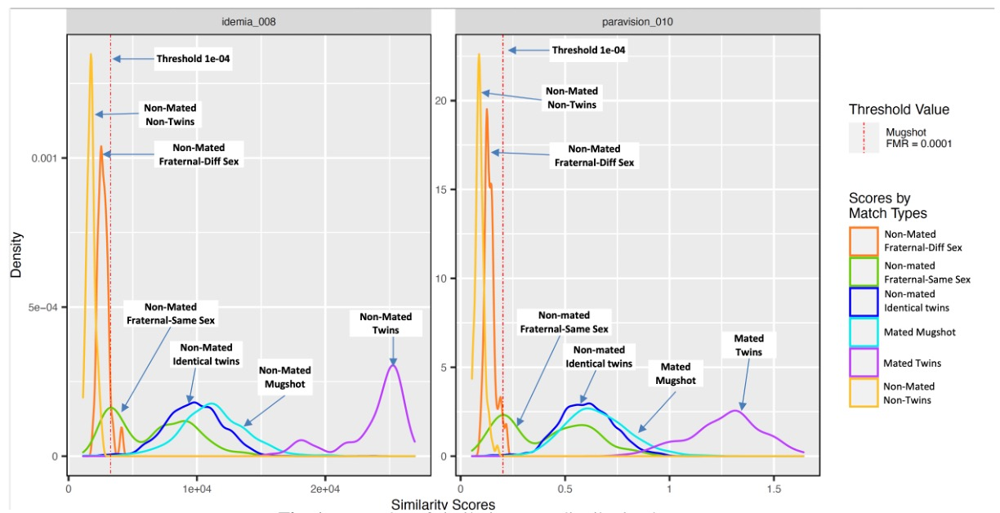

## 雙胞胎辨識能力報告

[**FRVT: Face Recognition Verification Accuracy on Distinguishing Twins (NIST.IR.8439)**](https://nvlpubs.nist.gov/nistpubs/ir/2022/NIST.IR.8439.pdf)

---

這不是一篇論文，而是一篇技術報告。

主要是 NIST 在 FRVT（Face Recognition Vendor Test）中，針對區分雙胞胎的問題進行了研究。

這是一個很有趣的問題，因為雙胞胎之間的相似度非常高，對於人臉辨識系統來說，這可能會造成一些困難...

呃，不對。

應該說：對人臉辨識系統來說，「辨識雙胞胎」是個令人感到窒息的困難任務。

## 簡介

人臉辨識技術在公共和私營部門中的應用越來越廣泛，主要用於身份驗證、交易授權及存取控制。

過去十年中，FRVT 評估中的準確性顯著提高，支持了這些用途。

自 COVID-19 大流行以來，一些演算法已經能夠辨識佩戴口罩的個人。

然而，儘管有這些進步，雙胞胎的辨識仍然存在問題。

本報告記錄了最新演算法在這方面的結果。

## 資料集

### Twins Day Dataset 2010-2018

- [**Download**](https://biic.wvu.edu/data-sets/twins-day-dataset-2010-1015)

該資料集來自西維吉尼亞大學的生物辨識與辨識創新中心，包含 2010 年至 2018 年 Twins Days 的圖像。

這些收集是根據 IRB 協議進行的，並獲得了每個參與者的知情同意。

每年收集的圖像尺寸不同：

- 2010 年為 2848x4288
- 2011 年為 3744x5616
- 2012 至 2018 年為 3300x4400 和 2400x3200。

圖片均為高品質正面人像，符合 NIST SAP50 規範（規定頭部及肩部構圖要求）及 SAP 51 規範（規定頭部構圖要求）

- **範例圖片：不同人**

  

- **範例圖片：同一人**

  

### Immigration-related Images

該資料集包含即時捕捉的影像，主要來自網路攝影機影像和一些簽證申請影像。

網路攝影機影像由服務員在時間限制下拍攝，因此存在橫滾角、俯仰角和偏航角變化，背景照明有時過亮導致臉部曝光不足，且因為近距離拍攝產生透視失真，有些臉部部分裁剪，這些影像的平均眼距為 38 像素，不符合 ISO/IEC 19794-5 全正面影像類型。

其中，有一些受試者還有在參加面試環境中使用專用設備和照明收集的簽證申請影像，這些影像的幾何形狀符合 ISO/IEC 19794-5 標準，擷取尺寸為 300x300，姿勢接近正面。

- **示意圖**

  

## 資料集缺陷

### 小型族群

- 雙胞胎日資料集與其他 NIST FRVT 1:1 資料集相比較小，共有 5900 多張影像。
- 由於部分資料的 Metadata 不一致或缺失，許多影像和雙胞胎被排除，包括一些錯誤匹配的情況（例如，A 與 B 是雙胞胎，但 B 與 C 也被記錄為雙胞胎）。
- 移民相關資料集保留了大部分影像，包含 152 對雙胞胎和 2,478 張影像。

### 辨識碼的變化

- 雙胞胎日通常對相同參與者每年分配相同的辨識碼，但有時會更換新的辨識碼。
- 這導致非雙胞胎比較中，一小部分高於閾值的比較得分，實際上應是正確匹配卻顯示為錯誤。

### 不正確/遺失的 Metadata

- 2011 年至 2016 年間，部分或全部收集的雙胞胎日資料的 Metadata 遺失。
- 不正確的雙胞胎類型、生日等 Metadata 不匹配導致許多影像被排除。
- 移民相關影像資料中缺乏異卵或同卵雙胞胎的區分信息。

### 資料不平衡

- 雙胞胎日影像在雙胞胎類型的分布不均，其中 2.8% 為異性異卵雙胞胎，6.7% 為同性異卵雙胞胎，90.5% 為同卵雙胞胎。
- 資料集在年齡組分布上也不平衡，大部分影像屬於 20-39 歲範圍，而 40-59 歲和 60 歲以上的老年族群影像極少。

### 種族不平衡

- Twins Days 資料集包含參與者的種族身份，85% 為白人，10% 為非裔美國人，5% 為其他。
- 種族數量過多，基於種族的分析意義不大。

## 演算法分析報告

由於 FRVT 的活動向全世界開放，因此有許多演算法參與者。

本報告記錄了 2019 年至 2022 年 2 月中旬提交給 FRVT 1:1 測試，共 478 個演算法結果。

### 分析指標

- **錯誤匹配率 (False Match Rate, FMR)**

  錯誤匹配率（FMR）是在所有匹配嘗試中，不同人的面部被錯誤地辨識為同一人的比例。

  在人臉辨識系統中，這是一個關鍵的性能指標，特別是在需要高安全性的應用場合，如銀行或機場安檢。

  當設置 FMR = 0.0001 時，意味著在每 10,000 次匹配嘗試中，只有 1 次會出現錯誤匹配。

- **不匹配率 (False Non-Match Rate, FNMR)**

  不匹配率（FNMR）是在所有匹配嘗試中，同一人的面部被辨識為不同人的比例。

  這同樣是衡量人臉辨識系統性能的重要指標，尤其是在用戶便利性和用戶體驗的場合。

- **FNMR @ FMR = 0.0001**

  當你看到「FNMR @ FMR = 0.0001」這樣的表述時，這意味著在設定錯誤匹配率為 0.0001 的條件下，所觀察到的不匹配率（FNMR）的值。

  這是一種測量人臉辨識系統在極低錯誤匹配率下的性能如何，這樣可以確保系統在非常嚴格的錯誤匹配條件下依然能有效地辨識出同一人的面部。

### 同卵雙胞胎

- 在雙胞胎日數據中，同卵雙胞胎的 FMR 值通常高於 0.99，顯示這些雙胞胎幾乎總是能夠被演算法錯誤地辨識為彼此。
- 低於 0.99 的 FMR 主要來自兩類情況：

  - **系統錯誤**：高註冊失敗率（FTE）導致未能從許多或所有影像中提取特徵的算法。
  - **演算法不佳**：系統錯誤不匹配率（FNMR）高、因此產生低分數的算法，意思就是演算法看什麼都是不同人。

### 少數可以辨識同卵雙胞胎

一些演算法在辨識同卵雙胞胎方面顯示出較高的準確性，這些演算法在辨識過程中沒有將所有同卵雙胞胎錯誤地辨識為同一人。

這些演算法包括：

- **演算法**: aigen-001, aigen-002, beyneai-000, glory-004, mobai-000, 和 iqface-001。
- **性能指標**:
  - **FNMR (錯誤不匹配率)**: ≤ 0.02
  - **FTE (註冊失敗率)**: ≤ 0.02
  - **FMR (錯誤匹配率)**: ≤ 0.7

其中 aigen-002 的性能特別值得關注，其同卵雙胞胎的錯誤配對率為 0.475，意味著該演算法在約一半的案例中沒有將同卵雙胞胎錯誤地辨識為同一人。這個 FMR 值雖然遠高於理想標準值（FMR = 0.0001），但仍顯著低於其他多數演算法的 0.98 和 0.99 的 FMR 值，表明該演算法在區分同卵雙胞胎方面具有較好的性能。

## 綜合分析

### Score distributions

上圖顯示了兩個準確且代表性的算法對於不同類型照片的分數分佈。

其中最高分數來自於「mated twins」標籤的分組，這表示同一人在同一天拍攝的照片之間的比較。

次高分數來自標籤為「mated mugshot」的普通人像照片，用作對照組。

同卵雙胞胎之間的比較（標記為「non-mated identical twins」）也獲得了相似的高分。

異卵同性雙胞胎（標記為「non-mated fraternal samesex twins」）的分數同樣接近上述高分。

這些分數均高於報告中設定的閾值，該閾值旨在對一組不相關的人像對給出假匹配率 FMR=0.0001。

:::tip
雖然雙胞胎的分數略低於相同個體的分數，這些結果仍然遠高於模型閾值，顯示出算法在區分雙胞胎與非雙胞胎間的挑戰。

此外，報告指出，單純提高閾值來降低雙胞胎之間的錯誤匹配是無效的，因為問題源於算法的基本設計，而非閾值設置。
:::

### Age effects

在分析不同年齡組的雙胞胎時，兩個資料集均顯示，在較老的年齡組別中，非關聯雙胞胎之間的相似度分數有所下降。

**Twins Days 資料集**中將雙胞胎分為四個年齡層：0-19 歲、20-39 歲、40-59 歲和 60 歲以上。分析結果表明，在最老的年齡組別中，無論是異卵還是同卵的同性雙胞胎，其相似度分數均低於最年輕的年齡組。

**移民相關資料集**則包含所有同性雙胞胎，分為三個年齡層：0-19 歲、20-39 歲和 40-59 歲。在這個資料集中，0-19 歲的相似度分數與已關聯雙胞胎的分數更為接近，而 40-59 歲的相似度分數則顯著低於年輕組別，並與已關聯雙胞胎的分數相差較大。

雖然在較大的年齡組中相似度分數有所下降，這些得分仍高於演算法設定的閾值，顯示出演算法仍將非關聯雙胞胎視為匹配。因此，演算法未能有效區分異卵雙胞胎和同卵雙胞胎。

:::tip
演算法未能區分異卵雙胞胎尤其令人驚訝，因為異卵雙胞胎具有不同的基因組，理應表現出不同的臉部特徵。這意味著在辨識長相相似的兄弟姐妹時，尤其是他們出生年份相近時，演算法可能同樣無法做出準確區分。
:::

### Longitudinal effects

隨著人臉辨識演算法效能的提高，區分同性雙胞胎的能力卻沒有任何改善。意思是在人像數據上表現良好的演算法在比較 Twins Days 數據中的同性異卵雙胞胎和同卵雙胞胎時，表現沒有改善或下降。

## 結論

在考慮 NIST 臉部辨識驗證測試(FRVT)中的表現及其對同卵和異卵雙胞胎的辨識能力時，現有的人臉辨識技術面臨顯著的挑戰，尤其是在區分遺傳上高度相似的同卵雙胞胎方面。

儘管異卵雙胞胎之間的基因相似性較低，可能外觀差異更大，但演算法在區分兩者時仍存在困難，這種困難在那些對身分驗證精確度要求極高的場合中，可能會導致災難性的後果。

針對未來的改進方向，本報告提出一個要點：必須利用更高解析度的影像來增強臉部辨識系統的表現。

### 利用更高解析度的影像

更高解析度的影像能夠提供更豐富的臉部皮膚細節，例如皮膚紋理、孔洞模式等，這些都是獨特的個體特徵，可能有助於區分甚至是遺傳上相同的雙胞胎。

:::tip
這種方法的有效性已經由 2004 年的專利演算法（美國專利：US7369685B2）所證實。

該演算法能透過分析高解析度影像中可見的皮膚紋理來準確區分雙胞胎。
:::

為了實現這一目標，建議未來的研究和開發應專注於改善影像擷取的品質，確保至少有 120 像素的眼間距，符合 ISO 標準的正面肖像，以適用於基於皮膚紋理的分析。此外，目前主流的神經網路模型通常會在輸入影像上直接做降採樣的操作，以提高運算速度，但這會丟失一些關鍵的細節信息，進而影響辨識的準確性。（特別是在區分雙胞胎這種高度相似的情況下）

這些都是未來改進的方向，對於辨識雙胞胎的議題，希望能夠在未來的 FRVT 中看到更好的表現。
