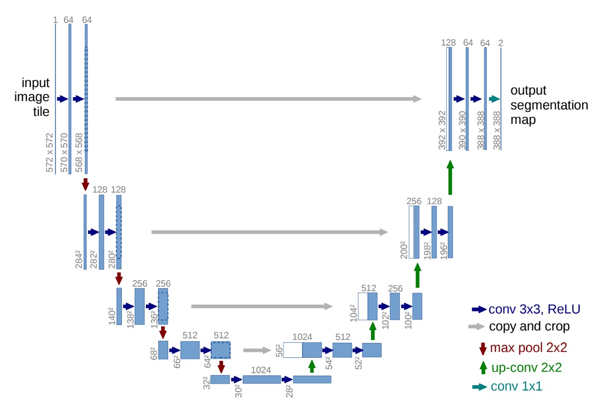
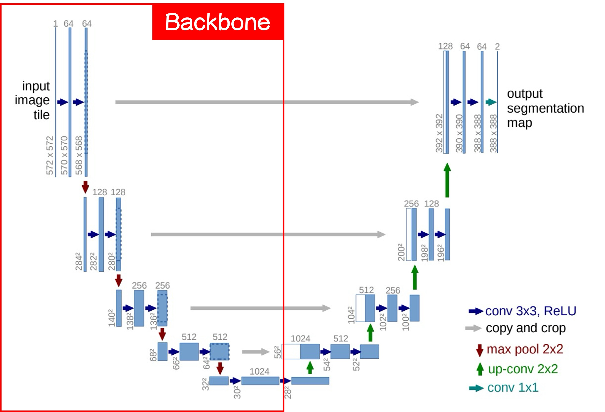

# [15.05] U-Net

## 融合的序幕

[**U-Net: Convolutional Networks for Biomedical Image Segmentation**](https://arxiv.org/abs/1505.04597)

---

在這個 VGG 現世不久的時刻，還有更多的需求未能滿足。

研究者發現傳統的 CNN 架構無法提供足夠的細粒度，不足以應對生物醫學影像分割的挑戰。

於是就有了這個作品，這篇論文是影像分割的經典之作。

## 定義問題

對比於隔壁棚的圖像分類領域，大家一口一個 ImageNet，吃飽喝足，不亦樂乎。

生物醫學影像分割的研究者就不是那麼愉快了。在該領域中，可以用來訓練的資料非常少，少到不足以支撐深度學習的訓練需求。

解決問題的方向也沒有很明確，之前有種研究方法是將訓練資料切成多個小塊，藉此產生更多的訓練樣本。但這樣會導致另外一個問題是上下文信息的丟失，而降低了分割的準確度。

恰好這時有另外一份研究提出了全卷積網路架構，給了作者一點啟發。

- [**[14.11] Fully Convolutional Networks for Semantic Segmentation**](https://arxiv.org/abs/1411.4038)

  

或許我們可以將這個架構應用到生物醫學影像分割的問題上，解決時上下文信息丟失的問題。

## 解決問題

### 模型架構

使用完整的影像確實解決了上下文信息丟失的問題，但資料不足的問題依然存在。於是作者提出了 U-Net 架構，透過重複使用高解析度的特徵圖，來提高分割的準確度，同時降低模型對資料量的需求。

上圖是 U-Net 的架構，你可以先暫時忽略數字的部分，因為作者在卷積層上沒有使用 padding，所以每經過一次卷積層，特徵圖的大小會減少。這讓第一次看到這個架構的人，會受到數字的干擾而不能好好欣賞這個架構。

我們把這張圖切一半，先看左邊：

這裡就是我們常在講的 Backbone 的部分，這個部分可以隨意切換成不同的架構，你如果喜歡 MobileNet，就用 MobileNet，如果喜歡 ResNet，就用 ResNet。

一個基本的 Backbone 設計會有五層降採樣，分別對應了上圖的五個輸出層。

接著我們看右邊：

這邊就是我們常講的 Neck 的部分，這部分的特色就是從最底層開始上採樣，方法可以使用簡單的插值或是更複雜的反卷積，在這篇論文中作者使用了反卷積。

上採樣之後我們會得到更高解析度的特徵圖，這時把底層特徵圖與上一層的特徵圖進行融合，融合的方式可以用簡單的拼接或是相加，這裡作者使用了拼接。

經過上述的流程，最後我們可以得到一張與原始影像大小相同的分割結果，分割結果可以透過通道數量來控制，如果只是二元分割，就只需要一個通道；如果是多元分割，就需要多個通道。

:::tip
如果你選擇用相加，那就是另外一個經典的作品 FPN。

- [**[16.12] FPN: 金字塔架構**](../1612-fpn/index.md)
  :::

## 討論

### ISBI Cell Tracking Challenge 2015

作者將 U-Net 應用於 ISBI 2014 及 2015 年細胞追蹤挑戰賽：

- 在 PhC-U373 資料集中，達到了 92%的 IOU，顯著超越了當時的第二名的 83%。
- 在 DIC-HeLa 資料集中，我們取得了 77.5%的 IOU，同樣大幅超過了第二名的 46%。

這些結果顯示，U-Net 在不同類型的顯微鏡影像分割任務中均展現了卓越的性能，並顯著優於其他現有的方法。

## 結論

U-Net 的設計方式保留了高解析度的特徵圖，透過上下文信息的融合，提高了分割的準確度，同時降低了對資料量的需求。這個架構簡單且容易擴展，使其適用於各類影像分割任務，包括細胞分割、器官分割和病變檢測等。

和 FPN 比起來，拼接的結構會帶來更大的參數量和計算量，因此在對於參數量有所限制的情況下會造成一定的困擾。每種架構各有所長，我們可以多學幾種不同的設計方式，根據任務的需求來選擇最適合的架構。
