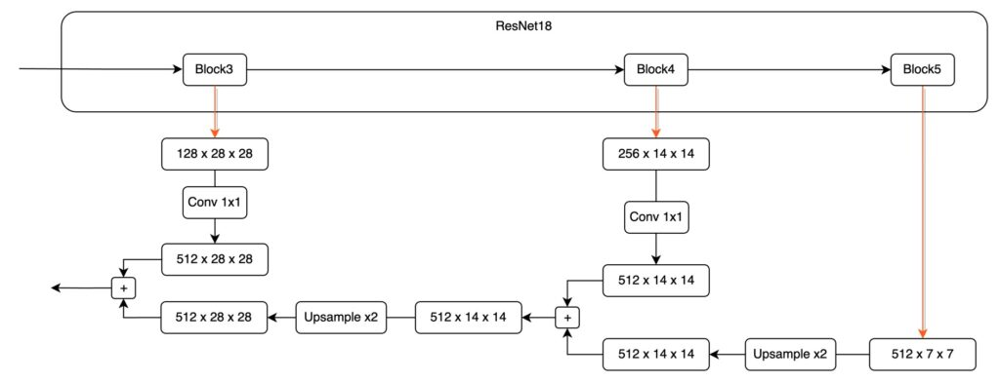
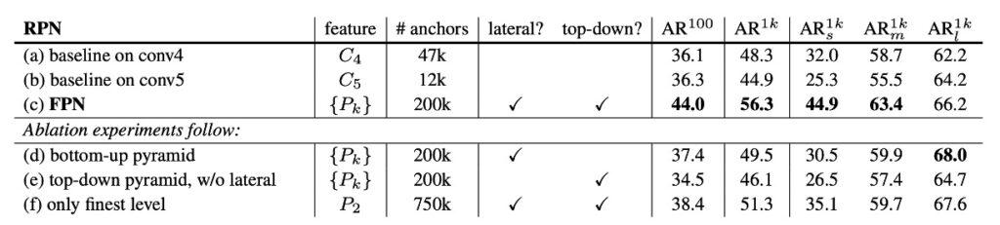

# [16.12] FPN

## 金字塔架構

**[Feature Pyramid Networks for Object Detection](https://arxiv.org/abs/1612.03144)**

---

考慮一個場景。

給定一個常見的卷積網路模型的操作流程：首先輸入一張原始圖像，可能是 3 x 224 x 224 的輸入尺寸，接著經過一層一層的降採樣，最後將獲得一個高維的語義特徵，尺寸可能為 256 x 7 x 7，通常一個約定俗成的模型在最後的輸出通常是 1/32 的尺寸，即：以原圖 224 x 224 為例，最後輸出的特徵尺寸為 7 x 7 的特徵圖。

對於這個特徵圖有很多種說法，你可能有聽過：

- 低解析度的特徵圖（因為比起原圖，最後特徵圖只有 1/32 的大小）
- 高維度的語義特徵（因為濃縮了整張圖的特徵，帶有較大的感受野。）
- 頂層(Top)的特徵 (bottom ｜原圖 -> C1 -> C2 -> … -> C5 ｜ top)

這種設計在分類任務上沒有問題，因為分類任務是可以參考整張輸入影像的內容，最後輸出一個或數個可能的分類結果。

但在物件偵測上就不管用了，如剛才提到，這個特徵圖是 1/32 的尺度。此時如果有個「我們想要偵測的物件」，它的圖中的尺寸小於 32 x 32 個 pixel，那麼很遺憾，它會在降採樣的過程中「煙消雲散」，模型在最後的特徵圖上看不到它。

好吧，用「煙消雲散」可能是有點誇張的說法，事實上如果模型是採用卷積操作來進行降採樣，那麼該物件或許能把自己的存在依附在附近的像素上。

:::tip
如果你沒辦法接受這麼超自然的描述也無妨，總之模型想看到它會比較吃力，它得消耗更多容量來記下這個微小的特徵，最後使得整體的表現不如預期。
:::

這表示如果要提升物件偵測的表現的話，我們總得做點什麼事情來挽留這些特徵。

大約在 2015 年底，SSD 被提出來：

- **[SSD: Single Shot MultiBox Detector (2015.12)](https://arxiv.org/abs/1512.02325)**

當年主要想改進的對象是 YOLO v1。

它基於 YOLO v1 的架構中，把不同尺度的特徵圖加入預測頭，將高維特徵（P3~P5）合併後進行預測，是金字塔特徵層次結構的首次嘗試者。雖然是較早期的設計方式，但也算是特徵金字塔網路的先行者。缺點就是運算量比較大，另外是低維特徵無法參考到高維特徵的語義。

## 定義問題

本篇論文中，作者明確指出了這些主要問題：

1. **特徵金字塔的侷限**

   傳統的特徵金字塔策略，在過去的手工特徵時代，是對多尺度對象進行識別的主要工具。但在深度學習時代，這些方法已經不能滿足當前的需求。其主要的問題是它對於不同尺度的特徵處理能力相對較弱。特別是當面對大量的圖像資料時，它的處理速度遠遠不能滿足實時應用的需求。此外，這種方法僅僅是進行了簡單的特徵縮放，而沒有進行更深入的特徵融合和優化，這使得其識別效果受到了限制。

2. **SSD 的局限性**

   為了解決上述問題，SSD 作為一個新興的策略，嘗試利用深度卷積網絡的金字塔特徵層次結構。它的目標是希望能夠完全取代傳統的特徵金字塔策略。但 SSD 在設計上存在一些明顯的缺陷。它為了避免使用較低級的特徵，刻意不重用已經計算過的高分辨率層，而是選擇添加新層來建立其金字塔。這種做法不僅增加了計算的複雜性，還遺漏了特徵層次結構中高分辨率映射的重要性。對於檢測小尺寸的對象，這些高分辨率映射是關鍵的，而 SSD 的這一策略顯然忽視了這一點。

## 解決問題

### FPN 模型設計

FPN 的主要的目的就是要改善 SSD 的設計方式，作者提出一種結構，如上圖，在保持卷積網絡特徵層次結構的金字塔形狀的基礎上，創建一個在所有尺度上都具有強大語義的特徵金字塔。

為了實現這個目標，作者設計一種結構：

- **通過自頂向下的通道和側連接，將低分辨率的特徵與高分辨率的特徵相結合。**

其實講完這句話，這篇論文其實就算是結束了，再來就是實作和測試的部分而已。

不過我們還是可以再看一下作者提供的一些實作細節。

1. **Bottom-up pathway**

   

   第一個部分，叫做由 Bottom 特徵開始到 Top 特徵的資料路徑。由

   於這篇論文沒有提供影像參考，因此我手繪一張架構圖，並代入實際的數字，並盡量簡化資訊來說明，希望可以讓你更直觀地感覺資料在模型內流動的方式：

   以 ResNet18 為例，輸入一張 224 x 224 x 3 的圖像。我們基於 PyTorch 語法，因此通道數量放在最前面。圖像通過 ResNet18 後，可以得到五種不同解析度的特徵圖，這裡先針對這些特徵圖做出一些定義：

   - P1：即 1/2 尺寸的特徵圖，大小為 64 x 112 x 112。
   - P2：即 1/4 尺寸的特徵圖，大小為 64 x 56 x 56。
   - P3：即 1/8 尺寸的特徵圖，大小為 128 x 28 x 28。
   - P4：即 1/16 尺寸的特徵圖，大小為 256 x 14 x 14。
   - P5：即 1/32 尺寸的特徵圖，大小為 512 x 7 x 7。

   這個影像通過模型的降採樣過程，在此論文中就被稱為：Bottom-up pathway。

   另外值得一提的是在大部分的模型架構設計中，都不會採用 P1 和 P2 特徵圖來進行特徵金字塔，因為這兩層特徵圖的尺寸仍然非常巨大，會佔用大量的計算資源。

2. **Top-down pathway and lateral connections**

   回想一下剛才的步驟，輸入資料是從左邊開始，一路流向右邊。

   而在特徵金字塔的設計上的第二階段，就是要將特徵「從右到左」再融合回來。

   於是我們把剛才的 P4 – P5 的區段放大來看：

   

   在這個融合過程中，首先，因為高維特徵圖的尺寸較小，我們必須先處理它。

   這邊對 P5 特徵圖進行一次 Upsample 操作，以確保尺寸一致性。

   接著，我們希望將這兩個不同維度的特徵圖相加，然而，這引發了另一個挑戰：通道數無法對齊。

   就像上圖所示，從 Block5 輸出的特徵圖具有 512 個通道，而從 Block4 輸出的特徵圖只有 256 個通道。由於通道數不一致，無法直接進行加法操作。為了解決這個問題，我們需要使用 1×1 的卷積核來調整特徵圖的通道數量。請注意，調整通道數量的方法並沒有固定的規範，你可以根據實際情況預先定義一個適當的通道數，例如設定為 64。

   每個 P1 ～ P5 的特徵圖都需要通過一層 1×1 的卷積，以確保通道數量一致，從而避免無法對齊通道的問題。

   在確保通道對齊和尺寸對齊之後，我們可以直接將不同層的特徵圖進行相加，從而完成一輪的融合操作。

   這個步驟如果可以多走一次，可能會讓你更有體會，因此，我們再來看一次 P4 到 P3 的融合。

   

   最後，這邊補上一個實際上做起來比較容易的架構設計，可以是長這樣：

   

   :::tip
   先縮放每個尺度的特徵圖，再進行特徵融合，在工程實作上是一個比較常見的設計方式。
   :::

## 討論

### 這樣真的有比較好嗎？

直接講結果：有的。

論文作者為了論述這件事情，有做了很多組實驗數據，在文章的最後，我們就挑幾個重點圖表來看看，先來看一下論文內提供的消融實驗，如下表：

這張表首先討論了拿掉不同的組件，上表 (d) 是拿掉 top-down 組件；(e) 是拿掉橫向連接；(f) 是拿掉特徵金字塔的特徵表示方式。

可以看到不管是移除哪個組件，都會造成表現的大幅下降，甚至對於基線對比的模型相差無幾。

接著看下一張表：

本論文的作者將方法與 COCO 競賽獲勝者的單模型結果進行了比較，包括 2016 年獲勝者 G-RMI 和 2015 年獲勝者 Faster R-CNN+++。在不使用各種花哨的技巧情況下，FPN 單一模型已經超越了這些強大的、精心設計的競爭對手。在測試開發集上，FPN 比現有的最佳結果提高了 0.5 點 AP。

## 結論

FPN 提出了一個簡潔的框架，可以與各種主幹網絡結合，構建出強大的特徵金字塔。該方法在多個強大的基準模型和競賽獲勝者的基礎上展現了顯著的改進。

FPN 這篇文章講了兩件事：

- 其一，只要想要解決的問題有多尺度的特性，就得考慮不同尺度的特徵融合技巧。
- 其二，特徵融合技巧就三句話：「下到上，上到下，然後加起來。」

在這篇論文之後，引申出了很多討論的方向，例如：如何設計更好的特徵融合策略？要怎麼提高融合的效率？或是要怎麼調整融合的權重？諸如此類的各種場景。

後續還有不少論文，有空我們再一起來看看。
