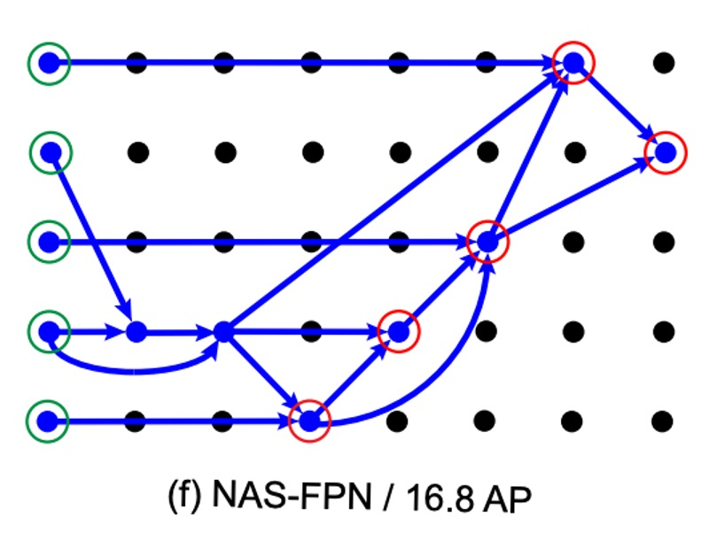

## 有錢就是任性

[**NAS-FPN: Learning Scalable Feature Pyramid Architecture for Object Detection**](https://arxiv.org/abs/1904.07392)

---

在 FPN 被提出來之後，特徵融合一直是熱烈討論的問題，我們這裡根據時間序羅列幾篇：

- **2017.01** -> [DSSD : Deconvolutional single shot detector](https://arxiv.org/abs/1701.06659)
- **2017.07** -> [RON: reverse connection with objectness prior networks for object detection](https://arxiv.org/abs/1707.01691)
- **2017.07** -> [Deep layer aggregation](https://arxiv.org/abs/1707.06484)
- **2017.09** -> [StairNet: top-down semantic aggregation for accurate one shot detection](https://arxiv.org/abs/1709.05788)
- **2017.11** -> [Single-shot refinement neural network for object detection](https://arxiv.org/abs/1711.06897)
- **2018.03** -> [Path Aggregation Network for Instance Segmentation](https://arxiv.org/abs/1803.01534) (< PANet 在這裡 )
- **2018.08** -> [Scale-transferrable object detection](https://ieeexplore.ieee.org/document/8578160)
- **2018.08** -> [Deep feature pyramid reconfiguration for object detection](https://arxiv.org/abs/1808.07993)
- **2018.10** -> [Parallel feature pyramid network for object detection](https://link.springer.com/chapter/10.1007/978-3-030-01228-1_15#chapter-info)

其中人們比較常聽到的是 PANet，除此之外，上述的幾篇論文也都有數百到上千的引用量，有時間我們也可以閱讀一下。

那麼，該選個好呢？

Google 也想知道這個問題，所以他們就提出了這篇：NAS-FPN 的論文。

可以探究其核心概念就是：我也不知道哪個好，所以讓我們用演算法…

- **來暴搜一波吧！**

:::tip
欸不是？這個結論是不是不太對？

其實這很 Google。

像之前的 NasNet 系列，就是搜索網路架構，搜到最後還整理出了另外一篇論文，叫做 EfficientNet，相信你也略有耳聞。

除了網路架構外，晶片設計也可以 NAS，現在只是在特徵融合上用 NAS，就是個很樸實的操作而已。
:::

## 什麼是 NAS？

NAS 代表神經架構搜索（Neural Architecture Search），是深度學習領域中的一個重要研究方向。它的主要目標是自動地找到最佳的神經網路架構，以解決特定的任務。神經網路架構通常由多個層、神經元和連接組成，而這些架構的設計可能會對模型的性能產生巨大的影響。

傳統上，神經網路的設計通常由專家人工進行，需要進行大量的試驗和調整，這是一個耗時且需要專業知識的過程。NAS 的目的是通過自動化來簡化這個過程，讓機器能夠探索和發現最佳的神經網路架構。

在 NAS 中，一個搜索空間被定義，這個搜索空間包含了所有可能的神經網路架構的變體。然後，通過不同的搜索策略，如遺傳算法、強化學習、進化算法等，系統會自動生成、評估和選擇這些架構，以找到在特定任務上表現最好的架構。

一般來說，NAS 的優缺點大概是：

### 優點

- **自動化**：能夠自動地探索和找到最佳的神經網路架構，減少了人工調整和設計的工作量，並且有助於節省時間和資源。
- **最佳化**：可以針對特定任務和數據集找到最佳的神經網路結構，提高模型性能，並且可能在一些情況下超越人工設計的模型。
- **靈活性**：不僅限於特定的任務或架構，可以適應不同的應用場景，並生成適合特定需求的模型。
- **創新性**：有助於發現新的神經網路結構，有可能帶來創新的模型架構，從而推動深度學習的進一步發展。

### 缺點

- **計算資源消耗**：搜索過程可能需要大量的計算資源，包括 GPU 或 TPU，以及大量的時間，這可能限制了其實際應用。
- **複雜性**：搜索空間的大小和可能的組合數量可能導致搜索過程變得非常複雜，需要更高級的算法和技術來進行有效搜索。
- **高度依賴於數據集**：找到的最佳架構可能高度依賴於用於搜索的特定數據集，無法保證在其他數據集上也能表現出色。
- **隨機性**：搜索過程可能具有一定的隨機性，不同的搜索運行可能會得到不同的結果，這使得結果的穩定性成為一個挑戰。

## 其實缺點多一點

看了 NAS 優缺點之後，你可能對於靈活和創新非常感興趣，但事實是有 90% 以上或更高的從業人員無法有足夠的資源建構自己的搜索系統，通常只能使用這項技術帶來的結果，而這就會立刻面臨下一個問題：

- **我的使用情境跟論文一樣嗎？**

這裡的使用情境包含了推論資料的特徵分佈，訓練資料的特徵分佈，解決問題的搜索空間等，如果有個答案是否，那這個最佳化的架構，可能，或許，應該…

- **不適合。**

那拿這篇論文出來講的目的是什麼？

首先，我們都可能是那 10% 的人，而這篇論文展示了該如何設計一個搜索架構，並根據自己的使用場景找出最合適的特徵融合方式。其次，這篇論文有展示一些自動化搜索後的結果，而這些結果可以為我們後續的設計帶來一點啟發。

## 解決問題

### NAS-FPN 模型設計

這份研究的主要目標，是要找出一種更好的 FPN 架構，在學術圈習慣使用的語言中，模型的一開始會有一個基礎的架構，稱為 Backbone，這個架構可以隨意抽換，例如 ResNet、MobileNet 等。

接著 FPN 的部分通常被稱為 Neck，這邊主要工作是多尺度的特徵連接，也就是現在要討論的範圍。

可以順便提一下，在 Neck 後面就會接上我們要解決的問題，稱為 Head。

在日常工作的環境中，工程師通常就會圍繞著這三個部分進行抽換，測試和延伸相關的討論。

在這份研究中，作者用一種名為「RetinaNet」的架構作為基礎，RetinaNet 的 backbone 採用 ResNet，neck 採用 FPN。

:::tip
RetinaNet 這篇論文的主題其實是 FocalLoss，裡面的 RetinaNet 架構是為了應用 FocalLoss 而簡單搭配的產物。
:::

### 合併單元（Merging Cell）

在 NAS-FPN 中，基於原本的 FPN 設計，提出了一個名為「合併單元」的新概念。

合併單元是一個小模塊，負責將兩個不同的輸入特徵層「合併」成一個新的輸出特徵層。這個合併的過程具體包含以下步驟：

1. 選擇第一個特徵層: 從多個候選特徵層（可能是 C3, C4, C5 等）中選擇一個，稱之為 hi。
2. 選擇第二個特徵層: 再次從多個候選特徵層中選擇一個，稱之為 hj。
3. 確定輸出特徵的尺寸: 選擇一個解析度大小，這將是合併後新的特徵層的大小。
4. 選擇合併操作: 使用一個特定的數學操作（如加法或全局池化）來合併 hi 和 hj。

在步驟 4 中，如下圖，搜索空間中設計了兩個二元運算：求和和全局池化，選擇這兩個運算是因為它們簡單且高效。他們沒有添加任何額外的可訓練參數。

如果 hi 和 hj 的尺寸不同，在合併之前會使用上採樣或下採樣來使它們有相同的尺寸。合併後的新特徵層會經過一個 ReLU 啟動函數、一個 3×3 的卷積層，以及一個 BatchNorm 層，以增強其表達能力。這樣，FPN 能通過多個這樣的合併單元，不斷地合併和改進特徵層，最終生成一組更好的多尺度特徵層（P3, P4, P5 等）。

## 討論

根據實驗數據顯示，隨著訓練步驟的增加，控制器能夠生成越來越好的子網路架構。這一過程大約在 8000 個訓練步驟後達到一個穩定狀態，也就是說，新增的獨特架構數量開始收斂。

最後，根據獎勵的優化結果，作者選擇了 AP 最高的架構進行進一步的訓練和評估。

這種架構首先是在 8000 步的訓練中被採樣出來的，並在後續的實驗中被多次採樣。

接著，作者展示了根據 NAS 算法得到的 FPN 架構，如下圖：

這個圖看起來很複雜，有種看不懂但是覺得很厲害的感覺。

其實沒有，我把它註記一下：

經過註記說明後，我們就能好好地來看一下 NAS-FPN 的結果了。

首先在一開始 (a) 中的 FPN 並不太表真正的 FPN，它是「類 FPN」，因為他輸出特徵圖的方式和資料流得順序，確實跟 FPN 是一致的，但原本的 FPN 內部沒有這麼多層卷積層。

再來，我們看一下 NAS-FPN 的實驗結果，從 (b) -> (f) 的順序來看，隨著 AP 分數不斷地提升，可以發現搜索架構的方式最後驗證 PANet 這篇文章的設計理念是正確的，即圖 (f)：

- 資料必須由上往下融合
- 資料必須再由下往上融合
- 雖然細節可能有點不一樣，但意思到了就好。

## 結論

在過去的研究中，特徵融合架構多是通過人工設計和實驗得來，這種做法的可靠性和規模一直是大家質疑的焦點。

確實，實驗性的研究雖然能夠提供某些見解，但其價值往往局限於實驗的規模和設計。

或許我們可以接受某結論的「理論根基」可能不夠，並接受經由「實驗」所得到的結論。

但這些文獻要怎麼說服別人說「實驗」的量級是足夠的呢？

＊

在此，NAS-FPN 藉由一個精密的搜尋架構和前所未有的計算規模（可能沒有其他公司有錢，而且願意花錢做這種計算），對這個問題提出了一個全新的角度。

這不僅確認了 PANet 的設計理念的正確性，而且還揭示了其連接方式可能存在的低效問題。

這種經由 NAS 搜索得到的結合方式，不僅增加了前人研究的可信度，也為未來的研究提供了新的方向。
