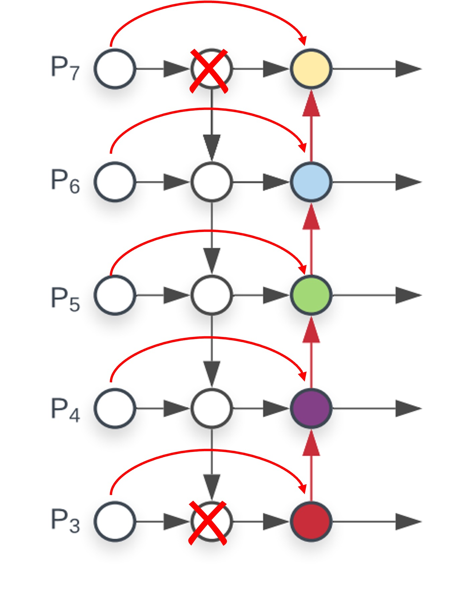

# [19.11] EfficientDet

## BiFPN 才是本體

[**EfficientDet: Scalable and Efficient Object Detection**](https://arxiv.org/abs/1911.09070)

---

在大約半年前 Google 提出了 NAS-FPN，但顯然在他們公司內部有其他人認為這不是一個好方向。

所以他們完全捨棄了 NAS-FPN 得到的搜索結果，重新基於 FPN 重新設計了一個新的特徵融合模塊，並稱之為 BiFPN。

## 定義問題

FPN 這一項開創性的工作自從發布以來，已經廣泛應用到各種目標檢測任務中。

後續也有相當多樣的變體和改善的方式，我們可以從下圖看到大致的發展軌跡：

從最左邊的 FPN 開始，在不同解析度的特徵圖上進行特徵融合，從最深的特徵圖一路進行上採樣，然後相加回到較淺的特徵圖上。

後續提出的 PANet 認為只有單純一條路線加回來是不夠的，所以提出了一條新的路線：再進行一輪下採樣相加。這樣做的目的我們之前也有提過，就是為了建立一條從最淺層到最深層的特徵融合捷徑，讓模型可以更好地利用不同層次的特徵。

- [**[18.03] PANet: 給我一條捷徑**](../1803-panet/index.md)

接著 NAS-FPN 提出了一個自動搜索的方法，規劃了多層的特徵融合結構，讓模型自己去找出最好的特徵融合結構方式，但這種方法的缺點也很明顯，就是難以解釋和控制。

- [**[19.04] NAS-FPN: 有錢就是任性**](../1904-nasfpn/index.md)

所以在這篇論文中，同樣來自 Google 的作者不考慮 NAS 的方式，而是回過頭去找尋 PANet 的優點，並著重於兩個觀點：

- **特徵融合不能只是單純的相加，而是要考慮到特徵的重要性，進行加權相加。**
- **FPN 的層數應隨著模型規模進行縮放。**

## 解決問題

### 模型架構

作者為了要展示出 BiFPN 的有效性，選了 RetinaNet 這個經典的目標檢測模型，並抽換了 FPN 的特徵融合模塊，改成了 BiFPN。

上圖中，最左邊是 Backbone，我們不用管他，這不是本文的重點；最右邊的是 Head，也不是本文的重點。我們只需要專心地看中間的 BiFPN 就好。

這裡的設計是從 PANet 出發，做了幾個改進，這裡讓我們用小畫家來畫一下：

1. **跨尺度連接：**

   我們從 PANet 開始改，這裡新增跨尺度連接，然後每個連接要進行「加權」相加，所以每個節點新增一組權重參數。

   

2. **移除低貢獻節點：**

   看一下上面的圖，你會發現最深層有個節點只有一組連接，這顯然是低效的，不如就刪了；最淺層的節點由於沒有要再接收更上層的特徵，所以兩個節點功能重複了，也可以刪掉。

   

做完上面兩個步驟，我們就得到了 BiFPN 的結構。

在這裡作者還提到一個重要的觀點，他把這個結構視為一個「模組」，因此以此為單元，可以進行多層的堆疊，這樣就可以隨著模型規模的增大，進行更多層的特徵融合。

:::tip
在原始的 PANet 中沒有展示出這個概念，他們只有一層上採樣和一層下採樣。有了模組堆疊的概念後，我們可以對 FPN 和 PANet 都應用這種堆疊操作，這樣也可以提升模型的性能。
:::

### 模型縮放

除了新的架構之外，作者也延續 EfficientNet 的思路，提出了一個模型縮放的概念。

大概的意思是既然 Backbone 可以做縮放，那麼 FPN 也應該可以做縮放，這樣才能更好地配合不同規模的模型。經過實驗，上表展示了對於不同規模的模型，BiFPN 的縮放配置，可以看到隨著模型規模的增大，BiFPN 的層數和通道數量也相對地增加。

### 加權平均

最後，作者討論到該如何設計加權特徵圖的權重。

在論文中提出了三種設計方式：

1. 無界融合：不對權重進行任何約束，讓模型自己學習，但結果非常不穩定，後續略過不談。
2. Softmax 融合：對權重進行 softmax 計算，讓權重和為 1。
3. ReLU 限制：對權重進行 ReLU 計算，讓權重為正數，接著規範其權重和為 1。

在上圖中作者展示了第二種和第三種的實驗效果，可以看到 ReLU 和 Softmax 的效果表現一致，但 ReLU 快了 30%，這也是作者推薦的設計方式。

## 討論

### 在 COCO 上的表現

作者基於 COCO 2017 檢測資料集進行實驗，使用了 118,000 張訓練影像。

訓練過程中，作者採用了隨機梯度下降（SGD）優化器，動量設為 0.9，權重衰減為 4e-5。學習率在初始週期從 0 線性增加至 0.16，隨後應用了餘弦衰減規則進行退火。此外，每次卷積操作後，作者引入了同步批規範，批規範的衰減係數為 0.99，epsilon 值設為 1e-3。

模型使用了 SiLU（Swish-1）作為活化函數，並應用了衰減係數為 0.9998 的指數移動平均值來提高模型穩定性。在訓練過程中，作者採用了焦點損失函數，α 設為 0.25，γ 設為 1.5。模型的數據增強策略包括水平翻轉和縮放抖動，影像大小在裁切之前隨機調整為原始大小的 0.1 至 2.0 倍。此外，作者在評估過程中使用了軟性非極大值抑制（Soft NMS）。

在訓練資源配置方面，作者對 EfficientDet-D0 至 D6 模型在 32 個 TPUv3 核心上進行了 300 個訓練週期，而對於 EfficientDet-D7 和 D7x 模型，則在 128 個 TPUv3 核心上進行了 600 個訓練週期，總批量大小為 128。

實驗結果顯示，EfficientDet 在不同精度和資源限制下均表現出優異的效率。相比於先前的偵測器，EfficientDet 模型在尺寸上縮小了 4 至 9 倍，FLOPs（浮點運算次數）減少了 13 至 42 倍。特別是，EfficientDet-D0 與 YOLOv3 在精度相當的情況下，FLOP 次數減少了 28 倍。與 RetinaNet 和 Mask-RCNN 相比，EfficientDet 在保持相似精度的同時，參數數量減少了 8 倍，FLOP 減少了 21 倍。

在高精度的設定下，EfficientDet-D7x 在測試開發集中達到了 55.1 AP，顯著超越了現有技術，在準確性提升 4 AP 的同時，效率提高了 7 倍。此外，作者還比較了 Titan-V FP32、V100 GPU FP16 和單執行緒 CPU 上的推理延遲，並指出 V100 的推理延遲包含了端對端的預處理和後處理，展示了 EfficientDet 在推理速度上的優勢。

## 結論

相比於傳統的 FPN 架構，BiFPN 通過選擇性加權和輕量化設計，在不顯著增加計算成本的情況下，實現了更好的多尺度特徵融合效果。

:::tip
簡單好用，是我們實作模型的好夥伴，在這裡也推薦給你試試。

- [**docsaidkit/torch/neck/bifpn**](https://github.com/DocsaidLab/DocsaidKit/blob/main/docsaidkit/torch/neck/bifpn.py)
  :::
