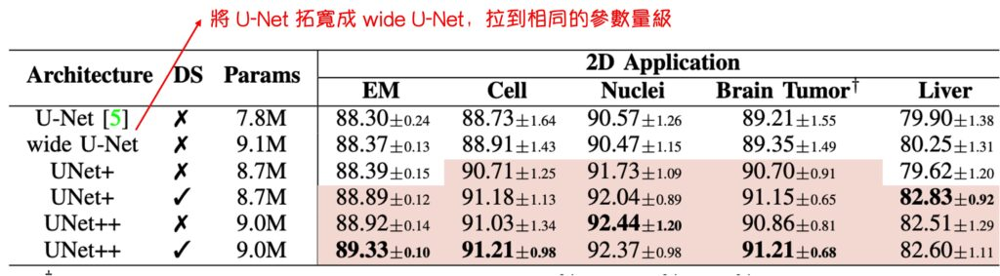

# [19.12] UNet++

## 微妙的織網者

**[UNet++: Redesigning Skip Connections to Exploit Multiscale Features in Image Segmentation](https://arxiv.org/abs/1912.05074)**

---

這篇文章的作者從 U-Net 為出發點，探討原始 U-Net 架構的設計問題。

套用一句作者的原話：

> 「這個三年不動的拓樸結構真的一點兒毛病都沒有嗎？」
>
> Excerpted from [**研习 U-Net**](https://zhuanlan.zhihu.com/p/44958351)

作者認為 U-Net 不只是有問題，而且問題還很多。

## 定義問題

常見的 U-Net，其深度是五層降採樣，如上圖 (d)。

為什麼不是三層？為什麼不是七層？網路的設計到底要多深？

在許多深度學習的應用中，網路的深度通常是一個關鍵的參數，它直接影響了網路的效能和學習能力。

讓我們進一步探討這個問題的各個層面：

1. **特徵表徵能力**

   網路的深度決定了其表徵能力。簡單來說，更深的網路通常能夠學習到更複雜、更抽象的特徵。在影像分割、目標偵測或分類等任務中，這種抽象的特徵獲取能力非常重要的。而較淺的網路可能只能捕捉更簡單、更局部的特徵。

2. **計算複雜度**

   隨著網路的深度增加，計算複雜度和參數數量通常會急劇增加。 這不僅會增加訓練和推理的時間成本，還可能需要更多的運算資源。 在資源有限的情況下，找到一個適當的網路深度是一個挑戰。

3. **過擬合與泛化**

   較深的網路通常具有較高的模型複雜度，可能容易發生過擬合，特別是在資料較少的情況下。 而較淺的網路可能具有更好的泛化能力，但可能會犧牲一些表徵能力。

4. **優化難度**

   你當然可以降採樣 100 層（如果你的影像足夠大的話），但隨著網路深度的增加，優化網路參數變得越來越困難。 例如：梯度消失或梯度爆炸問題可能會出現，這需要採用特定的初始化方法或最佳化器來解決。

5. **理論與實務**

   在理論上，深度網路能夠以較少的節點和較少的計算量來表徵相同的函數，但在實踐中，找到一個合適的網路深度並不容易。 過深或過淺的網路都可能無法很好地完成特定的任務。

6. **資料集與任務的特性**

   不同的資料集和任務可能需要不同的網路深度。 有些任務可能需要深層網路來捕捉複雜的模式，而其他任務可能不需要那麼多的抽象層次。

7. **可解釋性與調試難度**

   隨著網路變得更深，模型的可解釋性可能會降低，同時調試和理解模型的行為也變得更加困難。

透過深入研究「要多深？」這個問題，我們可以更好地理解網路深度如何影響深度學習模型的效能和效果，以及如何在具體的實踐中做出合理的選擇和設計。

## 解決問題

### UNet++ 模型設計

在處理影像分割等問題時，理想的情況是網路能夠充分學習到不同深度層次的特徵，以便更好地理解和處理影像資料。

作者在這個問題的探討中，提出了幾個獨創性的網路結構設計，旨在更好地整合不同深度的特徵並優化網路效能。

以下是幾種核心的設計思路和方案：

1. **統一架構（U-Nete）**

   - 目的：訂定巢狀 UNet 的統一架構
   - 這種設計將不同深度的 U-Net 整合在一個統一的架構中。 在這個架構中，所有的 U-Net 至少部分共享相同的編碼器，但具有各自的解碼器。 這種設計讓不同深度的解碼器能夠在同一個網路架構下獨立運作，從而提供一個特殊的視角來觀察和比較不同深度如何影響網路的效能。

2. **U-Net 升級版（UNet+）**

   - 目的：驗證長連接是否有效的對照組
   - 這個設計從 U-Nete 演變而來，放棄了原始的長跳躍連接，而是透過短跳躍連接將每兩個相鄰節點連接起來。 這種設計使得較深的解碼器能夠向較淺的解碼器傳送監督訊號，從而實現了更好的訊息傳遞和特徵整合。 這種設計旨在探索不同深度解碼器間的協作如何影響網路的整體效能。

3. **U-Net 進階版（UNet++）**
   - 目的：驗證長連接是否有效的實驗組
   - UNet++建立在 U-Nete 的基礎上，透過連接解碼器，實現了密集連接的跳躍連接。 這種設計允許沿著跳躍連接的密集特徵傳播，從而實現更靈活的特徵融合。UNet++旨在在一個統一的架構中實現更靈活和高效的特徵提取與融合，以應對不同深度帶來的挑戰。

透過這幾種架構設計，作者希望在保留原始 U-Net 架構優勢的同時，盡可能地解決網路深度選擇的問題，以期透過整合不同深度的特徵，提升網路在影像分割等任務上的性能。

當然，這個架構設計不是突然間就長成這樣了，中間還有經過一些作者的思考和改變，相關的心路歷程可以去看作者本人寫的文章。

## 討論

針對上面的內容，分幾個問題進行討論：

### 就只是參數多？

作者針對這個疑問設計了一組實驗，即將原始的 U-Net 的拓寬，拉到和 UNet++ 同等的數量，再進行比較結果，這個操作雖然有點潦草（作者說的），但是從表格上來看，直接加大參數量的結果是：

- **根本沒有任何顯著的提升。**

在深度學習中，通常更多的參數意味著模型具有更高的表達能力，但這並不總是導致更好的結果。 過多的參數可能會導致過度擬合，尤其是在資料量較小的情況下。此外，隨著參數數量的增加，模型的計算和儲存需求也會顯著增加，這可能不是我們想要的。UNet++ 透過優化網路結構，而不是簡單地增加參數，展現了參數最佳化利用的重要性。

### 深度監督和模型剪枝

在探討深度學習的網絡結構時，尤其是針對圖像分割任務的 U-Net 架構，深度監督（Deep Supervision）和模型剪枝（Model Pruning）兩個概念顯得格外重要。這些技術不僅能夠提高網絡的學習效率，而且有助於在保持一定精度的前提下，大幅減少模型的規模，進而加速推理過程，特別是在資源受限的環境如移動設備上。

1. **深度監督（Deep Supervision）**

   

   深度監督的核心思想是在網絡的不同階段引入額外的損失函數，以保證即便是淺層的網絡結構也能夠得到有效的梯度更新。通過在每個層級的子網絡中添加輔助損失，使得每個階段的 U-Net 都能得到明確的監督信號，進而促進整個網絡的學習。在 U-Net++ 架構中，通過進一步的深度監督，每個子網絡的輸出都能夠被視為圖像的分割結果，提供了一種自然而直接的解決方案來克服梯度消失的問題。

2. **模型剪枝（Pruning）**

   

   模型剪枝是另一種有效減少模型規模的技術。通過評估每個子網絡在驗證集上的性能，可以決定在不損失精度的前提下剪去多少冗余的網絡結構。在推理階段，能夠依據實際需求選擇適當的網絡深度以達到平衡性能和計算成本的目的。

   在討論了 UNet++ 結構和模型剪枝的概念後，可以從以下幾個方面來分析其可行性和重要性。

   - **可行性**

     - 深監督與多層輸出：UNet++ 結構透過深監督擁有多層次的輸出，這使得每個子網路都能夠產生影像的分割結果。 由於這種設計，每個子網路的表現可以獨立評估，為後續的剪枝提供了基礎。
     - 模型剪枝：在測試階段，只需要前向傳播，某些子網路如果已經能夠產生滿意的結果，剪去其他子網路不會影響到前面子網路的輸出。 但在訓練時，被剪去的部分在反向傳播中有助於權重更新，顯示這些剪去的部分對訓練過程仍然很重要。 這種設計保證了在保持網路效能的同時進行剪枝的可行性。

   - **重要性**

     - 計算效率與資源使用：透過剪枝，模型的大小會顯著減少。例如：如果 L2 層的輸出已經滿意，則可以剪去很多參數，從而大幅降低運算和儲存的需求。這對於在資源受限環境（如行動裝置）中運行模型是很重要的。
     - 提速：剪枝後的網狀結構可以顯著提高推理速度。 例如：將 L4 替換為 L2 可以將處理速度提高三倍。 這對於需要即時或近即時回應的應用場景非常重要。
     - 靈活的網路結構：透過合理的剪枝，UNet++ 提供了一個靈活的網路結構，可以根據不同的任務需求和資料集難度來調整網路的深度，達到良好的效能與效率的平衡 。

   - **精度與模型大小的平衡**
     - 資料集的難度與網路深度的關係表明：透過剪枝，可以針對較簡單的資料集使用較小的模型，同時保持相近的效能。這樣的設計使得 UNet++ 能夠在保持較高精度的同時，降低模型的大小和計算成本。

   在 UNet++ 架構的實現中，通過運用深度監督和模型剪枝，成功地在保持良好分割性能的同時，大幅縮減了模型的參數量。這不僅提升了模型在移動設備上的運行效率，而且對於網絡設計的靈活性和可調整性提供了新的思考維度。

## 結論

通過在 UNet++ 上實施深度監督和模型剪枝，可以觀察到了該方法在優化圖像分割任務上的潛力。

深度監督允許模型在不同的網絡層級獲得更好的特徵表示，而剪枝提供了一種在保持性能的同時降低計算和存儲需求的有效方法，這對於硬體資源受限的場景尤為重要。

不過，從工程角度看，這些方法也帶來了一些挑戰：

最直觀的是，剪枝程度的確定依賴於驗證集的表現，這可能導致模型在不同的數據集或真實世界應用中的性能不穩定，一不留意就讓模型去世了也說不定。

解決上述問題的一個可能方向是採用自適應剪枝策略，通過在不同階段動態調整剪枝程度，以及探索多目標優化方法來平衡準確度和效率。或是探索使用跨數據集的驗證和轉移學習技術，以提高模型在不同應用場景下的泛化能力和穩定性。

在實際操作中，實施深度監督和模型剪枝增加了模型設計和訓練的複雜度，工程師可能需要投入額外的時間和資源來調整和驗證剪枝策略，以確保模型的泛化能力，開發週期可能會延長。

這篇論文提供了對優化特徵融合方式的新思路，但還是帶有一定的技術難度，需通過進一步的研究和實踐來克服。希望這篇文章能夠為研究者的工作和研究提供有益的參考和啟示。
