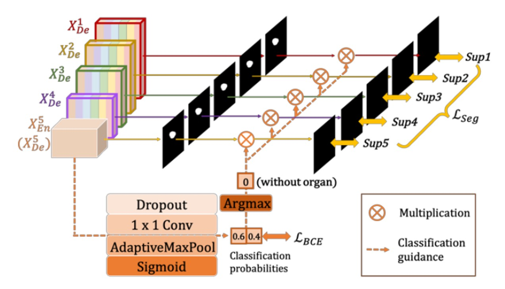
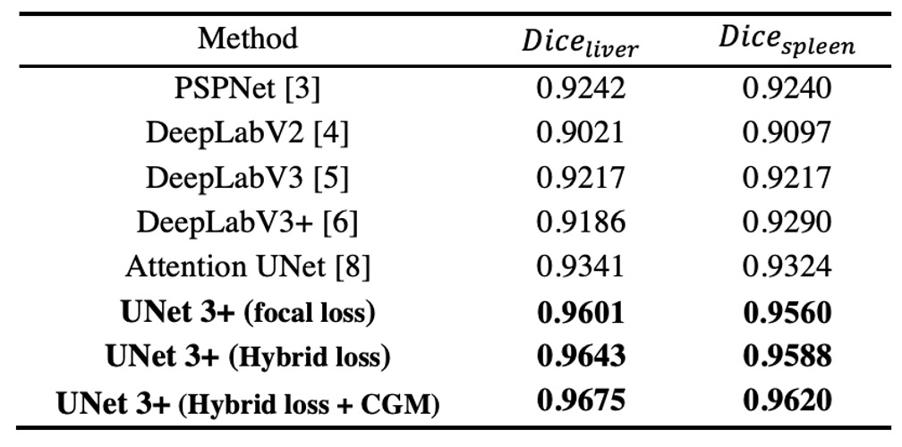
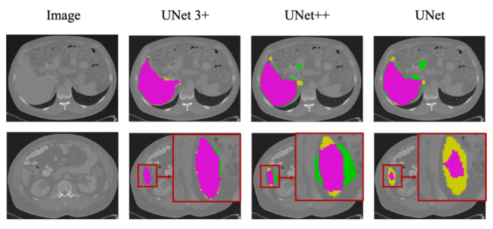

## 變更設計 UNet++

[**UNet 3+: A Full-Scale Connected UNet for Medical Image Segmentation**](https://arxiv.org/abs/2004.08790)

---

這也是一篇醫學領域的論文，目標也是針對醫學影像進行分割。

作者找到想法來改進 UNet++ 的結構，但是取名為 UNet+++ 顯然是無法展現研究者的美感。

所以就改叫做 「UNet 3+」 吧！

## 定義問題

說到 U-Net，大家耳熟能詳，架構長這樣：

<figure style={{"width": "50%"}}>

</figure>

這個經典的架構，透過跳躍連接來結合高階語意與低階細節，已經在醫學影像分割等領域取得了顯著的成果。

但是有幾個問題，首先是多尺度特徵在逐步的下採樣與上採樣過程中可能會被稀釋，使得模型無法充分利用不同尺度的資訊來提升分割準確度；接著是傳統 UNet 的跳躍連接會將語意不匹配的高低層特徵直接融合，進而導致性能下降。

於是 UNet++ 透過嵌套與密集跳躍連接來減少這種語意落差，把整個架構改成這樣：

<figure style={{"width": "50%"}}>

</figure>

但是本篇論文的作者覺得這個架構存在過多冗餘的連接，效率不足！

我們應該可以換個連接方式。

## 解決問題

### 模型架構

<figure style={{"width": "50%"}}>

</figure>

這裡作者定義了 UNet 中的降採樣層為編碼器（encoder），上採樣層為解碼器（decoder）。在 UNet 3+ 中，作者重新設計了編碼器與解碼器之間的跳躍連接，使得多尺度特徵能更完整地被整合。

如上圖，每個解碼器層都會同時整合來自更小尺度的編碼器特徵、同尺度的編碼器特徵以及更大尺度的解碼器特徵，並進行特徵聚合。

在同一個解碼器層收集到這五種相同空間解析度的特徵後，統一通道數，再將其串接並經過一層卷積 + BN + ReLU 以完成特徵聚合，最後直接輸出一個分割預測結果，並與真值做對應的監督，在論文中作者稱作「全尺度的深度監督」。

### 損失函數

為了強調器官邊界，作者引入了多尺度結構相似度（Multi-scale Structural Similarity，MS-SSIM）作為其中一項損失函數。

直覺上，MS-SSIM 用來比較局部區塊（patch）的相似度，若在邊界處的分割結果與真值有較大差異，MS-SSIM 會得到較高的分數，在訓練時會給予較大的懲罰。

數學式如下：

$$
\ell_{\text{ms-ssim}}(p,g)
= 1 - \prod_{s=1}^S
\Biggl(
  \frac{2\mu_p^s \mu_g^s + c_1}{(\mu_p^s)^2 + (\mu_g^s)^2 + c_1}
\Biggr)^{\alpha_s}
\Biggl(
  \frac{2\sigma_{pg}^s + c_2}{(\sigma_p^s)^2 + (\sigma_g^s)^2 + c_2}
\Biggr)^{\beta_s}
$$

- $p$ 與 $g$ 分別是分割結果與真值；$p$ 和 $g$ 的局部區塊大小為 $N \times N$。
- $\mu_p^s, \mu_g^s$ 表示第 $s$ 層尺度下 $p$ 與 $g$ 的均值，$\sigma_p^s, \sigma_g^s$ 表示標準差，$\sigma_{pg}^s$ 是兩者的共變量。
- $\alpha_s, \beta_s$ 用來控制不同尺度下亮度與對比度（或相似度衡量）的權重；$c_1=0.01^2, c_2=0.03^2$ 則是避免分母為零的平滑項。
- 實驗中使用 5 層尺度 (S=5)。

MS-SSIM 數值愈大，表示愈相似，對應的損失函數則愈小。

作者將 MS-SSIM loss、Focal loss 與 IoU loss 結合，得到三層級 (pixel-level, patch-level, map-level) 的混合損失：

$$
\ell_{\text{seg}}
= \ell_{\text{focal}}
+ \ell_{\text{ms-ssim}}
+ \ell_{\text{iou}}
$$

這種組合可以同時兼顧「像素級錯誤」、「局部區域的結構相似度」以及「整張影像的區域重疊率」，從而達到更好的分割表現。

### Classification-guided Module (CGM)

<figure style={{"width": "80%"}}>

</figure>

在常見的醫學影像分割中，若輸入影像根本沒有該器官，卻可能出現「假陽性」的錯誤分割。

為了避免這種情形，作者提出透過「額外的分類任務」來指導分割模型：先判斷影像中是否含有該器官，若判斷為「不包含」，則最終輸出應該是空白的分割結果；若為「包含」，則才保留分割結果。

具體做法如上圖所示，首先將編碼器最後一層 $E^i_5$（最深層，具備最強的語意資訊）接上一個簡易的分類網路，透過 dropout、卷積、max pooling，再經過 sigmoid 輸出一個大小為 2 的向量（代表「有器官 / 無器官」的機率）。

最後，在推論階段使用 argmax 取得二元分類結果，得到一個單一的 0 或 1，這個 0/1 的結果再與解碼器各層輸出的分割圖做相乘，若分類結果為 0（無器官），則分割結果被清空；若為 1（有器官），則保留原分割圖。

### 實驗設定

作者選擇了兩個器官進行驗證：肝臟 (liver) 與脾臟 (spleen)。

研究中使用常見且具有公認挑戰度的 LiTS 肝臟分割資料集，以及通過醫院倫理審查的脾臟內部資料集，充分考量了「器官大小、形狀差異」及「不同患者之間的個體差異」等實際情境。

- **肝臟資料集 (LiTS 2017 Challenge)**
  - 一共 131 組對比增強（contrast-enhanced）的 3D 腹部 CT 掃描。
  - 分為 103 組用於訓練，28 組用於測試。
- **脾臟資料集（醫院取得，通過倫理審查）**
  - 一共 49 組 CT 掃描（40 組訓練，9 組測試）。

為了加速訓練，輸入圖片採用 3 個通道：

- **當前的 CT 切片**
- **上一層切片**
- **下一層切片**

這樣能讓網路同時接收上下相鄰切片的上下文資訊，有利於分割器官邊界。此外，作者將圖片裁切成 $320 \times 320$ 的大小。

評估指標採用 **Dice coefficient** 衡量分割品質，並對每個 3D 體 (volume) 做計算。

## 討論

### 和 UNet, UNet++ 的比較

作者先將 **UNet 3+** 與經典模型 **UNet** 以及改良模型 **UNet++** 進行實驗比較。這些比較皆採用 **focal loss** 作為損失函式，並基於 VGG-16 與 ResNet-101 兩種骨幹網路進行測試。

上表為作者在肝臟與脾臟資料集上的實驗結果，可以看到：

- UNet 3+（無深度監督）就已經在平均準確度上超越 UNet 與 UNet++，提升約 2.7（對 VGG-16）與 1.6（對 ResNet-101）個百分點（平均於兩個器官資料集）。
- 若再加入多尺度深度監督（即 UNet 3+ 的完整版本），在處理不同尺寸器官（如肝臟與脾臟）時，可額外再提升約 0.4 個百分點。

結果顯示，透過多尺度特徵的充分利用與深度監督機制，UNet 3+ 能在參數量更精簡的前提下，提升分割表現。

### 和 SoTA 的比較

<figure style={{"width": "70%"}}>

</figure>

作者將 **ResNet-101 為骨幹** 的 UNet 3+ 與多個先進方法作比較，所有方法在測試時皆僅依靠「單一模型」且「不使用任何後處理」技巧。

上表結果顯示，混合損失函式（包含 pixel、patch、map 等不同階層的優化）能顯著提昇分割表現；特別是 **patch-level 的 MS-SSIM loss** 能對邊界給予較高權重，因而「邊界感知 (boundary-aware)」效果更好。

此外，CGM 可有效避免在複雜背景區域的錯誤分割，因為若模型判斷該張影像並沒有器官，即可直接清除假陽性。

最終，UNet 3+ 在肝臟分割（Dice = 0.9675）與脾臟分割（Dice = 0.9620）上皆取得最優成績，相較於第二名方法分別高出 0.0334 與 0.0296。

### 可視化結果

<figure style={{"width": "80%"}}>

</figure>
<figurecaption>粉紫色區塊為 TP；黃色區塊為 FN；綠色區塊為 FP</figurecaption>

---

上圖展示基於 ResNet-101 的 UNet、UNet++ 與 UNet 3+（多尺度深度監督）在肝臟資料集的分割結果。

觀察可知，UNet 3+ 不僅在器官的定位上更為準確，且在邊界處理上表現更佳，邊界較為連續、平滑。即使遇到較小的器官組織或局部細節，也能維持良好的分割一致性。

## 結論

這篇論文很容易閱讀，作者就是做了幾件事情：

1. **重新設計跳躍連接**：將多尺度特徵完整融合，並在解碼器層進行深度監督。
2. **引入 MS-SSIM 損失**：強調局部區域的結構相似度，有利於邊界感知。
3. **CGM 模組**：透過額外的分類任務來指導分割模型，避免假陽性。

這些改進使得 UNet 3+ 在肝臟與脾臟分割上取得了最佳成績，並且相較於其他先進方法擁有更少的參數量與更好的邊界一致性。
