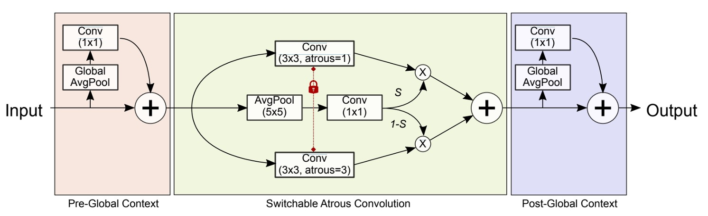

## 遞歸金字塔

[**DetectoRS: Detecting Objects with Recursive Feature Pyramid and Switchable Atrous Convolution**](https://arxiv.org/abs/2006.02334)

---

單純的研究 FPN 架構似乎已經走到了盡頭。

但是 Google Research 還是想在這個議題上面做一些嘗試，或許可以整合 Backbone 和 Neck 的設計，找到新的設計方向？

## 定義問題

過去主要的成果像是 PANet、BiFPN、NAS-FPN 等等，都是在 FPN 的基礎上進行改進，並沒有破壞金字塔的基礎結構。

但是特徵融合的問題並沒有解決。（因為評估資料集的表現還沒有達到飽和。）

我們還是需要更豐富的特徵，才有機會可以在評估資料集上面達到新的表現。

:::tip
如果你對過去研究有興趣，可以參考我們過去的文章：

- [**[18.03] PANet: 給我一條捷徑**](../1803-panet/index.md)
- [**[19.04] NAS-FPN: 有錢就是任性**](../1904-nasfpn/index.md)
- [**[19.11] EfficientDet: BiFPN 才是本體**](../1911-bifpn/index.md)
  :::

## 解決問題

### 遞歸特徵金字塔

<div align="center">
<figure style={{"width": "90%"}}>

</figure>
</div>

遞歸特徵金字塔，原文為 Recursive Feature Pyramid（RFP），是作者在本篇論文中提出的新型設計方式。其中 RFP 中的 R 表示的是 Recursive，其代表的意思就是將 FPN 的輸出「再次」送回到骨幹網路中。

如上圖，(a) 的部分是傳統的 FPN 架構，而 (b) 的部分則是作者提出的 RFP 架構。當骨幹網路接收到回饋特徵後，會重新提取並融合更豐富的資訊，最後再走一次 FPN 的流程，藉此達到「多次思考、多次修正」的效果。

我們可以回想一下之前 BiFPN 的設計概念：串接多層特徵金字塔，將多尺度的資訊進行融合，這裡目標是訓練一個「強壯的 Neck」；而 RFP 則是將特徵圖送回骨幹網路，所以這裡目標的是訓練一個「強壯的 Backbone」。也就是說，BiFPN 更著重於後端特徵融合的強化，RFP 則著重於讓骨幹有多次「重新看」影像的機會，進一步提升整體特徵表示能力。

最後，上圖 (c) 的部分則展示了最後串接的方式，也就是將第 N 次遞歸的特徵圖與最後的預測頭進行殘差連接，這是為了在多層的遞歸過程中，能順利傳遞梯度訊號並維持特徵的穩定性。

### 空洞卷積

再繼續下一個章節之前，先來補充一點前置知識：什麼是空洞卷積？

空洞卷積（Atrous Convolution）是一種在卷積核內插入空洞（dilation holes）的技術，目的是在不增加額外參數和計算量的情況下擴大感受野。這使得模型能夠同時關注「局部細節」和「全域資訊」，在語意分割、物件偵測等任務中特別有效。

:::tip
在 DeepLab 系列的研究中，空洞卷積被廣泛應用於特徵提取。
:::

在標準卷積中，卷積核的範圍受限於其大小，無法一次性捕捉大範圍資訊。雖然可以透過 堆疊多層卷積來擴大感受野，但這會顯著增加計算成本。空洞卷積透過在卷積核內「插入間隔」，讓固定大小的卷積核能夠跳過某些像素，從而在不額外增加計算量的前提下擴展感受野。

我們畫個圖來看一下 3×3 卷積在不同空洞率（Atrous Rate）下的作用方式：

- **(a) 標準卷積（空洞率 = 1）**

  ```bash
  X  X  X
  X  X  X
  X  X  X
  ```

  - 卷積核覆蓋的範圍小，適合學習局部細節。

- **(b) 空洞卷積（空洞率 = 2）**

  ```bash
  X  -  X  -  X
  -  -  -  -  -
  X  -  X  -  X
  -  -  -  -  -
  X  -  X  -  X
  ```

  - 每個權重之間間隔 1 個像素（`-` 表示跳過的像素），感受野擴大一倍。

- **(c) 空洞卷積（空洞率 = 3）**

  ```bash
  X  -  -  X  -  -  X
  -  -  -  -  -  -  -
  -  -  -  -  -  -  -
  X  -  -  X  -  -  X
  -  -  -  -  -  -  -
  -  -  -  -  -  -  -
  X  -  -  X  -  -  X
  ```

  - 每個權重之間間隔 2 個像素，進一步擴展感受野。

透過調整空洞率 $r$，模型可以靈活地學習不同尺度的特徵，進一步提升語意理解能力。

### 可切換空洞卷積

可切換空洞卷積，原文為 Switchable Atrous Convolution（SAC），是作者在本篇論文中提出的另一個關鍵設計，目的是讓同一個卷積核可以在不同空洞率間「動態切換」。

SAC 的架構如下圖，包含三個主要部分：

<div align="center">
<figure style={{"width": "90%"}}>

</figure>
</div>

1. 前置的 **Global Context** 模組（左側 Pre-Global Context）
2. 中央的 **SAC 主體**
3. 後置的 **Global Context** 模組（右側 Post-Global Context）

先撇開 Global Context 的部分，我們來看看 SAC 主體的設計：

作者用 $\text{Conv}(x, w, r)$ 表示以權重 $w$ 和空洞率 $r$ 作用在輸入 $x$ 上的卷積運算，輸出記為 $y$。

若要將普通的 3×3 卷積轉換成 SAC，數學式如下表示：

$$
\underbrace{\text{Conv}(x,\, w,\, 1)}_{\text{原卷積}}
\;\;
\xrightarrow{\text{Convert to SAC}}
\;\;
$$

$$
S(x)\,\cdot\,\underbrace{\text{Conv}(x,\, w,\, 1)}_{\text{空洞率=1}}
\;+\;
\bigl[\,1 - S(x)\bigr]\;\cdot\;\underbrace{\text{Conv}\bigl(x,\; w + \Delta w,\; r\bigr)}_{\text{空洞率=r}}
$$

其中：

- $r$ 是 SAC 的空洞率超參數（實驗中預設 $r=3$）。
- $w$ 來自原本預訓練好的權重
- $w + \Delta w$ 則表示對應「空洞率 = $r$」的權重，其中 $\Delta w$ 是可學習參數，初始為 0。
- $S(x)$ 為「開關函式」，以像素為單位動態決定要偏好「普通卷積」還是「空洞率更大的卷積」。

:::tip
在論文中實作 $S(x)$ 的方式是，先對輸入 $x$ 做平均池化，再通過一個 1×1 卷積，最後再經過 Sigmoid 函式。這樣可以得到一個位置相依的注意力分佈，讓模型能夠根據空間位置動態調整感受野大小。
:::

如此一來，當 $S(x)$ 趨近 1 時，輸出較多來自空洞率 = 1 的卷積；反之，若 $S(x)$ 趨近 0，就會偏向空洞率 = $r$ 的卷積。由於 $S(x)$ 在訓練過程中可被更新，整個骨幹網路能對應不同空間位置動態調整感受野大小，以更好適應多尺度物件。

接著會遇到下個問題：

- **若將原卷積權重 $w$ 與空洞率 = $r$ 的權重獨立學習，會使預訓練權重無法充分利用，或是需要整個模型從頭訓練。**

為此，作者提出了「權重鎖定機制」，讓一個權重保持為 $w$，另一個權重則是 $w + \Delta w$，這樣既能保留預訓練權重的好處，又能讓 $\Delta w$ 在訓練過程中微調空洞率 = $r$ 的卷積行為。

---

最後，我們再回來看看 Global Context 模組的設計，SAC 主體前後各接了一個輕量級的「Global Context 模組」。

其做法與 SENet 類似，但作者做了兩項修改：

1. 僅使用一層 1×1 卷積，無額外非線性（例如 ReLU）。
2. 輸出的特徵與主幹特徵相加，而非像 SENet 透過 Sigmoid 後再相乘。

詳細過程還是一樣參考上圖，先對輸入做全局平均池化（Global AvgPool），再用 1×1 卷積縮放通道，最後把這些全域資訊加回到原始特徵圖上。

:::tip
沒看過 SENet 的讀者可以參考我們之前的文章：

- [**[17.09] SENet: 擠！用力擠！**](../../lightweight/1709-senet/index.md)
  :::

## 討論

這裡我們重點看一下 **RFP (Recursive Feature Pyramid)** 與 **SAC (Switchable Atrous Convolution)** 在實驗中的表現。

### RFP 與 SAC 的提升

<div align="center">
<figure style={{"width": "90%"}}>

</figure>
</div>

作者在 COCO 資料集上進行實驗，使用 **HTC + ResNet-50 + FPN** 作為基準模型，並分別加入 RFP 與 SAC，再將兩者合併，形成最終的 **DetectoRS** 模型。

實驗結果顯示，RFP 與 SAC 各自都能帶來超過 4% 的 AP 提升，而且同時對 bounding box 與 mask AP 都有顯著增益。雖然加入 RFP 與 SAC 後的推論速度略有下降，但並未「大幅」降低，仍維持在可接受範圍。

兩者結合後（即 DetectoRS），在評估資料集上取得 **49.0% box AP 與 42.1% mask AP**，推論速度約 3.9 fps，顯示整體效能與效率皆有兼顧。

:::tip
想知道 HTC 具體細節的讀者可以參考論文：

- [**[19.01] Hybrid Task Cascade for Instance Segmentation**](https://arxiv.org/abs/1901.07518)
  :::

### RFP 與 SAC 的消融

<div align="center">
<figure style={{"width": "70%"}}>

</figure>
</div>

首先看 RFP 的消融實驗：

- **RFP + sharing**：代表在 RFP 的重複（unrolled）過程中，骨幹各階段 (B1, B2) 共用相同權重。結果顯示若共用權重雖能帶來提升，但不及「不共享」那般顯著。
- **RFP - aspp**：拿掉在回饋連結中使用的 ASPP 模組。結果發現 ASPP 能提供更好多尺度資訊，若移除，性能下降。
- **RFP - fusion**：關閉融合模組 (Fusion Module)。一旦少了融合，就少了多輪遞歸特徵的整合，同樣造成性能降低。
- **RFP + 3X**：把 unrolled step $T$ 從 2 增加到 3，能再提升 **1.3%** box AP，意即「看更多次 (3 次)」確實能進一步增強特徵表達，不過伴隨較高的計算開銷。

---

接著是 SAC 的消融實驗：

- **SAC - DCN**：表示不使用 Deformable Convolution（單純的空洞卷積），對比加入 DCN 的版本，AP 較低。
- **SAC - DCN - global**：在不使用 DCN 的情況下，進一步移除 SAC 之前後的 Global Context 模組，導致 AP 再次降低。
- **SAC - DCN - locking**：移除 SAC 的「鎖定機制」，改為第二個空洞率卷積直接用 $\Delta w$ 而非 $w + \Delta w$。結果顯示 AP 下滑，證明「鎖定機制」在保留預訓練權重效果的同時又能學習差異是關鍵。
- **SAC - DCN + DS (dual-switch)**：嘗試用兩個獨立開關 S1(x) 與 S2(x) 取代原先的 「S(x)」 和 「1 - S(x)」 設計。結果並未帶來正向改善，顯示原本的一正一負設計更有效。

---

經過上述分析可知，RFP 與 SAC 在兼顧推論速度的情況下，能對 HTC 有顯著的性能提升，在 COCO 上取得極具競爭力的偵測與分割結果，驗證了其創新設計的有效性與可行性。

### 和其他方法的比較


上表的結果分成四大類：

1. 一階 (one-stage) 偵測器
2. 多階 (multi-stage) 偵測器
3. HTC
4. 作者的 DetectoRS 結果

同時也依照是否使用 **Test-Time Augmentation (TTA)** 分類列出，並在第三欄指出哪些模型採用了 TTA。

不同論文使用的 TTA 程式與規模並不相同，例如 CBNet 使用了較強的 TTA，可使 AP 從 50.7% 提升至 53.3%。DetectoRS 在 ResNeXt-101-32x4d 的 backbone 下，TTA 只能帶來 1.4% AP 的增幅。

整體結果顯示，在公平的測試條件下，DetectoRS 仍能在 bounding box 準確度上與其他先進方法比較，展現明顯優勢。

:::tip
**什麼是 TTA？**

TTA（Test-Time Augmentation） 就是「在測試時也對輸入資料做多樣化處理」，然後整合多次推論結果。這是一種常見的「以多換準」策略，可以在不改動訓練過程的情況下，改善模型在推論階段的準確度與穩定性，但也會付出更多的推論時間成本。
:::

:::info
論文中還有其他領域的實驗結果，例如實例分割和全景分割等，為了節省篇幅這裡就不一一列出，有興趣的讀者可以參考原文。
:::

## 結論

作者在本篇論文中提出了兩個核心概念：**遞歸特徵金字塔（RFP）** 與 **可切換空洞卷積（SAC）**，並將兩者結合成 **DetectoRS** 模型。

在「宏觀層面」，RFP 透過回饋機制，讓 FPN 的輸出重新注入 Backbone 的各個階段，實現更深入的特徵強化；而在「微觀層面」，SAC 則透過可切換的空洞卷積，使模型能夠靈活適應不同的感受野，提高特徵學習的多樣性。

就特徵融合的角度來看，將 Backbone 和 Neck 一起進行考慮的設計方式，或許也是未來的研究方向。
