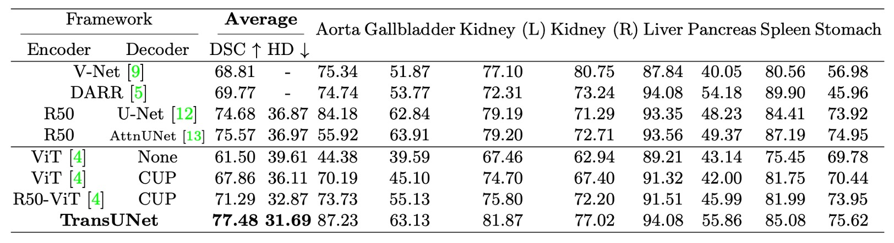

## 不能只有卷積

[**TransUNet: Transformers Make Strong Encoders for Medical Image Segmentation**](https://arxiv.org/abs/2102.04306)

---

ViT 是在 2020 年底提出來的，隨後相關應用就快速地擴展到大大小小的領域上。

這次來看一篇結合 U-Net 和 ViT 的論文。文章本身不困難，只要你略懂 U-Net 和 ViT 的概念，就能夠輕鬆上手。

:::tip
有需要前情提要的讀者，可以參考我們之前的文章：

- [**[15.05] U-Net: 融合的序幕**](../1505-unet/index.md)
- [**[20.10] ViT: 新世界拓荒者**](../../vision-transformers/2010-vit/index.md)
  :::

## 定義問題

在 CNN 中引入注意力機制不是什麼新鮮事，只是放到醫學影像分割領域，目前還很少見。

沒人做？那就是最大的問題！

作者希望能像 ViT 一樣，以「序列到序列」的思維，把影像切成許多 patches 後直接餵給 Transformer，並藉此學到影像的全域特徵。

然而，要是我們僅僅用簡單的上採樣，把 Transformer 產生的低階特徵拉回到原始大小（套用 Upsample 之類的），最後只會得到粗糙的分割結果。畢竟 Transformer 雖能擅長處理全域資訊，但對於局部邊界和細節並沒有做特別的強化。

在 ViT 之中，patch size 通常定在 16×16，對於影像分類已經夠用。但分割任務可是需要精確到每個像素的位置，也就是說我們必須縮小 patch size 到 8×8，甚至 4×4 才行。可是越小的 patch size，計算量就越高，導致 Transformer 的計算量爆表，根本無法訓練。

所以，我們得先處理「多尺度降採樣」以及「解析度」的議題。

## 解決問題

顯然地，直接套用 ViT 到影像分割任務上不可行，因此作者提出了混合式的架構，如下圖：

<figure style={{"width": "90%"}}>

</figure>

首先使用 CNN 進行特徵提取，就像一般我們常見的 Backbone 這樣，可以得到 1/2、1/4、1/8 和 1/16 解析度的特徵圖。

考量到 Transformer 計算複雜度，這裡只將 1/16 解析度的特徵圖，搭配 $1 \times 1$ 的 patch size，把影像轉換成序列，最後透過 Transformer 進行全局特徵提取。

當 Transformer 完成自注意力運算後，就能拿到較為「全域」的特徵表達，再把序列轉回 1/16 解析度的特徵圖，最後透過 CNN 的逐級上採樣（就像 U-Net 的解碼器）來融合其他解析度的特徵圖。這樣，我們既保留了全域資訊的優勢，又能透過跳躍連接 (skip connections) 來補足局部細節，最後得到較精細的分割結果。

:::tip
這裡我們省略 ViT 和 U-Net 的詳細執行細節，之前都講過了。
:::

## 討論

- 上表中的 CUP 指的是 Cascaded Upsampler，用來對比直接上採樣的效果。

---

在 **Synapse 多器官分割數據集** 上，作者與四種先前的 SOTA 方法進行比較，包含 V-Net、DARR、U-Net 和 AttnUNet。

此外，為了驗證 **CUP**與 **混合編碼器** 的效能，實驗也對比了以下變體：

- **ViT-None**：ViT 作為編碼器，使用簡單的上採樣進行解碼
- **ViT-CUP**：ViT 作為編碼器，搭配 CUP 解碼器
- **R50-ViT-CUP**：ResNet-50 + ViT 作為編碼器，搭配 CUP 解碼器
- **TransUNet**：R50-ViT-CUP + U-Net 風格的跳躍連接（Skip Connections）

為了公平比較，U-Net 和 AttnUNet 的編碼器也替換為 **ImageNet 預訓練的 ResNet-50**，以確保與 ViT-Hybrid 版本一致。

- **直接上採樣 vs. CUP**：參考上表中的 **ViT-None vs. ViT-CUP**，可以看到 Dice Similarity Coefficient（DSC）提升了 6.36%，Hausdorff 距離降低了 3.50 mm。這證明 CUP 解碼器比簡單上採樣更適合醫學影像分割，能更精細地恢復邊界細節。
- **ViT vs. R50-ViT**：參考上表中的 **ViT-CUP vs. R50-ViT-CUP**，DSC 再提升 3.43%，Hausdorff 距離進一步降低 3.24 mm。結論是純 ViT 雖能捕捉高階語意，但難以保留醫學影像的邊界與細節，而混合 CNN + ViT 編碼器能有效補足低階特徵的缺失。

最後是 TransUNet 對比於其他方法，可以看到 DSC 提升範圍在 1.91% ～ 8.67% 之間，相較於最佳 CNN 方法 R50-AttnUNet，TransUNet 仍能額外提升 1.91%；相比 R50-ViT-CUP，TransUNet 更是提升 6.19%。

作者分析這是由於單純的 CNN 雖然能夠捕捉豐富的局部細節，但缺乏全域視野；而純 ViT 雖然能夠捕捉全域語意，但難以保留醫學影像的邊界與細節。而 TransUNet 透過跳躍連接結合全域與局部資訊，成功超越所有 SOTA 方法，成為目前醫學影像分割的新標竿。

## 結論

TransUNet 透過 Transformer 強大的全域自注意力機制，結合 CNN 的低階細節表徵，成功突破傳統 FCN 架構的限制，在醫學影像分割上展現卓越表現。

透過 U 型混合架構，TransUNet 優於現有 CNN 為主的自注意力方法，為醫學影像分割提供了一種全新的解決方案，證明了 Transformer 在此領域的潛力與實用性。
