## Autoregressive Image Generation without Vector Quantization

[**Autoregressive Image Generation without Vector Quantization**](https://arxiv.org/abs/2406.11838)

[Github](https://github.com/LTH14/mar)

本篇同步發表於[nbsword's medium](https://medium.com/@nbswords/autoregressive-image-generation-without-vector-quantization-516b68b5acfa)

## Intro

當前的自迴歸圖片生成模型常使用vector quantized(VQ)將圖片離散化成一個個token來模擬自迴歸模型在NLP領域上的成功，但作者認為這種離散值空間對於自迴歸圖片生成模型並不是必要的，因此提出一種基於連續空間的自迴歸圖片生成模型，兼具更高的準度以及快速的推論時間。

## 背景知識
### Vector Quantization (VQ)
這是一種行之有年的向量搜尋加速技巧，作法是將一個特徵空間向量(embedding vector)切割成不同的群組，每個群組以一個代表向量來當做index，再透過一份包含所有代表向量索引的codebook來存取這群向量

<figure style={{"width": "60%"}}>
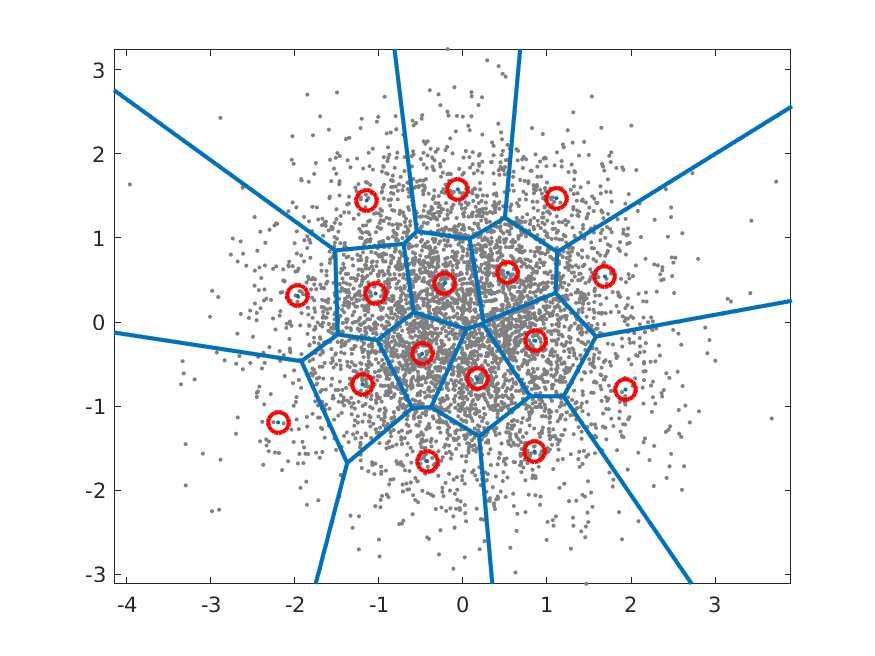
</figure>

詳細作法可參考 https://medium.com/@nbswords/survey-of-vector-space-search-26555890ca5e 或是 https://en.wikipedia.org/wiki/Vector_quantization

### Auto-regressive image generation

早期的Visual Autoregressive Model (VAR)是直接將圖片生成任務模擬成GPT-like的自迴歸文字生成，透過將圖片每一個像素都視為一個種類，模型的任務使用categorical cross entropy做多類別預測，如Google的[Image Transformer, 2018](https://arxiv.org/abs/1802.05751)和OpenAI的[ImageGPT, 2020](https://cdn.openai.com/papers/Generative_Pretraining_from_Pixels_V2.pdf)都屬於這種方法

而為了加速圖片生成的速度，現在的自迴歸圖片生成模型的常見作法是引入VQ做兩階段訓練，第一階段先在latent space中學習用來做圖片重建的codebook，第二階段則基於這個learned codebook去自迴歸地生成圖片
- 以[VQ-VAE, 2017](https://arxiv.org/abs/1711.00937)為例
    - Encode階段先透過是一個CNN擷取出圖片特徵，然後對feature map z_e 做VQ，得到每個群組的代表向量(紫色的向量, e_1~e_K)，接下來計算z_e中每一個特徵點跟代表向量之間的距離，取距離最近的代表向量index來取代掉他們得到q(z|x)，這個q正是離散的特徵。
    - Decode階段則使用從q映射回來的Z_q做圖片生成。

<figure style={{"width": "60%"}}>
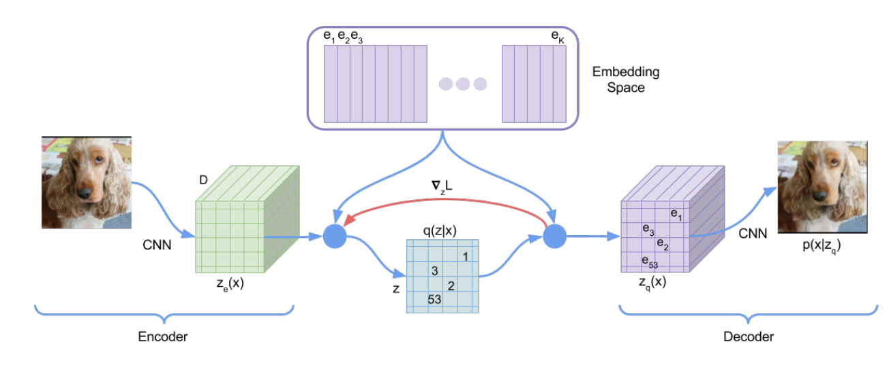
</figure>

自迴歸模型透過VQ來加速圖片生成聽起來很棒，但是，這樣的方法難道沒有什麼缺點嗎?

當然有，1. VQ編碼器很難訓練 2. VQ會降低重建出來的圖片品質
## Method
### 放棄VQ，擁抱Diffusion

既然diffusion model可以用來表現一張圖片中所有pixels或tokens的聯合機率分布，那為何不能用來表現每一個token的機率分布呢?
  - Diffusion可以將輸入的prompt/image作為條件從noise中產圖

<figure style={{"width": "60%"}}>
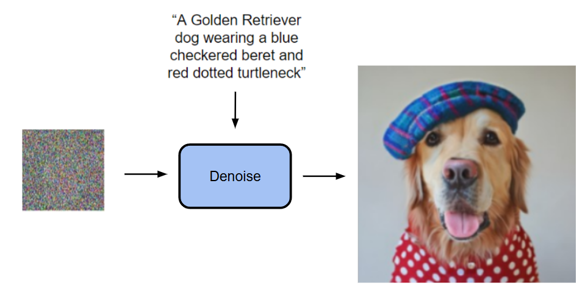
</figure>

  - 而現在是改為將一個transformer的輸出作為條件從noise中產圖 (這個transformer的輸入是什麼等等會講到)

<figure style={{"width": "60%"}}>
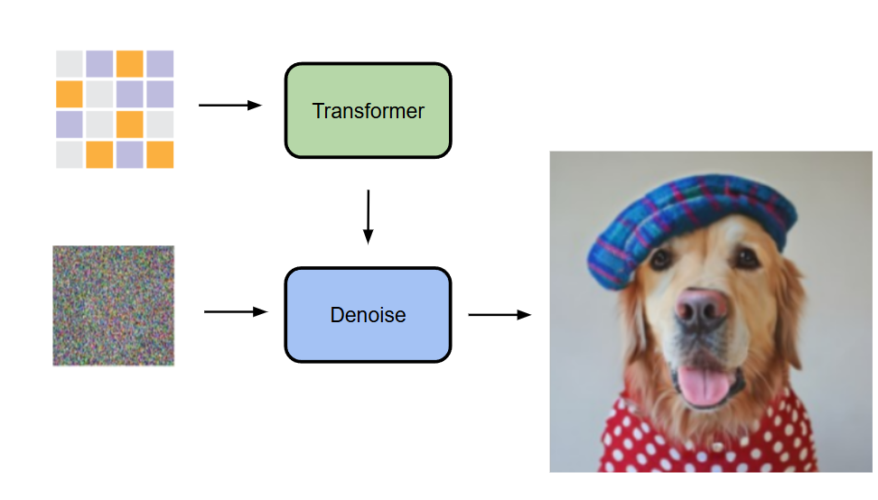
</figure>

他們的做法是自迴歸地去預測出每一個token的條件z，然後利用一個diffusion model(small MLP)做denosing來得到output x的機率分布p(x|z)

<figure style={{"width": "60%"}}>
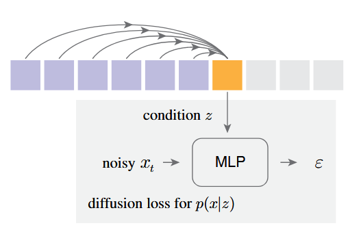
</figure>

提出 Diffusion Loss 來取代原本的 categorical cross entropy

<figure style={{"width": "60%"}}>
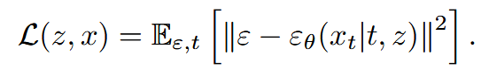
</figure>

<figure style={{"width": "60%"}}>
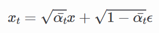
</figure>

- ε 是一個從(0, 1)常態分布中抽樣出來的noise sample
- εθ 是一個 small MLP，$ε_θ(x_t|t, z)$ 的意思是這個模型會基於t跟z作為生成條件，然後輸入x_t來得到noise vector ε_θ
    - t是noise schedule的 timestamp，z是由Transformer基於上下文產生出來的condition vector

最後，跟DDPM一樣，在推論階段，模型會透過reverse diffusion process來產生出圖片 (從x_t -> x_0)

<figure style={{"width": "60%"}}>
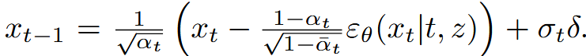
</figure>

除此之外，若讀者們有使用過diffusion model來做圖片生成肯定曾看到過一個超參數叫做溫度(temperature)，溫度越高表示越高的隨機性，溫度越低則隨機性越低，這是一個控制採樣隨機性的參數，在本作中採用溫度 $\tau$ * $\sigma_t \delta$ 來控制，這個方法出自[Diffusion Models Beat GANs on Image Synthesis](https://arxiv.org/abs/2105.05233)

仔細想就會發現，這是一個將VAE的條件生成以及DDPM的降噪結合在一起使用的方法，用VAE壓縮圖像特徵並用DDPM來生成圖片，非常精妙

<figure style={{"width": "60%"}}>

</figure>

### 融入 Autoregressive 和 Masked Generative Models 的概念
愷明作為[MAE(Masked Autoencoders Are Scalable Vision Learners), 2021](https://arxiv.org/abs/2111.06377)的作者，接下來想到的當然是將MAE的概念一起融入到模型當中
- 主要的流程參考MAE的後續作品[MaskGIT, 2022](https://arxiv.org/abs/2202.04200)和[MAGE, 2022](https://arxiv.org/abs/2211.09117)，兩者都是拿Transformer做Masked Autoregressive(MAR)，其中MaskGIT的貢獻是使用bidirectional transformer decoder去同時預測多個token而MAGE的貢獻是統一圖片表徵學習與圖片合成
- 在本作中同樣採用了MAE的雙向注意力機制，將mask token [m]放在中間層讓所有token能看見彼此，而不是只能看到前面的token，並且只對沒有被mask到的token計算loss
    - 請注意，這並不是一般認為的causal vs bidirectional attention，若想要深入理解請去閱讀MAE原始論文
    - 這樣做的好處是圖片生成的表現會變好，壞處是這會讓transformer的訓練和推論無法使用kv cache加速，但也由於可以同時預測多個token，這個方法並不會太慢

<figure style={{"width": "60%"}}>
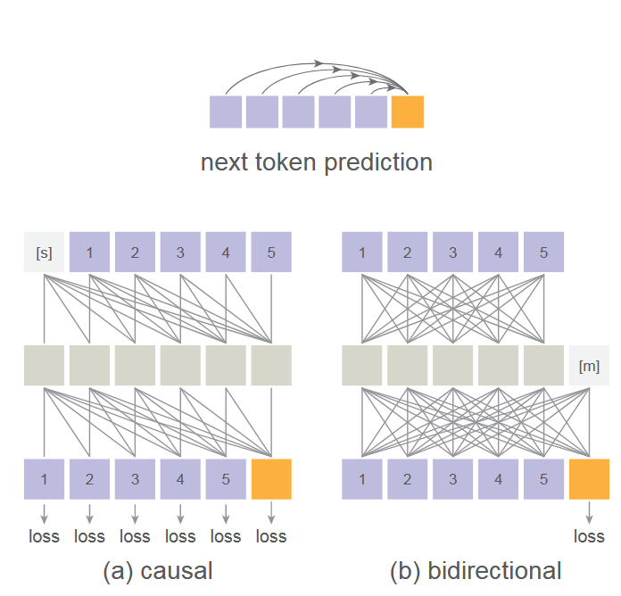
</figure>

- 下圖是一般順序的AR、隨機順序的AR(random masking one token)和他們使用的同時預測多個token的AR(random masking multiple token)的比較
    - 這裡就揭曉了前面那個transformer的輸入是一個masked image

<figure style={{"width": "60%"}}>
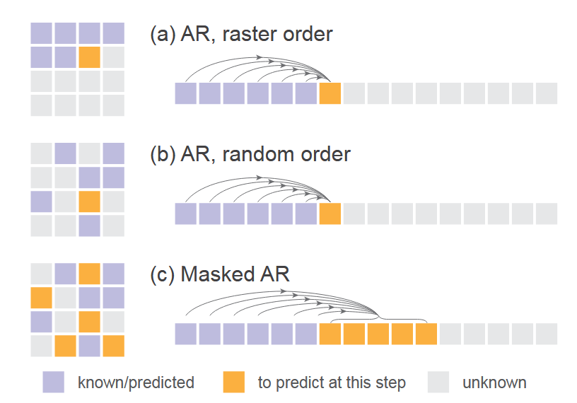
</figure>

## Implementation
- Diffusion Loss：consine形狀的noise schedule，訓練時DDPM有1000 step而推論則僅有100 step
- Denosing MLP(small MLP)：3層1024個channel的block，每一個block包含LayerNorm, linear layer， SiLU 激活函數並使用residual connection連接，實作上是使用AdaLN將transformer的輸出z加入到LayerNorm層當中
- Tokenizer：使用LDM提供的公開tokenizer，包括VQ-16和KL-16。其中VQ-16是基於VQ-GAN的量化模型，使用GAN loss和感知loss，KL-16則透過KL散度做regularization且不依賴VQ
- Transformer：使用 ViT 來接收 tokenizer 處理後的 token sequene，加上位置編碼和類別token [CLS]，然後通過32層1024個channel的transformer block
- Masked autoregressive models：在訓練階段使用 [0.7, 1.0] 的masking ratio，0.7代表隨機遮蔽掉70%的token，另外為了避免抽樣出來的序列太短，他們始終pad 64個[cls] token到其中。在推理階段會逐步將1.0的masking ratio降低到0，並使用cosine schedule來調整步數，預設是64步
- Baseline Autoregressive Model: casual attention的GPT模型，輸入有append一個[cls]，並且有使用kv cache以及溫度參數

## Experiments
模型實驗設定都是 AR/MAR-L (∼400M parameters), 400 epochs, ImageNet 256×256

### Diffusion Loss vs. Cross-entropy Loss
在所有AR/MAR的變體之下，使用Diff Loss的表現都比較好，其中AR的改進最少，越往下改進越多，MAR+bidirect+>1 preds的改進最多，可見Diff Loss對於MAR模型的重要性
- Diff Loss也有使用其他擴散模型也有的CFG(Classifier-Free Guidance)來提升生成效果
- Fréchet inception distance (FID) 是越低越好，Inception Score (IS)則是越高越好，兩個metrics都是在衡量生成的圖片品質

<figure style={{"width": "60%"}}>
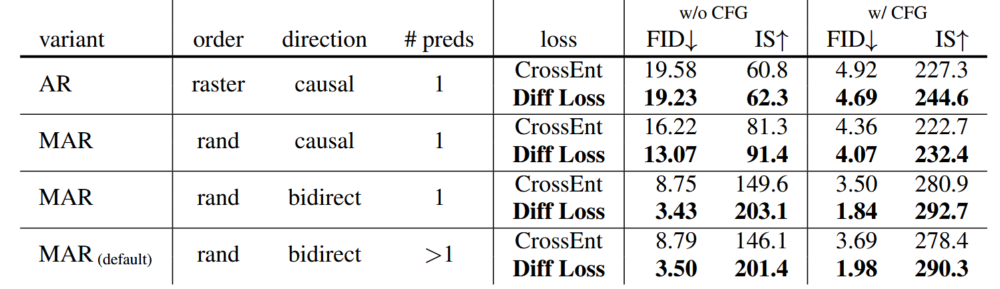
</figure>

### Tokenizers
實驗不同的tokenizers搭配Diff loss的效果，由於從離散空間脫離到了連續空間，tokenizer不再受限，Diff loss可以適用在連續/離散的tokenizer上
- VQ-16指的是將VQ-VAE中作VQ之前的連續值latent作為token，前面也有提過這裡的VQ-16跟KL-16都是使用LDM提供的，只是他們改為在ImageNet上訓練而非OpenImages上
- Consistency Decoder是一個非VQ的Tokenizer，來自[DALL·E 3](https://github.com/openai/consistencydecoder)
- reconstruction FID (rFID) 越低越好，用來評估tokenizer

<figure style={{"width": "60%"}}>
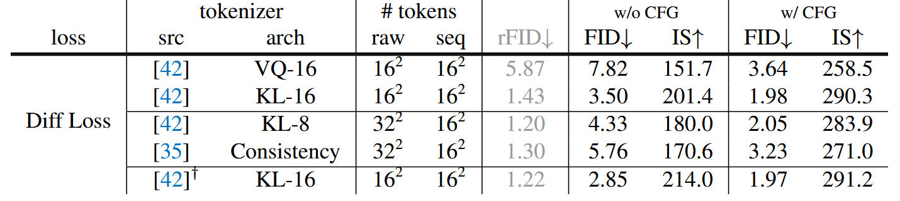
</figure>

結果顯示使用連續型的tokenizer如KL-16會比離散型的VQ-16表現好，另外也順便展示了一下能兼容在不同的tokenizer如Consistency Decoder上

### Denosing MLP
不同參數大小的MLP表現差異，width=1024的表現最好

<figure style={{"width": "60%"}}>
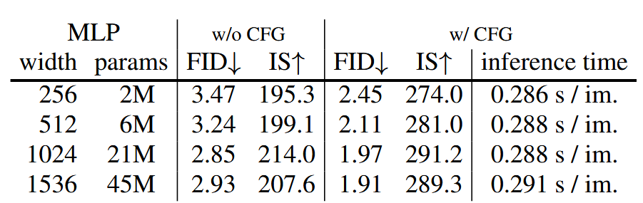
</figure>

### Temperature of Diffusion Loss
對Diff Loss來說溫度也很重要

<figure style={{"width": "60%"}}>
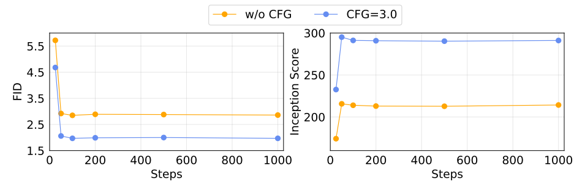
</figure>

### Speed/accuracy trade-off
由於無法使用kv cache，這個評估非常重要，這裡是用一個A100然後batch size=256來測試

<figure style={{"width": "60%"}}>

</figure>

- MAR: 每一個點代表不同的autoregressive step(8 to 128)
- DiT: 每一個點代表不同的diffusion steps(50, 75, 150, 250)，這裡使用的DiT-XL
- AR: 套用了kv cache

可見即使無法使用kv cache這個模型也有不差的推論速度，不過default設定(step=64)還是慢了不少

### System-level comparison
與其他模型的比較，最大的模型MAR-H才能獲得SOTA，但MAR-L表現也幾乎已經不錯

<figure style={{"width": "60%"}}>
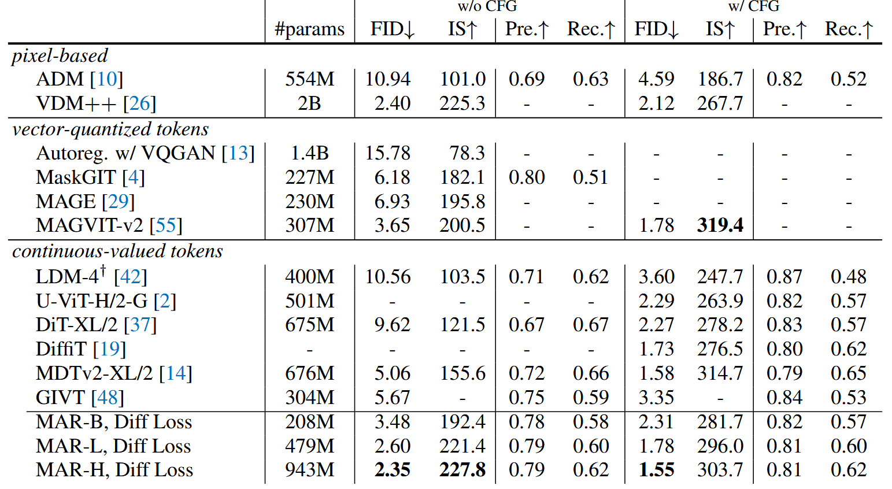
</figure>

## 結論
總的來說，本作打破了自迴歸圖片生成模型的舊有做法，以結合Diffusion和MAE開闢出新的方向，而且只使用了最簡單的DDPM來作展示，若改用更好的擴散模型肯定能獲得更好的結果，期待後續有更多衍生作品

最後放上一部份模型產生出來的圖

<figure style={{"width": "60%"}}>

</figure>

## Reference
https://zhouyifan.net/2024/07/27/20240717-ar-wo-vq/