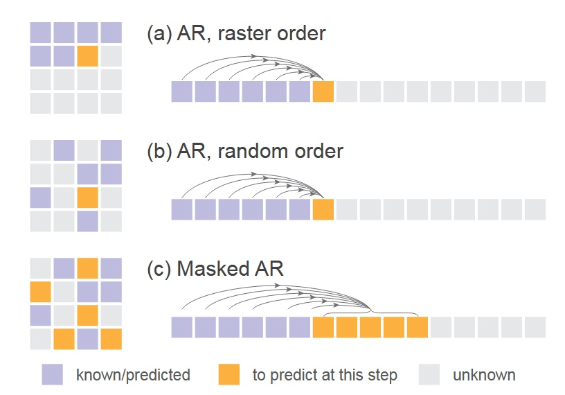
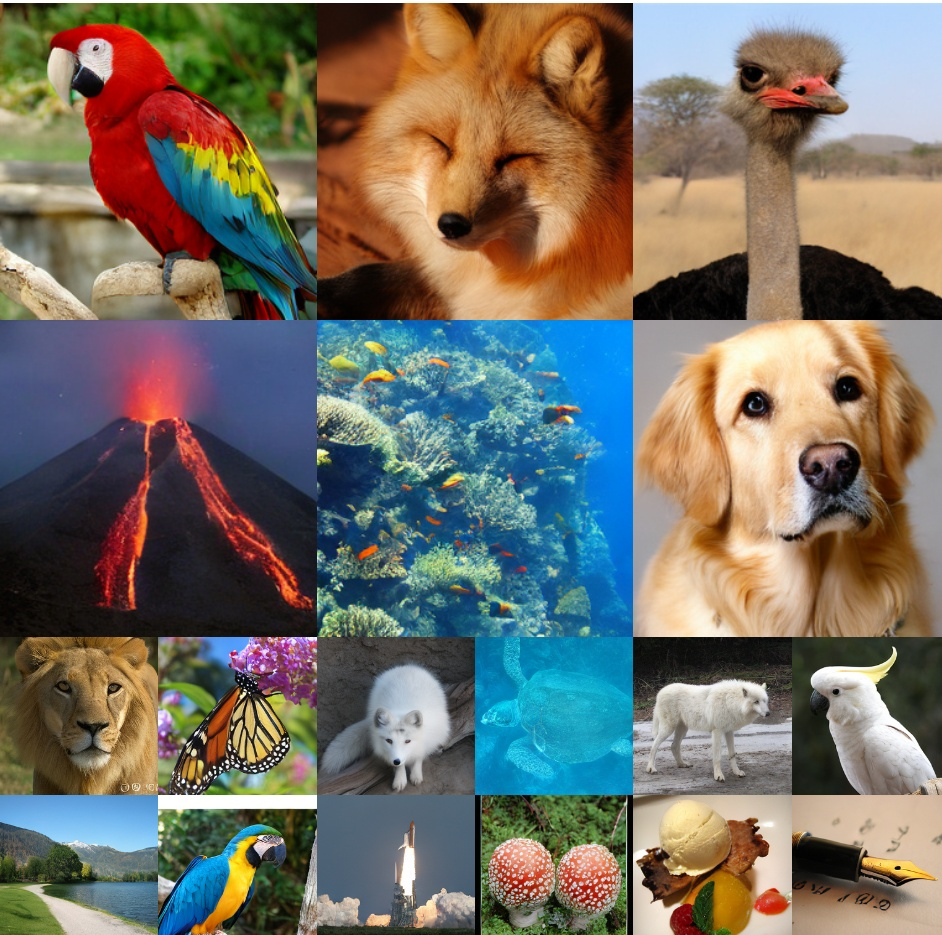

## 重鑄生成的秩序

[**Autoregressive Image Generation without Vector Quantization**](https://arxiv.org/abs/2406.11838)

---

:::info
本篇同步發表於 [**nbswords 的 Medium**](https://medium.com/@nbswords/autoregressive-image-generation-without-vector-quantization-516b68b5acfa)
:::

當前的自迴歸圖片生成模型常使用 vector quantized(VQ)將圖片離散化成一個個 token 來模擬自迴歸模型在 NLP 領域上的成功，但作者認為這種離散值空間對於自迴歸圖片生成模型並不是必要的，因此提出一種基於連續空間的自迴歸圖片生成模型，兼具更高的準度以及快速的推論時間。

## 背景知識

### Vector Quantization (VQ)

這是一種行之有年的向量搜尋加速技巧，作法是將一個特徵空間向量(embedding vector)切割成不同的群組，每個群組以一個代表向量來當做 index，再透過一份包含所有代表向量索引的 codebook 來存取這群向量。

<figure style={{"width": "60%"}}>

</figure>

詳細作法可參考 [Survey Of Vector Space Search](https://medium.com/@nbswords/survey-of-vector-space-search-26555890ca5e) 或是 [Vector quantization wiki](https://en.wikipedia.org/wiki/Vector_quantization)

### Auto-regressive image generation

早期的 Visual Autoregressive Model (VAR)是直接將圖片生成任務模擬成 GPT-like 的自迴歸文字生成，透過將圖片每一個像素都視為一個種類，模型的任務使用 categorical cross entropy 做多類別預測，如 Google 的[Image Transformer, 2018](https://arxiv.org/abs/1802.05751)和 OpenAI 的[ImageGPT, 2020](https://cdn.openai.com/papers/Generative_Pretraining_from_Pixels_V2.pdf)都屬於這種方法

而為了加速圖片生成的速度，現在的自迴歸圖片生成模型的常見作法是引入 VQ 做兩階段訓練，第一階段先在 latent space 中學習用來做圖片重建的 codebook，第二階段則基於這個 learned codebook 去自迴歸地生成圖片

- 以[VQ-VAE, 2017](https://arxiv.org/abs/1711.00937)為例
  - Encode 階段先透過是一個 CNN 擷取出圖片特徵，然後對 feature map $z_e$ 做 VQ，得到每個群組的代表向量(紫色的向量, $e_1$ ~ $e_K$)，接下來計算 $z_e$ 中每一個特徵點跟代表向量之間的距離，取距離最近的代表向量 index 來取代掉他們得到 $q(z|x)$，這個 $q$ 正是離散的特徵。
  - Decode 階段則使用從 $q$ 映射回來的 $Z_q$ 做圖片生成。

<figure style={{"width": "80%"}}>

</figure>

自迴歸模型透過 VQ 來加速圖片生成聽起來很棒，但是，這樣的方法難道沒有什麼缺點嗎?

當然有，1. VQ 編碼器很難訓練 2. VQ 會降低重建出來的圖片品質

## Method

### 放棄 VQ，擁抱 Diffusion

既然 diffusion model 可以用來表現一張圖片中所有 pixels 或 tokens 的聯合機率分布，那為何不能用來表現每一個 token 的機率分布呢?

- Diffusion 可以將輸入的 prompt/image 作為條件從 noise 中產圖

<figure style={{"width": "80%"}}>

</figure>

- 而現在是改為將一個 transformer 的輸出作為條件從 noise 中產圖 (這個 transformer 的輸入是什麼等等會講到)

<figure style={{"width": "80%"}}>

</figure>

他們的做法是自迴歸地去預測出每一個 token 的條件 z，然後利用一個 diffusion model(small MLP)做 denosing 來得到 output x 的機率分布 p(x|z)

<figure style={{"width": "60%"}}>

</figure>

提出 Diffusion Loss 來取代原本的 categorical cross entropy

<figure style={{"width": "60%"}}>

</figure>

<figure style={{"width": "60%"}}>

</figure>

- ε 是一個從(0, 1)常態分布中抽樣出來的noise sample
- εθ 是一個 small MLP，$ε_θ(x_t|t, z)$ 的意思是這個模型會基於t跟z作為生成條件，然後輸入x_t來得到noise vector ε_θ
    - t是noise schedule的 timestamp，z是由Transformer基於上下文產生出來的condition vector

最後，跟 DDPM 一樣，在推論階段，模型會透過 reverse diffusion process 來產生出圖片 (從 x_t -> x_0)

<figure style={{"width": "60%"}}>

</figure>

除此之外，若讀者們有使用過 diffusion model 來做圖片生成肯定曾看到過一個超參數叫做溫度(temperature)，溫度越高表示有越高的隨機性，溫度越低則隨機性越低，這是一個控制採樣隨機性的參數，在本作中採用溫度 $\tau$ \* $\sigma_t \delta$ 來控制，這個方法出自[Diffusion Models Beat GANs on Image Synthesis](https://arxiv.org/abs/2105.05233)

仔細想就會發現，這是一個將 VAE 的條件生成以及 DDPM 的降噪結合在一起使用的方法，用 VAE 壓縮圖像特徵並用 DDPM 來生成圖片，非常精妙

<figure style={{"width": "80%"}}>

</figure>

### 融入 Autoregressive 和 Masked Generative Models 的概念

愷明作為[MAE(Masked Autoencoders Are Scalable Vision Learners), 2021](https://arxiv.org/abs/2111.06377)的作者，接下來想到的當然是將 MAE 的概念一起融入到模型當中

- 主要的流程參考 MAE 的後續作品[MaskGIT, 2022](https://arxiv.org/abs/2202.04200)和[MAGE, 2022](https://arxiv.org/abs/2211.09117)，兩者都是拿 Transformer 做 Masked Autoregressive(MAR)，其中 MaskGIT 的貢獻是使用 bidirectional transformer decoder 去同時預測多個 token 而 MAGE 的貢獻是統一圖片表徵學習與圖片合成
- 在本作中同樣採用了 MAE 的雙向注意力機制，將 mask token [m]放在中間層讓所有 token 能看見彼此，而不是只能看到前面的 token，並且只對沒有被 mask 到的 token 計算 loss - 請注意，這並不是一般認為的 causal vs bidirectional attention，若想要深入理解請去閱讀 MAE 原始論文 - 這樣做的好處是圖片生成的表現會變好，壞處是這會讓 transformer 的訓練和推論無法使用 kv cache 加速，但也由於可以同時預測多個 token，這個方法並不會太慢

<figure style={{"width": "60%"}}>

</figure>

- 下圖是一般順序的 AR、隨機順序的 AR(random masking one token)和他們使用的同時預測多個 token 的 AR(random masking multiple token)的比較 - 這裡就揭曉了前面那個 transformer 的輸入是一個 masked image

<figure style={{"width": "60%"}}>

</figure>

## Implementation

- Diffusion Loss：cosine 形狀的 noise schedule，訓練時 DDPM 有 1000 step 而推論則僅有 100 step
- Denoising MLP(small MLP)：3 層 1024 個 channel 的 block，每一個 block 包含 LayerNorm, linear layer， SiLU 激活函數並使用 residual connection 連接，實作上是使用 AdaLN 將 transformer 的輸出 z 加入到 LayerNorm 層當中
- Tokenizer：使用 LDM 提供的公開 tokenizer，包括 VQ-16 和 KL-16。其中 VQ-16 是基於 VQ-GAN 的量化模型，使用 GAN loss 和感知 loss，KL-16 則透過 KL 散度做 regularization 且不依賴 VQ
- Transformer：使用 ViT 來接收 tokenizer 處理後的 token sequence，加上位置編碼和類別 token [CLS]，然後通過 32 層 1024 個 channel 的 transformer block
- Masked autoregressive models：在訓練階段使用 [0.7, 1.0] 的 masking ratio，0.7 代表隨機遮蔽掉 70%的 token，另外為了避免抽樣出來的序列太短，他們始終 pad 64 個[cls] token 到其中。在推理階段會逐步將 1.0 的 masking ratio 降低到 0，並使用 cosine schedule 來調整步數，預設是 64 步
- Baseline Autoregressive Model: causal attention 的 GPT 模型，輸入有 append 一個[cls]，並且有使用 kv cache 以及溫度參數

## Experiments

模型實驗設定都是 AR/MAR-L (∼400M parameters), 400 epochs, ImageNet 256×256

### Diffusion Loss vs. Cross-entropy Loss

在所有 AR/MAR 的變體之下，使用 Diff Loss 的表現都比較好，其中 AR 的改進最少，越往下改進越多，MAR+bidirect+>1 preds 的改進最多，可見 Diff Loss 對於 MAR 模型的重要性

- Diff Loss 也有使用其他擴散模型也有的 CFG(Classifier-Free Guidance)來提升生成效果
- Fréchet inception distance (FID) 是越低越好，Inception Score (IS)則是越高越好，兩個 metrics 都是在衡量生成的圖片品質

<figure style={{"width": "80%"}}>

</figure>

### Tokenizers

實驗不同的 tokenizers 搭配 Diff loss 的效果，由於從離散空間脫離到了連續空間，tokenizer 不再受限，Diff loss 可以適用在連續/離散的 tokenizer 上

- VQ-16 指的是將 VQ-VAE 中作 VQ 之前的連續值 latent 作為 token，前面也有提過這裡的 VQ-16 跟 KL-16 都是使用 LDM 提供的，只是他們改為在 ImageNet 上訓練而非 OpenImages 上
- Consistency Decoder 是一個非 VQ 的 Tokenizer，來自[DALL·E 3](https://github.com/openai/consistencydecoder)
- reconstruction FID (rFID) 越低越好，用來評估 tokenizer

<figure style={{"width": "80%"}}>

</figure>

結果顯示使用連續型的 tokenizer 如 KL-16 會比離散型的 VQ-16 表現好，另外也順便展示了一下能兼容在不同的 tokenizer 如 Consistency Decoder 上

### Denosing MLP

不同參數大小的 MLP 表現差異，width=1024 的表現最好

<figure style={{"width": "60%"}}>

</figure>

### Sampling steps of Diffusion Loss

不同 Diffusion steps 對於生成品質的影響，steps=100 就可以獲得很好的效果

<figure style={{"width": "80%"}}>

</figure>

### Temperature of Diffusion Loss

對 Diff Loss 來說溫度也很重要

<figure style={{"width": "60%"}}>

</figure>

### Speed/accuracy trade-off

由於無法使用 kv cache，這個評估非常重要，這裡是用一個 A100 然後 batch size=256 來測試

<figure style={{"width": "60%"}}>

</figure>

- MAR: 每一個點代表不同的 autoregressive step(8 to 128)
- DiT: 每一個點代表不同的 diffusion steps(50, 75, 150, 250)，這裡使用的 DiT-XL
- AR: 套用了 kv cache

可見即使無法使用 kv cache 這個模型也有不差的推論速度，不過 default 設定(step=64)還是慢了不少

### System-level comparison

與其他模型的比較，最大的模型 MAR-H 才能獲得最好的表現，但 MAR-L 表現也已經不錯

<figure style={{"width": "80%"}}>

</figure>

## 結論

總的來說，本作打破了自迴歸圖片生成模型的舊有做法，以結合 Diffusion 和 MAE 開闢出新的方向，而且只使用了最簡單的 DDPM 來作展示，若改用更好的擴散模型肯定能獲得更好的結果，期待後續有更多衍生作品

最後放上一部份模型產生出來的圖

<figure style={{"width": "60%"}}>

</figure>

## Reference

https://zhouyifan.net/2024/07/27/20240717-ar-wo-vq/
