## 會生成圖，自然就會看圖

[**Image Generators are Generalist Vision Learners**](https://arxiv.org/abs/2604.20329)

---

:::info
Project page: [**vision-banana.github.io**](https://vision-banana.github.io)
:::

在 LLM 領域，我們已經習慣了使用 generative pretraining 出來的模型，會自然而然地獲得語言理解、推理、coding 等下游能力，這些能力並沒有特別被訓練，而是從預測下一個 token 的目標中 emergent 出來的。

那麼同樣的故事是否能套用在視覺領域? 也就是說，當一個 model 被訓練去**生成**高品質的圖片時，它是否也順便學會了如何**理解**圖片?

## Intro

- 過去的相關工作其實已經有觀察到 generative vision pretraining 的 scaling behavior，但是效果一直追不上 contrastive learning 或是 masked autoencoding 這類非生成式的方法
- 本作的主張是: 只要透過適當的 instruction tuning，一個 SOTA 的 image generator (這裡是 Nano Banana Pro) 就可以變成一個 generalist vision model，並且在各種 2D/3D 理解任務上達到或超越專門模型 (specialist model) 的水準
    - 這個 instruction-tuned 的模型叫做 **Vision Banana**
    - 關鍵的設計是把所有 vision task 的輸出格式都統一成 **RGB image**，因為這樣才能直接利用原本 image generator 已有的能力，而不需要去改架構或加新的 head

下面兩張圖展示了 Vision Banana 各個領域的能力上的 benchmark 結果，可見除了 Instance segmentation 以及 Image edit 以外他都達到了 SOTA，接下來我們來細看他如何使用圖片生成模型來做這些視覺任務。

<div align="center">
<figure style={{"width": "80%"}}>
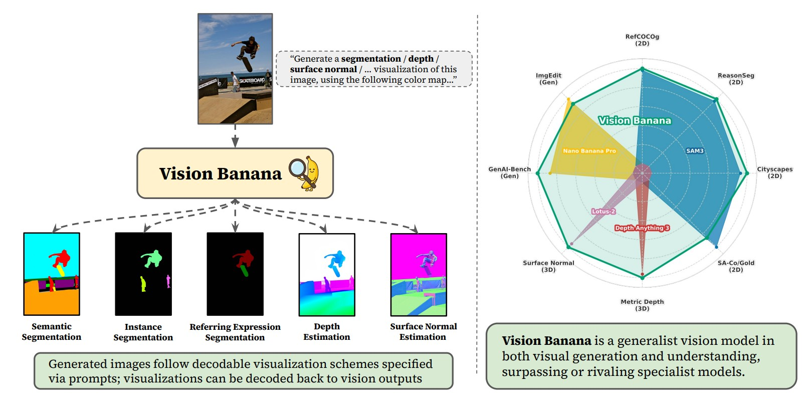
</figure>
</div>

<div align="center">
<figure style={{"width": "80%"}}>
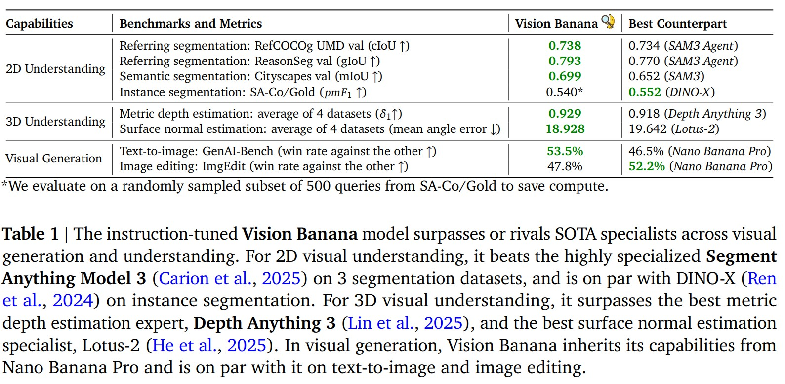
</figure>
</div>

## Method

### 為什麼要做 Instruction Tuning?

其實過去的研究就已經觀察到，現代的 image generator 在 zero-shot 的情況下，**就有能力**生成看起來像 segmentation mask 或是 depth map 的圖。但是問題在於這些生成出來的圖**沒辦法被精確地 decode 回實際的 vision output**，所以也就沒辦法在 benchmarks 上跟其他模型比較。

舉個例子，你叫模型生成 "depth map"，它可能會給你一個很像 depth map 的圖，但是顏色跟距離的對應關係模糊，根本沒辦法量化評估。

所以 instruction tuning 的目的就是: **教會模型按照 prompt 中指定的格式輸出可逆的 visualization**。例如:

> "Segment the skateboard category in pure yellow (\<255, 255, 0\>)"

模型生成完圖之後，我們就可以透過 cluster 出 (255, 255, 0) 這個顏色附近的 pixels 來得到 skateboard 的 mask。

### Instruction Tuning Recipe

- 把 vision task data **以非常低的比例**混進 Nano Banana Pro 原本的訓練資料中，做一個 lightweight 的 finetune
    - 這個低比例非常重要，可以確保模型不會忘記原本的 generation 能力，也就是論文中再三強調的「保留 generative prior」
- 訓練資料的來源:
    - 2D 任務: 用內部模型對從網路爬來的圖片做 annotation
    - 3D 任務: 用 rendering engine 產生 synthetic data
- **不使用任何 evaluation benchmark 的 training split**，所以全部都是 zero-shot transfer 的設定

## 2D Semantic Understanding

### Semantic Segmentation

就是傳統的「把每個 pixel 分類到一個類別」任務。Vision Banana 的做法很直接，就是在 prompt 中指定每個類別對應的顏色，然後讓模型生成這張 mask 圖:

- `"Generate a semantic segmentation visualization image, using this color mapping: {"cat": "red", "lock": "pink", "exit sign": "light purple", "background": "yellow"}."`

prompt 的寫法非常彈性，可以用 hex code (`#80C000`)、RGB tuple (`<255, 165, 0>`)，甚至是用自然語言描述 (`"light purple"`)，模型都能理解。

結果他們在 Cityscapes 上的 mIoU 是 0.699，**贏過 SAM 3 的 0.652** (4.7 個百分點)，是 zero-shot 模型中最好的，跟 closed-set 的 SegMan (mIoU=0.842) 也只差了 14 個百分點。

<div align="center">
<figure style={{"width": "80%"}}>
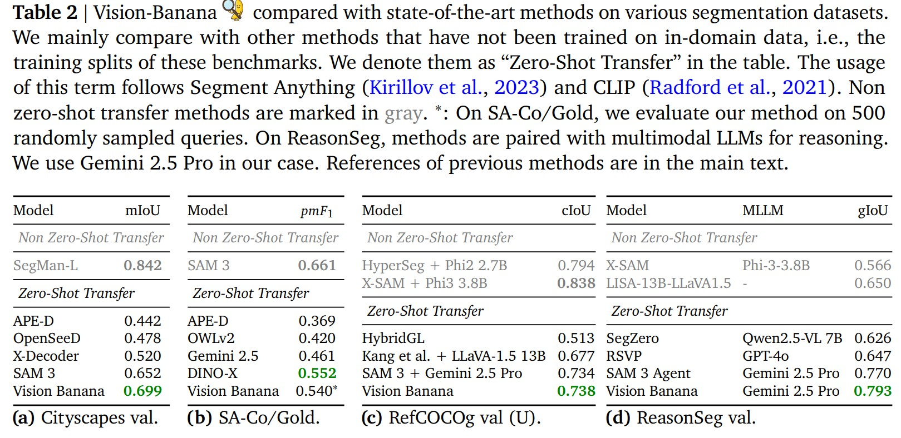
</figure>
</div>

下圖是 Vision Banana 做 semantic segmentation 的範例圖。

<div align="center">
<figure style={{"width": "60%"}}>
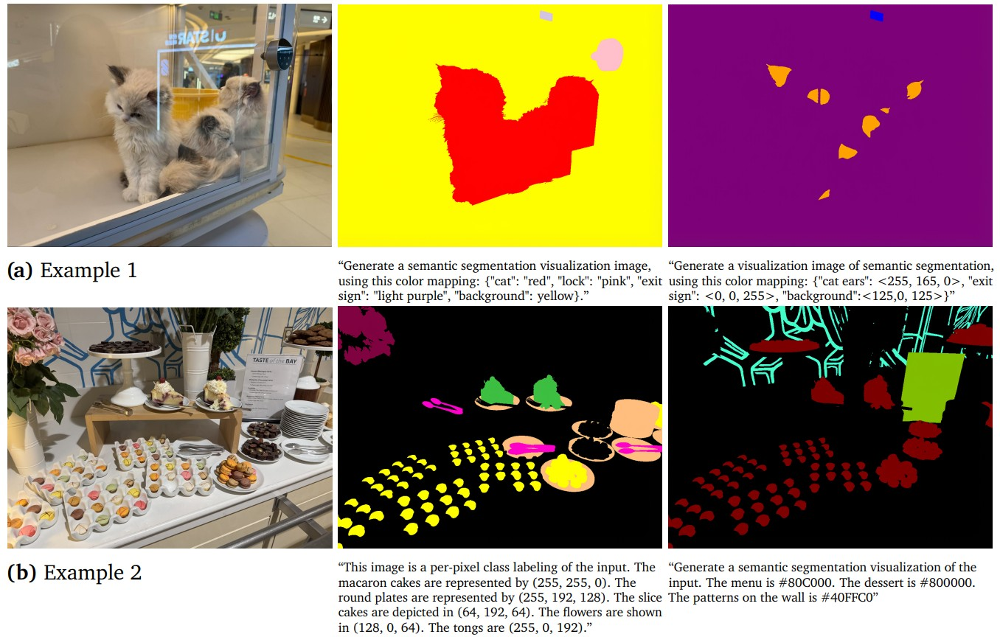
</figure>
</div>

### Instance Segmentation

比較棘手的是 instance segmentation，因為**事先不知道有幾個 instance**，所以沒辦法在 prompt 中先指定每個 instance 的顏色。

他們的解法是 **per-class inference**: 一次只 segment 一個 class，讓模型動態地給每個 instance 分配不同的顏色。

```
"Generate an instance segmentation visualization of this image.
Each piece of garlic is colored differently."
```

評估的時候就用 thresholding 來 cluster 顏色相近的 pixels。

結果在 SA-Co/Gold 上的 $pmF_1$ 是 0.540，跟 DINO-X 的 0.552 相近，但是還是輸給 SAM 3 (0.661)。作者承認 instance segmentation 仍然是個比較難的任務。

下圖是 Vision Banana 做 instance segmentation 的範例圖。

<div align="center">
<figure style={{"width": "60%"}}>
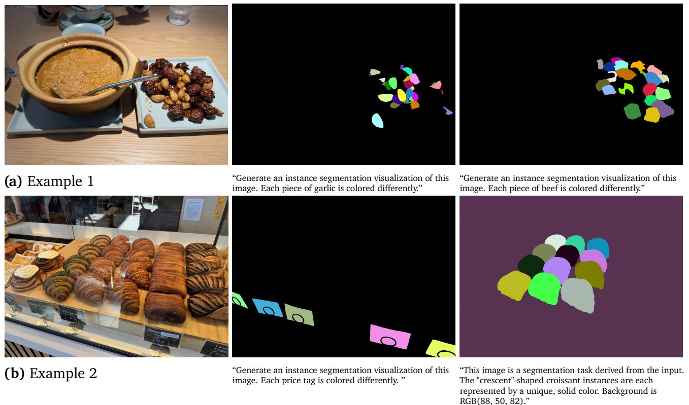
</figure>
</div>

### Referring Expression Segmentation

這個任務就更有趣了，因為它需要理解 free-form text query。例如「穿粉紅色 T-shirt 的男人」、「正在伸懶腰的貓」、「被當成遊戲控制器的烤吐司機」。

這正是 generative model 最大的優勢: **從預訓練繼承來的 multimodal intelligence 讓它能 reason 出 "要 segment 什麼"**。

結果在 ReasonSeg 上達到 0.793 gIoU，**贏過 SAM 3 Agent 的 0.770**，而且還是 zero-shot transfer。

有趣的是，即使沒有特別訓練 free-form text query，**Vision Banana 在 semantic 跟 instance segmentation 也能處理 referring expression**，例如他可以理解 "patterns on the wall"、"crescent-shaped croissants" 是在指什麼。這顯示了 cross-task transfer 的能力。

下圖是 Vision Banana 可以理解自然語言並解釋的範例，這張圖展示的是他能夠：

1. 描述一個物件的外觀（"man in pink t shirt"）
2. 描述一個物件的動作（"stretching" and "cleaning"）
3. 理解物件有不尋常的使用方法（toaster as a game controller）
4. 理解多語言的文字內容（text on the menu in Chinese and English）

<div align="center">
<figure style={{"width": "60%"}}>
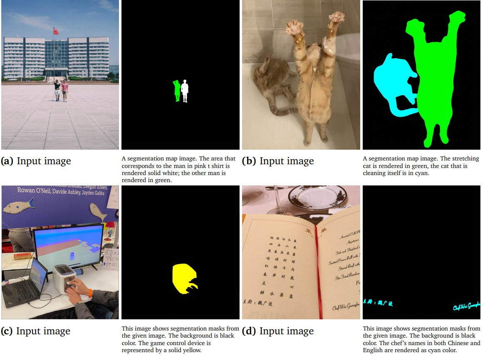
</figure>
</div>

## 3D Understanding

### Metric Depth Estimation

這是整篇論文裡我覺得最有意思的部分。Depth estimation 跟 segmentation 有個本質上的差異: depth 是一個 **unbounded 的連續值** $d \in [0, \infty)$，但 RGB color 是一個 **bounded 的 3D 空間** $[0, 1]^3$。要怎麼把前者編碼成後者?

他們設計了一個**可逆 (bijective)** 的 mapping:

**Step 1**：用 [Barron (2025) 的 power transform](https://arxiv.org/abs/2502.10647) 把 unbounded depth 壓縮成 bounded:

$$f(d, \lambda, c) = 1 - (1 - d/\lambda c)^{\lambda+1}$$

其中 $\lambda = -3, c = 10/3$。這個 transform 的特性是 **near-field 的 resolution 比 far-field 高**，因為對機器人或 AR/VR 來說，近處的物體比較重要。

**Step 2**：把這個 normalized distance $\in [0, 1)$ 沿著 RGB cube 的邊做 **piecewise-linear interpolation**，路徑很像第一階的 3D Hilbert curve，從黑色 (0,0,0) 走到白色 (1,1,1)。

<div align="center">
<figure style={{"width": "60%"}}>
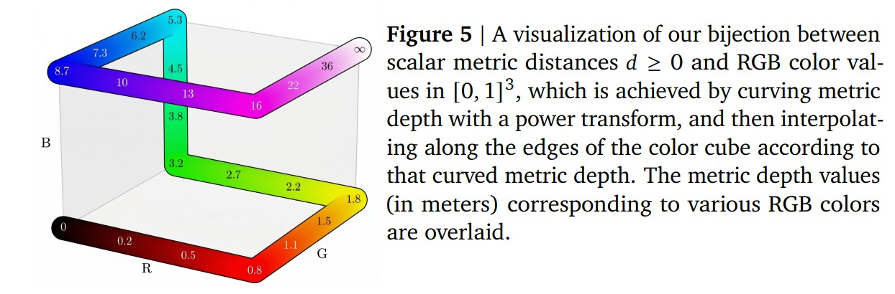
</figure>
</div>

這個 mapping 是**可逆的**，所以他們:

- training 時把 ground-truth depth 透過這個 mapping 變成 RGB image，作為訓練 target
- inference 時把模型生成的 RGB image **投影到最近的 cube edge**，然後反推回 metric depth

結果在 6 個 benchmark 上的 average $\delta_1$ accuracy 是 0.882，**贏過 Depth Anything v3** (在他們共同的 4 個 dataset 上 0.929 vs 0.918)，而且**完全沒用到 camera intrinsics**，也**沒用任何 real-world depth data**（全是 synthetic）。

<div align="center">
<figure style={{"width": "80%"}}>
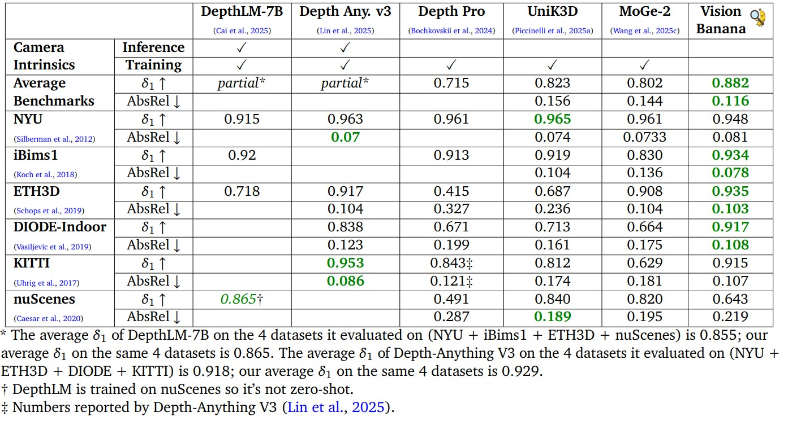
</figure>
</div>

下圖是 Vision Banana 在 metric depth estimation 的範例。

<div align="center">
<figure style={{"width": "60%"}}>
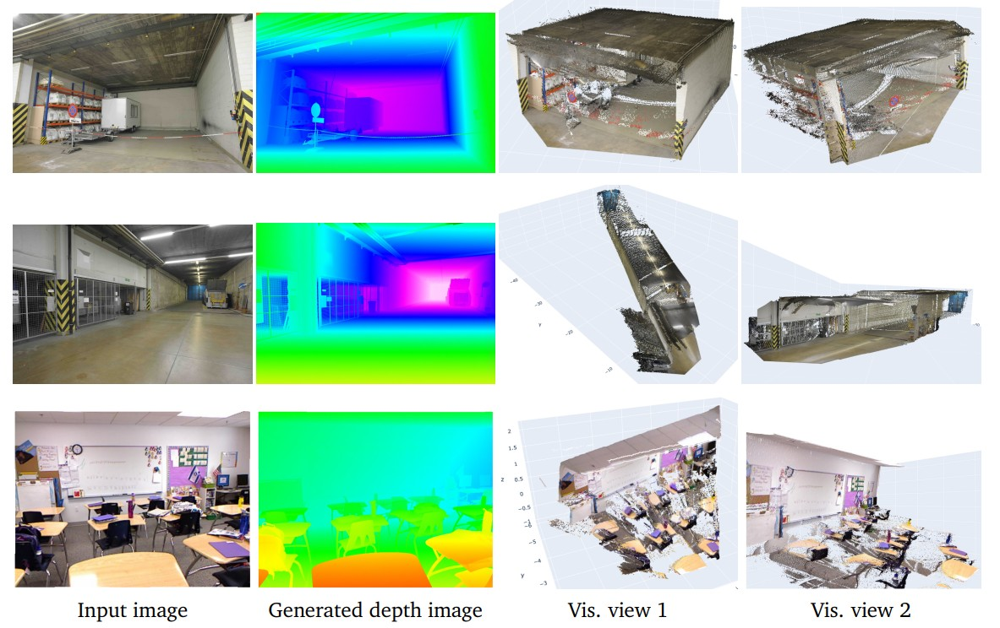
</figure>
</div>

論文裡還有個有趣的 "vibe test": 作者去金閣寺拍了張照片，Vision Banana 估出綠色標記點的距離是 13.71 公尺，用 Google Maps 量出來實際是 12.87 公尺，AbsRel error 約 0.065。

<div align="center">
<figure style={{"width": "60%"}}>
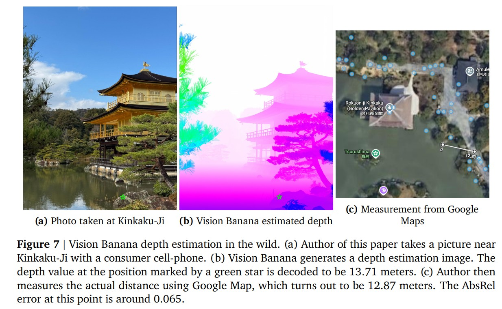
</figure>
</div>

### Surface Normal Estimation

Surface normal 是個 unit vector $(x, y, z) \in [-1, 1]^3$，跟 RGB 的對應關係非常自然，所以不需要像 depth 那樣設計複雜的 mapping。直接用 camera-space normal:

- Facing Left $(-1, 0, 0)$: Pinkish Red
- Facing Up $(0, 1, 0)$: Light Green
- Facing Camera $(0, 0, 1)$: Light Blue / Purple

在三個 indoor dataset 上的 mean / median angle error 都是最低，贏過 Lotus-2、StableNormal、DSINE 這些專家模型。

<div align="center">
<figure style={{"width": "80%"}}>
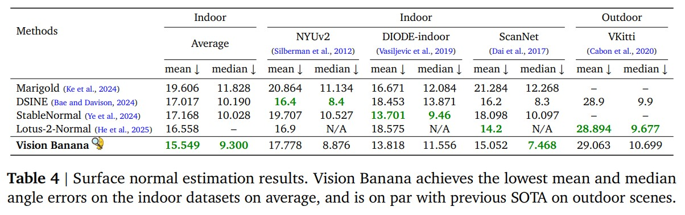
</figure>
</div>

下圖是 Vision Banana 在 Surface Normal Estimation 的範例。

<div align="center">
<figure style={{"width": "60%"}}>
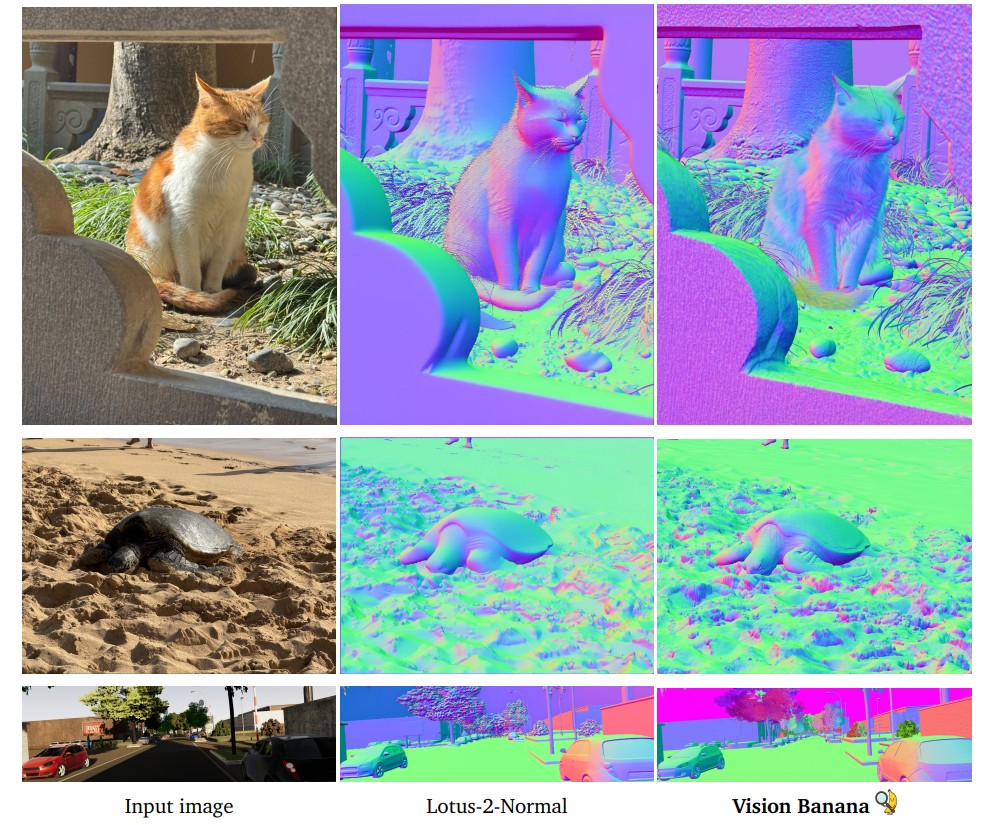
</figure>
</div>

## 保留 Generation 能力

做了 instruction tuning 之後，原本的 image generation 能力會不會被破壞?

- text-to-image (GenAI-Bench): vs Nano Banana Pro 的 win rate 為 **53.5%**
- image editing (ImgEdit): win rate 為 **47.8%**

也就是說 Vision Banana 跟原本的 base model 在生成任務上是**平手**的，instruction tuning 確實是 lightweight 的。

## Conclusion

1. **Image generators 本身就是 generalist vision learners**：強大的 visual understanding 能力是在 generative pretraining 過程中**自然 emergent** 出來的，instruction tuning 只是把這些能力 "unlock" 出來，這跟當年 LLM 顛覆 NLP 領域的故事一致
2. **Image generation 可以作為 vision 的 universal interface**：就像 text generation 是 NLP 任務的 universal interface 一樣。所有 vision output（mask, depth, normal）都可以表達成 RGB image，prompt 中指定 visualization scheme 就可以做不同的任務
3. **生成模型天生擁有處理 ambiguity 的能力**：同一個 input 可能對應到多個合理的 output（例如 segmentation 中「哪一塊算是同一個 instance」是有多種合理答案的）。Discriminative model 為了避免 collapse 到 blurry mean 必須設計很 hacky 的 loss（例如 SAM 系列 output 多個 mask 但是只對其中一個算 loss），但是 generative model 本來就是在 model 整個 distribution 的，這個 ambiguity 會被自然處理
4. **Future work**：
    - 擴大 instruction-tuned 任務的多樣性，可能會 unlock 更多 cross-task generalization
    - 從 monocular 擴展到 multi-view、video input
    - 跟 LLM 的整合來做 cross-modality reasoning
    - 降低 inference cost，因為 image generator 相較輕量的 specialist model 重太多了

## Discussion

過去做 vision task 大家都各自設計專屬的架構：segmentation 要 mask decoder、depth 要 regression head、normal 要特殊的 loss function，每個任務都長得不一樣，模型之間沒辦法共享。但 Vision Banana 直接把所有 vision output 統一塑造成 RGB image，讓「圖片生成模型」本身就成了所有視覺任務的 universal interface，這個想法跟當年 GPT 把所有 NLP 任務統一成 text generation 是同一個味道，真的很有潛力。

特別是 metric depth 的設計（power transform + RGB cube 邊上的 piecewise-linear interpolation）我覺得是整篇最巧妙的地方，它解決了過去用 generation model 做 vision task 最大的痛點：生成出來的東西沒辦法被精確 decode 回 metric value 來做 benchmark。沒有這個 invertible mapping，再好看的 depth visualization 也只能停留在 qualitative 階段。

另外 generative model 天然處理 ambiguity 這點也很值得想：discriminative model 為了不 collapse 到 blurry mean，要設計各種 hacky 的 loss（SAM 系列 output 多個 mask 但是只對其中一個算 loss 就是個典型例子），但 generative model 本來就是在 model 整個 distribution 的，這個問題會被自然地解掉。

## 心得

看完這篇論文，我覺得 Vision Banana 的貢獻更多是體現在**問題的 reframing**，而不是新的演算法或架構創新。

它沒有發明新的 loss、沒有新的 module、沒有新的 architecture，純粹就是把「vision task 的輸出格式」這件事情重新想了一遍，發現只要設計得當的可逆 RGB encoding，加上一個強大的 image generator base model，就能在沒有 specialized architecture 的情況下贏過各種 specialist。

這個方向我覺得是接下來幾年 vision foundation model 很可能的主流路線，generative pretraining 的 emergent visual understanding 能力應該會越來越被重視，配合像 RGB 這種 universal output format，未來說不定真的會出現一個能做所有 vision task 的 omni model。

當然 inference cost 還是個現實問題，目前 Vision Banana 那種等級的模型應該不會直接被部署到手機或邊緣裝置上，但這就是 future work 要解的事了。
