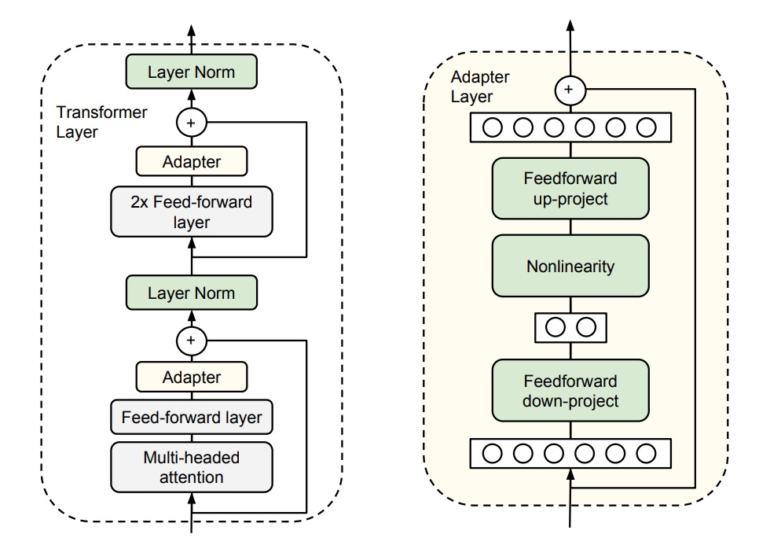
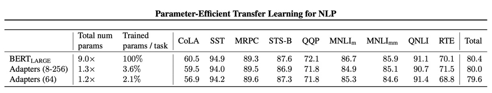
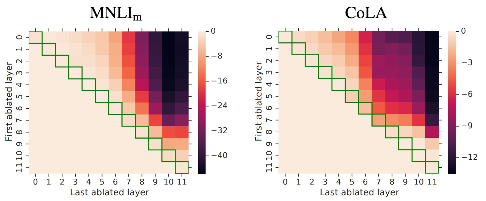

# [19.02] Adapter

## 參數節省九成六

[**Parameter-Efficient Transfer Learning for NLP**](https://arxiv.org/abs/1902.00751)

---

:::info
以下內容由 ChatGPT-4 彙整，並經過人工校對編輯與補充說明。
:::

---

BERT 提出後，定調的 NLP 的學習範式：

- **我們必須先用「大量」資料訓練一個「大型」模型，然後再進行微調。**

只要你遵守這個學習範式，你就能在各種 NLP 任務上取得最佳表現。

## 定義問題

本論文的作者認為這件事有個顯而易見的問題：

### 浪費！

回想一下，在目標任務上，我們是不是必須拿整個預訓練模型來微調？

- 即使我們只需要改變其中一小部分。

所以，如果我們想解決十個不同的任務，我們就必須訓練十個不同的模型？

- 即使這些任務之間有很多共通之處。

明明有很多共通之處，為什麼我們還要浪費這麼多資源？

## 解決問題

這裡，我們需要的東西不多，只是給每個任務一個小小的「Adapter」。

作者在現有的 Transformer 架構中加入了一些小但高效的 Adapter 模組，這些 Adapter 的目的是在不增加太多額外參數的情況下，提高模型的表現。

這裡請搭配上圖看一下，具體來說，作者在 Transformer 的每一層後面加上了兩個 Adapter 模組。

- **第一個加在 Self-Attention 之後，LayerNorm 之前。**
- **第二個加在 Feed-Forward 之後，LayerNorm 之前。**

每個 Adapter 模組的工作方式就像一個小型的神經網路，先將原始的高維特徵壓縮到較低維度，再應用非線性轉換，最後再轉換回原來的高維度。

這樣的設計就是我們以前常在 MobileNet 或 SqueezeNet 等輕量級模型中看到的「瓶頸」的設計，這種設計有兩個好處：

- **節省參數：** 這樣的設計只需要原模型大約 0.5% - 8% 的參數量。
- **壓縮特徵：** 透過特徵壓縮，提高特徵的表達能力。

另外，為了確保每個 Adapter 模組能夠順利運作，作者還為每個 Adapter 模組內部加入了一個「跳躍連接」，這樣一來，如果 Adapter 模組初始化的參數接近於零，它們就會像恆等函數一樣不會影響原來的輸出，保證了穩定性。

在模型訓練時，我們只需要針對「 Adapter 模組」的參數進行訓練，其他參數都直接凍結即可，不需要進行更新。

## 討論

### GLUE 評價

作者在 GLUE 驗證集上進行了實驗。

結果顯示：這種 Adapter 模組的設計確實能夠在不增加太多參數的情況下，提高模型的表現。

上面表格中有分兩種實驗設計：

- **第一組實驗 (8-256)**：這個設計是針對不同任務設計不同的 Adapter 模組，其特徵維度（瓶頸中的單元數量）在 「8, 64, 256」 三選一。
- **第二組實驗 (64)**：這個的設計是針對所有任務使用相同的 Adapter 模組，其特徵維度都是 64。

最後，由於訓練不穩定，作者使用不同的隨機種子重新運行 5 次，並在驗證集上選擇最佳模型。

從上面的表格中， Adapter 的平均 GLUE 得分為 80.0，而「完全微調」的平均得分為 80.4。雖然 Adapter 的表現略遜於「完全微調」，但是 Adapter 的參數量只有「完全微調」的 3.6%，這樣的效果已經非常驚人了。

:::tip
從此以後我們用小顯卡也可以微調大模型！好棒！
:::

### 消融實驗

為了檢驗 Adapter 模組的有效性，作者進行了一系列的消融實驗。

這是熱圖，顯示了從連續層跨度中移除 Adapter 時效能的變化。

:::tip
這個圖第一次看可能有點複雜，我們帶你看一下：

- **看 Row0**
  - 這時 First ablated layer 等於 0，也就是從第 0 層開始移除 Adapter。
- **接著看 Row0，和 Column0**
  - 此時 Last ablated layer 等於 0，也就是只移除第 0 層的 Adapter。
- **接著看 Row0，和 Column1**
  - 此時 Last ablated layer 等於 1，也就是移除第 0 層「至」第 1 層的 Adapter。
- **接著看 Row0，和 Column11**
  - 此時 Last ablated layer 等於 11，也就是移除第 0 層「至」第 11 層的 Adapter。
- **接著看 Row5，和 Column8**
  - 此時 First ablated layer 等於 5；Last ablated layer 等於 8，也就是移除第 5 層「至」第 8 層的 Adapter。

相信你已經看懂了，這個圖就是用來看從不同層次移除 Adapter 時效能的變化，每個格子的顏色代表效能的變化，愈深色代表效能愈差。

這張圖看上三角的部分即可，下三角沒有意義。
:::

實驗結果展示了 Adapter 整體結果：

1. **移除層影響**：

   - 移除單層的 Adapter 對整體效能影響不大，最大減少只有 2%。
   - 但如果移除所有 Adapter，效能會大幅下降，在 MNLI 上降到 37%，在 CoLA 上降到 69%。

2. **高低層影響**：

   - 低層 Adapter（例如 0-4 層）的影響較小，移除它們幾乎不影響效能。
   - 高層 Adapter 對效能影響更大，這符合直覺，因為高層 Adapter 負責特定任務的特徵建構。

3. **初始化尺度**：

   - Adapter 的初始化標準差低於 0.01 時，效能穩健。
   - 初始化標準差過大會導致效能下降，尤其在 CoLA 數據集上。

4. **瓶頸特徵大小**： 特徵尺寸在 8、64 和 256 時，效能相對穩定。

5. **架構擴展**：添加 BatchNorm 或 LayerNorm、增加 Adapter 層數、更換激活函數（例如：tanh）、僅在注意層內插入 Adapter 等方法沒有顯著提升效能。

因此，作者推薦最原始的 Adapter 的設計，因為它既簡單又有效，不用傷腦筋。

## 結論

Adapter 模組的設計理念，就像是在模型中加了一些小而高效的插件，只需很少的參數，大約 0.5% 至 8%，就能讓模型效能遷移到我們的目標任務上。例如一個 30B 參數量的模型，只需要 0.15 ~ 2.4 B 的參數量就能達到相同的效果。

能夠讓沒有算力的普通人也能輕鬆微調大型 Transformer 模型，從各方面來說，都是個非常好的消息！
