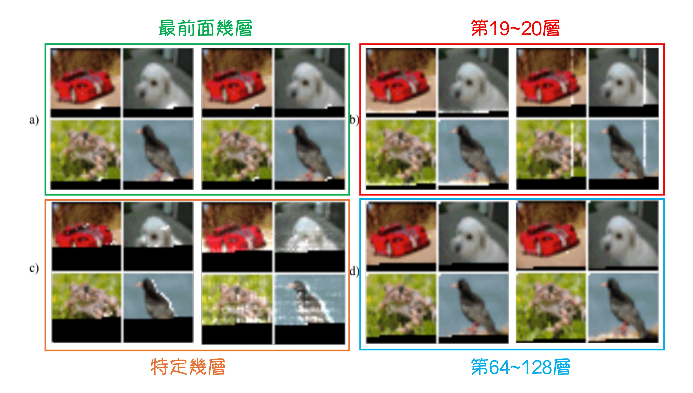

# [19.04] Sparse Transformer

## 稀疏注意力機制

[**Generating Long Sequences with Sparse Transformers**](https://arxiv.org/abs/1904.10509)

---

:::info
以下內容由 ChatGPT-4 彙整，並經過人工校對編輯與補充說明。
:::

---

Transformer 的自注意力機制的計算複雜度為 $O(n^2)$。

當任何一個演算法的計算複雜度出現這種情況時，都意味著其中有非常大量的優化空間。

OpenAI 在基礎研究上做了非常多的努力，其中一個就是本篇論文所提出的 Sparse Transformer。

## 定義問題

為了研究原本的 Transformer 模型在實際場景中，注意力機制是如何運作的，研究者首先做了一個影像生成模型。

這個模型是基於 Decoder-Only 的 Transformer 架構，將影像切分為 Patch，然後將這些 Patch 作為輸入序列，並透過 Transformer 生成影像。

模型有 128 層，在 CIFAR-10 資料集上訓練，實驗結果如上圖，這張圖在這篇論文中非常重要，這是本研究的起點。

---

在上圖中，你會看到一些白色的光斑，這是作者將模型的注意力圖可視化後得到的結果。黑色的部分是還沒有解碼的部分，所以你看到黑色的交界處，就是此刻的「正在解碼的 Token」，而白色的光斑這是這個「正在解碼的 Token」所關注的範圍。

這裡分為幾個部分進行分析：

### 最前面的幾層

在最前面的幾層，模型的注意力範圍環繞在「正在解碼的 Token」周圍，這像是卷積神經網絡的感受野。

:::tip
不是我們擷取的影像解析度很低，而是因為 CIFAR-10 的影像解析度就是 32x32。
:::

### 第 19~20 層

在第 19 層和第 20 層，網路學會了將注意力分散到行注意力和列注意力上，從而有效地分解全局注意力計算。

### 不特定幾層

在有些層，注意力範圍非常大，這意味著這些層有全局的視野。

### 第 64~128 層

這里佔據了模型一半的層數，在後半部分。

可以發現，這些層的注意力高度稀疏，幾乎沒有被激活。

:::info
OpenAI 有提供動態圖片展示：

- [**Sparse Transformer - OpenAI Blog**](https://openai.com/index/sparse-transformer/)
  :::

---

這種實驗結果，帶給我們的啟示是：

- **在 Transformer 中，注意力機制並不是所有 Token 都需要關注所有 Token，不斷地堆疊全局注意力是非常浪費的行為。**

## 解決問題

解決問題的思路就是：我們需要一個機制，讓模型能夠選擇性地關注某些 Token，而不是所有 Token。

在上圖 (a) 中，指的是原本的 Transformer，而 (b) 和 (c) 是作者嘗試使用的 Sparse Transformer 的架構。上面的小圖指的是在圖上的注意力分佈，大圖是把這些注意力攤平成 N x N 的矩陣。

你可能會注意到上三角的部分呈現空白，因為這是一個 Decoder-Only 的模型，所以每個 Token 只需要關注自己之前的 Token。

### 解題思路 1: 固定步長

也就是上圖 (b) 中的架構，這個架構參考了剛才所提到的實驗結果：

- 我們可能需要關注的是前面幾個 Token，即 Row 的部分。
- 我們可能需要關注的是前 $a \times N$ 個 Token，即 Column 的部分（例如前 6, 18, 24,... 個）。

### 解題思路 2: 固定特定 Index 的 Token

也就是上圖 (c) 中的架構，因為「固定步長」的策略只對「圖像」這種有固定二維結構的資料有效。

當你的資料是文字或音訊，這種固定步長的策略就不太適用了，所以作者提出了這種「固定特定 Index 的 Token」的策略。

這個策略所期待的效果是將特定 Index 的 Token 作為類似「錨點」的感覺，讓模型可以先將資訊匯聚在這些「錨點」上，而後在堆疊層數的過程中達到近似全局注意力的效果。

### 修改後注意力機制

看懂上面的設計理念之後，論文中提到的數學式就變得非常直觀了：

1. **Attention**

   - $ \text{Attend}(X, S) = a(x_i, S_i), i \in \{1, \ldots, n\} $

2. **Attention weight function**

   - $ a(x_i, S_i) = \text{softmax} \left( \frac{(W_q x_i) (K_S)^T}{\sqrt{d}} \right) V_S $

3. **Key and Value**

   - $ K_S = W_k x_j, j \in S_i $
   - $ V_S = W_v x_j, j \in S_i $

其中， $W_q$, $W_k$, 和 $W_v$ 分別代表查詢 (Query)、鍵 (Key) 和值 (Value) 的權重矩陣。

簡單來說，就是把原本的注意力機制中，從中挑出特定的 Token 來計算注意力權重。

### 其他優化

除了上面提到的注意力機制的優化，論文中還提到了一些其他的優化方法：

1. **引入 Checkpointing 的技術**

   梯度檢查點技術的基本原理是，在前向傳播的過程中，並不會保存所有的中間活化值。相反，它只保存一部分關鍵的激活值。在反向傳播時，根據保留的激活值重新計算丟棄的中間激活值。因此記憶體的使用量會下降，但計算量會增加，因為需要重新計算一些前向傳播的部分。

   這個技術來自於這篇論文：

   - [**Training deep nets with sublinear memory cost (2016.04)**](https://arxiv.org/abs/1604.06174)

   這個技術的目的是為了減少模型的記憶體使用量，讓模型可以訓練更深的網絡。

2. **Position Embedding 的重要性**

   作者發現使用能夠編碼數據結構注意力模式的 Position Embedding 對模型的性能非常重要。

   - **對於圖像數據**

     作者使用 $d_{\text{data}} = 3$，對應於每個輸入 Token 的行、列和通道位置。

   - **對於文本和音頻數據**

     作者使用 $d_{\text{attn}} = 2$，索引對應於矩陣中每個位置的行和列索引。

   這樣的 Embedding 方法確保了模型能夠有效地捕捉到不同數據類型的空間或結構信息，從而提升了模型的整體性能。

3. **混合精度**

   作者以單精度浮點儲存網路權重，但以半精度計算網路活化和梯度。在梯度計算過程中，使用動態損失縮放來減少數值下溢，並且在跨多個 GPU 求平均值時傳遞半精度梯度。採樣時，將查詢和鍵轉換為單精度，因為查詢鍵乘積有時會溢出半精度的最大值。

### 訓練設定

- 使用 Adam 優化器。
- 進行 5000 次迭代的線性預熱 (linear warm-up)。
- 使用 1.0 的梯度裁剪 (gradient clipping)。
- 使用 0.01 的權重衰減懲罰 (weight decay penalty)。
- 根據餘弦衰減 (cosine decay) 對學習率進行退火 (參考 Radford et al., 2018)。
- 預設在 8 個 V100 GPU 上進行訓練。
- 從 $ \mathcal{N}(0, \sqrt{0.125/d}) $ 初始化內容嵌入 $ W_e $。
- 從 $ \mathcal{N}(0, \sqrt{0.125 / ( d \cdot n\_{emb} ))}) $ 初始化位置嵌入。
- 在注意力和 FFN 組件中的所有 Bias 均初始化為 0。
- 所有權重均從 $ \mathcal{N}(0, \sqrt{0.125/d\_{\text{in}}})$ 初始化。
- 輸出 logits 的權重矩陣初始化為 0。

## 討論

### CIFAR-10

測試集上達到 2.80 Bits per byte，超越了之前的最先進水平 2.85。

- **模型配置**：
  - 2 個頭（heads）
  - 128 層
  - 嵌入維度 $d = 256$
  - 半尺寸前饋網路和查詢鍵投影
- **訓練參數**：
  - 學習率：0.00035
  - Dropout 率：0.25
  - 訓練 120 個 epoch，直到驗證誤差停止減少
- **數據劃分**：
  - 訓練集：48000 個樣本
  - 驗證集：2000 個樣本

### EnWik8

模型達到 0.99 Bits per byte，超越了類似尺寸的 Transformer-XL 的最先進水平 1.03，並與使用兩倍以上參數訓練的模型的 0.99 持平。

- **模型配置**：
  - 30 層（Fixed）
  - 8 個頭（heads）
  - 嵌入維度 $d = 512$
  - Dropout 率：0.40
- **訓練參數**：
  - 訓練 80 個 epoch，直到驗證損失停止減少
  - 上下文長度：12,288
  - 步長：128
- **數據劃分**：
  - 訓練集：前 9000 萬個 Token
  - 驗證集和測試集：最後 1000 萬個 Token

### ImageNet 64x64

為了測試模型學習長範圍依賴性和擴展到大型資料集的能力，作者在下採樣 ImageNet 版本上進行訓練，並在驗證集上進行評估。

模型在驗證集上達到 3.44 Bits per byte，相比先前的 3.52 有提升。

在視覺評估中，作者在大多數圖像中看到了長期結構的證據。

- **模型配置**：
  - 48 層（Strided）
  - 16 個頭（heads）
  - 嵌入維度 $d = 512$
  - 總參數量：1.52 億
- **訓練參數**：
  - 步長：128
  - Dropout 率：0.01
  - 訓練 70 個 epoch
  - 使用 64 個 V100 GPU，訓練時間為 7 天

## 結論

Sparse Transformer 展示了在多種數據類型（包括自然圖像、文本和原始音訊）上的應用效果，結果表明該模型在各個方面均達到了與原始的 Transformer 相同或更好的性能，同時顯著減少了計算操作。

該研究成果在之後的研究中得到了更廣泛的應用和發展，後續有很多研究項目都有提到，我們先把這篇論文讀起來放著，之後一定會再遇到的。
