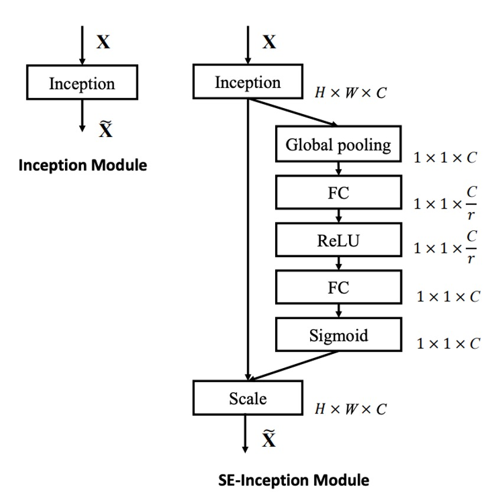
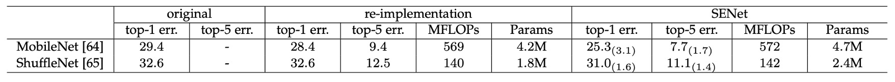

# [17.09] SENet

## 擠～～用力擠～～

[**Squeeze-and-Excitation Networks**](https://arxiv.org/abs/1709.01507)

---

這是個大家爭先恐後刷著 ImageNet 榜單的年代，各種網路架構層出不窮。

SENet 這個網路架構的提出，就是為了提升網路中不同通道間的全局相互關係，以提升網路的表現。

## 定義問題

在過去的研究中，一個觀察來自於 VGG 和 ResNet，它們說明了增加深度可以提高模型品質，還有殘差連接的方式，對於幫助網路學習更好的特徵非常有幫助。

另外一個觀察來自於分組卷積的自然演化，到後續的 Inception 系列，它們透過多分支的設計，提升了網路的表現。

這些研究其實反映出了一種假設，即：

- **網路通道間的關係可以表示為具有「局部」感受也的不可知函數的組合。**

而這個觀點正是作者認為有問題的地方：

- **為什麼我們只考慮了局部感受野，而沒有考慮全局感受野？**

## 解決問題

作者希望可以在網路的通道間引入全局的資訊，但是又不想增加太多計算量和參數。

因此，提出了 Squeeze-and-Excitation 模塊，在不增加太多計算量的情況下，引入全局的資訊。

### 模型架構


這也是個看程式比看論文更容易的網路架構。

在開始前，我們先實作一下吧：

```python
import torch
import torch.nn as nn

class SEBlock(nn.Module):

    def __init__(self, in_channels, reduction_ratio=16):
        super(SEBlock, self).__init__()
        self.squeeze = nn.AdaptiveAvgPool2d(1)
        self.excitation = nn.Sequential(
            nn.Conv2d(in_channels, in_channels // reduction_ratio, kernel_size=1, stride=1, padding=0, bias=False),
            nn.ReLU(),
            nn.Conv2d(in_channels // reduction_ratio, in_channels, kernel_size=1, stride=1, padding=0, bias=False),
            nn.Sigmoid()
        )

    def forward(self, x: torch.Tensor) -> torch.Tensor:
        # x: (B, C, H, W)

        # (B, C, H, W) -> (B, C, 1, 1)
        out = self.squeeze(x)

        # (B, C, 1, 1) -> (B, C//16, 1, 1) -> (B, C, 1, 1)
        out = self.excitation(out)

        # (B, C, H, W) * (B, C, 1, 1) -> (B, C, H, W)
        return x * out
```

是不是？看程式比看論文簡單多了！

在 SENet 中，引入全局資訊的方法就是透過 Global Average Pooling。

將特徵圖的每個通道的特徵值平均起來，然後通過一個全連接層，得到每個通道的重要性權重。

雖然這樣的全局資訊其實沒有很多，但是在實驗中證明，這樣的設計可以提升網路的表現。

:::tip
我們使用 1x1 卷積來實現全連接層，這樣可以不用在那邊 permute 和 reshape，省事。
:::

接下來，看完程式碼之後，回來看一下作者畫的圖吧：



如圖，在 SENet 中，步驟依序是：

1. **Global Pooling**：全局資訊。
2. **FC**： 降維。
3. **ReLU**：引入非線性特性。
4. **FC**：升維。
5. **Sigmoid**：得到每個通道的重要性權重。

這裡選用 `Sigmoid` 是因為作者希望每個通道間不要成競爭關係，而是要互相組合。

所以只需要考慮每個通道要留或不留（即權重）就好，不需要產生互相抑制的競爭關係。

## 討論

### 影像分類效果展示


SENet 可以安插到任何網路中，並且不會增加太多的參數量。

以 ResNet-50 和 SE-ResNet-50 之間的比較為例：

對於 224 × 224 像素輸入影像，ResNet-50 在單次前向傳遞中大約需要 3.86 GFLOP 的運算量。

每個 SE 區塊在擠壓階段使用全域平均池化操作，在激勵階段使用兩個小型 FC 層。當縮減率設定為 16 時，SE-ResNet-50 需要約 3.87 GFLOP 運算量，相當於比原始 ResNet-50 相對增加了 0.26%。

參數量的部分則是增加了約 10%，這個沒有在表格內，是寫在論文裡的。

參數量增加了一點，換來的效果是讓原本 ResNet-50 直追 ResNet-101 的表現。

:::info
作者分析參數量大多增加在網路的末段，如果移除末段的全連接層，則參數量增加的幅度會降低為 4%，同時在 ImageNet top-5 的精度會降低 0.1%。
:::

### 輕量模型效果展示



將 SENet 應用在 MobileNet 的效果也是非常好，在 ImageNet 上的 top-1 錯誤率下降了 3.1%。

在 ShuffleNet 上的效果也是非常好，top-1 錯誤率下降了 1.6%。

:::tip
差一點就要做出 MobileNet-V3 了。（？？？）
:::

### Squeeze 的重要性


作者將 SENet 的 Squeeze 的部分移除，發現還是有效果！

但比較沒有那麼讓人驚艷，使用 Squeeze 時，可以提升 1.02%，移除之後只剩提升 0.37%。

### Excitation 的重要性


作者研究了不同類別（如金魚、哈巴狗、飛機、懸崖）在網路不同層次的啟動分佈，整理出幾個結論：

- 在網路早期層次中，不同類別的啟動分佈相似，但在更深層次，活化值開始變得更加類別特異性。
- 在網路的深層（如 SE_4_6 和 SE_5_1），特定通道的活化值顯示出強烈的類別偏好，說明 SE 模組在這些層中對特徵的判別有顯著作用。
- 在 SE_5_2 層觀察到許多活化值接近 1 的趨勢，這種情況下 SE 模組相當於一個恆等運算符，不再重新校準特徵。
- 在網路的末端，SE 模組的重要性降低，研究顯示移除這些模組只會導致邊際效能損失，但可以顯著減少參數數量。

這些觀察結果說明 SE 模組在不同網路層次中的作用是不同的，對於理解和優化深度學習模型中的特徵提取和處理極為重要。

### 其他實驗結果

作者還針對模型內的不同部分做了對應的實驗，整理出了一些結論：

1. 使用 `Signoid` 效果最好，`Tanh` 次之，`ReLU` 最差。
2. 使用 `AvgPool` 比 `MaxPool` 好。
3. 在 SE 模組內的 Reduction Ratio 設定為 16 有比較好的權橫。

詳細表格請讀者參考原論文，我們認為這一部分的實驗比較偏向於工程實踐，就不再一一列舉了。

## 結論

SENet 透過在網路中引入 SE 塊，有效地提升了網路的學習和泛化能力。

其關鍵貢獻在於將注意力機制以簡潔的方式整合到卷積網路中，使網路能夠更加聚焦於重要的特徵。

這種方法的成功證明了透過增強內部特徵的表達能力，可以顯著提高深度學習模型的表現。

:::tip
儘管 `Squeeze-and-Excitation` 模組在增加的運算成本方面相對較低，但在後續的許多研究中，發現該架構偶爾會成為效能瓶頸。

在部署到即時系統或運算資源極為有限的環境時，開發者仍需權衡其效能提升與額外運算負擔之間的關係。
:::
